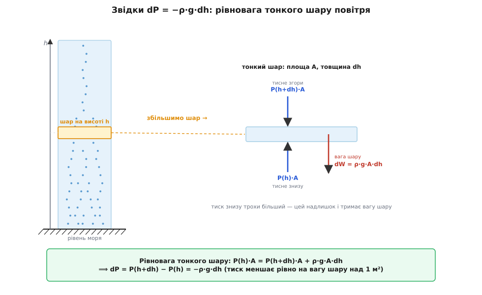
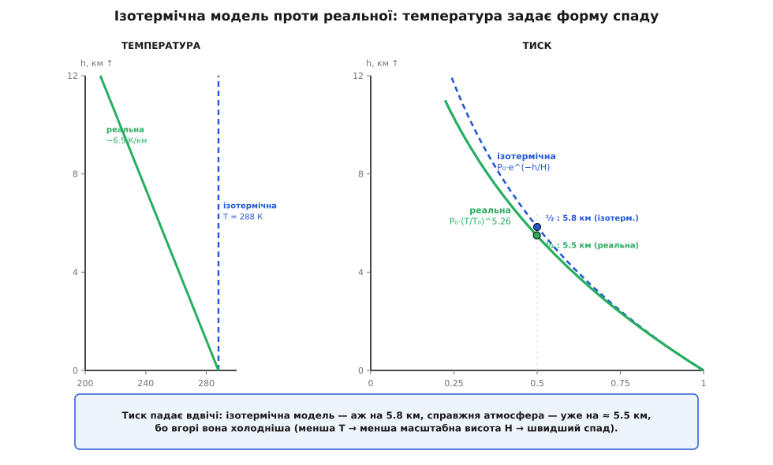

# 🧮 Барометрична формула: чому тиск падає саме експонентою

Формула P = P₀·e^(−h/H) виглядає так, ніби впала з неба готовою. Насправді вона не залишає собі вибору: варто записати одну умову рівноваги й підставити одну властивість газу — і експонента з'являється сама, крок за кроком, без жодного вгадування. Розберімо цей ланцюжок до останньої ланки. Спочатку з простого балансу сил народиться правило `dP = −ρ·g·dh`, спільне для будь-якої рідини й газу. Потім побачимо, що для нестисливого середовища воно дає нудну пряму, а для стисливого газу — ту саму експоненту. А наприкінці з'ясується найглибше: показник у ній — це відношення двох енергій, тяжіння й тепла, і саме через це формула тиску виявляється тим самим розподілом, що керує молекулами в будь-якому полі.

## Один шар повітря на терезах: dP = −ρ·g·dh

Уся будова атмосфери тримається на одній думці, і думка ця — про рівновагу. Візьмімо десь на висоті h тонесенький горизонтальний шар повітря: площа основи A, товщина зовсім мала — dh. Повітря стоїть на місці, нікуди не пришвидшується, отже за [другим законом Ньютона](root:ph-mechanics/newtons-second-law) сума сил на цей шар дорівнює нулю. Порахуймо ті сили.

Знизу в шар упирається тиск нижчого повітря — сила P(h)·A, напрямлена **вгору**. Згори на шар тисне повітря над ним — сила P(h+dh)·A, напрямлена **вниз**. І сам шар має [вагу](root:ph-mechanics/free-fall): маса шару це густина на об'єм, ρ·A·dh, а вага — та маса на g, тобто ρ·g·A·dh, теж **вниз**. Три сили, і вони мусять зрівноважитися:

```
знизу вгору     =     згори вниз    +      вага
P(h)·A          =     P(h+dh)·A     +      ρ·g·A·dh
```

Площа A стоїть у кожному доданку — поділімо на неї й перенесімо тиски в один бік:

```
P(h+dh) − P(h)  =  −ρ·g·dh
```

Ліворуч — це і є зміна тиску на висоті dh, тобто dP. Маємо серце всієї гідростатики:

```
dP = −ρ·g·dh
```



*Тиск знизу трохи більший за тиск згори — рівно настільки, щоб надлишок сили втримав вагу шару. Ця крихітна різниця, поділена на товщину, і є dP = −ρ·g·dh.*

Знак мінус читається просто: піднімаєшся (dh > 0) — тиск меншає (dP < 0), бо над тобою лишається менше повітря. Величина спаду — вага стовпчика заввишки dh над одиницею площі. І зверніть увагу, чого тут **немає**: ми ніде не сказали, з якої речовини шар. Вода, ртуть, повітря, мед — правило `dP = −ρ·g·dh` однакове для всіх, бо це чистий Ньютон, а не властивість конкретної рідини. Уся різниця між водою та повітрям сховається в одному місці — у тому, що́ ми підставимо замість ρ.

## Якби повітря було нестисливе: пряма лінія й атмосфера з краєм

Найпростіший випадок — коли густина стала, ρ = ρ₀ = const. Так поводиться вода: стисни її хоч на кілометровій глибині — вона майже не ущільниться. Тоді в рівнянні `dP = −ρ₀·g·dh` праворуч усе стале, і тиск міняється з висотою **лінійно**:

```
P(h) = P₀ − ρ₀·g·h
```

Пряма й нічого більше. Занурюєшся у воду — на кожні 10 м додається приблизно атмосфера; піднімаєшся в такому «нестисливому повітрі» — тиск рівномірно тане. І тут ховається повчальний уявний дослід. Уявімо, що повітря зберігає свою приземну густину ρ₀ = 1.225 кг/м³ усюди, як вода. На якій висоті його тиск упав би до нуля?

**Висота однорідної атмосфери.** Прирівняймо P(h) до нуля: ρ₀·g·h = P₀.

```
h = P₀ / (ρ₀·g) = 101 325 / (1.225 · 9.81)
  = 101 325 / 12.02
  ≈ 8 430 м  ≈  8.4 км
```

**Висновок.** Нестислива атмосфера мала б **різкий край**: суцільне повітря завтовшки 8.4 км, а над ним — раптом чистий вакуум. Ніякої розрідженої стратосфери, ніякого поступового згасання. Запам'ятаймо це число — 8.4 км, «висота однорідної атмосфери». Реальна атмосфера ніякого краю не має, і зараз ми побачимо, чому — та як те саме число повернеться вже в іншій ролі.

## Повітря стисливе: густина сама залежить від тиску

Уся річ у тім, що повітря — **не** вода. Його густина не стала: там, де тиск менший, молекули розсунуті рідше, і ρ теж менша. Густина повітря — не константа, а функція самого тиску (і температури). Цей зв'язок дає [рівняння стану ідеального газу](root:ph-thermodynamics/ideal-gas-law). Запишімо його через густину. У формі PV = nRT ліва частина — тиск на об'єм, права — кількість речовини n на RT. Але n = маса / молярна маса = (ρ·V)/M, тож:

```
P·V = (ρ·V / M)·R·T     →     P = ρ·R·T / M
```

Звідси густина газу — це тиск, помножений на молярну масу, поділений на RT:

```
ρ = P·M / (R·T)
```

де M — молярна маса повітря (≈ 0.029 кг/моль для сухого повітря), R = 8.314 Дж/(моль·К) — універсальна газова стала, T — абсолютна температура. Ось той єдиний виріз, де вода й повітря розходяться. Підставмо цю густину прямо в гідростатичне правило:

```
dP = −ρ·g·dh = −(P·M / (R·T))·g·dh
```

Погляньмо, що сталося. Праворуч тепер стоїть **сам тиск P**. Швидкість, з якою тиск спадає, пропорційна тому, скільки тиску ще лишилося. Що вище й розрідженіше повітря — то повільніше воно рідшає далі. Тиск сам себе гальмує. А величина, темп зміни якої пропорційний їй самій, ніколи не спадає по прямій.

## Складання dP/P — і народжується експонента

Щоб побачити закон явно, зберімо все, що стосується P, в один бік, а висоту — в інший. Поділимо обидві частини на P:

```
dP / P = −(M·g / (R·T))·dh
```

Зліва — відносна зміна тиску, справа — стала (поки температуру вважаємо однаковою на всіх висотах — це так звана **ізотермічна** модель) на dh. Тепер складімо ці нескінченно малі кроки від землі (де тиск P₀) до висоти h — тобто візьмімо [інтеграл](root:math-analysis/integral) обох частин:

```
∫[P₀→P] dP/P  =  −(M·g / (R·T)) · ∫[0→h] dh
```

Праворуч усе просто: стала на h. А ліворуч — особлива сума. Функція, чия похідна дорівнює 1/P, одна-єдина: це [натуральний логарифм](root:math-analysis/logarithms). Тому первісна від dP/P є ln P, а визначений інтеграл — різниця логарифмів на кінцях:

```
ln P − ln P₀  =  ln(P/P₀)  =  −(M·g / (R·T)) · h
```

Лишилося зняти логарифм — піднести e в обидві частини. За означенням, e^(ln x) = x, тож ліворуч лишається чисте P/P₀:

```
P(h) = P₀ · e^(−M·g·h / (R·T))
```

Ось вона, барометрична формула. Логарифм тут не примха запису — він неминучий. Перепишімо вихідне рівняння інакше, позначивши сталу групу як 1/H:

```
dP/dh = −P/H,      де   H = R·T / (M·g)
```

Це рівняння каже: «швидкість спаду дорівнює самій величині, поділеній на сталу». Єдина функція, що так поводиться, — [експонента](root:math-analysis/exponential-ode); те саме рівняння керує розпадом радіоактивних ядер, розрядом конденсатора крізь опір, охолодженням чашки чаю. Атмосферний тиск — просто ще один його розв'язок. Записавши H, дістаємо найкоротшу форму:

```
P(h) = P₀ · e^(−h/H)
```

## Масштабна висота: що таке ці 8.4 кілометри

Уся фізика стисла в одну величину H = R·T/(M·g) — її звуть **масштабною висотою** (англ. *scale height*). Порахуймо її для приземного повітря.

**Масштабна висота земного повітря.** Візьмімо T = 288 К (15 °C), M = 0.02896 кг/моль, g = 9.81 м/с².

```
H = R·T / (M·g) = (8.314 · 288) / (0.02896 · 9.81)
  = 2394 / 0.2841
  ≈ 8 430 м  ≈  8.4 км
```

**Висновок.** Знову 8.4 км — те саме число, що й «висота однорідної атмосфери». Це не збіг: H = P₀/(ρ₀·g), бо для приземного повітря ρ₀ = P₀·M/(R·T), і при підстановці P₀ скорочується. Масштабна висота — це висота, на якій уся атмосфера вмістилася б, якби зберігала приземну густину. Тільки тепер вона грає роль не «краю», а мірила згасання.

У масштабної висоти є три способи прочитання, і кожен щось прояснює:

- **Множник 1/e на кожні H.** Піднявшись на одну H, тиск меншає в e ≈ 2.72 раза (до ≈ 37 %), на дві H — у e² (до ≈ 14 %), і так далі. Стала [e](root:math-analysis/e-number) тут не випадкова гостя, а прямий наслідок того, що спад пропорційний самому тиску.
- **Нахил біля землі.** Дотична до кривої тиску при h = 0 перетинає нуль якраз на висоті H. Це і є та сама «нестислива» пряма з попереднього досліду: біля самої землі експонента й пряма збігаються, а розходяться вище.
- **Термометр висоти.** H прямо пропорційна температурі: тепле повітря «пухкіше», його стовп вищий, і тиск спадає повільніше; холодне тисне ближче до землі.

Часто зручніше говорити не про множник 1/e, а про «на скільки тиск падає **вдвічі**». Це висота H·ln2, бо e^(−ln2) = ½.

**Висота половинного тиску.**

```
h½ = H · ln2 = 8.43 · 0.693 ≈ 5.84 км
```

**Висновок.** За ізотермічною моделлю тиск мав би падати вдвічі на кожні ≈ 5.8 км. Наступний крок угору знову ділить його навпіл: 5.8 км — половина, 11.7 км — чверть, і так без кінця. Атмосфера ніколи не «закінчується» — вона нескінченно ділиться навпіл, дедалі непомітніше. Ось де взявся її розмитий верх замість різкого краю нестисливої моделі.

## Глибша причина: тяжіння проти теплового руху

Формула вже виведена, але варто спитати, що́ означає показник M·g·h/(R·T) по суті. Розділімо чисельник і знаменник на число Авоґадро Nₐ. Тоді M/Nₐ = m — маса **однієї** молекули, а R/Nₐ = k — стала Больцмана. Показник переписується так:

```
M·g·h / (R·T)  =  m·g·h / (k·T)
```

І тут відкривається суть. Чисельник m·g·h — це потенціальна енергія однієї молекули, піднятої на висоту h у полі тяжіння. Знаменник k·T — мірило її теплової енергії, енергії хаотичного руху. Барометрична формула набуває вигляду:

```
P(h) = P₀ · e^(−E_потенц / E_теплова),        n(h) = n₀ · e^(−m·g·h / (k·T))
```

Це **розподіл Больцмана** — той самий закон, що каже, скільки частинок опиниться в стані з енергією E за температури T. Атмосфера — його найнаочніший приклад. Іде вічне перетягування каната: тяжіння тягне молекули донизу, збиваючи їх у щільний шар біля землі, а тепловий рух розкидає їх угору, розмазуючи по висоті. Масштабна висота H = k·T/(m·g) — це якраз та висота, на якій потенціальна енергія молекули зрівнюється з її тепловою: доти тепло ще «підкидає» молекули вгору впорівні з тяжінням, вище — тяжіння перемагає, і повітря різко рідшає. Тепле повітря штовхає молекули вище (велика H), холодне притискає до землі (мала H). Уся барометрична формула — це баланс двох енергій, записаний одним показником.

Історично першу таку залежність — саме ізотермічну експоненту — вивів англійський астроном Едмонд Галлей ще 1686 року, спираючись на закон Бойля й гідростатику. Повнішу форму, з поправкою на спад температури вгору, дав П'єр-Симон Лаплас 1805-го; відтоді її часом звуть формулою Лапласа. А зв'язок із розподілом Больцмана проступив уже наприкінці XIX століття, коли Людвіг Больцман показав, що той самий експоненційний закон керує будь-якою системою частинок у полі, не лише повітрям.

## Чому виміряні 5.5, а не 5.8 кілометра

Ізотермічна модель дає гарне, зручне число: тиск падає вдвічі на 5.8 км. Але якщо піднятися з барометром по-справжньому, половина набіжить раніше — приблизно на 5.5 км. Розбіжність невелика, та вона не помилка, а підказка. Звідки вона?

Уся модель спиралася на одне сміливе припущення: температура однакова на всіх висотах. Насправді ж повітря вгорі холодніше — у тропосфері воно вихолоджується десь на 6.5 °C щокілометра. А ми щойно бачили: H пропорційна T. Холодніше повітря має меншу масштабну висоту, а отже, тисне ближче до землі й спадає **швидше**, ніж передбачає модель із приземними 288 К.

**Яка «ефективна» температура ховається за 5.5 км.** Обернімо зв'язок h½ = H·ln2 = (R·T/M·g)·ln2 і знайдімо T, що дало б половину саме на 5.5 км.

```
H = h½ / ln2 = 5.5 / 0.693 = 7.94 км
T = H·M·g / R = 7940 · 0.02896 · 9.81 / 8.314
  ≈ 271 К  ≈  −2 °C
```

**Висновок.** Виміряний спад відповідає середній температурі повітряного стовпа близько 271 К, а не приземних 288 К. І це логічно: тиск на висоті визначається всім стовпом повітря під нею, а той стовп загалом холодніший за землю, бо помітна його частина лежить високо й холодно. Ізотермічна формула з приземною T трохи завищує H — тому й переоцінює висоту половинного тиску на ті кількасот метрів.

## Реальна атмосфера: температурний градієнт і степенева форма

Раз температура спадає з висотою, чесно буде це врахувати просто в інтегралі. Візьмімо найпростіший реалістичний профіль — лінійний спад, як у [стандартній атмосфері](root:ph-thermodynamics/standard-atmosphere):

```
T(h) = T₀ − L·h,        L ≈ 6.5 К/км   (температурний градієнт тропосфери)
```

Тепер у рівнянні `dP/P = −(M·g/R)·dh/T` знаменник T уже не сталий — під інтегралом сидить 1/(T₀ − L·h). Складімо кроки, як і раніше:

```
∫ dP/P  =  −(M·g/R) · ∫ dh / (T₀ − L·h)
```

Інтеграл праворуч — знову логарифм, тільки складеної функції: первісна від 1/(T₀ − L·h) дорівнює −(1/L)·ln(T₀ − L·h). Мінуси гасяться, і виходить:

```
ln(P/P₀)  =  (M·g / (R·L)) · ln( (T₀ − L·h) / T₀ )  =  (M·g / (R·L)) · ln(T/T₀)
```

Знімаємо логарифм — і замість експоненти народжується **степенева** залежність:

```
P(h) = P₀ · (T/T₀)^(M·g / (R·L))  =  P₀ · (1 − L·h/T₀)^(M·g / (R·L))
```

Показник M·g/(R·L) — чисте число, знамените в авіації. Порахуймо його.

**Показник степеневої формули.** M = 0.02896 кг/моль, g = 9.81 м/с², R = 8.314 Дж/(моль·К), L = 0.0065 К/м.

```
M·g / (R·L) = (0.02896 · 9.81) / (8.314 · 0.0065)
            = 0.2841 / 0.05404
            ≈ 5.26
```

**Висновок.** Це і є той самий показник 5.2559 з міжнародної стандартної атмосфери (точне значення — з еталонними g, M і R). Степенева форма P = P₀·(1 − L·h/T₀)^5.26 — не інша фізика, а та сама гідростатика з чеснішим припущенням про температуру. Ба більше: коли градієнт L прямує до нуля (температура вирівнюється), степенева формула плавно перетворюється на експоненту — ізотермічна модель виявляється її окремою межею, а не суперницею.

Погляньмо, наскільки дві моделі розходяться на висоті.



*Припущення про температуру задає форму спаду тиску. Стала T дає експоненту; реальний холод угорі трохи прискорює спад і перетворює її на степеневу криву.*

**Тиск на висоті тропопаузи (11 км), дві моделі.**

```
ізотермічна:   P = 101.3 · e^(−11 / 8.43) = 101.3 · e^(−1.305) = 101.3 · 0.271 ≈ 27.5 кПа

степенева:     T = 288.15 − 6.5·11 = 216.7 К
               P = 101.3 · (216.7 / 288.15)^5.256 = 101.3 · (0.752)^5.256
                 = 101.3 · 0.223 ≈ 22.6 кПа   (еталон ISA: 22.63 кПа)
```

**Висновок.** Біля землі обидві моделі майже збігаються, але до 11 км розбіжність сягає п'яти кілопаскалів: ізотермічна дає 27.5 кПа, степенева — 22.6 кПа, і саме друга лягає точно на офіційне значення стандартної атмосфери. Ось таблиця для кількох висот (частка від приземного тиску):

```
h, км     ізотермічна e^(−h/H)     степенева (T/T₀)^5.26
 0             1.00                     1.00
 2             0.79                     0.78
 5.5           0.52                     0.50
 8.85          0.35                     0.31      (вершина Евересту)
11             0.27                     0.22      (тропопауза)
```

Що вище — то дужче реальний холод «притискає» тиск нижче за ізотермічний прогноз. Жодна з двох ідеалізацій не описує справжнє небо ідеально — над конкретною горою температурний профіль свій, вологість своя, — але степенева з градієнтом 6.5 К/км тримається реальності значно ближче й тому лягла в основу авіаційних розрахунків.

## Що дає це виведення

За барометричною формулою стоїть напрочуд короткий кістяк. Один баланс сил на тонкий шар — `dP = −ρ·g·dh` — плюс одна властивість газу — `ρ = P·M/(R·T)` — плюс одне складання нескінченно малих кроків. Усе. А далі все вирішує єдине припущення про температуру: вважаєш її сталою — інтеграл дає експоненту P₀·e^(−h/H); дозволяєш їй спадати лінійно — той самий інтеграл дає степінь P₀·(T/T₀)^5.26. Змінюєш модель температури — змінюється форма кривої, і більше нічого вигадувати не треба.

А масштабна висота H = R·T/(M·g), навколо якої усе крутиться, виявляється не випадковим коефіцієнтом, а відношенням двох енергій: теплової k·T, що розкидає молекули вгору, до гравітаційної m·g, що осаджує їх донизу. Саме це відношення й вимірює висотомір, коли переводить тиск у метри; воно ж каже, чому в горах ріже кисню з кожним вдихом і чому салон літака доводиться накачувати повітрям. Одне рівняння рівноваги, один інтеграл — і ціла атмосфера прочитана від землі до тропопаузи.
