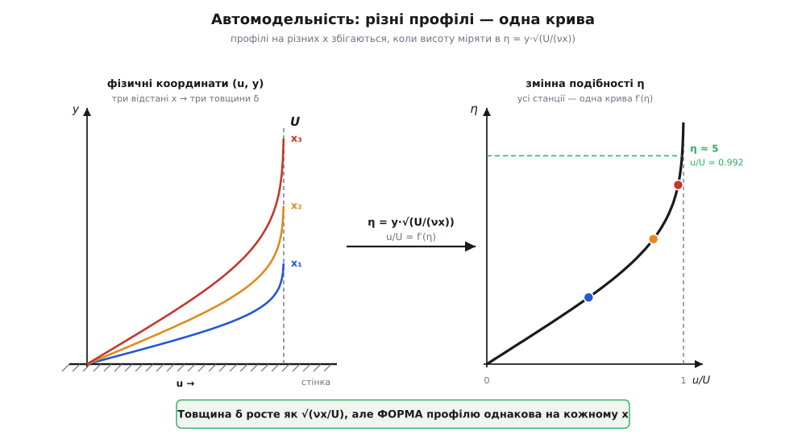
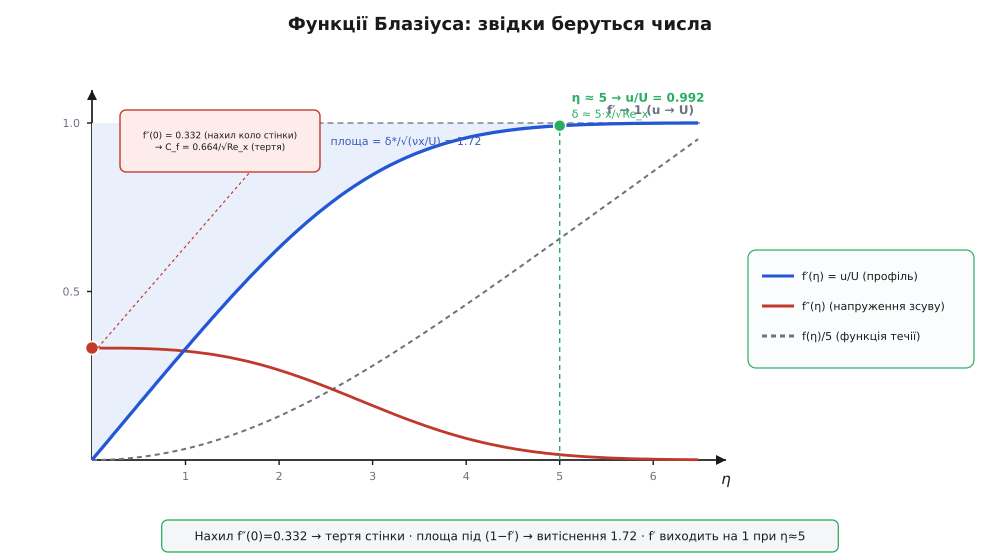

# 🧮 Математика примежового шару

Думка, що біля обшивки тиснеться тонка плівка загальмованої рідини, — гарна, але сама собою вона не дає жодного числа. Звідки береться коефіцієнт 5 у товщині шару? Звідки 0.664 у формулі тертя? Щоб ці числа з'явилися, хтось мусив пройти дорогу від повних рівнянь руху в'язкої рідини до конкретної цифри. Її намітив 1904 року Людвіг Прандтль, а до кінця дійшов його студент — німецький фізик Пауль Ріхард Гайнріх Блазіус (Paul Richard Heinrich Blasius, 1883–1970), який 1908 року, ще в Ґеттінґені під Прандтлем, звів усю задачу до **одного** звичайного диференціального рівняння, з якого кожен коефіцієнт випадає сам. (Це вже усталений факт історії механіки: рівняння й досі носить його ім'я.)

Дорога має три кроки. Спершу **оцінка порядків величин** стискає непідйомні рівняння Нав'є–Стокса до куди простіших рівнянь примежового шару. Тоді **автомодельність** згортає навіть їх — з рівняння в частинних похідних роблячи одне звичайне. І нарешті з розв'язку цього одного рівняння **вичитуються всі числа**. Пройдімо кожен крок, не пропускаючи, чому він працює.

## Крок перший: оцінка порядків стискає Нав'є–Стокса

Точний рух в'язкої нестисливої рідини описують [рівняння Нав'є–Стокса](topic:ph-mechanics/navier-stokes) — баланс інерції, тиску й [в'язкого](topic:ph-mechanics/viscosity) тертя в кожній точці. Для усталеної пласкої течії їх три: нерозривність (рідина нікуди не дівається) і два рівняння руху — вздовж стінки x і впоперек неї y.

```
нерозривність:  ∂u/∂x + ∂v/∂y = 0
рух по x:       u·∂u/∂x + v·∂u/∂y = −(1/ρ)·∂p/∂x + ν·(∂²u/∂x² + ∂²u/∂y²)
рух по y:       u·∂v/∂x + v·∂v/∂y = −(1/ρ)·∂p/∂y + ν·(∂²v/∂x² + ∂²v/∂y²)
```

Розв'язати це в лоб — задача, від якої досі відступають. Але Прандтль зробив не це. Він не став рівняння **розв'язувати** — він їх **зважив**, спитавши про кожен доданок одне: наскільки він великий? Щоб зважувати, потрібні дві лінійки. Уздовж стінки все міняється на масштабі довжини тіла L: щоб швидкість помітно зросла, треба пройти відстань порядку L. А впоперек усе міняється на масштабі товщини шару δ. І ось вклад, який тримає всю споруду: **δ набагато менша за L**. Уся дальша магія — наслідок самої цієї нерівності δ ≪ L.

Почнімо з нерозривності. Поздовжня швидкість u наростає від 0 до U на довжині L, тож ∂u/∂x за величиною десь U/L. Нерозривність вимагає, щоб ∂v/∂y його зрівноважило, а v міняється на висоті δ — отже v/δ ~ U/L, звідки

```
v ~ U·δ/L        (поперечна швидкість — мала, у δ/L разів менша за U)
```

Це вже перший здобуток самого зважування: рідина в шарі майже не тече вбік. Тепер найгостріше — в'язкі доданки в рівнянні руху по x. Порівняймо два других похідних:

```
∂²u/∂x² ~ U/L²          ∂²u/∂y² ~ U/δ²
```

Друга більша за першу в (L/δ)² разів — а це число велетенське. Отже поздовжню дифузію ∂²u/∂x² можна викинути без докорів сумління: у тонкому шарі в'язкість тре рідину лише **впоперек**, зсуваючи сусідні пласти, а не вздовж. Лишається один в'язкий доданок, ν·∂²u/∂y².

Тепер — головний баланс. Інерція u·∂u/∂x має порядок U²/L. Уцілілий в'язкий доданок — ν·U/δ². Примежовий шар за самим означенням є та тонка смуга, де в'язкість нарешті доганяє інерцію (поза нею вона програє й нічого не важить). Прирівняймо їх — і тонкість шару випливе сама:

```
U²/L ~ ν·U/δ²   →   δ² ~ ν·L/U   →   δ/L ~ √(ν/(U·L)) = 1/√Re
```

Ось звідки береться корінь із [числа Рейнольдса](topic:ph-mechanics/reynolds-number) у товщині шару — не з підгонки, а з елементарного балансу «інерція проти в'язкості». Що більше Re, то тонший шар, і рівно як 1/√Re.

Лишилося зважити рівняння руху по y. Кожен його доданок, якщо порахувати так само, виходить меншим за доданки рівняння по x у δ/L разів — тобто мізерним. А якщо вся ліва частина й уся в'язкість нікчемно малі, то й те, що їх зрівноважує, — похідна тиску впоперек — теж мусить бути малою:

```
∂p/∂y ≈ 0        (упоперек тонкого шару тиск НЕ міняється)
```

Це тихе співвідношення — половина всієї сили методу. Воно каже: тиск не залежить від y, тож він **однаковий по всій товщині шару** й дорівнює тому, що надиктовує зовнішній, ідеальний потік просто над шаром. Примежовий шар не має власного тиску — він переймає його ззовні, готовим. Для пласкої пластини зовнішній потік рівний (U ніде не розганяється), тож і тиск уздовж неї сталий: dp/dx = 0. Три страшні рівняння Нав'є–Стокса зсихаються до пари простих — **рівнянь примежового шару**:

```
∂u/∂x + ∂v/∂y = 0
u·∂u/∂x + v·∂u/∂y = ν·∂²u/∂y²
```

> 🔧 **Навіщо це.** Оцінка порядків — не недбале «відкиньмо дрібне», а точний інструмент. Вона вбила поздовжню дифузію, вимкнула поперечний тиск і розчепила задачу: тиск тепер приходить зовні, а всередині лишається одне рівняння руху на одну поперечну координату. Саме ця редукція перетворює аеродинаміку з незайманого математичного мороку на щось, що інженер справді рахує.

## Крок другий: автомодельність згортає навіть це

Рівняння шару простіші за Нав'є–Стокса, але це все ще рівняння в частинних похідних — u залежить і від x, і від y. Блазіусів хід тут майже чарівний, і починається він не з математики, а з питання: **а який у пластини власний масштаб довжини?** У кулі є діаметр, у крила — хорда. А в напівнескінченної пластини нема нічого — тільки відстань від носка x. Тіло не має власної товщини, за яку можна вхопитися.

Наслідок разючий. Якщо в задачі нема жодної закладеної довжини, то течія на відстані x₂ не може «знати», чим вона відрізняється від течії на x₁, — інакше як через саме x. А отже профілі швидкості на різних x зобов'язані бути **однакової форми**, різнячись лише вертикальним розтягом на місцеву товщину δ(x) ~ √(νx/U). Наклади їх, міряючи висоту не в метрах, а в частках місцевого δ, — і всі станції ляжуть на одну-єдину криву. Це і є **автомодельність** (самоподібність): картина повторює саму себе в масштабі, що росте як √x.


*Ліворуч — фізичні координати: три відстані x дають три різні товщини δ, три різні профілі. Праворуч — та сама висота, поміряна в змінній подібності η: усі три профілі стають однією кривою u/U = f′(η). Товщина росте як √(νx/U), але форма профілю на кожному x та сама.*

Оформмо цей здогад математично. Введімо **змінну подібності** — безрозмірну висоту, поміряну в товщинах шару:

```
η = y·√(U/(ν·x))          (скільки «товщин шару» вгору ти піднявся)
```

Щоб нерозривність задовольнялась сама собою, зручно перейти до **функції течії** ψ, крізь яку швидкості беруться як похідні: u = ∂ψ/∂y, v = −∂ψ/∂x (тоді ∂u/∂x + ∂v/∂y тотожно нуль). Автомодельність і розмірність підказують єдину припустиму форму:

```
ψ = √(ν·U·x)·f(η)
```

де f(η) — та сама універсальна безрозмірна функція, форму якої ми шукаємо. Продиференціювавши, дістаємо швидкості:

```
u = ∂ψ/∂y = U·f′(η)                       (тобто f′ = u/U — це прямо профіль)
v = −∂ψ/∂x = ½·√(ν·U/x)·(η·f′ − f)
```

Зверніть увагу на середню рівність: похідна f′ — це і є профіль швидкості u/U. Уся форма шару сховалась в одну функцію однієї змінної.

## Крок третій: рівняння Блазіуса

Тепер підставмо ці u і v у рівняння руху шару й подивімось, що вціліє. Нам знадобляться три похідні (їх дає звичайне диференціювання складеної функції η(x, y)):

```
∂u/∂x  = −(U/2x)·η·f″
∂u/∂y  =  U·f″·√(U/(ν·x))
∂²u/∂y² = (U²/(ν·x))·f‴
```

Підставмо ліву частину рівняння u·∂u/∂x + v·∂u/∂y — і дивімось, як усе скорочується:

```
u·∂u/∂x + v·∂u/∂y
 = U·f′·(−(U/2x)·η·f″) + ½·√(ν·U/x)·(η·f′ − f)·U·f″·√(U/(ν·x))
 = −(U²/2x)·η·f′·f″ + (U²/2x)·(η·f′ − f)·f″
 = (U²/2x)·f″·[ −η·f′ + η·f′ − f ]
 = −(U²/2x)·f·f″
```

Член η·f′ з'явився двічі з різними знаками й зник — саме тут x і y остаточно зникають із задачі, лишаючи чисту функцію η. Права частина простіша: ν·∂²u/∂y² = (U²/x)·f‴. Прирівнявши, скорочуємо U²/x і дістаємо

```
f‴ + ½·f·f″ = 0                    ← рівняння Блазіуса
```

Ось воно, серце всієї теорії. Рівняння в частинних похідних у двох змінних (x, y) стало **одним звичайним** рівнянням у єдиній змінній η — і сталося це тільки завдяки автомодельності. Три крайові умови теж диктує фізика, не математика:

```
f(0) = 0      бо на стінці v = 0 (крізь неї не тече)      → f(0) = 0
f′(0) = 0     бо на стінці u = 0 (прилипання)             → f′(0) = 0
f′(∞) = 1     бо вгорі u → U (зшивка з вільним потоком)   → f′(∞) = 1
```

Рівняння нелінійне — винен добуток f·f″, — тож елементарної формули для f не існує. Його розв'язують числом: угадують нахил біля стінки f″(0), інтегрують рівняння вгору (скажімо, методом Рунге–Кутти), дивляться, чи вийшло f′ на одиницю вдалині, і підправляють здогад, доки не влучать. Це **метод пристрілки** для крайової задачі ([числові методи ОДУ](topic:math-numeric/numerical-ode) саме про такі прийоми). Відповідь, яку 1908 року Блазіус вирахував ще вручну степеневими рядами, а нині RK4 видає за частку секунди:

```
f″(0) = 0.33206…
```

Одне-єдине число. У ньому — усе поверхневе тертя пластини, як ми зараз побачимо.

## Звідки беруться числа

Маючи f(η), збираймо врожай. Ось як виглядають три головні функції — сама f, її похідна f′ (профіль) і друга похідна f″ (нахил, тобто напруження):


*Синя крива f′(η) = u/U — профіль швидкості; він плавно виходить на одиницю. Її нахил коло стінки — f″(0) = 0.332 — задає тертя. Заштрихована площа між f′ і одиницею дає товщину витіснення (1.72). А там, де f′ підходить до 0.99, — умовний край шару, η ≈ 5.*

**Товщина шару δ і коефіцієнт 5.** Різкого краю в шару нема: f′ підходить до одиниці асимптотично, ніде не торкаючись. Тому «край» — це домовленість: висота, де швидкість набрала майже всю U. З таблиці розв'язку f′ = 0.99 припадає на η = 4.91, а рівне η = 5 дає f′ = 0.992 — практично те саме. Беручи край при η ≈ 5 і згадавши, що з означення η висота y = η·√(νx/U) = η·x/√Re_x, дістаємо

```
δ = 5·x/√Re_x            (η_краю ≈ 5, де u/U ≈ 0.992)
```

Ось звідки той самий коефіцієнт 5. Він не з голови — це просто значення η, де профіль Блазіуса вичерпується, перекладене назад у метри.

**Товщина витіснення δ\*.** Загальмована пристінна рідина проносить менше маси, ніж проніс би незайманий потік U на тій самій висоті. Зовнішні лінії течії, щоб пропустити ту саму витрату, змушені трохи розсунутись від стінки — і δ\* якраз каже, на скільки. Формально це недобрана площа під профілем:

```
δ* = ∫₀^∞ (1 − u/U) dy = 1.7208·x/√Re_x
```

Це те число, яким пристінний шар «підтовщує» тіло для зовнішнього ідеального потоку: рахуючи обтікання, зовнішню задачу розв'язують не на голому тілі, а на тілі, потовщеному на δ\*.

**Товщина втрати імпульсу θ.** Тертя краде в шару не лише масу, а й імпульс; θ переводить цю крадіжку в товщину:

```
θ = ∫₀^∞ (u/U)·(1 − u/U) dy = 0.664·x/√Re_x
```

Саме θ — головний бухгалтер опору: увесь імпульс, який пластина відібрала в потоку через тертя, дорівнює ρU²·θ на одиницю ширини. Не випадково той самий 0.664 зараз вигулькне й у самому терті.

**Дотичне напруження на стінці й коефіцієнт тертя.** Напруження на стінці — це в'язкість, помножена на нахил профілю коло неї, τ_w = μ·(∂u/∂y) при y = 0. Підставивши ∂u/∂y = U·f″·√(U/(νx)) і f″(0) = 0.332:

```
τ_w = μ·U·f″(0)·√(U/(ν·x)) = 0.332·ρ·U²/√Re_x
```

Знормувавши це на [динамічний тиск](topic:ph-mechanics/dynamic-pressure) ½ρU² (природну одиницю зусиль у потоці), дістаємо **місцевий коефіцієнт поверхневого тертя**:

```
C_f = τ_w /(½·ρ·U²) = 0.664/√Re_x        (0.664 = 2·0.332)
```

Той самий 0.332 з нахилу профілю, лише подвоєний нормуванням. Одне число f″(0) керує і напруженням, і коефіцієнтом тертя, і — через інтеграл — усім опором пластини.

**Опір усієї пластини.** Проінтегрувавши τ_w від носка до хвоста (τ_w спадає як 1/√x, інтеграл дає 2√L), отримуємо середній коефіцієнт тертя одного боку пластини довжини L:

```
C_D = 1.328/√Re_L = 2·C_f(L)
```

Рівно вдвічі більший за місцевий на задній кромці — бо спереду шар тонший і тертя там лютіше. Це вже число сили опору; сам числовий похід уздовж пластини — робота окремої програми, але формула, до якої він збігається, ось ця.

**Приклад: пластина в потоці повітря.** Повітря набігає з U = 30 м/с; ν = 1.5×10⁻⁵ м²/с, ρ = 1.2 кг/м³. Що маємо на відстані x = 0.10 м від носка?

```
Re_x = U·x/ν = 30·0.10/(1.5×10⁻⁵) = 2×10⁵,   √Re_x = 447

δ  = 5·0.10/447      = 1.12×10⁻³ м ≈ 1.1 мм      (товщина шару)
δ* = 1.72·0.10/447   = 3.85×10⁻⁴ м ≈ 0.38 мм     (витіснення)
θ  = 0.664·0.10/447  = 1.49×10⁻⁴ м ≈ 0.15 мм     (втрата імпульсу)
C_f = 0.664/447      = 1.49×10⁻³                  (місцеве тертя)
τ_w = C_f·½·ρ·U² = 1.49×10⁻³·0.5·1.2·30² = 0.80 Па
```

Товщина 1.1 мм збігається з тією, що дає груба оцінка δ ~ 1/√Re, — але тепер це не «десь коло міліметра», а точне число з точним коефіцієнтом, і разом із ним прийшли витіснення, втрата імпульсу й напруження, яких проста оцінка дати не могла.

> 🔧 **Навіщо це.** Чотири коефіцієнти — 5, 1.72, 0.664, 0.332 — не окраса, а робочий інвентар аеродинаміка. За δ\* зовнішня задача бачить, наскільки шар «роздув» тіло; за θ рахують опір тертя; за C_f — навантаження на обшивку; за f″(0) судять, чи ось-ось відірветься потік. Усе це витягнуто з однієї функції f(η), а вона — з одного рівняння f‴ + ½·f·f″ = 0. Ось що означає «розв'язати примежовий шар»: не намалювати картинку, а мати число на кожне інженерне питання.

Варто відступити на крок і побачити ціле. Прандтлева оцінка порядків показала, **чому** шар тонкий і **чому** тиск у нього приходить ззовні; автомодельність показала, чому профіль на кожному x той самий; а рівняння Блазіуса перетворило все це на єдину функцію, з якої числа сиплються самі. Коефіцієнт 5 у товщині, 0.664 у терті, витіснення й втрата імпульсу — це не окремі емпіричні факти, а різні зчитування одного розв'язку. Той рідкісний випадок, коли ціла інженерна дисципліна стоїть на одному-єдиному звичайному диференціальному рівнянні на трьох сторінках студентської роботи 1908 року.
