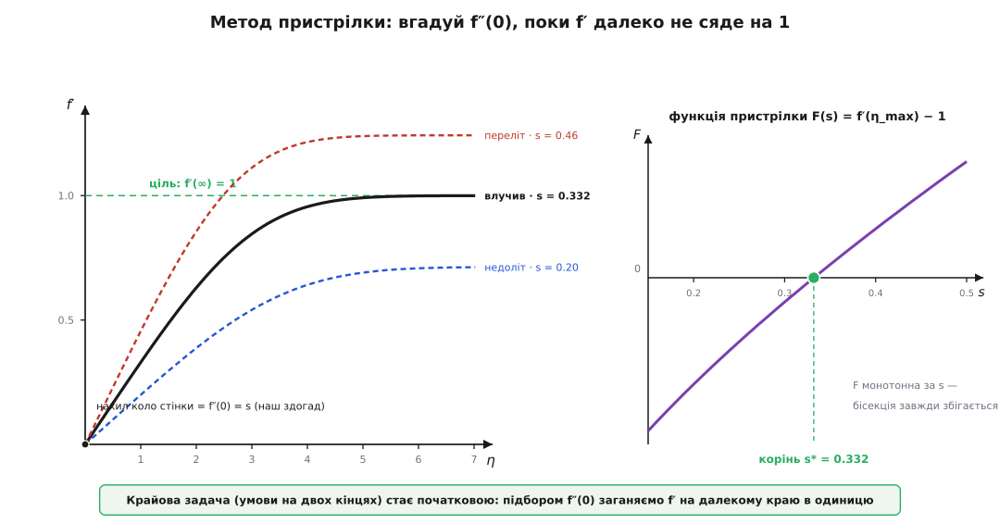
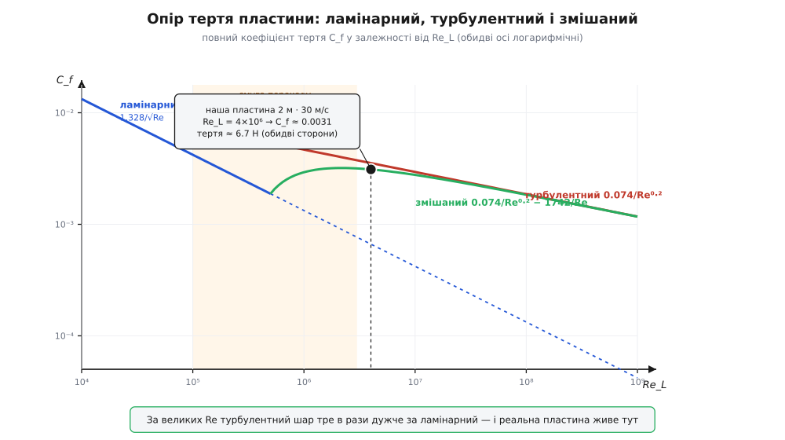

# ⚙️ Шар на пластині числом: пристрілка по Блазіусу і опір тертя

<preknowlist>
- [Число Рейнольдса](root:ph-mechanics/reynolds-number) — Re = U·L/ν, відношення інерції до в'язкості; воно вирішує і товщину шару, і чи він ламінарний, чи турбулентний, і геть увесь опір.
- [Математика примежового шару](root:ph-mechanics/boundary-layer/math-blasius.md) — звідки береться рівняння Блазіуса, змінна подібності η і три крайові умови, які ми тут розв'язуватимемо числом.
</preknowlist>

Візьмімо цілком буденну річ — тонку плоску пластину дві сотні сантиметрів завдовжки й метр завширшки. Хай це буде ребро сонячної панелі, кіль яхти чи пласке дно крила. Пустимо вздовж неї повітря зі швидкістю 30 метрів за секунду. Інженер, що це проєктує, хоче знати дві речі, і обидві — про той самий тонкий примежовий шар коло обшивки. Перше: наскільки він там завтовшки — чи не зачепить сусідню деталь, чи не спіткнеться об заклепку. Друге, важливіше для рахунку палива: скільки коштує тертя рідини об пластину, тобто який опір вона створює.

Обидві відповіді, хоч як це дивно, висять на одному-єдиному числі. Пауль Блазіус, студент Прандтля, 1908 року показав, що ламінарний профіль швидкості на пластині всюди однаковий — та сама крива, лише розтягнута тим більше, чим далі від носа. А раз крива одна, то й крутість її коло стінки — теж одне число: f″(0) ≈ 0.332. Воно задає геть усе — і товщину, і тертя. Тож наша програма робить три кроки: спершу здобуває це число з рівняння шару, потім перетворює його на товщину δ(x), а тоді — на силу опору в ньютонах, окремо для ламінарного й турбулентного режимів.

## Чому рівняння не інтегрується просто

Рівняння примежового шару на пластині зводиться до одного звичайного диференціального — заміною подібності, що зливає x та y в одну змінну η. Сам вивід, звідки береться η і чому виходить саме таке рівняння, показано окремо ([математика примежового шару](root:ph-mechanics/boundary-layer/math-blasius.md)); нам тут воно потрібне як готова задача:

```
f‴ + ½·f·f″ = 0

f(0)  = 0       (прилипання: на стінці рідина стоїть)
f′(0) = 0       (і поперек стінки не тече)
f′(∞) = 1       (далеко від стінки — повна швидкість, u = U)
```

де f′(η) = u/U — це і є профіль швидкості, а η = y·√(U/(ν·x)) — висота над стінкою в природних одиницях шару.

Здавалося б — бери й інтегруй. Але тут пастка, через яку рівняння не піддається олівцю зразу. Щоб крокувати диференціальне рівняння вперед від η = 0, треба знати всі початкові величини на стінці: f, f′ і f″. Перші дві ми маємо — обидві нулі. А третьої, f″(0), — не маємо. Натомість нам дано умову аж на нескінченності: f′(∞) = 1. Дві умови на одному кінці, одна — на іншому. Це **крайова задача**, а не початкова, і простим інтегруванням її не візьмеш: не знаєш, з яким нахилом f″(0) стартувати.

## Ідея: вистрілити і підправити приціл

Вихід простий до нахабства. Не знаємо f″(0)? Вгадаймо. Назвімо здогад s і поставмо початковий стан (0, 0, s) — тепер він повний, і рівняння можна інтегрувати вперед як звичайну початкову задачу, аж до якогось великого η_max. Дійшовши туди, глянемо на f′(η_max). Якщо вона перескочила за 1 — наш нахил був завеликий, шар «розігнався» надто круто. Якщо не дотягла до 1 — замалий. Підправмо s і стрельнімо ще раз. Ми буквально цілимося: мішень — f′ = 1 на далекому краю, а «кут прицілу» — нахил коло стінки f″(0). Звідси й назва — метод **пристрілки** (англ. *shooting* — стрільба).

Чому тут пристрілка особливо надійна: f′(η_max) **монотонно** росте зі здогадом s. Крутіший старт коло стінки → швидший профіль скрізь → більше f′ на краю. А монотонна залежність означає, що годиться найтупіший і найнадійніший коренешукач — **бісекція** (поділ навпіл): тримай пару здогадів, один із недольотом, другий із перельотом, і половинь проміжок між ними, аж поки не затиснеш корінь. Схибити вона тут не може в принципі.


*Здогад про нахил коло стінки f″(0) = s визначає всю траєкторію. Замалий s дає недоліт (f′ виходить на плато нижче 1), завеликий — переліт. Функція F(s) = f′(η_max) − 1 монотонна за s і перетинає нуль рівно в s* = 0.332 — тут бісекція й зупиняється.*

Варто сказати, як це робив сам Блазіус, — бо руками пристрілку ганяти було б катуванням. Він не стріляв: 1908 року в докторській у Прандтля він розклав f у степеневий ряд коло стінки (де єдиний невідомий коефіцієнт — саме той, що ∝ f″(0)) і окремо в асимптотику далеко від неї, а тоді **зшив** ці два розклади посередині, витиснувши звідти f″(0) ≈ 0.332. Класичну ж числову інтеграцію методом Рунге — Кутти руками вперше провів 1912 року Карл Тьопфер (Karl Töpfer) — і хитро: скориставшись масштабною симетрією рівняння, він проінтегрував його **один раз** із зручного здогаду, а тоді просто перемасштабував відповідь під f′(∞) = 1, обійшовши будь-яку ітерацію. Наша пристрілка нижче — це чесний перебірливий родич його трюку: смішний для комп'ютера, немислимий для олівця.

## Крок 1: пристрілка руками — RK4 і бісекція

Спершу зберемо все з нуля, щоб було видно кожен гвинтик. Стан — трійка `[f, f′, f″]`; права частина дає її похідну `[f′, f″, f‴]`, де f‴ = −½·f·f″. Крокуємо класичним Рунге — Куттою четвертого порядку (RK4): чотири проби нахилу на кроці, зважене середнє — і похибка падає як h⁴, тож навіть грубий крок дає п'ять-шість вірних цифр.

```python
import numpy as np

def blasius_rhs(state):
    """state = [f, f′, f″]  →  [f′, f″, f‴],  де f‴ = −½·f·f″."""
    f, fp, fpp = state
    return np.array([fp, fpp, -0.5 * f * fpp])

def rk4_step(state, h):
    k1 = blasius_rhs(state)
    k2 = blasius_rhs(state + 0.5 * h * k1)
    k3 = blasius_rhs(state + 0.5 * h * k2)
    k4 = blasius_rhs(state + h * k3)
    return state + (h / 6.0) * (k1 + 2*k2 + 2*k3 + k4)

def f_prime_at_infinity(fpp0, eta_max=8.0, h=0.005):
    """Проінтегрувати з f″(0)=fpp0 і повернути f′ на далекому краю."""
    state = np.array([0.0, 0.0, fpp0])
    for _ in range(int(eta_max / h)):
        state = rk4_step(state, h)
    return state[1]

def solve_blasius(eta_max=8.0, h=0.005, tol=1e-10):
    """Пристрілка бісекцією по f″(0), поки f′(η_max) → 1."""
    lo, hi = 0.0, 1.0
    while hi - lo > tol:
        mid = 0.5 * (lo + hi)
        if f_prime_at_infinity(mid, eta_max, h) > 1.0:
            hi = mid          # переліт → нахил завеликий, опускаємо стелю
        else:
            lo = mid          # недоліт → замалий, піднімаємо підлогу
    return 0.5 * (lo + hi)

fpp0 = solve_blasius()
print(f"f''(0) = {fpp0:.6f}")
```

```
f''(0) = 0.332059
```

Ось воно — те саме число, що Блазіус здобув зшиванням рядів, а Тьопфер підтвердив Рунге — Куттою: 0.332. Тридцять із чимось прогонів бісекції, кожен — коротка інтеграція, і машина за частку секунди повторює те, над чим 1908 року сиділи з олівцем.

## Крок 2: те саме ідіоматично — solve_ivp і brentq

Руками ми написали, щоб було видно механіку. У реальній роботі ніхто не котить власний RK4 і бісекцію — під це є відточені інструменти: `solve_ivp` з адаптивним кроком інтегрує систему, а `brentq` шукає корінь. Уся задача згортається в дюжину рядків.

```python
from scipy.integrate import solve_ivp
from scipy.optimize import brentq

def rhs(eta, y):                       # y = [f, f′, f″]
    f, fp, fpp = y
    return [fp, fpp, -0.5 * f * fpp]

def miss(fpp0, eta_max=8.0):
    """Наскільки f′ на краю промахує повз 1 — цільова для коренешукача."""
    sol = solve_ivp(rhs, (0.0, eta_max), [0.0, 0.0, fpp0],
                    rtol=1e-10, atol=1e-12)
    return sol.y[1, -1] - 1.0

fpp0 = brentq(miss, 0.0, 1.0, xtol=1e-12)   # знайти корінь miss(s) = 0
print(f"f''(0) = {fpp0:.6f}")
```

```
f''(0) = 0.332059
```

`brentq` — це та сама бісекція, тільки з розумом: там, де функція гладка, вона підмішує обернено-квадратичну інтерполяцію й вистрибує до кореня за десяток проб замість наших тридцяти п'яти. А `solve_ivp` сама дрібнить крок там, де рішення крутіше. Той самий результат — до машинної точності, майже задарма.

## Від числа — до товщини й опору

Тепер найкорисніше. З профілю Блазіуса випливає все фізичне, і випливає з двох його рис. Перша — той самий нахил коло стінки f″(0) = 0.332: він задає місцеве дотичне напруження, а через нього — місцевий коефіцієнт тертя `c_f(x) = 0.664/√Re_x` (коефіцієнт 0.664 — це рівно подвоєне f″(0) = 0.332). Друга: профіль виходить на ~99% швидкості вже при η ≈ 5, звідки товщина `δ(x) = 5·x/√Re_x`.

Але опір усієї пластини — це напруження, зібране від носа до хвоста. Проінтегрувавши c_f(x) по довжині, дістаємо **середній** коефіцієнт тертя. Для ламінарного шару він виходить рівно вдвічі більший за місцевий на кінці:

```
ламінарний:      C_f = 1.328 / √Re_L
```

Одначе реальна пластина не лишається ламінарною: за Re_x ≈ 5×10⁵ шар зривається в турбулентність, а турбулентне тертя куди більше й корюється вже не точній теорії, а перевіреній емпіричній підгонці — степеневому закону «однієї сьомої» Прандтля:

```
турбулентний:    C_f = 0.074 / Re_L^0.2      (чинне для 5×10⁵ < Re_L < 10⁷)
```

Насправді пластина ламінарна спереду й турбулентна ззаду. Чесна оцінка віднімає «турбулентний кредит», хибно нарахований за ламінарну ділянку носа:

```
змішаний:        C_f = 0.074 / Re_L^0.2 − 1742 / Re_L     (перехід при Re_x = 5×10⁵)
```

А сам опір — це коефіцієнт, помножений на динамічний напір q = ½·ρ·U² й на змочену площу:

```python
import numpy as np

rho, nu = 1.204, 1.5e-5        # повітря: густина кг/м³, кінематична в'язкість м²/с
U, L, b = 30.0, 2.0, 1.0       # швидкість м/с, довжина й ширина пластини, м

Re_L = U * L / nu
q    = 0.5 * rho * U**2         # динамічний напір, Па
A    = L * b                    # площа однієї змоченої сторони, м²

Cf_lam  = 1.328 / np.sqrt(Re_L)
Cf_turb = 0.074 / Re_L**0.2
Cf_mix  = 0.074 / Re_L**0.2 - 1742.0 / Re_L
x_tr    = 5e5 * nu / U          # де ламінарний шар зривається в турбулентний

print(f"Re_L       = {Re_L:.2e}")
print(f"перехід    = {x_tr*100:.0f} см від носа")
for name, Cf in [("ламінарний", Cf_lam), ("турбулентний", Cf_turb), ("змішаний", Cf_mix)]:
    D = Cf * q * A * 2          # пластина змочена з обох боків
    print(f"{name:12s}: C_f = {Cf:.5f}   опір = {D:5.2f} Н")
```

```
Re_L       = 4.00e+06
перехід    = 25 см від носа
ламінарний  : C_f = 0.00066   опір =  1.44 Н
турбулентний: C_f = 0.00354   опір =  7.67 Н
змішаний    : C_f = 0.00310   опір =  6.72 Н
```

Прочитаймо це. Пластина зривається в турбулентність уже на 25 сантиметрах — тобто ламінарна лише перша восьма частина, а решта сім восьмих бурхливі. Тому чесна, змішана оцінка (6.7 Н) лежить куди ближче до суто турбулентної (7.7 Н), ніж до фантазійно-ламінарної (1.4 Н). І ось головне: якби ми наївно припустили ламінарний шар на всю довжину, ми б **занизили опір майже вп'ятеро**. Найважливіше рішення в усьому розрахунку — не в рівняннях, а в тому, ДЕ поставити перехід.


*Ламінарне тертя (1.328/√Re) з ростом Re падає значно крутіше за турбулентне (0.074/Re⁰·²). За великих Re, де живе все, що літає й плаває, турбулентний шар тре в рази дужче. Наша пластина при Re_L = 4×10⁶ сидить у смузі, де перехід уже стався, тож рахувати треба за змішаною кривою.*

## Складність і пастки

**Нескінченність у коді — це η_max.** «∞» доводиться підмінити скінченним η_max, і замалий η_max псує все: якщо профіль ще не встиг вирівнятися, вимога f′(η_max) = 1 перекручує його, роблячи нахил коло стінки завеликим. Ось як «пливе» відповідь:

```
η_max = 4   →  f″(0) = 0.352746     (на 6% завелико)
η_max = 5   →  f″(0) = 0.336152
η_max = 6   →  f″(0) = 0.332566
η_max = 8   →  f″(0) = 0.332059     ← вийшло на плато
η_max = 10  →  f″(0) = 0.332057
```

Правило: збільшуй η_max, поки f″(0) не перестане ворушитися. Тут це десь 8 (там уже u/U = 0.9999), а на 10 маємо 0.332057 — це вже збігається з довідковим 0.33205734, у якому певні всі наведені цифри. Задалеко теж не варто: з грубим кроком на η_max = 30 назбирається зайва похибка округлення.

**Метод важить більше за крок.** Похибка RK4 ~ h⁴, тож h = 0.01 уже дає п'ять-шість цифр. Якби замість RK4 хтось узяв простий метод Ойлера, довелося б дрібнити крок до ~10⁻⁵ по тій самій точності — у тисячу разів більше роботи. Не крок рятує точність, а порядок методу.

**Зависокий здогад не просто перескакує — він вибухає.** Лише правильний s виводить f′ рівно на 1; будь-який більший за s* зрештою жене f′ у нескінченність, бо нелінійний член сам себе підживлює. Тому не варто задирати верхню межу бісекції надто високо: інтеграція може переповнитися ще до того, як бісекція затисне корінь. f″(0) відомо, що коло 0.3, тож проміжок [0, 1] — з головою.

**Перехід — ось де справжня непевність.** Критичне Re_x — не стала природи. На гладенькій пластині в спокійному повітрі шар тримає ламінарність аж до Re_x ~ 3×10⁶; шорсткий ніс, тремтіння набігаючого потоку, шум чи навмисний дротик-зривач опускають поріг до ~10⁵ і нижче. Ми взяли 5×10⁵ — підручникову домовленість, а не вимір. А оскільки опір так круто залежить від того, яка частка пластини турбулентна, цей єдиний здогад переважує всі числові похибки вище разом узяті. І число 1742 у змішаній формулі — не з неба: це рівно `Re_кр·(0.074/Re_кр^0.2 − 1.328/√Re_кр)` при Re_кр = 5×10⁵. Зміниш поріг переходу — зміниться й воно.

**Кореляція має свій діапазон.** 0.074/Re⁰·² — це підгонка під турбулентний профіль «однієї сьомої», чесна лише до Re_L ~ 10⁷. Для корпусу корабля чи крила при Re_L ~ 10⁸–10⁹ вона попливе; там беруть логарифмічну підгонку Шліхтінга `C_f = 0.455/(log₁₀ Re_L)^2.58` (годиться до ~10⁹). При нашому Re_L = 4×10⁶ обидві сходяться до ~1%: 0.00354 проти 0.00349 — тобто наша пластина сидить надійно в рідній вотчині степеневого закону.

**Це лише тертя.** Уся програма рахує тільки поверхневе тертя — і правильно, бо для тонкої пластини строго вздовж потоку опір тиску дорівнює нулю. Але щойно пластину нахилити, шар відірветься, і опір тиску миттю перекриє все тертя (це вже інша половина [аеродинамічного опору](root:ph-mechanics/aerodynamic-drag), не робота цієї програми). Тож памʼятай межу застосовності: вирівняна тонка пластина — і жодного кута атаки.

Дві сотні рядків, п'ять-шість вірних цифр там, де 1908 року сиділи тижнями, — і водночас урок скромності: найбільша похибка тут не в числах, а в тому єдиному місці, де ми лише вгадуємо, де спокійне стає бурхливим.
