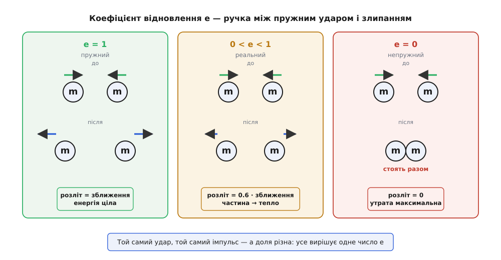
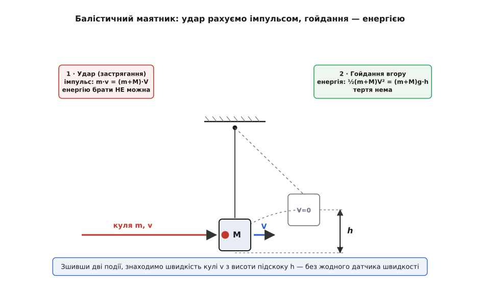
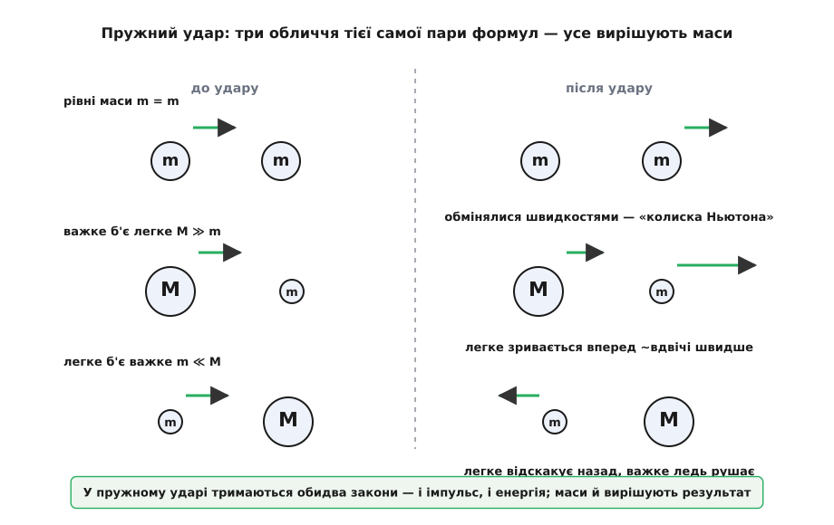

# Зіткнення: що зберігається в ударі, а що зникає

<preknowlist>
- [Імпульс](topic:ph-mechanics/momentum) — добуток маси на швидкість p = m·v; його векторна сума в ізольованій системі не міняється — головний закон будь-якого удару.
- [Кінетична енергія](topic:ph-mechanics/kinetic-energy) — енергія руху ½mv²; саме за нею відрізняють пружний удар від непружного.
- [Закон збереження енергії](topic:ph-mechanics/energy-conservation) — енергія не зникає, а лише міняє подобу; «втрачена» в ударі енергія стає теплом і деформацією.
- [Третій закон Ньютона](topic:ph-mechanics/newtons-third-law) — дія дорівнює протидії; рівні протилежні сили контакту й роблять сумарний імпульс незмінним.
</preknowlist>

Зіткнення — це коротка шалена мить, коли два тіла торкаються, тиснуть одне на одне з величезною силою і за частку секунди розходяться вже інакшими. Що коїться всередині цієї миті — як тіла гнуться, де народжується сила контакту, скільки він триває — майже завжди недосяжне для чесного розрахунку: сили колосальні, час крихітний, деформація заплутана. І все ж фізика впевнено відповідає на головне питання — **що буде після**, знаючи лише те, що було **до**. Уся хитрість у тому, щоб стежити не за подробицями удару, а за двома величинами, які удар або зберігає, або міняє за чіткими правилами.

Перша тримається завжди, друга — як пощастить. І весь поділ зіткнень на види виростає рівно з того, як поводиться друга.

## Одне, що не зраджує ніколи: імпульс

Поки два тіла в контакті, перше тисне на друге з якоюсь силою — хай навіть шаленою й змінною. За [третім законом Ньютона](topic:ph-mechanics/newtons-third-law) друге тисне на перше рівно такою самою силою в протилежний бік, і діють ці сили однаковий час. Отже, скільки [імпульсу](topic:ph-mechanics/momentum) одне тіло втратить, стільки ж друге здобуде — сумарний імпульс пари як був, так і лишився:

```
p₁ + p₂ = const     (доки на пару не діють зовнішні сили)
```

Це справджується в **будь-якому** ударі, байдуже яка там усередині коїлася веремія — тіла відскочили, злиплися чи розкололися на друзки. Тому імпульс — надійна валюта зіткнень: його сумою можна впевнено рахувати «до» й «після», не заглядаючи в саму мить контакту. Байдуже, скільки була сила й скільки тривала: важить лише, що вона внутрішня, а внутрішні сили гасяться попарно й повного імпульсу зрушити не можуть.

> 🔧 **Навіщо це.** Саме на цьому стоїть уся практика зіткнень. Балістик рахує швидкість кулі за розгойданим нею тягарем, конструктор — розліт уламків, автор фізичного рушія в грі — відскок тіл на екрані, і жоден із них не знає й не хоче знати подробиць контакту. Їм досить одного: сума m·v до події дорівнює сумі після. Коли ж зіткнення відбувається не за мить, а тіло безперервно відкидає масу — як [ракета](topic:ph-mechanics/newtons-second-law/math-force-momentum.md) струмінь газу, — це той самий закон, тільки застосований щомиті.

## Кінетична енергія: ось де починаються види

А тепер друга величина — [кінетична енергія](topic:ph-mechanics/kinetic-energy), енергія руху ½mv². Вона поводиться зовсім не так надійно, і саме її примхливість розколює всі зіткнення на два табори.

Уяви два крайні випадки. Дві сталеві кульки вдаряються й пружно відскакують, наче нічого й не сталося: розлітаються так само прудко, як зустрілися. Тепер дві грудки пластиліну: вони чвакають, злипаються в одне і їдуть далі разом, млявіше. Імпульс в обох випадках зберігся до крихти — а от рух після сталевих кульок ніби той самий, а після пластиліну помітно вгамувався. Кінетичної енергії поменшало.

Куди вона поділася? Не зникла — [енергія не зникає ніколи](topic:ph-mechanics/energy-conservation). Вона перетекла з упорядкованого руху тіл у хаотичний: пішла на нагрів, на незворотне зім'яття, на звук удару. Сталь пружинить і повертає майже все запасене в деформації назад у рух; пластилін гнеться намертво й лишає всю ту енергію в собі теплом. Ось цей поділ і дає два еталонні полюси:

- **Пружний удар** (гр. *elastikós* — той, що відскакує, звідки й «еластичний») — коли кінетична енергія зберігається сповна. Тіла розлітаються, нічого не гублячи на тепло. Так поводяться сталеві кульки, більярдні кулі, атоми газу — і майже так усе тверде й дзвінке.
- **Абсолютно непружний удар** — коли тіла після зіткнення рухаються **разом**, злипшись в одне, а кінетичної енергії пропадає стільки, скільки взагалі можна втратити. Пластилін до пластиліну, куля в мішку з піском, зчеплення вагонів.

Між цими полюсами лежить усе справжнє: тенісний м'яч, дерев'яний брусок, автомобільний бампер — вони й відскакують, і частину руху лишають у собі. Щоб описати весь цей суцільний перехід одним числом, і придумали окрему величину.

## Коефіцієнт відновлення: ручка між полюсами

Порівняймо не самі швидкості, а те, як швидко тіла **зближуються до** удару й **розходяться після**. Візьмімо швидкість, з якою одне наздоганяє друге перед контактом (швидкість зближення), і швидкість, з якою вони розлітаються потому (швидкість розльоту). Їхнє відношення — і є **коефіцієнт відновлення** (лат. *restitutio* — відновлення), позначають його *e*:

```
e = швидкість розльоту / швидкість зближення = (v₂ − v₁) / (u₁ − u₂)
```

де u — швидкості до, v — після. Одне число ловить усю природу удару:

- **e = 1** — тіла розходяться так само прудко, як зустрілися: удар **пружний**, кінетична енергія ціла.
- **e = 0** — тіла зовсім не розходяться (v₂ = v₁), тобто рухаються разом: удар **абсолютно непружний**.
- **0 < e < 1** — усе реальне поміж ними: частина руху вертається, частина осідає теплом.


*Одна пара тіл, три долі — залежно від e. При e = 1 швидкість розльоту дорівнює швидкості зближення (уся кінетична енергія повертається); при e = 0 тіла їдуть разом (утрата енергії максимальна); реальні удари живуть між ними. Імпульс у всіх трьох однаковий — міняється лише e.*

Найзручніше, що *e* легко **виміряти**, навіть нічого не знаючи про сили. Кинь м'яч на тверду підлогу з висоти *h* — він удариться зі швидкістю √(2gh), відскочить із меншою й підстрибне на нижчу висоту *h′*. Оскільки висота підскоку задає швидкість відскоку (√(2gh′)), а підлога нерухома, коефіцієнт відновлення виходить просто з двох висот:

```
e = √(h′ / h)
```

**Задача.** М'яч упустили з висоти 1.00 м, і він відскочив на 0.64 м. Який у нього коефіцієнт відновлення і як високо він підстрибне після наступного удару?

```
e = √(h′ / h) = √(0.64 / 1.00) = √0.64 = 0.80

Кожен удар множить висоту на e² = 0.64:
наступний підскок h″ = e² · h′ = 0.64 · 0.64 ≈ 0.41 м
```

Вісім десятих — типове значення для доброго гумового м'яча: щоудару він губить трохи більш ніж третину висоти, і саме тому підскоки згасають дедалі швидше, а звук ударів частішає під кінець. Баскетбольний м'яч тримає близько 0.8, тенісний — коло 0.7, а грудка вологої глини — майже 0, бо не відскакує зовсім.

Що *e* — стала й вимірна прикмета матеріалу, першим з'ясував **Ісаак Ньютон**: у «Началах» (1687) він розгойдував кульки з різних речовин — вовни, сталі, корка, скла — і виявив, що швидкість розльоту завжди становить ту саму частку від швидкості зближення, а частка ця залежить від матеріалу (у скла й сталі близька до одиниці, у м'яких тіл куди менша). Це «Ньютонове дослідне правило удару» — і водночас перший акорд довгої історії про те, як у XVII столітті вчилися рахувати зіткнення, від хибних правил Декарта до дослідів у Лондонському королівському товаристві; [народження законів удару](topic:ph-mechanics/collisions/hist-collision-laws.md) — окрема й повчальна оповідь.

## Абсолютно непружний: разом — і максимум утрат

Найпростіший для розрахунку — крайній випадок e = 0, коли тіла злипаються. Раз після удару вони рухаються з однією швидкістю *u*, а сумарний імпульс не змінився, знайти цю швидкість — один рядок:

```
m₁·u₁ + m₂·u₂ = (m₁ + m₂)·u
u = (m₁·u₁ + m₂·u₂) / (m₁ + m₂)
```

Це і є швидкість спільного [центра мас](topic:ph-mechanics/center-of-mass) пари — та сама до й після удару, бо центр мас ізольованої системи взагалі не відчуває внутрішніх сил. А скільки ж кінетичної енергії при цьому пропадає? Обчислення дає напрочуд гарну відповідь: утрата залежить лише від мас і від **різниці** швидкостей, тобто від того, як швидко тіла зближувалися:

```
ΔE = ½ · μ · (u₁ − u₂)²,     де μ = m₁·m₂ / (m₁ + m₂)
```

Комбінацію μ звуть [зведеною масою](topic:ph-mechanics/reduced-mass) пари — вона поводиться як «ефективна маса» відносного руху двох тіл. Формула каже глибоку річ: у тепло йде рівно та кінетична енергія, що сиділа у **взаємному зближенні** тіл; енергію спільного руху центра мас удар зачепити не може — її стереже незмінний імпульс. Тому в лоб зупинити один одного два зустрічні тіла можуть повністю (вся енергія в тепло), а от той, хто наздоганяє свого, віддасть лише частину.

Найяскравіше це працює в **балістичному маятнику** (гр. *bállein* — кидати) — старому способі зміряти швидкість кулі без жодного датчика швидкості. Куля влітає в підвішений тягар, застрягає в ньому, і тягар із кулею разом гойдається вгору. Тут дві різні події поспіль, і кожну треба рахувати **своїм** законом — у цьому вся сіль.

**Задача.** Куля масою 10 г влітає в дерев'яний брусок масою 2.0 кг, підвішений на нитках, застрягає в ньому, і брусок із кулею відхиляється вгору на 8.0 см. Яка була швидкість кулі?

```
Подія 1 — застрягання (непружний удар). Енергію тут брати НЕ можна
(більшість її піде в тепло), зате імпульс зберігається:
      m·v = (m + M)·V
      V = швидкість бруска з кулею одразу після удару

Подія 2 — гойдання вгору. Тепер тіла вже їдуть як одне, тертя нема,
тож зберігається енергія: уся кінетична переходить у висоту:
      ½·(m + M)·V² = (m + M)·g·h  →  V = √(2·g·h)
      V = √(2 · 9.81 · 0.080) = √1.57 ≈ 1.25 м/с

Назад до першого рівняння — знаходимо швидкість кулі:
      v = (m + M)/m · V = (2.010 / 0.010) · 1.25 = 201 · 1.25 ≈ 252 м/с
```

Двісті п'ятдесят метрів за секунду — і все з двох ниток та лінійки. Тепер порахуймо, що сталося з енергією при застряганні: до удару куля несла ½·0.010·252² ≈ 318 Дж, а зразу після в бруска з кулею лишилося ½·2.010·1.25² ≈ 1.6 Дж. Понад 99 % кінетичної енергії згоріло на розтрощення дерева й нагрів — саме тому в **події 1** енергію рахувати було б грубою помилкою, дарма що імпульс там точний до крихти. Ось де видно, чому імпульс — надійніший провідник за енергію: він тримається там, де енергія тихо витікає в тепло.


*Дві події — два різні закони. Застрягання кулі: кінетична енергія майже вся в тепло, але імпульс зберігається — звідси швидкість V одразу після удару. Гойдання вгору: тертя нема, кінетична енергія повністю переходить у висоту m·g·h. Зшивши їх, дістаємо швидкість кулі з висоти підскоку.*

## Пружний удар: формули й три обличчя

Протилежний полюс, e = 1, вимагає більше алгебри, бо тепер тримаються **обидві** величини одразу — і імпульс, і кінетична енергія. Дві рівняння на дві невідомі швидкості дають однозначну відповідь. Для лобового удару тіл із масами m₁, m₂ і початковими швидкостями u₁, u₂ швидкості після виходять такі:

```
v₁ = ((m₁ − m₂)·u₁ + 2·m₂·u₂) / (m₁ + m₂)
v₂ = ((m₂ − m₁)·u₂ + 2·m₁·u₁) / (m₁ + m₂)
```

Формули на позір громіздкі, та вся їхня суть розкривається у трьох граничних випадках, які варто знати напам'ять — бо саме їх бачиш щодня.

**Рівні маси (m₁ = m₂).** Підставте — і чисельники дивовижно спрощуються: v₁ = u₂, v₂ = u₁. Тіла просто **обмінюються швидкостями**. Рухома кулька, влучивши в таку саму нерухому, спиняється намертво, а та зривається з місця з її швидкістю. Це і є секрет «колиски Ньютона»: удар з одного кінця ряду однакових кульок виштовхує рівно одну з протилежного, бо кожна пара сусідів по черзі міняється рухом.

**Важке б'є легке (m₁ ≫ m₂).** Важкий майже не помічає удару й котиться далі майже з тією ж швидкістю, а легке зривається вперед — і в границі **вдвічі швидше**, ніж налетів важкий. Так кувалда жбурляє камінець, а ключка — шайбу.

**Легке б'є важке (m₁ ≪ m₂).** Тепер навпаки: важке ледь ворухнеться, а легке **відскакує назад** майже з тією ж швидкістю, з якою прилетіло. М'яч від стіни, градина від даху, молекула повітря від стінки посудини — усе це той самий випадок.


*Одні й ті самі формули дають три різні картини — усе вирішує співвідношення мас. Рівні маси обмінюються рухом (колиска Ньютона); важче кидає легше вперед; легше відскакує від важчого назад. Проміжні співвідношення плавно перетікають між цими крайнощами.*

**Задача.** Куля масою 3 кг котиться зі швидкістю 4 м/с і пружно б'є нерухому кулю масою 1 кг. Які швидкості після удару?

```
v₁ = ((3 − 1)·4 + 2·1·0) / (3 + 1) = 8 / 4 = 2 м/с
v₂ = ((1 − 3)·0 + 2·3·4) / (3 + 1) = 24 / 4 = 6 м/с

Перевірка імпульсу:  до 3·4 = 12;  після 3·2 + 1·6 = 12 ✓
Перевірка енергії:   до ½·3·4² = 24 Дж;  після ½·3·2² + ½·1·6² = 6 + 18 = 24 Дж ✓
```

Легша куля відлетіла швидше (6 м/с), ніж налетіла важча (4 м/с), — і це не порушення нічого: і імпульс, і енергія зійшлися. Повне виведення цих формул із двох законів збереження, разом з елегантним прийомом «переходу в систему центра мас», зібрано в [окремому виведенні](topic:ph-mechanics/collisions/math-elastic-collision.md).

## Найзручніше крісло: система центра мас

За тим виведенням стоїть гарна ідея, варта окремого слова, бо вона робить зіткнення прозорими. [Швидкість](topic:ph-mechanics/velocity) — річ відносна: скільки її має тіло, залежить від того, [звідки дивитися](topic:ph-mechanics/galilean-relativity). Тож перейдімо в систему відліку, що рухається разом із центром мас пари. У ній повний імпульс за визначенням **нуль** — тіла завжди летять назустріч так, що їхні m·v рівні й протилежні.

І тут пружний удар оголює свою суть до краю: у системі центра мас кожне тіло після зіткнення просто **обертає** свою швидкість — летить назад із тією самою величиною. Ніяких формул, чиста симетрія. А непружний, навпаки, гасить рух: при e = 0 обидва тіла в цій системі спиняються дощенту. Звідси й береться та сама формула ΔE = ½·μ·(u₁−u₂)²: уся кінетична енергія, яку **видно** із системи центра мас, — це і є те, що можна втратити; енергію самого руху центра мас забрати неможливо, бо її стереже незмінний імпульс. Розв'язавши задачу в цьому зручному кріслі, досить додати назад швидкість центра мас — і повертаєшся в лабораторію з готовою відповіддю.

## У площині — і за межами пружного

Досі тіла билися вздовж однієї лінії. У житті вони зустрічаються під кутом і розлітаються врізнобіч — але додаткова складність тут менша, ніж здається. Оскільки [імпульс — вектор](topic:ph-mechanics/momentum), його збереження діє **окремо по кожній осі**: сума складових уздовж «x» зберігається сама собою, уздовж «y» — сама собою. Косий удар просто розкладають на дві незалежні задачі. У більярді звідси випливає гарне правило: після пружного удару двох рівних куль, коли одна стояла, вони розходяться точно під **прямим кутом** — тому досвідчений гравець наперед бачить, куди піде бита куля.

А чи буває, щоб тіла розліталися **швидше**, ніж зустрілися, — тобто e > 1? Буває, і зветься це надпружним ударом, тільки енергія тоді не з'являється з нічого: вона вивільняється з якогось запасу — стиснутої пружини, хімічного заряду, зведеного механізму. Найзвичніший приклад — вибух: тіло спочивало, а його уламки розлітаються з чималою енергією, узятою в хімії вибухівки. Імпульс і там незламний (сума розльотних m·v дорівнює нулю, як і до вибуху), просто до кінетичної енергії додалася порція ззовні.

## Що лишається

Зіткнення розв'язують не заглядаючи в саму мить удару — досить двох законів. **Імпульс** зберігається завжди й у будь-якому ударі, тому ним рахують «після» з «до» безвідмовно. **Кінетична енергія** зберігається тільки в пружному ударі, а в реальному частково витікає в тепло й деформацію — і те, скільки саме, ловить один коефіцієнт відновлення *e*: від e = 1 (пружний, енергія ціла) через реальне 0 < e < 1 до e = 0 (тіла злипаються, утрата максимальна). Пружний удар дає однозначні швидкості з двох законів разом, і вся їхня суть — у трьох випадках за масами: рівні міняються рухом, важче кидає легше вперед, легше відскакує назад. Непружний рахується ще простіше — через спільну швидкість центра мас, — а видно з нього, чому в застряганні кулі майже вся енергія гине, тоді як імпульс стоїть непорушно. Головна дисципліна одна: спершу завжди імпульс, а по енергію звертайся окремо, знаючи *e*. Побачити цей поділ на живому коді — як [фізичний рушій розв'язує зіткнення](topic:ph-mechanics/collisions/proj-collision-resolver.md) через імпульс і коефіцієнт відновлення, кадр за кадром.
</content>
</invoke>
