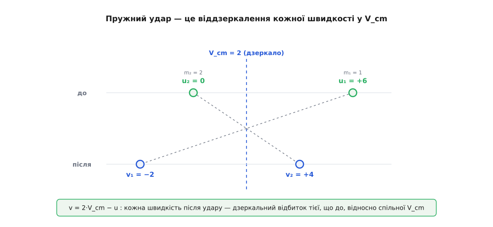
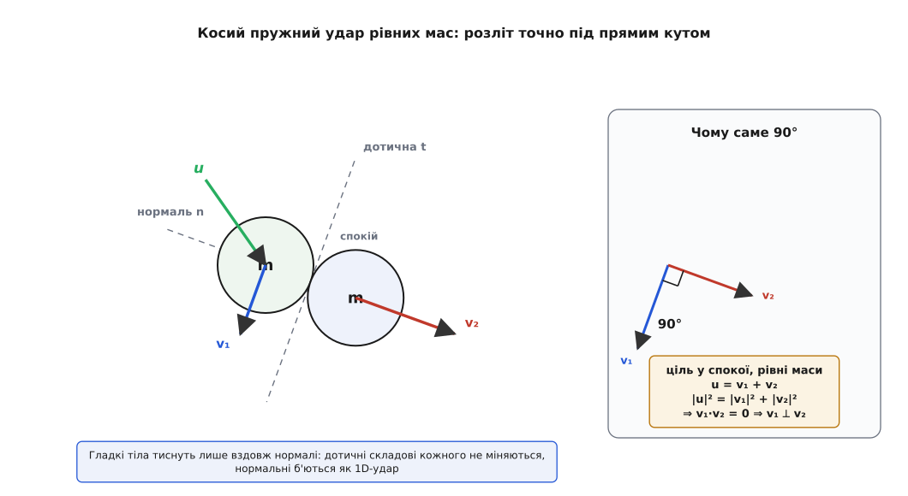

# 🧮 Звідки беруться формули пружного удару

Готові формули лобового пружного удару — ті, що видають швидкості після через маси й початкові швидкості, — на позір скидаються на щось, вивчене напам'ять: громіздкі дроби, які «просто такі». Насправді вони з небагатьох рядків алгебри, а за тими рядками ховаються три різні, однаково гарні способи побачити ту саму відповідь, і кожен освітлює удар з окремого боку. Розберімо їх усі: пряме розв'язання системи з елегантним трюком різниці квадратів, погляд із системи центра мас, де пружний удар оголюється до простої зміни знаку, і роздивимось, чому в непружному ударі в тепло йде рівно стільки енергії, скільки взагалі можна втратити. Наприкінці винесемо все це в площину — до косого удару й того самого прямого кута, під яким розлітаються більярдні кулі.

## Постановка: дві невідомі, два закони

Два тіла рухаються вздовж однієї прямої. Маси m₁, m₂ відомі; швидкості до удару — u₁, u₂; шукаємо швидкості після — v₁, v₂. Удар тримає дві величини. [Імпульс](root:ph-mechanics/momentum) — векторну суму m·v, що не міняється, поки на пару не діють зовнішні сили, — тримає **завжди**. [Кінетичну енергію](root:ph-mechanics/kinetic-energy) руху ½·m·v² удар зберігає **лише коли пружний**; саме це і є означення пружності. Два закони дають два рівняння:

```
m₁·u₁ + m₂·u₂ = m₁·v₁ + m₂·v₂               (імпульс — завжди)
½·m₁·u₁² + ½·m₂·u₂² = ½·m₁·v₁² + ½·m₂·v₂²    (енергія — лише пружний)
```

Дві невідомі, два рівняння — відповідь визначена однозначно. Але друге рівняння квадратне, а квадрат зазвичай віщує два корені. Один із них, як побачимо, — обманка: «удару не сталося, тіла проминули одне одне». Уся хитрість алгебри — акуратно його відкинути.

## Дорога перша: розв'язати систему навпростець

Згорнімо кожне рівняння так, щоб зліва зібралося тіло 1, справа — тіло 2. В імпульсному переносимо доданки з m₁ вліво, з m₂ вправо; в енергетичному робимо те саме й одразу викидаємо спільну ½:

```
(1)   m₁·(u₁ − v₁) = m₂·(v₂ − u₂)
(2)   m₁·(u₁² − v₁²) = m₂·(v₂² − u₂²)
```

Тепер трюк, заради якого все й затівалося. У рівнянні (2) кожна дужка — **різниця квадратів**, а вона розкладається на добуток:

```
m₁·(u₁ − v₁)·(u₁ + v₁) = m₂·(v₂ − u₂)·(v₂ + u₂)
```

Придивіться: множники m₁·(u₁ − v₁) ліворуч і m₂·(v₂ − u₂) праворуч — це рівно ліва й права частини рівняння (1). Поділивши (2) на (1), ми їх скорочуємо начисто:

```
u₁ + v₁ = u₂ + v₂      ⟹      v₂ − v₁ = u₁ − u₂
```

Ділити на (u₁ − v₁) вільно можна саме тому, що удар **справді стався**: тіло 1 змінило швидкість, отже u₁ ≠ v₁. Той випадок, коли u₁ = v₁ (а значить і u₂ = v₂), — це і є обманний корінь: тіла розминулися, нічого не зачепивши. Скоротивши на (u₁ − v₁), ми його спокійно викинули — і лишилася фізична відповідь.

А відповідь ця варта того, щоб її роздивитись. Уся сила закону збереження енергії стиснулася в один рядок: **швидкість розльоту (v₂ − v₁) точно дорівнює швидкості зближення (u₁ − u₂)**. Ніяких квадратів, ніяких мас — чиста рівність двох різниць. Далі лишається чиста бухгалтерія. Підставимо v₂ = v₁ + (u₁ − u₂) в закон імпульсу:

```
m₁·u₁ + m₂·u₂ = m₁·v₁ + m₂·(v₁ + u₁ − u₂)
(m₁ + m₂)·v₁ = (m₁ − m₂)·u₁ + 2·m₂·u₂
```

```
       (m₁ − m₂)·u₁ + 2·m₂·u₂                (m₂ − m₁)·u₂ + 2·m₁·u₁
v₁ = ──────────────────────── ,      v₂ = ────────────────────────
            m₁ + m₂                              m₁ + m₂
```

(друга формула — з першої простою заміною 1 ↔ 2, бо тіла в задачі рівноправні). Ті самі громіздкі дроби — але тепер видно, що громіздкість уся в останньому кроці підстановки; серце виведення двома рядками вище, і воно просте.

## Що насправді каже «дзеркальна» рівність швидкостей

Рівність v₂ − v₁ = u₁ − u₂ заслуговує імені. Перепишім її через **відносну швидкість** тіла 1 очима тіла 2. До удару тіло 1 наближається зі швидкістю (u₁ − u₂); після — віддаляється зі швидкістю (v₁ − v₂) = −(u₁ − u₂). Тобто відносна швидкість просто **міняє знак, зберігаючи величину**. Сядьте подумки на тіло 2 — і побачите, як тіло 1 налетіло з деякою прудкістю й відскочило з тією самою в протилежний бік, точнісінько як м'яч від стіни.

Це і є коефіцієнт відновлення *e* у дії — та сама одна прикмета удару, тільки тут вона дорівнює одиниці, бо ми вимагали пружності:

```
       v₂ − v₁
e = ───────────      (для пружного удару e = 1)
       u₁ − u₂
```

Ось чому цей запис такий цінний: він показує, як обійтися **без** закону енергії, коли удар не пружний. У реальному ударі енергія не зберігається, зате відношення швидкостей — стала прикмета матеріалу. Тоді закон енергії просто викидають і на його місце ставлять e·(u₁ − u₂) = (v₂ − v₁) з виміряним e. Та сама алгебра — і формули узагальнюються самі собою:

```
       m₁·u₁ + m₂·u₂ − e·m₂·(u₁ − u₂)             m₁·u₁ + m₂·u₂ + e·m₁·(u₁ − u₂)
v₁ = ────────────────────────────────,   v₂ = ────────────────────────────────
                m₁ + m₂                                    m₁ + m₂
```

Гарнота цього запису — в його двох краях. При e = 1 він згортається рівно в пружні формули вище. При e = 0 обидва чисельники стають однаковими — m₁·u₁ + m₂·u₂, — і тіла виїжджають зі спільною швидкістю (m₁·u₁ + m₂·u₂)/(m₁ + m₂): злиплися. Одна формула плавно перекриває весь діапазон ударів, а пружний і абсолютно непружний — лише два її кінці.

## Дорога друга: найзручніше крісло — система центра мас

Пряма алгебра дає відповідь, та не дуже пояснює, **чому** вона така. Пояснення приходить, щойно змінити точку зору. [Швидкість — величина відносна](root:ph-mechanics/galilean-relativity): скільки її має тіло, залежить від того, з якої інерційної системи дивитися, і закони механіки в усіх таких системах однакові. Тож виберімо найзручнішу — ту, що рухається разом із [центром мас](root:ph-mechanics/center-of-mass) пари зі швидкістю

```
V_cm = (m₁·u₁ + m₂·u₂) / (m₁ + m₂)
```

Перейти в неї — значить від кожної швидкості відняти V_cm: ũ₁ = u₁ − V_cm, ũ₂ = u₂ − V_cm (тильда — «як бачить центр мас»). Порахуймо повний імпульс у цій системі:

```
m₁·ũ₁ + m₂·ũ₂ = (m₁·u₁ + m₂·u₂) − (m₁ + m₂)·V_cm = 0
```

Він **нуль** — за самим означенням V_cm. І лишається нулем після удару, бо імпульс береже себе. А нульова сума двох імпульсів означає, що вони рівні й протилежні: m₁·ũ₁ = −m₂·ũ₂, і до удару, і після. Тіла в цьому кріслі завжди летять точно назустріч.

Тепер додаймо пружність. Кінетичну енергію тіла зручно писати через його імпульс: E = p²/(2m). Величини імпульсів у СЦМ рівні (|p₁| = |p₂| = p), тож повна енергія — це p²/(2m₁) + p²/(2m₂). Маси незмінні, тож зберегти цю суму можна лише **зберігши |p|**. А вектор незмінної величини на прямій має тільки два варіанти: лишитися собою (це знову обманний «удару не було») або **розвернутися**. Розворот — і є удар:

```
ṽ₁ = −ũ₁ ,   ṽ₂ = −ũ₂       (у СЦМ пружний удар — просто зміна знаку)
```

Ось де вся заплутаність зникає: **у системі центра мас пружний удар — це лише перевертання кожної швидкості**. Жодних дробів. Щоб повернутися в лабораторію, додаймо V_cm назад:

```
v₁ = V_cm + ṽ₁ = V_cm − ũ₁ = V_cm − (u₁ − V_cm) = 2·V_cm − u₁
v₂ = 2·V_cm − u₂
```

Це той самий результат, що й з прямої алгебри (розкрийте V_cm — і вилізуть ті самі дроби), але в незрівнянно прозорішому вигляді. Кожна швидкість після удару — **дзеркальний відбиток** швидкості до, і дзеркало стоїть у V_cm.


*Пружний удар на осі швидкості: v = 2·V_cm − u. Швидкість кожного тіла після удару — дзеркальне відображення тієї, що до, відносно спільної V_cm. Приклад m₁ = 1, m₂ = 2 при u₁ = 6, u₂ = 0 дає V_cm = 2, звідки v₁ = −2, v₂ = 4 — і кожна пара точок стоїть на однаковій відстані обабіч дзеркала.*

І одразу видно, чому три знайомі граничні випадки — не три різні факти, а одне дзеркало під різними масами. Досить підставити в v = 2·V_cm − u:

```
рівні маси:        V_cm = (u₁+u₂)/2   ⟹   v₁ = u₂,  v₂ = u₁         (обмін)
важке б'є легке:   m₁ ≫ m₂, u₂ = 0    ⟹   V_cm ≈ u₁,  v₂ ≈ 2·u₁     (легке вдвічі швидше)
легке б'є важке:   m₂ ≫ m₁, u₂ = 0    ⟹   V_cm ≈ 0,   v₁ ≈ −u₁      (відскок назад)
```

Дзеркало стоїть посередині (рівні маси) — тіла міняються місцями. Дзеркало притиснуте до важкого — легке відлітає вдвічі далі за нього. Дзеркало притиснуте до нерухомого велета — легке відскакує назад, майже не зачепивши його. Одна картина, три кути зору.

## Зведена маса: скільки енергії взагалі можна втратити

Система центра мас дарує ще й відповідь на глибше питання: у непружному ударі — скільки енергії піде в тепло і **чому саме стільки**? Розкладімо повну кінетичну енергію, підставивши uᵢ = V_cm + ũᵢ:

```
½m₁u₁² + ½m₂u₂² = ½·(m₁+m₂)·V_cm²  +  (½m₁ũ₁² + ½m₂ũ₂²)
                  └─ рух центра мас ─┘   └─ рух у самій парі ─┘
```

Перехресний доданок, що мав би тут з'явитися, зникає рівно тому, що m₁·ũ₁ + m₂·ũ₂ = 0 — знову дарунок системи центра мас. Другу дужку — енергію, яку **видно з СЦМ**, — обчислімо до кінця. У цій системі ũ₁ = (m₂/(m₁+m₂))·v_rel, ũ₂ = −(m₁/(m₁+m₂))·v_rel, де v_rel = u₁ − u₂ — швидкість зближення. Підстановка згортає все в одну напрочуд ощадливу формулу:

```
½m₁ũ₁² + ½m₂ũ₂² = ½·μ·v_rel² ,     μ = m₁·m₂ / (m₁ + m₂)
```

Комбінацію μ звуть [зведеною масою](root:ph-mechanics/reduced-mass) — це «ефективна маса» відносного руху пари: коли одне тіло дуже важке, μ прямує до маси легшого; коли маси рівні, μ дорівнює половині кожної. Отже повна енергія акуратно розпадається на два незалежні шматки:

```
E_кін = ½·(m₁+m₂)·V_cm²  +  ½·μ·v_rel²
```

І ось де вся сіль. **Імпульс береже V_cm незмінною** — а отже й перший шматок недоторканний для будь-якого удару, хоч пружного, хоч найбруднішого. Мінятися може лише другий — енергія відносного руху, та сама, що видно з системи центра мас. Звідси все й випливає само собою:

- **Пружний удар**: v_rel перевертається, |v_rel| той самий → другий доданок незмінний → енергія ціла. (Те саме, що дали обидві інші дороги.)
- **Абсолютно непружний** (тіла разом, e = 0): відносна швидкість після — нуль, і весь другий доданок згорає:

```
ΔE = ½·μ·(u₁ − u₂)²
```

Ось і причина, а не просто формула: у тепло йде **рівно та енергія, яку можна побачити з системи центра мас**, — уся енергія взаємного зближення; енергію спільного руху забрати не можна, її стереже незмінний імпульс. Тому два зустрічні тіла (велике v_rel) здатні спалити геть усе, а той, хто лише легенько наздогнав сусіда (мале v_rel), віддасть дрібку.

- **Проміжний e**: після удару |v_rel| стає e·|v_rel|, тож відносної енергії лишається e²·(½μv_rel²), а втрата виходить

```
ΔE = (1 − e²)·½·μ·(u₁ − u₂)²
```

Ця e² пояснює й дуже земну річ — чому висота підскоку м'яча множиться щоразу на e². Удар об підлогу — це границя M → ∞, у якій μ → m самого м'яча, а швидкість зближення дорівнює швидкості м'яча. Тоді вся його кінетична енергія (а з нею й висота ½mv² = mgh) множиться щоудару на e². Одна й та сама зведена маса керує і розльотом уламків, і згасанням підскоків.

## Дорога в площину: косий удар і прямий кут

Досі тіла билися вздовж однієї лінії; у житті вони сходяться під кутом. Та оскільки [імпульс — вектор](root:ph-mechanics/momentum), його збереження діє **окремо по кожній осі**, і треба лише вдало вибрати осі. Удар сам їх підказує: у мить дотику є **нормаль** n — пряма, що з'єднує центри тіл, уздовж неї вони й тиснуть, — і перпендикулярна їй **дотична** t. Для гладких (без тертя) тіл сила контакту напрямлена **тільки вздовж нормалі**. Наслідок разючий:

- дотичні складові швидкостей **не міняються** зовсім — уздовж t немає сили;
- нормальні складові б'ються точнісінько як у розібраній вище одновимірній задачі.

Тобто косий пружний удар — це та сама 1D-задача, повернута в осі (n, t): застосуй пружні формули до нормальної пари, лиши дотичні недоторканими, поверни осі назад.


*Гладкі тіла тиснуть лише вздовж нормалі n, тож дотичні складові кожного не міняються, а нормальні б'ються як 1D-удар. Для рівних мас із ціллю в спокої тіло 2 забирає всю нормальну складову (летить уздовж n), а тіло 1 лишається зі своєю дотичною (летить уздовж t) — а що n ⟂ t, їхні швидкості розходяться точно під 90°.*

Найзнаменитіший випадок — рівні маси, ціль у спокої — дає прямий кут, і виводиться він так чисто, що не потребує навіть розкладу на осі. Поділімо обидва закони на спільну масу (u₂ = 0, тіло 2 стоїть) і запишімо їх у векторах:

```
u = v₁ + v₂             (імпульс, векторно)
|u|² = |v₁|² + |v₂|²    (енергія)
```

Піднесімо перше рівняння до квадрата — тобто скалярно помножмо вектор на себе:

```
|u|² = |v₁|² + |v₂|² + 2·(v₁·v₂)
```

Порівняймо з енергетичним рядком: щоб два вирази для |u|² збіглися, зайвий доданок мусить зникнути:

```
2·(v₁·v₂) = 0      ⟹      v₁ ⟂ v₂
```

Скалярний добуток дорівнює нулю — а це і є перпендикулярність. Дві вихідні швидкості розходяться **точно під прямим кутом** — окрім виродженого лобового влучання, коли v₁ = 0 (налітач спиняється намертво, і працює одновимірний обмін). Це і є більярдне правило: після нецентрального пружного удару рівних куль бита й прицільна розлітаються під 90°, і саме тому досвідчений гравець наперед бачить лінію відходу своєї кулі. Розклад на нормаль і дотичну каже те саме мовою складових: тіло 2 забирає всю нормальну складову (уздовж n), тіло 1 лишається лише з дотичною (уздовж t), а n ⟂ t. Енергія теж сходиться: якщо вхідна швидкість під кутом θ до нормалі, то |u|² = (|u|cos θ)² + (|u|sin θ)² — рівно нормальний квадрат плюс дотичний, нічого не загублено.

## Що з усього цього тримати в голові

Один вузол зав'язує все. Два закони збереження однозначно визначають лобовий пружний удар, а закон енергії при цьому згортається в один прозорий факт: **швидкість розльоту дорівнює швидкості зближення** (тобто e = 1). Найясніше це видно з системи центра мас, де удар стає простим перевертанням швидкостей, дає формулу-дзеркало v = 2·V_cm − u і зводить три випадки за масами до однієї картини. Та сама система розкриває [зведену масу](root:ph-mechanics/reduced-mass): повна енергія розпадається на недоторканний рух центра мас плюс вразливий відносний рух, тож ΔE = ½·μ·v_rel² — це рівно кінетична енергія, видна з СЦМ. А в площині все розкладається по нормалі й дотичній, і рівні маси неминуче розлітаються під 90°. Порядок дій завжди той самий: спершу імпульс, а далі — геометрія та один скалярний добуток.
