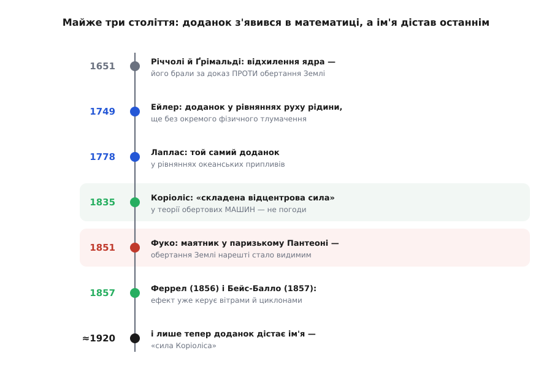

# 📜 Як задача про водяні колеса стала законом вітрів

Є в цій історії одна річ, від якої важко відвести погляд. Людина, чиїм ім'ям названо силу, що закручує урагани, за все життя не написала про погоду жодного рядка. Ґаспар-Ґюстав де Коріоліс (Gaspard-Gustave de Coriolis) рахував водяні колеса й зубчасті передачі. Математика, яку ми звемо його ім'ям, стояла в рівняннях за вісім десятиліть до того, як хтось привчився казати «сила Коріоліса», — а сама назва причепилася до неї вже по його смерті. Тож розповідь тут не про одне осяяння, а про те, як фізична ідея довго блукала від людини до людини: спершу без пояснення, потім без назви, і зрештою дісталася того, хто найменше думав про неї в тому сенсі, у якому знаємо її ми.


*Майже три століття від першої здогадки до усталеної назви. Математичний доданок жив у рівняннях задовго до того, як його назвали «силою Коріоліса», і ще довше — до того, як зрозуміли, що він означає.*

## Гарматне ядро проти Коперника

Уперше відхилення, яке ми звемо коріолісовим, з'явилося не як відкриття, а як заперечення. У 1651 році єзуїт-астроном Джованні Баттіста Річчолі (Giovanni Battista Riccioli) разом зі своїм помічником Франческо Марія Ґрімальді (Francesco Maria Grimaldi) видав велетенський трактат «Almagestum Novum» — і серед десятків доводів проти рухомої Землі виклав такий: якби Земля справді оберталася, то ядро, випущене з гармати точно на північ, мусило б відхилятися вбік, на схід. Це документований факт — саме так, з відхиленням на схід, вони й описали ефект. Але міркування працювало проти Коперника: жодного такого зносу артилеристи не помічали, отже, робив висновок Річчолі, Земля стоїть.

Іронія в тім, що логіка була бездоганна, а от масштаб — ні. Ефект справді існує; він просто настільки дрібний, що гармати XVII століття не могли його виявити — знос ховався у власному розкиданні пострілів. Виміряли це відхилення аж у XIX столітті. Тобто перша згадка про майбутню «силу Коріоліса» була аргументом, що Земля **не** крутиться, — і сам факт, який мав це довести, згодом став одним із доказів протилежного. За кілька десятиліть Ісаак Ньютон у листуванні з Робертом Гуком (Robert Hooke, 1679) запропонує споріднений дослід — простежити, куди відхиляється тіло, що вільно падає з висоти, — і завважить, що зсув на схід буде дуже малий, та, можливо, все ж достатній, щоб вирішити суперечку. Так задовго до будь-яких формул люди вже намацували: обертання опори мусить криво відхиляти те, що по ній рухається.

## Доданок, у якого ще не було ні назви, ні змісту

Далі ідея перебралася з натурфілософських суперечок у чисту математику — і там надовго занишкла без пояснення. Коли у XVIII столітті навчилися записувати рух не в нерухомому просторі, а в системі, що сама обертається, у рівняннях самі собою повилазили зайві доданки. Їх ніхто не «відкривав» як явище — вони випадали з алгебри, щойно ти перекладав закони руху на обертову мову.

Першим ці доданки виписав швейцарець Леонард Ейлер (Leonhard Euler) близько 1749 року, у праці про рух рідини — добре засвідчено, що потрібний член прискорення в нього вже є. Варто одразу відділити національність від місця служби: Ейлер — швейцарець із Базеля, і хоч чималу частину життя провів у Петербурзькій академії, на час цієї роботи він служив у Берлінській академії; «російським» математиком його часом називають помилково. Другим став француз П'єр-Симон де Лаплас (Pierre-Simon de Laplace): у своїх рівняннях океанських припливів — їх звично датують 1778 роком, хоч робота розтяглася на кінець 1770-х — той самий доданок стоїть чорним по білому.

І Ейлер, і Лаплас з ним рахували, але жоден не сказав, **що** це таке. Для них це був технічний член у рівнянні — не сила, не окреме явище, а порція алгебри, яку належить дотягти до кінця. Щоб розуміти ці доданки, треба володіти поняттям [кутової швидкості](root:ph-mechanics/angular-velocity): це вектор уздовж осі обертання — його довжина каже, як швидко крутиться система, а напрям показує, куди дивиться вісь. Саме через кутову швидкість системи відліку доданок і входить у рівняння. Але усвідомити його як **фізичну** силу, що діє на кожне рухоме тіло, — на це знадобився ще один крок і ще одна людина.

## Інженер, що рахував машини

Ґаспар-Ґюстав де Коріоліс народився 21 травня 1792 року в Парижі (це усталена дата) — того самого року, коли у Франції скидали монархію; батько подався до Нансі, і там минуло дитинство майбутнього механіка. У 1808-му він склав вступний іспит до Політехнічної школи (École Polytechnique) й пройшов другим з-поміж усього набору. Далі — викладання механіки в тій самій школі, професура, зрештою місце в Академії наук. Помер він у Парижі 19 вересня 1843 року. Життя цілком паризьке, цілком інженерне — і жодного разу не звернене до неба чи океану.

Щоб відчути, з якого боку Коріоліс підійшов до своєї сили, треба знати, чим він жив. Його займали машини — реальне залізо, що крутиться й передає роботу: водяні колеса, зубчасті передачі, тертя, гідравліка. У підручнику 1829 року «Du calcul de l'effet des machines» («Про обчислення дії машин») він робить дві речі, які ми досі носимо в кишені щодня, самі того не помічаючи. По-перше, він перший ужив слово **робота** (фр. *travail*) у нинішньому фізичному сенсі — як міру енергії, що її сила передає, діючи на шляху. По-друге, він додав множник ½ до старого лейбніцівського поняття «живої сили» (vis viva) і тим викарбував сучасну **кінетичну енергію** ½·m·v². Це добре засвідчені факти: той самий чоловік, копаючись у передачах водяного млина, подарував фізиці і «роботу», і «кінетичну енергію».

І там-таки, у машинах, визріла третя річ. Уяви лопать водяного колеса: вода тече вздовж лопаті **до** обода або **від** обода, а сама лопать при цьому обертається. Це і є рух у обертовій системі — точнісінько та задача, де в рівняннях вилазить зайвий доданок. У пам'ятці 1832 року «Sur le principe des forces vives dans les mouvements relatifs des machines» («Про принцип живих сил у відносних рухах машин»), а тоді розлого в статті 1835 року «Sur les équations du mouvement relatif des systèmes de corps» («Про рівняння відносного руху систем тіл») Коріоліс розкладає сили в обертовій системі й вирізняє серед них окремий доданок. Він не називає його своїм ім'ям — і взагалі не бачить у ньому нічого «нового»: за аналогією зі звичайною відцентровою силою він охрещує його **складеною відцентровою силою** (фр. *force centrifuge composée*). Це підтверджено першоджерелом: саме так, «складена відцентрова», а не «сила Коріоліса».

І ось головне, що варто закарбувати. У жодній із цих праць немає ні Землі, ні атмосфери, ні припливів, ні вітру. Поширений міф, ніби Коріоліс вивів свою силу, думаючи про погоду чи обертання планети, — це переказ навпаки: насправді він розв'язував інженерну задачу про передачу енергії в обертових машинах, і його сила спершу стосувалася лопатей та шестерень. Те, що вона згодом порядкуватиме циклонами над океанами, для нього самого залишилося назавжди невідомим.

> 🔧 **Навіщо це знати.** У фізиці на диво часто спершу з'являється **вміння рахувати** якусь річ, потім — **вміння її бачити**, і аж наприкінці — **чиста назва й ясний зміст**. Коріолісів доданок пройшов рівно цей шлях: спочатку алгебра Ейлера й Лапласа, далі інженерна вправа Коріоліса, потім видимий дослід Фуко, і лише за десятиліття — усталений термін. Хто плутає порядок і думає, що спершу буває «відкриття явища», а тоді вже формули, той хибно читає майже всю історію механіки.

## Побачити, як крутиться Земля

Наступний герой узагалі не рахував обертових систем — він дав його **побачити**. Французький фізик Леон Фуко (Léon Foucault) 1851 року поставив дослід такий простий і такий вражаючий, що навколо нього досі юрмляться люди.

Ідея вимальовується з тієї самої фізики. Маятник, розгойданий по прямій, прагне зберігати площину свого змаху незмінною в нерухомому просторі. Але підлога під ним — це поверхня Землі, і вона поволі повертається разом із планетою. Спостерігачеві, що стоїть поряд, здається, ніби це не він обертається, а **площина змаху** маятника повільно повзе по колу. Насправді ж маятник вірний собі, а крутиться земля під ним — і ця удавана мандрівка площини є нічим іншим, як коріолісовим відхиленням, накопиченим за тисячі змахів.

Фуко йшов до публічного тріумфу трьома кроками, і це теж документовано. Спершу, у січні 1851-го, він тихо випробував короткий, десь двометровий маятник у власному підвалі. Тоді, 3 лютого, повторив дослід переконливіше — уже з одинадцятиметровим маятником у Меридіанній залі Паризької обсерваторії, за підтримки її директора Франсуа Араго (François Arago), і того ж дня доповів про наслідки Академії наук. А далі був розмах, гідний легенди: на запрошення принца-президента Луї-Наполеона Бонапарта Фуко переніс дослід під купол паризького Пантеону.

Числа цього маятника варто вимовити повільно. З-під купола звисала сталева нитка завдовжки **67 метрів**. На її кінці — куля близько **28 кілограмів**: порожниста латунна сфера сантиметрів сімнадцять у поперечнику, налита свинцем для ваги. Гостре вістря на дні кулі за кожним проходом лишало рисочку в піску, насипаному внизу, — і глядачі на власні очі бачили, як кожна нова рисочка лягає трохи вбік від попередньої. З такою довжиною маятник ходив статечно: один повний змах тривав близько 16 секунд, як легко перевірити за шкільною формулою `T = 2π·√(L/g)`.

```
T = 2π · √(L / g) = 2π · √(67 / 9.81) ≈ 2π · 2.61 ≈ 16.4 с   (один змах)
```

А площина того змаху на широті Парижа поверталася приблизно на 11 градусів за годину — повний оберт майже за 32 години (на полюсі це були б рівно земні 24 години, на екваторі — ніколи; темп задає та сама вертикальна складова обертання, Ω·sin φ). Уперше рух планети став не астрономічним висновком, а річчю, яку можна прийти й побачити на площі. Оригінальну кулю 1851 року згодом, у 1855-му, перенесли до паризького Музею мистецтв і ремесел (Conservatoire des Arts et Métiers), де вона й лишилася.

Тут варто чесно розставити акценти. Сам Фуко подавав дослід просто як доказ обертання Землі, а не як демонстрацію «сили Коріоліса» — тоді ще ніхто так не казав. Але з погляду фізики це те саме: повільний вихор площини маятника і є коріолісове відхилення, зроблене видимим. Дослід був радше не про нову силу, а про стару планету, яку нарешті впіймали на обертанні.

## Спиною до вітру

Аж тепер, у середині XIX століття, доданок нарешті дійшов туди, де ми його найдужче цінуємо, — у погоду. І сталося це, що прикметно, ще без його майбутньої назви.

Спершу теорія. Американський метеоролог Вільям Феррел (William Ferrel) 1856 року показав теоретично: вітер, що тече до області низького тиску, не влітає в неї прямо, бо відхиляльна дія земного обертання збиває його вбік, — і саме тому повітря закручується навколо баричних центрів, а не сходиться в них по прямій. Це було, по суті, перше ясне застосування коріолісового відхилення до атмосфери.

А наступного, 1857 року, голландський метеоролог Христофор Бейс-Балло (Christophorus Buys Ballot) сформулював просте польове правило, що й досі носить його ім'я: стань спиною до вітру в Північній півкулі — і низький тиск буде ліворуч від тебе, високий праворуч (у Південній півкулі — навпаки). Тут треба віддати належне точно. Бейс-Балло вивів своє правило **емпірично**, з гори зібраних метеозведень, і, за власним зізнанням, не знав, що те саме вже вивів теоретично Феррел роком раніше; згодом він визнав першість Феррела. Понад те, Бейс-Балло, на відміну від Феррела, не пояснив, що правило постає саме з відхиляльної дії обертання Землі, — він лише описав закономірність, яку бачив у даних. Тож справедливий підпис такий: теоретична першість — за Феррелом (1856), емпіричне правило й ім'я — за Бейс-Балло (1857). Обидва варті згадки, і жоден із них тоді ще не називав цю дію «силою Коріоліса».

Отут і криється найтонший поворот усієї історії. Ефект уже цілком **працював** у метеорології — ним пояснювали циклони, за ним читали карти погоди — а власного, знайомого нам імені він іще не мав. Наука довго користувалася річчю, перше ніж дала їй чисту назву.

## Ім'я приходить останнім

Назва наздогнала явище вже на порозі XX століття, коли метеорологію ставили на суворо математичну основу. Норвежець Вільгельм Б'єркнес (Vilhelm Bjerknes) та його школа вписали відхиляльний доданок у повні рівняння руху атмосфери — і саме в цьому математичному оздобленні за ним закріпилося ім'я його давнього автора. Ще на початку століття доданок радше звали «прискоренням Коріоліса», а вислів «сила Коріоліса» усталився приблизно на 1920 рік (це засвідчене датування вжитку). Від першої здогадки Річчолі до звичного нам терміна минуло близько двохсот сімдесяти років.

Так завершується довга подорож одного доданка. Він народився запереченням у суперечці про Коперника, визрів як безіменний член у рівняннях Ейлера й Лапласа, дістав фізичне тлумачення в інженера, що рахував водяні колеса, став видимим під куполом Пантеону і почав керувати вітрами планети — і все це, перш ніж хтось назвав його «силою Коріоліса». Людина, чиє ім'я він носить, порядкувала лопатями млинів, а не бурями; і в цьому найточніший підсумок теми — уявна за походженням, «несправжня» сила виявилася аж настільки дієвою, що переросла і свого автора, і саму задачу, з якої постала.

Насамкінець — коротка мірка певності всього сказаного. Дати життя Коріоліса, назви й роки його праць, термін «складена відцентрова сила», числа маятника Фуко (67 метрів, 28 кілограмів, 1851 рік), рік і автор закону Бейс-Балло, першість Феррела — усе це усталені, документовані факти. Приписування доданка Ейлерові (близько 1749) і Лапласові (кінець 1770-х, звично 1778) добре засвідчене в історії науки, хоч точні дати подекуди різняться між джерелами. А ось популярний образ Коріоліса як «того, хто відкрив силу заради погоди» — це радше зворотний переказ, ніж правда: сила прийшла до погоди пізніше й іншими руками.
