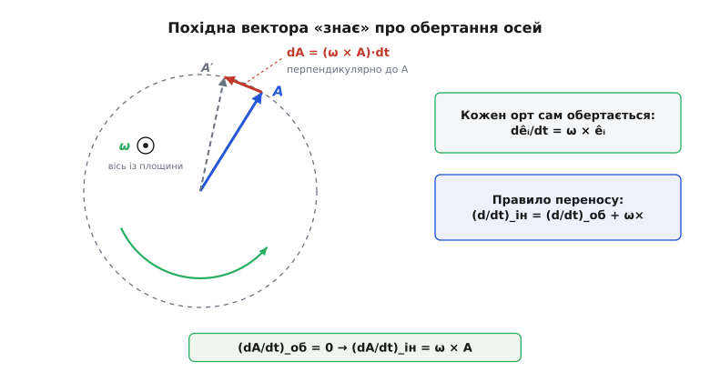
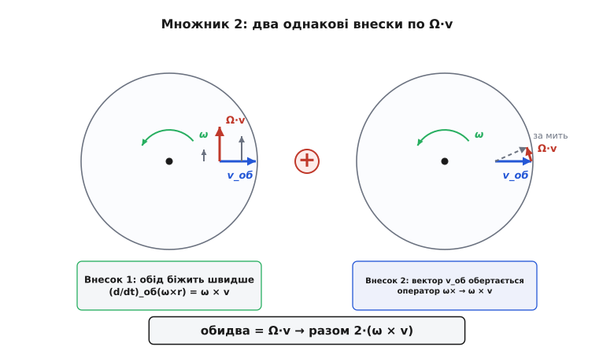

# 🧮 Виведення сили Коріоліса: одна похідна, застосована двічі

Коротка формула `−2m(ω × v)` носить у собі множник 2, і його зазвичай виправдовують «на пальцях»: складаються, мовляв, два однакові внески по `Ω·v`. Пояснення правильне, та лишає по собі присмак випадковості — ніби природа знічев'я поклала поряд дві рівні величини. Насправді випадковості немає. І сам доданок `−2ω×v`, і його сусіди — відцентровий та ейлерів, — і навіть та двійка виростають з **однієї** ідеї, ужитої двічі поспіль. Ідея про те, як змінюється похідна за часом, коли пересідаєш із нерухомої опори на обертову. Розгорнімо її до кінця — і двійка з фокуса перетвориться на неминучість.

Ось план. Спершу здобудемо єдиний інструмент — правило, що зв'язує швидкість зміни будь-якого вектора у двох системах відліку. Тоді застосуємо його до радіус-вектора **один** раз (вийде швидкість) і **вдруге** (вийде прискорення). У другому застосуванні коріолісів доданок випаде сам собою, уже з двійкою, і ми точно побачимо, з яких двох місць вона набігає. Наостанок доведемо два факти, що роблять цю силу такою особливою: її величину `2Ωv·sinθ` і те, що вона не виконує жодної роботи.

## Одна ідея: похідна, що знає про обертання осей

Уся конструкція тримається на одному спостереженні. Нерухома (інерціальна) система і обертова система відліку хай мають **спільний початок**, а обертова крутиться відносно нерухомої з кутовою швидкістю ω — вектором уздовж осі обертання (величина Ω = |ω| задає темп у рад/с, напрям — за правилом правої руки). [Кутова швидкість](topic:ph-mechanics/angular-velocity) — саме такий осьовий вектор; його ми беремо готовим.

Візьмімо будь-який вектор A — байдуже, чи то радіус-вектор, чи швидкість, чи що завгодно. Обертовий спостерігач розкладає його за **своїми** ортами ê₁, ê₂, ê₃, які для нього нерухомі:

```
A = A₁·ê₁ + A₂·ê₂ + A₃·ê₃
```

Коли він рахує швидкість зміни A, то диференціює лише **числа** — компоненти Aᵢ, — бо орти вважає застиглими. Це і є похідна «в обертовій системі»:

```
(dA/dt)_об = (dA₁/dt)·ê₁ + (dA₂/dt)·ê₂ + (dA₃/dt)·ê₃
```

А тепер погляньмо на той самий вектор очима нерухомого спостерігача. Для нього змінюються **дві** речі: і компоненти Aᵢ, і самі орти êᵢ — адже вони обертаються разом із рухомою системою. Тож повна похідна за правилом добутку розпадається на дві суми:

```
(dA/dt)_ін = Σ (dAᵢ/dt)·êᵢ  +  Σ Aᵢ·(dêᵢ/dt)
             └─── компоненти ───┘   └── орти ──┘
```

Перша сума — це буквально `(dA/dt)_об` згори: та частина зміни, яку бачить обертовий спостерігач. Лишається друга сума — внесок від того, що осі повело. Але орт êᵢ — це одиничний вектор, жорстко приклеєний до обертового тіла; його кінець рухається так само, як будь-яка точка твердого тіла, що крутиться зі швидкістю ω, — тобто зі швидкістю `ω × êᵢ`:

```
dêᵢ/dt = ω × êᵢ
```

Підставмо й винесімо ω за дужку (векторний добуток лінійний):

```
Σ Aᵢ·(ω × êᵢ) = ω × (Σ Aᵢ·êᵢ) = ω × A
```

Складаємо обидві частини — і дістаємо **правило переносу похідної** (англ. *transport theorem*), той єдиний інструмент, заради якого все й затівалося:

```
(dA/dt)_ін = (dA/dt)_об + ω × A
```

Або, відкинувши конкретний вектор, як тотожність між самими операторами диференціювання:

```
(d/dt)_ін = (d/dt)_об + ω ×
```

Читається це так: щоб перевести швидкість зміни будь-чого з обертової мови на інерціальну, додай `ω×` цього «будь-чого». Векторний добуток тут не прикраса — саме [векторний добуток](topic:math-algebra/cross-product) `ω × A` (перпендикулярний і до ω, і до A, з величиною Ω·A·sinθ) кодує геометрію обертання: він показує, куди й наскільки швидко рушає кінець вектора лише через те, що осі повело.

Найяскравіше правило видно на межі. Хай вектор A **застиг для обертового спостерігача** — його компоненти сталі, тож `(dA/dt)_об = 0`. Здавалося б, вектор не змінюється. Але нерухомий спостерігач бачить інше: кінець A виписує коло, і його інерціальна похідна аж ніяк не нульова, а дорівнює `ω × A`. Застиглий в одній системі вектор «живий» в іншій — і різницю несе рівно доданок `ω×`.


*Вектор A нерухомий в обертовій системі: `(dA/dt)_об = 0`. Проте осі крутяться, і в інерціальній системі кінець A за час dt проходить дугу `(ω×A)·dt` — перпендикулярно до A, по колу радіуса |A|. Тому `(dA/dt)_ін = ω×A` навіть тоді, коли обертовий спостерігач присягається, що вектор застиг. Це і є `ω×`-доданок правила переносу.*

Перш ніж рухатись далі, звернімо один дрібний, але корисний наслідок. Застосуймо правило до самої ω:

```
(dω/dt)_ін = (dω/dt)_об + ω × ω = (dω/dt)_об
```

бо `ω × ω = 0` (вектор перпендикулярний сам до себе не буває — паралельні множники дають нуль). Отже, **кутове прискорення однакове в обох системах**; далі писатимемо просто `dω/dt`, не позначаючи систему. Дрібниця, а знадобиться за хвилину.

## Перше застосування: швидкість

Наведімо правило на радіус-вектор r — стрілку від спільного початку до тіла. Оскільки початок спільний, обидва спостерігачі бачать той самий r; різняться лише їхні похідні:

```
(dr/dt)_ін = (dr/dt)_об + ω × r
```

Ліворуч — швидкість тіла в інерціальній системі, `v_ін`. Праворуч перший доданок — швидкість, яку міряє обертовий спостерігач, `v_об`. Тож:

```
v_ін = v_об + ω × r
```

Зміст прозорий: істинна швидкість тіла складається з того, як воно повзе **по** каруселі (`v_об`), і того, як його несе **разом** із каруселлю (`ω × r` — колова швидкість тієї точки диска, де тіло зараз є). Стій нерухомо на краю (`v_об = 0`) — і вся твоя швидкість це `ω × r`, чистий проїзд на ободі.

## Друге застосування: прискорення, і звідки двійка

Тепер головне. Прискорення в інерціальній системі — це інерціальна похідна від інерціальної швидкості: `a_ін = (dv_ін/dt)_ін`. У нас `v_ін` уже виражена. Але диференціювати її треба **в інерціальній системі**, а формулу ми маємо через обертові величини — тож знову беремо правило переносу, цього разу застосоване до вектора `v_ін`:

```
a_ін = (d/dt)_ін v_ін = [ (d/dt)_об + ω× ] (v_об + ω × r)
```

Розкриймо це чесно, доданок за доданком. Спершу обертова похідна дужки:

```
(d/dt)_об (v_об + ω × r) = a_об + (dω/dt)×r + ω×(dr/dt)_об
                         = a_об + (dω/dt)×r + ω × v_об
```

(тут `(dr/dt)_об = v_об`, а `dω/dt` не потребує позначки системи — щойно з'ясували, що воно однакове). Тепер друга частина оператора — `ω×`, застосований до тієї ж дужки:

```
ω × (v_об + ω × r) = ω × v_об + ω × (ω × r)
```

Складаємо обидва рядки:

```
a_ін = a_об + (dω/dt)×r + ω×v_об  +  ω×v_об + ω×(ω×r)
```

Два доданки `ω × v_об` стоять поруч — збираємо їх, і ось повне співвідношення між прискореннями:

```
a_ін = a_об + 2·(ω × v_об) + ω×(ω×r) + (dω/dt)×r
```

Придивімося, **звідки взявся кожен із двох** доданків `ω×v_об`, бо саме тут захована та двійка «на пальцях» — тепер уже без пальців:

- **Перший** прийшов із `(d/dt)_об(ω × r) = ω × v_об`. Це швидкість зміни переносної швидкості `ω × r`: коли тіло повзе по диску (має `v_об`), воно потрапляє в точки з іншою ободовою швидкістю, і `ω × r` міняється, бо міняється r. Фізично — *«обід біжить дедалі швидше, і тіло, сунучись назовні, мусить доганяти чимраз більшу колову швидкість»*.
- **Другий** прийшов від оператора `ω×`, що подіяв на `v_об`. Це внесок від самого обертання осей у похідну вектора швидкості. Фізично — *«сам вектор `v_об`, якщо дивитися з нерухомого простору, безперервно повертається разом із каруселлю»*.

Два різні джерела, дві різні фізичні картини — а векторний вираз в обох вийшов **буквально той самий**, `ω × v_об`. Ось чому двійка точна, а не приблизна: це не збіг двох близьких чисел, а сума двох тотожних членів, яку продиктувало правило добутку при диференціюванні. Правило переносу, застосоване двічі, не могло дати нічого іншого.


*Тіло їде прямо від центра обертового диска зі швидкістю `v_об`. Ліворуч — внесок від `(d/dt)_об(ω×r)`: за час руху назовні тіло переходить на швидший обід, і його треба підганяти вбік із прискоренням Ω·v. Праворуч — внесок від оператора `ω×`: радіальний вектор `v_об` сам обертається разом із диском, що теж дає бічне прискорення Ω·v. Обидва тангенційні, однакові за напрямом — тож додаються в `2Ω·v`.*

## Перегрупування: три інерційні сили

Прискорення `a_ін` пов'язане з **справжніми** силами звичним законом Ньютона: `m·a_ін = F_справж` (сума сил від реальних взаємодій — тяжіння, тиску, тертя). Обертовий же спостерігач хоче користуватися своїм прискоренням `a_об`. Виразімо його, просто переставивши доданки:

```
a_об = a_ін − 2·(ω × v_об) − ω×(ω×r) − (dω/dt)×r
```

і помножмо на масу:

```
m·a_об = F_справж − 2m·(ω × v_об) − m·ω×(ω×r) − m·(dω/dt)×r
```

Обертовий спостерігач читає це рівняння як «своє» `m·a_об = F_справж + (інерційні сили)» і хрестить три зайві доданки:

```
F_Коріоліса   = −2m·(ω × v_об)        залежить від ШВИДКОСТІ тіла
F_відцентрова = −m·ω×(ω×r)            залежить від МІСЦЯ (r), тягне назовні
F_Ейлера      = −m·(dω/dt)×r          від зміни ТЕМПУ обертання
```

Так коріолісів доданок `−2m(ω × v)` виокремлено начисто — це один із трьох членів, що їх породжує перехід в обертову систему, і саме той, що чіпляється за швидкість тіла. Два його сусіди варто знати в обличчя. Відцентровий `−m·ω×(ω×r)` не залежить від руху й діє навіть на застигле тіло — на Землі його тихо ввібрано в «ефективну силу тяжіння», тому ми його зазвичай і не помічаємо окремо. **Сила Ейлера** `−m·(dω/dt)×r` (названа на честь Леонарда Ейлера; її ще звуть азимутальною) з'являється лише тоді, коли темп обертання **міняється** — розкручується чи гальмує диск. Земля обертається практично рівномірно (`dω/dt ≈ 0`), тож для геофізики ейлерів член зникає, і на сцені лишаються двоє: відцентровий та коріолісів.

> 🔧 **Навіщо це.** Ця викладка — не самоціль. Вона показує, що всі інерційні сили родом з одного місця: вони не «додаткові взаємодії», а сліди правила переносу, ціна за право писати `F = ma` там, де осі крутяться. Хто раз провів це виведення, той більше не сплутає, скільки таких доданків буває (рівно три), який від чого залежить і чому в коріолісовому стоїть саме 2, а не 1 чи π.

## Величина і параметр Коріоліса

З формули `F_Коріоліса = −2m(ω × v_об)` величина зчитується прямо з означення векторного добутку `|ω × v| = Ω·v·sinθ`:

```
|F_Коріоліса| = 2·m·Ω·v·sinθ
```

де θ — кут між віссю обертання ω і швидкістю v_об. Коли рух **уздовж осі** (θ = 0), синус нульовий — Коріоліса немає; коли **впоперек осі** (θ = 90°) — сила найбільша. Це вже фізичний факт, а не постулат: він сидить у синусі векторного добутку.

На Землі цю θ-залежність перекладають на **широту**. Вектор земного обертання ω дивиться крізь полюси, а людину на поверхні цікавить рух уздовж місцевого горизонту. Розкладімо ω у точці широти φ на дві складові — уздовж місцевої вертикалі й уздовж горизонту:

```
ω = ω_верт + ω_гор,      |ω_верт| = Ω·sinφ,   |ω_гор| = Ω·cosφ
```

Горизонтальний рух `v` лежить у площині горизонту. Його бічне відхилення **всередині** цієї площини дає лише вертикальна складова обертання `ω_верт` — та частина, що крутить сам «диск» горизонту. Бічне (горизонтальне) прискорення виходить

```
a_бічне = 2·|ω_верт|·v = 2·Ω·sinφ·v ≡ f·v
```

і так народжується головна стала геофізики — **параметр Коріоліса**:

```
f = 2·Ω·sinφ
```

Він увібрав у себе і двійку (з двох рівних внесків), і темп обертання Ω, і широту через sinφ. На екваторі (φ = 0) f = 0 — горизонтальний рух не зносить; на полюсі (φ = 90°) f максимальний. (Горизонтальна складова `ω_гор` теж не даремна: вона відхиляє горизонтальний рух **угору-вниз** — це слабший ефект Етвеша, який на практиці забиває сила тяжіння.)

## Чому ця сила не виконує роботи

Лишився останній, і найкрасивіший, факт. Потужність будь-якої сили — це `P = F · v`, [скалярний добуток](topic:math-algebra/dot-product) сили на швидкість тіла. Підставмо коріолісову силу й пораховану вже швидкість `v_об`:

```
P = F_Коріоліса · v_об = −2m·(ω × v_об) · v_об
```

А тепер ключ: вектор `ω × v_об` за самим означенням векторного добутку **перпендикулярний** до кожного зі своїх множників — зокрема до `v_об`. Скалярний добуток перпендикулярних векторів — нуль:

```
(ω × v_об) · v_об = 0        (бо ω × v_об ⊥ v_об)
```

Отже, **тотожно, за будь-якого руху**:

```
P = 0
```

Сила Коріоліса не передає тілу й не забирає в нього ані джоуля енергії. А коли потужність нульова, незмінна й кінетична енергія `½m·v_об²`, отже незмінна й величина швидкості `|v_об|`. Звідси прямий висновок: **Коріоліс не пришвидшує й не гальмує — він лише загинає траєкторію**. Тіло рухається (у своїй системі) рівно так само швидко, як рухалося б без нього; змінюється тільки напрям. І це не наближення для малих ефектів — це точна тотожність, вимушена перпендикулярністю векторного добутку.

Той самий підпис має ще одна сила в фізиці. Магнітна частина [сили Лоренца](topic:ph-electromagnetism/lorentz-force) `q(v × B)` збудована точнісінько так само — векторним добутком швидкості на поле, — і з тієї ж причини не виконує роботи, а лиш закручує заряд по колу. Обидві сили — родичі за геометрією: перпендикулярні до руху, безсилі над енергією, владні над формою шляху.

Складімо все в один короткий числовий контроль — переконаймося, що три щойно виведені твердження (нульова робота, величина `2Ωv·sinθ`, зведення до `f·v`) сходяться на конкретних числах:

```python
import math

def cross(a, b):
    return (a[1]*b[2] - a[2]*b[1],
            a[2]*b[0] - a[0]*b[2],
            a[0]*b[1] - a[1]*b[0])
def dot(a, b):
    return a[0]*b[0] + a[1]*b[1] + a[2]*b[2]
def mag(a):
    return math.sqrt(dot(a, a))

Omega = 7.29e-5                      # темп обертання Землі, рад/с
phi   = math.radians(50)            # широта

# вісь Землі (z — угору) і горизонтальна швидкість тіла в площині горизонту
w = (0.0, 0.0, Omega)              # ω уздовж осі
v = (300.0, 0.0, 0.0)             # v_об = 300 м/с у горизонтальній площині

Fc = tuple(-2*c for c in cross(w, v))          # F_Коріоліса / m = −2 ω×v

print("робота (F·v):", round(dot(Fc, v), 12))   # → 0.0 — сила не працює
theta = math.acos(dot(w, v)/(mag(w)*mag(v)))     # кут між ω і v = 90°
print("|F|/m прямо  :", round(mag(Fc), 8))
print("|F|/m формула:", round(2*Omega*mag(v)*math.sin(theta), 8))  # 2Ω v sinθ — те саме

f = 2*Omega*math.sin(phi)                        # параметр Коріоліса
print("f·v (бічне a):", round(f*mag(v), 8))      # горизонтальне відхилення горизонт. руху
```

Робота виходить рівно нуль (з точністю до машинного округлення), а обидва способи порахувати величину — прямий модуль `|−2ω×v|` і формула `2Ωv·sinθ` — дають те саме число. Параметр `f = 2Ω·sinφ` перетворює це на просте `a = f·v`, готове до підстановки в рівняння погоди чи балістики.

Ось і вся анатомія коріолісового доданка. Одне правило — похідна, що додає `ω×` при переході на обертову опору. Застосоване до `r` один раз, воно дає швидкість; застосоване вдруге — прискорення, у якому член `2ω×v` випадає з двох тотожних шматків правила добутку (звідси точна двійка), поряд із відцентровим `ω×(ω×r)` і ейлеровим `(dω/dt)×r`. Перпендикулярність векторного добутку до множника гарантує, що ця сила ніколи не працює, а тільки згинає шлях. Те, що основна тема описала словами й картинками, тут виявилося не оповіддю, а неминучим наслідком одного рядка алгебри.
