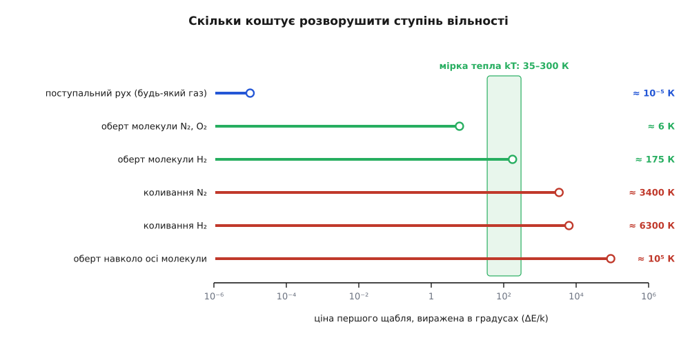
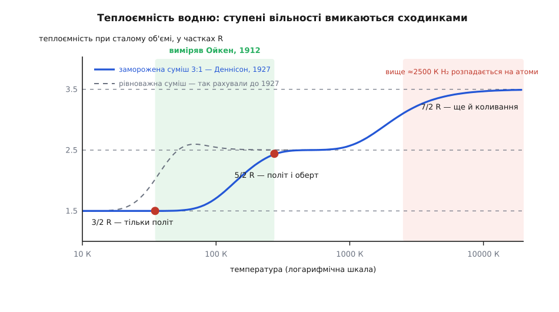

# 📜 Як ступені вільності «замерзли»: найбільша трудність молекулярної теорії

Підрахунок ступенів вільності має наслідок, який перевіряється звичайним приладом: він каже, скільки тепла ввійде в газ, перш ніж той нагріється на градус. Пів століття цей наслідок давав неправильну відповідь — і саме з упертої розбіжності між порахованими ступенями й виміряним теплом виросло переконання, що енергія надходить порціями. Ось як це сталося: хто натрапив на розбіжність, як від неї намагалися відмахнутися і чим вона врешті виявилася.

---

## Ступені вільності можна почути

Спершу — чому підрахунок узагалі підлягає перевірці приладом.

Газ можна гріти двома способами. У закритій посудині все тепло йде на розворушення молекул; під поршнем сталого тиску частина тепла ще й розштовхує поршень. Звідси дві [теплоємності](root:ph-thermodynamics/heat-capacity) — C_V і C_p — і їхнє відношення γ = C_p/C_V. Якщо кожен ступінь вільності бере [однакову пайку](root:ph-thermodynamics/equipartition-theorem) теплової енергії, то внутрішня енергія молю газу з f ступенями становить (f/2)·RT, а робота проти сталого тиску додає рівно R:

```
C_V = (f/2)·R
C_p = C_V + R
γ  = C_p/C_V = 1 + 2/f
```

Отже γ — прямий лічильник ступенів вільності. І щоб його зняти, калориметр навіть не потрібен: у газі γ визначає [швидкість звуку](root:ph-waves/speed-of-sound). Звукова хвиля стискає газ надто швидко, щоб тепло встигло розтектися, тож стиск відбувається без обміну теплом, і саме цим 1816 року П'єр-Сімон Лаплас (*Pierre-Simon Laplace*) виправив формулу Ньютона, яка недобирала близько шостої частини: v = √(γ·p/ρ). Число ступенів вільності молекули справді можна почути — у тому, наскільки прудко в газі біжить звук.

**Що передбачає підрахунок і що показує прилад.**

```
f = 3  → γ = 1.667    політ у трьох напрямках
f = 5  → γ = 1.400
f = 6  → γ = 1.333    жорстка гантель: 3 переміщення + 3 оберти
f = 7  → γ = 1.286    та сама гантель, що ще й розтягується-стискається

виміряно:  аргон, гелій ≈ 1.67 ;  повітря ≈ 1.40
```

Одноатомний аргон лягає ідеально. А повітря — це N₂ і O₂, двоатомні гантелі: у них має бути щонайменше шість ступенів, а з коливанням сім. Виміряне 1.40 відповідає п'яти. Одного ступеня бракує, а якщо рахувати чесно, з коливанням, — трьох.

---

## Максвелл: «найбільша трудність»

Першим у цю стіну вперся Джеймс Клерк Максвелл (*James Clerk Maxwell*, 1831–1879, шотландець). 1860 року в праці «Illustrations of the Dynamical Theory of Gases» він розглянув молекули як пружні тіла, що не лише летять, а й крутяться, — тобто шість ступенів вільності, — і дістав γ = 4/3. Дослід уперто показував 1.408. Максвелл виснував: такі частинки просто не можуть задовольнити відоме відношення двох теплоємностей газів.

Через п'ятнадцять років, 18 лютого 1875-го, у лекції перед Хімічним товариством у Лондоні (надрукована в *J. Chem. Soc.* 28, 493–508) він повернувся до цього вже без будь-якої надії. Виразивши γ через сумарне число ступенів вільності молекули — у його позначеннях n + e — і підставивши виміряне 1.408, Максвелл дістав:

```
γ = 1 + 2/(n + e) = 1.408   →   n + e = 4.9
```

І сказав про це так: тут ми стаємо віч-на-віч із **найбільшою трудністю, з якою досі стикалася молекулярна теорія** (*«the greatest difficulty which the molecular theory has yet encountered»*), — а саме з тлумаченням рівняння n + e = 4.9.

Чому 4.9 було не просто незручним числом, а лихом, видно з другої половини тієї ж лекції. Спектроскоп показував: молекула світить різкими лініями сталого періоду, отже вона не точка, а система, здатна змінювати форму. Кожна лінія в спектрі — окреме внутрішнє коливання, тобто окремий ступінь вільності. Ліній у молекул десятки. А кожен доданий ступінь тільки збільшує пораховану теплоємність, не змінюючи тиску, — тож γ мусить сповзати ще ближче до одиниці. Максвелл підкреслив саме це: будь-яке ускладнення молекули лише **погіршує** узгодження порахованої теплоємності з виміряною.

Ось у чому пастка. Два прилади дивилися на ту саму молекулу й давали протилежні свідчення. Спектроскоп: ступенів багато. Калориметр: ступенів п'ять. Це не розбіжність у відсотках, яку можна списати на точність, — це двоє свідків, які не можуть обидва казати правду. Максвелл помер 1879 року, не знайшовши виходу.

---

## Кельвінова хмара і спроби втекти

Проблема не розсмокталася. 27 квітня 1900 року в лондонському Королівському інституті лорд Кельвін (*William Thomson, lord Kelvin*, 1824–1907) прочитав лекцію «Nineteenth Century Clouds over the Dynamical Theory of Heat and Light» (надрукована в *Phil. Mag.*, липень 1901). Дві хмари затуляли, на його думку, ясне небо фізики. Перша — рух Землі крізь ефір. Друга — вчення Максвелла й Больцмана про розподіл енергії, тобто рівно наш підрахунок ступенів вільності. Обидві хмари згодом розродилися революціями: перша — теорією відносності, друга — квантовою механікою.

Виходи пропонували різні, і кожен на свій лад був спробою врятувати класику.

**Кельвін** пропонував найпростіше: оголосити теорему про рівний розподіл хибною. Якщо ступені не діляться порівну, то й рахувати нічого — розбіжність зникає разом із правилом.

**Больцман** (*Ludwig Boltzmann*, 1844–1906, австрієць) захищав теорему й переносив провину на час. Внутрішні коливання, доводив він, чіпляються за політ молекули настільки кволо, що за час досліду енергія просто не встигає до них дотекти. Теорема правильна — газ ще не дійшов туди, куди вона його веде. Пізніше на ту саму лазівку спирався Джеймс Джинс (*James Jeans*), рятуючи класику вже й у справах випромінювання.

Больцманова відповідь була розумна, але мала слабке місце, видиме одразу. Якщо це запізнення, воно мусить залежати від того, скільки чекати: нагрій газ, потримай його довше — і бракуючий шматок теплоємності має поволі проступити. Виміряна теплоємність натомість поводилася як звичайна властивість речовини — та сама щоразу, скільки не чекай, і залежна лише від температури. А ще спектральні лінії свідчили, що молекули випромінюють і поглинають своїми внутрішніми коливаннями цілком охоче — тобто мають рівно той зв'язок, який лазівка мусила заперечити. Але остаточно суперечку закрив не аргумент. Її закрив термометр.

---

## Перший ключ знайшовся не в газі, а в алмазі

Розгадка прийшла збоку — з твердих тіл, де той самий підрахунок ступенів вільності мав ще простіший вигляд.

1819 року П'єр-Луї Дюлонг (*Pierre Louis Dulong*, 1785–1838) і Алексіс Терез Пті (*Alexis Thérèse Petit*, 1791–1820) виявили, що моль будь-якого твердого простого тіла вбирає майже однаково тепла — близько 25 Дж/(моль·К), тобто 3R. Підрахунок пояснює це негайно: атом у ґратці колишеться в трьох напрямках, а коливання тримає енергію двома способами — рухом і натягом пружини, — тож на кожен напрямок припадає дві пайки, разом шість, тобто 3R. Красиве підтвердження.

Але алмаз не слухався: за кімнатної температури його теплоємність десь учетверо менша за належні 3R. У 1872 та 1875 роках Гайнріх Фрідріх Вебер (*Heinrich Friedrich Weber*, 1843–1912, швейцарець), працюючи в берлінській лабораторії Гельмгольца, ретельно проміряв вуглець, бор і кремній і показав головне: їхня теплоємність не просто мала — вона **надзвичайно швидко росте з нагріванням**. Ступені вільності не зникли назавжди. Вони поверталися, коли ставало гарячіше. Це вже не брак у підрахунку, а якийсь перемикач, і ручка перемикача — температура.

1907 року Альберт Ейнштейн (*Albert Einstein*, 1879–1955) у статті «Die Plancksche Theorie der Strahlung und die Theorie der spezifischen Wärme» (*Ann. Phys.* 22, 180–190) повернув цю ручку. Він узяв Планків осцилятор, який приймає енергію лише порціями hν — вигаданий для [теплового випромінювання](root:ph-thermodynamics/planck-law-and-blackbody-spectrum), — і приклав його до атомів у кристалі. Середня енергія такого осцилятора:

```
⟨E⟩ = hν / (e^(hν/kT) − 1)
```

За kT ≫ hν експонента розкладається, ⟨E⟩ → kT — класика ціла. За kT ≪ hν знаменник вибухає, і ⟨E⟩ спадає як e^(−hν/kT), тобто експоненційно швидко: осцилятор не бере майже нічого. Ейнштейн підігнав криву до алмазу з hν/k ≈ 1300 К — і дані, на які він її клав, були Веберові, зняті його ж власним професором у цюрихському Політехнікумі. Це була перша квантова теорія речовини, а не випромінювання.

У тій самій статті Ейнштейн зазначив, що те саме міркування знімає й газовий парадокс: якщо коливанню молекули відповідає велике hν, за кімнатної температури воно не збуджується й у теплоємність не входить.

Отже, обидва свідки казали правду. Максвеллові спектральні лінії справді є внутрішні коливання. Просто щабель у них надто дорогий.

**Скільки коштує коливання азоту.** Коливанню молекули N₂ відповідає хвильове число 2359 см⁻¹; переведімо його в градуси, поділивши на сталу Больцмана:

```
hν/k = 1.4388 см·К × 2359 см⁻¹ ≈ 3390 К
за T = 300 К:   hν/kT ≈ 11.3
частка збуджених:  e^(−11.3) ≈ 1.2·10⁻⁵
```

Приблизно одна молекула зі ста тисяч коливається. Ступінь вільності на місці, але порожній — на теплоємності він не позначається ніяк.

Це знімає два з трьох бракуючих ступенів. Третій — оберт навколо власної осі гантелі. Момент інерції відносно цієї осі створюють самі лише електрони, він у десятки тисяч разів менший за поперечний, а що менший момент інерції, то дорожчий щабель: ціна виходить порядку 10⁵ К. Такий оберт заморожений за будь-якої температури, за якої молекула ще існує. Лишається 3 + 2 = 5. Максвеллове 4.9.

---

## Водень видає таємницю: холод Ойкена, 1912

Пояснення заднім числом — річ ненадійна. Потрібен був дослід, у якому ступінь вільності замерзає на очах: охолоджуєш газ і бачиш, як теплоємність спадає рівно на одну сходинку.

Ловити треба оберт, бо його щабель найдешевший. А наскільки дешевий, вирішує момент інерції: що легша й коротша молекула, то більший квант. Найлегша з усіх — H₂.

**Ціна першого щабля обертання водню.**

```
μ = m_H/2 = 8.37·10⁻²⁸ кг ,  r = 0.74·10⁻¹⁰ м
I = μ·r² = 8.37·10⁻²⁸ · (0.74·10⁻¹⁰)² ≈ 4.6·10⁻⁴⁸ кг·м²
ΔE = ħ²/I = (1.055·10⁻³⁴)² / 4.6·10⁻⁴⁸ ≈ 2.4·10⁻²¹ Дж
у градусах:  ΔE/k ≈ 2.4·10⁻²¹ / 1.38·10⁻²³ ≈ 175 К
```

Для азоту те саме число становить близько 6 К — а азот скраплюється вже за 77 К, тож його оберт нізащо не застукати замерзлим, поки він ще газ. Водень же кипить за 20 К. Між 20 і 175 К зяє вікно, де водень усе ще газ, а обертатися йому вже не по кишені. Серед звичайних молекул таке вікно має тільки він.


*Ціна першого щабля кожного ступеня вільності, виражена в градусах. Ліворуч від зеленої смуги щабель дешевший за наявне тепло — ступінь працює; праворуч задорогий — ступінь заморожений. Видно, чому дослід можливий тільки на водні: лише його оберт стоїть майже впритул до земних температур.*

1911 року Вальтер Нернст (*Walther Nernst*, 1864–1941) зауважив, що нова квантова теорія й теплоємності газів можуть просвітити одна одну, і окремо вказав на водень за низьких температур. Наступного року його співробітник Арнольд Ойкен (*Arnold Eucken*, 1884–1950) у берлінській лабораторії Нернста це виміряв: від 273 до 35 К мольна теплоємність водню впала з 4.84 до 2.98 кал/(моль·К) — тобто з 2.44R до 1.50R.

1.50R — це точнісінько 3/2 R, значення для окремого атома, який уміє лише летіти. Двоатомна молекула, охолонувши, перестала перекидатися. Два ступені вільності зникли — відтворювано, оборотно й рівно там, де квант і обіцяв.

---

## Що означає «замерзнути»

Слово «замерзнути» тут не образ, а точний опис — це видно, щойно глянеш, як ступінь вільності приймає енергію.

Ступінь вільності — не діжка, куди ллють енергію, а драбина з щаблями. Теплові поштовхи приносять приблизно kT за раз. Там, де щаблі набагато нижчі за kT — а поступальний рух молекули в лабораторній посудині має щаблі порядку 10⁻⁵ К, — драбина здається суцільним пандусом, і класичний рівний розподіл виконується бездоганно. Там, де щабель коштує набагато більше за kT, [больцманів множник](root:ph-thermodynamics/boltzmann-factor) e^(−ΔE/kT) робить заселеність першого щабля мізерною: зіткнення приносять надто дрібну решту. Ступінь вільності не вимкнено — він **не по кишені**. Нагрій газ так, щоб kT дорівняло ціні щабля, і ступінь повернеться.

Аналогія з грішми тут майже точна: касовий апарат приймає лише банкноту певного номіналу, а в тебе самі копійки. Ламається вона в одному місці — копійки не накопичуються. Молекула не збирає дрібні поштовхи, поки не набереться на щабель; кожне зіткнення або дає цілу порцію, або не дає нічого. Саме тому [квантування енергії](root:ph-quantum/energy-quantization) не просто сповільнює обмін, а обриває його начисто.

> 🔧 **Навіщо це.** Щоразу, коли пишеш C_V = (f/2)·R, ти цитуєш число, чинне лише у вузькому вікні температур. Повітря за 300 К має f = 5 і γ = 1.40. У соплі ракетного двигуна чи за ударною хвилею при 3000 К коливання N₂ і O₂ прокидаються, f повзе до семи, а γ — до 1.29. Розрахунок, що взяв звичні 1.4 як сталу, дасть неправильні температуру, тягу й теплові потоки на обшивку. Тому в газодинамічних програмах носять не одне число, а таблиці C_p(T): ступені вільності вмикаються по дорозі.

---

## Останній розбіг: 1913–1927 і спін протона

Криву Ойкена виміряли — а от відтворити її розрахунком виявилося справою на п'ятнадцять років.

1913 року з'явилися два квантові пояснення, обидва підігнані до тих самих даних. Ейнштейн з Отто Штерном (*Otto Stern*, 1888–1969) побудували обертову теплоємність і виснували, що збіг вимагає нульової енергії hν/2, яку ротатор тримає навіть при абсолютному нулі (*Ann. Phys.* 40, 551). Уже восени того ж року, на другому Сольвеївському конгресі, Ейнштейн від цього висновку відмовився: у нульову енергію він більше не вірив. Майже одночасно Пауль Еренфест (*Paul Ehrenfest*, 1880–1933, віденець з єврейської родини, професор у Лейдені) проквантував енергію ротатора безпосередньо й дістав потрібну залежність від температури **без** жодної нульової енергії (*Verh. DPG* 15, 451).

Далі пішла смуга невдач. Райхе, Кратцер, Толмен, Кембл, Планк, Шредінгер — кожен виводив свою криву, і жодна не лягала на Ойкенові точки. Стан справ у тодішніх оглядах називали просто хаотичним.

Вузол розв'язали 1927 року, і не кращою моделлю ротатора. Після того як Вернер Гайзенберг (*Werner Heisenberg*) і Фрідріх Гунд (*Friedrich Hund*) розібралися, що квантова механіка робить із **тотожними** частинками, американець Дейвід Денісон (*David M. Dennison*, 1900–1976) у нотатці «A note on the specific heat of the hydrogen molecule» (*Proc. R. Soc. A* 115, 483–486, 1 липня 1927) склав два факти докупи.

Перший факт: два протони в молекулі водню нерозрізненні, і це накладає на молекулу вимогу симетрії, яка розколює водень на два різні гатунки. У **ортоводні** спіни протонів дивляться в один бік, і молекулі дозволено лише непарні щаблі обертання; статистична вага такого стану — три. У **параводні** спіни протилежні, дозволено лише парні щаблі, включно з найнижчим; вага — одиниця. (Спін — власний момент кількості руху частинки, який не зводиться до жодного обертання; найвідоміший його приклад — [спін електрона](root:ph-quantum/electron-spin), але свій спін має й протон.)

Сам собою цей розкол був би тільки бухгалтерією. Другий факт Денісона стосувався **часу**. Перескочити з одного гатунку в інший звичайним зіткненням молекула не може: для цього треба перевернути ядерний спін, а зачіпка за нього мізерна. Денісон оцінив, що такий перехід стається приблизно раз на три місяці. Отже водень у колбі — не рівноважна суміш, яка перебудовується, поки її холодять. Це **заморожена** суміш 3:1, що несе в холод те співвідношення, яке мала за кімнатної температури.

Порахуй теплоємність замороженої суміші 3:1 замість рівноважної — і Ойкенова крива 1912 року виходить сама.


*Теплоємність водню сходинками. Червоні точки — крайні виміри Ойкена 1912 року: 1.50R при 35 К і 2.44R при 273 К. Пунктирна крива — те, що дає квантова теорія обертання для рівноважної суміші; вона повз досліди промахується. Суцільна — розрахунок для замороженої суміші 3:1, і от він лягає в точки. Верхньої сходинки 7/2 R водень так і не досягає: за таких температур молекула вже розпадається на атоми.*

Найупертіша цифра в теплоємності газу виявилася звісткою з атомного ядра: протон має спін. Через два роки Карл Фрідріх Бонгеффер (*Karl Friedrich Bonhoeffer*) і Пауль Гартек (*Paul Harteck*) виділили параводень окремою речовиною й показали повільне перетворення гатунків наочно.

---

## Чому 4.9 не було помилкою

Підрахунок ступенів вільності ніколи не був хибний. Хибним було мовчазне припущення, ніби ступінь вільності або є, або його нема. Ступінь є завжди — і має ціну; температура лише каже, що можна собі дозволити. Максвеллове n + e = 4.9 не було ані похибкою вимірювання, ані хибою теорії: це був перший запис показань квантового приладу, зроблений за чверть століття до того, як хтось здогадався, що прилад квантовий. Друга Кельвінова хмара не розвіялася — вона пролилася.

Ця історія лишила по собі й цілком буденні наслідки. Заморожена суміш орто- й параводню — не музейний курйоз: коли водень зріджують, орто поволі перетворюється на пара й віддає при цьому близько 527 кДж на кілограм, тоді як на випаровування рідкого водню треба лише 446 кДж/кг. Тепла перетворення вистачає, щоб бак сам себе википів — тому в промислових зріджувачах водень проганяють крізь каталізатор, який доводить перетворення до кінця ще на холоді, поки тепло є куди відвести. Ядерний спін, знайдений колись у розбіжності теплоємностей, сьогодні визначає, скільки водню доїде в цистерні.
