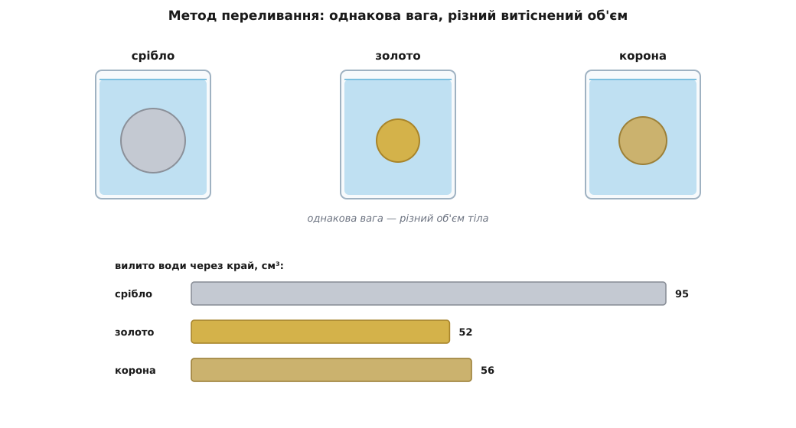
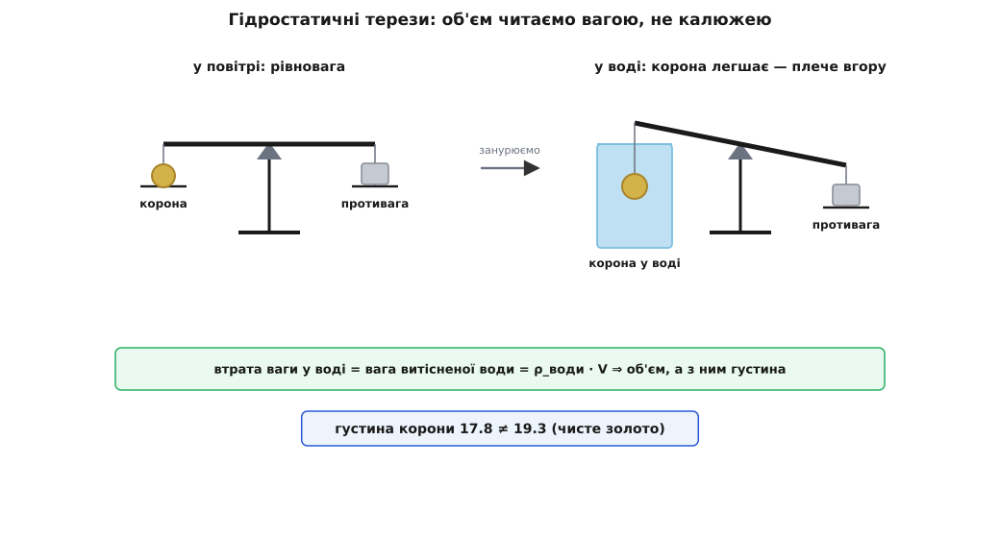
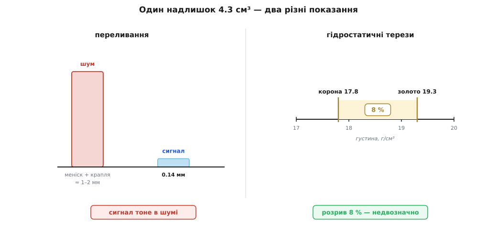

# 👑 Корона Гієрона: що знав Архімед і що додав Вітрувій

Найзнаменитіша сцена в історії фізики — гола людина біжить вулицями Сиракуз із криком «Еврика!». Вона така яскрава, що майже ніхто не питає простої речі: **звідки ми взагалі про неї знаємо?** А спитати варто, бо відповідь несподівана — і саме вона відділяє тверду фізику від гарної байки.

Почнімо з задачі, бо вона справжня й геть не байка.

## Підозра в храмовому золоті

Гієрон II (Ἱέρων), цар Сиракуз — грецького міста на Сицилії — правив там близько 270–215 рр. до н.е. Він замовив золоту вотивну корону (радше вінок, сплетений із тонких золотих листків) у дар богам, а золото на неї відважив майстрові сам, до крихти. Коли вінок принесли, вагою він точно збігався з виданим золотом — але Сиракузами поповз поголос: золотар частину золота привласнив, а щоб вага зійшлася, домішав тієї самої вагової міри дешевшого срібла. Довести чи спростувати підозру Гієрон доручив найгострішому розумові міста — Архімедові.

Задача підступна одразу з двох боків. **Розплавити вінок і перевірити не можна** — це посвята богам, зіпсувати її годі. **Зважити його теж марно** — злодій не дурний, вагу він підігнав рівно під видане золото. Здавалося б, глухий кут: зовні золото, вага правильна, розібрати не вільно.

І тут відкривається щілина. Срібло за тієї самої ваги займає **більший об'єм**, ніж золото, бо воно майже вдвічі рідше: густина золота близько 19.3 г/см³, срібла — лише 10.5 г/см³. Отже, якщо в короні є срібло, вона при тій самій вазі мусить бути **трохи об'ємніша**, ніж була б із чистого золота. Вага бреше, а об'єм — ні. Треба лише зміряти об'єм химерної форми, не плавлячи її. Ось де народжується вся історія.

Порахуймо, який власне сигнал ми шукаємо.

**Наскільки корона «розпухла».** Хай вінок важить 1000 г, а злодій підмінив десяту частину золота сріблом — 900 г золота й 100 г срібла.

```
V_золота = 900 / 19.3   = 46.63 см³
V_срібла = 100 / 10.5   =  9.52 см³
V_корони = 46.63 + 9.52 = 56.16 см³

чисте золото 1000 г:
V_чисте  = 1000 / 19.3  = 51.81 см³

різниця  ΔV = 56.16 − 51.81 ≈ 4.3 см³
```

**Висновок.** Уся підробка проявляється як зайвих ≈ 4.3 см³ об'єму — трохи більше за чайну ложку. Оце і є той фізичний слід, якого нікуди не подінеш: він мусить бути, якщо в короні срібло. Питання лиш одне — **чи можна цю ложку вловити виміром**. Уся суперечка навколо легенди точиться саме про це.

> 🔧 **Навіщо це.** Упізнати матеріал за густиною, не руйнуючи виробу, — жива інженерна задача й сьогодні. Так на пробірних дворах відрізняють золото від позолоченого сплаву, так митниця перевіряє зливки, так контролюють чистоту сплавів у ливарні. Скрізь одна ідея Архімедової задачі: **однакова вага ще не означає однакову речовину — видає її густина.**

## «Еврика!» — сцена, яку описав лише Вітрувій

Далі йде найвідоміша частина. Замислений над задачею Архімед нібито пішов до лазні, занурився в повну по вінця купіль — і побачив, як через край ллється вода, рівно стільки, скільки місця в ній зайняло його тіло. У цю мить його й ударила думка: занурене тіло виганяє свій власний об'єм води, тож будь-яку химерну форму — хоч корону — можна «зміряти» водою. Кажуть, він на радощах вискочив і побіг голий додому з криком «εὕρηκα» (грец. *heúrēka* — «знайшов!», доконаний час дієслова εὑρίσκω, «знаходжу»).

Сцена чудова. Але ось що варто затямити твердо: **єдине її джерело — римський архітектор Вітрувій** (*Marcus Vitruvius Pollio*), який записав її у трактаті «Про архітектуру» (*De architectura*, книга IX, передмова) близько 30–15 рр. до н.е. Архімед загинув 212 р. до н.е. під час римської облоги Сиракуз — отже, розповідь лягла на письмо майже **через два століття** після події. У жодному з власних творів Архімеда, що дійшли до нас, про купіль, крик і корону немає ні слова.

За Вітрувієм, і сам метод був такий — через переливання. Архімед узяв два однакові посуди, налив по вінця й занурював по черзі однакові за вагою тіла:

- у воду опускають **зливок срібла** тієї самої ваги, що й корона, — виливається певний об'єм води;
- потім **зливок золота** тієї ж ваги — виливається менше (золото щільніше, займає менший об'єм);
- нарешті **саму корону** — і води виливається **більше**, ніж від чистого золота, але менше, ніж від срібла.

Отже, корона об'ємніша за золото — у ній срібло. Логіка бездоганна.



*Однакова вага, різний об'єм: рідше срібло виливає більше води, щільне золото — менше. Корона, що виливає більше за золото, викриває підмішане срібло. Так розповідає Вітрувій.*

Логіка бездоганна — а от арифметика ні. Саме на арифметиці легенда й тріщить.

## Чому переливання не могло дати відповідь

Через тисячу шістсот років по Вітрувії сцену перевірив на міцність двадцятидворічний Галілео Галілей (*Galileo Galilei*, 1564–1642). У короткій праці «Терезики» (*La Bilancetta*, 1586) — своєму найпершому науковому тексті — він прямо засумнівався: метод переливання надто грубий, щоб ним задовольнився Архімед. Не тому, що ідея хибна, а тому, що потрібної точності від калюжі води на підлозі не візьмеш.

Погляньмо, як мало води вирішує всю справу. Ті самі ≈ 4.3 см³ різниці треба помітити на **рівні** води в посудині.

**У що перетворюється ложка різниці.** Хай посуд — миска з горлом завширшки 20 см (площа перерізу ≈ 314 см²). Різниця об'ємів підніме воду на:

```
Δh = ΔV / площа = 4.3 / 314 ≈ 0.014 см ≈ 0.14 мм
```

**Висновок.** Уся відповідь — «є срібло чи нема» — ховається в **чотирнадцяти сотих міліметра** висоти води. Це тонше за плівку, якою вода загинається біля стінок. Крапля, що лишилася висіти на зливку чи на губах посудини, — десь 0.05 см³, тобто помітна частка всього сигналу; змочення стінок, тремтіння руки, випар — усе це більше за те, що ми ловимо. А [поверхневий натяг](root:ph-mechanics/surface-tension) вигинає край води опуклим меніском на цілий міліметр — і ховає під собою нашу десяту частку міліметра з головою.

Тим гірше, що справжній вотивний вінок був **легкий** — не кілограмовий зливок, а мереживо тонких золотих листочків, може, кількасот грамів. Що легша корона, то менший ΔV, то тонша та невловна плівка води. Метод, який Вітрувій підносить як тріумф, на реальному вінку просто німіє.

> 🔧 **Навіщо це.** Урок не про давнину, а про будь-який вимір: **добрий не той метод, що правильний у принципі, а той, що обертає малу різницю на велике, читабельне показання.** Переливання ховає корисний сигнал у товщі шумів — меніску, крапель, змочення. Вправний вимірювач шукає, де той самий факт проявиться найгучніше.

## Терези, занурені у воду: метод, гідний Архімеда

У Архімеда був інструмент, куди тонший за миску з водою, — і то його **власний**. У трактаті «Про плавучі тіла» (*De corporibus fluitantibus*, грец. Περὶ τῶν ὀχουμένων) він строго довів те, що ми звемо його ім'ям: занурене тіло втрачає у вазі рівно стільки, скільки важить виштовхнута ним вода. Ось цей [закон плавучості](root:ph-mechanics/buoyancy) і дає об'єм — але не калюжею на підлозі, а **вагою**.

Робиться так. Корону зважують двічі: у повітрі й підвішеною у воді. Наскільки вона «полегшала» під водою — стільки й важить вода її об'єму, а звідси й сам об'єм:

```
втрата ваги = вага витісненої води = ρ_води · V
⇒ V = втрата ваги / ρ_води
```

А маючи вагу в повітрі й об'єм — маємо густину, себто підпис матеріалу. Ба більше, ділити щось окремо й не треба: відносна густина читається прямо з двох зважувань.

**Та сама корона на терезах.** Вінок важить 1000 г; зважений під водою, він через виштовхування «важить» менше рівно на свій об'єм у грамах води.

```
корона:  V = 56.16 см³ → у воді легшає на 56.16 г → терези кажуть 943.8 г
відносна густина = 1000 / (1000 − 943.8) = 1000 / 56.2 ≈ 17.8

чисте золото: V = 51.81 см³ → легшає на 51.81 г → терези кажуть 948.2 г
відносна густина = 1000 / (1000 − 948.2) = 1000 / 51.8 ≈ 19.3
```

**Висновок.** Терези кажуть: густина корони ≈ 17.8, а чистого золота — 19.3. Розрив майже у **вісім відсотків** — його не сховаєш ні за меніском, ні за краплею. Ось де диво: фізичний слід той самий, що й у переливанні — ті самі 4.3 см³, — але тепер він виходить не десятою часткою міліметра води, а грубою вагою в чотири з гаком грами й восьмивідсотковим провалом у густині. **Інформація однакова, та вимір обертає її на голосне, а не на шепіт.**



*Замість ловити краплі — зважити двічі. Втрата ваги під водою дорівнює вазі витісненої води, тобто об'ємові; разом із вагою в повітрі це дає густину. Крихітний надлишок срібла обертається на чіткий розрив у показанні.*

Саме таку схему Галілей і реконструював у «Терезиках», ще й вигострив: щоб знімати покази точніше, він обмотував плече терезів тонким дротом і рахував витки — так частка срібла в сплаві читалася прямо з ваговила. Це вже не хлюпіт води через край, а прецизійний прилад. Тим-то більшість дослідників і схиляється до думки: якщо Архімед і викрив золотаря, то радше **зважуванням у воді**, а не купіллю.



*Один і той самий факт двома методами. Ліворуч переливання — відповідь тоне в десятій частці міліметра, під меніском і краплею. Праворуч терези — та сама відповідь кричить восьмивідсотковим розривом густини.*

> 🔧 **Навіщо це.** Гідростатичне зважування живе донині: так вимірюють густину ювелірного сплаву, щоб відрізнити золото від позолоти; так працюють ареометри й ваги Мора-Вестфаля; так у лабораторії визначають густину зразків неправильної форми. Скрізь той самий хід Архімеда — **об'єм химерного тіла беруть не лінійкою, а вагою витісненої води.**

## Що з цього правда

Розкладімо історію на дві частини, бо доказовий статус у них різний.

**Тверде ядро — справжнє.** Архімед — грецький математик і механік із Сиракуз на Сицилії (287–212 рр. до н.е.), і закон плавучості таки його: строго доведений у власному трактаті «Про плавучі тіла». Ідея впізнавати матеріал за густиною, не руйнуючи виробу, — жива фізика, а не легенда. Що він розв'язав для Гієрона задачу про чистоту золота — цілком правдоподібно й узгоджується з усім, що ми про нього знаємо.

**Прикрашена оболонка — недоведена.** А от купіль, вода через край, голий біг вулицями й вигук «Еврика», та й сам метод переливання з двох посудин — це вже **правдоподібно, але недоведено**, і радше прикрашено. Уся сцена тримається на **одному пізньому джерелі** — Вітрувії, який писав майже через двісті років і був не фізиком, а архітектором, охочим до повчальних історій. Ані сам Архімед, ані ранні автори про неї не згадують. А сама фізика ще й проти: переливанням такої різниці не зловити. Найімовірніше, ядро правди — Архімед і густина золота — з часом обросло барвистою, але хисткою сценою в лазні.

І тут ховається найкраща частина уроку. Легенду люблять за сплеск води й голий біг — а справжнє відкриття зовсім в іншому: у тому, що **однакова вага не означає однакову речовину, і зраджує підробку саме густина**, та ще й у тонкому чутті, яким виміром цю густину зловити, щоб малесенький слід срібла закричав на весь голос. Хлюпіт у лазні — може, й вигадка. Ідея, що за ним стоїть, — чистіша за будь-яке золото Гієрона.
