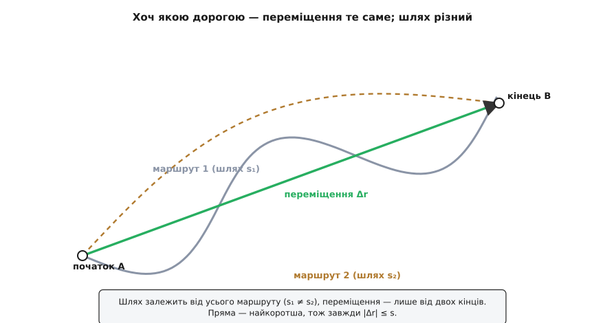
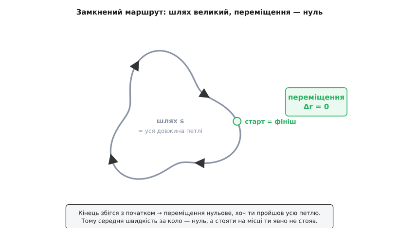
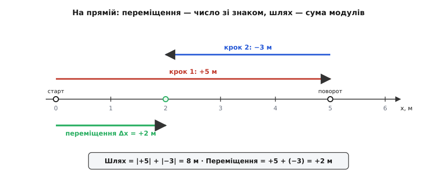

# Переміщення і шлях

<preknowlist>
- [Складові вектора](root:math-algebra/vector-components) — вектор як величина з напрямком і його проєкції на осі; переміщення — саме векторна величина, а не просто число.
- [Додавання векторів](root:math-algebra/vector-addition) — як стрілки складають і віднімають; переміщення будується як різниця двох положень.
</preknowlist>

«Скільки ти сьогодні пройшов?» — на це чесно відповідають двома різними числами, і збігатися вони не зобов'язані. Крокомір покаже, скажімо, вісім кілометрів: усю намотану за день дорогу, з кожним гаком до крамниці й назад. А проведи пряму від місця, де ти прокинувся, до того, де стоїш тепер, — вона може бути зовсім коротка, бо ти повернувся додому. Обидва числа правдиві, лише міряють різне. Одне — **шлях**, уся довжина сліду. Друге — **переміщення** (буквально «зміна місця»): чистий підсумок, де ти опинився відносно того, звідки рушив. Фізика розводить ці поняття суворо, бо на їхній різниці тримається чи не половина всієї кінематики.

## Від чого відлічувати

Перш ніж говорити про зміну положення, треба вміти сказати саме положення — де тіло є. А «де» саме по собі не існує: воно завжди відносно чогось. Точку задають, обравши початок відліку (якийсь орієнтир — ріг кімнати, центр міста, що завгодно) і провівши до тіла стрілку від цього початку. Ця стрілка — **радіус-вектор** (radius — лат. «промінь, спиця колеса»), позначають її **r**. Її проєкції на осі — це звичні координати x, y, z. Про те, як узагалі приписати точці її місце, докладніше в темі [Положення](root:ph-mechanics/position); тут досить того, що положення тіла — це вектор r від обраного початку.

Тепер ключове. Обери початок відліку деінде — і r зміниться, бо стрілка тепер тягнеться з іншого місця. Положення не абсолютне: воно залежить від того, звідки міряєш. Здавалося б, це псує всю справу — але саме тут переміщення робить свій головний фокус.

## Переміщення — різниця двох положень

Нехай тіло було в точці з радіус-вектором r₁, а стало — у точці r₂. Переміщення — це різниця:

```
Δr = r₂ − r₁
```

Геометрично [віднімання векторів](root:math-algebra/vector-addition) дає стрілку, проведену **з початкової точки в кінцеву** — навпростець, повз усі закрути дороги. І в цьому визначенні захований той фокус. Зсунь початок відліку — обидва радіус-вектори, r₁ і r₂, змістяться на один і той самий доданок, а в різниці r₂ − r₁ він скоротиться дощенту. Тобто **переміщення те саме, хоч звідки міряй**. Положення відносне, переміщення — ні: воно не залежить від того, де поставлено початок координат. Це вже не сваволя вибору, а чесна фізична величина, і саме тому кінематика будується на переміщенні, а не на голому положенні.

Переміщення — вектор: у нього є довжина (наскільки далеко кінець змістився від початку) і напрямок (у який бік). Довжину цієї стрілки, |Δr|, звуть [модулем вектора](root:math-algebra/vector-norm) — це відстань між початковою й кінцевою точками по прямій.

> 🔧 **Навіщо це.** Коли навігатор пише «до пункту 4.2 км», він показує **модуль переміщення** — пряму до цілі, якою ти не поїдеш. А одометр авто тим часом лічить **шлях** — скільки насправді накрутять колеса дорогами й об'їздами. Ці числа майже ніколи не рівні, і плутати їх — значить схибити і з часом, і з пальним: до цілі по прямій близько, а дорогою — гак на пів години.

## Шлях — довжина всього сліду

Шлях улаштований геть інакше, і різниця не косметична, а в самій природі величини. Переміщення дістають відніманням — воно знає лише два кінці. Шлях так не порахуєш: щоб його знати, треба пройти вздовж усієї **траєкторії** (лат. trajectoria, від trans «через» + iacere «кидати» — «перекинута крізь простір») — тієї лінії, яку точка креслить у русі, — і скласти довжини всіх її крихітних відрізків. Розбий маршрут на маленькі кроки Δr₁, Δr₂, …; шлях — це сума їхніх довжин:

```
s = |Δr₁| + |Δr₂| + |Δr₃| + …
```

Ті самі крихітні кроки будують і переміщення — та додаються вони інакше. Переміщення складає кроки як **вектори**: Δr = Δr₁ + Δr₂ + Δr₃ + …, і ця сума згортається просто в r₂ − r₁, бо кінець кожного кроку є початком наступного. Шлях складає ті самі кроки як **довжини**: s = |Δr₁| + |Δr₂| + … Ось і вся різниця в одному рядку — переміщення є векторна сума кроків, де протилежні напрямки взаємно гасяться, а шлях є сума їхніх модулів, де гаситися нема чому.

Звідси два наслідки, що одразу відділяють шлях від переміщення. Шлях — **скаляр** (лат. scalaris — «щабельний», від scala «драбина, шкала»): просто невід'ємне число без напрямку; від'ємного шляху не буває, як не буває від'ємного пробігу на одометрі. І шлях **лише накопичується**: кожен новий крок додає свою довжину й ніколи нічого не віднімає, куди б ти не завернув. Переміщення ж пам'ятає напрямок — і крок назад у ньому віднімає те, що додав крок уперед.


*Переміщення залежить лише від двох кінців, тож для будь-якої дороги з A в B воно те саме — зелена стрілка. Шлях залежить від усього маршруту: хвиляста дорога й великий гак дають різні s, обидва довші за пряму.*

## Чому вони майже завжди різні

Порівняймо ці дві величини — і вилізе проста, але залізна нерівність:

```
|Δr| ≤ s
```

Вона не випадкова, а прямо випливає з того, що переміщення є векторна сума кроків: довжина суми векторів ніколи не більша за суму їхніх довжин, бо протилежні напрямки з'їдають частину. Те саме геометрично — пряма є найкоротша дорога між двома точками, тож стрілка навпростець не може бути довшою за будь-який реальний маршрут.

Рівність буває лише в одному разі: коли тіло рухається **по прямій і не завертає назад** — тоді слід лягає на пряму, і шлях дорівнює модулю переміщення. Щойно маршрут гнеться чи має розворот, шлях переганяє переміщення, і що звивистіша дорога, то більший розрив.

**Приклад (квартал пішки).** Ти пройшов 3 квартали на схід, тоді звернув і пройшов 4 квартали на північ.

```
шлях         s   = 3 + 4 = 7 кварталів
переміщення |Δr| = √(3² + 4²) = √25 = 5 кварталів    (пряма з рогу в ріг)
```

Дорогою — сім кварталів, а від старту до фінішу по прямій лише п'ять. П'ять проти семи, хоча йшов ти той самий маршрут: різницю з'їв прямий кут повороту. А напрямок переміщення — навскіс, на північний схід, куди не веде жодна з двох вулиць.

## Крайній випадок: повернувся туди, звідки вийшов

Найгостріше поняття розходяться, коли маршрут замикається. Оббіжи стадіон і спинися рівно на старті. Кінцева точка збіглася з початковою, тобто r₂ = r₁, а отже:

```
Δr = r₂ − r₁ = 0
```

Переміщення — точно нуль, хоч ти пробіг цілі чотириста метрів. Шлях же дорівнює всій довжині кола. Це не гра слів, а прямий наслідок того, що переміщення знає лише кінці: збіглися кінці — обнулилося переміщення, байдуже, яку петлю ти намотав між ними.


*Старт і фініш — та сама точка, тож переміщення нульове, хоч шлях дорівнює всій петлі. Саме тому середня швидкість за замкнене коло — нуль: її рахують із переміщення, а воно тут нуль.*

Звідси тонкість зі швидкістю. [Середня швидкість](root:ph-mechanics/velocity) як вектор — це переміщення, поділене на час; за замкнене коло вона рівно нуль, бо переміщення нуль. А середній модуль швидкості — це шлях, поділений на час, і він аж ніяк не нуль: бігун явно не стояв. Тому питання «яка твоя середня швидкість» без уточнення, що ділити — шлях чи переміщення, — насправді двозначне.

## На прямій: знак замість стрілки

У русі вздовж однієї прямої вся векторність згортається в один знак. Домовляються про додатний напрямок осі — і тоді переміщення на кожному кроці стає числом зі знаком: плюс, якщо крок у бік осі, мінус — якщо проти. Повне переміщення — це сума цих чисел зі знаками, а шлях — сума їхніх модулів.

**Приклад (уперед і трохи назад).** Тіло проїхало 5 м у додатному напрямку, тоді здало 3 м назад.

```
переміщення Δx = (+5) + (−3) = +2 м     (знаки додаються)
шлях        s  = |+5| + |−3| = 8 м      (модулі додаються)
```

Підсумок — плюс два метри: тіло на дві одиниці далі, ніж стартувало. А проїхало воно вісім. Знак у переміщенні зробив усю роботу: крок назад відняв три з підсумку, зате до шляху додав свої чесні три.


*На прямій переміщення — число зі знаком (+2), а шлях — сума модулів кроків (8). Знак дає переміщенню право віднімати; модуль у шляху це право забирає й лишає тільки додавання.*

## Неперервний рух і зв'язок зі швидкістю

Коли тіло рухається плавно, кроки стають нескінченно дрібними, а суми переходять в [інтеграли](root:math-analysis/integral). Швидкість v — це темп зміни положення, тож за кожну мить dt тіло зсувається на v·dt, і все переміщення — сума таких зсувів:

```
Δr = ∫ v dt          (векторний інтеграл — зі знаком напрямку)
s  = ∫ |v| dt         (інтеграл модуля швидкості — завжди додатний)
```

Різниця та сама, лише мовою неперервного. Переміщення інтегрує **вектор** швидкості, тож ділянки руху в різні боки частково гасяться. Шлях інтегрує **модуль** швидкості — те, що показує спідометр, — а модуль завжди додатний, тож нічого не гаситься, лише накопичується. Строге виведення довжини шляху як інтеграла й доведення нерівності |Δr| ≤ s через нерівність трикутника зібрано в [окремій вставці](root:ph-mechanics/displacement/math-path-length.md).

> 🔧 **Навіщо це.** Робот чи дрон без супутника рахує своє місце «зчисленням» (dead reckoning): бере швидкість із давачів і накопичує переміщення крок за кроком. Але давач шумить, і кожне дрібне тремтіння додає до **шляху** зайву довжину, майже не чіпаючи чесного **переміщення**, — тому наївний одометр систематично завищує пробіг. Як порахувати обидві величини з дискретних відліків і не потонути в шумі, показує [код-приклад](root:ph-mechanics/displacement/proj-odometry.md).

## Відносно чого рахувати

Лишається те саме застереження, що вже спливло для положення: переміщення й шлях залежать від [системи відліку](root:ph-mechanics/inertial-frame). Пасажир пройшов вагоном 2 метри — це його переміщення відносно потяга. Але поки він ішов, потяг проїхав, скажімо, 50 метрів відносно перону; тож відносно перону переміщення пасажира — 52 метри, і шлях відповідно інший. Жодне з чисел не «справжніше»: вони просто в різних системах відліку. Обираючи, відносно чого міряти, ти й задаєш, які саме вийдуть переміщення й шлях, — це не похибка, а природа величин.

## Що лишається

Переміщення — векторна різниця двох положень, Δr = r₂ − r₁: стрілка навпростець із початку в кінець, яка знає лише два кінці й не залежить ні від дороги між ними, ні від того, де поставлено початок координат. Шлях — скаляр, уся довжина сліду вздовж траєкторії, що тільки накопичується й ніколи не віднімає. Пряма — найкоротша, тож завжди |Δr| ≤ s, з рівністю лише для прямого руху без розвороту; на замкненому маршруті переміщення падає до нуля, а шлях лишається повним. На прямій обидва згортаються в число: переміщення — зі знаком, шлях — сумою модулів. У неперервному русі перше інтегрує вектор швидкості, друге — її модуль. І обидва існують лише у вибраній системі відліку — абсолютних «де» і «скільки пройдено» немає, є тільки рух одного відносно іншого.
