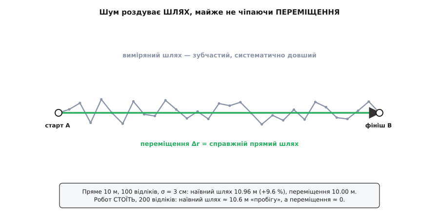
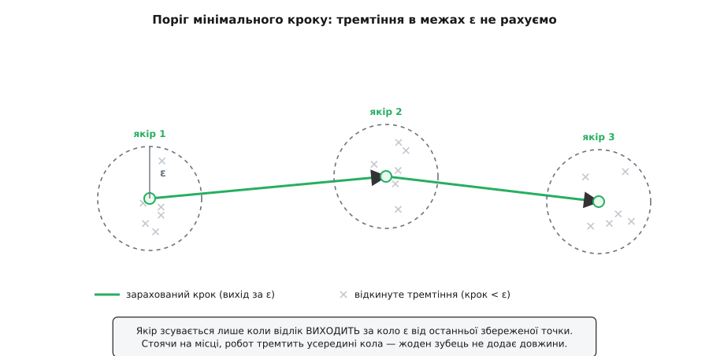

# ⚙️ Одометрія: чисте переміщення і пройдений шлях із відліків

## Задача

На вхід приходить не одна пара «звідки-куди», а **послідовність відліків положення**: масив точок r₀, r₁, r₂, … rₙ, знятих одну за одною. Джерела різні, суть однакова. GPS-приймач раз на секунду віддає фікс — широту й довготу, які ми звели до пласких метрів x, y відносно старту. Колісний робот інтегрує оберти коліс і щотакту повідомляє свою оцінку пози — це **числення шляху** (dead reckoning), коли положення накопичують із власних давачів, без зовнішнього орієнтира.

> Робот без супутника веде своє місце «зчисленням» — бере швидкість чи оберти коліс і крок за кроком нарощує оцінку пози; що це таке й чому воно неминуче дрейфує — у темі [числення позиції](root:com-signal/dead-reckoning).

Хоч звідки взялися точки, від них хочуть **два числа**:

```
переміщення  Δr = rₙ − r₀     (вектор: куди й наскільки зсунувся кінець від початку)
             |Δr|             (його модуль — пряма відстань старт→фініш)
шлях         s  = Σ |rᵢ₊₁ − rᵢ|   (сума довжин усіх відрізків між сусідніми відліками)
```

Обидва — з тих самих точок, але рахуються геть по-різному, і саме в цій різниці — і вся користь задачі, і головна пастка. Переміщення дивиться **лише на два кінці** масиву. Шлях **проходить весь масив** і складає крихітні кроки. Здавалося б, обчислити обидва — кілька рядків циклу. Так і є — рівно доти, доки відліки **чисті**. А вони не чисті: кожен давач шумить, і цей шум б'є двома величинами абсолютно несиметрично. Отут наївний одометр і починає систематично брехати — завищувати пробіг, — а ми маємо зрозуміти чому й приборкати.

## Ідея

Почнімо з несиметрії, бо на ній тримається все. Переміщення — це **різниця крайніх точок**, rₙ − r₀. Скільки б відліків не було між ними, у формулу входять тільки перший і останній. Зашуми середину як завгодно — переміщення й не здригнеться, бо середини для нього не існує. Навіть коли шумлять самі кінці, це разова похибка масштабу самого шуму: якщо кожна координата відліку тремтить із розкидом σ, кінці зсунуться десь на σ — і по тому.

Шлях улаштований інакше — і в цьому вся біда. Він **накопичує** довжини всіх відрізків, а довжина відрізка — це [норма вектора](root:math-algebra/vector-norm), √(Δx²+Δy²), тобто корінь із суми квадратів. Корінь із квадратів **завжди невід'ємний**: він не вміє відніматися. Куди б не смикнувся відлік — уперед, назад, убік — доданок √(…) виходить додатний і чесно лягає в суму. Крок назад у переміщенні віднімає те, що додав крок уперед; у шляху **віднімати нема чому** — тремтіння в будь-який бік лише доливає довжини.

Звідси головний, неочевидний висновок: шум роздуває шлях **систематично**, а не випадково. Це не «іноді трохи більше, іноді трохи менше» — це стабільний зсув угору, **зміщення** (bias). Подивімося чому, на найчистішому випадку — робот **стоїть на місці**. Істинне положення незмінне, тож усі істинні відрізки нульові. Але два сусідні відліки — це дві незалежні зашумлені точки, і відстань між ними майже ніколи не нуль. Якщо кожна координата має гаусів шум із розкидом σ — про [нормальний розподіл](root:math-probability/normal-distribution) як модель випадкової похибки з характерним розкидом σ варто знати саме тут, — то різниця двох відліків уздовж осі має розкид √2·σ, а довжина відрізка на площині виходить у середньому:

```
E[ |відрізок| ] = √2·σ · √(π/2) = σ·√π ≈ 1.77·σ     (2D, робот стоїть)
```

Кожен «нульовий» крок додає в шлях у середньому 1.77σ вигаданої довжини. За N відліків таких кроків N−1, тож наївний шлях нерухомого робота розростається:

```
E[ наївний шлях ] = (N−1) · σ·√π       (робот стоїть, N відліків)
```

Число лякає, коли підставити реальне. Хай σ = 3 см (скромний шум колісної одометрії), а робот простояв, віддаючи 200 відліків: очікуваний фальшивий «пробіг» = 199 · 0.03 · 1.77 ≈ **10.6 метра**. Робот **не зрушив**, а одометр певен, що той проїхав десяток метрів. Переміщення тим часом чесно показує ≈ σ — кілька сантиметрів. Ось вона, несиметрія в цифрах: шум наростив шлях на 10 метрів і майже не зачепив переміщення.


*Виміряний шлях (сірий) зубчастий і систематично довший за пряму, бо кожне тремтіння додає невід'ємну довжину. Переміщення (зелена стрілка) знає лише кінці, тож шум майже його не чіпає — навіть коли робот стоїть і «пробіг» роздувається, переміщення лишається біля нуля.*

Ще гостріше зміщення проявляється не на місці, а на **повільному** русі. Що менший істинний крок за такт проти σ, то більшу частку довжини вигадує шум. Швидкий прямий проїзд (крок 10 см проти шуму 3 см) роздується помірно, на одиниці відсотків; повзання (крок 2 см проти тих самих 3 см) — уже в рази. Тобто наївний одометр найдужче бреше саме там, де рух повільний або дискретизація часта: більше відліків на ту саму дорогу — більше тремтінь — більше приписаного пробігу. Це контрінтуїтивно: частіше міряти — гірше рахувати шлях.

Отже, план дій ясний. Спершу — чесні базові формули, які працюють на чистих даних. Тоді — два способи не дати шуму рахуватися: **поріг мінімального кроку** (не зараховувати відрізки, коротші за шум) і **згладжування** (спершу прибрати тремтіння з самих точок). Кожен має свою ціну, і вибір між ними — не смак, а відповідність тому, як шумить саме твій давач.

## Код

Мова тут — загальна обробка масиву точок, тож візьмемо дві, що лягають природно: **Python** (читається як псевдокод, ідеально для розбору логів) і **Go** (типізований, швидкий, той, яким часто пишуть службу телеметрії робота). Приклади ідіоматичні в обох — не транслітерація одного в інший.

### Дві базові величини

Переміщення дивиться на кінці, шлях біжить по всьому масиву:

:::tabs
```python
import math

Point = tuple[float, float]        # (x, y) у метрах


def net_displacement(pts: list[Point]) -> tuple[Point, float]:
    """Вектор rₙ − r₀ та його модуль. Порожньо/один відлік → нуль."""
    if len(pts) < 2:
        return (0.0, 0.0), 0.0
    (x0, y0), (xn, yn) = pts[0], pts[-1]
    dx, dy = xn - x0, yn - y0
    return (dx, dy), math.hypot(dx, dy)


def path_length(pts: list[Point]) -> float:
    """Сума довжин відрізків між сусідніми відліками."""
    total = 0.0
    for (xa, ya), (xb, yb) in zip(pts, pts[1:]):
        total += math.hypot(xb - xa, yb - ya)
    return total
```
```go
package odometry

import "math"

type Pt struct{ X, Y float64 } // метри

// NetDisplacement — вектор rₙ − r₀ та його модуль.
func NetDisplacement(pts []Pt) (Pt, float64) {
	if len(pts) < 2 {
		return Pt{}, 0
	}
	first, last := pts[0], pts[len(pts)-1]
	d := Pt{last.X - first.X, last.Y - first.Y}
	return d, math.Hypot(d.X, d.Y)
}

// PathLength — сума довжин відрізків між сусідніми відліками.
func PathLength(pts []Pt) float64 {
	total := 0.0
	for i := 1; i < len(pts); i++ {
		total += math.Hypot(pts[i].X-pts[i-1].X, pts[i].Y-pts[i-1].Y)
	}
	return total
}
```
:::

Два тонкі місця, які легко проґавити. Перше — `hypot` замість «руками» `sqrt(dx*dx+dy*dy)`: він рахує той самий корінь, але не переповнюється і не втрачає точність, коли координати великі (для GPS у метрах від далекого початку — доречно). Друге — межі масиву: на порожньому чи одному відліку переміщення нульове, а цикл шляху просто не робить жодної ітерації й повертає нуль. Без цієї перевірки `pts[-1]` на порожньому впаде.

**Приклад (три сторони прямокутника).** Робот пройшов з (0,0) у (3,0), тоді в (3,4), тоді в (0,4) — усе в метрах.

```
відрізки:  (0,0)→(3,0):  √(3²+0²) = 3
           (3,0)→(3,4):  √(0²+4²) = 4
           (3,4)→(0,4):  √(3²+0²) = 3
шлях        s  = 3 + 4 + 3 = 10 м
переміщення Δr = (0,4) − (0,0) = (0, 4);  |Δr| = 4 м
```

Дорогою — десять метрів, а від старту до фінішу по прямій лише чотири: три сторони проти прямої навскіс. Дані чисті — обидва числа чесні, коду вистачає. А тепер додаймо шум.

### Демонстрація роздування

Хай робот їде **прямо** 10 метрів, знімаючи відлік кожні 10 см — сто точок на ідеальній прямій. Накладемо на кожну координату гаусів шум σ = 3 см і порахуємо ті самі дві величини (усереднено за багато прогонів):

```
істина:          шлях 10.00 м,  переміщення 10.00 м
наївний шлях   = 10.96 м   (+9.6 %)     ← шум наростив майже метр
переміщення    = 10.00 м                ← незворушне
```

Переміщення не помітило шуму: кінці зсунулися на σ і по тому. Шлях роздувся на 9.6% — і це на **швидкому прямому** русі, найлегшому для одометра. Поставте того самого робота стояти на 200 відліків — і наївний шлях покаже вже знайомі ≈ 10.6 метра з нічого. Одна й та сама формула, той самий шум; різниця лише в тому, що шлях складає невід'ємні довжини, а переміщення віднімає координати.

> 🔧 **Навіщо це.** Склад міряє пробіг AGV-візків, щоб планувати техобслуговування «за кілометражем». Наївний одометр припише машині, що півдня простояла на зарядці, десятки зайвих «проїханих» метрів за зміну — і графік ТО попливе. Порахувати чесний пробіг — не про складніший давач, а про те, щоб **не дати шуму рахуватися**.

## Пом'якшення: не дати шуму рахуватися

### Поріг мінімального кроку (deadband)

Найпряміша ідея: не зараховувати відрізок, коротший за поріг ε. Якщо крок менший за характерний шум — це, найпевніше, і є шум, а не рух; викиньмо його. Але тут чигає пастка, на якій ловляться майже всі з першого разу.

Порівнювати треба **не** з попереднім сирим відліком, а з **останньою збереженою** точкою — «якорем». Інакше повільний, але справжній рух розсиплеться: якщо об'єкт повзе по 2 см за такт, а ε = 9 см, то кожен окремий крок менший за поріг — і наївне «пропусти короткий крок» викине **весь рух до єдиного**, показавши нуль. Правильно ж: тримаємо якір, і поки відліки тремтять біля нього в межах ε — мовчимо; щойно котрийсь **вийшов** за коло ε — зараховуємо стрибок від якоря й **переносимо якір** на цю точку. Повільне повзання так накопичиться правильно: якір не зрушить, поки сума дрібних кроків не винесе точку за поріг, а тоді зарахується одразу весь набіг.

:::tabs
```python
def path_length_deadband(pts: list[Point], eps: float) -> float:
    """Шлях із порогом кроку. Відрізок зараховуємо лише коли відхід
    від ОСТАННЬОЇ ЗБЕРЕЖЕНОЇ точки (якоря) досяг eps."""
    if not pts:
        return 0.0
    total = 0.0
    ax, ay = pts[0]                    # якір — остання збережена точка
    for x, y in pts[1:]:
        step = math.hypot(x - ax, y - ay)
        if step >= eps:
            total += step
            ax, ay = x, y              # якір рухаємо ЛИШЕ на зарахованому кроці
    return total
```
```go
// PathLengthDeadband — шлях із порогом мінімального кроку eps.
func PathLengthDeadband(pts []Pt, eps float64) float64 {
	if len(pts) == 0 {
		return 0
	}
	total := 0.0
	anchor := pts[0] // остання збережена точка
	for _, p := range pts[1:] {
		step := math.Hypot(p.X-anchor.X, p.Y-anchor.Y)
		if step >= eps {
			total += step
			anchor = p // якір рухаємо ЛИШЕ на зарахованому кроці
		}
	}
	return total
}
```
:::

Одне-єдине місце тут вирішує все — рядок `anchor = p` **всередині** `if`, а не поза ним. Винеси його назовні (оновлюй якір щокроку) — і поріг знову міряє від сусіда, повертаючи ту саму ваду з розсипаним повільним рухом. Тримай усередині — і якір стоїть, поки тремтіння не переросте в справжній крок.


*Навколо якоря — зона радіуса ε; відліки, що тремтять усередині неї, відкидаємо (хрестики), жоден не додає довжини. Якір зсувається лише коли відлік ВИХОДИТЬ за коло — тоді зараховуємо крок від якоря до нього. Стоячи на місці, робот тремтить у колі, і фальшивий пробіг не набігає.*

Скільки він виграє? Того самого нерухомого робота (200 відліків, σ = 3 см), де наївний шлях давав ≈ 10.6 м, поріг ε = 3σ = 9 см осаджує до ≈ 2.2 м — прибрано близько чотирьох п'ятих вигадки. Не в нуль, бо зрідка два відліки випадково розлітаються далі за 9 см і один такий стрибок зараховується. Поріг вибирають за розкидом шуму: ε ≈ 3σ відкидає майже все тремтіння (гаусів шум рідко перестрибує три сигми), не з'їдаючи справжні кроки, більші за нього.

Але в цього ножа два леза. Той самий поріг, що ріже шум, зріже й **справжній** рух, дрібніший за ε. Об'єкт, що реально повзе кроками по 2 см при ε = 9 см, накопичиться грубіше — сходинками по дев'ять сантиметрів, — а на плавному вигині ці сходинки ще й трохи зріжуть кут. Тобто поріг схиляє оцінку **вниз** на повільному й звивистому русі рівно так само, як шум схиляв її вгору. Він добрий, коли рух або впевнено швидший за шум, або його часто зовсім нема (стоянки); він поганий, коли корисний сигнал сам того ж масштабу, що й шум.

### Згладжування (ковзне середнє)

Інший підхід — не відкидати кроки, а спершу **прибрати тремтіння з самих точок**, а вже по згладжених рахувати звичайний `path_length`. Найпростіший згладжувач — [ковзне середнє](root:com-signal/moving-average): кожну точку замінюємо на середнє її сусідів у вікні ±w. Незалежний шум сусідніх відліків частково гаситься усередненням (розкид падає приблизно як √(кількість усереднених)), а плавна форма траєкторії лишається.

:::tabs
```python
def moving_average(pts: list[Point], w: int) -> list[Point]:
    """Згладити відліки вікном ±w (проста ковзна середня по обох осях)."""
    n = len(pts)
    out: list[Point] = []
    for i in range(n):
        lo, hi = max(0, i - w), min(n, i + w + 1)
        seg = pts[lo:hi]
        xs = sum(p[0] for p in seg) / len(seg)
        ys = sum(p[1] for p in seg) / len(seg)
        out.append((xs, ys))
    return out


# ужиток: спершу згладити, тоді звичайний шлях
s = path_length(moving_average(pts, w=2))
```
```go
// MovingAverage згладжує відліки вікном ±w по обох осях.
func MovingAverage(pts []Pt, w int) []Pt {
	n := len(pts)
	out := make([]Pt, n)
	for i := range pts {
		lo, hi := i-w, i+w+1
		if lo < 0 {
			lo = 0
		}
		if hi > n {
			hi = n
		}
		var sx, sy float64
		for _, p := range pts[lo:hi] {
			sx += p.X
			sy += p.Y
		}
		cnt := float64(hi - lo)
		out[i] = Pt{sx / cnt, sy / cnt}
	}
	return out
}

// ужиток: PathLength(MovingAverage(pts, 2))
```
:::

І в цього способу своя ціна, дзеркальна до порога. Усереднення розмиває не лише шум, а й **справжні різкі повороти**: гострий кут маршруту після згладжування зрізується в дугу, коротшу за реальний злам, тож шлях виходить **занижений** на крутих поворотах. Перевіримо на чверті кола радіуса 5 м (істинна довжина дуги π/2·5 ≈ 7.85 м): наївний шлях через шум давав ≈ 9.70 м (+24%), згладжування вікном w = 3 стягує до ≈ 7.69 м — уже трохи **менше** істини, бо зрізало кривину. Що ширше вікно, то чистіше гаситься шум і то дужче округлюються справжні повороти; ширину добирають під баланс цих двох.

### Який фікс коли

Обидва прийоми б'ють по тому самому зміщенню, але тягнуть оцінку в **протилежні** боки, тож вибір — за характером руху:

```
поріг ε        — зайвий шум РІЖЕ (↓);  добрий на стоянках і впевнено швидкому русі;
                 небезпечний на повільному/звивистому — зріже справжні дрібні кроки.
згладжування   — шум ГАСИТЬ усередненням (↓);  добре на плавних траєкторіях;
                 небезпечне на гострих поворотах — округлить і занизить шлях.
```

Правило дає сам масштаб шуму проти масштабу руху. Коли справжній крок за такт **надійно більший** за σ (швидкий рух, рідкі відліки) — шум і так дає малу частку, вистачить легкого згладжування або зовсім скромного порога. Коли крок **того ж порядку**, що σ (повільний рух, часті відліки) — жоден прийом не витягне однозначно, бо сигнал і шум нерозрізненні; тоді чесніше або рідше дискретизувати, або визнати, що на такому масштабі пройдений шлях просто погано визначений. А переміщення, нагадаю, весь цей час рахується без жодних порогів і згладжувань — воно до шуму майже байдуже саме собою.

## Складність і пастки

**Складність.** Обидві величини — один прохід масивом, O(N) за часом. Пам'ять — O(1), якщо рахувати **потоково**: шляху досить пам'ятати попередню точку й суму, переміщенню — першу точку й поточну. Тобто одометр не мусить тримати весь трек: він оновлює два числа на кожному новому відліку, що й треба на мікроконтролері з кількома кілобайтами пам'яті. Згладжування вікном ±w просить буфер на 2w+1 точок — досі O(1) за фіксованого вікна.

**Головна пастка — систематичне роздування шляху.** Не випадкова похибка, а стабільне зміщення вгору: шум додає невід'ємну довжину в кожен відрізок і ніде не віднімає. Росте з частотою відліків і найгірше б'є на повільному русі. Переміщення від цього захищене структурно — воно бачить лише кінці, тож його похибка разова, масштабу σ, а не накопичена (N−1)·σ. Коли треба надійне число з зашумлених даних — переміщення довіряй, наївному шляху ні.

**Якір порога — від останньої збереженої, не від сусіда.** Оновлення якоря має жити **всередині** `if step >= eps`. Винесеш назовні — повільний справжній рух розсиплеться на підпорогові кроки й зникне.

**Перезгладжування зрізає кути.** Ширше вікно — чистіший шум, але й дужче округлені справжні повороти, аж до заниження шляху. Вікно — під баланс, не «якнайбільше».

**GPS-градуси — не метри.** Широта й довгота в градусах — не декартові координати: один градус довготи на екваторі це ≈ 111 км, а під полюсом стягується до нуля, тоді як градус широти майже сталий. Рахувати `hypot` прямо по (lat, lon) — груба помилка, що спотворює і шлях, і переміщення. Спершу зведи фікси до локальних метрів (рівнокутна проєкція біля опорної точки: x ≈ R·Δlon·cos(lat₀), y ≈ R·Δlat у радіанах) або міряй кожен відрізок формулою великого кола. Далі — уже наведений код по x, y.

**Викиди й стрибки фіксу.** Один хибний GPS-фікс, що «телепортувався» на 50 м і назад, майже не зачепить переміщення (якщо він у середині треку), зате додасть у шлях **подвійний** стрибок — туди й назад, сотню метрів з нічого. Це вже не дрібне тремтіння, і поріг чи згладжування його не приберуть; такі одиничні викиди ловлять окремо — відкидають відлік, що стрибнув далі фізично можливого за такт, або пропускають трек крізь медіанний фільтр перед підрахунком.

**Нерівні такти й загублені відліки.** Якщо між відліками нерівні проміжки часу або частина загубилася, довжини відрізків ще складаються правильно (геометрії часу байдуже), але похідні величини — швидкість, і будь-яке згладжування за номером відліку — уже ні: там час має входити явно. Для самих s і |Δr| час не потрібен; щойно ділиш на нього — бери справжні мітки часу, а не номінальний період.
