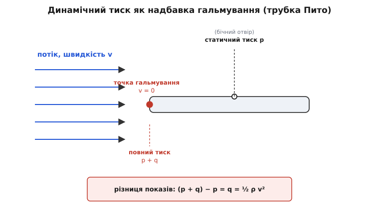
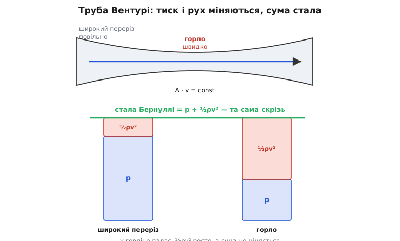
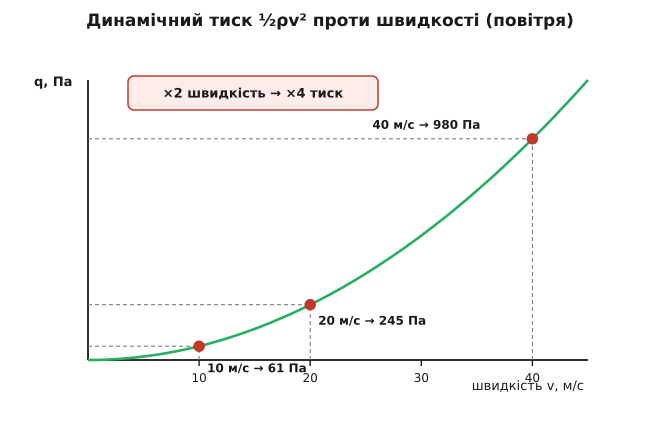

# Динамічний тиск і число Бернуллі

<preknowlist>
- [Тиск](root:ph-mechanics/pressure) — сила на одиницю площі, якою рідина чи газ давить на стінки й одне на одного.
- [Густина](root:ph-mechanics/density) — маса одиниці об'єму речовини (позначаємо ρ).
- [Кінетична енергія](root:ph-mechanics/kinetic-energy) — енергія руху, ½mv²; росте з квадратом швидкості.
- [Закон збереження енергії](root:ph-mechanics/energy-conservation) — енергія не зникає й не береться нізвідки, лише переходить із одного виду в інший.
- [Швидкість](root:ph-mechanics/velocity) — як швидко й куди рухається частинка рідини (v).
</preknowlist>

Візьми два аркуші паперу, потримай їх поряд вертикально, за пару сантиметрів один від одного, і дмухни між ними. Здоровий глузд каже: повітряний струмінь розштовхне аркуші. А вони злипаються. Повітря, що мчить у щілині, тисне на папір **слабше**, ніж нерухоме повітря ззовні, — і зовнішній тиск стуляє аркуші. Виходить дивне: варто змусити повітря рухатися, і частина його звичного тиску кудись зникає. Насправді не зникає — вона переходить у рух. Ця «перелічена в рух» частка тиску і є **динамічний тиск**, а бухгалтерія, що стежить за чесністю обміну між тиском і рухом, зветься законом Бернуллі.

## Динамічний тиск — це кінетична енергія, перелічена в тиск

Нерухома рідина тисне на кожну поверхню однаково з усіх боків — це [статичний тиск p: звичайна сила на одиницю площі, якою речовина давить на стінки](root:ph-mechanics/pressure). А тепер уяви, що рідина рухається. Вирізьмо подумки маленьку її порцію: об'єм *V*, [густина ρ](root:ph-mechanics/density), отже маса ρ*V*, і хай уся вона летить зі швидкістю *v*. Ця порція несе [кінетичну енергію — енергію руху](root:ph-mechanics/kinetic-energy) ½·(ρ*V*)·*v²*. Поділімо на об'єм — отримаємо енергію руху, запасену в кожному кубічному метрі потоку:

```
q = ½ · ρ · v²        (динамічний тиск)
```

Назвали ми це тиском не випадково: величина *q* має розмірність саме тиску. Перевірмо одиниці — енергія в одиниці об'єму виявляється тим самим, що сила на одиниці площі:

```
[q] = кг/м³ · (м/с)²
    = кг/(м·с²)
    = (кг·м/с²) / м²
    = Н/м²  =  Па
```

Джоуль на кубометр і паскаль — одне й те саме. Це не збіг одиниць, а глибокий факт: тиск **і є** густина енергії. Слово «динамічний» тут від грецького *dýnamis* — сила, потуга: це тиск, схований у русі.

Що таке *q* фізично? Це той тиск, який **повернеться**, якщо потік плавно зупинити. Спрямуй струмінь просто на стінку. Уздовж тієї лінії течії, що впирається в стінку в лоб, рідина гальмує, і в самій точці удару її швидкість падає до нуля. Цю точку звуть **точкою гальмування** (застою; лат. *stagnare* — застоюватися). Уся енергія руху порції там нікуди не дівається — вона переходить у тиск, і тиск у точці гальмування піднімається над навколишнім статичним рівно на *q*:

```
повний (гальмівний) тиск = p + q = p + ½·ρ·v²
```

Статичний плюс динамічний дає **повний**, або гальмівний, тиск — найбільший тиск, який узагалі можна намацати в потоці. І кожну з трьох величин можна виміряти окремо — саме це роблять дві трубки, підставлені в потік: одна назустріч течії, друга боком до неї.


*Динамічний тиск — це надбавка, яку дає гальмування потоку: назустріч течії трубка «бачить» p+q, збоку — лише p, а різниця цих двох тисків і є ½ρv².*

> 🔧 **Навіщо це.** Літак і безпілотник не міряють свою швидкість відносно повітря лінійкою — вони міряють динамічний тиск. Прилад порівнює повний тиск (трубка назустріч набігаючому потоку) зі статичним (бічний отвір) і з їхньої різниці добуває *q*, а з *q* — швидкість. Уся авіаційна «повітряна швидкість» стоїть саме на цьому обчисленні; помилка в статичному отворі — і покази брешуть.

## Число Бернуллі: сума, що не міняється вздовж течії

Додаймо тяжіння. Коли порція рідини піднімається на висоту *z*, вона запасає потенціальну енергію тяжіння; на одиницю об'єму це ρ·*g*·*z*. Тепер випишімо повний енергетичний баланс струминки за трьох умов — течія стала (не змінюється з часом), без тертя й нестислива. Уздовж однієї лінії течії енергія одиниці об'єму зберігається, тобто три доданки завжди дають ту саму суму:

```
p + ½·ρ·v² + ρ·g·z = стала        (рівняння Бернуллі)
```

Придивись, що це насправді. Перший доданок — тиск, тобто запас енергії стиснення; другий — енергія руху; третій — енергія висоти. Усі три — на одиницю об'єму. Рівняння Бернуллі — це просто [закон збереження енергії](root:ph-mechanics/energy-conservation), одягнений у гідродинамічний костюм: воно нічого не додає до фізики, лише каже, що вздовж струминки ці три форми енергії можуть перетікати одна в одну, але їхня сума лишається незмінною. Хочеш побачити, як цю рівність виводять строго — з рівнянь руху рідини вздовж лінії течії, з усіма припущеннями й поправкою на стисливість, — [ось повне виведення](root:ph-mechanics/dynamic-pressure/math-bernoulli-derivation.md).

Ота стала сума і є «число» з назви. Кожна лінія течії несе своє значення; уздовж неї три доданки перекладаються один в одного, але підсумок не зрушується ні на паскаль. У гідравліці цю величину звуть **повним напором**, в одиницях тиску — **повним тиском**, а як незмінну вздовж течії мітку — **сталою Бернуллі**: одне-єдине число, що позначає дану цівку потоку. Саме в цьому сенсі назва говорить про «число» — не плутати з математичними числами Бернуллі, що не мають до рідин жодного стосунку; тут число — це збережена сума.

Народилося рівняння в родинній драмі: [Данило Бернуллі дав його 1738 року у праці «Гідродинаміка», а сучасну форму — вже Ойлер; батько ж Данила, Йоганн, намагався приписати першість собі, видавши свою книжку заднім числом](root:ph-mechanics/dynamic-pressure/hist-bernoulli.md).

## Швидше — отже, тиск нижчий

Візьмімо рівну течію, де висота *z* не міняється. Тоді тяжіння з рівняння випадає, і лишається сама суть:

```
p + ½·ρ·v² = стала
```

Сума двох доданків стала — значить, коли один росте, другий мусить спадати. Розженеться потік (*v* більше) — його статичний тиск *p* впаде. **У швидшій частині потоку тиск нижчий.** Оце і є той протиінтуїтивний двигун, що крутить сотні буденних явищ, зокрема й папір, який злипся замість розлетітися.

Але чому потік десь узагалі розганяється? Бо крізь кожен переріз труби за секунду проходить та сама маса рідини: [скільки втекло — стільки й притекло, тож у вужчому місці потік мусить бігти швидше, A·v = const — це нерозривність течії](root:ph-mechanics/flow-continuity). Пропусти воду крізь звуження — **трубку Вентурі** (за іменем італійського фізика Джованні Баттісти Вентурі) — і в горлі вона розженеться, а там, де швидше, статичний тиск провалиться. У цьому вся картина.


*У горлі потік швидший, тож синій статичний тиск падає, а червоний динамічний росте; зелена межа — повний тиск — тримається на однаковому рівні. Обмін між тиском і рухом, а сума незмінна.*

Той самий механізм — усюди. Пульверизатор і старий карбюратор: швидке повітря над зрізом трубки має низький тиск і висмоктує рідину вгору. [Крило літака: над опуклим верхом потік швидший, тиск нижчий, і різниця тисків штовхає крило вгору](root:ph-mechanics/fixed-wing-lift). Дах під час шторму: вітер мчить над гребенем, тиск над дахом падає, а нерухоме повітря під дахом випирає його — і зриває. Навіть занавіска у душі підтягується до струменя води з тієї самої причини.

Тут варто зупинити одну живучу оману. Низький тиск нічого не «засмоктує» власною волею — немає такої сили «всмоктування». Просто повна сума розкладена інакше, а розігнав потік перепад тиску вище за течією. І крило працює зовсім не тому, що частинки над ним і під ним нібито мусять «зустрітися позаду одночасно»: [цей шкільний міф про однаковий час хибний — ніщо не змушує їх зустрічатися, а виміри показують, що верхні долітають до кромки навіть раніше](root:ph-mechanics/fixed-wing-lift/hist-lift-theory.md).

> 🔧 **Навіщо це.** Майже кожен витратомір у трубопроводі — це Бернуллі навпаки. Ставлять звуження (труба Вентурі чи діафрагма), міряють перепад тиску між широким місцем і горлом і з нього обчислюють швидкість, а отже й витрату. Жодних рухомих частин у потоці — тільки два отвори під тиск і формула. Так лічать газ, воду, пару на заводах і в лічильниках.

## Тиск росте як квадрат швидкості

У формулі *q* = ½ρ*v²* найважливіше — **квадрат**. Подвоїш швидкість — учетверо зросте динамічний тиск. Це різко змінює масштаб там, де швидкості великі.


*Динамічний тиск росте не прямо, а квадратично: крива задирається дедалі крутіше. Тому вітер удвічі сильніший б'є вчетверо дужче.*

**Приклад: тиск штормового вітру.** Візьмімо вітер 40 м/с (це 144 км/год), густина повітря біля землі ρ = 1.225 кг/м³. Який напір він створює?

```
q = ½ · 1.225 · 40²
  = ½ · 1.225 · 1600
  = 980 Па  ≈  1 кПа
```

Біля точки гальмування вітер тисне майже на кілопаскаль понад атмосферний. Динамічний тиск задає масштаб усього вітрового навантаження: для цілої стіни інженери множать це *q* на коефіцієнт форми (спереду — підпір, ззаду — розрідження), тож реальне зусилля навіть більше. Для порівняння: на 100 км/год (27.8 м/с) напір повітря вже ≈ 470 Па — саме він гуде у вухах і хитає дзеркальце авто. Квадратичний закон — це головна причина, чому кожен доданий десяток кілометрів на годину коштує аеродинаміці все дорожче.

## Як це вимірюють: трубка Пито

Обернімо гальмування назад у швидкість. Трубка, що дивиться назустріч потоку, ловить повний тиск *p*+*q*; отвір збоку — лише статичний *p*. Віднімемо одне від одного — лишиться чистий динамічний тиск *q* = Δ*p*, а з нього дістанемо швидкість:

```
q = ½·ρ·v²   ⟹   v = √(2·Δp / ρ)
```

Це і є **трубка Пито** (за іменем французького інженера Анрі Пито, який 1732 року так виміряв течію Сени). [Робочий код для давача повітряної швидкості — з поправкою на густину, фільтрацією шуму на малих швидкостях і поправкою на стисливість](root:ph-mechanics/dynamic-pressure/proj-pitot-airspeed.md) винесено окремо; тут порахуймо суть.

**Приклад: повітряна швидкість із перепаду тиску.** Диференційний давач показує Δ*p* = 200 Па, повітря ρ = 1.225 кг/м³.

Функція, що перетворює перепад тиску на швидкість, тривіальна — але живе вона зазвичай у прошивці польотного контролера, на гарячому шляху опитування давача, тож пишемо її мовою заліза (а поряд — той самий вираз мовою для швидкого розрахунку на землі):

:::tabs
```cpp
#include <math.h>

// Повітряна швидкість із перепаду тиску Пито (гальмівний − статичний).
// v = sqrt( 2*dp / rho )
float airspeed_from_dp(float dp_pa, float rho) {
    if (dp_pa <= 0.0f) return 0.0f;   // від'ємний перепад — шум або зустрічний бік
    return sqrtf(2.0f * dp_pa / rho);
}

// виклик: airspeed_from_dp(200.0f, 1.225f);
```
```py
from math import sqrt

# Повітряна швидкість із перепаду тиску Пито (гальмівний − статичний).
# v = sqrt( 2*dp / rho )
def airspeed_from_dp(dp_pa, rho):
    if dp_pa <= 0.0:
        return 0.0
    return sqrt(2.0 * dp_pa / rho)

# виклик: airspeed_from_dp(200.0, 1.225)
```
:::

Підставмо крок за кроком:

```
v = √(2 · 200 / 1.225)
  = √(400 / 1.225)
  = √326.5
  ≈ 18.1 м/с   (≈ 65 км/год)
```

Одна пастка ховається в густині. Датчик дає *q*, а швидкість ми добуваємо, ділячи на ρ, — тож знати треба **справжню** густину повітря. А [густина падає з висотою за моделлю стандартної атмосфери](root:ph-thermodynamics/standard-atmosphere): на висоті те саме *q* відповідає більшій справжній швидкості. Тому «приладова» швидкість, яку дає Пито з густиною біля землі, і «справжня» повітряна швидкість на висоті — різні числа, і пілоти їх свідомо розрізняють.

> 🔧 **Навіщо це.** Квадрат б'є і в інший бік. На малій швидкості динамічний тиск смішно крихітний: легіт 3 м/с дає всього ≈ 5 Па. Такий сигнал тоне в шумі давача й у поривах, тож повільні апарати міряють повітряну швидкість погано — і саме через це в прошивці доводиться усереднювати, відсікати від'ємні викиди й підмішувати інші джерела швидкості.

## Де закон ламається

Рівняння Бернуллі — ідеалізація, і кожне його припущення можна порушити. Чесно перелічимо межі, бо саме на них ловляться помилки.

- **Лише вздовж однієї лінії течії.** Стала для різних цівок — різна. Дорівнювати *p*+½ρ*v²* у сліді за крилом і в незбуреному потоці попереду не можна (виняток — безвихровий потік, там стала одна на все поле).
- **Течія стала.** Якщо потік міняється в часі — різко закрили кран, ударна хвиля тиску в трубі (гідравлічний удар) — з'являється додатковий доданок, і проста формула вже бреше.
- **Нестислива рідина.** Для води це завжди так; для повітря — поки швидкість менша приблизно за третину швидкості звуку (десь до 100 м/с). Швидше газ помітно стискається, ½ρ*v²* недооцінює справжню надбавку тиску, і потрібна повна стислива формула гальмування.
- **Без тертя.** Справжня рідина має [в'язкість — внутрішнє тертя](root:ph-mechanics/viscosity); біля стінок, у тонкому примежовому шарі, частина енергії йде в тепло, і повний напір донизу за течією поволі спадає. Бернуллі — картина без тертя; саме тому реальні трубопроводи потребують насосів, щоб доливати втрачений напір.
- **Це не джерело енергії.** Низький тиск не породжує «всмоктування» з нічого — він лише інша розкладка тієї самої збереженої суми. Ніякої дармової сили Бернуллі не дає.

## Що з усього цього винести

Динамічний тиск ½ρ*v²* — це кінетична енергія одного кубометра потоку, той тиск, що повертається, коли рідину плавно спинити. Рівняння Бернуллі складає його зі статичним тиском і тиском висоти в одне число, незмінне вздовж лінії течії, — і це число є не що інше, як закон збереження енергії для рідини. З цієї єдиної бухгалтерії випливає все решта: там, де потік розганяється, він платить за це статичним тиском, і саме тому швидше повітря тисне слабше. Звідси й повітряна швидкість із трубки Пито, і витратомір Вентурі, і підіймальна сила крила, і вітрове навантаження, що росте як квадрат, і два аркуші паперу, які, замість розлетітися, злиплися. Рахунок завжди сходиться до тієї самої сталої.
