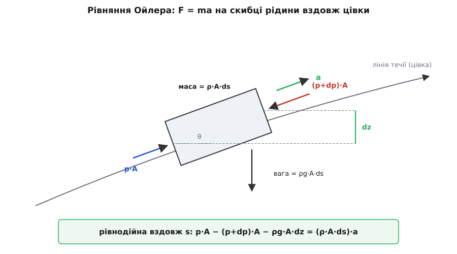
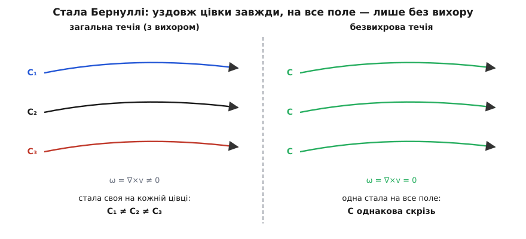

# 🧮 Виведення рівняння Бернуллі: від F = ma в рідині до стисливого гальмування

Рівність p + ½ρv² + ρgz = const так і проситься, щоб її назвали законом збереження енергії, — і врешті так і є. Але оголосити це — не те саме, що заслужити. Заслужимо чесно: почнімо не з енергії, а з [другого закону Ньютона F = ma](root:ph-mechanics/newtons-second-law), прикладеного до маленької скибки рідини, і подивімося, як сума трьох доданків **сама** випаде зі звичайної механіки. Дорогою кожне припущення зайде у виведення на своєму, точно видимому кроці — і, знаючи, де воно зайшло, ми потім зможемо його прибрати: спершу розширити рівняння з однієї цівки на все поле, тоді додати нестаціонарний доданок, а наприкінці — полагодити останнє припущення, нестисливість, щоб формула не брехала на швидкому газі.

### Сила на скибку рідини: рівняння руху Ойлера

Виріжмо подумки з потоку тонку скибку рідини, що лежить уздовж **лінії течії** — тієї кривої, дотична до якої в кожній точці збігається з напрямком швидкості. Позначмо координату вздовж цієї лінії буквою *s*. Хай скибка має площу поперечу *A* і довжину *ds*, отже об'єм *A·ds* і масу ρ·*A·ds*. Тепер порахуймо всі сили, що діють на неї **вздовж** *s*, — тільки їх, бо саме вони розганяють чи гальмують рух по лінії течії.

На задню грань навколишня рідина тисне вперед із силою *p·A*. На передню грань — назад; але там тиск уже трохи інший, *p + dp*, тож сила дорівнює (*p + dp*)·*A*. Дві сили майже гасяться, а лишається їхня різниця:

```
чиста сила тиску = p·A − (p+dp)·A = −dp·A
```

Це вже перша важлива думка: рідину рухає не сам тиск, а його **перепад** — [похідна тиску вздовж шляху](root:math-analysis/derivative), тобто те, наскільки p змінюється на метр. Рівномірний тиск давить на всі грані однаково й нікуди скибку не жене; жене саме −dp/ds.

Додаймо тяжіння. Вага скибки ρ*g·A·ds* тягне строго вниз, але вздовж лінії течії діє лише її складова. Якщо лінія піднімається під кутом θ до горизонту, то підйом на довжині *ds* становить *dz* = *ds*·sinθ, а складова ваги проти руху дорівнює ρ*g·A·ds*·sinθ = ρ*g·A·dz*. Отже, третя сила вздовж *s* — це −ρ*g·A·dz* (мінус, бо на підйомі вага гальмує).


*Другий закон Ньютона для крихітної скибки рідини: різниця тисків на гранях мінус складова ваги дорівнює масі на прискорення. Уся гідродинаміка Бернуллі виростає з цієї однієї рівноваги сил.*

Лишилося прискорення. І тут ховається тонкість, повз яку легко проскочити. Прискорення частинки рідини — це не просто ∂v/∂t. Навіть якщо все поле **застигле** в часі, частинка все одно може розганятися: вона зсувається вздовж лінії течії в область, де швидкість більша. Повне прискорення частинки, що пливе за потоком, складається з двох частин:

```
a = ∂v/∂t  +  v · ∂v/∂s
    │          │
    зміна поля  «переповзання» в іншу швидкість
    у часі      (конвективна частина)
```

Другий доданок, v·∂v/∂s, — серце всієї справи. Він каже: частка прискорюється, бо, рухаючись зі швидкістю *v*, за час *dt* переміщується на *v·dt* уперед, а там швидкість поля вже інша. Це та сама причина, чому вода в звуженні труби розганяється, хоча картина течії стоїть на місці.

Тепер зберімо F = ma. Прирівняймо суму сил до маси на прискорення й поділімо все на об'єм *A·ds*:

```
ρ · (∂v/∂t + v·∂v/∂s)  =  −∂p/∂s  −  ρg · dz/ds
```

Це і є **рівняння руху Ойлера** для нев'язкої рідини, записане вздовж лінії течії. Придивись, чого в ньому **немає**: жодного члена з тертям. Ми ніде не врахували, що сусідні шари рідини труть один об одного, — бо від початку взяли, що рідина ідеальна, без внутрішнього тертя. Оце й є припущення «без тертя», і воно вмонтоване не десь по дорозі, а в самий перший рядок: у переліку сил стояли тільки тиск і вага, і жодної в'язкої. Реальна [в'язкість — внутрішнє тертя шарів рідини](root:ph-mechanics/viscosity) — сюди просто не ввійшла.

> 🔧 **Навіщо це.** Уся інженерна інтуїція «де тисне, де смокче» стоїть на цьому рядку: рідину розганяє градієнт тиску, і тільки він. Насос, сопло, крило, карбюратор — усі вони працюють, створюючи −∂p/∂s уздовж потрібної лінії течії. І навпаки: побачив, що потік десь розігнався, — знай, що вище за течією хтось поставив перепад тиску, який його штовхнув.

Кілька слів про походження, бо тут легко наплутати з іменами. Ці рівняння руху рідини вперше виписав Леонард Ойлер (Leonhard Euler) — швейцарський математик — у праці «Загальні принципи руху рідин» (фр. *Principes généraux du mouvement des fluides*), поданій Берлінській академії 1755 року й надрукованій 1757-го; це були одні з перших диференціальних рівнянь у частинних похідних, узагалі виписаних людством, і в тій самій роботі Ойлер вивів співвідношення Бернуллі для лінії течії. Статус: усталений історичний факт.

### Стала течія: інтеграл уздовж цівки

Приберімо першу складність — час. **Припущення 1: течія стала** (стаціонарна), тобто поле швидкостей не змінюється з часом: ∂v/∂t = 0. Кран уже давно відкрутили, усе усталилося. Тоді з прискорення випадає часовий доданок, лишається лише конвективний, і рівняння Ойлера вздовж лінії течії стає звичайним, з повними похідними:

```
ρ · v · dv/ds  =  −dp/ds  −  ρg · dz/ds
```

Помножмо все на *ds* і поділімо на ρ. Праворуч *ds* скорочується в похідних, і рівняння перетворюється на рівність диференціалів — нескінченно малих приростів уздовж кроку *ds*:

```
v·dv  =  −dp/ρ  −  g·dz
```

Тут — ключовий алгебричний трюк, після якого все складається. Вираз *v·dv* — це насправді диференціал квадрата швидкості: адже d(½v²) = v·dv (звичайне правило похідної від *v²*). Перепишімо й зберімо все в один бік:

```
d(½v²)  +  dp/ρ  +  g·dz  =  0
```

Ця рівність каже, що вздовж кожного крихітного кроку *ds* сума трьох приростів нульова. А щоб дістати повний баланс між двома точками лінії течії, треба скласти всі ці крихітні кроки підряд — тобто взяти [інтеграл, суму нескінченно малих часток вздовж шляху](root:math-analysis/integral):

```
∫ dp/ρ  +  ½v²  +  g·z  =  стала        (уздовж лінії течії)
```

Зверни увагу: ми ще **не** припускали, що рідина нестислива. Ця рівність уже правдива для газу — аби лиш течія була стала й без тертя. Єдине, що лишилося недомовленим, — інтеграл ∫dp/ρ: щоб його взяти, треба знати, як густина ρ залежить від тиску *p*.

### Нестислива рідина: густина виходить з-під інтеграла

Найпростіший випадок — **припущення 2: рідина нестислива**, ρ = const. Тоді густину можна винести за знак інтеграла, і ∫dp/ρ = *p*/ρ. Підставмо й помножмо все рівняння на ρ:

```
p/ρ + ½v² + g·z = стала     │·ρ
────────────────────────────
p + ½ρv² + ρgz = стала        (рівняння Бернуллі)
```

Ось воно — і тепер видно родовід кожного доданка й кожного припущення. Складімо їх у стовпчик, бо саме тут ловляться майже всі помилки застосування:

```
без тертя      →  взяли рівняння Ойлера (у силах немає в'язкості) — з першого рядка
стала течія    →  викинули ∂v/∂t, звели рівняння в частинних похідних до звичайного
нестислива     →  винесли ρ з-під інтеграла:  ∫dp/ρ = p/ρ
уздовж цівки   →  інтегрували по s; на іншій лінії течії стала може бути інша
```

І головне, заради чого ми йшли від сил, а не від енергії: ми **жодного разу не покликали закон збереження енергії** — а він випав сам. Рівняння Бернуллі виявилося не окремою істиною, а [законом збереження енергії](root:ph-mechanics/energy-conservation) для рідини, лише вдягненим у механіку тиску. Три доданки — це три форми енергії одиниці об'єму: *p* — робота стиснення, ½ρv² — [кінетична енергія руху](root:ph-mechanics/kinetic-energy), ρgz — енергія висоти. Енергетичне тлумачення тут не припущення, а **наслідок** F = ma. Це і є чесність виведення: ти не постулюєш збереження — ти його доводиш.

**Приклад: швидкість витікання з бака (закон Торрічеллі).** Візьмімо відкритий бак із діркою збоку біля дна; вода стоїть на висоті *h* над діркою. Проведімо лінію течії від спокійної поверхні (точка 1) до струменя в дірці (точка 2) і прирівняймо на ній сталу Бернуллі. На поверхні вода майже не рухається (v₁ ≈ 0) і над нею атмосферний тиск p_atm; у струмені теж атмосферний тиск (струмінь оточений повітрям), а висоту дірки візьмімо за нуль:

```
точка 1 (поверхня):   p_atm + ½ρ·0²  + ρg·h
точка 2 (дірка):       p_atm + ½ρ·v²  + ρg·0
прирівнюємо сталу:     ρg·h = ½ρ·v²
                       v = √(2·g·h)
```

Для *h* = 2 м:

```
v = √(2 · 9.81 · 2) = √39.24 ≈ 6.26 м/с
```

Той самий результат, що й для тіла, яке вільно впало з висоти *h*: v = √(2gh). І це не збіг — це та сама стала Бернуллі, прирівняна у двох точках однієї лінії течії. Тиск на кінцях однаковий, тож увесь запас висоти перейшов у рух.

### Одна стала на все поле: безвихрова течія

У стовпчику припущень є одне, від якого хочеться позбутися найдужче: «уздовж цівки». Поки стала прив'язана до однієї лінії течії, рівнянням не можна порівняти дві різні цівки — наприклад, потік далеко перед крилом і потік просто над крилом лежать на **різних** лініях течії, і формально їхні сталі можуть відрізнятися. Коли ж їх можна прирівняти?

Щоб відповісти, треба спитати, **чому** стала взагалі різна на різних лініях. Причина — обертання самих часток рідини. Введімо міру цього обертання, **вихровість** ω = ∇×v (ротор швидкості): вона показує, чи крутиться крихітний елемент рідини навколо власної осі, пропливаючи потоком. Якщо порахувати, як змінюється величина *B* = *p*/ρ + ½v² + *gz* **упоперек** ліній течії, виходить, що її градієнт визначається саме добутком швидкості на вихровість. А отже, варто вихровості обернутися на нуль скрізь —

```
ω = ∇×v = 0   (безвихрова течія)   ⟹   B = p/ρ + ½v² + gz — одна стала на ВСЕ поле
```

— і стала перестає залежати від того, на якій ти лінії течії: вона однакова в кожній точці потоку. Інтуїція проста: у безвихровому полі швидкість можна записати як градієнт однієї скалярної функції — **потенціалу швидкості** φ, так що v = ∇φ, — і енергетична бухгалтерія тоді сходиться не по кожній цівці окремо, а глобально, як в одного суцільного механізму.


*Уздовж однієї лінії течії стала Бернуллі тримається завжди. А от прирівнювати різні лінії можна лише тоді, коли потік безвихровий: тоді стала єдина на все поле.*

Де таке буває? На диво, часто. Потік, що надходить здалеку рівним і незбуреним (вихровість нуль), обтікаючи тіло без тертя, лишається безвихровим — це наслідок теореми Кельвіна про збереження циркуляції. Тому в ідеалізації, порівнюючи незбурений потік далеко попереду з потоком просто над крилом, інженер сміливо прирівнює *p* + ½ρv² у цих двох різних точках — саме тому, що поле безвихрове й стала одна. Пастка ж у тому, що справжня [в'язкість](root:ph-mechanics/viscosity) біля самої обшивки народжує тонкий примежовий шар і слід за тілом, а там течія вже вихрова — і правило єдиної сталої в цих зонах ламається.

### Нестала течія: доданок ∂φ/∂t

Тепер відпустімо друге припущення — сталість — але вже у безвихровому полі, де є потенціал φ. Повернімо в рівняння Ойлера часовий доданок ∂v/∂t. Оскільки v = ∇φ, він дорівнює ∂(∇φ)/∂t = ∇(∂φ/∂t), тобто теж є градієнтом, і його можна проінтегрувати разом з рештою. Виходить **нестаціонарне рівняння Бернуллі**:

```
ρ · ∂φ/∂t  +  p  +  ½ρv²  +  ρgz  =  F(t)
```

З'явився новий, четвертий доданок ρ·∂φ/∂t. Він рахує енергію, яку витрачають не на усталене перенесення, а на **розгойдування самої картини течії** — на те, щоб пришвидшити чи загальмувати весь потік як ціле. Коли течія стала, ∂φ/∂t = 0, доданок зникає, і ми повертаємося до звичайної сталої. А коли ні — саме він виходить на сцену: різко перекрив кран, і стовп води в трубі мусить миттю загальмуватися — ∂φ/∂t дає стрибок тиску, гідравлічний удар, що рве труби. Той самий доданок описує силу приєднаної маси на тілі, яке розганяється в рідині, і лежить в основі акустичних хвиль.

### Стисливість: чому ½ρv² замало для швидкого газу

Лишилося останнє припущення — нестисливість. Для води вона тримається завжди. Для повітря — поки воно тече повільно; але щойно газ розганяється, у точці гальмування він відчутно **стискається**, його густина там підскакує вище незбуреної, і винести ρ з-під інтеграла ∫dp/ρ уже не можна. Візьмімо цей інтеграл чесно, для газу.

Швидке стиснення й розширення газу в потоці відбувається так прудко, що теплом обмінятися ні з ким не встигає, і без утрат — тобто **ізоентропно** (гр. *ísos* — рівний, *entropía* — ентропія: без зміни ентропії). Для [ідеального газу](root:ph-thermodynamics/ideal-gas-law) ізоентропний зв'язок тиску й густини має вигляд *p*/ρ^γ = const, де γ — показник адіабати (для двоатомного повітря γ ≈ 1.4). З цим законом інтеграл береться:

```
∫ dp/ρ  =  (γ/(γ−1)) · p/ρ
```

Підставмо в стале рівняння вздовж цівки (доданок *gz* для газу дрібний, відкиньмо):

```
(γ/(γ−1)) · p/ρ  +  ½v²  =  стала
```

Величина (γ/(γ−1))·*p*/ρ — це якраз питома ентальпія газу *h* (гр. *enthálpein* — нагрівати), тож рівняння читається як «повна ентальпія *h* + ½v² зберігається»: гарний натяк, що і для стисливого газу це той самий закон збереження енергії, лише з тепловою частиною.

Тепер загальмуймо потік у точці застою: там v → 0, тиск і густина ростуть до гальмівних значень *p₀*, ρ₀. Введімо місцеву **швидкість звуку** *a* — швидкість, з якою в газі біжать малі збурення тиску; для ідеального газу *a²* = γ*p*/ρ. Її відношення до швидкості потоку — **число Маха** M = *v*/*a* (за іменем австрійського фізика Ернста Маха, 1838–1916, родом із Моравії, який увів це відношення близько 1887 року). Підставивши *h* = *a²*/(γ−1) у рівність повної ентальпії, дістаємо спершу зв'язок температур (бо *a²* ∝ *T*), а через ізоентропу — і точний зв'язок тисків:

```
a₀²/a² = 1 + (γ−1)/2 · M²  =  T₀/T
p₀/p = (1 + (γ−1)/2 · M²)^(γ/(γ−1))        (гальмівний тиск, стислива течія)
```

Ось повна стислива формула гальмування. А тепер найцікавіше — розкладімо її в ряд за малим M (біноміальний ряд), щоб побачити, де в ній сидить наш звичний ½ρv². Надлишок гальмівного тиску над статичним, *p₀* − *p*, виходить таким:

```
p₀ − p  =  ½ρv² · [ 1  +  M²/4  +  (2−γ)/24 · M⁴  +  … ]
```

Прочитай цей рядок уважно. **Перший доданок дужки — точно ½ρv²**: нестислива формула Бернуллі є не помилкою, а границею стисливої при M → 0. Але вся дужка більша за одиницю, щойно M > 0, — а отже, справжній гальмівний надлишок *p₀* − *p* **більший** за ½ρv². Нестислива формула систематично **занижує** гальмівний тиск. Фізична причина прозора: газ біля носа встигає ущільнитися, густина там вища за незбурену, і те саме гальмування вкладає в тиск більше, ніж рахунок зі сталою густиною передбачає.


*Нестислива ½ρv² — лише перший доданок ряду. Що більший Мах, то дужче вона занижує справжній гальмівний тиск: до M ≈ 0.3 розбіжність кількавідсоткова, далі росте стрімко.*

**Приклад: наскільки бреше ½ρv² при M = 0.3.** Візьмімо повітря, γ = 1.4, і порахуймо точний надлишок і нестисливий поруч. Зручно все ділити на статичний тиск *p*; тоді нестислива частка ½ρv²/*p* = ½γM² (бо ½ρv² = ½ρM²*a²* = ½γM²*p*):

```
точна:        p₀/p = (1 + 0.2·0.3²)^3.5 = (1 + 0.018)^3.5 = 1.0644
              надлишок (p₀−p)/p = 0.0644
нестислива:   ½ρv²/p = ½·1.4·0.3² = ½·1.4·0.09 = 0.0630
відношення:   0.0644 / 0.0630 = 1.023
```

Отже, при M = 0.3 проста ½ρv² занижує гальмівний тиск приблизно на 2.3 %. Саме тому M = 0.3 стало умовною межею: нижче за неї повітря можна без гризоти рахувати як нестисливе, вище — вже ні. У звичних одиницях це чимала швидкість: біля землі швидкість звуку *a* ≈ 340 м/с, тож M = 0.3 — це близько 100 м/с. І заниження стрімко росте: уже при M = 0.6 те саме відношення сягає ≈ 1.09, тобто ½ρv² недорахує майже десяту частину. Тому давач повітряної швидкості на швидкому літаку не має права рахувати по ½ρv² — його електроніка обертає повну стисливу формулу *p₀*/*p*, інакше на висоті й на великому Маху покази попливуть.

### Що дає це виведення

За п'ятьма виглядами рівняння Бернуллі стоїть один кістяк і чотири вимикачі. Кістяк — F = ma на скибці рідини, тобто рівняння Ойлера: перепад тиску мінус складова ваги дорівнює масі на прискорення. А далі кожне «інше» рівняння Бернуллі — це просто те, які припущення ти лишив увімкненими:

```
вимкнув час (∂v/∂t = 0)  →  інтеграл уздовж цівки: ∫dp/ρ + ½v² + gz = const
заморозив густину        →  нестислива форма:      p + ½ρv² + ρgz = const
вимкнув вихор (ω = 0)     →  одна стала на все поле (а не лише вздовж лінії)
повернув час             →  нестаціонарний доданок: + ρ·∂φ/∂t
відпустив густину        →  стисливе гальмування:   p₀/p = (1+(γ−1)/2·M²)^(γ/(γ−1)),
                             де ½ρv² — лише перший доданок ряду
```

Жодного з цих рівнянь ніхто не вручав згори як окремий закон природи. Усі вони — другий закон Ньютона, один раз проінтегрований уздовж течії, а «версії» різняться тільки тим, скільки спрощень ти собі дозволив. Знаючи, де саме кожне припущення зайшло у виведення, ти завжди бачиш, коли воно має право впасти, — а отже, коли простій сумі трьох доданків уже не можна вірити.
