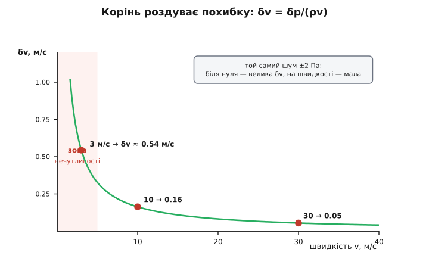

# ⚙️ Повітряна швидкість із трубки Пито: робочий давач

Фізика дає повітряну швидкість одним рядком. Трубка, що дивиться назустріч потоку, ловить повний тиск *p*+*q*; бічний отвір — сам статичний *p*; диференційний давач між ними показує чистий динамічний тиск Δ*p* = *q*. А з нього швидкість:

```
q = ½·ρ·v²   ⟹   v = √(2·Δp / ρ)
```

Спокуса — зашити цей рядок у прошивку й забути. Але число, яке він поверне, буде **брехати чотирма різними способами**: давач не показує нуль, коли апарат стоїть; на малій швидкості *q* тоне в шумі; густина ρ біля землі й на висоті — різні; а на великій швидкості газ стискається, і проста формула недооцінює тиск. Кожна з цих чотирьох поправок — це кілька рядків коду й одна ясна фізична причина. Зберемо їх по черзі й отримаємо давач, показам якого можна довіряти.

Живе це все зазвичай у прошивці польотного контролера, на гарячому шляху опитування давача — сотні разів на секунду, у циклі керування. Тому основна мова тут — C/C++; поряд той самий алгоритм на Python для наземної станції й швидкої перевірки на землі.

## Давач не показує нуль на нулі

Диференційний давач тиску — це кремнієва мембрана між двома камерами; перепад тиску вигинає її, а тензорезистори перетворюють вигин на напругу. Біда в тому, що мембрана має **власний нуль-зсув** (offset): навіть коли з обох боків тиск однаковий (апарат стоїть, повітря не рухається), давач показує не рівно нуль, а якісь свої кілька паскалів. Гірше — цей зсув **повзе з температурою**: холодним ранком один, під розігрітим сонцем корпусом інший.

Ліки прості: перед польотом, поки апарат нерухомий, зняти **нуль на землі** — усереднити пачку показів у спокої й запам'ятати як offset. Далі з кожного сирого показу цей offset віднімаємо.

:::tabs
```cpp
// Нуль-зсув: усереднюємо N зразків у спокої (апарат стоїть, вітру нема).
float calibrate_zero(const float *samples, int n) {
    float sum = 0.0f;
    for (int i = 0; i < n; i++) sum += samples[i];
    return sum / (float)n;      // це зсув давача; віднімаємо його від сирих Δp
}
```
```py
def calibrate_zero(samples):
    # Нуль-зсув: середнє N зразків, знятих у спокої.
    return sum(samples) / len(samples)   # віднімаємо від сирих Δp
```
:::

Після віднімання offset частина показів піде **в мінус**. Фізично Δ*p* = *q* ≥ 0 — динамічний тиск від'ємним не буває, він же квадрат швидкості. Мінус означає лише одне: це шум довкола нуля або, для рухомого крила, коротка мить, коли потік хитнувся не в той бік. Спокуса — відсікти від'ємне одразу, `max(0, Δp)`. І ось тут ховається пастка, у яку легко впасти.

**Пастка випрямляння.** Уяви апарат, що стоїть: справжня швидкість нуль, а давач шумить симетрично довкола нуля, скажімо ±2 Па. Якщо спершу відсікти від'ємні (`max(0, Δp)`), а потім усереднити, то середнє **вже не нуль** — ми викинули всі мінуси й лишили самі плюси. Для симетричного шуму зі стандартним відхиленням σ середнє від `max(0, шум)` дорівнює σ/√(2π) ≈ 0.399·σ. При σ = 2 Па це фантомні 0.8 Па, а з них давач «наміряє» неіснуючу швидкість:

```
v_фантом = √(2 · 0.8 / 1.225) ≈ 1.14 м/с
```

Апарат стоїть, а прошивка бачить понад метр за секунду. Причина суто в порядку дій: **спершу відсікли, потім усереднили** — випрямили шум, як діод. Правильний порядок зворотний: спершу **згладити знаковий** Δ*p* (там плюси й мінуси чесно погасять один одного в нуль), і лише **потім** відсікати вже згладжене значення. Один і той самий рядок `max(0, ·)`, переставлений на крок пізніше, з джерела фантомної швидкості перетворюється на нешкідливий запобіжник.

## Малі швидкості тонуть у шумі

Тепер найпідступніше. Динамічний тиск росте як **квадрат** швидкості, отже на малій швидкості він мізерний. Легіт 3 м/с дає всього:

```
q = ½ · 1.225 · 3² ≈ 5.5 Па
```

П'ять паскалів — а власний шум пристойного давача якраз кілька паскалів. Сигнал і шум одного порядку: швидкість тут майже не читається. І квадрат б'є вдруге — уже коли ми **обертаємо** тиск у швидкість. Продиференціюймо *q* = ½ρ*v²*: мала зміна тиску dΔ*p* = ρ·*v*·d*v*, звідки

```
δv = δp / (ρ · v)
```

Ось воно: той самий шум тиску δ*p* перетворюється на шум швидкості, поділений на *v*. Що менша швидкість, то більше він **роздувається**. Порахуймо для типового шуму ±2 Па:

```
при v = 3 м/с:   δv = 2 / (1.225 · 3)  ≈ 0.54 м/с   (18 % від самої швидкості!)
при v = 30 м/с:  δv = 2 / (1.225 · 30) ≈ 0.054 м/с  (0.18 %)
```

Той самий давач, той самий шум — а на малій швидкості похибка в сто разів більша у частках. Це не вада конкретного пристрою, це геометрія кореня: біля нуля крива *v* = √(2Δ*p*/ρ) стоїть майже вертикально, і крихітне тремтіння тиску кидає швидкість туди-сюди на метри.


*Одна й та сама похибка тиску обертається на велику похибку швидкості біля нуля й на дрібну — на швидкості. Тому повільні апарати міряють повітряну швидкість погано, і нижче порогу чесніше сказати «не знаю», ніж вигадувати число.*

Звідси три прийоми, які стоять у кожній нормальній прошивці давача швидкості:

- **Зона нечутливості (deadband).** Нижче порогу *q*_min (скажімо, відповідного 5 м/с — це ≈ 15 Па) числу вірити не можна. Замість вигадувати швидкість давач чесно каже «немає даних», а вищий рівень тим часом спирається на інші джерела.
- **Фільтр низьких частот на знаковому Δ*p*.** Порив, вібрація планера, електричний шум давача — усе це високочастотне тремтіння. Згладжуємо його простим експоненційним фільтром (кожен новий вихід — старий плюс мала частка різниці), і саме **до** відсікання від'ємного, щоб шум погасився чесно. Скільки згладжувати — компроміс: сильніше згладиш — тихіше число, але й реакція запізнюється; [цей обмін між гладкістю й затримкою в експоненційного фільтра має точну ціну](topic:com-signal/ema).
- **Не випрямляти шум** — порядок «фільтр → відсікання», як розібрано вище.

:::tabs
```cpp
// Експоненційний ФНЧ (один стан). alpha = dt/(tau+dt), tau = 1/(2*pi*fc).
typedef struct { float y; bool init; } Ema;

float ema_update(Ema *f, float x, float alpha) {
    if (!f->init) { f->y = x; f->init = true; }
    else          f->y += alpha * (x - f->y);
    return f->y;
}
```
```py
class Ema:
    def __init__(self):
        self.y = None
    def update(self, x, alpha):        # alpha = dt/(tau+dt)
        self.y = x if self.y is None else self.y + alpha * (x - self.y)
        return self.y
```
:::

> 🔧 **Навіщо це.** Саме через це маленькі повільні апарати — квадрокоптери, планери на малому газі — часто взагалі не ставлять давач швидкості або довіряють йому лише понад певний поріг. При 3–5 м/с динамічний тиск не піднімається над шумом, хоч який добрий давач. Знати межу власного давача — не примха, а різниця між керованим апаратом і тим, що звалюється, бо «побачив» швидкість, якої не було.

## Приладова швидкість проти справжньої

Обертаючи тиск у швидкість, ми ділимо на ρ — отже мусимо знати **правильну** густину. А вона не стала. Біля землі повітря щільне, високо — розріджене; [густина падає з висотою за моделлю стандартної атмосфери](topic:ph-thermodynamics/standard-atmosphere). І тут криється розрив між двома різними «швидкостями», який пілоти розрізняють свідомо.

Якщо в формулу підставити сталу густину рівня моря ρ₀ = 1.225 кг/м³, вийде **приладова швидкість** (у міжнародній термінології — indicated / equivalent airspeed, IAS/EAS): те, що показав би прилад, наче ми внизу. Якщо ж підставити **справжню** місцеву густину — вийде **справжня повітряна швидкість** (true airspeed, TAS): реальна швидкість апарата відносно повітря. Оскільки *v* обернено пропорційна √ρ, а на висоті ρ менша, той самий Δ*p* відповідає **більшій** справжній швидкості:

```
приладова:  EAS = √(2·Δp / ρ₀)
справжня:   TAS = √(2·Δp / ρ)  =  EAS · √(ρ₀ / ρ)
```

Множник √(ρ₀/ρ) так і звуть — коефіцієнт переходу від приладової до справжньої. Аеродинаміці крила байдуже до справжньої швидкості: підіймальна сила залежить від того самого *q* = ½ρ*v²*, тобто від **приладової** швидкості, тому саме її тримають на приладі при зльоті й посадці. А от навігації й повітряному числу Маха потрібна **справжня**.

Звідки взяти місцеву ρ? З основного газового закону: густина — це тиск, поділений на «теплову пружність» газу. Точно —

```
ρ = p / (R · T)        R = 287.05 Дж/(кг·К) для сухого повітря
```

де *p* — статичний тиск (його дає той самий барометр, що й висоту), а *T* — температура повітря за бортом у кельвінах (давач OAT; якщо його немає — беруть температуру стандартної атмосфери на поточній висоті).

:::tabs
```cpp
#define R_AIR   287.05f      // Дж/(кг·К) — питома газова стала сухого повітря
#define RHO_SSL 1.225f       // кг/м³ — густина ISA на рівні моря
#define P_SSL   101325.0f    // Па — тиск ISA на рівні моря
#define GAMMA   1.4f         // показник адіабати повітря

float air_density(float p_static, float T_kelvin) {
    return p_static / (R_AIR * T_kelvin);         // ρ = p/(R·T)
}

float eas_from_dp(float dp) {                     // приладова (еталонна ρ₀)
    return (dp <= 0.0f) ? 0.0f : sqrtf(2.0f * dp / RHO_SSL);
}

float tas_from_dp(float dp, float rho) {          // справжня (реальна ρ)
    return (dp <= 0.0f) ? 0.0f : sqrtf(2.0f * dp / rho);
}
```
```py
from math import sqrt

R_AIR, RHO_SSL, P_SSL, GAMMA = 287.05, 1.225, 101325.0, 1.4

def air_density(p_static, T_kelvin):
    return p_static / (R_AIR * T_kelvin)          # ρ = p/(R·T)

def eas_from_dp(dp):                              # приладова
    return 0.0 if dp <= 0 else sqrt(2.0 * dp / RHO_SSL)

def tas_from_dp(dp, rho):                         # справжня
    return 0.0 if dp <= 0 else sqrt(2.0 * dp / rho)
```
:::

**Приклад: той самий Δ*p* на висоті 3 км.** Диференційний давач показує Δ*p* = 500 Па. Барометр дає статичний тиск *p* = 70 100 Па, давач OAT — температуру −4.5 °C = 268.65 К (це і є стандартна атмосфера на 3000 м).

```
ρ   = 70100 / (287.05 · 268.65) ≈ 0.909 кг/м³      (проти 1.225 біля землі)

EAS = √(2 · 500 / 1.225) = √816   ≈ 28.6 м/с        (що показав би прилад)
TAS = √(2 · 500 / 0.909) = √1100  ≈ 33.2 м/с        (реальна швидкість крізь повітря)
```

Прилад «бачить» 28.6, а апарат насправді ріже повітря на 33.2 м/с — на 16 % швидше. Пропустити цю поправку — означає систематично недооцінювати справжню швидкість, а з нею й дальність, і час на маршруті. Розрив швидко росте з висотою: уже на трьох кілометрах справжня швидкість на 16 % більша за приладову, а на десяти — у понад півтора раза (там повітря розріджене більш ніж удвічі).

## Великі дозвукові: поправка на стисливість

Останній шар — для швидких. Досі ми користувалися ½ρ*v²*, а це формула для **нестисливої** рідини. Повітря стисливе, і на великій швидкості це вже не дрібниця.

Ось причина, з механізму. Трубка Пито гальмує потік до нуля в точці гальмування. Для нестисливого газу вся кінетична енергія просто повертається тиском, рівно ½ρ*v²*. Але справжнє повітря, гальмуючи, ще й **стискається** — адіабатично, майже без тепловіддачі, — і саме стиснення додає тиску понад нестисливу оцінку. Тому реальний перепад, який відчуває давач (його звуть **тиском гальмування**, impact pressure *q*_c), на швидкості **більший** за ½ρ*v²*. Якщо цього не врахувати й обернути надлишковий Δ*p* нестисливою формулою, швидкість вийде **завищеною**.

Наскільки? На рівні моря нестислива формула завищує справжню швидкість так:

```
при v = 100 м/с:  завищення ≈ 1.1 %   (Δp більший на ~2.2 %)
при v = 150 м/с:  завищення ≈ 2.4 %
```

До сотні метрів за секунду поправка менша за відсоток — для більшості безпілотників і легких літаків нею можна знехтувати. Але швидкий планер, розгінна ділянка чи великий висотний апарат уже потребують чесної стисливої формули. Виводиться вона з адіабатичного гальмування газу з показником γ = 1.4; результат — точний зв'язок тиску гальмування з числом Маха *M* = *v*/*a*, який легко обернути:

```
M² = 5 · [ (Δp/p + 1)^(2/7) − 1 ]      2/7 = (γ−1)/γ,   5 = 2/(γ−1)
a  = √(γ · R · T)                       місцева швидкість звуку
TAS = M · a
```

Спершу з перепаду й статичного тиску дістаємо число Маха, потім множимо на місцеву швидкість звуку — і маємо справжню швидкість без нестисливого наближення. Що приємно, ця формула при малих *M* сама зводиться до звичного √(2Δ*p*/ρ): доданок у дужках при повільному потоці якраз дорівнює ½ρ*v²*/*p*. Тобто стислива версія коректна **на всьому діапазоні** — просто на малих швидкостях збігається з простою.

:::tabs
```cpp
#include <math.h>

// Справжня швидкість зі стисливою поправкою (дозвукове гальмування, γ=1.4).
// M² = 5·[(Δp/p + 1)^(2/7) − 1];  TAS = M·√(γRT).
float tas_compressible(float dp, float p_static, float T_kelvin) {
    if (dp <= 0.0f) return 0.0f;
    float m2 = 5.0f * (powf(dp / p_static + 1.0f, 2.0f / 7.0f) - 1.0f);
    float a  = sqrtf(GAMMA * R_AIR * T_kelvin);      // місцева швидкість звуку
    return sqrtf(m2) * a;                            // TAS = M·a
}
```
```py
def tas_compressible(dp, p_static, T_kelvin):
    if dp <= 0:
        return 0.0
    m2 = 5.0 * ((dp / p_static + 1.0) ** (2.0 / 7.0) - 1.0)
    a = (GAMMA * R_AIR * T_kelvin) ** 0.5            # місцева швидкість звуку
    return (m2 ** 0.5) * a                           # TAS = M·a
```
:::

Та сама логіка, узята від сталого рівня моря — з тиском *p*₀ = 101325 Па й швидкістю звуку *a*₀ = 340.29 м/с замість місцевих, — дає **калібровану швидкість** (calibrated airspeed, CAS): стисливий, чесніший родич приладової швидкості, який і показує стрілка справжнього літакового покажчика.

```
CAS = a₀ · √( 5 · [ (Δp/p₀ + 1)^(2/7) − 1 ] )      a₀ = 340.29 м/с,  p₀ = 101325 Па
```

## Усе разом: цикл оновлення

Складімо чотири поправки в одну функцію, яку прошивка викликає щоцикл. Порядок кроків не випадковий — він рівно той, що ми вивели: зняти зсув → згладити **знаковий** перепад → відсікти дрібне порогом → взяти реальну густину → дати обидві швидкості, а на великих дозвукових уточнити справжню стисливою формулою.

:::tabs
```cpp
typedef struct {
    float offset;     // нуль-зсув (Па), знятий на землі
    Ema   lp;         // ФНЧ на знаковому перепаді тиску
    float q_min;      // поріг зони нечутливості (Па)
    bool  valid;      // чи можна вірити поточному числу
    float eas, tas;   // останні швидкості (м/с)
} Airspeed;

void airspeed_update(Airspeed *s, float dp_raw,
                     float p_static, float T_kelvin, float dt) {
    // 1. зняти нуль-зсув (він повзе з температурою — періодично перезаміряти на землі)
    float dp = dp_raw - s->offset;

    // 2. ФНЧ на ЗНАКОВОМУ перепаді — ДО відсікання, щоб симетричний шум усереднився в нуль
    float alpha = dt / (0.05f + dt);            // τ ≈ 50 мс
    dp = ema_update(&s->lp, dp, alpha);

    // 3. зона нечутливості: нижче порогу q крихітний і тоне в шумі
    if (dp < s->q_min) { s->valid = false; s->eas = s->tas = 0.0f; return; }
    s->valid = true;

    // 4. густина з реального статичного тиску й температури
    float rho = air_density(p_static, T_kelvin);

    // 5. приладова (ρ₀) і справжня (реальна ρ) швидкості
    s->eas = sqrtf(2.0f * dp / RHO_SSL);
    s->tas = sqrtf(2.0f * dp / rho);

    // 6. на великих дозвукових — стислива поправка (інакше TAS завищена)
    if (s->tas > 80.0f)
        s->tas = tas_compressible(dp, p_static, T_kelvin);
}
```
```py
class Airspeed:
    def __init__(self, offset=0.0, q_min=15.0):
        self.offset = offset      # нуль-зсув (Па)
        self.lp = Ema()           # ФНЧ на знаковому Δp
        self.q_min = q_min        # поріг зони нечутливості (Па)
        self.valid = False
        self.eas = self.tas = 0.0

    def update(self, dp_raw, p_static, T_kelvin, dt):
        dp = dp_raw - self.offset                       # 1. зняти зсув
        dp = self.lp.update(dp, dt / (0.05 + dt))       # 2. ФНЧ на знаковому Δp
        if dp < self.q_min:                             # 3. зона нечутливості
            self.valid = False
            self.eas = self.tas = 0.0
            return
        self.valid = True
        rho = air_density(p_static, T_kelvin)           # 4. реальна густина
        self.eas = (2.0 * dp / RHO_SSL) ** 0.5          # 5a. приладова
        self.tas = (2.0 * dp / rho) ** 0.5              # 5b. справжня
        if self.tas > 80.0:                             # 6. стислива поправка
            self.tas = tas_compressible(dp, p_static, T_kelvin)
```
:::


*Сирий Δp перетворюється на надійну швидкість не одним діленням, а конвеєром: спершу приборкати давач (зсув, фільтр, поріг), потім чесно поділити на реальну густину, і лише на великих швидкостях увімкнути стисливу поправку. Порядок кроків — не оформлення, а частина коректності.*

Поріг 80 м/с у кроці 6 — прагматичний: нижче нього різниця між стисливою й нестисливою формулою менша за відсоток, тож простіша формула цілком годиться, а важчий `powf` не смикаємо щоцикл. Хто хоче однорідності — може завжди рахувати стисливою: вона й на малих швидкостях правильна, лише трохи дорожча.

## Складність і пастки

Формула — це чверть роботи. Решта — знати, як давач **бреше**, коли щось іде не так, бо саме мовчазна брехня приладу швидкості коштувала життів.

**Забитий отвір — найстрашніше.** Якщо гирло трубки Пито (повний тиск) чи бічний статичний отвір закупорити, давач не зойкне про несправність — він показуватиме **правдоподібне, але хибне** число. Забите гирло: перепад завмирає й починає поводитися як висотомір навпаки — при наборі висоти статичний тиск падає, а завмерлий повний лишається, і швидкість фальшиво **росте**. Забитий статичний отвір псує опорний рівень для всіх приладів одразу. Два хрестоматійні випадки. Рейс **Birgenair 301** (6 лютого 1996, Boeing 757, Пуерто-Плата, 189 загиблих): літак три тижні простояв без заглушок на трубках, і, за висновком розслідування, гирло Пито найімовірніше запечатала гніздом оса роду *Sceliphron*, що ліпить трубчасті гнізда з мулу; екіпаж повірив хибно завищеній швидкості. Рейс **Air France 447** (1 червня 2009, Airbus A330, 228 загиблих): трубки Пито на короткий час забили кристали льоду, швидкості розійшлися, автопілот від'єднався, і подальші хибні дії призвели до звалювання. Звідси в серйозній авіоніці: підігрів трубок проти зледеніння, заглушки на землі й обов'язкова передпольотна перевірка, а в прошивці — **звірка кількох давачів** і відсів того, що випав із згоди з рештою.

**Вода в трубці.** Дощ, конденсат, роса натікають у трубку й тонкі шланги до давача. Стовпчик рідини додає свій тиск (зсув показів), а на віражах і в турбулентності **хлюпає**, підмішуючи низькочастотний шум, який жоден ФНЧ не відрізнить від справжньої зміни швидкості. Тому в трубок роблять **дренажні отвори** внизу, а прошивка мусить бути готова до повільного «дихання» нуля — і час від часу пропонувати перезняти offset на землі. Замерзла в трубці вода — це вже забитий отвір з усіма наслідками вище.

**Похибка густини.** Якщо температури за бортом немає й ми беремо стандартну атмосферу, а день нетиповий — гарячий чи холодний, — то ρ вийде з похибкою, і **справжня** швидкість поїде разом із нею (приладова від температури не залежить, вона на ρ₀). У спеку повітря рідше за стандартне, справжня швидкість насправді більша, ніж дає ISA-оцінка. Тому давач OAT — не розкіш: без нього справжня швидкість завжди приблизна.

**Дрейф нуля.** Ми зняли offset на землі — але він повзе з температурою корпусу впродовж польоту. Симптом: у горизонтальному польоті з постійною швидкістю приладова повільно пливе. Ліки — періодичне перезняття нуля в спокої (наприклад, поки апарат стоїть перед зльотом) і розумний **контроль здорового глузду**: повітряна швидкість не може довго й сильно розходитися з наземною (GPS) за вирахуванням вітру.

**Косий потік.** Трубка Пито міряє складову швидкості **вздовж своєї осі**. На великому куті атаки чи в ковзанні набігаючий потік іде під кутом до трубки, і давач бачить лише проєкцію — швидкість **занижується** приблизно як косинус кута. Саме тому трубку ставлять якнайдалі вперед і рівно за потоком, а точні системи беруть кілька рознесених отворів (багатоотвірні зонди), щоб виміряти й сам кут.

**Звірка й злиття.** Найнадійніше число — не з одного давача. Наземна швидкість GPS мінус оцінка вітру дає незалежну перевірку повітряної швидкості; розбіжність — сигнал забитого отвору чи льоду. А коли давачів кілька або треба гладко пережити коротку відмову одного, їхні покази [зливають фільтром, що довіряє швидкому давачу на коротких часах і повільному, але надійному орієнтиру — на довгих](topic:com-signal/complementary-filter). Так одне сире Δ*p* перетворюється не лише на швидкість, а на швидкість, якій можна вірити.

## Що винести

Рядок *v* = √(2Δ*p*/ρ) — правда, але гола: щоб він працював у польоті, довкола нього треба чотири поправки, і кожна росте з тієї самої фізики Пито. Давач має власний нуль — знімаємо його на землі й фільтруємо **знаковий** перепад **перед** відсіканням, інакше випрямлений шум вигадує швидкість зі стоячого апарата. На малій швидкості *q* тоне в шумі, а корінь роздуває похибку як δ*v* = δ*p*/(ρ*v*) — тому нижче порогу чесніше мовчати. Густина не стала: та сама Δ*p* дає приладову швидкість на ρ₀ і справжню на реальній ρ, а розрив між ними росте з висотою. І на великій швидкості газ стискається, тож нестислива формула завищує — рятує перехід через число Маха. А над усім цим — тверезе знання, як прилад бреше, коли отвір забитий чи в трубці вода, бо саме тиха брехня давача швидкості, а не гучна відмова, найнебезпечніша в повітрі.
