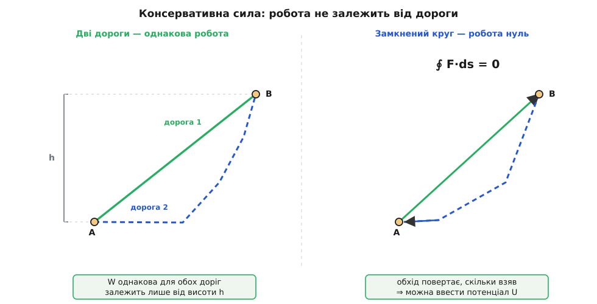
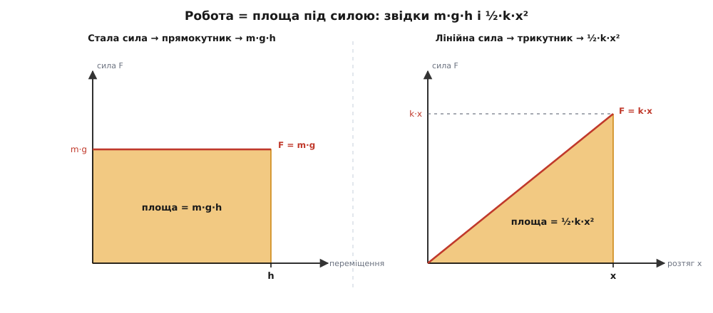

# 🧮 Теорема про роботу й енергію: чому сила накопичує саме ½·m·v²

Увесь закон збереження механічної енергії тримається на одному рівнянні, і це рівняння не постулюють — його **виводять** із другого закону Ньютона за півсторінки. Воно каже коротко: скільки роботи сумарна сила виконала над тілом, рівно на стільки зросла величина ½·m·v². Ліворуч — сила, помножена на пройдений шлях, річ наочна й вимірна. Праворуч — число, яке ми назвемо **кінетичною енергією**. Коли цей місток покладено, усе решта — існування потенціалу, стала сума T + U, тертя, що з'їдає механічну енергію, — стає простою бухгалтерією над ним.

Тут ми зберемо сам місток, чесно, від першопричини: почнемо з означення роботи, виведемо теорему `W = ΔT` з другого закону Ньютона, означимо консервативну силу й потенціал так, щоб стало видно, **чому** для них сума T + U не рухається, а тоді дозволимо втрутитися тертю й побачимо, куди тече решта. Наприкінці пройдемо по цьому містку до двох конкретних чисел: швидкості вільного падіння v = √(2·g·h) і пружного запасу ½·k·x².

## Робота: тільки те, що штовхає вздовж руху

Почнімо з означення. **Робота** сили над тілом — це сила, помножена на переміщення, але з однією тонкістю: береться лише та частина сили, що напрямлена **вздовж** руху. Для сталої сили на прямому відрізку це

```
W = F·s·cosθ
```

де θ — кут між силою й переміщенням, а `s` — довжина шляху. Множник `cosθ` — не прикраса, у ньому вся суть. Спробуймо зрозуміти, звідки він і чому саме він.

Уяви, що штовхаєш візок горизонтально, а тягнеш за мотузку, напнуту вгору під кутом. Уперед візок жене лише горизонтальна складова твого зусилля; вертикальна складова тільки притискає його або відриває від землі, але не додає ходу. Робота — це передача енергії руху, а рух іде вздовж переміщення; отже, зараховувати треба тільки проєкцію сили на цей напрям, а це рівно `F·cosθ`. Математично «проєкція одного вектора на інший» — це [скалярний добуток](topic:math-algebra/dot-product), число `F·s = |F|·|s|·cosθ`, яке бере два вектори й повертає саме перекриття їхніх напрямів. Тому загальне означення роботи записують добутком, а для звивистого шляху зі змінною силою — інтегралом уздовж дороги:

```
W = ∫ F·ds      (сума F·ds по всіх крихітних кроках ds уздовж шляху)
```

Тут [інтеграл](topic:math-analysis/integral) — це просто «підсумуй усі маленькі внески»: розбий дорогу на мільярд коротких відрізків ds, на кожному візьми `F·ds` і склади все докупи.

Найкраще перевірити означення на межовому випадку. Що, як сила стоїть **строго поперек** руху, θ = 90°? Тоді `cosθ = 0`, і робота нульова — хоч би яка велика була сила. Це не дивина, а глибокий факт: тіло на орбіті тримає тяжіння, напрямлене до центра, тобто **перпендикулярно** до швидкості в кожну мить. Отже, тяжіння не виконує над ним жодної роботи, і його швидкість по коловій орбіті не міняється роками. Сила є, а роботи нема — бо вона лише завертає рух, не розганяючи його. Саме `cosθ` це й ловить.

Знак роботи так само промовистий. Сила вздовж руху (θ < 90°, `cosθ > 0`) — робота додатна, тіло розганяється. Сила проти руху (θ > 90°, `cosθ < 0`) — робота від'ємна, тіло гальмується. Цей знак нам знадобиться, коли дійдемо до тертя, що завжди тягне назустріч руху.

## Виведення: сума F·ds перетворюється на приріст ½·m·v²

Тепер головне. Візьмімо **сумарну** силу, що діє на тіло, і порахуймо її повну роботу вздовж шляху. Твердження буде таке: хоч би яка складна була сила й дорога, ця робота завжди дорівнює зміні однієї простої величини — ½·m·v². Доведімо це, не припускаючи нічого, крім законів руху.

Старт — [другий закон Ньютона](topic:ph-mechanics/newtons-second-law): сила дорівнює масі на прискорення, а прискорення — це [похідна](topic:math-analysis/derivative) швидкості за часом, тобто миттєва швидкість її зміни:

```
F = m·a = m·(dv/dt)
```

Підставмо це у визначення роботи. Ще один крок: переміщення за коротку мить dt — це швидкість на час, `ds = v·dt` (вектор кроку — це вектор швидкості, помножений на тривалість). Тож інтеграл по шляху перетворюється на інтеграл по часу:

```
W = ∫ F·ds = ∫ m·(dv/dt)·v dt
```

Придивімося до підінтегрального виразу `(dv/dt)·v`. Це скалярний добуток вектора прискорення на вектор швидкості. І тут спрацьовує одна проста, але вирішальна тотожність числення. Згадаймо, що `v²` означає `v·v` — швидкість, скалярно помножена сама на себе (квадрат довжини вектора). Візьмімо похідну цього добутку за часом за правилом добутку:

```
d(v·v)/dt = (dv/dt)·v + v·(dv/dt) = 2·(dv/dt)·v
```

Отже, `(dv/dt)·v = ½·d(v²)/dt` — саме той вираз, що стоїть у нас під інтегралом. Це не фокус, а звичайне правило похідної добутку, тільки записане для векторів; воно акуратно згортає незручний скалярний добуток «прискорення на швидкість» у похідну однієї величини `v²`. Підставмо:

```
W = ∫ m·½·(d(v²)/dt) dt = ∫ d(½·m·v²)
```

А інтеграл від похідної — це просто різниця значень на кінцях (накопичення повертає те, що продиференціювали). Тож підсумок увесь звівся до різниці однієї величини між фінішем і стартом:

```
W = ½·m·v²(кінець) − ½·m·v²(початок) = ΔT
```

Ось він, місток. Позначмо `T = ½·m·v²` і назвімо цю величину [кінетичною енергією](topic:ph-mechanics/kinetic-energy) — енергією руху. Тоді все виведення вміщається в одному рядку:

```
W_net = ΔT       ← теорема про роботу й енергію
```

Тут варто спинитися й побачити, що саме ми зробили. Ми **не** ввели нового закону природи. Кінетична енергія `½·m·v²` — це не окрема сутність, яку хтось постулював; це просто **та величина, зміна якої дорівнює роботі сумарної сили**. Її форма — квадрат швидкості, множник ½, маса першим множником — усе це не вибір і не домовленість, а прямий наслідок інтегрування `F = m·a` уздовж шляху. Питання «чому кінетична енергія має саме такий вигляд?» має точну відповідь: бо саме такий вигляд дає інтеграл від сили по дорозі. Множник ½ походить із тієї самої тотожності `(dv/dt)·v = ½·d(v²)/dt` — з двійки в похідній квадрата.

> 🔧 **Навіщо це.** Теорема дає обхід, за який інженери чіпляються повсякчас: щоб знайти кінцеву швидкість, не треба розв'язувати рух у часі. Скільки роботи сила вкачала — стільки й стало ½·m·v². Куля в стволі: тиск порохових газів на площу — це сила, помножена на довжину ствола — це робота, а вона дорівнює ½·m·v² біля дула; звідси й рахують початкову швидкість кулі, не стежачи за кожною мілісекундою пострілу. Гальмівний шлях авта: робота тертя коліс об дорогу мусить забрати всю кінетичну енергію `½·m·v²`, тож шлях росте як **квадрат** швидкості — удвічі швидше означає вчетверо довше гальмувати.

**Приклад (розгін ящика).** На ящик масою m = 4 кг, що стояв нерухомо, діє стала сила F = 12 Н уздовж руху на шляху s = 3 м (тертям нехтуємо). Яка швидкість наприкінці?

```
Робота сили:        W = F·s = 12 · 3 = 36 Дж
Уся вона стала T:   ½·m·v² = 36
                    v² = 2 · 36 / 4 = 18
                    v = √18 ≈ 4.24 м/с
```

Ми жодного разу не спитали, скільки тривав розгін і з яким прискоренням ішов, — теорема провела нас від сили одразу до швидкості.

## Консервативна сила: коли дорога не має значення

Теорема `W = ΔT` вірна для **будь-якої** сили. Але серед сил є особливий клас, для якого вона розкриває щось глибше. Придивімося до тяжіння. Підніми тіло на висоту h — тяжіння виконає роботу `−m·g·h` (від'ємну, бо тягне вниз, а рух угору). Опусти назад — виконає `+m·g·h`. А тепер спитаймо тонше: чи залежить ця робота від **дороги**, якою тіло дісталося з точки A в точку B?

Виявляється — ні. Підніми тіло прямовисно чи заведи його довгою похилою спіраллю на ту саму висоту — тяжіння виконає рівно ту саму роботу `−m·g·Δh`, бо горизонтальні відрізки дороги тяжіння не зараховує (там сила поперек руху, `cosθ = 0`), а вертикальний набір висоти той самий. Робота тяжіння залежить лише від того, **звідки й куди**, і байдужа до того, **якою дорогою**.

Силу з такою властивістю називають **консервативною** (лат. conservare — зберігати): робота, яку вона виконує при переході з A в B, однакова для всіх доріг між ними. У цього є рівносильне, дуже зручне формулювання. Пройди будь-який **замкнений** шлях — вийди з A, поблукай і вернися в A — і повна робота консервативної сили за цей круг дорівнює точно нулю:

```
∮ F·ds = 0      ← означення консервативної сили (обхід по замкненому колу)
```

Чому ці два формулювання — те саме? Замкнений шлях завжди можна розрізати на дорогу «туди» (A→B однією стежкою) і дорогу «назад» (B→A іншою). Робота на зворотній дорозі — це мінус робота, якби нею йшли вперед. Тож повна робота по колу — це `W(дорога 1, A→B) − W(дорога 2, A→B)`. Дорівнює нулю ⟺ обидві дороги дають однакову роботу. Незалежність від дороги й нульовий обхід по колу — дві мови для однієї властивості.



*Означальна властивість консервативної сили. Дорога між двома точками не важить — зараховується тільки перехід між рівнями (ліворуч), а тому обхід по замкненому колу повертає рівно стільки, скільки взяв, і в підсумку дає нуль (праворуч). Саме ця нульова петля й дозволяє ввести потенціал.*

Протилежність — [тертя](topic:ph-mechanics/friction): воно завжди тягне назустріч руху, тож на кожному відрізку виконує від'ємну роботу, і що довша дорога, то більше з'їдає. Обійди коло — тертя набере від'ємну роботу за весь периметр, `∮ F·ds < 0`, а не нуль. Тому тертя **не** консервативне, і, як побачимо, потенціалу для нього не існує.

## Потенціал: запакувати роботу у функцію положення

Ось де нульова петля окуповується. Якщо робота консервативної сили не залежить від дороги, а лише від кінцевих точок, то можна ввести функцію, що залежить **тільки від положення** — і назвати її **потенціальною енергією** U. Означимо її так: `U(точки)` — це мінус робота, яку сила виконала б, ведучи тіло з обраної нульової точки в дану:

```
U(x) = −∫ F·ds      (від опорної точки до x)
```

Знак «мінус» тут навмисний і зараз стане зрозумілим. Продиференціюймо це означення назад — і дістанемо локальний, найкорисніший вигляд зв'язку сили й потенціалу. В одному вимірі:

```
F = −dU/dx
```

Сила дорівнює мінус похідній потенціалу за координатою — мінус нахилу кривої U(x). Прочитаймо це вголос: **сила штовхає туди, де потенціал менший**, тобто «під гору вниз». Там, де U круто спадає, сила велика; на дні ями, де нахил нульовий, сила зникає — це положення рівноваги. Кулька в мисці скочується до дна саме тому, що там мінімум U, а сила `−dU/dx` жене її з крутих країв донизу. Знак «мінус» — це і є «вниз по схилу потенціалу».

Тепер найважливіше застереження: така функція U(x) існує **лише** для консервативної сили. Якби робота залежала від дороги, то `U` у точці x виходило б різним залежно від того, якою стежкою ми туди прийшли, — а це вже не функція положення, а плутанина. Однозначний потенціал можливий рівно тоді, коли петля нульова. Ось чому для тертя потенціалу немає: його «U» не було б однозначним.

Пройдімо означення до кінця на двох силах, що нам потрібні.

**Тяжіння біля Землі.** Напрямимо вісь h угору; сила тяжіння `F = −m·g` (вниз, тому мінус). Потенціал:

```
U(h) = −∫₀ʰ F dh′ = −∫₀ʰ (−m·g) dh′ = m·g·∫₀ʰ dh′ = m·g·h
```

Знайома `U = m·g·h` — не постулат, а інтеграл сталої сили тяжіння по висоті.

**Пружина.** Розтягнута чи стиснута пружина тягне назад із силою, пропорційною зсуву, — це закон Гука (за ім'ям англійця Роберта Гука, XVII ст.): `F = −k·x`, де k — жорсткість, а мінус означає «повертає до спокою». Потенціал:

```
U(x) = −∫₀ˣ F dx′ = −∫₀ˣ (−k·x′) dx′ = k·∫₀ˣ x′ dx′ = k·(x²/2) = ½·k·x²
```

Ось звідки береться `½·k·x²` — з інтеграла лінійно наростаючої сили. І та сама ½, що й у кінетичній енергії, приходить з тієї самої причини: коли величина, яку сумуєш, наростає рівномірно від нуля, її внесок — половина від «якби вона весь час була максимальною». Геометрично це видно як площа під графіком сили.



*Потенціальна енергія як площа під силою. Стала сила замітає прямокутник (ліворуч) — звідси m·g·h без жодних множників. Лінійна сила пружини замітає трикутник (праворуч), удвічі менший за відповідний прямокутник, — звідси й береться ½ у ½·k·x². Той самий трикутник, що дає ½ у кінематиці розгону.*

## Стала сума: чому d(T + U)/dt = 0

Тепер з'єднаймо два шматки — теорему `W = ΔT` і потенціал `F = −dU/dx` — і побачимо, як народжується збереження. Візьмімо тіло, на яке діє **лише** консервативна сила, і подивімося, як міняється його кінетична енергія з часом. Швидкість зміни T — це, за теоремою в миттєвому вигляді, потужність, яку сила вкачує в рух:

```
dT/dt = F·v      (потужність = сила, скалярно на швидкість)
```

Це та сама теорема, лише поділена на dt: за кожну мить кінетична енергія росте рівно на роботу сили за цю мить, `F·ds = F·v dt`. Тепер підставмо консервативну силу `F = −dU/dx`:

```
dT/dt = F·v = (−dU/dx)·(dx/dt) = −dU/dt
```

Останній крок — знову правило похідної складеної функції: `(dU/dx)·(dx/dt) = dU/dt`, бо це те саме, що «як швидко міняється U, коли міняється x, а x міняється з часом». Отже:

```
dT/dt = −dU/dt      →      dT/dt + dU/dt = 0      →      d(T + U)/dt = 0
```

А похідна, що дорівнює нулю в кожну мить, означає одне: величина **не міняється**. Тож

```
T + U = стала
```

Ось і весь закон збереження механічної енергії, здобутий з двох інгредієнтів. І тепер видно, що робить знак «мінус» у `F = −dU/dx`: він змушує T і U рости в протилежні боки з однаковою швидкістю. Скільки за мить витекло з потенціальної кишені (`−dU/dt`), рівно стільки долилося в кінетичну (`+dT/dt`). Сила — це посередник, що переливає одну форму в другу, ні краплі не гублячи. Маятник вертається точно на ту саму висоту не з примхи, а тому що `d(T+U)/dt = 0` не лишає йому вибору: та сама сума мусить дати ту саму висоту при нульовій швидкості.

## Тертя: та сама теорема, ще одна кишеня

А тепер впустимо тертя — силу, для якої потенціалу нема. Здавалося б, збереження ламається: маятник таки застигає. Але теорема `W = ΔT` не ламається ніде, бо вона про **сумарну** силу й нічого не припускає про її природу. Розділімо повну силу на дві частини — консервативну (для якої є потенціал) і неконсервативну (тертя):

```
W_net = W_конс + W_нк = ΔT
```

Роботу консервативної частини ми вже вміємо записати через потенціал: `W_конс = −ΔU` (сила `−dU/dx`, зінтегрована по шляху, дає спад потенціалу). Підставмо й перегрупуймо:

```
−ΔU + W_нк = ΔT
W_нк = ΔT + ΔU = Δ(T + U) = ΔE_mech
```

Отже, **робота неконсервативних сил дорівнює зміні повної механічної енергії**:

```
W_нк = ΔE_mech      (де E_mech = T + U)
```

Це узагальнення збереження, а не його спростування. Коли неконсервативних сил нема (`W_нк = 0`), `ΔE_mech = 0` — маємо давню сталу суму. Коли є тертя, воно завжди тягне назустріч руху, тож його робота від'ємна на кожному відрізку, `W_нк < 0`, — і повна механічна енергія строго спадає. Ось чому маятник хитається дедалі нижче: кожен мах тертя повітря й у підвісі забирає трошки з `E_mech`.

Куди ж дівається це `W_нк`? Механічна енергія не зникає — вона переходить у тепло: невпорядкований рух молекул тіла й середовища нагрівається рівно на стільки, скільки механічна кишеня втратила. Якщо позначити виділене тепло Q (число додатне), то `W_нк = −Q`, і

```
ΔE_mech = −Q
```

Механічна енергія впала точно на стільки, скільки народилося тепла. Додай теплову кишеню до підсумку — і повний баланс знову зводиться до нуля; це вже перший закон термодинаміки, але його зерно — оця сама теорема про роботу, розширена на ще одну форму.

## Місток у дії: v = √(2·g·h) і пружний запас

Пройдімо тепер по готовому містку до конкретних чисел — заради цього все й будувалося.

**Вільне падіння.** Тіло зривається без початкової швидкості з висоти h і падає під самим тяжінням (тертя повітря нехтуємо — сила консервативна, `E_mech` стала). Угорі вся енергія — потенціальна, унизу вся — кінетична. Прирівняймо повну енергію на початку й у кінці:

```
Угорі:   T + U = 0 + m·g·h
Унизу:   T + U = ½·m·v² + 0

Стала сума:   m·g·h = ½·m·v²
```

Маса стоїть у кожному доданку — і скорочується без сліду (ось чому пір'їна й ковадло у вакуумі падають однаково):

```
v² = 2·g·h
v = √(2·g·h)
```

**Приклад (падіння з полиці).** Камінь зривається з h = 1.8 м. Швидкість біля підлоги:

```
v = √(2·g·h) = √(2 · 9.8 · 1.8) = √35.28 ≈ 5.94 м/с
```

Той самий результат, до якого приходять і суто кінематикою через рівняння без часу `v² = v₀² + 2·g·Δh` — [два шляхи до однієї формули](topic:ph-mechanics/free-fall/math-fall-kinematics.md): один розписує рух миттєво в часі, другий зводить баланс енергій на кінцях. Енергетичний шлях глибший тим, що пояснює, **чому** у формулі немає часу: повна енергія залежить лише від кінців дороги, від висоти опускання, а не від того, скільки тіло летіло й якою стежкою. Прямовисно, похилою гіркою без тертя чи гойданням на маятнику — на однакову висоту опускання набереш однакову швидкість.

**Пружина.** А для [пружної потенціальної енергії](topic:ph-mechanics/potential-energy) `U = ½·k·x²` та сама стала сума працює горизонтально. Стиснута на `x` пружина зберігає ½·k·x²; відпущена, вона всю цю енергію віддає в рух тіла масою m:

```
½·k·x² = ½·m·v²      →      v = x·√(k/m)
```

Стиснув пружину вдвічі сильніше — вклав вчетверо більше енергії (бо `x²`), і тіло вилетить удвічі швидше. Пружинний пістолет, клапан, тарзанка на гумі — усі рахуються цим одним прирівнюванням кишень.

## Що несе цей місток

Зберемо докупи. З одного інтегрування другого закону Ньютона по шляху випав місток `W_net = ΔT`, і на ньому тримається все:

```
W_net = ΔT                    інтеграл сили по шляху = приріст ½·m·v²
∮ F·ds = 0  ⇒  U(x),  F = −dU/dx    консервативна сила має потенціал
d(T + U)/dt = 0  ⇒  T + U = стала    збереження механічної енергії
W_нк = ΔE_mech = −Q            тертя переганяє механічну енергію в тепло
```

Кінетична енергія `½·m·v²` має свою форму не за домовленістю, а тому що це саме та величина, чию зміну дає робота. Потенціал існує рівно тому, що консервативна сила дає нульову петлю. Сума T + U стоїть на місці, бо знак «мінус» у `F = −dU/dx` переливає одну кишеню в другу без утрат. А коли втручається тертя, та сама теорема чесно показує, що механічна енергія не зникає — вона лише переходить у ще одну кишеню, теплову. Один інтеграл `∫F·ds` — і з нього виростає весь механічний кістяк закону збереження.
