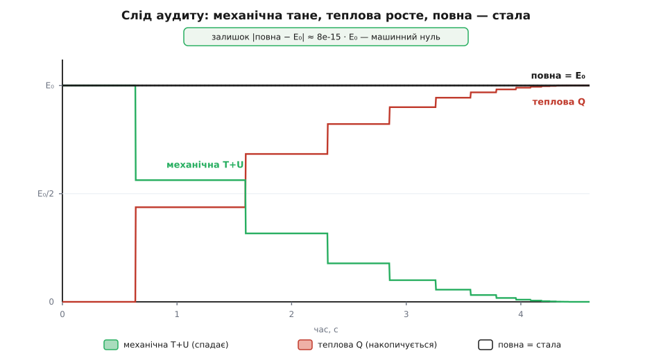
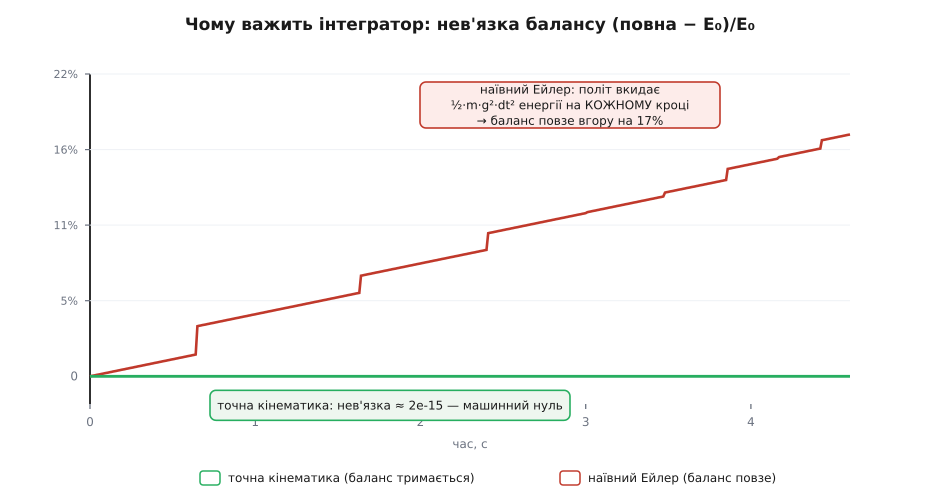

# ⚙️ Аудит енергії: чисельно ловимо кожен джоуль

**Задача.** Закон збереження енергії обіцяє незрушну суму: перелічи всі форми, склади — і хоч що станеться, підсумок той самий. Обіцянка велична, та на око вона щоразу скидається на брехню. Кинь м'яч — він підстрибує дедалі нижче й застигає. Штовхни маятник — гойдається все млявіше й зупиняється. Механічна енергія на очах тане, і жоден стовпчик, який видно, її не рятує. Ми хочемо перевірити закон найсуворіше, як лише можна перевіряти твердження про число: змусити комп'ютер вести **живу бухгалтерію** дисипативної (розсіювальної) системи. На кожному кроці — рахувати всю кінетичну, всю потенціальну й усе накопичене тепло — і подивитися, чи справді повна сума стоїть на місці **до останньої цифри, яку машина здатна втримати**, поки механічна частина невпинно спадає.

Це не переказ закону, а його випробування на розрив. Якщо десь ми недорахували, куди подівся джоуль, — сума попливе, і програма покаже це негайно, без жалю. Якщо ж баланс тримається на рівні 10⁻¹⁵ від початкової енергії протягом тисячі кроків — це найпряміший доказ, що «зникла» механічна енергія не зникла, а рівно перелилася в іншу кишеню, яку ми навчилися відкривати.

Моделлю візьмемо **стрибучий м'яч** — найчистіший приклад дисипації, зібраної в коротких ударах, з довгими відтинками чесного вільного польоту між ними. Уся хитрість — правильно зловити той джоуль, що гине в мить удару.

## Один удар множить механічну енергію на e²

Удар об підлогу — не ідеальне дзеркало. Реальний м'яч відскакує повільніше, ніж прилетів: частина руху йде на розігрів гуми, стиск повітря, звук — на все те, що ми зрештою назвемо теплом. Міру цієї втрати ловлять одним числом — **коефіцієнтом відновлення** e (лат. restituere — відновлювати). Означують його як відношення швидкості відльоту до швидкості прильоту:

```
e = |v_після| / |v_до|,     0 ≤ e ≤ 1
```

Це відношення першим виміряв і сформулював Ісаак Ньютон у «Математичних началах» (1687); його й досі звуть Ньютоновим дослідним законом удару. Значення e = 1 — ідеально пружний відскок без утрат (математична межа, у природі недосяжна); e = 0 — м'яч прилипає й зовсім не відскакує; справжня гума, скло, сталь лежать десь між, і для кожної пари матеріалів e своє.

Тепер найважливіше для нашої бухгалтерії. [Кінетична енергія](root:ph-mechanics/kinetic-energy) — це ½·m·v², вона росте з квадратом швидкості. Якщо удар множить швидкість на e, то кінетичну енергію він множить на **e²**:

```
T_після = ½·m·(e·v)² = e²·(½·m·v²) = e²·T_до
```

Отже за кожен удар механічна енергія множиться на e², а частка (1 − e²) вилітає з механіки — і саме її ми маємо зловити й покласти в теплову кишеню. Для e = 0.75 це означає, що кожен удар з'їдає (1 − 0.5625) = 43.75 % наявної механічної енергії. М'яч, кинутий із висоти h₀, після першого удару підстрибне лише на e²·h₀, після другого — на e⁴·h₀, і висоти стрибків спадають геометричною прогресією зі знаменником e².

> 🔧 **Навіщо це.** Один коефіцієнт e тримає весь облік дисипації в цій моделі. Знаючи лише його, ми наперед знаємо, скільки енергії загине в кожному ударі, — а отже, знаємо, скільки саме треба долити в тепло, щоб баланс зійшовся. Уся дисипація системи стиснута в одне число й один момент — мить дотику підлоги. Це і є та зачіпка, за яку хапається аудит: ловити треба не розмазану по часу втрату, а точну порцію в точну секунду.

## Ідея: завести кишеню й ловити те, що зникає

Механічну енергію ми вміємо рахувати будь-якої миті: кінетична плюс [потенціальна](root:ph-mechanics/potential-energy),

```
E_mech = T + U = ½·m·v² + m·g·y
```

Проблема в тому, що ця сума не стала — вона стрибками падає на кожному ударі. Ідея аудиту проста, як бухгалтерська книга: заведімо ще одну змінну, **тепловий акумулятор** Q, спершу порожній. Домовмося про одне тверде правило: **щоразу, коли з механіки зникає порція енергії, рівно стільки ж доливаємо в Q**. Тоді повна сума

```
E_total = E_mech + Q
```

має стояти на місці — бо все, що витекло ліворуч, ми власноруч долили праворуч. Початкове значення просте: підняли м'яч на h₀, відпустили зі спокою — уся енергія в висоті, E₀ = m·g·h₀, а Q = 0.

Тут ховається пастка, у яку легко впасти й обдурити самого себе. Спокуса — означити тепло як «те, чого бракує»: Q := E₀ − E_mech. Тоді, звісно, E_mech + Q = E₀ **тотожно**, до останнього біта, завжди. Але це не доказ, а порожня тавтологія: ми не перевірили закон, ми його **вписали в означення**. Такий «аудит» зійдеться навіть для геть неправильної фізики.

Чесний аудит робить навпаки. Ми рахуємо Q **незалежно** — з самої фізики втрати, підсумовуючи народжене тепло на кожному ударі за формулою (1 − e²)·T, нічого не знаючи про E₀. А тоді **порівнюємо** здобуту суму E_mech + Q зі сталою E₀. Різниця між ними — **нев'язка** — і є справжнім свідком. Якщо фізика й арифметика правильні, нев'язка мусить бути машинним нулем. Якщо ми десь помилилися — вона зрадить це негайно. Ось цю різницю ми й стежитимемо.

## Робочий код

Задача суто числова, і читатися вона має як бухгалтерська відомість, а не як боротьба з мовою, — тож пишемо Python. Уся модель — дві функції. Перша, `flight`, просуває м'яч на один крок часу; друга, `bounce_audit`, крутить цикл і на кожному кроці записує повний баланс.

Спершу — серце, крок польоту. Тут захований найтонший вибір усієї роботи, і зробити його треба свідомо. Між ударами на м'яч діє **тільки тяжіння**, прискорення стале — а отже, траєкторія є точна парабола, і ми знаємо її формулу без жодного наближення:

```
y(τ) = y + v·τ − ½·g·τ²
v(τ) = v − g·τ
```

Це не метод, а точний розв'язок; єдина похибка тут — округлення у 16-й значущій цифрі. Найкраще те, що ця точна кінематика **сама зберігає** T + U: якщо підставити y(τ) і v(τ) у ½·m·v² + m·g·y, доданки з τ скорочуються дослівно, і сума лишається ½·m·v² + m·g·y — тією самою, що на початку кроку. Тому під час польоту нам **нічого не треба доливати в тепло**: механічна енергія стоїть непорушно сама собою. Уся дія — рівно в моменти ударів.

Залишається одне ускладнення: за час кроку dt м'яч може перетнути підлогу десь **усередині** кроку, а не рівно на його краю. Якщо це проґавити, порція тепла зарахується не в тій точці й баланс попливе. Тож `flight` знаходить **точний час до дотику** підлоги, доводить м'яч рівно до неї, обробляє удар, а далі долітає залишок кроку вже після відскоку.

```py
import math

g = 9.81                       # м/с²   прискорення вільного падіння

def flight(y, v, dt, m, e):
    """Точна кінематика сталого g на час dt, з обробкою всіх ударів усередині кроку.
    Повертає (y, v, dQ) — новий стан і тепло, народжене за цей крок."""
    dQ, tau = 0.0, dt                       # tau — скільки часу кроку ще лишилось
    while tau > 0:
        s = math.sqrt(v*v + 2*g*y)          # швидкість, з якою м'яч дійде підлоги
        if s == 0.0:                        # м'яч лежить нерухомо — нічого не діється
            return 0.0, 0.0, dQ
        t_hit = (v + s) / g                 # час до наступного дотику підлоги
        if t_hit >= tau:                    # за цей крок удару не буде — просто летимо
            return y + v*tau - 0.5*g*tau*tau, v - g*tau, dQ
        if t_hit + (2*s/g)*e/(1 - e) <= tau:  # хвіст Зенона (пояснення нижче)
            return 0.0, 0.0, dQ + 0.5*m*(v*v + 2*g*y)   # уся решта механічної — в тепло
        v_hit = v - g*t_hit                 # швидкість у мить удару (= −s, донизу)
        dQ += 0.5*m*v_hit*v_hit * (1 - e*e) # ← УСЯ дисипація зараховується САМЕ ТУТ
        v, y = -e*v_hit, 0.0                # відскок: перевертаємо й гасимо на e
        tau -= t_hit                        # решту кроку долітаємо вже після відскоку
    return y, v, dQ
```

Придивімося до рядка з `t_hit`. Час до дотику — це корінь рівняння y(τ) = 0, тобто ½·g·τ² − v·τ − y = 0; додатний корінь дає t_hit = (v + √(v² + 2·g·y))/g. А величина s = √(v² + 2·g·y) — це рівно модуль швидкості в мить удару (те саме, що дає збереження енергії у вільному польоті: ½·v_hit² = ½·v² + g·y). Через це `v_hit = −s`, а тепло удару виходить точно (1 − e²)·½·m·s². Жодного наближення — самі точні формули.

Тепер зовнішній цикл. Він лише крутить кроки, накопичує тепло й записує рядок відомості, доки в механіці лишається хоч крихта енергії.

```py
def bounce_audit(h0=2.0, m=0.15, e=0.75, dt=0.004):
    """Стрибучий м'яч: повний баланс (T + U) + накопичене тепло Q на кожному кроці."""
    E0 = m*g*h0                             # уся енергія спершу — потенціальна, у висоті
    y, v, Q, t = h0, 0.0, 0.0, 0.0          # стан: висота, швидкість (угору +), тепло, час
    rows = [(t, 0.0, E0, E0, 0.0, E0)]
    while 0.5*m*v*v + m*g*y > 1e-12 * E0:    # доки лишилась механічна енергія
        y, v, dQ = flight(y, v, dt, m, e)   # просунути на dt, зібрати народжене тепло
        Q += dQ                             # ← незалежне накопичення, НЕ E0 − E_mech
        t += dt
        T, U = 0.5*m*v*v, m*g*y
        rows.append((t, T, U, T + U, Q, T + U + Q))
    return E0, rows

E0, rows = bounce_audit()
res = max(abs(row[5] - E0) for row in rows) / E0
print("E₀ = %.4f Дж,  кроків = %d,  найбільша нев'язка = %.1e · E₀" % (E0, len(rows), res))
```

Зверни увагу на єдине місце, де народжується Q: рядок `Q += dQ`, а `dQ` приходить **тільки** з ударів усередині `flight`. Ми ніде не пишемо `Q = E0 − E_mech`. Тепло рахується з фізики втрати; сума E_mech + Q — незалежний свідок; а `res` наприкінці — вирок.

Ось витяг із відомості для м'яча масою 0.15 кг, кинутого з 2 метрів (e = 0.75, dt = 0.004 с). Числа — справжній вивід програми:

```
  t, с        T        U    E_mech        Q         сума      сума − E₀
 0.000   0.0000   2.9430    2.9430    0.0000    2.9430000     0.00e+00
 0.480   1.6630   1.2800    2.9430    0.0000    2.9430000     4.44e-15   ← ще перший політ
 1.000   0.0996   1.5558    1.6554    1.2876    2.9430000     1.55e-14
 1.720   0.4005   0.5307    0.9312    2.0118    2.9430000     2.09e-14
 2.800   0.3363   0.1875    0.5238    2.4192    2.9430000     2.35e-14
 4.000   0.0036   0.0259    0.0295    2.9135    2.9430000     2.35e-14
 4.472   0.0000   0.0000    0.0000    2.9430    2.9430000     2.35e-14   ← м'яч став
```

Прочитаймо цю таблицю уважно, бо в ній весь сенс роботи. Стовпчик `E_mech` (механічна) невпинно спадає: з 2.943 Дж на початку до нуля наприкінці — саме те «зникнення», що збиває з пантелику на око. Стовпчик `Q` дзеркально росте: з нуля до 2.943 Дж, тобто до **всієї** початкової енергії. А стовпчик `сума` — незворушний: 2.9430000 у кожному рядку, від першої секунди до останньої. Останній стовпчик, нев'язка, ніде не переростає ~2·10⁻¹⁴ джоуля — це кілька одиниць у 15-й значущій цифрі, [межа самої машинної арифметики](root:hw-arch/floating-point), а не фізики. Найбільша відносна нев'язка за весь розбіг — **8.3·10⁻¹⁵**.

Зверни увагу й на перший рядок після старту (t = 0.48 с): м'яч ще падає, першого удару не було, тому Q = 0, а T і U вже помінялися (кінетична зросла, потенціальна впала) — але їхня сума E_mech досі рівно 2.9430, і нев'язка мізерна. Це та сама точна кінематика тримає T + U під час польоту без жодного доливання. Тепло вмикається лише з першим ударом.



*Справжній вивід симуляції в часі. Механічна енергія (зелена) стоїть рівно між ударами — точна кінематика зберігає T + U — і обривається вниз у кожен удар; тепло (червоне) підхоплює рівно ту саму порцію; повна сума (чорна) не зрушується з E₀ на всьому розбігу. Нев'язка ховається в 15-й цифрі.*

Отже, комп'ютер щойно на наших очах довів: механічна енергія, що «розтанула», уся до останньої десятитисячної джоуля осіла в теплі. Це чисельне лице [першого закону термодинаміки](root:ph-thermodynamics/first-law-thermodynamics) — механічна плюс теплова — стала.

## Складність і пастки

Аудит виглядає простим, і в цьому небезпека: майже кожна дрібна недбалість зраджує себе тим, що незрушна сума раптом починає повзти. Пройдімо по місцях, де баланс ламається, — саме вони, а не сам код, і є справжнім змістом задачі.

**Пастка 1: тавтологічний облік.** Про неї вже йшлося, але вона така спокуслива, що варта окремого слова. Якщо десь у циклі написати `Q = E0 - E_mech`, нев'язка стане тотожним нулем — і код «запрацює» блискуче навіть із помилковим e, помилковою масою, з будь-якою нісенітницею у фізиці. Ти нічого не перевірив; ти лише переписав праву кишеню як «скільки бракує лівій». Аудит має сенс **рівно тому**, що Q рахується з незалежного джерела — сум ударних утрат, — і зустрічається з E₀ лише в порівнянні. Нев'язка мусить мати змогу бути ненульовою; інакше вона нічого не свідчить.

**Пастка 2: інтегратор, що підробляє енергію.** Точну кінематику ми взяли не з примхи. Спокусливо здається, що можна просто дрібно крокувати рух звичайним [чисельним інтегруванням](root:math-numeric/numerical-integration) — найпростіший вибір, явний метод Ейлера:

```
y ← y + v·dt
v ← v − g·dt
```

Підставмо цей крок у механічну енергію й порахуймо, що станеться з нею за один політний крок. Розкриймо ½·m·v_new² + m·g·y_new: перехресні доданки −m·v·g·dt і +m·g·v·dt скорочуються, а лишається зайве:

```
ΔE_mech = +½·m·g²·dt²    на кожному кроці польоту
```

Явний Ейлер **додає** ½·m·g²·dt² енергії щокроку — з нічого, самою похибкою методу. Знак сталий і додатний, тож помилка не гойдається туди-сюди, а невпинно накопичується. Наш акумулятор Q ловить лише ударні втрати й про цю фальшиву прибавку не знає — тож повна сума починає повзти вгору. При dt = 0.01 с баланс роздувається на **17 %** до кінця розбігу: сімнадцять відсотків енергії, народженої з порожнечі. Зменшиш крок удвічі — здуття вдвічі менше (35 % при dt = 0.02, 9 % при 0.005, 4 % при 0.0025); воно спадає пропорційно dt, але **ніколи** не сягає машинного нуля. Точна ж кінематика тримає нев'язку на 10⁻¹⁵ за будь-якого кроку, бо в неї немає похибки зрізання — тільки округлення.



*Чому важить сам спосіб інтегрування. Червона крива — наївний явний Ейлер: кожен політний крок вкидає ½·m·g²·dt² фальшивої енергії, і баланс невпинно повзе вгору. Зелена — точна кінематика сталого прискорення: нев'язка сидить на машинному нулі й не рухається. Різниця не у фізиці, а в чисельному методі.*

Мораль тонка й важлива: **аудит енергії — це заразом і тест якості інтегратора**. Якщо повна сума повзе, винна не фізика, а числова схема, що нищить або народжує енергію. І там, де прискорення стале між подіями (як тут між ударами), не інтегруй наближено взагалі — бери точний розв'язок.

**Пастка 3: зарахувати не в тій точці й не ту величину.** Тепло удару — це (1 − e²)·½·m·v_hit², де v_hit — швидкість **у мить дотику підлоги**, порахована в **точний час** t_hit усередині кроку. Тут троє грабель поруч. Перші: узяти швидкість **після** відскоку (e·v_hit) замість тієї, що до, — тоді порція виходить меншою, і частина втрати випадає з обліку. Другі: зарахувати удар на **краю** кроку, а не в точці перетину, — тоді за час від дотику до кінця кроку м'яч у розрахунку «провалюється» під підлогу з неправильною енергією. Треті: забути, що за один dt ударів може бути **кілька** (коли стрибки вже дрібні). Саме тому `flight` шукає точний t_hit, гасить швидкість **перед** множенням на e і крутить внутрішній цикл `while tau > 0`, доки крок не вичерпано. Кожна з цих недбалостей дає не катастрофу, а тихий дрейф суми на кожному ударі — і аудит ловить її тим самим стовпчиком нев'язки.

**Пастка 4: хвіст Зенона.** У м'яча з e < 1 попереду **нескінченно багато** ударів — але всі вони вкладаються в **скінченний** час. Час між ударами спадає геометрично, і повний час до повного спокою збігається до

```
T_повний = √(2·h₀/g) · (1 + e)/(1 − e)
```

Для наших чисел це √(2·2/9.81)·(1.75/0.25) = 4.470 с — і симуляція справді зупиняється на 4.472 с, за той самий час, тільки з точністю до кроку. Але ця скінченність — пастка для наївного циклу: під кінець удари згущуються так, що в один dt їх напихається безліч (фізики звуть це **непружним колапсом**), і внутрішній `while` зациклюється навіки, ганяючи все дрібніші відскоки. Рятує рядок про Зенона: перш ніж обробляти черговий удар, `flight` питає, чи не влізе за лишок кроку **весь безмежний хвіст** ударів — а його повний час, від дотику зі швидкістю s, дорівнює t_hit + (2·s/g)·e/(1 − e). Якщо влізе — м'яч за цей крок доходить спокою, і ми одним махом зсипаємо **всю** решту механічної енергії в тепло, ставлячи y = v = 0. Саме тому наприкінці Q дорівнює точно E₀ до десятого знаку: останню, нескінченно роздроблену крихту закрито однією чесною проводкою, а не мільярдом марних ітерацій.

**Пастка 5: коли машинної точності не буде.** М'ячеві пощастило двічі, і варто зрозуміти чому, бо на цьому щасті тримається весь його ідеальний баланс. По-перше, його політ між подіями **точно розв'язний** — прискорення стале, парабола відома. По-друге, дисипація в нього **зосереджена** в скінченному наборі миттєвих ударів, кожен з яких дає точну порцію (1 − e²)·½·m·v_hit². Обидві втечі від похибки зрізання — і тому нев'язка машинна.

Заміни модель на таку, де дисипація **розмазана по часу**, — і це щастя випаровується. Візьмімо [згасний осцилятор](root:ph-waves/damped-oscillator): вантаж на пружині з в'язким опором, m·x″ = −k·x − b·x′. Тут сила тертя −b·x′ діє щомиті, і тепло тече безперервно з потужністю b·v². Аудит будується так само — акумулятор Q, тільки тепер його наповнюють інтегралом:

```py
def audit_osc(dt, m=0.5, k=8.0, b=0.6, x0=1.0, t_end=12.0):
    x, v, Q = x0, 0.0, 0.0                   # старт: розтяг x0, спокій
    E0 = 0.5*k*x0*x0
    while ...:                               # крокуємо рух якимось інтегратором
        a = (-k*x - b*v) / m                 # прискорення залежить від v — точного кроку нема
        v += a*dt
        x += v*dt
        Q += b*v*v*dt                        # накопичуємо розсіяну потужність ∫ b·v² dt
        E_mech = 0.5*m*v*v + 0.5*k*x*x       # баланс: E_mech + Q проти E0
```

І тут аудит уже **не** зійдеться до машинного нуля. Прискорення тепер залежить від самої швидкості, точного кроку не існує, тож і траєкторія, і сума ∫ b·v² dt несуть похибку зрізання, і ці дві похибки не гасять одна одну дослівно. Нев'язка сідає на **порядок інтегратора**: для простої схеми — ~10⁻³ від E₀ при dt = 0.002 с, і вона слухняно **зменшується пропорційно dt** (вдвічі дрібніший крок — удвічі менша нев'язка), але застигає на цьому рівні, ніколи не сягаючи 10⁻¹⁵.

Ось найглибший висновок усієї роботи. Машинна точність балансу — **не** дарунок закону збереження; це дарунок **точно розв'язної фізики між подіями**. Де рух інтегрується точно, а втрати зосереджені в обчислюваних подіях, аудит зводиться до останнього біта. Де рух і дисипація розмазані й наближені, він зводиться лише до порядку методу — і тоді нев'язка стає не свідком фізики, а мірилом якості твоєї числової схеми. Обидві відповіді корисні: перша каже «закон і код бездоганні», друга каже «уточни крок». Головне — не сплутати їх і не сховати одну за тавтологією Q = E₀ − E_mech, яка вбиває обох свідків одразу.

## Що ми зважили

Ми взяли твердження, що на око скидається на брехню — механічна енергія при кожному ударі зникає, — і змусили комп'ютер його спростувати цифрою. Завели теплову кишеню, поклали одне тверде правило: скільки витекло з механіки, стільки долий у тепло; рахували обидві частини незалежно; і дивилися на різницю з E₀. Різниця не зрушила з 10⁻¹⁵ за тисячу кроків, поки механічна частина падала з повної до нуля, а теплова дзеркально наросла до повної. Це і є збереження енергії в найпрямішому вигляді, який лише буває: не формула на дошці, а бухгалтерська відомість, у якій кожен стовпчик щокроку сходиться до машинного нуля. А по дорозі ми побачили, що той нуль — крихкий: його вбиває і тавтологічний облік, і жадібний до енергії інтегратор, і зарахований не в тій точці джоуль, і безмежний хвіст Зенона. Аудит, який пережив усі чотири, чогось вартий.
