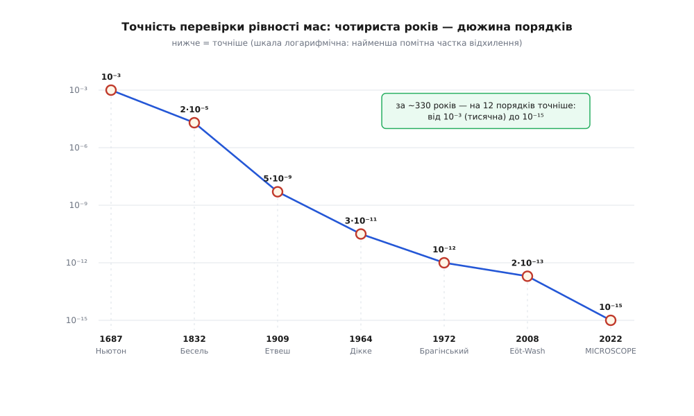
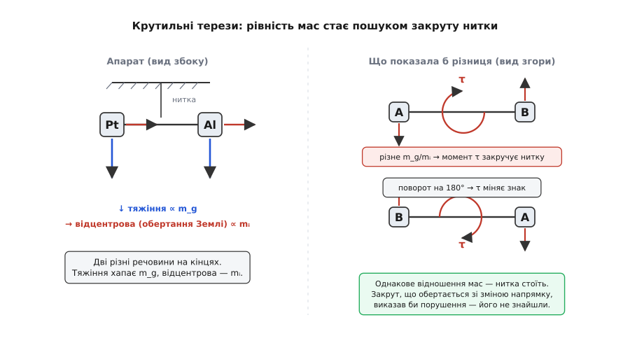

# 📜 Дорога до рівності мас: від похилих площин Ґалілея до титану на орбіті

Одне-єдине число фізики переперевіряють уже понад чотириста років — і щоразу дістають той самий результат. Питання на слух просте: чи справді «маса, що опирається розгону» точно дорівнює «масі, за яку хапається тяжіння»? Наперед немає жодної причини, щоб дві настільки різні ролі зійшлися в одному числі. І все ж кожен новий дослід — від бронзових куль на похилій дошці до титанових циліндрів на орбіті — підтверджує рівність, лишень додаючи знаки після коми. Ця розповідь про те, як підозрілий збіг відшліфували від «приблизно» до п'ятнадцятого десяткового знака, і хто саме це зробив — з датами, іменами й чесним поділом на факт і легенду.

## Ґалілей: доказ, якому не потрібен прилад

Перше, що варто прибрати з голови, — картинку, як Ґалілео Ґалілей (*Galileo Galilei*, 1564–1642) щось кидає з вежі на очах у юрби. Його справжній метод був тонший і хитріший. Вільне падіння надто швидке, щоб виміряти його годинником тих часів: важке ядро пролітає перші метри за частки секунди, і жоден пульс чи водяний годинник не встигне. Тож Ґалілей падіння **сповільнив** — пустив кулі котитися жолобом по **похилій площині**. Що менший нахил, то повільніший рух, а закон лишається той самий; час він міряв, зважуючи воду, що витікала тонким струменем крізь отвір, доки куля долала мірку шляху. Так він встановив, що шлях росте як квадрат часу, і — головне для нас — що кулі різної ваги, пущені однаково, доходять низу **разом**.

Був у нього й доказ чисто розумовий, якому взагалі не потрібен прилад: якщо припустити, що важче тіло падає швидше, і зв'язати важке з легким, дійдеш до суперечності (зв'язка мусила б падати і повільніше за важке, бо легке гальмує, і швидше, бо разом вони важчі). Єдиний вихід — усі тіла падають однаково. Цей аргумент Ґалілей виклав у «Бесідах» (*Discorsi*, 1638), і саме він, а не публічний дослід, ніс усю вагу.

А що ж вежа? **Знамените скидання куль із Пізанської вежі — майже напевно легенда.** Її єдине джерело — життєпис Ґалілея, який написав його учень Вінченцо Вівіані (*Vincenzo Viviani*): «Racconto istorico della vita di Galileo» він склав близько 1654 року, а надрукували цей текст аж 1717-го. Вівіані розповідає, ніби замолоду (десь між 1589 і 1592 роками, коли Ґалілей викладав у Пізі) той піднявся на вежу й скидав тіла «нерівної ваги» перед професорами й студентами. Але це свідчення записане **через понад пів століття** після подій, самим відданим учнем, і **не підтверджене більше нічим** — ні власними працями Ґалілея, де про вежу немає й слова, ні жодним іншим сучасником. Історики тому ставляться до сцени з вежею як до гарної легенди, що виросла вже посмертно. Отже, статус чіткий: **похилі площини й логічний доказ — справжні**, задокументовані самим Ґалілеєм; **вежа — легенда**, оперта на єдиний пізній переказ.

Ґалілей дав фізиці якісну істину — «усі падають однаково» — але **числа** не дав. Скільки саме «однаково»? З якою точністю? Це вже інша епоха й інші люди.

## Маятники Ньютона й Бесселя: перше число

Перший, хто перетворив «однаково» на виміряне число, був Ісак Ньютон (*Isaac Newton*, 1643–1727). Його прилад — **маятник**, і вибір геніальний. Період гойдання зв'язує обидві маси в одну формулу. Тяжіння тягне тягарець із силою, пропорційною гравітаційній масі `m_g`, а розгойдується він за інертною масою `mᵢ`. Прирівняйте — і період виходить такий:

```
T = 2π · √( (mᵢ / m_g) · (L / g) )
```

Дивіться, що тут заховано. Якби `mᵢ = m_g`, відношення стало б одиницею, і період залежав би **лише** від довжини `L` — а не від того, з чого зроблений тягарець. Тобто два маятники однакової довжини, але з різних речовин, гойдаються **в такт** тоді й лише тоді, коли відношення мас у них однакове. Ньютон зробив кілька однакових порожнистих дерев'яних скриньок і по черзі наповнював їх золотом, сріблом, свинцем, склом, піском, сіллю, деревом, водою, зерном — і жодної різниці в періоді не вловив. Так він показав рівність мас з точністю близько **однієї тисячної** (10⁻³) і слушно зауважив, що дослід можна повторити для будь-якої речовини, тож висновок стосується всіх тіл.

Через півтора століття німецький астроном Фрідріх Бесель (*Friedrich Wilhelm Bessel*, 1784–1846) — той самий, хто перший виміряв відстань до зорі — узяв ту саму ідею маятника й вичавив із неї на два порядки більше. Ретельніше міряючи довжину, дбаючи про температуру й опір повітря, порівнюючи багато речовин (золото, срібло, свинець, кварц, мармур, глину, воду, навіть намагнічене залізо), він 1832 року довів рівність до **двох стотисячних** — приблизно `2·10⁻⁵`. Маятник узяв стелю: далі точність упиралася в те, що вимір іде проти повної сили тяжіння, а її годі приборкати надточно.

## Крутильні терези Етвеша: стрибок на чотири порядки

Наступний крок був не покращенням, а **зміною самого підходу**, і зробив його угорець Лоранд Етвеш (угор. *Eötvös Loránd*; у німецькій традиції — барон Роланд фон Етвеш, 1848–1919). Тут варто одразу внести ясність в атрибуцію, бо прізвище часом плутають: **Етвеш — угорець**, професор у Будапешті часів Австро-Угорщини, один із найбільших фізиків Угорщини (його ім'я нині носить Будапештський університет), а **не** російський учений. Працював він не сам: багаторічну прецизійну кампанію вів із двома співавторами — Дежьо Пекаром (*Dezső Pekár*, 1873–1953) і Єньо Фекете (*Jenő Fekete*, 1880–1943); тому найточніший їхній результат прийнято звати дослідом **Етвеша–Пекара–Фекете**.

Ідея була в тому, щоб перестати боротися з повною силою тяжіння, а натомість поставити дві маси **сперечатися між собою** — і виміряти не силу, а **закрут**. На тонкій нитці горизонтально висить коромисло, на кінцях — тягарці з **різних** речовин. На кожен діють дві сили різної природи. Тяжіння тягне до центра Землі й чіпляється за гравітаційну масу (`∝ m_g`). А оскільки Земля крутиться, кожен тягарець ще й трохи «відкидає» **відцентрова** сила, спрямована геть від осі обертання, — і вона чіпляється за інертну масу (`∝ mᵢ`). На середніх широтах ці два напрямки не збігаються: тяжіння веде до центра, відцентрова — вбік. Якби відношення `m_g/mᵢ` у двох речовин **різнилося**, то бічні складові на кінцях коромисла не зрівноважилися б, і виник би крихітний **обертовий момент**, що закручує нитку, — причому знак цього моменту залежить від того, куди на компас повернуте коромисло. Досить розвернути прилад на 180° — і момент мусить змінити знак. Саме цю різницю Етвеш і ловив.


*Кожна сходинка вниз — новий дослід і нова стеля точності (шкала логарифмічна: нижче = точніше). Від маятників Ньютона (10⁻³) через крутильні терези Етвеша (5·10⁻⁹) до орбітального MICROSCOPE (10⁻¹⁵) — і на кожному рівні відхилення так і не знайшли.*

Чому це відразу дало **чотири порядки** виграшу? Бо вимір став **нульовим** і **різницевим**. Нитка не міряє силу тяжіння — вона реагує на мізерну **різницю** в поведінці двох речовин, а такий закрут можна зробити приголомшливо чутливим (тонке кварцове волокно закручується від сил, менших за вагу порошинки). До того ж корисний сигнал модулюється поворотом установки, тож його легко відділити від сталих перекосів. Результат Етвеша–Пекара–Фекете: **жодного відхилення на рівні близько `5·10⁻⁹`** — приблизно п'ять мільярдних. Кампанію на 4000 годин вимірів провели у 1900-х, підсумки Етвеш доповів 1909 року на XVI Міжнародній геодезичній конференції в Лондоні, а найточніша публікація вийшла вже **посмертно, 1922-го** (сам Етвеш помер 1919 року). Побічно ці ж терези стали й геологічним інструментом: чутливі до градієнтів тяжіння, вони видавали сховані під землею соляні куполи й нафтові пастки, тож прилад Етвеша ще й прислужився розвідці надр.

> 🔧 **Навіщо це.** Прийом Етвеша — не історична дрібниця, а **шаблон усієї прецизійної фізики**: не міряй велику величину прямо, а зроби так, щоб шукане проявилося як **різниця**, яка **періодично вмикається й вимикається** (поворотом, обертанням, зміною напрямку), — і тоді синхронний прийом витягне сигнал із-під шумів, більших за нього в мільйони разів. За цим самим рецептом працюють і детектори гравітаційних хвиль, і атомні годинники, і все, що йде за наступними знаками після коми.

## Сонце як важіль: Дікке й радянська відповідь

Наступні дослідники змінили не прилад, а **джерело** відхиляючої сили — і взяли замість Землі **Сонце**. Ідею відточила група з Принстона: Роберт Дікке (*Robert H. Dicke*), Пітер Ролл (*Peter G. Roll*) і Роберт Кротков (*Robert Krotkov*), 1964 рік. Хитрість ось у чому. Земля вільно падає навколо Сонця, тож сонячне тяжіння тут майже повністю гаситься орбітальним прискоренням — майже. Якби золото й алюміній падали до Сонця бодай трішки по-різному, лишалася б крихітна різницева сила, спрямована **на Сонце або від нього**. А Земля обертається — і напрямок на Сонце обходить лабораторію по колу раз на добу. Отже, порушення проявилося б як сигнал із **24-годинним** періодом, а такий ритмічний сигнал можна виловити синхронним (фазочутливим) прийомом, навіть коли він тоне в шумі. Трипроменеве коромисло із золотом та алюмінієм не показало нічого — **на рівні `3·10⁻¹¹`**.

Наступний рекорд поставили радянські (московські) фізики — Володимир Брагінський (рос. *Владимир Брагинский*, 1931–2016) і В. І. Панов (*V. I. Panov*) з Московського університету, 1972 рік. Атрибуція тут пряма й без підводних каменів: це справді радянські фізики, що працювали в Москві, — на відміну від Етвеша, якого іноді помилково пишуть у ту саму графу. Вони повторили сонячний прийом Дікке, але з ще акуратнішою механікою: крихітне коромисло всього на 4.4 г із платини й алюмінію на вольфрамовій нитці, у високому вакуумі, у підвалі з температурою, витриманою до сотих часток градуса, із лазерним зчитуванням найменших поворотів. Їхня стеля — близько **`10⁻¹²`**, ще на порядок нижче за Дікке. (Брагінський згодом уславився зовсім іншим — теорією квантової межі вимірювань і фізикою детекторів гравітаційних хвиль.)

## Обертові терези Eöt-Wash

Найточніший **наземний** результат тримає група з Вашингтонського університету на чолі з Еріком Аделбергером (*Eric Adelberger*). Їхня назва — **Eöt-Wash** — жарт-каламбур: Етвеш (*Eöt*-vös) плюс Вашингтон. Вони додали до старої ідеї ще один рівень модуляції: поставили все коромисло на повільно **обертовий стіл**. Тепер сигнал від нерухомого джерела (Сонця, центра Галактики, самої Землі) переноситься на частоту обертання столу — туди, де апаратних шумів менше, а отже, його ще легше відділити. Порівнюючи прискорення тягарців із **берилію й титану**, вони довели межу приблизно до **`10⁻¹³`** (параметр Етвеша порядку кількох десятих на 10¹³). Ці ж терези принагідно перевіряють, чи не падає інакше «темна матерія», і чи не ховається у тяжінні нова короткодійна сила.

## MICROSCOPE: вежа заввишки з орбіту

Щоб піти ще глибше, довелося залишити Землю. Наземні терези впираються в дрібні сейсмічні поштовхи й у слабкість Сонця як джерела; ідеальний же дослід — це **вічне вільне падіння** з **величезним** тяжінням поряд. І те, й те дає орбіта: супутник нескінченно падає навколо Землі, а сама Земля тягне його більш ніж у тисячу разів дужче за Сонце. Так з'явився **MICROSCOPE** — місія французького космічного агентства CNES (акселерометри для неї зробила ONERA). Супутник запустили 25 квітня 2016 року, звели з орбіти 2018-го, а **остаточні результати оприлюднили 14 вересня 2022 року**.

Усередині — два співвісні порожнисті циліндри з **різних** речовин: один зі сплаву на основі титану, другий — платино-родієвий. Обидва мали б облітати Землю однією орбітою; електростатика точно утримує кожен на місці, і **сила, потрібна щоб зрівняти їхні орбіти**, і є вимірюваний сигнал. Якби титан і платина падали хоч трохи по-різному, ця сила пульсувала б із частотою обертання супутника навколо Землі. Її не знайшли: рівність мас витримала перевірку **на рівні `10⁻¹⁵`** — сто разів точніше за найкращі наземні терези. Це те саме, ніби скинути два різні матеріали з висоти будинку й побачити, що після падіння вони розійшлися менше ніж на тисячну частку атома.

```
Ньютон 1687      10⁻³      маятники, різні речовини
Бесель 1832      2·10⁻⁵    точніший маятник
Етвеш   1909    5·10⁻⁹    крутильні терези, обертання Землі
Дікке   1964    3·10⁻¹¹   Сонце як джерело, добова модуляція
Брагінський 1972 10⁻¹²    те саме, краща механіка
Eöt-Wash ~2008   10⁻¹³    обертовий стіл
MICROSCOPE 2022  10⁻¹⁵    вільне падіння на орбіті
```

## Найщасливіша думка Айнштайна

Поки експериментатори з покоління в покоління додавали знаки після коми, збіг двох мас лишався **загадкою без пояснення** — просто дуже точним фактом. Сенсу йому надав не новий прилад, а одна думка. 1907 року Альберт Айнштайн (*Albert Einstein*), ще службовець патентного бюро в Берні, писав оглядову статтю про теорію відносності для щорічника «Jahrbuch der Radioaktivität und Elektronik» — і його раптом вразило, як він згадував, просте міркування: **людина, що вільно падає, не відчуває власної ваги**. А коли ваги немає — то для неї в її околі немає й гравітаційного поля. Виходить, тяжіння існує лише **відносно**: його можна прибрати, просто перейшовши у вільне падіння. Цю мить він потім назвав найщасливішою думкою свого життя (нім. *der glücklichste Gedanke meines Lebens*).

Ось де сходяться дві нитки цієї історії. Століттями досліди твердили: інертна й гравітаційна маси рівні — і рівні **фанатично точно**. Айнштайнова думка пояснила, **чому** ця рівність не випадкова. Якщо вільне падіння **всюди й для всіх речовин однаково** стирає тяжіння, то природно оголосити його не силою, що по-різному діє на різні тіла, а властивістю самого простору-часу, спільною для всього, що в ньому рухається. Тоді точний збіг мас — не дивний факт, а **необхідність**: тіла падають однаково, бо йдуть найпрямішими доступними шляхами в одній і тій самій викривленій геометрії. За вісім років ця думка доросла до [загальної теорії відносності](root:ph-quantum/general-relativity) (1915), де тяжіння вже не сила, а кривина. Тобто експеримент і теорія — дві половини одного: досліди міряють, наскільки точно рівні маси, а Айнштайнова ідея каже, що ця точність і є підпис геометрії.


*Крутильні терези перетворюють питання «чи рівні маси?» на пошук закруту нитки: різні речовини на кінцях коромисла, тяжіння (∝ m_g) тягне вниз, відцентрова сила Землі (∝ mᵢ) — вбік. Однакове відношення мас — нитка стоїть; різне — з'явився б момент, що змінює знак при повороті на 180°. Жодного такого моменту так і не знайшли.*

## Що тут факт, а що — обережність

Розкладімо історію за статусом доказовості, бо в ній перемішані тверді дати й пізні перекази.

**Усталено** (підтверджено первинними джерелами й багатьма незалежними вимірами): маятникові досліди Ньютона (10⁻³, «Начала», 1687) і Беселя (2·10⁻⁵, 1832); крутильні терези Етвеша–Пекара–Фекете (близько 5·10⁻⁹, доповідь 1909, публікація 1922); Дікке–Ролла–Кроткова (3·10⁻¹¹, золото й алюміній, Сонце, 1964); Брагінського й Панова (10⁻¹², платина й алюміній, 1972); Eöt-Wash (10⁻¹³, берилій і титан); MICROSCOPE (10⁻¹⁵, титан і платина, остаточні дані 2022). Найщасливіша думка Айнштайна 1907 року в патентному бюро в Берні теж добре задокументована — і його власними спогадами, і оглядовою статтею того ж року.

**Легенда:** публічне скидання куль із **Пізанської вежі**. Єдине джерело — життєпис, який учень Ґалілея Вівіані склав близько 1654 року (надрукований 1717-го), через десятиліття після подій; сучасних свідчень немає, у працях самого Ґалілея вежі немає. Справжній його метод — похилі площини й логічний доказ.

**Атрибуції, які варто тримати точно:** Лоранд Етвеш — **угорець** (Будапешт, Австро-Угорщина), а не російський учений; Брагінський і Панов — **радянські (московські)** фізики; Дікке з колегами — американці (Принстон); Бесель — німець (Кенігсберг); MICROSCOPE — **французька** місія (CNES). Ці мітки не педантизм: рівність мас перевіряли по всьому світу й упродовж поколінь, і чесно назвати кожного своїм іменем — частина того самого прагнення до точності, з якою міряли й саме число.

Чотириста років, дюжина порядків точності, десятки різних речовин і приладів — а відповідь щоразу та сама: **рівні**. Спершу це здавалося щасливим збігом; тепер ми знаємо, що це підпис самої геометрії світу.
