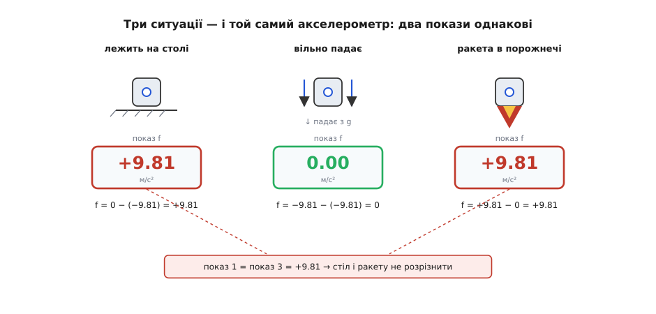
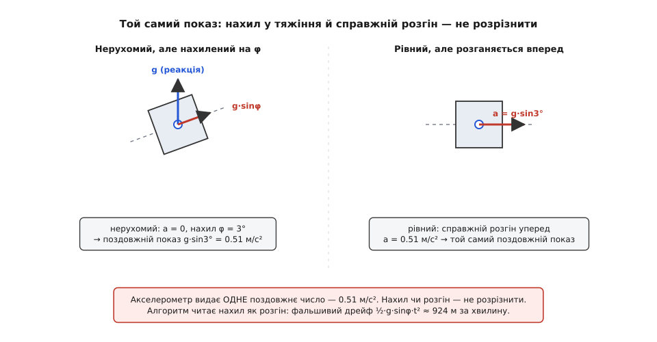

# ⚙️ Принцип еквівалентності в коді: акселерометр, який плутає стіл із ракетою

Про принцип еквівалентності легко говорити як про філософію: мовляв, тяжіння й прискорення «однакові», скринька без вікон, розумовий дослід. Та є спосіб зробити його твердим, як камінь: записати показ акселерометра одним рядком коду й прогнати крізь нього три ситуації, які на око геть різні. Тоді принцип перестає бути гарною фразою й стає рівністю, яку **друкує ваша програма** — два несхожі світи, а число на виході одне. А коли рівність уже в руках, ми побачимо, як та сама нерозрізненність із дива обертається на найглибшу пастку інерціальної навігації.

## Задача: показ давача — це не рух

Найперше треба скинути звичну оману. Акселерометр **не міряє** «прискорення відносно землі». Він міряє [питому силу](root:ph-mechanics/specific-force) — суму всіх негравітаційних сил на одиницю маси, тобто наскільки тіло відхиляють від вільного падіння; те саме в осях приладу звуть його [власним прискоренням](root:ph-mechanics/proper-acceleration). Тяжіння як таке давач відчути не здатен: у вільному падінні воно нічого не штовхає — падає геть усе разом із давачем, і пружинка всередині розслабляється.

Формально показ — це `f = a − g`, де `a` — справжнє прискорення давача, а `g` — **місцеве поле тяжіння** там, де він зараз. І тут ховається тонкість, від якої залежить усе: поле `g` **не однакове скрізь**. Біля Землі воно тягне вниз із ≈ 9.81 м/с²; далеко в порожнечі його немає зовсім, `g = 0`. Чесна модель мусить брати `g` як **окремий вхід**, а не як світову сталу, — бо саме різниця в тому, яке поле діє, і породить наш фокус.

## Ідея: один рядок фізики

Візьмімо вертикальну вісь, «вгору» — додатний напрямок. Поле біля поверхні дивиться вниз, тож у цій домовленості воно від'ємне. Уся модель — одне віднімання:

```python
def accelerometer(a, g):
    """Показ ідеального акселерометра — питома сила f = a − g.
    a — справжнє (координатне) прискорення давача, «вгору» додатне;
    g — місцеве поле тяжіння там, де давач (біля Землі −9.81, у порожнечі 0)."""
    return a - g
```

Цього досить, щоб принцип еквівалентності проступив сам. Прогонимо крізь модель три ситуації, які «здоровий глузд» вважає очевидно різними.

## Три ситуації — і два однакові числа

```python
G_EARTH = -9.81   # поле біля поверхні тягне ВНИЗ → від'ємне, бо «вгору» додатне
G_VOID  =  0.0    # далеко в порожнечі поля тяжіння немає зовсім

scenarios = [
    #  ситуація                              a (справжнє)   g (місцеве поле)
    ("лежить на столі (спокій)",                  0.00,        G_EARTH),
    ("вільно падає",                             -9.81,        G_EARTH),
    ("ракета в порожнечі, розгін угору на g",      9.81,        G_VOID),
]

for name, a, g in scenarios:
    f = accelerometer(a, g)
    print(f"{name:38s}  a={a:+5.2f}  g={g:+5.2f}  →  показ f = {f:+5.2f}")
```

Виводить:

```
лежить на столі (спокій)                a=+0.00  g=-9.81  →  показ f = +9.81
вільно падає                            a=-9.81  g=-9.81  →  показ f = +0.00
ракета в порожнечі, розгін угору на g   a=+9.81  g=+0.00  →  показ f = +9.81
```

Дивіться на числа. Нерухомий на столі давач показує **+9.81** — хоч нікуди не рухається. Той, що по-справжньому падає з прискоренням 9.81 вниз, показує **нуль**. А ракета, яку розганяють у порожнечі на ті самі 9.81 вгору, дає знову **+9.81** — те саме число, що й стіл.

І тепер найголовніше — рівність, яку можна **стверджувати кодом**:

```python
assert accelerometer(0.00, G_EARTH) == accelerometer(9.81, G_VOID)   # стіл ≡ ракета
```

Це `assert` проходить. Дві ситуації, між якими, здавалося б, прірва — спокій на планеті й розгін крізь пустку, — дають байт-у-байт однаковий показ, і причини в них **протилежні**. У столі `a = 0`, зате `g ≠ 0`: реакція опори штовхає давач угору, збиваючи зі шляху вільного падіння, і саме цей поштовх він реєструє. У ракеті навпаки — `a ≠ 0`, зате `g = 0`: там немає тяжіння, є чиста тяга. Різна фізика, тотожний вихід. А вільне падіння дає нуль, бо там `a` і `g` рівні й **точно скорочуються**: давач знову на своєму «природному» шляху, і йому нема чого показувати.


*Три ситуації — три покази того самого акселерометра. Стіл (спокій) і ракета (розгін у порожнечі) дають однакове +9.81 і не розрізняються; вільне падіння дає нуль, бо прискорення точно скорочує тяжіння. Гравітаційної частини в показі немає зовсім — лишається сама негравітаційна.*

Ось що означає «акселерометр не бачить тяжіння»: у його показі гравітаційної частини **немає в принципі**, лишається сама негравітаційна. Тому питання «я стою на планеті чи розганяюся в порожнечі?» з одного лише показу **не має відповіді** — і це не вада конкретного давача, а сам принцип еквівалентності, який тут звівся до `assert`, що проходить.

## Рахунок за нерозрізненність

Та сама рівність, що зробила демонстрацію красивою, обертається стіною, щойно ми захочемо дістати з показу **рух**. Щоб відновити прискорення, треба повернути тяжіння назад: `a = f + g`. Але `f` давач видає у **власних, нахилених** осях, а поле `g` дивиться вниз у **світі**. Аби їх скласти, треба знати, **де в осях давача зараз «низ»** — тобто орієнтацію апарата. Без неї віднімання тяжіння неможливе.

І тут криється те, що робить помилку орієнтації особливо злою. Якщо оцінка орієнтації хибна на кут `Δ`, ми віднімаємо криво спрямоване `g`, і в поздовжню (горизонтальну) вісь протікає залишок `g·sinΔ`. Але — і це те саме диво, тільки тепер проти нас — цей залишок **неможливо відрізнити від справжнього розгону** тієї самої величини. Акселерометр, що не розрізняв стіл і ракету, тепер не розрізнить «я нахилився в тяжіння» і «я розігнався вперед».

Покажімо це так само прямо — двома світами, що дають **однаковий показ**. Візьмімо 2D: вісь `x` — уперед-горизонт, `z` — угору.

```python
import math

g = 9.81                              # тут g — величина поля; напрямок задаємо вектором

def rot(v, ang):
    """Повернути 2D-вектор на кут ang (рад)."""
    c, s = math.cos(ang), math.sin(ang)
    x, z = v
    return (c*x - s*z, s*x + c*z)

def reading_body(tilt, a_world):
    """Показ акселерометра у ВЛАСНИХ осях: f = a − g, повернуте у тіло.
    tilt — справжній нахил давача (рад); a_world — справжнє прискорення у світі."""
    g_world = (0.0, -g)
    f_world = (a_world[0] - g_world[0], a_world[1] - g_world[1])
    return rot(f_world, -tilt)        # світ → тіло: поворот на −tilt

def recover_accel(f_body, tilt_hat):
    """Відновити прискорення у світі з показу, знаючи ОЦІНКУ орієнтації."""
    fw = rot(f_body, tilt_hat)        # тіло → світ за оцінкою
    return (fw[0], fw[1] - g)         # додати поле назад: a = f + g_world
```

Тепер два світи. Хай алгоритм гадає, що давач **рівний** (`tilt_hat = 0`):

```python
DEG = math.pi / 180
d = 3 * DEG                                              # неув'язка орієнтації: 3°

fT = reading_body(tilt=d,   a_world=(0.0, 0.0))           # T: нахил, але СПОКІЙ
fP = reading_body(tilt=0.0, a_world=(g*math.sin(d), 0.0)) # P: рівний, але РОЗГІН уперед

print("показ давача (осі тіла):")
print(f"  світ T (нахил, спокій):    f_тіло = ({fT[0]:+.4f}, {fT[1]:+.4f})")
print(f"  світ P (рівний, розгін):   f_тіло = ({fP[0]:+.4f}, {fP[1]:+.4f})")

aT = recover_accel(fT, tilt_hat=0.0)
aP = recover_accel(fP, tilt_hat=0.0)
print("що відновив навігатор (поздовжня, вертикальна):")
print(f"  зі світу T:  a = ({aT[0]:+.4f}, {aT[1]:+.4f})   ← фальшивий розгін!")
print(f"  зі світу P:  a = ({aP[0]:+.4f}, {aP[1]:+.4f})   ← справжній розгін")
```

Виводить:

```
показ давача (осі тіла):
  світ T (нахил, спокій):    f_тіло = (+0.5134, +9.7966)
  світ P (рівний, розгін):   f_тіло = (+0.5134, +9.8100)
що відновив навігатор (поздовжня, вертикальна):
  зі світу T:  a = (+0.5134, -0.0134)   ← фальшивий розгін!
  зі світу P:  a = (+0.5134, +0.0000)   ← справжній розгін
```

Поздовжнє число — те саме до останнього знака: **0.5134 м/с²** і в нахиленому спокої, і в справжньому розгоні. Навігатор, якому підсунули будь-який із цих двох показів, відновить **однаковий** розгін уперед — і чесно не знатиме, чи апарат нахилився, чи прискорився. Єдина відмінність сидить у вертикальній осі: `g·cosΔ` проти `g`, тобто `g(1−cosΔ) ≈ 0.0134 м/с²`. Ця різниця — **другого порядку** за малим кутом (аж `1−cosΔ`), тому вона майже у 40 разів менша за сам фальшивий розгін і тоне в шумі та зсуві будь-якого реального давача. Практичного способу відрізнити нахил від розгону в показі **немає**.


*Ліворуч давач нерухомий, але нахилений: реакція тяжіння, спрямована вгору у світі, дає в його поздовжній осі складову g·sinφ. Праворуч давач рівний, але справді розганяється вперед на a = g·sinφ. Поздовжній показ однаковий — акселерометр не відрізнить нахил від розгону, і навігатор читає нахил як фальшивий розгін. Нахил показано перебільшено.*

А коли фальшивий розгін не відрізнити, його **інтегрують як справжній**. Сталий `g·sinΔ` за час `t` дає фальшивий шлях `½·g·sinΔ·t²` — квадратично:

```python
def drift(phantom_accel, seconds, dt=0.01):
    """Двічі проінтегрувати сталий фальшивий розгін → фальшивий шлях."""
    v = p = 0.0
    for _ in range(int(seconds / dt)):
        v += phantom_accel * dt        # спершу швидкість
        p += v * dt                    # тоді нею — положення
    return p

for deg in (1, 3, 5):
    ph = g * math.sin(deg * DEG)
    print(f"  Δ={deg}°   g·sinΔ = {ph:.3f} м/с²   дрейф за 60 с = {drift(ph, 60):.0f} м")
```

```
  Δ=1°   g·sinΔ = 0.171 м/с²   дрейф за 60 с = 308 м
  Δ=3°   g·sinΔ = 0.513 м/с²   дрейф за 60 с = 924 м
  Δ=5°   g·sinΔ = 0.855 м/с²   дрейф за 60 с = 1539 м
```

Нахил оцінки лише на **три градуси** — і за хвилину нерухомий апарат «поїхав» майже на кілометр. Не через поганий давач: покази ідеальні. Через те, що три градуси нахилу підмішали в горизонт складову тяжіння, яку принцип еквівалентності робить **нерозрізненною** від справжнього руху.

> 🔧 **Навіщо це.** Ось чому в інерціальному блоці точність орієнтації важить більше за якість самого акселерометра. Хоч який чистий давач, помилку орієнтації йому **нема чим спіймати** — бо в даних просто немає ознаки, яка відрізнила б протікле `g·sinΔ` від чесного розгону. Тому орієнтацію ведуть окремим злиттям давачів (гіроскоп плюс той-таки акселерометр як виска, плюс магнітометр), а всю оцінку періодично прив'язують до зовнішнього якоря — супутника, барометра, зору. «Просто проінтегрувати акселерометр» ніколи не буває навігацією: подвійний інтеграл множить будь-який залишок на `t²`, а найбільший залишок постачає саме нахил.

Повний тракт «прибрати тяжіння за орієнтацією й проінтегрувати в рух», разом з ознакою вільного падіння, зібрано в [окремому прикладі](root:ph-mechanics/proper-acceleration/proj-imu-gravity.md); як ця похибка накопичується вздовж цілої траєкторії й чому зсув гіроскопа коштує ще дорожче за зсув акселерометра — у [робочому strapdown-інтеграторі](root:ph-mechanics/specific-force/proj-strapdown-demo.md).

## Складність і пастки

**Осі й знаки — головне джерело помилок.** Показ живе в осях **тіла**, тяжіння — у **світі**; переплутати їх означає відняти не те й не там. Так само з домовленістю про напрямок «вгору»: обрали `z` угору — тяжіння-реакція `+g`; узяли «вниз» (як багато автопілотів) — знак міняється. Це не питання правильності, а **узгодженості**: один раз обрав — тримайся всюди.

**Орієнтація — це вся гра.** Показ давача точний завжди; усе інше варте рівно стільки, скільки точна орієнтація під ним. І це не та пастка, яку латають кодом чи дорожчим залізом, — вона структурна: `g·sinΔ` **фізично тотожне** розгонові, отже жоден фільтр не витягне з одного показу того, чого в ньому немає. Звідси й [числення шляху наосліп](root:com-signal/dead-reckoning) тримається лише секунди-хвилини між прив'язками.

**Поле `g` — теж не стала.** У нашому фокусі воно було то 9.81, то нуль; у житті воно ще й залежить від широти й висоти (на полюсі проти екватора — різниця близько 0.5 %). Для дешевого давача це тоне у власному зсуві, та точні системи беруть `g` за моделлю від координат — інакше нескомпенсований залишок знову піде в `½·ε·t²`.

**Рівність — лише місцева й миттєва.** `assert`, що звів стіл до ракети, точний доти, доки скринька мала, а час короткий. Справжнє поле планети скрізь сходиться до центра, тож у великому об'ємі дві відпущені точки поволі зближуються — і цю припливну різницю прискоренням уже не сховати. Наш код моделює **однорідне** поле в одній точці; це чесне наближення саме тому, що акселерометр і працює локально — він завжди міряє в одній точці й одну мить.

Підсумуймо. Акселерометр видає питому силу — рух мінус тяжіння, і гравітаційної частини в його показі немає зовсім. Тому три несхожі світи дають два однакові числа, а стіл і ракету не розрізнити: принцип еквівалентності — це `assert`, що проходить. Та щойно ми беремося з показу відновити рух, та сама нерозрізненність стає ціною: помилка орієнтації підмішує `g·sinΔ`, невідрізненне від справжнього розгону, і подвійний інтеграл розганяє його в кілометри. Уся інженерія інерціальної навігації — не про це віднімання, а про те, щоб орієнтація під ним була точна, а накопичена похибка мала до чого прив'язатися.
