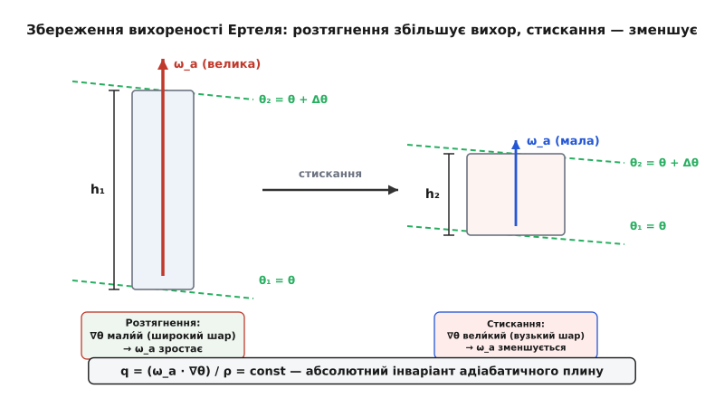
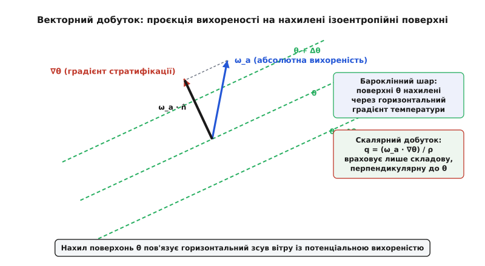
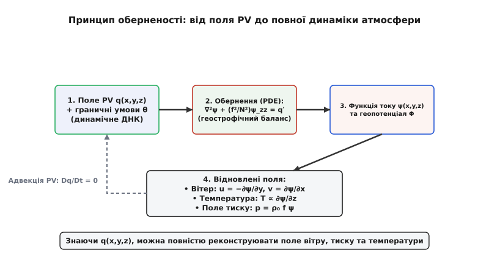
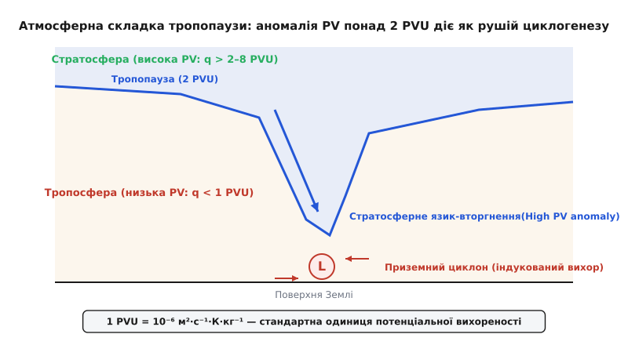

# Потенціальна вихореність Ертеля

<preknowlist>
- [Рівняння Нав'є-Стокса](topic:ph-mechanics/navier-stokes) — динаміка в'язкого стискуваного плину під дією масових та поверхневих сил.
- [Ефект Коріоліса](topic:ph-mechanics/coriolis-effect) — уявна сила у системі відліку, що обертається з кутовою швидкістю Ω.
- [Теореми Гельмгольца про вихори](topic:ph-mechanics/helmholtz-vortex-theorems) — збереження вихорових трубок у ідеальному баротропному плині.
- [Теорема Кельвіна про циркуляцію](topic:ph-mechanics/kelvin-circulation-theorem) — інваріантність циркуляції швидкості вздовж замкненого матеріального контуру.
- [Скалярний добуток](topic:math-algebra/dot-product) — проєкція одного вектора на напрямок іншого.
- [Векторний добуток](topic:math-algebra/cross-product) — вектор, ортогональний до двох вихідних векторів.
</preknowlist>

Західний повітряний потік помірних широт, переваливши через високий хребет Скелястих гір або Альп, зазнає вимушеного вертикального стискання над вершинами з наступним розтягненням у підвітряній зоні. Оскільки маса повітряного стовпчика між ізоентропійними поверхнями зберігається, його вертикальне стискання над хребтом змушує горизонтальний переріз розширюватися. У класичній гідродинаміці нестисливої рідини постійної густини таке розширення приводило б до негайного падіння відносної вихореності. Проте у реальній атмосфері повітря є стисливим, сильно стратифікованим за температурою, а поверхні однакового тиску перетинаються з поверхнями однакової густини під кутом, утворюючи бароклінні соленоїди, які неперервно генерують нові вихорові лінії.

У таких геофізичних плинах класичні теореми Гельмгольца та Кельвіна втрачають чинність: циркуляція Кельвіна перестає зберігатися, а вихорові трубки Гельмгольца розриваються і деформуються бароклінними моментами. Для опису великомасштабного руху атмосфери та океану необхідний фундаментальніший інваріант, який одночасно враховує тривимірне обертання планети, стисливість середовища та його термодинамічну стратифікацію. Таким єдиним інваріантом є потенціальна вихореність Ертеля.

## Фізична сутність та розклад формули Ертеля

Потенціальна вихореність Ертеля `q` визначається як скалярний добуток вектора абсолютної вихореності `ω_a` на просторовий градієнт консервативної скалярної характеристики плину `λ`, поділений на густину середовища `ρ`:

```
q = (ω_a · ∇λ) / ρ
```

Щоб повністю розкрити фізичну інтуїцію цієї величини, детально розберемо кожен із чотирьох її складників та їхню взаємодію у геофізичному плині.

### 1. Вектор абсолютної вихореності `ω_a`

Вектор абсолютної вихореності `ω_a = ω + 2·Ω` описує повне обертання рідкої частинки у тривимірному просторі. Він є сумою двох векторних величин:
- Відносної вихореності `ω = ∇ × u`, яка вимірює локальне мікрообертання плину відносно поверхні Землі (ротор тривимірного поля швидкостей `u = (u,v,w)`). У тривимірній декартовій системі координат відносна вихореність має три складові: `ω_x = ∂w/∂y - ∂v/∂z`, `ω_y = ∂u/∂z - ∂w/∂x` та `ω_z = ∂v/∂x - ∂u/∂y`. Горизонтальні компоненти `ω_x` та `ω_y` пов'язані з вертикальним зсувом вітру, а вертикальна компонента `ω_z` описує горизонтальне циклонічне чи антициклонічне закручування.
- Планетарної вихореності `2·Ω`, де `Ω` — вектор кутової швидкості обертання Землі навколо власної осі (`|Ω| ≈ 7.2921 × 10⁻⁵ рад/с`).

У естетиці натуральних координат лінії току `(s, n)`, вертикальна відносна вихореність `ζ = ω_z` розкладається на дві фізичні складові:

```
ζ = -∂V/∂n + V / R_s
```

де `-∂V/∂n` — зсувна вихореність (shear vorticity), що виникає через зміну модуля швидкості `V` у напрямку, перпендикулярному до лінії току `n`, а `V / R_s` — криволінійна вихореність (curvature vorticity), що виникає через викривлення лінії току з радіусом кривини `R_s`. У струминних течіях тропосфери обидві складові досягають величезних значень, формуючи вузькі смуги високої потенціальної вихореності.

У той час як відносна вихореність `ω` може дорівнювати нулю у локально спокійному повітрі, планетарна вихореність присутня завжди. На Северному полюсі вектор `2·Ω` спрямований строго вертикально вгору. На екваторі він паралельний поверхні Землі і спрямований на північ. На проміжних географічних широтах `φ` вертикальна проекція планетарної вихореності дорівнює параметру Коріоліса `f = 2·Ω·sin(φ)`.

### 2. Вектор стратифікації `∇λ`

Скалярне поле `λ` мусить бути матеріальним інваріантом плину, тобто зберігатися вздовж траєкторії рідкого елемента при адіабатичному русі без тертя:

```
Dλ/Dt = ∂λ/∂t + u · ∇λ = 0
```

У геофізичній гідродинаміці атмосфери як `λ` найчастіше використовують потенціальну температуру `θ`:

```
θ = T · (p₀ / p)^(R / c_p)
```

де `T` — абсолютна температура в Кельвінах, `p` — місцевий тиск, `p₀ = 1000 гПа` — стандартний reference-тиск, `R = 287.05 Дж/(кг·К)` — газова стала сухого повітря, а `c_p = 1004.67 Дж/(кг·К)` — ізобарна теплоємність. Потенціальна температура показує, яку температуру дістала б повітряна частинка, якби її адіабатично опустили або підняли до рівня тиску 1000 гПа.

Для океану роль `λ` виконує потенціальна густина `σ_θ` або ентропія морської води, що враховує солоність та температуру.

Вектор `∇θ = (∂θ/∂x, ∂θ/∂y, ∂θ/∂z)` спрямований ортогонально до поверхонь сталої потенціальної температури (ізоентропійних поверхонь). Його вертикальна компонента `∂θ/∂z` описує статичну стійкість атмосфери. Завдяки стандартній термодинамічній розшарованості атмосфери потенціальна температура зростає з висотою (`∂θ/∂z > 0`). Частота Брента-Вяйсяля `N² = (g/θ)·(∂θ/∂z)` кількісно визначає частоту вільних вертикальних коливань повітряного елемента: що більшим є значення `∂θ/∂z`, то стійкішою є атмосфера.

Модуль `|∇θ|` є обернено пропорційним товщині матеріального шару `Δz` між двома ізоентропійними поверхнями `θ` та `θ + Δθ`: що щільніше притиснуті поверхні `θ` одна до одної, то більшим є градієнт `|∇θ|`.

### 3. Скалярний добуток `ω_a · ∇λ`

Скалярний добуток `ω_a · ∇λ` виділяє лише ту складову вектора абсолютної вихореності, яка проізольована паралельно вектору `∇λ`, тобто перпендикулярно до поверхонь `λ = const`.

У компонентній формі:

```
ω_a · ∇θ = ω_ax · (∂θ/∂x) + ω_ay · (∂θ/∂y) + (ω_az + f) · (∂θ/∂z)
```

Це означає, що горизонтальні складові вихореності `ω_ax` та `ω_ay` (які пов'язані з вертикальним зсувом вітру `∂u/∂z` та `∂v/∂z`) дають внесок у потенціальну вихореність лише тоді, коли самі поверхні `θ` нахилені під кутом до горизонталі (`∂θ/∂x ≠ 0` або `∂θ/∂y ≠ 0`). У горизонтально-однорідній атмосфері працює лише вертикальна компонента `(ω_az + f) · (∂θ/∂z)`.

### 4. Ділення на густину `ρ` та одиниці вимірювання

Ділення на густину `ρ` компенсує зміну об'єму матеріального елемента під час стискання чи розширення. Завдяки цьому величина `q` вимірюється на одиницю маси рідини, а не на одиницю об'єму.

У системі SI потенціальна вихореність вимірюється в одиницях `м²·с⁻¹·К·кг⁻¹`. Оскільки числові значення у системі SI є дуже малими (порядку `10⁻⁶`), у метеорології використовують спеціальну одиницю — **PVU (Potential Vorticity Unit)**:

```
1 PVU = 10⁻⁶ м² · с⁻¹ · К · кг⁻¹
```

У тропосфері типові значення `q` становлять від `0.1` до `1.5 PVU`. У стратосфері за рахунок високої статичної стійкості `∂θ/∂z` значення `q` досягають від `2` до `10 PVU` і більше.

Історичний шлях від класичних теорем циркуляції до виведення формули Ертеля детально описано у [історичному екскурсі](topic:ph-mechanics/ertel-potential-vorticity/hist-ertel-pv.md).

## Механізми збереження: розтягнення, стискання та нахил вихорів

Згідно з теоремою Ертеля, для нев'язкого адіабатичного плину індивідуальна похідна `q` за часом дорівнює нулю:

```
Dq/Dt = ∂q/∂t + u · ∇q = 0
```

Це означає, що кожна рідка частинка під час свого руху в тривимірному просторі зберігає значення `q`, немов «динамічний паспорт» або «генетичний код».


*Збереження вихореності Ертеля: розтягнення повітряного стовпчика між ізоентропійними поверхнями викликає посилення вихору, а стискання — зменшення.*

Розглянемо двовимірний шар рідини, обмежений двома ізоентропійними поверхнями `θ₁` та `θ₂ = θ₁ + Δθ`. Відстань між цими поверхнями по вертикалі дорівнює `h`. Тоді модуль градієнта потенціальної температури оцінюється як:

```
|∇θ| ≈ Δθ / h
```

Підставляючи цю оцінку у формулу Ертеля для вертикально орієнтованої вихореності `ω_az = ζ + f` (де `ζ` — вертикальна відносна вихореність, `f = 2·Ω·sin(φ)` — параметр Коріоліса), маємо:

```
q ≈ [(ζ + f) / ρ] · (Δθ / h)
```

Оскільки різниця температур `Δθ` між матеріальними поверхнями є сталою, умова збереження `Dq/Dt = 0` при майже незмінній густині `ρ` приводить до співвідношення:

```
(ζ + f) / h = const
```

Цей результат розкриває два ключові фізичні механізми:

### 1. Вертикальне розтягнення (vortex stretching)

Якщо шар повітря розтягується по вертикалі (висота `h` зростає), то відстань між ізоентропійними поверхнями збільшується, і градієнт `|∇θ|` зменшується. Щоб добуток `q` залишився незмінним, абсолютна вихореність `ζ + f` змушена пропорційно зростати! Повітряний стовпчик починає інтенсивно закручуватися навколо власної осі.

Наочним аналогом є фігурист, який притискає руки до тулуба: зменшення моменту інерції (поперечного перерізу стовпчика) приводить до стрімкого прискорення обертання. В атмосфері цей механізм є головним двигуном зародження потужних циклонів, смерчів та торнадо.

### 2. Вертикальне стискання (vortex squashing)

Навпаки, коли повітряний шар здавлюється по вертикалі (наприклад, при опусканні у затримуючих шарах або при натіканні на гірський масив), висота `h` зменшується, а градієнт `|∇θ|` зростає. Для збереження `q` абсолютна вихореність `ζ + f` мусить зменшитися. Якщо початкова вихореність була близькою до нуля, вона стає від'ємною — виникає антициклонічне закручування плину.

### 3. Топографічний лі-циклогенез (Lee cyclogenesis)

Яскравим прикладом дії механізму розтягнення/стискання є орографічний циклогенез на підвітряному боці гірських хребтів (наприклад, Генуезький циклон на південь від Альп). Коли повітряний потік піднімається по навітряному схилу Альп, товщина шару `h` між ізоентропійними поверхнями зменшується. Це викликає стискання вихору і формування антициклонічного вигину течії.

Після перевалу через хребет повітряний потік стрімко опускається вгору у підвітряну долину (подвітриний спуск). Товщина шару `h` різко зростає (вертикальне розтягнення стовпчика). Для збереження `q = (ζ + f)/h` відносна вихореність `ζ` змушена стрімко зростати, що призводить до зародження інтенсивного підвітряного циклону.


*Векторний скалярний добуток у формулі Ертеля враховує проєкцію вихореності на нахилені поверхні потенціальної температури.*

### 4. Нахил вихореності у бароклінній зоні (vortex tilting)

У бароклінних зонах (наприклад, на атмосферних фронтах, де холодне і тепле повітря межують горизонтально) ізоентропійні поверхні нахилені до горизонту. У цьому випадку важливу роль відіграє процес нахилу вихору (vortex tilting). 

Горизонтальна вихореність, що виникає внаслідок сильного вертикального зсуву вітру `∂u/∂z`, спроєктовується на нахилений вектор `∇θ`. При переміщенні повітря вздовж нахиленої поверхні ця горизонтальна вихореність трансформується у вертикальне закручування без зміни загального значення `q`.

Суворе математичне виведення теореми з рівнянь Нав'є-Стокса наведено у [математичній вставці](topic:ph-mechanics/ertel-potential-vorticity/math-ertel-derivation.md).

## Зв'язок із 2D-потенціальною вихореністю Росбі та QGPV

Теорема Ертеля є найбільш загальним законам збереження вихореності у тривимірній гідродинаміці. Всі інші відомі формулювання потенціальної вихореності виникають із неї як окремі спрощені випадки.

Зокрема, розглянемо 2D-модель дрібної води (shallow water equations), де плин вважається однорідним за густиною (`ρ = const`), а шар рідини обмежений знизу дном `z = b(x,y)`, а зверху — вільною поверхнею `z = b(x,y) + H(x,y,t)`.

Якщо вибрати скаляр `λ` як вертикальну координу матеріального шару, то градієнт `∇λ` стає строго вертикальним числовим вектором з модулем `1/H`. Оскільки в дрібній воді горизонтальні компоненти вихореності малі порівняно з вертикальною, скалярний добуток спрощується:

```
ω_a · ∇λ ≈ (ζ + f) · (1 / H)
```

Підставляючи це у формулу Ертеля при сталій густині `ρ`, отримуємо потенціальну вихореність Росбі:

```
q_Rossby = (ζ + f) / H
```

Таким чином, інваріант Росбі 1939 року є точним точковим обмеженням загальної 3D-теореми Ертеля для двовимірного шару постійної густини.

### Квазигеострофічна потенціальна вихореність (QGPV) та хвилі Росбі

У синоптичній метеорології помірних широт найбільше поширення здобуло квазигеострофічне наближення. У цьому наближенні горизонтальний вітер замінюється геострофічним вітром `u_g = -(1/f₀)·∂Φ/∂y`, `v_g = (1/f₀)·∂Φ/∂x`, де `Φ` — геопотенціал.

Квазигеострофічна потенціальна вихореність (QGPV) `q_QG` виражається через геострофічну функцію току `ψ = Φ / f₀`:

```
q_QG = ∇²ψ + f + (∂/∂z)[ (f₀² / N²) · (∂ψ/∂z) ]
```

де `∇²ψ = ∂²ψ/∂x² + ∂²ψ/∂y² = ζ_g` — геострофічна відносна вихореність, `f = f₀ + β·y` — параметр Коріоліса на бета-площині, а `N²` — частота Брента-Вяйсяля.

Уважно глянувши на формулу QGPV, бачимо її структуру:
- `∇²ψ` — відносна горизонтальна вихореність плину;
- `f` — планетарна вихореність (з урахуванням бета-ефекту `β = df/dy`);
- `(∂/∂z)[ (f₀² / N²) · (∂ψ/∂z) ]` — вертикальне стискання/розтягнення шарметрів між термодинамічними поверхнями.

Для квазигеострофічної потенціальної вихореності виконується рівняння переносу геострофічним вітром:

```
∂q_QG/∂t + u_g · ∇q_QG = 0
```

Розглядаючи малі збурення `ψ = -U·y + ψ'` над рівномірним західним потоком `U`, лінеаризоване рівняння переносу QGPV дає класичне дисперсійне співвідношення для планетарних хвиль Росбі:

```
c = U - β / (k² + l² + f₀² / (N² · H²))
```

де `c` — фазова швидкість поширення хвилі, `k, l` — горизонтальні хвильові числа, а `H` — вертикальний масштаб атмосфери. З цього рівняння видно, що бета-ефект `β = df/dy` (градієнт планетарної вихореності) виступає як відновна сила, що змушує планетарні хвилі Росбі зміщуватися на захід відносно фонового потоку `U`.

## Принцип оберненості Кляйншмідта–Госкінса

Значення потенціальної вихореності Ертеля полягає не лише у тому, що вона зберігається вздовж руху. Вирішальною властивістю `q` є принцип оберненості (invertibility principle), сформульований Ернстом Кляйншмідтом у 1950-х роках і розвинений Браяном Госкінсом у 1980-х.


*Принцип оберненості Кляйншмідта–Госкінса: повне відновлення полів вітру, тиску та температури за просторовим розподілом PV.*

Суть принципу оберненості полягає в наступному: **якщо у певний момент часу відомий повний тривимірний розподіл потенціальної вихореності Ертеля `q(x,y,z)` у деякому об'ємі атмосфери, а також граничні умови для температури на поверхні Землі та тропопаузі, то за умови геострофічного та гідростатичного балансу можна однозначно розрахувати всі інші тривимірні поля плину — вектор вітру `(u,v,w)`, поле тиску `p`, поле геопотенціалу `Φ` та поле температури `T`.**

Математично принцип оберненості зводиться до розв'язання нелінійного дифрівняння в частинних похідних еліптичного типу. Підставляючи геострофічні співвідношення для вітру `u_g = -(1/f₀)·∂Φ/∂y`, `v_g = (1/f₀)·∂Φ/∂x` та гідростатичне рівняння для температури `∂Φ/∂z = (R/p)·T` у визначення `q`, отримуємо 3D еліптичне рівняння відносно геопотенціалу `Φ(x,y,z)`:

```
L(Φ) = q
```

Оскільки еліптичні рівняння мають єдиний стійкий розв'язок при заданих граничних умовах, розподіл `q` виступає як «динамічне ДНК» атмосфери. Знаючи, як аномалії `q` переносяться вітром (`Dq/Dt = 0`), можна спрогнозувати еволюцію всього атмосферного стану на майбутні моменти часу.

### Динаміка ізольованої аномалії PV

Принцип оберненості дозволяє легко зрозуміти діяльність ізольованої аномалії потенціальної вихореності:

- **Додатна аномалія PV (`q' > 0`)**. Якщо у верхній тропосфері утворюється локальна пляма підвищеної потенціальної вихореності (наприклад, внаслідок стратосферного вторгнення), еліптична інверсія показує, що ця аномалія індукує навколо себе циклонічну циркуляцію (против годинникової стрілки) у широкому радіусі. Нижче аномалії утворюється зниження геопотенціалу (улоговина тиску), а вище — підвищення статичної стійкості.
- **Від'ємна аномалія PV (`q' < 0`)**. Навпаки, пляма зниженої потенціальної вихореності індукує антициклонічну циркуляцію (за годинниковою стрілкою) та випучування поверхонь тиску вгору (гребінь високого тиску).

Чисельний алгоритм розрахунку `q` на дискретній 3D сітці наведено у [проєктній вставці](topic:ph-mechanics/ertel-potential-vorticity/proj-ertel-pv-calc.md). 
Опис програмного C/C++ API для діагностичних моделей міститься у [довідникові API](topic:ph-mechanics/ertel-potential-vorticity/api-pv-diagnostics.md).

## Неконсервативні процеси: дисипація, нагрів та теорема непроникності

У реальній атмосфері та океані умови ідеального адіабатичного плину без тертя не виконуються строго. Наукова та практична цінність теореми Ертеля полягає також у тому, що вона дозволяє точно враховувати джерела та стоки вихореності.

Якщо присутнє тертя (в'язкість `F`) або джерела неадіабатичного нагріву `dQ/dt = c_p · Dθ/Dt = c_p · θ̇`, то матеріальна похідна `q` стає відмінною від нуля:

```
Dq/Dt = (1/ρ) · [ (∇ × F) · ∇θ + ω_a · ∇θ̇ ]
```

З цього рівняння видно два основні механізми зміни потенціальної вихореності:

### 1. Неадіабатичний нагрів (`θ̇ ≠ 0`)

Якщо у повітряному шарі відбувається виділення прихованого тепла конденсації (наприклад, при формуванні потужних купчасто-дощових хмар у циклоні або у стінці очі урагану), то `θ̇ > 0`. 

Якщо швидкість нагріву зростає з висотою (`∂θ̇/∂z > 0`), вектор `∇θ̇` спрямований вгору паралельно `ω_az`. Це приводить до генерації позитивної потенціальної вихореності під зоною максимального нагріву. Впевнене зростання `q` під областю конденсації є головною причиною вибухового посилення тропічних циклонів (ураганів та тайфунів) та мезомасштабних конвективних систем. Навпаки, над зоною максимального нагріву (`∂θ̇/∂z < 0`) відбувається знищення `q` та формування антициклонічного витоку на рівні тропопаузи.

### 2. Тертєвий сток та Екманівський накачування (`F ≠ 0`)

У приземному планетарному прикордонному шарі в'язке тертя об поверхню Землі знищує вихореність, створюючи негативний потік `q`.

Тертєвий зсув вітру у прикордонному шарі створює так зване Екманівське накачування (Ekman pumping). У зоні приземного циклону тертя змушує вітер відхилятися до центра низького тиску, підкачуючи повітря всередину. За масовою неперервністю це викликає вимушений вертикальний підйом повітря на верхній межі прикордонного шару зі швидкістю:

```
w_e = (1 / (ρ₀ · f₀)) · (∇ × τ)_z
```

де `τ` — вектор напруження тертя на поверхні Землі. Цей вертикальний підйом стискає ізоентропійні шари вище прикордонного шару, приводячи до поступового згасання (Spin-down) циклону.

### Теорема непроникності Гайнса–Макайнтайра

У 1987 році Пітер Гайнс (Peter H. Haynes) та Майкл Макайнтайр довели фундаментальну теорему про «непроникність» (Impermeability Theorem) поверхонь сталої потенціальної температури `θ` для потенціальної вихореності.

Вони показали, що маса-зважена потенціальна вихореність `ρ·q = ω_a · ∇θ` може бути точно записана у формі дивергенції деякого вектора `J_q`:

```
∂(ρ·q)/∂t + ∇ · J_q = 0
```

де потік вихореності `J_q = ρ·q·u - ω_a·θ̇ - F × ∇θ`.

Цей результат означає, що **загальна кількість потенціальної вихореності між двома ізоентропійними поверхнями `θ₁` та `θ₂` не може змінитися ні за рахунок адіабатичних рухів, ні за рахунок внутрішніх неадіабатичних джерел чи тертя!** Потенціальна вихореність не може перетинати ізоентропійні поверхні. Вона може лише перерозподілятися вздовж цих поверхонь або входити/виходити через бокові межі чи поверхню Землі.

## Застосування у метеорології та океанографії

Потенціальна вихореність Ертеля є основним аналітичним та діагностичним інструментом у сучасній фізиці атмосфери та океану.

> 🔧 **Навіщо це.**
> Завдяки збереженню `q` та принципу оберненості, синоптики та фізичні океанографи можуть відстежувати глобальні повітряні та водні маси на тисячі кілометрів, прогнозувати зарождення руйнівних циклонів за кілька діб до їх появи на поверхні, а також моделювати кліматичні зміни.


*Атмосферна складка тропопаузи: занурення стратосферного повітря з високою PV в тропосферу породжує приземний циклон.*

Головні сфери застосування охоплюють:

1. **Аналіз складка тропопаузи (tropopause folding) та вибуховий циклогенез**. Стратосферне повітря характеризується дуже високими значеннями статичної стійкості `∇θ`, тому його потенціальна вихореність становить `q > 2–8 PVU` (де `1 PVU = 10⁻⁶ м²·с⁻¹·К·кг⁻¹`). У тропосфері значення `q` зазвичай не перевищує `0.5–1 PVU`. Межа `q = 2 PVU` приймається за динамічну тропопаузу. Коли при потужних струминних течіях виникає улоговина високого тиску, язик стратосферного повітря з високою `PV` проникає глибоко в тропосферу (складка тропопаузи). Згідно з принципом оберненості, ця верхня аномалія індукує циклонічну циркуляцію під собою на поверхні Землі, ініціюючи вибуховий циклогенез (так звані «метеорологічні бомби»).

2. **Блокування атмосферної циркуляції (blocking systems)**. Великомасштабні стаціонарні антициклони, що тижнями висять над континентами (викликаючи літні спеки або зимові люті морози), формуються внаслідок відсікання мас з низьким значенням `PV` з субтропічних широт у помірні.

3. **Океанічна термоклинна циркуляція та вентильований термоклин**. В океанографії потенціальна вихореність Ертеля виступає як консервативна мітка для глибоких водних мас (наприклад, Північноатлантичної глибинної води NADW). Згідно з теорією вентильованого термоклину Люйтена-Педлоскі-Стоммела (Luyten-Pedlosky-Stommel), вітрове зганяння у субтропічних круговоротах занурює поверхневі води всередину океану (субдукція), де вони рухаються уздовж ізопікнічних поверхонь, зберігаючи `q = (f / ρ) · (∂σ_θ/∂z)`. Також діагностика `PV` є ключовою при дослідженні вихорів Гольфстріму та підповерхневих лінз середземноморської води (Meddies).
