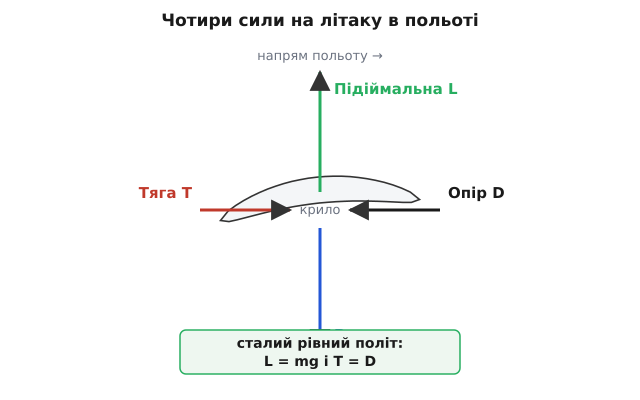
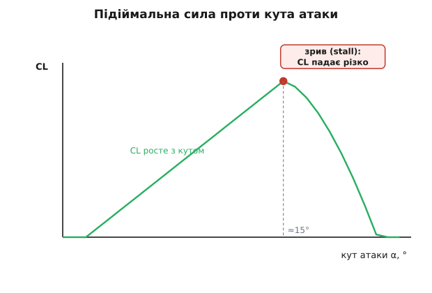

# Літак

Літак важчий за повітря, і все ж тримається в небі годинами. Ніщо його не підвішує — немає ані нитки, ані повітряної кульки під фюзеляжем. Отже, щось мусить безперервно штовхати його вгору рівно з тією силою, з якою вниз тягне вага. Це «щось» — крило, а точніше те, що крило робить з повітрям, крізь яке мчить. Розберімо, звідки береться сила, здатна підняти десятки тонн металу, і чому вона зникає, коли пілот тягне ніс надто круто вгору.

## Літак не падає, бо весь час штовхає повітря вниз

Почнімо з найпростішого й найчеснішого пояснення — з третього закону Ньютона. Якщо тіло масою *m* висить у повітрі й не падає, на нього має діяти сила вгору, що врівноважує вагу *mg*. Повітря саме по собі нікого не тримає: спокійне повітря тисне на тіло з усіх боків однаково. Щоб отримати силу вгору, треба порушити цю рівновагу — і крило робить це, женучи повітря вниз.

Уяви руку, виставлену з вікна авто на швидкості. Нахили долоню переднім краєм угору — і повітря, вдаряючись у нахилену поверхню, відхиляється донизу, а руку відкидає вгору й назад. Ти щойно зробив крило. Долоня захопила потік повітря і кинула його вниз; за третім законом повітря штовхнуло долоню вгору. Крило літака робить те саме, тільки плавно й без ляпання: воно бере величезну масу повітря щосекунди і надає їй невеликої швидкості вниз.

Сила тут — це швидкість зміни імпульсу. Якщо крило щосекунди відхиляє масу повітря *ṁ* (кілограмів на секунду), надаючи їй вертикальної швидкості *w* (спутний потік, англ. *downwash*), то воно передає повітрю імпульс *ṁ·w* щосекунди. Стільки ж імпульсу вгору повітря віддає крилу:

```
L = ṁ · w        (сила = зміна імпульсу за секунду)
```

Це не метафора, а буквальна бухгалтерія імпульсу. Позаду літака справді лишається стовп повітря, що осідає донизу — його видно, коли літак пролітає крізь тонку хмару й прорізає в ній борозну. Саме тому важкий літак у польоті непомітно, але постійно «продавлює» атмосферу під собою.

> 🔧 **Навіщо це.** Погляд через імпульс одразу пояснює, чому літак мусить летіти швидко й чому велике крило економічніше. Щоб утримати ту саму вагу, можна або взяти багато повітря й відхилити його трохи (велике крило, помірна швидкість), або взяти мало повітря й відхилити сильно (мале крило, шалена швидкість або великий кут). Друге коштує куди більше пального — тому вантажні літаки мають широкі довгі крила.

## Той самий факт іншою мовою: різниця тисків

Є другий спосіб описати ту саму силу — через тиск. Обидва описи правильні; це не суперники, а дві мови для одного явища.

Коли крило нахилене й вигнуте, повітря над його верхньою поверхнею розганяється, а під нижньою — пригальмовується. А там, де потік швидший, тиск нижчий — це зв'язок [Бернуллі: у стрічці потоку сума статичного й динамічного тиску стала, тож більша швидкість означає менший статичний тиск](root:ph-mechanics/dynamic-pressure). Отже, зверху крило підпирає знижений тиск, а знизу — підвищений. Різниця тисків, помножена на площу крила, і дає силу вгору.

Тут криється найпоширеніша хиба всіх шкільних підручників — «теорія однакового часу». Нібито верхня поверхня довша, тож повітря над нею мусить бігти швидше, щоб «встигнути» до задньої кромки одночасно з повітрям знизу. Це **міф**: [ніякий закон не вимагає, щоб частинки зустрічалися позаду одночасно — виміри показують, що повітря зверху долітає до кромки навіть раніше, а тонкі вигнуті крила з однаковою довжиною поверхонь чудово несуть](root:ph-mechanics/fixed-wing-lift/hist-lift-theory.md). Повітря зверху справді швидше — але не тому, що йому «треба встигнути».


*Різниця тисків і відхилення повітря вниз — не дві різні причини, а один процес, описаний з двох боків.*

Чому ж описи еквівалентні? Бо швидший потік угорі й повільніший унизу — це якраз і є те викривлення ліній струму, що зрештою сходить із крила похило вниз. Тиск і імпульс тут нерозривні: щоб повітря розігналося над крилом, його мусив штовхнути перепад тиску; а сумарний перепад тиску на крилі дорівнює силі, з якою крило відкинуло повітряний потік. Питати «то насправді тиск чи Ньютон?» — все одно що питати, платіж це чи списання з рахунку: одна операція, два записи.

## Що крило робить з потоком: обтічний край і циркуляція

Лишається тонше питання: **чому** повітря взагалі розганяється над крилом, а не обтікає його симетрично, як воду обтікає нерухомий стовп? Тут вступає в’язкість повітря — його внутрішнє тертя.

Задня кромка крила гостра. Якби потік намагався обігнути її знизу вгору й завернути назад, він мусив би на самому вістрі розвернутися майже на місці — з нескінченною швидкістю, чого в’язке повітря не терпить. Тому потік сходить із гострої кромки плавно, обома поверхнями в один бік. Ця умова гладкого сходу з задньої кромки називається [умовою Кутти: саме в’язкість на гострій кромці добирає єдиний фізично можливий режим обтікання й задає величину циркуляції навколо крила](root:ph-mechanics/circulation-lift-theorem). Щоб її задовольнити, навколо профілю встановлюється циркуляція — стійке «підкручування» потоку: трохи швидше зверху, трохи повільніше знизу.

Сила з цією циркуляцією пов’язана напряму. Для крила нескінченного розмаху підіймальна сила на одиницю довжини дорівнює добутку густини, швидкості й циркуляції — теоремі, [яку на зорі авіації незалежно вивели англієць Ланчестер, німець Кутта й росіянин Жуковський](root:ph-mechanics/circulation-lift-theorem):

```
L' = ρ · v · Γ        (підіймальна сила на метр розмаху)
```

де ρ — густина повітря, *v* — швидкість польоту, Γ — циркуляція. Більша циркуляція — більша сила; циркуляція ж росте з вигином крила й кутом атаки. Ось чому вигнутий (камберований) профіль несе більше, ніж плоска дошка: він від початку створює сильнішу циркуляцію.

## Формула, з якою рахують крило

Для практики зручніша інженерна форма. Уся підіймальна сила крила площею *S* виходить такою:

```
L = ½ · ρ · v² · S · CL
```

Розберімо кожен доданок причинно. Множник ½·ρ·v² — це [динамічний тиск: кінетична енергія одиниці об’єму набігаючого потоку, міра «напору» повітря](root:ph-mechanics/dynamic-pressure). Він росте з **квадратом** швидкості — подвоїв швидкість, і напір учетверо більший; саме тому розгін такий важливий на зльоті. Площа *S* очевидна: ширше крило захоплює більше повітря. А от CL — коефіцієнт підіймальної сили — вбирає в себе всю геометрію: форму профілю, вигин і, головне, кут атаки (кут між крилом і набігаючим потоком).

Густина ρ теж не стала: [вона падає з висотою за барометричним законом атмосфери](root:ph-thermodynamics/standard-atmosphere), тож на висоті 10 км повітря втричі рідше, і крилу доводиться летіти швидше, щоб зібрати ту саму силу. Це одна з причин, чому пасажирські літаки крейсують так високо й так швидко.

**Приклад: яка швидкість утримає легкий безпілотник?** Апарат масою 2 кг, площа крила 0.30 м², приймемо CL = 0.6 у крейсері, густина біля землі ρ = 1.225 кг/м³. Знайдімо мінімальну швидкість, за якої L = mg.

:::tabs
```cpp
#include <math.h>

// Швидкість, за якої підіймальна сила зрівноважує вагу.
// L = 0.5*rho*v^2*S*CL = m*g   ->   v = sqrt( 2*m*g / (rho*S*CL) )
float level_flight_speed(float m, float S, float CL, float rho) {
    const float g = 9.81f;
    return sqrtf(2.0f * m * g / (rho * S * CL));
}

// виклик: level_flight_speed(2.0f, 0.30f, 0.6f, 1.225f);
```
```py
from math import sqrt

# Швидкість, за якої підіймальна сила зрівноважує вагу.
# L = 0.5*rho*v^2*S*CL = m*g   ->   v = sqrt( 2*m*g / (rho*S*CL) )
def level_flight_speed(m, S, CL, rho):
    g = 9.81
    return sqrt(2.0 * m * g / (rho * S * CL))

# виклик: level_flight_speed(2.0, 0.30, 0.6, 1.225)
```
:::

Підставмо крок за кроком:

```
чисельник = 2 · 2.0 · 9.81 = 39.24 Н
знаменник = 1.225 · 0.30 · 0.6 = 0.2205
v²        = 39.24 / 0.2205 ≈ 178.0 м²/с²
v         = √178.0 ≈ 13.3 м/с   (≈ 48 км/год)
```

Отже, поки апарат летить швидше за ~13 м/с, крила його несуть. Пригальмує нижче — і підіймальної сили забракне: доведеться або збільшити кут атаки (підняти CL), або почати знижуватися. Це і є фізичний зміст «швидкості зриву».

## Плата за підіймальну силу: опір

Задарма нічого не буває. Відхиляючи повітря вниз, крило неминуче витрачає частину зусилля «вбік від польоту» — виникає опір (англ. *drag*), сила проти руху, яку тяга двигуна мусить долати. У сталому рівному польоті все зводиться до двох рівнянь балансу:

```
L = mg        (підіймальна сила тримає вагу)
T = D         (тяга долає опір)
```


*Чотири сили в рівновазі: доки вони збалансовані, літак летить рівно й з незмінною швидкістю. Тяга й опір — окрема історія; тут вони лише тримають швидкість сталою.*

Опір крила має дві природи. Одна — тертя й форма (повітря треться об обшивку й тисне на «товщину»). Друга, хитріша, — **індукований опір**: сама лише плата за створення підіймальної сили. Повітря під крилом (високий тиск) прагне перетекти на верх (низький тиск), огинаючи кінці крил; там воно закручується у вихори кінців крила. Ці вихори забирають енергію — це ніби «слід» від відхиленого вниз повітря. Що довше й вужче крило, то менша ця втрата — тому в планерів крила такі витягнуті. Скільки палива літак витратить, щоб долати цей опір на всю дальність, точно рахує [рівняння Бреге, яке пов’язує дальність і тривалість польоту з аеродинамічною якістю та витратою пального](root:ph-mechanics/breguet-range-endurance).

> 🔧 **Навіщо це.** Відношення підіймальної сили до опору, L/D, — головне число ефективності крила («аеродинамічна якість»). У сучасного планера воно сягає 50–60: на кожен метр зниження він пролітає 50–60 метрів уперед. Саме заради більшого L/D інженери роблять крила гладкими, довгими й тонкими, а на кінцях ставлять вертикальні законцівки — щоб приборкати вихори й зменшити індукований опір.

## Зрив: коли крило раптом «відпускає» повітря

Формула L = ½ρv²S·CL підказує спокусливу думку: якщо не вистачає підіймальної сили, просто задери ніс — збільш кут атаки, і CL зросте. До певної межі так і є: CL росте з кутом атаки майже лінійно. Але лише до межі.

За кутом атаки приблизно 15° потік уже не встигає плавно обтікати верх крила — він зривається, відшаровується від поверхні, і за крилом замість гладкого струменя вирує безладна турбулентна зона. Підіймальна сила не просто перестає рости — вона різко падає. Це **зрив** (англ. *stall*). Парадоксально, але зрив настає не від малої швидкості як такої, а від завеликого кута атаки; він може статися й на великій швидкості, якщо різко смикнути штурвал на себе.


*До критичного кута крило слухняне — CL росте з кутом; за ним потік відшаровується, і підіймальна сила обвалюється. Максимум CL для звичайних профілів — близько 1.5.*

Максимальний CL для звичайного профілю — десь 1.4–1.6; це стеля, вище якої крило не піде, хоч як задирай ніс. Тому в конструкції передбачають механізацію крила — закрилки, що на зльоті й посадці збільшують і вигин, і площу, піднімаючи максимальний CL і дозволяючи летіти повільніше, не зриваючись. Розуміння межі зриву — це прямо про безпеку: більшість катастроф на малих висотах — це втрата керованості саме через зрив на крутому вираженому маневрі.

> 🔧 **Навіщо це.** У прошивці автопілота захист від зриву — критична функція. Контролер стежить за кутом атаки (з давача) або за швидкістю відносно повітря й не дає системі керування вивести крило за критичний кут, навіть якщо оператор командує крутіший набір висоти. Порушиш цю межу — і апарат не «полетить крутіше вгору», а провалиться.

## Що з усього цього винести

Підіймальна сила — не магія обтічної форми, а простий обмін імпульсом: крило женеться крізь повітря, відхиляє його вниз, і повітря штовхає крило вгору. Той самий процес можна описати через різницю тисків — швидший потік і нижчий тиск угорі, повільніший і вищий тиск унизу; описи еквівалентні, бо перепад тиску і є те, що розганяє й відхиляє потік. Сила пропорційна густині повітря, квадрату швидкості, площі крила й коефіцієнту CL, що вбирає геометрію та кут атаки. Рости кутом атаки можна лише до критичної межі — далі потік зривається, і підіймальна сила обвалюється. А відхиляти повітря вниз завжди означає платити опором, який тяга мусить безперервно долати. Ось чому літак летить: не тому, що він легкий, а тому, що щосекунди чесно відкидає вниз досить повітря, щоб те відкинуло його вгору.
