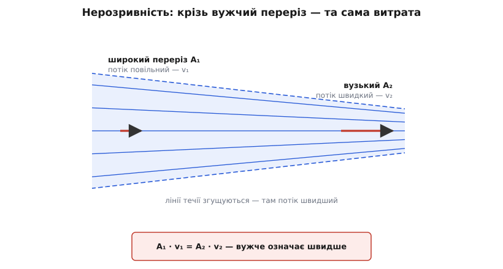
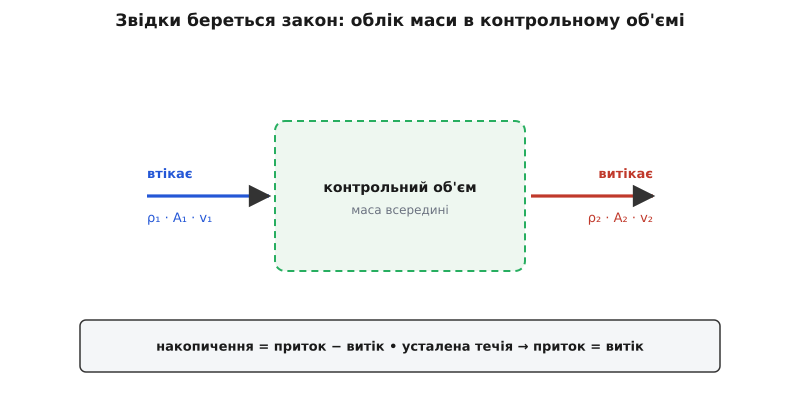
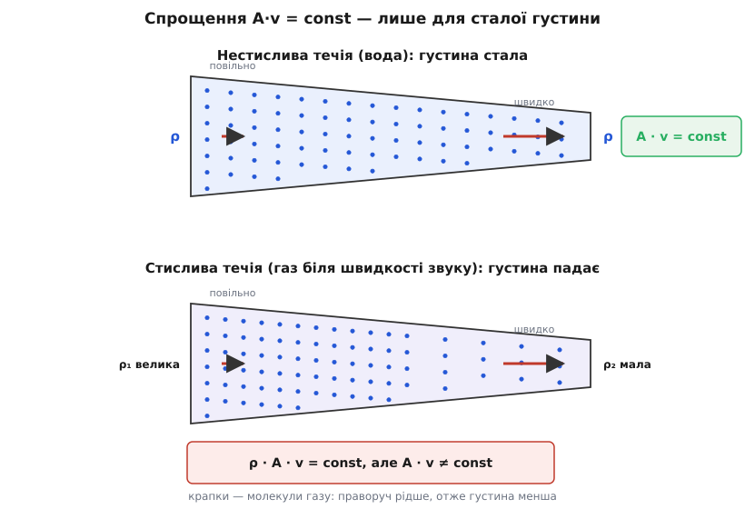

# Нерозривність течії

<preknowlist>
- [Густина](topic:ph-mechanics/density) — маса одиниці об'єму речовини (ρ); скільки речовини вміщено в кубометрі.
- [Швидкість](topic:ph-mechanics/velocity) — як швидко й куди рухається частинка рідини (v).
- [Маса](topic:ph-mechanics/mass) — міра кількості речовини; ключове тут те, що вона не зникає й не береться нізвідки.
</preknowlist>

Затисни пальцем кінець садового шланга — і струмінь, що ліниво лився під ноги, раптом б'є через увесь двір. Води з крана йде не більше, ніж мить тому; ти лише зменшив отвір. А вона помчала швидше. Чому звуження розганяє потік — і рівно наскільки — каже один короткий закон, що стоїть на єдиній незламній речі: рідина нікуди не дівається.

## Що втекло крізь один переріз, те й притекло крізь інший

Уяви шматок труби, крізь яку тече вода рівно, без ривків, — **усталена течія** (нічого в ній не змінюється з часом). Придивись до всієї рідини всередині цього шматка. Вона не може ні накопичуватися (тоді щось мінялося б із часом, а течія стала), ні зникати (речовина не щезає безслідно). Отже, скільки маси за секунду вливається крізь лівий переріз, стільки ж витікає крізь правий. Оце і вся ідея; лишається її порахувати.

Скільки маси проходить крізь переріз площею *A* за секунду? За малий час Δ*t* рідина, що перетинає переріз, встигає просунутися вперед на *v*·Δ*t* — тобто крізь переріз проштовхується стовпчик завдовжки *v*·Δ*t* і завтовшки на весь переріз *A*. Його об'єм — *A*·*v*·Δ*t*, а маса — [густина ρ](topic:ph-mechanics/density), помножена на об'єм:

```
маса за час Δt = ρ · A · v · Δt
```

Поділи на Δ*t* — дістанеш масу за секунду, **масову витрату**:

```
ṁ = ρ · A · v        (масова витрата, кг/с)
```

А що ця витрата однакова на вході й на виході, дає закон **нерозривності** (лат. *continuus* — суцільний, неперервний):

```
ρ₁ · A₁ · v₁ = ρ₂ · A₂ · v₂
```

Це рівність не про якусь особливу рідину й не про якийсь особливий пристрій — це просто [закон збереження маси](topic:ph-mechanics/mass), записаний для течії. Хай перед нами вода, повітря, мед чи розжарений газ — усі троє множників можуть мінятися вздовж труби, але їхній добуток не зрушується.

## Нестислива рідина: A·v = const

Вода майже не стискається: хоч як на неї тисни, густина ρ практично не міняється. Те саме справджується для будь-якої краплинної рідини й навіть для повітря, поки воно рухається помітно повільніше за звук. Якщо ρ на вході й на виході однакова, вона просто скорочується з обох боків рівняння — і лишається чиста геометрія:

```
A₁ · v₁ = A₂ · v₂        (об'ємна витрата Q = const)
```

Добуток *A*·*v* — це об'єм рідини, що проходить крізь переріз за секунду, **об'ємна витрата** *Q* (кубометри на секунду). Він сталий уздовж усієї труби. І звідси випливає головне, задля чого ми затискали шланг: **швидкість обернено пропорційна площі перерізу**. Звузив переріз удвічі — потік удвічі прискорився. А для круглої труби залежність від діаметра ще різкіша, бо площа круга росте як квадрат діаметра.

**Приклад: вода у звуженні труби.** Труба діаметром *d₁* = 20 мм несе воду зі швидкістю *v₁* = 1 м/с. Далі вона звужується до *d₂* = 10 мм. Яка швидкість у вузькому місці?

Площа круглого перерізу — π·*d²*/4, тож відношення площ — це відношення квадратів діаметрів:

```
A₁ / A₂ = (d₁ / d₂)² = (20 / 10)² = 4
v₂      = v₁ · A₁/A₂  = 1 · 4      = 4 м/с
```

Діаметр упав удвічі — площа вчетверо — швидкість підскочила вчетверо. Ось чому тонкий носик шланга чи затиснутий палець дають таку разючу різницю: скорочення отвору б'є по швидкості квадратом.

Цей закон — один із найстаріших у гідравліці. [Ще Леонардо да Вінчі описав його словами близько 1500 року, спостерігаючи річки, а точну рівність «площа на швидкість — стала» дав 1628 року Бенедетто Кастеллі, учень Ґалілея; сучасну ж диференціальну форму вивів Ойлер](topic:ph-mechanics/flow-continuity/hist-continuity-flow.md).


*Крізь широкий і вузький перерізи струминки за секунду проходить однаковий об'єм. Тому там, де переріз тісніший, потік мчить швидше — обернено до площі.*

> 🔧 **Навіщо це.** Коли інженер проєктує вентиляційний канал, водогін чи паливну магістраль, він насамперед рахує саме витрату. Задано, скільки повітря на секунду має входити в кімнату; звідси й переріз каналу: завузько — потік розжене до свисту й протягів, зашироко — метал і місце змарновано. Формула *A*·*v* = const перекладає «скільки треба прогнати за секунду» прямо на «який діаметр ставити».

## Лінії течії: труба з невидимими стінками

Ту саму думку зручно побачити взагалі без стінок труби. Намалюймо лінії, дотичні в кожній точці до швидкості потоку, — **лінії течії**. Рідина тече вздовж них і ніколи їх не перетинає (перетнути означало б мати швидкість упоперек власної швидкості — безглуздя). Тому пучок таких ліній утворює наче трубу з невидимими стінками — **струминку**, і крізь неї весь час іде та сама витрата, хоч жодних стінок там немає. Де струминка стискається, лінії течії згущуються — і там потік швидший.

Через це на карті обтікання крила чи на метеокарті вітру густо збиті лінії одразу видають, де рух найшвидший: нерозривність, намальована для ока. Там, де лінії розходяться, потік млявий; там, де тісняться, — стрімкий.

## Звідки береться закон: бухгалтерія маси

Досі ми брали трубу з двома перерізами. Але той самий облік маси працює для будь-якого клаптя простору. Обведи подумки маленьку коробочку десь усередині потоку — **контрольний об'єм**. Маса всередині неї може змінитися лише одним способом: рівно настільки, наскільки більше речовини витекло крізь стінки, ніж притекло.

```
швидкість накопичення маси = (притік) − (витік)
```

У сталій течії ліва частина — нуль, і ми повертаємось до «вхід дорівнює виходу». Але такий запис годиться вже й для нестійкої течії, і для газу, що стискається. Стягни коробочку до точки — і цей словесний баланс стає **рівнянням нерозривності**:

```
∂ρ/∂t + ∇·(ρv) = 0        (рівняння нерозривності)
```

Не лякайся значків. ∂ρ/∂*t* — як швидко росте густина в даній точці. ∇·(ρ*v*) — **дивергенція** (лат. *divergere* — розходитися) потоку маси: наскільки більше маси витікає з крихітного об'ємчика, ніж утікає в нього, на одиницю об'єму. Рівняння каже єдине: якщо з точки витікає більше, ніж притікає, густина там мусить падати — рівно з такою швидкістю. Це той самий «що втекло, те й притекло», тільки без запасу: миттєвий і точний. [Повне виведення цього рівняння з контрольного об'єму, з розбором дивергенції й нестисливого випадку ∇·v = 0, — окремо](topic:ph-mechanics/flow-continuity/math-continuity-equation.md).


*Уся суть — проста бухгалтерія: накопичення дорівнює тому, що ввійшло, мінус те, що вийшло. Коли течія усталена, вхід і вихід зрівнюються.*

Ця форма — не примха гідродинаміки. Достоту так само бухгалтериться будь-яка збережувана величина. Електричний заряд підкоряється тому самому рівнянню — [неперервність струму: ∂ρ/∂t + ∇·J = 0, тільки замість маси тече заряд, а замість потоку рідини — густина струму](topic:ph-electromagnetism/current-continuity). Форма одна, бо принцип один: величина, яку не можна ні створити, ні знищити, здатна лише перетікати з місця на місце.

## Коли густина міняється: стислива течія

Поверни густині право змінюватися — і картина ускладнюється. Для газу, розігнаного до навколозвукових швидкостей, ρ на вході й на виході вже помітно різна, і зручне *A*·*v* = const ламається. А от повна форма ρ·*A*·*v* = const стоїть непорушно, бо вона і є закон збереження маси, а маса зберігається завжди.

**Приклад: масова витрата не бреше.** У сопло турбіни входить повітря: площа *A₁* = 0.10 м², швидкість *v₁* = 100 м/с, густина *ρ₁* = 1.2 кг/м³. Масова витрата:

```
ṁ = ρ₁ · A₁ · v₁ = 1.2 · 0.10 · 100 = 12 кг/с
```

Далі газ розганяється й розріджується; хай у вужчому перерізі *ρ₂* = 0.6 кг/м³, *v₂* = 300 м/с. Тоді площа мусить бути такою, щоб ṁ лишилася тими самими 12 кг/с:

```
A₂ = ṁ / (ρ₂ · v₂) = 12 / (0.6 · 300) = 0.067 м²
```

Якби ми наївно вжили *A*·*v* = const, дістали б інше, хибне число, бо густина впала вдвічі. Саме тому сопла ракет і турбін проєктують за повним ρ·*A*·*v*: у стисливому газі площа, швидкість і густина торгуються всі втрьох, а незмінна лише їхня спільна масова витрата.

Груба, але чесна аналогія — потік машин на шосе. За годину повз кожен стовп проїжджає та сама кількість авто (усталений рух). Там, де смуги звужуються, машини або прискорюються, або збиваються щільніше — точнісінько як газ, що на звуженні то жене швидше, то густішає. Вода — це «нестислива» дорога, де щільність фіксована, тож лишається один вихід: гнати швидше. Аналогія кульгає там, де водії гальмують із власної волі, а молекули — ні; але баланс «скільки в'їхало, стільки й виїхало» той самий.


*Обидві течії зберігають масову витрату ρ·A·v. Але спрощення A·v = const дозволене лише вгорі, де густина не міняється; для газу біля швидкості звуку воно вже неправильне.*

## Чому цей закон надійніший за сусідів

Варто відзначити, наскільки нерозривність міцніша за багатьох своїх родичів. [Рівняння Бернуллі](topic:ph-mechanics/dynamic-pressure), що зв'язує швидкість і тиск, вимагає течії без тертя: додай [в'язкість — внутрішнє тертя рідини](topic:ph-mechanics/viscosity) чи розвинену [турбулентність](topic:ph-mechanics/reynolds-number), і воно починає брехати. Нерозривності ж байдуже. Вона не про енергію, а про масу, тож справджується хоч у меду, хоч у бурхливому турбулентному сліді, хоч у тонкому примежовому шарі біля стінки — усюди, де речовина просто зберігається.

Саме тому ці два закони так добре працюють у парі. Нерозривність каже, **де** потік швидший (у звуженні), а Бернуллі перекладає це на тиск (там він нижчий). Разом вони пояснюють і витратомір Вентурі, і підіймальну силу крила, і те, чому папір злипається, коли між аркушами дмухнути.

> 🔧 **Навіщо це.** У точці, де труба розгалужується, нерозривність стає простим **правилом вузла**: сума витрат, що входять, дорівнює сумі тих, що виходять. Це буквально той самий закон, що й перше правило Кірхгофа для струмів у колі, — і на ньому тримається розрахунок будь-якої розгалуженої мережі: водогону, вентиляції, паливної та охолоджувальної систем. [Робочий код, що балансує витрати у вузлах мережі труб і розмірює канали, — окремо](topic:ph-mechanics/flow-continuity/proj-flow-network.md).

## Де просту форму вживати не можна

Одне застереження, бо саме на ньому ловляться помилки. Проста рівність «вхід дорівнює виходу» тримається лише там, де всередині вибраного об'єму немає ні джерела, ні стоку самої рідини. Пробита труба, врізана помпа, конденсація пари на холодних стінках, бульбашки газу, що виходять із розчину, — усе це додає або віднімає речовину, і баланс тоді треба доповнити цим доданком. Сам закон збереження маси при цьому не порушується анітрохи — просто ми недоврахували частину маси, що входить у гру. І друга умова: алгебраїчне ρ·*A*·*v* = const годиться тільки для усталеної течії; якщо потік різко міняється в часі (закрили кран, ударна хвиля в трубі), працює вже лише повне рівняння з доданком ∂ρ/∂*t*.

## Що з усього цього винести

Нерозривність течії — це закон збереження маси, вбраний у мову потоку. Крізь кожен переріз труби за секунду проходить та сама маса, ρ·*A*·*v*; для рідини, чия густина не міняється, це стискається до ще простішого *A*·*v* = const, і звідси випливає вся кухня звужень: тісніше місце означає швидший потік, обернено до площі. Стягнутий до точки, той самий облік дає рівняння нерозривності ∂ρ/∂*t* + ∇·(ρ*v*) = 0 — рівно ту форму, якою зберігається й електричний заряд, і будь-що незнищенне. Затиснутий палець на шлангу, сопло ракети, вентиляційний канал і розгалужений водогін підкоряються одному й тому ж: рідина нікуди не дівається, і весь її рух — лише чесний перерозподіл того, що вже є.
