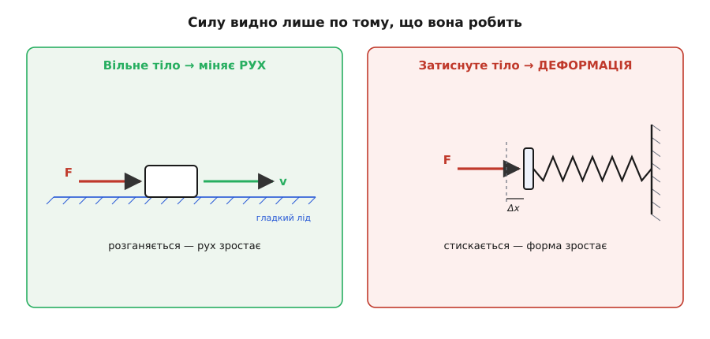
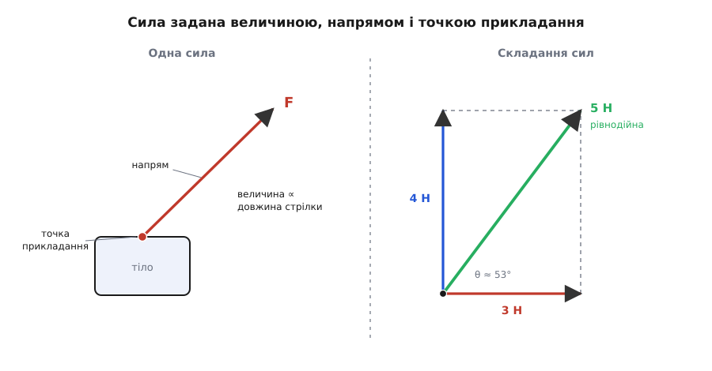
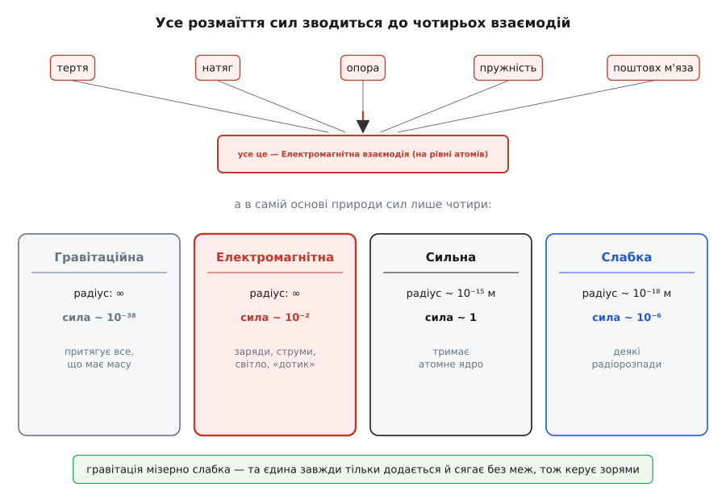
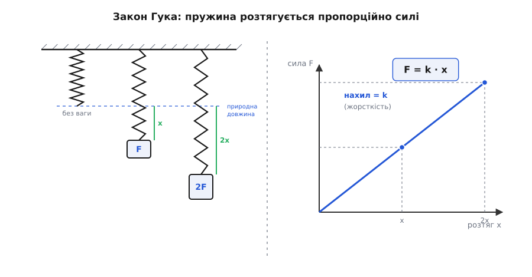

# Сила: штовхання, тяжіння і те, що змінює рух

<preknowlist>
- [Додавання векторів](topic:math-algebra/vector-addition) — сила має величину й напрям; кілька сил складаються в одну за правилом трикутника.
- [Швидкість](topic:ph-mechanics/velocity) — швидкість зміни положення, векторна величина; саме її сила змінює.
- [Прискорення](topic:ph-mechanics/acceleration) — швидкість зміни швидкості: міра того, як хутко міняється рух.
- [Маса](topic:ph-mechanics/mass) — міра інертності тіла; входить в одиницю сили (ньютон = кг·м/с²).
</preknowlist>

Штовхніть двері, потягніть за мотузку, підніміть торбу, стисніть пружину. М'язи різні, рухи різні — а ядро одне: ви або **штовхаєте**, або **тягнете**. Оце штовхання-тяжіння і є **сила**. Позначають її літерою F — від латинського *fortis*, «міцний». Сила — завжди дія одного тіла на інше: рука на двері, мотузка на відро, Земля на камінь, магніт на цвях. Самотньої сили, що висить у порожнечі сама собою, не буває — про це варто пам'ятати від самого початку, бо звідси випливе половина всього дальшого.

Найхитріше в силі те, що **саму її не видно**. Ви не бачите силу — ви бачите лише **те, що вона накоїла**. І накоїти вона може рівно дві речі, третьої немає. Або щось **змінює свій рух** — зрушує з місця, розганяється, гальмує, завертає. Або щось **деформується** — гнеться, стискається, розтягується, ум'ятина лишається на глині. Якщо ані рух ніде не змінився, ані форма — значить, зрівноваженої сили там і не було. Ці дві прикмети — єдине віконце, крізь яке ми взагалі помічаємо силу; на них тримаються і всі способи її виміряти.

### Сила показується двома способами

Візьмімо шайбу на гладенькому льоду. Штовхнули збоку — вона рушила і поїхала. Її рух змінився: був спокій, стала швидкість. Це перший, **динамічний** прояв: вільне тіло під силою починає рухатися інакше. Наскільки інакше — каже [другий закон Ньютона](topic:ph-mechanics/newtons-second-law): сила ділена на масу дає прискорення, F = m·a. Не силу тіло «запасає» і не швидкість вона йому «підтримує» — сила лише **міняє** рух, а надана самому собі шайба їхала б рівно й прямо без кінця. Тому питання «навіщо сила?» має точну відповідь: щоб змінювати рух, а не щоб його тримати.

Тепер притисніть ту саму шайбу до стіни й натисніть. Вона не рушить нікуди — стіна тримає. Зате під пальцем ум'ялася б гума, зігнулася б лінійка, стиснулася б пружина. Це другий, **статичний** прояв: коли тіло не може зрушити, сила йде в деформацію. Пружина при цьому — не просто приклад, а найзручніший «свідок» сили: чим дужче тиснеш, тим більше вона піддається, і по її стиску силу можна **прочитати числом**. Саме тому пружина й служить головним мірилом сили: її стиск чи розтяг прямо каже, яка сила діє.

Обидва прояви — про одне й те саме. Різниця лише в тім, чи тіло вільне рухатися, чи його щось тримає. Вільне — сила розганяє; затиснуте — сила деформує. А найчастіше потроху й те, й те воднораз.


*Дві — і тільки дві — прикмети, по яких помітно силу. Ліворуч: вільна шайба на гладкому льоду під поштовхом розганяється — змінюється рух. Праворуч: затиснута пружина під тим самим поштовхом стискається — змінюється форма. Нема ані того, ані того — нема й зрівноваженої сили.*

### Сила — це вектор

Штовхнути двері можна легенько чи щосили, всередину чи назовні, у ручку чи в кут біля завіс — і щоразу вийде інше. Отже, щоб сила була задана повністю, самого «скільки» замало. Треба три речі: **величина** (наскільки дужий поштовх), **напрям** (куди штовхаємо) і **точка прикладання** (де саме тиснемо). Величина плюс напрям — це і робить силу [вектором](topic:math-algebra/vector-addition) (лат. *vector* — «носій, той, що везе»): її малюють стрілкою, де довжина — величина, а вістря — напрям.

Векторність — не формальність, а те, що вирішує все на практиці. Дві сили однакової величини, але в різні боки, дають зовсім різний підсумок. Тому коли на тіло діє кілька сил нараз — а так буває майже завжди, — їх не можна просто додати числами. Їх складають **як вектори**, за правилом трикутника чи паралелограма, зважаючи на напрями. Підсумок цього складання називають **рівнодійною**: одна сила, що замінює собою всі прикладені й діє на тіло достоту так само, як діяли б вони гуртом.

**Задача.** До кільця тягнуть два троси під прямим кутом: один — на схід із силою 3 Н, другий — на північ із силою 4 Н. Яка рівнодійна?

```
Складаємо вектори, поставивши їх «хвіст до вістря».
Оскільки кут прямий, довжина рівнодійної — за Піфагором:

F = √(3² + 4²) = √(9 + 16) = √25 = 5 Н

Напрям: під кутом θ на північ від сходу,
tan θ = 4 / 3 = 1.33  →  θ ≈ 53°
```

Дві сили по кілька ньютонів дали одну в 5 Н, спрямовану навскіс — і саме так, «навскіс», і потягне кільце. Просте додавання 3 + 4 = 7 тут дало б неправду: воно годиться лише коли сили дивляться строго в один бік.


*Ліворуч: щоб задати силу повністю, потрібні три речі — величина (довжина стрілки), напрям (куди вона дивиться) і точка прикладання (де тисне). Праворуч: дві перпендикулярні сили 3 Н і 4 Н складаються не в 7, а в рівнодійну 5 Н під кутом — за правилом векторного трикутника.*

Найважливіший окремий випадок — коли рівнодійна виходить **нульова**. Сили є, і чималі, а разом гасяться дощенту. Книжка лежить на столі: вага тягне вниз, стіл підпирає рівно такою ж силою вгору, вони знищують одна одну — і книжка спокійно лежить. Такий стан звуть **рівновагою**: сумарна сила нуль, тож і рух не міняється (спокій або рівне пряме ковзання тривають самі собою). На нульовій рівнодійній тримається все, що стоїть і не падає: міст, стіл, будинок, підвішений ліхтар. Як для такого тіла розписати всі сили й довести, що вони справді врівноважені, — окрема, дуже практична техніка [діаграми вільного тіла](topic:ph-mechanics/force/math-free-body-equilibrium.md).

> 🔧 **Навіщо це.** Інженер, що рахує ферму мосту чи кронштейн під камеру, майже ніколи не рахує рух — він домагається рівноваги. Виписати всі сили на кожен вузол, скласти їх як вектори, прирівняти суму до нуля — і з цих рівнянь дізнатися, яку силу тримає кожен стрижень чи болт. Помилишся у напрямі однієї сили — і розрахунок покаже міцним те, що насправді зламається.

А якщо сила прикладена **збоку** від осі, а не в центр, вона ще й **обертає** тіло — крутить гайку, відчиняє двері за ручку. Цю обертальну спромогу сили — добуток сили на плече — називають [моментом сили](topic:ph-mechanics/torque), і саме тому важить не лише «скільки» тиснути, а й «де».

### Скільки сили — ньютон

Щоб силу міряти, потрібна одиниця. Її беруть не з повітря, а прямо з того, що сила робить із рухом. Домовилися так: **один ньютон** (Н) — це така сила, що тілу масою 1 кг надає прискорення 1 м/с². Звідси й запис одиниці через базові:

```
1 Н = 1 кг · м/с²
```

Одиницю назвали на честь англійського фізика Ісаака Ньютона; офіційно ім'я «ньютон» їй дала 9-та Генеральна конференція з мір і ваг у 1948 році. Наскільки це багато? Приблизно з такою силою давить на долоню звичайне яблуко: маса близько 100 г у земному тяжінні важить десь 1 Н. Тримаєте в руці склянку води — це вже приблизно 2–3 Н. Отже, ньютон — сила «побутового» масштабу, її легко відчути рукою.

Тут спливає слово, яке щодня плутають із масою, — **вага**. Вага тіла це не його маса, а **сила**, з якою тіло тисне на опору чи натягує підвіс через тяжіння. Маса 2 кг — це стала характеристика самого тіла, скільки в ньому речовини; а важить воно

```
P = m · g = 2 · 9.8 ≈ 19.6 Н
```

де g — прискорення вільного падіння. Понесіть те саме тіло на Місяць — маса лишиться 2 кг, а вага впаде вшестеро, бо там слабше тяжіння. Маса не змінюється ніде, вага залежить від того, куди тіло потрапило.

### Звідки взагалі беруться сили

Ми почали з того, що сили самотньої не буває: кожна — це дія тіла на тіло. Тепер розгляньмо цей парад ближче, бо в ньому ховається одна з найкрасивіших ідей фізики.

На перший погляд сил безліч і всі різні. Одні діють **через дотик**: щоб штовхнути візок, треба його торкнутися; тертя гальмує колесо там, де гума треться об дорогу; натяг тримає вантаж лише через напнуту мотузку; опора підпирає рівно там, де тіло на неї лягло. Інші діють **на відстані**, без жодного дотику: Земля тягне Місяць через порожнечу, магніт притягує цвях крізь повітря, наелектризований гребінець піднімає папірці, не торкаючись їх. Цю дію-крізь-порожнечу описують через [поле](topic:ph-electromagnetism/electric-field): тіло створює навколо себе поле, а поле вже діє на інше тіло там, де воно є.

Та коли фізики докопалися до дна, виявилося диво: усе це розмаїття зводиться всього до чотирьох [фундаментальних взаємодій](topic:ph-quantum/fundamental-interactions). Гравітаційна — тяжіння всього, що має масу. Електромагнітна — між зарядами й струмами. І дві ядерні, що працюють лише всередині атомного ядра: сильна тримає ядро вкупі, слабка керує деякими радіоактивними розпадами. Оце й усе. Більше в природі сил немає — решта лише їхні прояви.

А тепер найнесподіваніше. Майже всі сили, що ви відчуваєте руками щодня, — тертя, натяг, пружність, опора, навіть поштовх вашого м'яза, — насправді **та сама електромагнітна взаємодія**. Коли ви тиснете на стіл, атоми вашої долоні не торкаються атомів стола: задовго до дотику електронні хмари відштовхуються електрично, і саме це відштовхування ви відчуваєте як тверду поверхню. «Дотик», «твердість», «пружність» — усе це електромагнетизм зблизька. [Тертя](topic:ph-mechanics/friction) — теж воно: чіпляння нерівностей і зчеплення молекул на дотичних поверхнях. Тому окремої «сили тертя» чи «сили пружності» на дні природи немає — є один електромагнетизм у різних одежах.


*Тертя, натяг, опора, пружність, поштовх м'яза — усе це та сама електромагнітна взаємодія на рівні атомів. У самій основі природи сил лише чотири: гравітаційна й електромагнітна діють на будь-якій відстані, дві ядерні — лише в межах ядра. Числа сили — за порядком величини й залежать від способу порівняння.*

Найдивніша з четвірки — **гравітація**. За силою вона сміховинно слабка: крихітний магнітик відриває цвях від землі, перемагаючи тяжіння цілої планети. Між двома протонами гравітація приблизно у 10³⁶ разів кволіша за електричну. І все ж саме вона керує зорями й галактиками. Секрет — у двох речах. По-перше, гравітація ніколи не відштовхує, лише притягує, тож у великому тілі внески всіх атомів **тільки додаються** й ніколи не гасяться. По-друге, вона нескінченного радіуса. А от електричні заряди бувають двох знаків і у звичайній речовині майже точно врівноважені, тож на великій відстані її величезна сила сама себе занулює. Слабка й сильна взаємодії до суперечки не втручаються взагалі — вони не сягають далі атомного ядра. Ось чому світ великих тіл — планет, супутників, каменя, що падає, — це майже суто [гравітація](topic:ph-mechanics/newton-gravitation), а світ речовини, хімії й усього, що ми мацаємо, — майже суто [електрика](topic:ph-electromagnetism/coulomb-law).

### Як силу міряють

Повернімося до пружини — того самого свідка сили. Роберт Гук ще у XVII столітті помітив просту правильність: доки не переборщити, пружина розтягується **рівно пропорційно** прикладеній силі. Удвічі більша сила — удвічі більше розтягнення. Мовою формули це [закон Гука](topic:ph-condensed/elastic-deformation):

```
F = k · x
```

де x — наскільки пружина видовжилася проти спокою, а k — її жорсткість (скільки ньютонів треба на кожен метр розтягу). Ось чому пружина — ідеальний вимірювач: розтяг видно оком, а він прямо-пропорційний невидимій силі. Начепіть на пружину шкалу — і матимете **динамометр** (гр. *dýnamis* — «сила» + *métron* — «міра»), прилад, що показує силу числом. Кухонний безмін, вагова платформа, датчик тяги на випробувальному стенді — усі вони в основі роблять одне: переводять силу в деформацію, а деформацію в число.

**Задача.** Пружина під вантажем масою 0.5 кг видовжилася на 2.5 см. Яка її жорсткість? На скільки вона видовжиться під вантажем 0.8 кг?

```
Сила від першого вантажу — це його вага:
F₁ = m₁ · g = 0.5 · 9.8 = 4.9 Н   при   x₁ = 0.025 м

Жорсткість:
k = F₁ / x₁ = 4.9 / 0.025 = 196 Н/м

Другий вантаж:
F₂ = m₂ · g = 0.8 · 9.8 = 7.84 Н
x₂ = F₂ / k = 7.84 / 196 = 0.04 м = 4 см
```

Жодного нового закону — сама пропорційність. Зваживши один відомий вантаж, ми відкалібрували пружину, а далі вона міряє будь-яку силу: більший розтяг — більша сила, точно в тій самій пропорції.


*Закон Гука: розтяг пружини прямо пропорційний силі, F = k·x. Рівні прирости ваги дають рівні прирости довжини — тому по розтягу можна прочитати силу числом. На цьому працює кожен пружинний динамометр.*

> 🔧 **Навіщо це.** Той самий фокус — сила через деформацію — стоїть майже за кожним виміром сили в техніці. Крамничні й кухонні ваги, кранові безміни, тензодавачі під колесом вантажівки на вагах-платформі, стенди, що міряють тягу ракетного двигуна, — усі мають пружний елемент, що ледь-ледь прогинається під навантаженням, а електроніка переводить цей мікроскопічний прогин у ньютони чи кілограми. Пряма пропорційність із закону Гука і робить такий вимір чесним: удвічі більший прогин — рівно вдвічі більша сила.

### Сили ходять парами

Раз кожна сила — це дія тіла на тіло, напрошується питання: а що робить друге тіло? Виявляється, воно ніколи не лишається пасивним. Штовхаєте стіну — стіна штовхає вас назад із рівно такою ж силою; веслуєте, відкидаючи воду назад, — вода жене човен уперед. Це [третій закон Ньютона](topic:ph-mechanics/newtons-third-law): будь-яка сила має рівну їй і протилежну **протидію**, прикладену до того іншого тіла. Сили завжди народжуються парами, і в парі вони рівні за величиною та протилежні за напрямом.

Ключова тонкість: ці дві сили прикладені до **різних** тіл, тож вони не гасять одна одну. Земля тягне вас донизу — ви тягнете Землю догори такою ж силою, але через її неосяжну масу зрушуєте її незмірно мало. Саме на цій парності стоїть увесь реактивний рух: ракета жбурляє гази назад, гази штовхають ракету вперед — і тому вона летить навіть у порожнечі, де відштовхуватися ні від чого, крім власного викиду.

### Що сила робить у часі й на відстані

Сила рідко діє одну мить — здебільшого вона триває. І тут важать два різні «накопичення» її дії.

Помножте силу на **час**, доки вона діє, — дістанете, наскільки зміниться [кількість руху](topic:ph-mechanics/momentum) тіла (добуток маси на швидкість). Ось чому легенький, але тривалий поштовх розганяє важку баржу незгірш за короткий сильний удар, і чому, ловлячи м'яч, ви відводите руки: розтягуєте час зупинки — і та сама зміна руху дається меншою силою.

Помножте силу на **відстань**, яку тіло пройшло в її напрямі, — дістанете [роботу](topic:ph-mechanics/work), тобто скільки енергії сила передала тілу. Штовхнули візок на метр — уклали в нього енергію руху; підняли вантаж — уклали енергію, яку він поверне, падаючи. Тому та сама сила, прикладена на довшому шляху, виконує більше роботи, хоч сама від того не більшає.

Один поштовх — а два різні підсумки залежно від того, що ви множите: час дає зміну руху, відстань дає передану енергію. Це не дві різні фізики, а два боки однієї дії сили, і кожен незамінний на своєму місці.

### Де проста картина хитається

Сила як зрозуміле штовхання-тяжіння служить майже завжди — але дві межі варто знати, щоб не обманутися.

Перша: сила залежить від того, **звідки дивитися**. Їдете в автобусі, він різко гальмує — і вас кидає вперед, хоч ніхто не штовхав. У системі відліку автобуса ніби з'явилася сила нізвідки. Насправді ніякої сили немає: це ви за інерцією рухаєтеся далі, поки автобус під вами сповільнюється. У прискорених системах відліку, щоб урятувати звичні рівняння, домальовують **фіктивні сили** — відцентрову, коріолісову, — яких насправді ніхто не прикладає. Справжні сили від несправжніх відрізняє одне: у справжньої завжди є друге тіло-джерело й пара-протидія, у фіктивної — немає. Де ця межа проходить і чому закони сили справджуються лише в [інерціальних системах](topic:ph-mechanics/inertial-frame), — окрема тема.

Друга межа глибша й стосується самого поняття. «Сила» здається чимось первинним, відчутним рукою, — але придивившись, фізики завважили, що ми ніколи не міряємо силу окремо: ми міряємо прискорення, або деформацію, і вже з них **виводимо** силу. Ще у XIX столітті Ернст Мах доводив, що сила — радше зручний спосіб вести облік взаємодій, ніж окрема «річ» у світі. Як народилося саме це поняття, через які суперечки — від середньовічного «імпетусу» до Махової критики — воно набуло теперішнього вигляду, розказано [окремо](topic:ph-mechanics/force/hist-force-concept.md).

Ці застереження не хитають будову, а лише окреслюють, де вона стоїть. А стоїть вона неосяжно широко: від цвяха на магніті до орбіти планети, від напнутого тросу мосту до тяги ракети — усюди та сама проста ідея. Знайдіть усі сили на тілі, складіть їх як вектори — і рівнодійна скаже все: рушить тіло чи встоїть, куди й наскільки хутко. У цьому й уся принада поняття: одне слово «сила» — а через нього читається і рух зірок, і те, чому не провалюється підлога під ногами.
