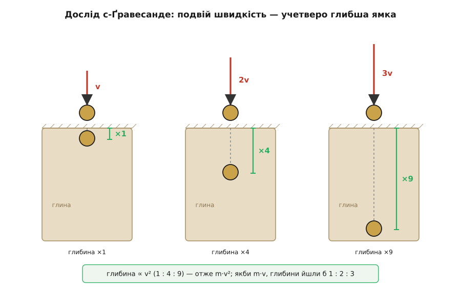
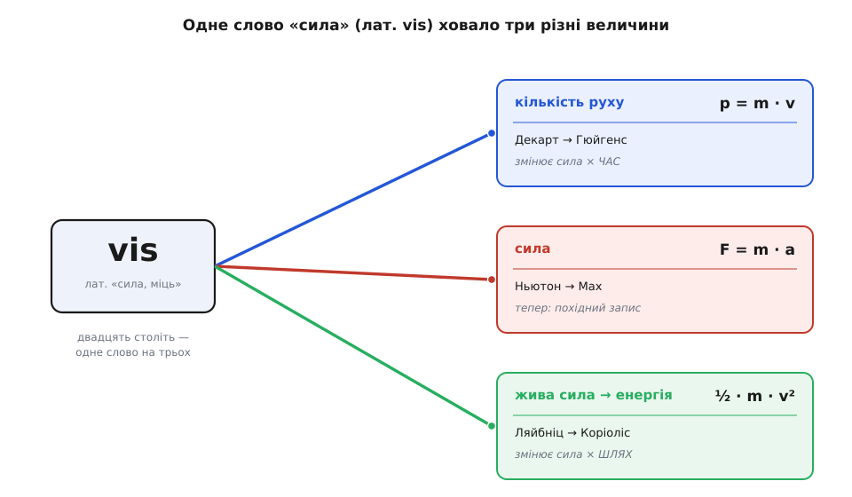

# 📜 Що таке сила: від м'язового зусилля до бухгалтерського запису

З усіх понять фізики сила здається найочевиднішим. Ви знаєте її власною рукою раніше, ніж дізнаєтесь бодай слово: натисніть на стіну — і щось справжнє напружено тисне у відповідь. Тим дивніше, що саме в сили — найбурхливіша біографія з усіх засадничих понять, і що наприкінці дороги найгостріші уми дійшли висновку, від якого йде обертом голова: сила, можливо, взагалі не «річ» у світі.

Уся заковика ховалася в одному слові. Двадцять століть латинське **vis** — «міць, потуга» — тихцем виконувало роботу аж **трьох** різних величин, які ми тепер тримаємо строго нарізно. Те, що Арістотель, Ляйбніц і Ньютон називали одним словом «сила», було насправжки сплетеним клубком: власне сили, **кількості руху** й **енергії**. Історія поняття «сила» — це передусім історія того, як цей клубок повільно розплутували, аж поки з нього не випало три окремі нитки, а від самої «сили» лишився не предмет, а спосіб рахувати. Пройдімо цю дорогу — вона показує, як фізика перебудовує навіть те, що здавалося очевидним до останку.

## Арістотель: сила — це зусилля, що тримає рух

Найдавніше значення сили — найтілесніше. Сила це те, що ви робите м'язом: тягнете, штовхаєте, надриваєтеся. Арістотель (гр. Aristotélēs, 384–322 до н.е.) і взяв цю м'язову інтуїцію за основу опису світу. Рух, доводив він, живе доти, доки його **живить** рушій-у-дотику: везеш воза — він їде, кинув — став. Сила тут — **причина самого руху**, а не його змін, і причина ця мусить прикладатися **без упину**, бо інакше рух згасне. Скільки сили — стільки й швидкості: дужче тягнеш, хутчіш іде.

Придивімося, чим саме є «сила» в цій картині, бо кут тут — не про формули, а про **що це за річ**. Сила Арістотеля — річ первинна, ба навіть найпервинніша: вона просто дана, її відчуваєш, від неї все починається. І вона намертво прив'язана до швидкості й до дотику. У самому слові це чути: грецька, латинська, наша мови ліпили назву сили з тілесної потуги — vis, «міць». Сила була антропоморфна: світом рухали так само, як рукою рухають камінь.

Хиба тут глибока, і вона протрималася майже до Ньютона — але яка саме це хиба й як її ламали Ґалілей із наступниками, докладно розказано в [історії народження F = m·a](root:ph-mechanics/newtons-second-law/hist-second-law.md); там ідеться про **закон** руху. Нас же цікавить не закон, а сама **річ** на ім'я «сила»: що з нею ставалося, поки уявлення про рух перевертали догори дриґом.

## Імпетус: сила переселяється всередину тіла

Перша тріщина в Арістотелевій силі була не про рух узагалі, а про одну прикру дрібницю: стрілу. Вона злітає з тятиви й летить далі — а рушій уже не торкається. Що ж її жене? Іоан Філопон (гр. Iōánnēs Philóponos, бл. 490–570), грекомовний філософ із Александрії, дав відповідь, яка тихо перевернула саме поняття сили: рушій **вкладає** в тіло безтілесну рухову силу, і та несе стрілу далі вже зсередини.

Зупинімося на цьому, бо тут — тектонічний зсув. Доти сила була зовнішнім штовханням, що прикладається щомиті ззовні. Тепер вона стає **чимось, що тіло НЕСЕ В СОБІ** — запасом, вкладеним у рух. Паризький магістр Жан Бурідан (фр. Jean Buridan, бл. 1301–1360) назвав цей запас *імпетусом* (лат. impetus — «натиск, порив») і зробив його кількісним: імпетус тим більший, чим більше в тілі матерії й чим швидше воно йде — тобто **матерія, помножена на швидкість**.

І ось зерно, з якого проросте вся дальша драма поняття. Разом з імпетусом у фізику ввійшла думка, що **рухоме тіло МАЄ силу** — силу лавини, силу повені, силу ядра, що летить. Не хтось прикладає до нього силу — воно саме її в собі носить. Ця інтуїція здавалася такою очевидною, що ніхто й не питав, скільки саме тієї «сили руху» в тілі та як її міряти. Питання визріє за три століття — і розколе Європу.

## Переворот: сила більше не тримає рух — але річ у тілі нікуди не зникла

Тоді прийшов переворот, з якого починається нова фізика. Ґалілео Ґалілей (італ. Galileo Galilei, 1564–1642), Рене Декарт (фр. René Descartes, 1596–1650) і Ісаак Ньютон (англ. Isaac Newton, 1643–1727) показали: рухові **не потрібна** сила, щоб тривати. Полишене на себе тіло само їде рівно й прямо без кінця — це інерція. А значить, сила більше **не причина руху**, а причина його **зміни**: вона розганяє, гальмує, завертає.

Здавалося б, поняття прояснилося. Але тут ховається пастка, яку історія любить замовчувати. Якщо рухоме тіло не потребує сили, щоб летіти, — то **куди поділася та сила, яку воно нібито несло в собі** з часів імпетусу? Летюче ядро руйнує мур — хіба в ньому нема «сили»? Ця нез'ясована половинка нікуди не ділася; вона лише зачаїлася й чекала.

Що поняття лишалося подвійним, видно навіть у самого Ньютона. У «Началах» (1687) він означує **дві** сили, не одну. Є *vis impressa* — «прикладена сила», зовнішня дія, що змінює стан тіла; вона живе лише поки діє й по тому в тілі не лишається. А є *vis insita*, вона ж *vis inertiae* — «вроджена сила» або «сила інерції», якою тіло **саме по собі** тримається свого стану, опираючись змінам. Ньютон, творець нової механіки, усе ще писав про якусь силу, що **живе в тілі**. Слово «сила» досі тягло два вантажі: зовнішнього збурювача руху — і чогось, що рухоме тіло має в собі. Саме на цій двоїні й спалахнула найдовша суперечка ранньої фізики.

## Скільки сили в русі: війна за «живу силу»

Питання нарешті прозвучало прямо: рухоме тіло має «силу» — **скільки** її? Чим міряти ту силу, що сидить у русі? Відповідей знайшлося дві, і вони не мирилися.

Перша — картезіанська. Декарт увів **кількість руху**: розмір тіла, помножений на його швидкість (нашого поняття маси він ще не мав і «кількість тіла» міряв об'ємом). Цю величину — по-нашому m·v — Бог, за Декартом, уклав у світ раз назавжди й відтоді зберігає сталою: скільки руху зникло тут, стільки народилося там. Гарна, ощадлива картина світу-годинника.

Була в ній, щоправда, глибока вада: Декарт брав саму **швидкість** як число без напряму. Виходило, що тіло, відскочивши від стіни назад з тією ж швидкістю, «кількості руху» не змінило, — а це суперечило дослідам зі співударами. Виправив це Крістіан Гюйгенс (нід. Christiaan Huygens, 1629–1695): зберігається не швидкість, а **швидкість із напрямом** — величина векторна. Так картезіанська «кількість руху» дозріла до нашої [кількості руху](root:ph-mechanics/momentum) — вектора p = m·v, що його справді зберігає всесвіт.

Аж тут утрутився Ґотфрід Вільгельм Ляйбніц (нім. Gottfried Wilhelm Leibniz, 1646–1716) і сказав: ні, панове, ви міряєте силу руху **не тим числом**. У короткій, але дошкульній статті «Стислий доказ пам'ятної помилки Декарта» (лат. *Brevis demonstratio erroris memorabilis Cartesii*), надрукованій у березні 1686 року в *Acta Eruditorum*, він доводив, що справжня «сила» руху — не m·v, а **m·v²**. Цю величину він назвав **живою силою** (лат. *vis viva*), на відміну від «мертвої сили» (*vis mortua*) нерухомого натиску.

Аргумент Ляйбніца — краса чистого міркування, і варто його простежити, бо саме він показує, ЧОМУ в одному слові сиділо дві величини. Силу тіла, казав Ляйбніц, треба міряти **дією, на яку тіло здатне**, — а найчесніша міра дії ось яка: на яку висоту тіло може підняти саме себе, борючись із тяжінням. Тут у гру входить Ґалілеїв закон [вільного падіння](root:ph-mechanics/free-fall):

```
Тіло, що впало з висоти h, унизу має швидкість:
    v² = 2·g·h     →     h = v² / (2·g)

Отже висота, яку тіло здатне подолати своїм рухом, — як КВАДРАТ швидкості.
Тіло зі швидкістю 2v злітає не вдвічі, а вчетверо вище за тіло зі швидкістю v:
    h(2v) / h(v) = (2v)² / v² = 4

А картезіанська «кількість руху» m·v при подвоєнні швидкості зростає лише вдвічі.
Здатність тіла (піднятися, зім'яти, пробити) росте як 4 — тобто як m·v², а не m·v.
```

Подвоїли швидкість — здатність тіла до дії вчетверилася, а «кількість руху» тільки подвоїлася. Обидві сторони мали за очевидне, що «сила руху» — одна-єдина величина; Ляйбніц показав, що дві розумні міри цієї «однієї» величини дають **різні** числа. Отже величин там від початку було дві, а слово — одне.

Спалахнула суперечка, яку так і звуть — **суперечка про живу силу**, і горіла вона добрих півстоліття. Картезіанці (абат Кателан, згодом Дені Папен) стояли за m·v; ляйбніціанці — за m·v². На кону було не рівняння, а питання майже богословське: **яка ж величина є справжньою «кількістю сили» у всесвіті, тим незнищенним скарбом, що його природа береже?**

Розсудити взявся дослід. Віллем Якоб с-Ґравесанде (нід. Willem Jacob 's Gravesande, 1688–1742), голландський фізик із Лейдена й переконаний ньютоніанець, коло 1720 року заходився кидати мідні кульки в м'яку глину — щоб раз і назавжди підперти m·v проти Ляйбніцевого m·v². Вийшло навпаки:

```
Кулька, впавши, входить у глину на глибину d. Що глибша ямка — то більша
«сила», з якою кулька вдарила. Пришвидшуємо кульку (кидаємо з вищого рівня):

   швидкість удару  v   →   глибина ямки  d
   швидкість удару  2v  →   глибина ямки  4d
   швидкість удару  3v  →   глибина ямки  9d

Глибина йде як  1 : 4 : 9  —  тобто як v².
Якби «сила руху» була m·v, ямки йшли б  1 : 2 : 3.  Вони йдуть як КВАДРАТ.
```

Глина винесла Ляйбніців вирок: удвічі прудкіша кулька б'є вчетверо глибше. с-Ґравесанде, що йшов доводити протилежне, чесно визнав програш свого табору. А звести дослід і теорію в струнку систему випало Емілі дю Шатле (фр. Émilie du Châtelet, 1706–1749) — фізикині, чиє ім'я з цієї історії надто часто викреслюють. У «Засадах фізики» (фр. *Institutions de physique*, 1740) вона поєднала глиняні досліди с-Ґравесанде з Ляйбніцевою живою силою й переконливо показала: енергія руху росте як **квадрат** швидкості. Саме її праця рознесла живу силу Європою.


*Дослід с-Ґравесанде (бл. 1720), що розсудив суперечку про живу силу. Удвічі прудкіша кулька входить у глину не вдвічі, а вчетверо глибше; утричі прудкіша — вдев'ятеро. Глибина ∝ v². Якби «силу руху» правильно міряло m·v, глибини йшли б 1 : 2 : 3; вони йдуть 1 : 4 : 9 — отже m·v².*

Розв'язку — не переможну, а примирливу — дав Жан ле Рон д'Аламбер (фр. Jean le Rond d'Alembert, 1717–1783). У «Трактаті з динаміки» (фр. *Traité de dynamique*, 1743) він оголосив усю війну **суперечкою про слова** (фр. *dispute de mots*). Обидві сторони мали рацію — бо міряли **різні речі**, тільки обидві звали їх одним словом «сила». Величина m·v зберігається й міряє одне; величина m·v² зберігається й міряє інше. Немає жодного «або-або»: у природі бережуться **обидва** скарби, просто вони різні. *(Історики нині додають, що самим лиш трактатом д'Аламбера суперечка не вщухла — вона згасала поступово; та саме він найясніше назвав її суттю сплутані значення одного слова.)*

Ось вона, розв'язка, важлива для нашого поняття: слово «сила» весь час ховало **дві** окремі фізичні величини — кількість руху m·v і живу силу m·v². Суперечка була не про природу, а про мову: одне перевантажене слово намагалося означати два несумісні поняття нараз.

## Жива сила стає енергією: від слова відпадає третя нитка

Розв'язка д'Аламбера ще не назвала другу величину її теперішнім іменем. Це зробив у XIX столітті Ґаспар-Гюстав де Коріоліс (фр. Gaspard-Gustave de Coriolis, 1792–1843), розраховуючи ефективність машин. У праці «Про розрахунок дії машин» (фр. *Du calcul de l'effet des machines*, 1829) він додав до живої сили множник ½ і пов'язав ½·m·v² із **роботою** (фр. *travail*) — з тим, скільки сила напрацьовує на пройденому шляху. Так Ляйбніцева *vis viva* перетворилася на нашу [кінетичну енергію](root:ph-mechanics/kinetic-energy) ½·m·v², а слово «сила» назавжди позбулося ще одного зі своїх значень.

Підіб'ємо, що сталося зі старим латинським словом vis. Воно розкололося на **три** сучасні поняття, які ми тепер нізащо не сплутаємо:

- **сила** F — те, що змінює рух; діє в дотику чи на відстані, вимірюється в ньютонах;
- **кількість руху** p = m·v — векторний запас руху; його змінює сила, помножена на **час**;
- **енергія** ½·m·v² — колишня «жива сила»; її змінює сила, помножена на **шлях**.


*Двадцять століть одне слово — «сила» (лат. vis) — означало три різні речі нараз. Розплутування зайняло всю ранню фізику: від «кількості руху» Декарта, виправленої Гюйгенсом, через «живу силу» Ляйбніца, доведену дослідами с-Ґравесанде й дю Шатле та перейменовану Коріолісом на енергію, — і до власне сили, яку доводив до ладу Ньютон. Три нитки з одного клубка.*

Це не уточнення поняття — це його **розтин**. Там, де інтуїція бачила один тілесний «напір», фізика знайшла три незалежні величини з різними одиницями й різними законами збереження. Найдужче тут повчальне ось що: наша найпевніша, найм'язовіша інтуїція — «сила руху» — виявилася не помилковою, а **злитою**: правдою відразу про три речі, які треба було роз'єднати.

## Мах: сила — не річ, а бухгалтерський запис

Здавалося б, тепер, коли зайве відпало, «сила» F нарешті стоїть на твердому: оцей ньютонів штовхач-збурювач руху — то вже напевно справжня річ. Аж наприкінці XIX століття Ернст Мах (нім. Ernst Mach, 1838–1916), австрійський фізик, народжений на Моравії, похитнув і цю останню певність — і то в самий корінь.

Махів закид простий і невблаганний. **Ми ніколи не спостерігаємо силу.** Що ми бачимо насправді? Тіла, що прискорюються одне відносно одного: магніт і цвях зближуються, візки роз'їжджаються, камінь падає до Землі. «Силу» ми звідти **виводимо**, домальовуємо в думці — її самої ніхто ніколи не зміряв окремо, як міряють довжину чи час. А Ньютонові означення, доводив Мах, ходять по колу: маса означена через силу, сила — через масу. Це не фундамент, а зачароване коло.

Мах запропонував розірвати коло — почати з того, що **справді видно**, з прискорень. Візьмімо два тіла, що взаємодіють (скажімо, стиснута пружина між двома візками), і зміряймо самі лише їхні [прискорення](root:ph-mechanics/acceleration) — більш нічого:

```
Відпускаємо пружину. Міряємо ТІЛЬКИ прискорення (ніякої «сили» не питаємо):
    візок 1:   a₁ = 6 м/с²
    візок 2:   a₂ = 2 м/с²   (у протилежний бік)

Масу означуємо через саме відношення прискорень — те, що менше прискорюється,
має більшу масу:
    m₁ / m₂ = a₂ / a₁ = 2 / 6 = 1/3       →   візок 2 утричі масивніший
Оберемо одиницю: m₁ = 1 кг, тоді m₂ = 3 кг.

І аж ТЕПЕР означуємо «силу» — просто як добуток m·a:
    F = m₁·a₁ = 1·6 = 6 (одиниць)
    F = m₂·a₂ = 3·2 = 6 (тих самих одиниць)

Те саме число з обох боків. «Сила» — не те, що ми зміряли; це ІМ'Я для добутку,
порахованого з прискорень. Самої «сили» ніхто не бачив і не торкався.
```

У цій крихітній процедурі — вся суть Махового удару. Спершу з голих прискорень означуємо масу (жодного поняття сили при цьому не треба). А тоді «сила» входить **останньою**, як зручний ярлик для добутку m·a. Вона не первинна цеглина світу, а **похідний бухгалтерський запис** — спосіб вести облік взаємодій, а не окрема потуга, що десь там існує сама собою. І рівність двох чисел (6 = 6), яку Ньютон підніс до [третього закону](root:ph-mechanics/newtons-third-law) про рівність дії та протидії, у Маха стає майже **означенням**: так уже влаштоване саме поняття, а не відкрита в природі таємниця.

Ось де дорога робить повне коло — і воно приголомшує. Сила починала (Арістотель) як найпервинніша річ на світі: сама причина руху, відчутна власним м'язом, з якої все бере початок. Закінчує вона (Мах) як **найменш** первинна: похідний запис у книзі рахунків, обчислений із прискорень, без власного окремого буття. Те, що здавалося твердою річчю, розчинилося у **відношенні між прискореннями**. Найтілесніша інтуїція фізики виявилася її найбільш похідним поняттям.

Махова критика не лишилася кабінетною. Його наполягання, що фізика має спиратися лише на спостережне й на **відносні** прискорення, а не на абсолютний простір Ньютона, прямо надихнуло Айнштайна — так званий «принцип Маха» став однією з дороговказних зірок загальної теорії відносності. Ниточка тягнеться від глиняних кульок с-Ґравесанде аж до викривленого простору-часу.

## Що з усього цього видно

Біографія поняття «сила» — це історія одного перевантаженого слова, яке спершу розкололося, а тоді й **знецінилося** до звичайного інструмента обліку. Пройдімо її в самій суті поняття, не в законі:

- **сила як зусилля** (Арістотель) — найпервинніша, м'язова річ, причина самого руху, що мусить діяти без упину;
- **сила, вкладена в тіло** (Філопон, Бурідан) — імпетус; народжується думка «рухоме тіло МАЄ силу», матерія на швидкість;
- **сила як збурювач змін** (Ґалілей, Декарт, Ньютон) — рух триває сам, сила лише міняє його; але «сила в тілі» не зникає, а роздвоює саме поняття (Ньютонові дві сили — прикладена й вроджена);
- **яка ж це величина?** (суперечка про живу силу) — під одним словом ховаються **дві**: кількість руху m·v (Декарт, Гюйгенс) і жива сила m·v² (Ляйбніц, доведена с-Ґравесанде й дю Шатле);
- **три окремі поняття** (д'Аламбер, Коріоліс) — клубок розплутано на силу, кількість руху й енергію;
- **сила — не річ, а рахунок** (Мах) — її ніхто не спостерігає; вона похідна від прискорень, ярлик для добутку m·a.

Наука тут зробила з поняттям сили щось несподіване. Вона не «уточнила» стару інтуїцію й не викинула її — вона показала, що під одним відчуттям крилося кілька різних істин, а найглибша з них та, що сама «річ» була радше зручним способом говорити, ніж предметом у світі. І все ж — оце тиха іронія наостанок — інженер і досі каже «сила» й має на думці справжній напір, бо як інструмент обліку сила бездоганна: вона завжди сходиться. Мах не скасував силу, а лише пояснив, **чим вона є насправді**: не цеглиною світобудови, а найкращим записом, який ми вигадали, щоб цей світ рахувати.
