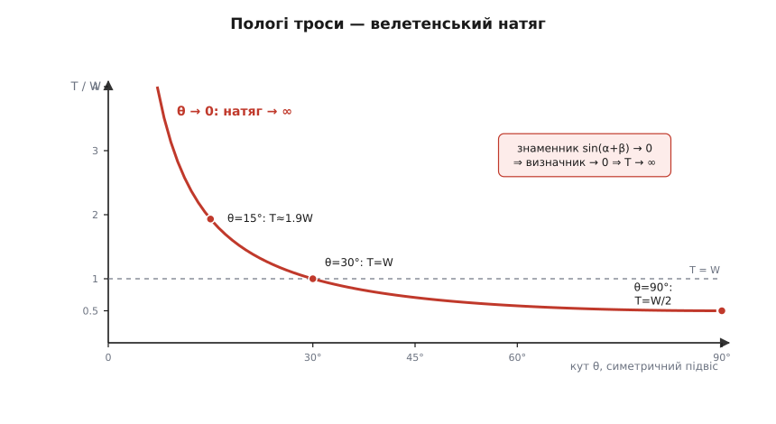

# 🧮 Діаграма вільного тіла: як рівновага стає рівняннями

Рівновага записується одним коротким рядком — ΣF = 0. На перший погляд це майже банальність: «усі сили гасяться, тому тіло стоїть». Але за цим рядком ховається робочий інструмент, що годує половину інженерії. Він не просто *констатує*, що щось не падає, — він **дозволяє знайти невидимі сили**, яких інакше не дістати ніяк. Натяг у тросі мосту, зусилля в болті кронштейна, реакція опертя під ногою колони — усе це числа, які ми ніколи не міряємо напряму, а **обчислюємо** з умови рівноваги.

І тут криється відмінність від звичайного складання стрілок, яку варто засвоїти від початку. Коли ми просто [додаємо вектори](root:math-algebra/vector-addition), усі доданки відомі, а шукаємо ми суму. У рівновазі — навпаки: **суму ми знаємо наперед, вона дорівнює нулю, а невідомі — це самі окремі сили**. Нуль у правій частині не порожнеча, а **умова**, з якої народжуються рівняння. Розберімо, звідки вони беруться, і доведімо техніку до числа на живому прикладі — вивісці, що висить на двох тросах.

## Означення: рівновага — це нуль-вектор, тобто дві рівності

Почнімо з того, звідки взагалі береться ΣF = 0. [Другий закон Ньютона](root:ph-mechanics/newtons-second-law) каже: рівнодійна всіх прикладених сил дорівнює масі на прискорення, ΣF = m·a. Рівновага — це коли рух **не міняється**: тіло або стоїть, або пливе рівно й прямо. І там, і там прискорення нульове, a = 0, тож уся рівнодійна занулюється:

```
ΣF = m·a = m·0 = 0
```

Це і є [умова рівноваги](root:ph-mechanics/newtons-first-law) — рівнодійна нуль. Але ось що новачок раз у раз проґавлює: **ΣF = 0 — це рівняння між векторами, а не між числами.** Праворуч стоїть не скалярний нуль, а нуль-вектор — стрілка нульової довжини. А вектор дорівнює нулю тільки тоді, коли **кожна** його складова окремо дорівнює нулю: якщо у стрілки лишився хоч найменший залишок уздовж якоїсь осі, вона вже не нульова. Проєкція суми на вісь дорівнює сумі проєкцій (проєктувати — [лінійна дія](root:math-algebra/vector-components), її вільно заносять усередину суми), тож одне векторне рівняння розпадається на стільки скалярних, скільки в задачі осей:

```
ΣFx = 0     (сума всіх складових уздовж x)
ΣFy = 0     (сума всіх складових уздовж y)
```

(у просторі додається ще ΣFz = 0). Ось перший висновок, і він суто алгебраїчний: **рівновага дає рівно стільки рівнянь, скільки вимірів має простір.** Два виміри — дві рівності, отже, можна знайти дві невідомі величини. Саме звідси інженер добуває натяги й реакції, яких на кресленні наче й немає: він не вгадує їх, а розв'язує систему.

> 🔧 **Навіщо це.** Просте лічення «рівнянь проти невідомих» вирішує долю всієї конструкції. Вузол ферми у площині дає дві рівності (ΣFx, ΣFy) — тож у ньому можна однозначно знайти рівно **дві** невідомі сили в стрижнях. Якщо невідомих три, а рівнянь два, задача **статично невизначена**: самої рівноваги замало, треба ще враховувати, як деталі розтягуються, — і розрахунок стає на порядок складнішим. Тому проєктувальник свідомо будує **статично визначені** вузли: там кількість опор і стрижнів точно відповідає числу рівнянь, і кожне зусилля читається прямо з ΣF = 0.

## Інтуїція: навіщо «вирізати» тіло

Рівняння ΣF = 0 нічого не варте, поки не знаєш, **які саме** сили в нього підставляти. І тут вступає головна техніка — **діаграма вільного тіла** (англ. *free body diagram*, «діаграма вивільненого тіла»). Ідея майже нахабно проста: подумки **вирізати** тіло з усього світу, лишити його самотнім у порожнечі — а натомість домалювати стрілку кожної сили, з якою вилучений світ на нього тиснув.

Чому це працює й чому без цього не обійтися? Бо закони Ньютона говорять про **одне конкретне тіло**, а не про «ситуацію взагалі». Поки не проведено межу — ось воно, тіло, а ось усе решта, — незрозуміло, що з чим прирівнювати. Проведеш межу — і одразу впорядковується: важать **тільки ті сили, що перетинають межу**, тобто дія зовнішнього світу на тіло. Усе внутрішнє — сили між частинками самого тіла — гаситься парами за [третім законом Ньютона](root:ph-mechanics/newtons-third-law) і у ΣF не входить зовсім. Вирізання — це фільтр, що відкидає внутрішнє й лишає саму зовнішню дію.

Далі — механічне правило, як заповнити діаграму. Кожен **контакт** і кожне **поле** замінюють однією силою, і завжди тим самим способом:

- **напнута нитка чи трос** — натяг **уздовж** нитки, завжди на **розтяг**: нитка вміє лише *тягнути*, штовхати вона не годна;
- **опорна поверхня** — сила реакції **нормаль**, перпендикулярна до поверхні, завжди від поверхні *назовні*: поверхня вміє лише *штовхати*, притягувати — ні;
- **шорсткий контакт** — до нормалі додається ще й **тертя**, уздовж поверхні;
- **Земля** — **вага** m·g, прямовисно вниз, прикладена в [центрі мас](root:ph-mechanics/center-of-mass) тіла.

Більше нічого домальовувати не можна. Якщо на діаграмі з'явилася стрілка, під якою не назвеш **другого тіла-джерела**, — це фантом, і його треба стерти. І навпаки: кожне тіло, що торкається нашого чи притягує його, **мусить** дати свою стрілку, інакше рівняння вийде неправдиве.

Одне уточнення про межі методу. Тут ми розбираємо випадок, коли всі сили сходяться в **одну точку** — у кільце, у вузол ферми, у точку підвісу. Тоді досить самої ΣF = 0. Якщо ж тіло протяжне, а сили прикладені в різних його місцях, до силової рівноваги додається ще й **обертальна**: сума [моментів сил](root:ph-mechanics/torque) теж має бути нуль, Στ = 0 — інакше тіло не зрушить, зате почне крутитися. Ми зосередимось на збіжних силах, де вся вага лягає на ΣFx і ΣFy.


*Серце техніки у двох панелях. Ліворуч плутана сцена: вивіска, два троси, гачки. Праворуч те саме кільце, вирізане з усього світу: лишилися тільки три сили, що перетинали його межу, — натяги T₁, T₂ уздовж тросів і вага W вниз. Кожну силу спроєктовано на осі (пунктир), і рівновага записана двома рядками. Тепер це не картинка, а система рівнянь.*

## Формальний апарат: від картинки до системи

Зберімо техніку в короткий і жорсткий порядок дій — саме він відрізняє силову рівновагу від звичайного складання стрілок:

1. **Вирізати тіло** й виписати всі сили (по одній на контакт чи поле; ні більше, ні менше).
2. **Вибрати осі.** Будь-які взаємно перпендикулярні; але розумний вибір різко спрощує алгебру — на похилій площині це видно найкраще.
3. **Спроєктувати** кожну силу на осі й записати ΣFx = 0, ΣFy = 0.
4. **Розв'язати систему.** Невідомих рівно стільки, скільки рівнянь, — [лінійна система](root:math-algebra/linear-systems) розв'язується однозначно.

Прогонимо всі чотири кроки на наскрізному прикладі.

### Вивіска на двох тросах

**Умова.** Вивіска вагою W = 200 Н (маса ≈ 20 кг) висить на кільці. Від кільця два троси йдуть до двох гачків на стіні: лівий (трос 1) під кутом α = 30° до горизонту, правий (трос 2) — під кутом β = 45°. Знайти натяги обох тросів, T₁ і T₂.

**Крок 1** — вирізаємо **кільце** (не вивіску, не троси — саме вузол, де все сходиться). На нього діють три сили: вага вивіски тягне вниз (через коротку підвіску) силою W; лівий трос тягне вгору-вліво натягом T₁ уздовж себе; правий — угору-вправо натягом T₂. Три збіжні стрілки, дві з них невідомі.

**Крок 2** — осі беремо звичні: x праворуч, y вгору.

**Крок 3** — розкладаємо кожну силу на складові. Лівий трос дивиться вгору-вліво, тож його x-складова **від'ємна**, а y-складова додатна; правий трос — обидві складові додатні; вага — тільки вниз:

```
         x-складова          y-складова
T₁:   −T₁·cos30°          +T₁·sin30°
T₂:   +T₂·cos45°          +T₂·sin45°
W:      0                 −W
```

Прирівнюємо суму кожного стовпчика до нуля:

```
ΣFx:  −T₁·cos30° + T₂·cos45°       = 0
ΣFy:   T₁·sin30° + T₂·sin45° − W   = 0
```

**Крок 4** — розв'язуємо. Це система двох лінійних рівнянь на два натяги. Виразимо T₁ з першого рівняння й підставмо в друге:

```
з ΣFx:   T₁ = T₂·cos45° / cos30° = T₂ · 0.7071/0.8660 = 0.8165·T₂

у ΣFy:   0.8165·T₂·sin30° + T₂·sin45° = W
         0.8165·T₂·0.5 + T₂·0.7071   = 200
         0.4082·T₂ + 0.7071·T₂       = 200
         1.1153·T₂                   = 200
         T₂ = 179.3 Н
         T₁ = 0.8165·179.3 = 146.4 Н
```

Зверніть увагу: жоден натяг **не** є простою часткою ваги — обидва вийшли з переплетеної системи, де кожне рівняння тримає обидві невідомі. І результат трохи неочікуваний: **крутіший трос (45°) напруженіший за пологіший (30°)**, 179 проти 146 Н. Чому так? Гляньте на межу: якби правий трос стояв майже прямовисно (β → 90°), він тримав би всю вагу сам, а лівий обвиснув би. Що ближчий трос до вертикалі, то краще він вирівняний з вагою й то більшу її частку бере на себе.

### Те саме — матрицею й кодом

Підстановка годиться на два рівняння, та щойно вузлів чи невідомих більшає, зручніше записати систему **матрицею** й доручити арифметику машині. У матричному вигляді A·t = b це

```
[ −cos30°   cos45° ] · [ T₁ ]   =   [ 0 ]
[  sin30°   sin45° ]   [ T₂ ]       [ W ]
```

Задача — розв'язати 2×2 лінійну систему; Python з бібліотекою лінійної алгебри тут природний:

```python
import numpy as np

a, b = np.radians(30), np.radians(45)      # кути тросів до горизонту
W = 200.0                                   # вага вивіски, Н

A = np.array([[-np.cos(a), np.cos(b)],      # рядок ΣFx = 0
              [ np.sin(a), np.sin(b)]])     # рядок ΣFy = 0
rhs = np.array([0.0, W])

T1, T2 = np.linalg.solve(A, rhs)
print(f"T1 = {T1:.1f} Н,  T2 = {T2:.1f} Н")   # → T1 = 146.4 Н,  T2 = 179.3 Н

# перевірка: чи справді сили гасяться?
Fx = -T1*np.cos(a) + T2*np.cos(b)
Fy =  T1*np.sin(a) + T2*np.sin(b) - W
print(f"ΣFx = {Fx:.2e},  ΣFy = {Fy:.2e}")     # → ≈ 0, ≈ 0
```

`np.linalg.solve` видає ті самі 146.4 і 179.3, а контрольний рядок підтверджує: обидві суми складових — машинний нуль, тобто рівновага справді виконана. Але цінність коду не в цих двох числах: той самий чотирирядковий скелет розв'язує вузол із будь-якою кількістю тросів під будь-якими кутами — досить дописати стовпці в матрицю A.

### Коли розв'язок узагалі існує: визначник

Розв'язати 2×2 систему можна й «руками» через [визначник матриці](root:math-algebra/matrix-determinant) — і тут він розповідає дещо фізичне. Визначник нашої A:

```
det A = (−cos α)·sin β − cos β·sin α = −(cos α·sin β + sin α·cos β) = −sin(α + β)
```

За правилом Крамера натяги виходять у замкненому вигляді:

```
T₁ = W·cos β / sin(α + β)
T₂ = W·cos α / sin(α + β)
```

(підставте α = 30°, β = 45° — знову 146.4 і 179.3 Н). Тепер гляньте на знаменник: **sin(α + β) — це і є визначник з точністю до знака**, а α + β прямо пов'язаний з кутом між двома тросами. Поки троси не лежать на одній прямій, sin(α + β) ≠ 0, визначник не нуль — система має єдиний розв'язок, вивіска висить. А якщо троси **колінеарні** (α + β → 0 або 180°), визначник обертається на нуль: матриця вироджена, розв'язку немає. Фізично це очевидно — двома тросами, натягнутими строго в одну лінію, вагу **впоперек** тієї лінії не втримати взагалі. Алгебра й фізика тут кажуть те саме одним і тим самим числом.

Той знаменник має ще один, дуже практичний наслідок. Зробіть обидва троси пологими (малі α, β) — sin(α + β) прямує до нуля, а натяги **вибухають**. Для симетричного підвісу (α = β = θ) формула згортається у

```
T = W / (2·sin θ)
```

і при θ → 0 натяг росте без меж. Ось чому не можна ідеально натягнути мотузку для білизни: що прямішою її тягнеш, то ближчі троси до горизонталі, і навіть легка сорочка посередині вимагає велетенського натягу — троси порвуться раніше, ніж лінія стане прямою. Той самий закон стереже проєктувальника відтяжок, буксирних тросів і ліній електропередач: пологий трос під поперечним вантажем перевантажений у рази проти самого вантажу.


*Чому пологі троси небезпечні. Для симетричного підвісу натяг T = W/(2·sinθ) при прямовисних тросах (θ=90°) удвічі менший за вагу, при 30° дорівнює вазі, а при малих θ злітає в нескінченність. Це той самий знаменник sin(α+β): коли він прямує до нуля — визначник системи зникає, і рівновага вимагає нескінченного натягу.*

Замкнена формула T₁ = W·cos β / sin(α + β) — це, по суті, **теорема Лямі**: для трьох збіжних зрівноважених сил кожна пропорційна синусові кута між двома іншими. Її вивів французький математик Бернар Лямі (Bernard Lamy, 1640–1715), який незалежно від Ньютона й Варіньйона подав і правило паралелограма (1687). Компонентний метод (ΣFx, ΣFy) і Лямі — дві мови однієї рівноваги; ми користуємось першою, бо вона однаково працює на будь-яку кількість сил, а не лише на три.

## Де ламається: три пастки

Кроки прості — а помиляються на них щодня, і майже завжди в один із трьох способів.

### Пропущена (або вигадана) сила

Найдорожча помилка — **не домалювати** силу. Забув вагу, забув реакцію другої опори, забув тертя — і рівняння описує вже інше тіло, не те, що перед тобою. Ліки — та сама дисципліна вирізання: обійти межу тіла по колу й на кожному контакті спитати «а хто мене тут тримає чи штовхає?», тоді додати поля (вагу — завжди, поки її прямо не сказано знехтувати). Дзеркальна помилка — **вигадати** силу, під якою немає другого тіла. Класика — дописати в діаграму «силу, що штовхає тіло вперед за інерцією», або відцентрову силу в звичайній, нерухомій системі відліку: там їх немає, бо немає джерела. Тест той самий: назви друге тіло — не можеш, стирай стрілку.

### Хибний знак чи напрям

Друга пастка — правильну силу поставити не туди. Тут рятує тверде правило про напрями, уже назване вище: **трос тільки тягне** (уздовж себе, від тіла), **опора тільки штовхає** (від поверхні, по нормалі). Порушиш його — дістанеш безглуздя на кшталт «нитка підпирає знизу». А коли напрям сили **невідомий** наперед — типово так із реакцією защемлення чи опори невизначеного нахилу — є чесний прийом: **припусти** будь-який напрям, підстав у рівняння з відповідним знаком і розв'яжи. Вийшло додатне число — вгадав; вийшло **від'ємне** — сила реальна, просто дивиться в протилежний бік, а величина її правильна. Знак сам виправляє напрям. Головне — не давати цієї свободи тим силам, чий напрям **насправді** відомий: натяг, нормаль і вага від'ємними бути не можуть, і якщо вони «вийшли» від'ємними, помилка десь у діаграмі.

### Коли вводити нормаль і тертя

Третя пастка тонша — вона про те, **звідки береться величина** реакцій. Нормаль з'являється в діаграмі рівно тоді, коли є поверхня, що впирається, і ні миттю раніше; вона перпендикулярна до поверхні, а величина її **наперед невідома** — це сила-в'язь, що приймає будь-яке значення, аби лиш не дати тілам проникнути одне в одне. Її не «знають» — її **знаходять** із рівняння рівноваги, як і натяг.

Ще підступніше тертя. Спокуса — одразу написати f = μ·N. Але μ·N — це **максимум** статичного тертя, стеля, а не поточне значення. У рівновазі тертя дорівнює рівно тому, що потрібно, щоб утримати тіло, — його теж спершу **знаходять** із ΣF = 0, а вже тоді **перевіряють**, чи вистачило зчеплення: чи не перевищило потрібне тертя стелю μₛ·N. Переплутати ці дві ролі — «потрібне» й «гранично можливе» — означає систематично помилятися в тому, стоїть тіло чи вже поїхало.

Розберімо це на короткому прикладі, що заразом показує силу розумного вибору осей.

**Умова.** Брусок вагою W лежить нерухомо на дошці, нахиленій під кутом β. Коефіцієнт статичного тертя — μₛ. За якого нахилу брусок зірветься вниз?

Вирізаємо брусок; на нього діють три сили: вага W вниз, нормаль N від дошки, тертя f уздовж дошки. Головний хід — **нахилити осі за схилом**: x уздовж дошки (вгору — додатний), y по нормалі. Тоді нормаль лягає точно на y, тертя — точно на x, і розкладати доводиться лише **одну** силу, вагу:

```
уздовж схилу (x):   f − W·sin β = 0    →   f = W·sin β
поперек схилу (y):  N − W·cos β = 0    →   N = W·cos β
```

Тертя й нормаль **знайдено** з рівноваги: тертя мусить тримати всю скатну складову ваги W·sin β, а нормаль дорівнює притискній W·cos β. Тепер **перевірка** зчеплення — чи вкладається потрібне тертя у свою стелю:

```
потрібне  f = W·sin β   ≤   стеля  μₛ·N = μₛ·W·cos β
```

W скорочується, лишається напрочуд чистий критерій:

```
tan β ≤ μₛ
```

Ось і вся відповідь. Поки тангенс нахилу не перевищив коефіцієнта тертя — брусок стоїть, і жодна вага його не зрушить (W випало з нерівності!). Тільки-но нахил дійшов до **кута природного укосу** β_кр = arctg μₛ — потрібне тертя вперлось у стелю, і наступний градус зриває брусок. Той самий кут визначає, під яким схилом обсипається купа піску чи щебеню, і його прямо міряють, щоб дізнатися μₛ: нахиляй площину, доки тіло поїде, візьми тангенс. (Що таке сам коефіцієнт і чому тертя майже не залежить від площі контакту — окрема тема про [тертя](root:ph-mechanics/friction).)


*Чому осі варто нахиляти. Обравши осі вздовж схилу й по нормалі, ми лишаємо N і f кожну на своїй осі, а розкладати мусимо лише вагу: на W·sinβ уздовж схилу (її тримає тертя) і W·cosβ у поверхню (її тримає нормаль). Звідси одразу критерій рівноваги tan β ≤ μₛ — брусок стоїть, поки нахил не перевищив кута природного укосу arctg μₛ.*

## Куди все сходиться

Один-єдиний прийом — вирізати тіло з світу, замінити цей світ пучком стрілок-сил і спроєктувати їх на осі — перетворює туманне питання «а що це тримає?» на ΣFx = 0, ΣFy = 0, тобто на звичайні рівняння, де невідомі сили стоять відповіддю. Нуль у правій частині — не декорація, а саме те, що робить рівняння розв'язними: він дає рівно одну рівність на кожну вісь, якраз стільки, щоб витягти по одній схованій силі на вісь. Чи то вивіска на двох тросах, чи брусок на дошці, чи вузол ферми з десятком стрижнів — рецепт незмінний. А той самий визначник, що каже «розв'язок єдиний», у мить свого занулення каже й інше, не менш важливе: «отак ці троси цей вантаж не втримають».
