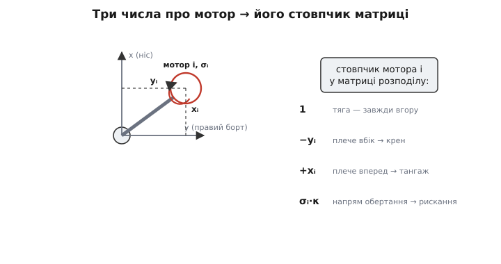

# 🧮 Матриця мікшера: від координат моторів до розподілу тяги

Мікшер квадрокоптера часто показують як готову табличку знаків: передньому — плюс, задньому — мінус, і так на кожну вісь. Табличка працює, але лишає відчуття, що знаки хтось підібрав руками, майже навмання. Насправді жоден знак і жоден коефіцієнт там не довільний — усі до одного **виводяться з геометрії**: з того, де сидить кожен мотор і куди крутиться його гвинт. А щойно ми навчимося будувати цю табличку строго, з координат, одразу відкриється й ширше: чому квадро має рівно один спосіб виконати команду, а гекса чи окто — нескінченно багато, і як із цієї безлічі машина обирає найощадніший. Зберімо весь апарат від першопричини.

## Що саме шукаємо: два боки однієї матриці

Домовмося про мову. У мотора є одне скалярне число, яким ми ним керуємо, — назвімо його **газ** (умовно, частка від нуля до одиниці; фізично це тяга, яку мотор зараз розвиває). Позначмо газ i-го мотора як `uᵢ`, а всі мотори разом — як стовпчик чисел `u = (u₁, u₂, …, uₙ)` для рами з n моторами.

З іншого боку — те, що ця рама робить із твердим тілом. Будь-який набір тяг, прикладених до жорсткого корпусу, зводиться до **чотирьох** чисел, які нас цікавлять у польоті: сумарна вертикальна тяга та три моменти навколо осей тіла — крен, тангаж, рискання. Складімо їх у стовпчик `w = (T, L, M, N)`: тяга, крен (roll), тангаж (pitch), рискання (yaw). Цей четвірний вектор «сила плюс момент» інженери звуть **вренч** (англ. *wrench* — гайковий ключ; так у механіці називають пару «сила + момент», бо ключем ви саме тиснете й крутите водночас).

Уся конфігурація рами — це правило, що зв'язує ці два стовпчики. І позаяк внесок кожного мотора у сумарну силу й момент **прямо пропорційний** його газу (подвоїли тягу мотора — подвоївся і його підйом, і його момент від плеча, і його реактивний закрут), зв'язок виходить **лінійним**. А лінійний зв'язок двох векторів — це завжди множення на матрицю:

```
w = A · u
```

Матриця `A` розміром 4×n і є **матриця розподілу** (англ. *allocation matrix*), або, з боку прошивки, **матриця мікшера**. Вона бере газ усіх моторів і каже, який сумарний вренч вони дають. Кожен її стовпчик — внесок **одного** мотора: що цей мотор додає до тяги, до крену, до тангажа, до рискання, коли його газ дорівнює одиниці. Побудувати конфігурацію означає заповнити цю матрицю з координат. А керувати — розв'язати рівняння **навпаки**: маємо бажаний вренч `w`, знайти газ `u`. Обидва боки — попереду.

> 🔧 **Навіщо це.** Матриця розподілу — це та єдина річ у польотнику, що змінюється від рами до рами; уся решта коду (стабілізатор, фільтри, керування двигунами) не знає й не хоче знати, скільки моторів і де вони. ArduPilot і PX4 буквально тримають таблицю таких матриць — по одній на кожну підтримувану геометрію (quad-X, quad-plus, hexa-X, octo-X, …), і зміна рами в налаштуваннях — це підстановка іншої матриці. Хто розуміє, звідки беруться її числа, той може завести нестандартну раму (наприклад, із нахиленими моторами чи несиметричними плечима), просто виписавши координати; хто ні — приречений копіювати чужі таблиці й не знати, чому апарат «тягне вбік».

## Стовпчик одного мотора: звідки беруться чотири числа

Візьмімо один мотор і випишемо, що він додає до кожної з чотирьох координат вренча, коли його газ дорівнює одиниці. Це і є його стовпчик у матриці `A`.

**Тяга (перший рядок).** Усі гвинти дивляться вертикально вгору відносно тіла, тож кожен мотор докладає до сумарної вертикальної тяги свою повну частку. Внесок у тягу — просто одиниця (у нормованих одиницях, де «газ = 1» означає «одна одиниця тяги»):

```
Aₜ,ᵢ = 1
```

**Крен і тангаж (другий і третій рядки).** Тут працює [момент сили](root:ph-mechanics/torque): тяга Tᵢ, прикладена на плечі від центра мас, дає момент, що дорівнює добутку сили на перпендикулярне плече. Розкладімо положення мотора на координати в осях тіла: `xᵢ` — уперед від центра, `yᵢ` — праворуч. Тоді вертикальна тяга на плечі `xᵢ` (уздовж курсу) створює момент **тангажа** — задирає чи опускає ніс, — а та сама тяга на плечі `yᵢ` (убік) створює момент **крену**. З точністю до знаку:

```
момент крену   Lᵢ = − yᵢ · (внесок тяги)
момент тангажа Mᵢ = + xᵢ · (внесок тяги)
```

Знаки — це просто вибір, куди дивляться додатні осі (тут: крен додатний на праве крило вниз, тангаж додатний на ніс угору), і вони випливають із [правила правої руки](root:ph-electromagnetism/right-hand-rule) для векторного добутку «плече × сила». Важливе не саме сузір'я знаків, а **пропорційність координаті**: чим далі мотор винесений уперед, тим більший його важіль на тангаж; чим далі вбік — тим більший на крен. Мотор, що сидить точно на поздовжній осі (yᵢ = 0), крену не дає зовсім; на поперечній (xᵢ = 0) — не дає тангажа. Ось чому геометрія розстановки — це буквально коефіцієнти керування: плечі `xᵢ`, `yᵢ` і є числа в рядках крену й тангажа.

**Рискання (четвертий рядок).** Це найтонше й найкрасивіше. Момент рискання створює не плече тяги, а [реактивний момент](root:ph-mechanics/reaction-torque) самого гвинта: щоб розкрутити гвинт, мотор давить на нього моментом, а гвинт рівним моментом давить назад — і цей зустрічний момент крутить раму навколо вертикалі. Його величина пропорційна тязі (з коефіцієнтом, що залежить від гвинта), а **знак** — це напрям обертання: гвинт, що крутиться за годинниковою, штовхає раму рискати в один бік, проти годинникової — у протилежний. Позначмо напрям обертання i-го мотора числом `σᵢ`, що дорівнює +1 для одного напряму й −1 для іншого. Тоді внесок у рискання:

```
момент рискання Nᵢ = σᵢ · κ
```

де `κ` — відношення реактивного моменту до тяги (стала гвинта). Це те місце, де в матрицю входить **не координата, а орієнтація**: рискання читає, куди крутиться кожен гвинт, а не де він стоїть.

Складімо чотири внески в один стовпчик. Для i-го мотора:

```
        ⎡  1   ⎤   ← тяга
столбець ⎢ −yᵢ  ⎥   ← крен
   Aᵢ  = ⎢ +xᵢ  ⎥   ← тангаж
        ⎣ σᵢ·κ ⎦   ← рискання
```

Ось і вся матриця розподілу: n таких стовпчиків поруч. Три речі про мотор — **де по x**, **де по y**, **куди крутиться** — повністю визначають його колонку, а отже, і всю його роль у керуванні. Жодного вільного параметра: заповнили координати — дістали матрицю.


*Як геометрія одного мотора стає стовпчиком матриці. Положення (xᵢ уперед, yᵢ убік) задає плечі: yᵢ входить у рядок крену, xᵢ — у рядок тангажа. Напрям обертання σᵢ (±1) задає знак у рядку рискання через реактивний момент. Тяга входить однаково для всіх. Уся конфігурація рами — це набір таких стовпчиків, по одному на мотор.*

## Ікс-квадрокоптер: заповнюємо матрицю числами

Проженімо це на найпоширенішій рамі — ікс-квадро. Чотири мотори на кінцях хреста, повернутого на 45°, тож усі однаково винесені й уперед-назад, і вбік. Хай плече по кожній осі однакове й дорівнює `d/√2` для кожного мотора (де d — довжина балки); щоб не тягнути дроби, приймемо для наочності `xᵢ`, `yᵢ` рівними ±1 в умовних одиницях плеча, а сталу гвинта `κ` теж за одиницю. Розставмо мотори й напрями (стандартна ікс-розкладка ArduPilot, дивлячись згори, ніс угору):

```
мотор            x (уперед)   y (праворуч)   σ (обертання)
передній-правий     +1           +1            −1  (CW)
задній-лівий        −1           −1            −1  (CW)
передній-лівий      +1           −1            +1  (CCW)
задній-правий       −1           +1            +1  (CCW)
```

Зверніть увагу на розкладку обертань: діагональні мотори (передній-правий і задній-лівий) крутяться в один бік, друга діагональ — у протилежний; сусідні завжди зустрічні. Це те, що на висінні гасить сумарний реактивний момент до нуля. Тепер підставмо кожен рядок у формулу стовпчика й складімо матрицю 4×4 (стовпчики — у порядку моторів вище: FR, RL, FL, RR):

```
       ⎡  1     1     1     1  ⎤   тяга    (усі +1)
       ⎢ −1    +1    +1    −1  ⎥   крен    (−yᵢ)
  A =  ⎢ +1    −1    +1    −1  ⎥   тангаж  (+xᵢ)
       ⎣ −1    −1    +1    +1  ⎦   рискання (σᵢ)
```

Прочитаймо матрицю очима фізики — рядок за рядком. Перший рядок суцільні одиниці: додай газу всім однаково — усі штовхнуть угору, апарат підніметься, і жоден момент не зміниться. Рядок крену: у правих моторів (FR, RR) стоїть −1, у лівих (RL, FL) +1 — тобто «крен праворуч» означає піддати газу лівим і прибрати правим, апарат хилиться вправо. Рядок тангажа: у передніх (FR, FL) +1, у задніх (RL, RR) −1 — «тангаж угору» задирає ніс, піддаючи переду. Рядок рискання повторює напрями обертання: рискати означає піддати газу парі, що крутиться в один бік, і прибрати в пари, що в інший, — сумарна тяга майже не зміниться, а баланс реактивних моментів порушиться, і апарат повернеться навколо вертикалі. Уся геометрія рами — оці шістнадцять чисел, і кожне з них ми щойно вивели з координати чи напряму обертання, а не підібрали.

Це **пряма** задача: знаючи газ, порахувати вренч. Але в польоті все навпаки — стабілізатор хоче **задати** вренч (тримай висоту, нахилися на стільки градусів, повернися) і мусить знайти газ. Тобто розв'язати `w = A·u` відносно `u`.

## Обернена задача для квадро: єдиний розв'язок

У квадрокоптера чотири мотори й чотири керовані величини — матриця `A` **квадратна**, 4×4. Чотири рівняння, чотири невідомих. Якщо ці рівняння незалежні (а вони незалежні, коли рама не вироджена — мотори справді рознесені й обертання збалансовані), розв'язок існує й він **один-єдиний**. Мовою лінійної алгебри — матриця оборотна, і газ знаходять множенням на обернену матрицю:

```
u = A⁻¹ · w
```

Обернена матриця `A⁻¹` — це і є той самий мікшер, тільки записаний з боку керування: вона бере бажані [тяга, крен, тангаж, рискання] і видає рівно один набір газу, що їх дасть. Для нашої ікс-матриці обернена рахується руками (усі стовпчики взаємно ортогональні, тож обернена — це просто транспонована з поділеними на 4 елементами), і виходить знайома всім чотирирядкова формула мікшера:

:::tabs
```cpp
// w = [thr, roll, pitch, yaw] → газ чотирьох моторів
// це буквально рядки A⁻¹, зведені зі знаків матриці A вище
float u_fr = thr - roll + pitch - yaw;   // передній-правий (CW)
float u_rl = thr + roll - pitch - yaw;   // задній-лівий    (CW)
float u_fl = thr + roll + pitch + yaw;   // передній-лівий  (CCW)
float u_rr = thr - roll - pitch + yaw;   // задній-правий   (CCW)
```
```python
# w = [thr, roll, pitch, yaw] → газ чотирьох моторів
# це буквально рядки A⁻¹, зведені зі знаків матриці A вище
u_fr = thr - roll + pitch - yaw   # передній-правий (CW)
u_rl = thr + roll - pitch - yaw   # задній-лівий    (CW)
u_fl = thr + roll + pitch + yaw   # передній-лівий  (CCW)
u_rr = thr - roll - pitch + yaw   # задній-правий   (CCW)
```
:::

Придивіться: знаки в кожному рядку — це точно стовпчик матриці `A` для того мотора, лише прочитаний згори вниз як внески thr/roll/pitch/yaw. Пряма й обернена матриці для квадро — дзеркальні (транспонування з масштабом), бо стовпчики ортогональні. Саме тому мікшер квадрокоптера — «чотири рядки додавання»: це записана в коді обернена матриця, а не евристика.

І тут ховається сувора межа. Раз матриця квадратна й оборотна, у бажаного вренча є **рівно один** відповідник у газі — ні більше, ні менше. Це чудово (нема неоднозначності, рахувати легко), але це й **крихкість**. Якщо один мотор відмовив, у матриці зникає стовпчик, лишається 4×3 — три мотори проти чотирьох вимог. Три рівняння не покриють чотирьох невідомих: неможливо одночасно тримати тягу, крен, тангаж і рискання трьома моторами. Квадрокоптер із мертвим мотором мусить чимось пожертвувати — зазвичай жертвують рисканням, входячи в кероване обертання-спуск, бо втримати висоту й нахил важливіше. Причина падіння тут не «мало потужності», а чиста алгебра: **у квадрокоптера рівно стільки керувань, скільки вимог, запасу немає жодного**.

## Більше моторів: нескінченно багато розв'язків

Тепер гекса (шість) чи окто (вісім). Осей керування так само чотири — рама не вміє більшого, ніж тяга плюс три моменти. Але моторів більше, тож матриця `A` стає **широкою**: 4×6 у гекси, 4×8 в окто. Чотири рівняння — шість чи вісім невідомих. Рівнянь **менше**, ніж невідомих, а це змінює все.

Система, де невідомих більше за рівняння, або не має розв'язку зовсім, або має їх **нескінченно багато**. Для нашої задачі — саме нескінченно багато: той самий бажаний вренч можна дістати безліччю різних розкладів газу по моторах. Уявити це легко на прикладі. Хай нам треба лише сумарну тягу вгору, без жодного моменту. У гекси це можна зробити, піддавши газу всім шести порівну — а можна двом протилежним моторам додати, а іншим двом протилежним стільки ж прибрати: моменти від цих зустрічних змін погасяться, а сумарна тяга й баланс лишаться ті самі. Обидва розклади дають **однаковий** вренч, але **різний** газ. І таких варіантів — континуум.

Ось де народжується **надлишковість** (англ. *redundancy*), про яку кажуть, коли хвалять гексу й окто. Зайві мотори не дають нових напрямів руху — рама лишається чотиривимірною за керуванням, — але дають **свободу вибору**, як цих чотирьох величин досягти. А свобода вибору — це рівно те, що рятує при відмові: коли мотор мертвий, у матриці зникає його стовпчик, лишається 4×5 чи 4×7 — усе ще **більше** стовпчиків, ніж рядків, отже, розв'язок усе ще існує. Октокоптер долітає й сідає з заглухлим мотором не тому, що він потужніший, а тому, що після втрати одного в нього **лишається надлишок**, і решта моторів перерозподіляється, зберігаючи всі чотири керма.

> 🔧 **Навіщо це.** Це прямий інженерний обмін, вписаний у розмірність матриці. Квадро (A квадратна) — легко, дешево, нуль запасу: втрата мотора = втрата керма. Гекса й окто (A широка) — важче й дорожче, зате континуум розв'язків, з якого відмова забирає лише один вимір, а не валить систему. Тому дрон-іграшку роблять квадро, а апарат над людьми чи з дорогою камерою — гекса або окто. І коли в польотнику вмикають «резервування на відмову мотора», під капотом це саме той факт, що широку матрицю можна обернути й після викидання стовпчика.

Але якщо розв'язків нескінченно багато, який із них узяти? Треба правило вибору — і воно теж не довільне.

## Псевдообернена: як обрати найощадніший розв'язок

Коли розв'язків континуум, розумно взяти той, що **найдешевший** — найменший за сумарним газом. Формалізуймо «найдешевший» як найменшу суму квадратів газу, `u₁² + u₂² + … + uₙ²` (евклідова довжина вектора газу). Чому квадрати, а не просто суму? Бо мінімум суми квадратів розкидає навантаження **рівномірно** між моторами: він уникає рішень, де один мотор виє на повну, а сусід майже стоїть. Рівномірний розподіл — це і менший знос, і більший запас угору (жоден мотор не впирається в стелю передчасно), і менший нагрів. Отже, серед усіх розкладів газу, що дають потрібний вренч, шукаємо той, у якого евклідова довжина найменша.

Ця задача — «розв'яжи недовизначену систему з мінімальною нормою розв'язку» — має точний і давно відомий розв'язок. Його дає **псевдообернена матриця Мура–Пенроуза** (англ. *Moore–Penrose pseudoinverse*), позначувана `A⁺`. Для широкої матриці повного рангу вона рахується явною формулою:

```
A⁺ = Aᵀ · (A · Aᵀ)⁻¹
```

і газ знаходять так само просто, як у квадратному випадку, лише зі значком «плюс» замість «мінус один»:

```
u = A⁺ · w
```

Ключова властивість `A⁺`: серед **усіх** розв'язків рівняння `A·u = w` (а їх нескінченно багато) вона видає **рівно той**, що має найменшу евклідову довжину. Тобто автоматично — найощадніший, найрівномірніший розподіл газу. Псевдообернена не «наближає» розв'язок і не «одну з можливих» видає навмання: вона строго вибирає єдиний найкоротший вектор газу з усього континууму. Для квадратної оборотної матриці, до речі, `A⁺` збігається зі звичайною `A⁻¹` — тобто це чесне узагальнення інверсії на неквадратний випадок, а квадрокоптер — просто окремий випадок, де вибирати нема з чого.

Історія тут гарна й повчальна. Поняття псевдооберненої першим означив американський математик **Еліаким Гастінґс Мур** ще 1920 року — але його стаття була написана настільки громіздким власним записом, що майже ніхто її не читав, і ідея заглухла на тридцять п'ять років. Незалежно, нічого не знаючи про Мура, її переоткрив британський фізик і математик **Роджер Пенроуз** 1955 року — і вже його ясне формулювання зробило псевдообернену робочим інструментом усієї прикладної математики. Звідси й подвійне ім'я. *(Статус: усталений факт; обидві публікації задокументовано, пріоритет Мура визнано, повторне відкриття Пенроуза — самостійне.)* Те, що сьогодні в польотнику розкладає газ восьми моторів, — це формула, чиє коріння лежить у двох незалежних відкриттях, розділених третиною століття.

**Порахуймо мінімально-нормовий розподіл на іграшковому прикладі.** Візьмімо симетричну гексу й попросимо **чистий підйом**: вренч `w = (T, 0, 0, 0)` — тяга T, нуль моментів. Формула `A⁺` для симетричної рами дасть очевидно правильну відповідь, і на ній видно, що робить мінімум норми:

```
бажане:  T угору, без моментів
розв'язків безліч, серед них:
  (а) усім шести порівну:  uᵢ = T/6  кожному
  (б) двом по T/2, решті нуль, а моменти догашені іншою парою…
евклідова довжина:
  (а) √(6 · (T/6)²) = T/√6  ≈ 0.408·T   ← найменша
  (б) будь-який нерівномірний розклад → довша
```

Псевдообернена обирає варіант (а) — рівний газ на всіх, найкоротший вектор. Це збігається зі здоровим глуздом (щоб просто піднятися, тисни всіма однаково), і саме такий вибір робить `A⁺` **автоматично** в будь-якій ситуації, зокрема й у несиметричній рамі чи після відмови мотора, де очевидного «порівну» вже немає, а найощадніший розв'язок усе одно єдиний і рахується тією самою формулою.

> 🔧 **Навіщо це.** У реальному польотнику `A⁺` для кожної підтримуваної рами **порахована наперед** і зашита як стала матриця — множення 8×4 на кожному циклі керування дешеве, а обертати матрицю в реальному часі не треба. Коли ж стається відмова мотора, розумніші автопілоти **перебудовують** матрицю на льоту: викидають стовпчик мертвого мотора й рахують нову псевдообернену з рештою — і апарат летить далі на тому, що лишилось, з найощаднішим із можливих розподілів. Це і є «control allocation» у чистому вигляді: стабілізатор думає в термінах бажаного вренча, а окремий шар перекладає вренч у газ через `A⁺`, нічого не знаючи про політ, — лише про геометрію.

## Насичення: коли найкращий розв'язок не влазить

Лишилася чесна межа, яку матриця сама по собі не бачить. І `A⁻¹`, і `A⁺` видають газ, вважаючи, що мотор може дати будь-яке значення. Насправді газ обмежений: не менше нуля (гвинт не тягне «вниз») і не більше стелі (повний газ). Порахований розподіл може вилізти за ці межі — надто різка команда попросить від якогось мотора більше одиниці. Просто **обрізати** порушника не можна: обрубаєш один газ — зіб'ється баланс моментів, і апарат смикне на незапланований нахил чи рискання. Це та сама пастка, що й у квадро, тільки тепер із матрицею.

Найпростіше й найнадійніше правило рятує пріоритетом: **тягою жертвуємо, моментами — ні**. Спершу рахуємо повний розподіл, тоді, якщо пік вилетів за стелю, **пропорційно тиснемо всю тягову складову** (спільний рівень газу), лишаючи різниці між моторами — тобто моменти — цілими:

:::tabs
```cpp
// u[] — газ n моторів після множення на псевдообернену/обернену
float peak = 0.0f;
for (int i = 0; i < n; i++) if (u[i] > peak) peak = u[i];
if (peak > 1.0f) {                 // хтось вилетів за повний газ
    float k = 1.0f / peak;         // спільний коефіцієнт стискання
    for (int i = 0; i < n; i++)
        u[i] *= k;                 // тиснемо ВСІ пропорційно —
}                                  // різниці (моменти) зберігають співвідношення
```
```python
# u[] — газ n моторів після множення на псевдообернену/обернену
peak = u.max()
if peak > 1.0:                     # хтось вилетів за повний газ
    k = 1.0 / peak                 # спільний коефіцієнт стискання
    u *= k                         # тиснемо ВСІ пропорційно —
                                   # різниці (моменти) зберігають співвідношення
```
:::

Чому пропорційне стискання зберігає керування, а обрізання — ні? Бо множення всіх газів на один коефіцієнт `k` масштабує й суму (тягу), і всі різниці (моменти) **однаково** — напрямок вренча в просторі не змінюється, коротшає лише його довжина: апарат трохи просідає по висоті, але не збивається з нахилу й курсу. Обрізання ж одного мотора рве саме різниці, тобто моменти, — і платиш незапланованим кидком по осі. Це остання ланка, що робить матрицю робочою в реальному залізі: сама алгебра дає ідеальний розподіл, а фізична стеля мотора вимагає стискати його з розумом, зберігаючи те, що дорожче за висоту, — орієнтацію.

Отак замикається вся картина. Геометрія рами — координати й обертання моторів — заповнює матрицю розподілу `A` по стовпчиках. Квадратна `A` квадрокоптера обертається однозначно (`A⁻¹`), даючи знайомі чотири рядки мікшера й нуль запасу на відмову. Широка `A` гекси й окто має континуум розв'язків, з якого псевдообернена Мура–Пенроуза `A⁺` витягає найощадніший — і цей самий надлишок дозволяє долетіти на мертвому моторі. А фізична стеля газу додає останнє правило: стискай пропорційно, бережи моменти. Уся конфігурація, від таблиці знаків до резервування на відмову, виявляється не набором рецептів, а однією матрицею та її оберненням.
