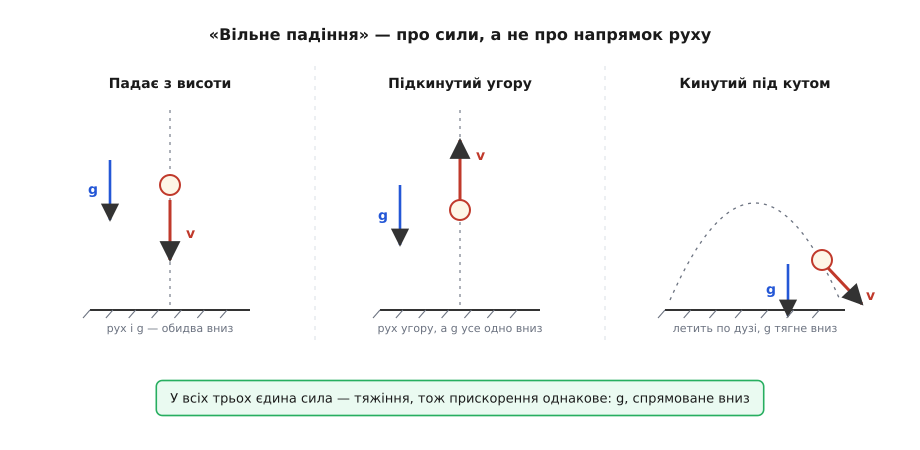
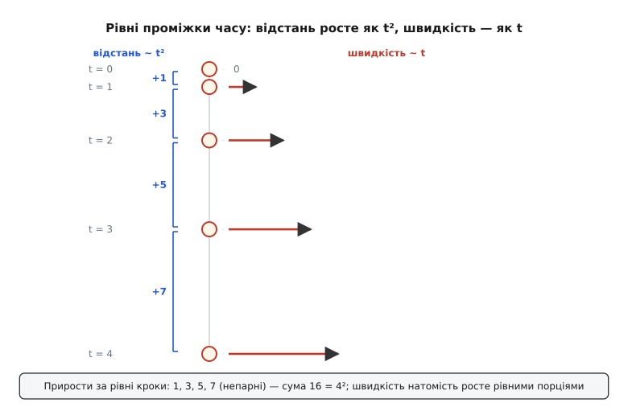
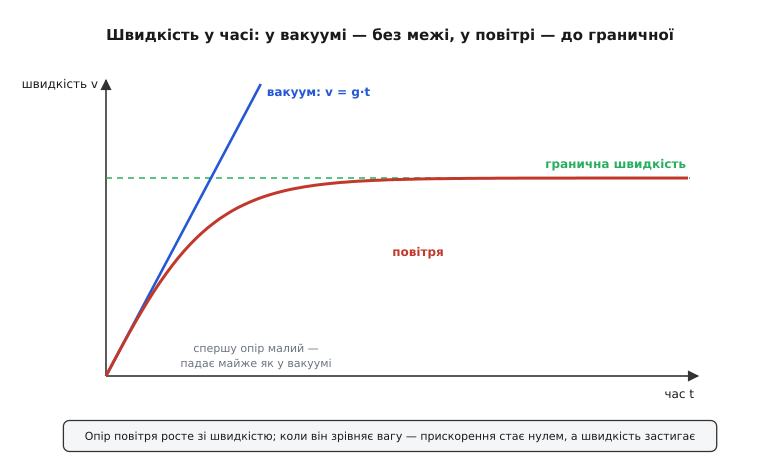

# Вільне падіння: рух, у якому діє саме тяжіння

<preknowlist>
- [Швидкість](root:ph-mechanics/velocity) — як швидко й куди змінюється положення тіла; вектор із напрямком і величиною.
- [Прискорення](root:ph-mechanics/acceleration) — швидкість зміни швидкості; вільне падіння — це рух зі сталим прискоренням.
- [Другий закон Ньютона](root:ph-mechanics/newtons-second-law) — сила = маса · прискорення (F = m·a); звідси випливе, чому прискорення падіння не залежить від маси.
- [Закон всесвітнього тяжіння](root:ph-mechanics/newton-gravitation) — тіла притягуються; біля Землі це дає силу ваги m·g, спрямовану вниз.
</preknowlist>

Кинь камінь і пір'їнку з однієї висоти — камінь ляже перший, і це так очевидно, що на цьому збудувалася ціла антична фізика: Арістотель учив, що важче тіло падає швидше, ще й рівно в стільки разів, у скільки воно важче. Понад дві тисячі років у це вірили, бо на власні очі так і виходить. І все ж це обман зору — винне не тяжіння, а повітря. Прибери повітря — і камінь із пір'їнкою полетять пліч-о-пліч, торкнувшись дна в одну мить. Саме цей очищений від сторонніх завад рух — коли на тіло діє **лише** тяжіння й нічого більше — фізика й називає **вільним падінням**.

Слово «вільне» тут варто взяти всерйоз: воно не про напрямок «униз», а про свободу від усього іншого. Тіло вільне, бо ніщо його не тримає й не штовхає — ні опертя підлоги, ні тяга двигуна, ні (в ідеалі) чіпляння повітря. Лишається одна-єдина сила, тяжіння, і саме тому падіння виходить таким на диво простим і однаковим для всіх.

### «Вільне» — це не «вниз»

Якщо вільне падіння означає «жодної сили, крім тяжіння», то під це означення підпадає значно більше рухів, ніж просто камінь із даху. М'яч, підкинутий угору, поки він ще летить вгору й гальмує, — теж у вільному падінні: щойно він покинув руку, єдина сила на ньому — тяжіння, яке так само тягне вниз, лише зараз проти руху. Куля, кинута під кутом, малює в повітрі дугу — це те саме вільне падіння, тільки з домішком сталої горизонтальної швидкості, і саме тяжіння загинає її політ у [параболу](root:ph-mechanics/projectile-motion) (гр. *parabolḗ* — прикладання, зіставлення). І навіть Міжнародна космічна станція не «вилетіла за межу тяжіння» — на її висоті воно майже таке ж, як біля поверхні; вона просто вільно падає, безупинно «промахуючись» повз Землю через величезну бічну швидкість. Ще Ньютон уявляв гармату на високій горі: клади заряд дедалі більший — і ядро падатиме все далі, аж поки не почне огинати планету, ніколи її не досягаючи. Орбіта — це падіння, якому забракло куди впасти.

Усі ці рухи, такі різні на вигляд, поєднує одне: те саме прискорення, спрямоване вниз, однакове до останньої цифри для будь-якого тіла. Його позначають **g** і звуть прискоренням вільного падіння.


*Три різні на вигляд рухи, а сила одна. Ліворуч камінь просто падає; посередині м'яч летить угору й гальмує; праворуч куля летить по дузі. У кожному випадку єдина сила — тяжіння, тож прискорення всюди те саме: g униз. «Вільне» стосується сил, а не напрямку руху.*

Те, що це прискорення однакове для всіх тіл — важких і легких, залізних і дерев'яних, — річ зовсім не очевидна, і за нею ховається одна з найглибших рівностей природи. Чому важке й легке падають однаково, докладно розбирає [принцип еквівалентності](root:ph-mechanics/equivalence-principle): коротко, «важкість» тіла (те, за що хапається тяжіння) і його інертність (опір розгону) виявляються тим самим числом, тож у рівнянні падіння маса просто скорочується й зникає. Тут нам досить самого факту: прибравши повітря, будь-які два тіла падають нога в ногу.

### Як росте падіння: швидкість і відстань

Найцікавіше починається, коли спитати не «чи падає», а «як саме росте цей рух у часі». Прискорення g стале — це означає, що щосекунди швидкість додає одну й ту саму порцію. Через секунду після старту тіло має швидкість близько 9.81 м/с, через дві — вдвічі більшу, через три — втричі. Швидкість росте рівномірно, прямою лінією:

```
v = g · t
```

А от пройдена відстань росте вже не прямою. Причина причинно-наслідкова: що далі, то швидше летить тіло, тож у кожну наступну секунду воно встигає покрити більший шлях, ніж у попередню. За першу секунду падіння — приблизно 4.9 м, за другу — вже 14.7 м, за третю — 24.5 м. Ці прирости йдуть як непарні числа 1 : 3 : 5, а повна пройдена висота набігає як **квадрат** часу:

```
h = ½ · g · t²
```

Саме цю залежність — відстань пропорційна квадратові часу — на початку XVII століття вивів Ґалілео Ґалілей, і вивів хитро, бо падіння надто швидке для тогочасних годинників: він сповільнив його, пускаючи кулі котитися пологими жолобами, і виміряв, що за подвоєний час куля проходить учетверо довший шлях. Уся ця історія — від хибної Арістотелевої догми до Ґалілеєвих жолобів, водяного годинника й «правила непарних чисел» — зібрана [окремо](root:ph-mechanics/free-fall/hist-galileo-fall.md).


*Положення тіла, зняті через рівні проміжки часу. Повна відстань від старту росте як квадрат часу (1, 4, 9, 16), тому проміжки між сусідніми спалахами розтягуються як непарні числа (1, 3, 5, 7). Стрілки праворуч — швидкість: вона, навпаки, росте рівномірно, бо прискорення стале.*

Ці дві формули — весь кінематичний кістяк вільного падіння; строге їх виведення (як із незмінного g інтегруванням народжуються `v = g·t` і `h = ½g·t²`, і як звідси випадає зручна `v² = 2g·h` без часу) винесено в [окрему математичну вставку](root:ph-mechanics/free-fall/math-fall-kinematics.md).

**Приклад (падіння з даху).** Камінь зривається з краю даху заввишки 20 м. Скільки він летітиме й з якою швидкістю вдариться об землю (повітрям нехтуємо)?

```
h = ½ · g · t²        →    t = √(2h / g)
t = √(2 · 20 / 9.81) = √4.077 ≈ 2.02 с
v = g · t = 9.81 · 2.02 ≈ 19.8 м/с   (≈ 71 км/год)
```

Дві секунди — і майже 20 м/с. Зверніть увагу на те, чого в розрахунку **немає**: маси. Вона ніде не з'явилася, бо в чистому вільному падінні прискорення однакове для всіх. Дрібний камінець і важкенна брила, зірвавшись із того самого даху, ляжуть на землю одночасно.

> 🔧 **Навіщо це.** Ці ж формули — робочий інструмент, а не шкільна вправа. Знаючи час падіння, легко відновити висоту: секундомір, скинутий у колодязь камінь і `h = ½g·t²` дають глибину без жодної рулетки. У зворотний бік цим живе автоматика: коли смартфон чи ноутбук зривається зі столу, усі осі його акселерометра дружно йдуть до нуля (у вільному падінні тіло не тисне саме на себе) — за цією ознакою пристрій за десяті частки секунди встигає припаркувати голівку диска чи згорнути дані до удару.

### Скільки саме — величина g

Число g біля поверхні Землі — приблизно **9.81 м/с²**. Читати його треба так: щосекунди падаюче тіло додає до своєї швидкості 9.81 метра за секунду. Одиниця «метр за секунду **за секунду**» саме це й каже — приріст швидкості (м/с) за кожну секунду.

Звідки береться саме таке число? Його диктує [закон всесвітнього тяжіння](root:ph-mechanics/newton-gravitation): тяжіння планети біля її поверхні дає прискорення `g = G·M / R²`, де M — маса Землі, R — її радіус, G — гравітаційна стала. Підставивши масу й радіус Землі, дістаємо ті самі ≈ 9.81 м/с². А що тіло падає з висоти кількох метрів чи кількох десятків метрів — мізерна дещиця проти шеститисячокілометрового радіуса, тож R майже не змінюється, і g на всіх «людських» висотах можна вважати сталим. Це і є та зручна незмінність, на якій тримаються обидві формули падіння.

«Приблизно» тут не випадкове. Земля не ідеальна куля — вона трохи сплюснута й обертається, тож g залежить від місця: близько 9.78 м/с² на екваторі й аж 9.83 м/с² на полюсах (там поверхня ближча до центра, та й відцентровий ефект обертання не «підважує» тіло). Для точних розрахунків умовилися про єдине **стандартне** значення `g₀ = 9.80665 м/с²` — саме ним, наприклад, переводять масу у вагу за міжнародною угодою. Для повсякденних оцінок беруть 9.81, а часто й зовсім кругле 10 — з похибкою десь у два відсотки.

### Коли втручається повітря: гранична швидкість

Усе це — про **чисте** вільне падіння, у вакуумі. У повітрі картина інша, і саме тут ховається розгадка Арістотелевого обману. На тіло, що летить крізь повітря, окрім тяжіння діє ще й [сила опору](root:ph-mechanics/aerodynamic-drag) — повітря доводиться розштовхувати, і воно опирається тим дужче, чим швидше тіло крізь нього продирається (приблизно пропорційно квадратові швидкості).

Простеж, що з цього виходить. На старті тіло майже нерухоме — опір мізерний, і воно падає майже як у вакуумі, з прискоренням g. Але з розгоном опір швидко росте, тяжіння дедалі більше «з'їдається», прискорення тане. Настає мить, коли сила опору догнала силу ваги й зрівноважила її: рівнодійна — нуль, прискорення зникає, і тіло далі летить із **сталою** швидкістю. Її звуть **граничною швидкістю**, або термінальною (від лат. *terminus* — межа, край):

```
опір(v) = вага        →    сталий v, падіння без прискорення
```

Ось де ховалася Арістотелева помилка. Пір'їнка відстає від каменя не тому, що легша сама по собі, а тому, що в неї велика площа при крихітній вазі — опір «наздоганяє» її вагу майже одразу, і граничну швидкість вона має сміховинно малу. Камінь при тій самій формі важчий, тож опору доводиться рости куди довше, поки він зрівняється з вагою, — і гранична швидкість каменя велика. Не вага вирішує, а її співвідношення з опором. Парашутист у вільному падінні «пузом донизу» розганяється секунд десять-дванадцять до граничних ≈ 55 м/с (близько 195 км/год) і далі летить рівномірно; розкритий парашут різко збільшує площу — гранична швидкість падає до кількох метрів за секунду, і приземлення стає безпечним.


*Швидкість падіння в часі. У вакуумі (пряма) вона росте без упину — v = g·t. У повітрі крива спершу йде поряд із прямою, а тоді вигинається й лягає на горизонтальну поличку: опір зрівнявся з вагою, прискорення впало до нуля, швидкість застигла на граничному значенні.*

Як саме крива виходить на цю поличку — питання вже не арифметики, а числового інтегрування рівняння руху з опором; маленький робочий [код-приклад](root:ph-mechanics/free-fall/proj-terminal-velocity.md), що крок за кроком розраховує v(t) і показує народження граничної швидкості, винесено окремо.

> 🔧 **Навіщо це.** Гранична швидкість — не абстракція, а причина, чому світ узагалі придатний для життя. Дощова крапля, падаючи з кілометрової хмари, у вакуумі набрала б понад 140 м/с і била б, як куля; повітря ж утримує її на скромних кількох метрах за секунду. Той самий розрахунок — основа проєктування парашутів, гальмівних щитків спускних апаратів і навіть оцінки, чи виживе прилад, скинутий із висоти: важить не сама висота падіння, а гранична швидкість, до якої тіло встигає розігнатися.

### Найглибше: падаючи, ти нічого не важиш

Є в вільному падінні риса, яка на перший погляд суперечить здоровому глузду, а насправді є найважливішим у всій темі. Коли ти вільно падаєш — ти **не відчуваєш власної ваги**. Зовсім.

Придивись, чому. Вага, яку ми відчуваємо щомиті, — це насправді не тяжіння само по собі, а тиск опори: стільця під тобою, підлоги під ногами. Тяжіння тягне рівномірно кожну клітинку тіла, і саме по собі воно невідчутне; відчуваємо ми лише те місце, де щось нас **не пускає** падати — упирається знизу. Прибери опору — випади разом зі стільцем у прірву — і тиску нема, бо ніщо тебе вже не стримує: усі частинки тіла падають з тим самим g, ніхто нікого не підпирає. Настає невагомість. Не тому, що тяжіння зникло (воно на місці й старанно тебе розганяє), а тому, що воно тягне все однаково й тиснути стало нічому.

Саме тому космонавти на станції плавають — не через відсутність тяжіння (на орбіті воно майже земне), а через те, що станція вільно падає, і всі всередині падають разом із нею. Саме тому випущений у падаючій кабіні м'ячик не летить донизу, а спокійно висить поряд. Прилад, що міряє прискорення, — акселерометр — у вільному падінні показує строго нуль: він реєструє не тяжіння, а лише поштовх опори, якого зараз якраз немає. Формально це називають нульовим [власним прискоренням](root:ph-mechanics/proper-acceleration): падаюче тіло не відчуває **нічого**.

Ця думка — що вільне падіння місцево нічим не відрізняється від невагомого спокою в порожнечі — і стала тим зерном, з якого Айнштайн виростив сучасну теорію тяжіння, назвавши її найщасливішою думкою свого життя. Докладніше ця нерозрізненність тяжіння й прискорення розібрана в [принципі еквівалентності](root:ph-mechanics/equivalence-principle); нам же досить побачити, що звичне «падати» і незвичне «нічого не важити» — це буквально те саме явище, побачене зсередини.

### Що лишається

Вільне падіння — це не просто «рух униз», а найпростіший з усіх можливих рухів: тіло, звільнене від усього, крім тяжіння. У такому русі маса нічого не важить — усі тіла падають з однаковим прискоренням g ≈ 9.81 м/с²; швидкість росте рівномірно (v = g·t), а пройдена висота — як квадрат часу (h = ½g·t²). Повітря псує цю чистоту, вводячи опір, і саме воно, а не вага, розводить камінь із пір'їнкою й обмежує падіння граничною швидкістю. А в самій серцевині явища — тихий парадокс: той, хто вільно падає, не відчуває ваги зовсім, бо вага — це не тяжіння, а лише опір того, що тримає нас від падіння. Прибери опору — і лишиться найвільніший рух у природі.
