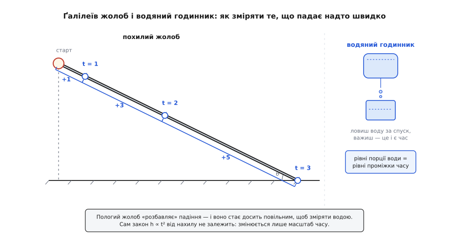
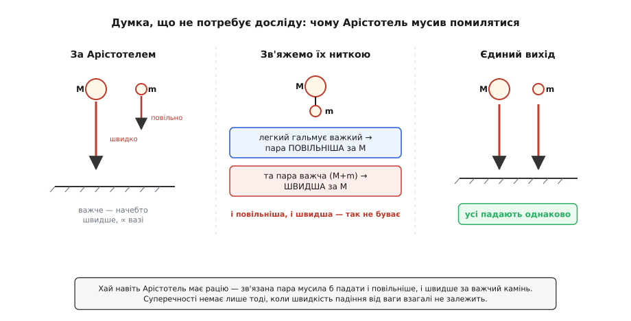
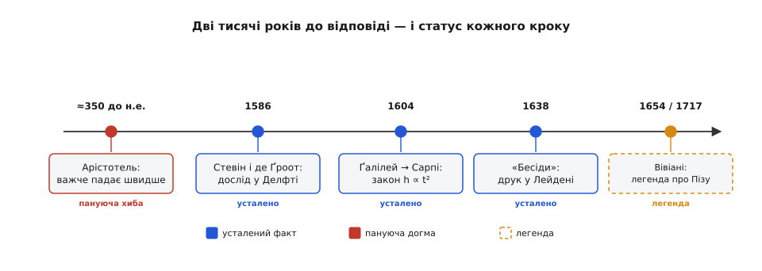

# 📜 Як побороли «очевидне»: історія вільного падіння

> Ця вставка — не про формулу `h = ½g·t²`, а про те, як людство дві тисячі років вірило власним очам і помилялося. Історія тут про одну вперту догму, про ченця-математика, якому першому написали правильний закон, про воду, що служила годинником, — і про легенду з вежею, яку насправді придумав відданий учень уже після смерті вчителя.

Найпростіші істини даються найважче — саме тому, що здаються очевидними. Кинь важкий камінь і легкий листок — камінь ляже перший. Це бачить кожен, і з цього «кожен бачить» виросла ціла антична фізика, яка протрималася довше за будь-яку імперію. Щоб її повалити, знадобилося не спростувати спостереження (воно правильне), а зрозуміти, що воно про **повітря**, а не про **тяжіння**. На цей поворот думки пішли двадцять століть.

## «Важче падає швидше» — догма на дві тисячі років

Автором догми був **Арістотель** (гр. *Aristotélēs*, 384–322 до н.е.) — і це усталений історичний факт, засвідчений його ж трактатами «Фізика» та «Про небо». Він учив дві речі. Перша: швидкість падіння пропорційна до ваги — тіло вдесятеро важче падає вдесятеро швидше. Друга: та сама швидкість обернено пропорційна до густини середовища — у воді все тоне повільніше, ніж у повітрі, бо вода густіша. Звідси, до речі, Арістотель робив висновок, що порожнечі бути не може: у порожнечі опір нульовий, тож швидкість стала б нескінченною, а це, вважав він, безглуздя.

Варто спинитися й оцінити, чому цю думку не спростовували так довго. Річ не в чиїйсь дурості. По-перше, вона **узгоджується з досвідом**: у повітрі важчі тіла й справді часто падають швидше за легкі, і це видно щодня. По-друге, за нею стояв **найбільший авторитет** західної думки — заперечити Арістотелеві означало заперечити мало не саму логіку. По-третє, і це головне, **вимагати досліду ще не було звичкою**. Природу пізнавали міркуванням, а не мірянням; сама ідея, що істину про рух треба не вивести з засад, а **виміряти секундоміром**, ще мусила народитися. Догма протрималася так довго не всупереч розумові, а тому, що розум тодішній працював інакше.

## Перший чесний дослід був не в Пізі, а в Делфті

Тут варто одразу спростувати найпоширенішу оману. Славетний образ — учений скидає з високої вежі два різні тягарці, і ті вдаряються об землю разом, присоромивши Арістотеля, — **справді був**. Тільки не в Пізі й не з Ґалілеєм.

1586 року, за два роки до того, як Ґалілей узагалі почав викладати, двоє в голландському Делфті піднялися на вежу Ньївекерк і скинули додолу два олив'яні кулі — одна вдесятеро важча за другу. Кулі впали з висоти футів у тридцять і вдарились об дошку внизу майже в одну мить, з одним звуком. Це документований дослід, описаний того ж року в книжці «Начала мистецтва зважування» (нід. *De Beghinselen der Weeghconst*).

Зробили його **Симон Стевін** (нід. *Simon Stevin*, 1548–1620) — фламандець із Брюґе, блискучий інженер і математик на службі Нідерландів, — і його друг **Ян Корнетс де Ґроот** (нід. *Jan Cornets de Groot*, 1554–1640), бургомістр Делфта й батько майбутнього славетного правника Гуґо Ґроція. Двоє людей, фламандець і голландець, за півжиття до Ґалілеєвих «Бесід» показали руками те, що суперечило Арістотелеві. Слава дісталася не їм — почасти тому, що Стевін писав рідною говіркою, а не латиною, і його читала менша частина вченого світу. Але честь першого відкритого спростування належить Делфту, і про це варто пам'ятати щоразу, коли хтось згадує «вежу».

## Головна хитрість Ґалілея: сповільнити падіння

**Ґалілео Ґалілей** (італ. *Galileo Galilei*, 1564–1642) зробив більше, ніж показав рівність падіння. Він поставив зовсім інше питання — не «чи однаково падають», а «**за яким законом** росте падіння в часі». І тут постала перешкода, об яку розбилися б усі попередники: вільне падіння **надто швидке**. За першу секунду тіло пролітає майже п'ять метрів; годинників, здатних розрізнити такі частки секунди, у 1600 році просто не існувало. Виміряти падіння наосліп було неможливо.

Ґалілеїв хід був геніальний саме простотою: якщо падіння не вповільнити не можна, то його треба **розбавити**. Пусти кулю не сторч, а котитися пологим жолобом — і те саме тяжіння діятиме лише малою своєю часткою вздовж схилу. Рух стане в багато разів повільнішим, залишаючись тим самим рухом зі сталим прискоренням. Що пологіший жолоб, то повільніша куля — аж до швидкостей, які вже можна зловити.

Прилад він описав згодом сам: дерев'яна дошка близько дванадцяти ліктів завдовжки — метрів із сім, — з рівним, вигладженим і обклеєним пергаментом жолобком, яким котилася тверда відполірована бронзова куля. Лишалося зміряти час. І тут — друга проста хитрість. Годинником Ґалілеєві правила **вода**: під час кожного спуску він відкривав тонку трубку, і вода текла в посудину; наприкінці спуску трубку затуляв. Потім цю воду він **зважував**. Ваги води прямо пропорційні до часу спуску — тож відношення часів він читав із відношення ваг, точнісінько й повторюваними разами. Сам Ґалілей запевняв, що збіг вимірів був кращий за десяту частку удару пульсу, і повторив дослід сотні разів.

*Аби зміряти надто швидке падіння, Ґалілей його «розбавив»: на пологому жолобі рух той самий, лише в багато разів повільніший. Час він міряв вагою води, що витекла за спуск. За рівні проміжки куля проходить 1, 4, 9 — відстань як квадрат часу; прирости між ударами йдуть як непарні 1, 3, 5.*

І ось що він вичитав із цих спусків. Подвоїш час — куля проходить учетверо довший шлях; потроїш — увосьмеро… ні, у **дев'ятеро**. Відстань наростає як **квадрат часу**. А те саме іншими словами: за перший, другий, третій рівні проміжки куля долає відрізки, що відносяться як непарні числа — 1, 3, 5, 7. Це і є славнозвісне Ґалілеєве «правило непарних чисел», і воно тотожне закону `h ∝ t²`, бо сума перших непарних чисел якраз дає повні квадрати: 1, 1+3=4, 1+3+5=9, 1+3+5+7=16.

> 🔧 **Навіщо це.** Ґалілеїв прийом — «не можеш зміряти явище прямо, зроби його повільнішим чи більшим, зберігши суть» — став наскрізним методом усієї експериментальної науки. Так само сповільнюють хімічні реакції охолодженням, розтягують у часі швидкі процеси стробоскопом і швидкісною камерою, збільшують дрібне мікроскопом. Уміння підібрати «розбавлений» варіант задачі, у якому та сама фізика стає доступною приладам, — це половина ремесла експериментатора донині.

## Закон у листі: 16 жовтня 1604 року, ченцеві Сарпі

Найраніший твердий слід цього відкриття — не книга, а приватний лист. 16 жовтня 1604 року Ґалілей пише до Венеції своєму другові й дорадникові. Той друг — постать, варта окремого слова: **Паоло Сарпі** (італ. *Paolo Sarpi*, 1552–1623), венеційський чернець-сервіт, якого звали «фра Паоло». Богослов, каноніст, полеміст, що обстоював незалежність Венеції від папи, — і водночас природознавець, який досліджував звуження зіниці й описав венозні клапани. Ґалілей глибоко його шанував і, за переказами, вважав, що ніхто в Європі не переважить Сарпі в математиці. Саме йому першому він викладає закон.

У листі стоїть: простори, які тіло проходить у природному русі, відносяться як квадрати часів («у подвійній пропорції часів»), а простори за рівні проміжки — як непарні числа від одиниці. Це — усталений документ; лист зберігся, і в ньому вже є **обидві** форми закону, за тридцять чотири роки до друку. На 1604 рік Ґалілей мав правильну кінематику вільного падіння в руках.

## Правильна відповідь із хибного припущення

Тут криється повчальна подробиця, яку історики (передусім **Стіллман Дрейк**, *Stillman Drake*) з'ясували, читаючи той самий лист уважно. Ґалілей у ньому не лише подає закон — він пропонує **засаду**, з якої той нібито випливає: що швидкість падіння наростає пропорційно до **пройденої відстані**. А ця засада — **хибна**. Насправді швидкість наростає пропорційно до **часу** (`v = g·t`), а не до відстані; це різні речі, і з невірної засади правильний закон строго не виводиться.

Вдумаймося, що це означає. Один із найважливіших законів фізики Ґалілей уперше записав правильно, спираючись на **неправильне** міркування, — і сам це згодом виправив, дійшовши до вірного «швидкість ∝ час». Історія науки не любить таких зізнань, бо їй миліший образ безпомильного генія. Та правда чесніша й цінніша: навіть Ґалілей ішов до істини навпомацки, тримаючи в одній руці правильний результат, а в другій — хибне його пояснення, і мусив довго їх узгоджувати. Відкриття рідко буває чистим осяянням; частіше це виправляння власних півправд.

## Книга, яку вивезли контрабандою: «Бесіди» 1638

Повний, зрілий виклад з'явився аж наприкінці життя — і поява ця сама по собі драма. 1633 року римська Інквізиція засудила старого Ґалілея за обстоювання Коперникової системи, наклала довічний домашній арешт і заборонила друкуватися. Під цим арештом, у Арчетрі під Флоренцією, майже осліплий, він і дописав свою останню й найглибшу книгу — про рух і про міцність матеріалів.

Друкувати її в Італії було годі. Рукопис таємно вивезли на північ, і 1638 року книга вийшла в голландському Лейдені, у славетній друкарні Ельзевірів (нід. *Elzevir*), куди рука Інквізиції не дотягувалась. Називалася вона «Бесіди й математичні доведення щодо двох нових наук» (італ. *Discorsi e dimostrazioni matematiche intorno a due nuove scienze*). Дві «нові науки» — це опір матеріалів і наука про рух; саме тут, у розмові чотирьох днів між трьома співрозмовниками — Сальвіаті, Саґредо й простодушним арістотеликом Сімплічіо, — остаточно сформульовано закон вільного падіння, правило непарних чисел і, до того ж, закон руху кинутих тіл — що куля, кинута під кутом, летить по параболі (розклад цього руху на рівномірний біг убік і вільне падіння вниз — теж Ґалілеєве відкриття з цієї самої книги). Ця книга стала фактично першим підручником нової фізики, а вивезли її з-під арешту як контрабанду — деталь, у якій уся доба.

## Аргумент, для якого не треба нічого кидати

Але найкрасивіше в «Бесідах» — не дослід, а **чиста думка**, якою Сальвіаті валить Арістотеля, не піднявши й камінця. Це доказ від суперечності, і він бездоганний.

Припустимо, що Арістотель має рацію: важче падає швидше. Візьмімо важкий камінь M (падає швидко) і легкий m (падає повільно). А тепер **зв'яжімо їх** докупи й пустімо разом. Що вийде?

З одного боку, легкий камінь, який сам падає повільно, **гальмуватиме** швидкий — чіплятиметься за нього, тягнутиме назад. Отже, зв'язана пара мусить падати **повільніше**, ніж важкий камінь сам. З другого боку, пара — це M **плюс** m, вона **важча** за M; а за Арістотелевим же правилом важче падає швидше — отже, пара мусить падати **швидше** за важкий камінь сам.

*Доказ від суперечності. Легкий камінь гальмує важкий — отже, пара повільніша за M. Але пара важча за M — отже, за тим самим правилом швидша. І повільніша, і швидша водночас бути не може. Єдиний несуперечливий висновок: швидкість падіння від ваги взагалі не залежить.*

Пара не може падати **водночас** і повільніше, і швидше за той самий камінь. Припущення привело до суперечності, отже, воно хибне. А єдиний спосіб зняти суперечність — визнати, що швидкість падіння **взагалі не залежить від ваги**: усі тіла падають однаково. Це один із найчистіших міркувальних доказів у всій фізиці — Арістотеля тут спростовано не молотком і не вежею, а самою логікою, з якої, за іронією, його ж і виводили.

## А вежа? Легенда, народжена учнем

Звідки ж тоді знаменита Пізанська вежа, з якої «Ґалілей скидав кулі перед натовпом професорів»? Джерело в цієї сцени одне-єдине, і воно пізнє.

Останні три роки життя Ґалілея, з 1639-го, при осліплому вченому був відданий молодий учень і секретар — **Вінченцо Вівіані** (італ. *Vincenzo Viviani*, 1622–1703). Уже після смерті вчителя він узявся написати його життєпис — «Історичну розповідь про життя Ґалілея» (*Racconto istorico della vita di Galileo*), укладену близько 1654–1657 років. Саме там — і **тільки** там — уперше з'являється розповідь, як молодий Ґалілей за часів професорства в Пізі (1589–1592) сходив на похилу вежу й скидав тіла різної ваги, щоб перед професорами й студентами показати, що вони падають разом. Сам життєпис надрукували ще пізніше — аж 1717 року, через сімдесят п'ять років після смерті Ґалілея.

Статус цієї історії — **легенда**, і на те є вагома підстава: у жодному зі своїх творів, листів чи нотаток Ґалілей про такий публічний дослід з вежі **не згадує ані словом**. Історики XX століття, придивившись, дійшли висновку, що низка яскравих подробиць у Вівіані — прикраса відданого учня, який ліпив образ учителя-героя. Показово й те, що справжній, задокументований дослід із вежею стався за три роки до Пізанського професорства Ґалілея — і не в Італії, а в Делфті.

*Дорога до правильної відповіді й доказовий статус кожної віхи. Арістотелева догма — пануюча, але хибна. Дослід Стевіна й де Ґроота (1586), лист до Сарпі (1604) і «Бесіди» (1638) — усталені факти. Пізанська вежа з переказу Вівіані (записаного близько 1654-го, надрукованого 1717-го) — легенда.*

## Що з усього цього лишилось

Придивімося до форми цього відкриття, бо вона повчальніша за самі формули. Правду про падіння здобули **не** одним драматичним кидком із вежі, а тихою впертою працею: пологим жолобом, що розбавив надто швидкий рух, і водою, що служила годинником. Закон уперше з'явився в приватному листі до ченця-математика — і з'явився правильним, хоч і виведеним із хибної засади, яку автор мусив потім виправляти. А остаточний виклад народився під домашнім арештом і виїхав до читача контрабандою. Поряд із дослідом стоїть чиста думка, здатна повалити двотисячолітню догму, не піднявши камінця.

І одна теза, заради якої все це робилося: **швидкість вільного падіння не залежить від ваги** — усі тіла падають однаково. Ґалілей це встановив як факт; **чому** природа так влаштована — що «важкість» тіла й опір його розгону виявляються тим самим числом і в законі падіння скорочуються, — з'ясують лише згодом, від Ньютона до Айнштайнового [принципу еквівалентності](root:ph-mechanics/equivalence-principle). Але сам факт, здобутий жолобом і водою, відтоді не похитнувся жодного разу.
