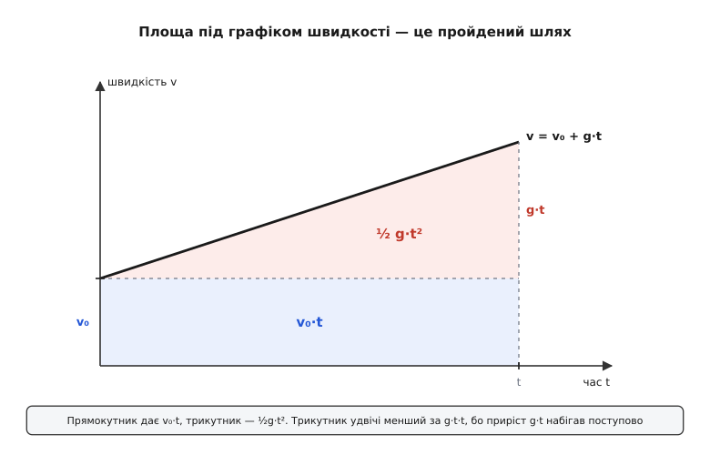
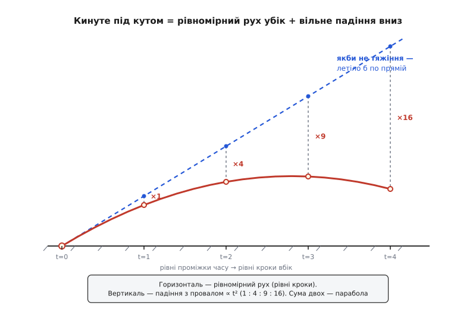

# 🧮 Кінематика вільного падіння: від одного g до параболи

Усе падіння тримається на одному-єдиному факті: прискорення стале й дорівнює g. Більше нічого не потрібно — ні маси тіла, ні матеріалу, ні сили в ньютонах. З цього однісінького «a = g, і воно не змінюється» математика витягує геть усе: як росте швидкість, який шлях уже пролетіло тіло, з якою швидкістю воно вдариться і чому кинуте під кутом креслить у повітрі саме параболу, а не якусь іншу криву. Пройдімо цей шлях крок за кроком — не завчаючи готові формули, а вирощуючи їх із самого означення прискорення.

Спиратися будемо на дві прості речі. Перша: [прискорення](topic:ph-mechanics/acceleration) — це швидкість зміни швидкості, тобто скільки метрів за секунду тіло додає до своєї швидкості за кожну секунду. Друга: [швидкість](topic:ph-mechanics/velocity) — це швидкість зміни положення, скільки метрів тіло проходить за кожну секунду. Обидві — «швидкості зміни», похідні; наше завдання протилежне — рухатися ланцюгом причин у зворотний бік. Прискорення нам **дане** (це причина), а швидкість і положення треба **відновити** (це наслідки). Відновлення похідної називають інтегруванням, та по суті це просте накопичення: підсумувати всі маленькі прирости, які набігли за час t. Уся кінематика падіння — це один причиновий ланцюг `a → v → y`, пройдений уперед накопиченням.

## Домовмося про вісь і знак

Перш ніж рахувати, треба вибрати вісь — бо «швидкість» і «прискорення» самі собою напрямлені, і без осі знак у них не визначений. Тяжіння тягне вниз, до центра Землі; на будь-якій вибраній осі прискорення a — це проєкція цього тяжіння на вісь. Напрямимо вісь **униз**, у бік руху падіння, — тоді a = +g, і всі числа виходять додатні. Напрямимо вгору — тоді те саме тяжіння дає a = −g. Фізика та сама, знаки дзеркальні; помилка зі знаком — найтиповіша пастка в цих задачах, тож вісь варто називати вголос.

Для чистого падіння зручна вісь **униз** (a = +g): усе додатне, формули найохайніші. Саме її беремо далі. А коли дійде до тіла, кинутого **вгору** під кутом, буде природніше перевернути вісь вістрям угору (a = −g) — і ми це окремо обумовимо.

## Від прискорення до швидкості

Прискорення каже, як швидко міняється швидкість:

```
a = Δv / Δt
```

Якщо a стале й дорівнює g, це означає буквально ось що: щосекунди швидкість додає одну й ту саму порцію g. За першу секунду — плюс g, за другу — ще плюс g, і так рівномірно. Тому за час t від початкової швидкості v₀ набіжить рівно g·t:

```
v = v₀ + g·t
```

Те саме мовою накопичення (інтеграла): швидкість — це початкова плюс сума всіх крихітних приростів g за кожну мить від 0 до t. А що g не міняється, підсумок тривіальний:

```
v = v₀ + ∫₀ᵗ g dt′ = v₀ + g·t
```

Наочно це площа під графіком прискорення. Графік a(t) при сталому g — рівна горизонтальна лінія на висоті g; площа під нею від 0 до t — прямокутник заввишки g і завширшки t, тобто g·t. Ця площа і є вся набута швидкість. Додаємо стартову v₀ — маємо повну.

**Приклад (падіння з місця).** Тіло відпустили без початкового поштовху (v₀ = 0). Яка його швидкість через 3 секунди?

```
v = v₀ + g·t = 0 + 9.81 · 3 = 29.43 ≈ 29.4 м/с
```

Проста пряма лінія: удвічі більший час — удвічі більша швидкість. Поки прискорення стале, швидкість росте рівномірно.

## Від швидкості до відстані — і звідки та ½

Тепер піднімемося на другий поверх ланцюга: від швидкості до положення. За тим самим правилом положення — це початкове плюс накопичена швидкість:

```
y = y₀ + ∫₀ᵗ v dt′
```

От тільки швидкість тепер **не стала** — вона сама росте прямою `v₀ + g·t`. Підставмо її під суму й порахуймо:

```
y = y₀ + ∫₀ᵗ (v₀ + g·t′) dt′ = y₀ + v₀·t + ½·g·t²
```

Ось вона, друга формула кінематики. Якщо тіло стартувало з місця й від початку координат (y₀ = 0, v₀ = 0), вона згортається до знайомого `y = ½·g·t²` — відстань як квадрат часу. Але звідки взялася ця **½**? Це найцікавіше місце, і воно не випадкова стала — за нею стоїть проста геометрія.

Знову думаймо про площу під графіком, тільки тепер під графіком **швидкості** — бо саме швидкість ми накопичуємо в положення. Графік v(t) — уже не горизонтальна лінія, а похила: стартує на висоті v₀ і рівномірно піднімається. Площа під похилою — це трапеція, і її природно розкласти на дві прості фігури: прямокутник унизу й трикутник згори.


*Площа під графіком швидкості дорівнює пройденому шляху. Прямокутник заввишки v₀ дає сталу частину v₀·t; трикутник над ним, що набирає висоту g·t за час t, дає ½·g·t². Трикутник рівно вдвічі менший за повний прямокутник g·t·t — звідси й береться ½.*

Прямокутник заввишки v₀ і завширшки t дає `v₀·t` — шлях, який тіло пройшло б, якби швидкість так і лишалася v₀. Трикутник над ним має основу t і висоту g·t (той самий приріст, що набіг за час t), тож його площа — `½ · t · g·t = ½·g·t²`. Разом — `v₀·t + ½·g·t²`, точнісінько формула.

А **чому** трикутник, тобто чому половина? Бо той додатковий шматок швидкості g·t не був присутній увесь час — він наростав із нуля поступово, рівномірно. Виходить, у середньому діяла тільки половина його: на початку інтервалу зайвої швидкості не було зовсім, наприкінці її було повних g·t, а в середньому — рівно посередині. Це той самий факт, що площа трикутника — половина прямокутника з тими самими сторонами.

Те саме можна сказати мовою середньої швидкості, і це, мабуть, найпрозоріший погляд. Коли швидкість міняється рівномірно (прямою), її середнє за інтервал — це просто півсума кінців:

```
середня v = (v₀ + v) / 2 = (v₀ + v₀ + g·t) / 2 = v₀ + ½·g·t
```

А пройдений шлях — це середня швидкість, помножена на час:

```
Δy = (середня v) · t = (v₀ + ½·g·t) · t = v₀·t + ½·g·t²
```

Той самий результат, і та сама ½ — вона тут тому, що середина рівномірного розгону лежить якраз посередині. (Важлива обмовка: «середнє = півсума кінців» вірне лише тому, що прискорення стале й швидкість лінійна; для нерівномірного розгону так спрощувати не можна.)

Один гарний наслідок квадрата варто побачити окремо. Стартувавши з місця, за рівні кроки часу (1, 2, 3, 4 умовні одиниці) тіло опиняється на глибинах `½g` · {1, 4, 9, 16}. Прирости між сусідніми кроками — це різниці квадратів: 1, 3, 5, 7, самі непарні числа. Причина суто алгебраїчна: `k² − (k−1)² = 2k − 1`, а це якраз послідовні непарні. Квадратичний шлях і рівномірний приріст швидкості — дві сторони однієї монети.

**Приклад (глибина за часом).** Камінь без початкової швидкості падав 2 секунди. Скільки він пролетів?

```
y = ½·g·t² = ½ · 9.81 · 2² = ½ · 9.81 · 4 = 19.62 ≈ 19.6 м
```

## Швидкість без годинника: v² = v₀² + 2·g·Δh

Часто час нас узагалі не цікавить — питання стоїть інакше: «з якою швидкістю тіло летітиме, пролетівши висоту Δh?» Секундоміра тут нема, є тільки висота. Час можна виключити, склавши дві вже здобуті формули, — і зробити це напрочуд елегантно через ту саму середню швидкість.

Пройдена висота — це середня швидкість на час:

```
Δh = (v₀ + v)/2 · t
```

А час візьмемо з першої формули: з `v = v₀ + g·t` випливає `t = (v − v₀)/g`. Підставмо:

```
Δh = (v₀ + v)/2 · (v − v₀)/g = (v + v₀)(v − v₀) / (2·g)
```

І тут спрацьовує різниця квадратів `(v + v₀)(v − v₀) = v² − v₀²` — увесь безлад згортається в один охайний рядок:

```
Δh = (v² − v₀²) / (2·g)      →      v² = v₀² + 2·g·Δh
```

Це співвідношення традиційно звуть **рівнянням Торрічеллі** — на честь Еванджеліста Торрічеллі, учня Ґалілея, що першим виписав його як спосіб дістати кінцеву швидкість без згадки про час (усталена назва). Зверніть увагу: у ньому немає t зовсім — сама швидкість і сама висота, більше нічого.

**Приклад (удар об землю).** Камінь зривається без початкової швидкості (v₀ = 0) і пролітає Δh = 20 м. З якою швидкістю вдариться?

```
v = √(2·g·Δh) = √(2 · 9.81 · 20) = √392.4 ≈ 19.8 м/с   (≈ 71 км/год)
```

> 🔧 **Навіщо це.** Рівняння без часу — робочий інструмент саме тому, що час у польоті виміряти важко, а висоту чи швидкість — легко. Скинули камінь у колодязь, розкрутили `Δh = v²/(2g)` навпаки — і глибина відома з однієї виміряної швидкості на дні. У краш-тестах і перевірках на удар важлива не висота падіння сама собою, а швидкість зіткнення, яку ця висота дає: скинути прилад з 1.8 м — те саме, що вдарити його об бетон на ≈ 6 м/с, і саме це число закладають у норму на міцність.

Є й другий, глибший, шлях до тієї самої формули — через **збереження енергії**. Він пояснює не лише *що*, а *чому* в цьому співвідношенні немає часу. У падінні діє одна сила — тяжіння, і вона не тертя, а тому повна механічна енергія зберігається. Домовмося про дві її частини: кінетична енергія руху `½·m·v²` і потенційна енергія висоти `m·g·h` (чим вище тіло, тим її більше). Падаючи на Δh, тіло міняє одне на інше — втрачену потенційну повністю переливає в кінетичну:

```
½·m·v² − ½·m·v₀² = m·g·Δh
```

Маса m стоїть у кожному доданку — і скорочується без сліду:

```
v² = v₀² + 2·g·Δh
```

Той самий результат, але з двома дарунками наперед. По-перше, маса зникла сама собою: після однакового падіння камінець і брила летять з однаковою швидкістю — це та сама незалежність від маси, тільки здобута з енергії. По-друге, стає зрозуміло, **чому** формула позачасова: енергія залежить лише від кінців шляху — від того, з якої висоти й до якої тіло опустилося, — а не від того, скільки воно летіло й якою дорогою. Упади прямовисно, з'їдь без тертя похилою гіркою, гойднися на маятнику — на однакову висоту опускання набереш однакову швидкість. Саме ця байдужість до дороги й до годинника і є причиною того, що позачасове співвідношення взагалі існує.

## Кинуте під кутом: два рухи в одному

Досі тіло рухалося вздовж однієї прямої. Кинемо тепер його **під кутом** — зі швидкістю v₀ під кутом θ до обрію — і побачимо, як з тих самих формул народжується парабола. Тут зручніше напрямити вісь висоти **вгору**, як звикли для польоту (тоді вертикальне прискорення a = −g); горизонтальну вісь пустимо вбік.

Уся хитрість — в одному спостереженні: тяжіння напрямлене строго вниз, а отже його **горизонтальна складова дорівнює нулю**. Значить, розкладемо і швидкість, і прискорення на дві осі — і рухи по цих осях виявляться цілком незалежними, бо тяжінню нема чим зачепити горизонталь:

```
УБІК  (горизонталь):   прискорення = 0
        швидкість стала:   v₀·cosθ
        відстань:          x = v₀·cosθ · t          ← рівномірний рух

УНИЗ  (вертикаль):     прискорення = −g
        швидкість:         v₀·sinθ − g·t
        висота:            y = v₀·sinθ · t − ½·g·t²  ← те саме вільне падіння
```

Придивімося, що сталося. По горизонталі прискорення нульове, тож початкова бічна швидкість `v₀·cosθ` не міняється ніколи — чистий рівномірний рух. По вертикалі все точнісінько як у падінні, тільки з підкидом угору на старті: та сама стала g, той самий квадрат часу. Два звичайні одновимірні рухи, що ми вже розібрали, — і між собою вони діляться **лише одним**: спільним годинником t. Більше їх ніщо не зв'язує. Це і є накладання (суперпозиція): складний рух — сума двох простих, які нічого не знають один про одного.

Найкраще цю незалежність видно в класичному досліді: одну кулю вистрілюють горизонтально, другу тієї ж миті просто відпускають з тієї самої висоти. І хоч перша летить за десятки метрів убік, а друга падає прямовисно, — **об землю вони вдаряться одночасно**. Бо вертикальна задача в них однаковісінька (початкова швидкість униз нульова, прискорення те саме g), а горизонтальна швидкість першої кулі не має до часу падіння жодного стосунку. Що саме цей рух — накладання рівномірного руху вбік і вільного падіння вниз — довів Ґалілео Ґалілей у «Бесідах про дві нові науки» (1638), дійшовши до цього дослідами ще близько 1608 року (усталений факт).

Тепер склеїмо дві осі в одну криву — виключимо час. З горизонталі `t = x / (v₀·cosθ)`; підставмо це в рівняння висоти:

```
y = v₀·sinθ · t − ½·g·t²
    ↓  підставляємо  t = x / (v₀·cosθ)

y = x·tanθ − g·x² / (2·v₀²·cos²θ)
```

Придивіться до форми: `y = a·x − b·x²`, де a і b — просто числа при заданих v₀ і θ. Це рівняння параболи, віттю донизу. Ось чому траєкторія кинутого тіла — саме парабола: не тому, що така окрема витівка природи, а тому, що вертикаль тягне вниз квадратом часу, а час рівномірно тече в горизонталь, — і `t²` перетворюється на `x²`.


*Одна й та сама парабола, розкладена на дві незалежні частини. По горизонталі — рівні кроки за рівний час (рівномірний рух убік). Пунктирна пряма — куди тіло полетіло б, якби тяжіння вимкнули: чиста інерція. Тяжіння відтягує політ униз від цієї прямої рівно на ½·g·t², а цей провал росте як квадрат часу — 1 : 4 : 9 : 16. Пряма мінус падіння й дає параболу.*

Ця фігура показує параболу так, як її бачив ще Ньютон. Уяви, що тяжіння на мить вимкнули: тіло полетіло б рівною лінією вздовж своєї початкової швидкості — сама інерція, `x·tanθ`. Тяжіння ж додає до цього руху свій внесок — тягне тіло вниз від тієї прямої, і тягне рівно на `½·g·t²`, точнісінько як у прямовисному падінні. Парабола — це пряма інерційна лінія **мінус** вільне падіння. Два доданки, кожен уже знайомий, а разом — уся крива.

## Розплата: дальність і найкращий кут

Коли обидві осі під рукою, дрібні, але приємні висновки випадають самі. Скільки тіло пролетить до падіння на той самий рівень? Політ скінчиться, коли висота знову стане нульовою:

```
y = 0:   t·(v₀·sinθ − ½·g·t) = 0   →   час польоту  t = 2·v₀·sinθ / g
```

Помножимо цей час на сталу горизонтальну швидкість — дістанемо дальність:

```
дальність  R = v₀·cosθ · t = 2·v₀²·sinθ·cosθ / g = v₀²·sin(2θ) / g
```

Останнє згортання використало `2·sinθ·cosθ = sin(2θ)`. А синус найбільший, коли його аргумент — прямий кут: `2θ = 90°`, тобто `θ = 45°`. Ось чому, кидаючи якнайдалі — камінь, спис, м'яч, — інстинктивно цілять приблизно під 45°: під цим кутом та сама початкова швидкість дає найбільшу дальність.

**Приклад (кут вирішує).** М'яч кидають зі швидкістю 20 м/с. Порівняймо дальність під 30° і під 45°:

```
θ = 30°:   R = 20² · sin(60°) / 9.81 = 400 · 0.866 / 9.81 ≈ 35.3 м
θ = 45°:   R = 20² · sin(90°) / 9.81 = 400 · 1.000 / 9.81 ≈ 40.8 м
```

Та сама рука, та сама швидкість — а вибір кута додав більш ніж п'ять метрів.

## Що з цього тримати в голові

Уся кінематика падіння виростає з одного факту — `a = g` і воно стале — плюс того, що тяжіння вектор і напрямлене строго вниз. Накопичуючи причиновий ланцюг `a → v → y`, дістаємо три робочі формули:

```
v  = v₀ + g·t              швидкість росте прямою
y  = y₀ + v₀·t + ½·g·t²    висота росте квадратом часу
v² = v₀² + 2·g·Δh          швидкість через висоту, без часу
```

а розклавши рух на дві незалежні осі — параболу `y = x·tanθ − g·x²/(2·v₀²·cos²θ)`. Дві речі варто винести з усього виведення. Позачасове співвідношення найглибше пояснює не алгебра, а збереження енергії: швидкість після падіння залежить лише від пройденої висоти, бо енергія байдужа до дороги й до годинника. А парабола — то не окремий новий закон, а те саме вільне падіння, вбране в рівномірний бічний дрейф: пряма інерції мінус звичний провал ½·g·t².
