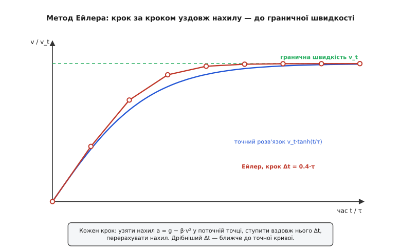
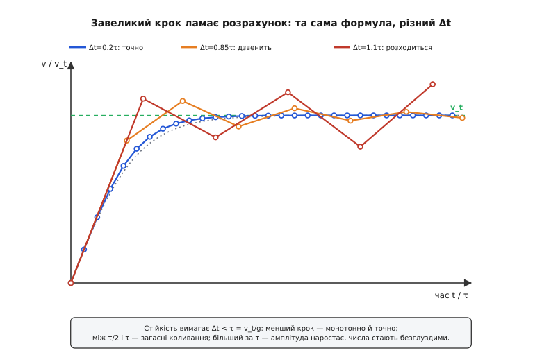

# ⚙️ Гранична швидкість чисельно: інтегруємо падіння з опором

**Задача.** У порожнечі швидкість падіння — це майже дитяча формула: `v = g·t`. Підставив час — маєш відповідь, і жодного циклу тут не треба. Але щойно тіло летить крізь повітря, ця простота зникає. Опір росте разом зі швидкістю, тож прискорення більше не стале, і «підставити t» немає куди — рівняння руху зв'язує швидкість із її ж власною похідною:

```
m · dv/dt = m·g − ½·C_d·ρ·A·v²
```

Зліва — маса на прискорення; справа тяжіння тягне вниз силою m·g, а опір штовхає назад — тим дужче, чим швидше тіло продирається крізь повітря (площа перерізу A, форма C_d, густина повітря ρ). Ми хочемо на власні очі побачити, як із цього рівняння народжується крива `v(t)`: як вона спершу мчить угору майже прямою, а тоді загинається й лягає на поличку — на **граничну швидкість**. І хочемо дістати саме число тієї межі — окремо для парашутиста, окремо для дощової краплі.

Чесно кажучи, у цього рівняння Є точна відповідь (трохи нижче ми нею скористаємось, щоб зловити себе на помилці). Та покладатися на неї — розкіш, що випаровується від найменшого ускладнення. Дай повітрю рідшати з висотою під час затяжного стрибка, дай тілу перекинутися й змінити C_d, дай парашуту розкриватися пів секунди — і красива формула розсипається. Числовий метод не розсипається ніколи: він не розв'язує рівняння «раз і назавжди», а просто дрібно крокує вперед. Саме тому вчитися варто йому.

**Ідея: ступай уздовж нахилу.** Похідна `dv/dt` — це нахил, швидкість зміни швидкості. Перепишемо рівняння так, щоб зліва лишився самий нахил, а справа — те, що його задає:

```
dv/dt = a(v) = g − β·v²,     де  β = ½·C_d·ρ·A / m
```

Права частина каже просту річ: знаю поточну швидкість — знаю поточне прискорення. А прискорення — це наказ, як швидкість зміниться найближчої миті. Візьми зовсім коротку мить Δt, за яку a майже не встигає змінитися, — і приріст швидкості за неї буде просто `a·Δt`. Звідси весь метод в одному рядку:

```
v(t + Δt) ≈ v(t) + a(v)·Δt
```

Це **метод Ейлера** — за Леонардом Ейлером, який описав його ще у XVIII столітті. Стій у поточній точці, виміряй нахил, ступи вздовж нього один крок, опинишся в новій точці — і знову виміряй нахил. Наче спускаєшся з гори в густому тумані: далі метра не бачиш, тож мацаєш схил під ногами, робиш обережний крок за ним, дивишся знову.

Найкраще тут те, що граничну швидкість не треба нікуди «вписувати» — вона з'явиться сама. Щойно опір дожене вагу, дужка `g − β·v²` обернеться на нуль, приріст `a·Δt` зникне, і швидкість застигне. Прирівняй прискорення до нуля — і побачиш, на якому саме числі цикл замовкне:

```
a = 0   →   g = β·v_t²   →   v_t = √(g/β) = √( 2mg / (C_d·ρ·A) )
```

Ми не закладаємо цю межу в програму — цикл виходить на неї самотужки, бо в ній зникає причина рухатися далі. Формула праворуч знадобиться потім лише як контрольна відповідь.


*Метод крок за кроком. Синя крива — точний розв'язок; червона ламана — Ейлер із навмисне грубим кроком, щоб було видно окремі сходинки. У кожній точці беремо нахил a = g − β·v², ступаємо вздовж нього Δt і опиняємось трохи нижче за істину. Що дрібніший крок, то щільніше ламана лягає на криву; обидві виходять на ту саму горизонтальну поличку — граничну швидкість.*

**Робочий код.** Задача суто числова, і читатися вона має як формула, а не як боротьба з мовою, — тож пишемо Python. Уся фізика вміщається у дві функції: одна рахує контрольну граничну швидкість, друга крокує рівняння руху й на кожному кроці віддає пару (час, швидкість).

```py
import math

g   = 9.81     # м/с²   прискорення вільного падіння
rho = 1.2      # кг/м³  густина повітря коло землі

def terminal(m, Cd, A):
    "Аналітична межа: там, де опір рівно з'їдає вагу."
    return math.sqrt(2*m*g / (Cd*rho*A))

def fall(m, Cd, A, dt=0.001, t_end=25.0):
    "Крок за кроком інтегруємо m·dv/dt = m·g − ½·Cd·ρ·A·v²."
    beta = 0.5*Cd*rho*A / m         # a = g − beta·v²
    v = 0.0                         # старт зі спокою
    t = 0.0
    while t < t_end:
        a  = g - beta * v*abs(v)    # опір завжди проти руху
        v += a * dt                 # ← увесь метод Ейлера тут
        t += dt
        yield t, v
```

Тепер проженемо цим два зовсім різні тіла й для кожного порівняємо повітряну швидкість із вакуумною `g·t`:

```py
def report(name, m, Cd, A, marks):
    vt = terminal(m, Cd, A)
    print(f"\n{name}:  v_t = {vt:.1f} м/с  ({vt*3.6:.0f} км/год)")
    print("   t, с | v (повітря) | v = g·t (вакуум)")
    marks = iter(sorted(marks)); target = next(marks)
    for t, v in fall(m, Cd, A):
        if t >= target:
            print(f"  {t:5.1f} | {v:9.2f}   | {g*t:9.1f}")
            try: target = next(marks)
            except StopIteration: break

# Парашутист «пузом донизу»
report("Парашутист", m=80, Cd=0.9, A=0.50, marks=[2, 5, 10, 20])

# Дощова крапля: масу й переріз рахуємо з радіуса кулі
r = 0.002                           # м, велика крапля (≈4 мм у діаметрі)
m_drop = 1000 * (4/3)*math.pi*r**3  # вода, ρ_w = 1000 кг/м³
A_drop = math.pi*r**2
report("Дощова крапля", m=m_drop, Cd=0.47, A=A_drop, marks=[0.5, 1, 2, 3])
```

Запуск дає ось таке:

```
Парашутист:  v_t = 53.9 м/с  (194 км/год)
   t, с | v (повітря) | v = g·t (вакуум)
    2.0 |     18.81   |      19.6
    5.0 |     38.88   |      49.1
   10.0 |     51.16   |      98.1
   20.0 |     53.84   |     196.2

Дощова крапля:  v_t = 9.6 м/с  (35 км/год)
   t, с | v (повітря) | v = g·t (вакуум)
    0.5 |      4.52   |       4.9
    1.0 |      7.41   |       9.8
    2.0 |      9.31   |      19.6
    3.0 |      9.59   |      29.4
```

Прочитаймо це уважно, бо тут уся суть. На старті обидва стовпчики збігаються — при малій швидкості опір мізерний, і повітряне падіння нічим не відрізняється від вакуумного (парашутистова секунда друга: 18.81 проти 19.6). Далі шляхи розходяться. Вакуумна колонка росте без упину — на двадцятій секунді парашутист «мав би» летіти 196 м/с, тобто 706 км/год, чого в природі не буває. Повітряна колонка натомість підповзає до 53.9 м/с і там застигає: на двадцятій секунді вже 53.84 — практично межа. Це ті самі ≈55 м/с, про які кажуть про затяжний стрибок пузом донизу.

Крапля розповідає ту саму історію, лиш утричі скоромовкою. Її гранична швидкість — жалюгідні 9.6 м/с (швидкість велосипедиста), і виходить вона на неї вже за якісь три секунди. За цей час крапля пролітає заледве два десятки метрів — а тоді решту кілометра від хмари до землі падає рівномірно, не пришвидшуючись ані на йоту. Ось чому дощ не збиває з ніг:

**Приклад (крапля з кілометрової хмари).** Порівняймо, з чим би крапля прилетіла до землі у вакуумі й з чим прилітає насправді.

```
вакуум:   v = √(2·g·h) = √(2 · 9.81 · 1000) = √19620 ≈ 140 м/с   (504 км/год)

повітря:  m = 1000 · (4/3)π · (0.002)³ = 3.35·10⁻⁵ кг
          A = π · (0.002)²             = 1.26·10⁻⁵ м²
          v_t = √( 2 · 3.35·10⁻⁵ · 9.81 / (0.47 · 1.2 · 1.26·10⁻⁵) ) ≈ 9.6 м/с
```

Сто сорок метрів за секунду проти дев'яти з половиною — повітря забирає в удару понад дев'ять десятих швидкості. У вакуумі дощ бив би, як автоматна черга; насправді ж він лоскоче. І весь цей висновок вийшов з одного циклу на п'ять рядків.

**Уся фізика — один рядок, і він переносний.** Придивись до серця циклу: `a = g − β·v·|v|`, тоді `v += a·dt`. Це вся динаміка; решта коду — облік часу й друк. Саме тому метод так легко переселяється куди завгодно. На польотному контролері, що переоцінює швидкість спуску щотакту, ти напишеш ті самі два рядки, тільки мовою, яка компілюється в лічені такти процесора:

:::tabs
```py
def step(v, beta, dt):
    a = g - beta * v*abs(v)   # прискорення зараз
    return v + a * dt         # швидкість через Δt
```
```c
// один крок Ейлера; гарячий шлях на мікроконтролері — float
static inline float step(float v, float beta, float dt) {
    float a = g - beta * v * fabsf(v);   // прискорення зараз
    return v + a * dt;                   // швидкість через Δt
}
```
:::

Обидва варіанти роблять буквально те саме; різниця лише в тому, що C дає передбачувано швидкий машинний код там, де його викликають тисячі разів на секунду в реальному часі. Але сам **метод** від мови не залежить — це чиста арифметика.

**Складність і пастки.** Цикл короткий, а от підводних каменів під ним чимало, і кожен вартий уваги.

*Похибка — і як зловити себе на ній.* Ейлер завжди трохи бреше: у кожній точці він ступає вздовж дотичної, а справжня крива тим часом уже підвертає, тож ламана систематично «зрізає кут». Це метод **першого порядку** — похибка спадає пропорційно кроку: удвічі дрібніший Δt дає удвічі точнішу відповідь. Перевірити себе легко саме тут, бо в цієї задачі є точний розв'язок (він виходить, якщо розділити змінні в `dv/dt = g − β·v²`):

```
v(t) = v_t · tanh(t / τ),     τ = v_t / g
```

Підстав його — і побачиш, що наш стовпчик `v (повітря)` збігається з `v_t·tanh(t/τ)` до сотих часток метра за секунду (парашутистові 53.84 на двадцятій секунді точна формула відповідає 53.839). Отже, крок 0.001 с тут із головою. А коли точної відповіді немає — а так буває майже завжди, — роби те саме емпірично: порахуй із кроком Δt і Δt/2; збіглися до потрібної тобі точності — крок досить дрібний, розходяться — дрібни далі.

*Стійкість — найпідступніше.* Можна помилитися страшніше, ніж просто неточно: завеликий крок не просто мажеться, він **розвалює** розрахунок. Причину видно, якщо глянути на околицю межі. Хай `v = v_t + e`, де e — маленьке відхилення. Похідна прискорення за швидкістю в цій точці дорівнює `−2·g/v_t`, тож Ейлерів крок множить відхилення на `(1 − 2·g·Δt/v_t)`. Щоб відхилення згасало, цей множник має бути за модулем менший від одиниці:

```
стійкість:  Δt < τ = v_t / g          (більший крок — розліт)
без коливань: Δt < τ/2                 (менший — монотонний підхід)
```

Отже, безпечний крок диктує саме характерний час τ = v_t/g. І тут криється пастка, на яку легко налетіти. У парашутиста τ ≈ 5.5 с — запас велетенський, будь-який розумний Δt минеться. А в краплі τ ≈ 1 с, уп'ятеро менше. Крок, підібраний «на око» під парашутиста, для краплі виявляється завеликим — і замість плавної кривої вилазить дичина. Пусти краплю з Δt = 1.5 с — і перші ж значення швидкості підуть `14.7 → −4.9 → 13.6 → −1.1 …`: після першого ж кроку тіло перестрибнуло межу, опір оскаженіло вдарив назад, і «крапля» полетіла вгору зі швидкістю 5 м/с. Це не фізика, це чисельна нестійкість.


*Та сама формула, три різні кроки (в частках τ). Малий крок веде монотонно й точно вздовж істини. Крок між τ/2 і τ уже перестрибує межу й дзвенить навколо неї загасними коливаннями. Крок більший за τ — і амплітуда наростає з кроку в крок, швидкість зривається в безглузді, ба від'ємні значення. Надійне правило — тримати Δt ≈ τ/10: і стійко, і точно заразом.*

*Знак опору.* У коді стоїть `v·|v|`, а не `v²` — і це не примха. Опір завжди спрямований **проти руху**. Поки тіло лише падає (v > 0), `v²` і `v·|v|` — те саме, тож спокуса написати простіше велика. Але додай підкидання вгору чи відскок — швидкість стане від'ємною, і `v²` (завжди додатне) штовхатиме тіло в той самий бік, тобто **підганятиме** його замість гальмувати, накачуючи енергію з нізвідки. `v·|v|` міняє знак разом зі швидкістю й лишається чесним завжди. Дешева страховка — пиши її з самого початку.

*C_d — насправді не стала.* Це найбільше спрощення в усій моделі. Коефіцієнт опору залежить від режиму обтікання, який характеризують [числом Рейнольдса](root:ph-mechanics/reynolds-number) — безрозмірною мірою того, чи тече повітря гладко, чи зривається у вихори; для кулі C_d тримається коло 0.47 у широкому діапазоні, але різко провалюється за дуже великих швидкостей (криза опору), а для геть дрібних повільних крапель опір узагалі стає лінійним за швидкістю, а не квадратичним. Гірше того, справжня крапля — не тверда кулька: більша за міліметр, вона сплющується в булочку, від чого ефективний C_d підростає, і виміряна гранична швидкість чотириміліметрової краплі — близько 8.8 м/с (лабораторні дані Ґанна й Кінзера, 1949), помітно нижче за нашу «кулькову» 9.6. Висновок не в тому, що модель погана, а в тому, що вона чинна **у вікні**. Виходиш за вікно — роби C_d функцією швидкості просто всередині `a(v)`, і цикл цього навіть не помітить. У цьому вся його сила.

*Кращі кроки — той самий каркас.* Ейлер — найгрубший представник цілої родини. Точніші схеми на кшталт Рунге–Кутти опитують нахил кілька разів на крок і за той самий Δt дають на порядки меншу похибку, тож дозволяють крокувати рідше й далі; підхід до чисельного розв'язання таких рівнянь докладніше розбирають [числові методи розв'язку ОДУ](root:math-numeric/numerical-ode). Але форма програми не міняється ані на йоту: обчислив прискорення — ступив уперед. Заміни один рядок оновлення на чотири — і матимеш RK4. А щоб просто **побачити**, як народжується гранична швидкість, цілком досить звичайного Ейлера з дрібним кроком.

*Ціна.* Обчислень тут стільки, скільки кроків: `t_end / Δt`. Двадцятип'ятисекундний парашутист із кроком 0.001 с — це 25 тисяч ітерацій, тобто мікросекунди роботи; пам'яті — стала, бо швидкість переписуємо на місці, а сліди зберігаємо, лише коли справді хочемо намалювати графік. Вузьке місце тут ніколи не швидкодія — а вибір самого кроку Δt, про який ішлося вище.

> 🔧 **Навіщо це.** Цей п'ятирядковий цикл — робоче ядро задач про спуск. Ним живуть альтиметри модельних ракет, що відстрілюють парашут точно в апогеї; ним рахують гальмування спускних апаратів, добираючи площу щита під потрібну граничну швидкість; ним відповідають на приземлене інженерне питання «чи виживе прилад, якщо його впустити?» — бо важить не висота падіння, а гранична швидкість, до якої тіло встигає розігнатися. Дай циклові масу, площу й опір свого тіла — і він скаже, з якою швидкістю воно зустріне землю й скільки метрів йому на це треба.

Ось у чому різниця двох підходів. Формула `v = g·t` відповідає на шкільне питання «як швидко через t секунд у порожнечі». Цикл відповідає на справжнє — «як швидко, якщо повітря опирається» — і на додачу задарма віддає граничну швидкість: те число, на якому він сам замовкає, бо рухатися далі більше нема причини.
