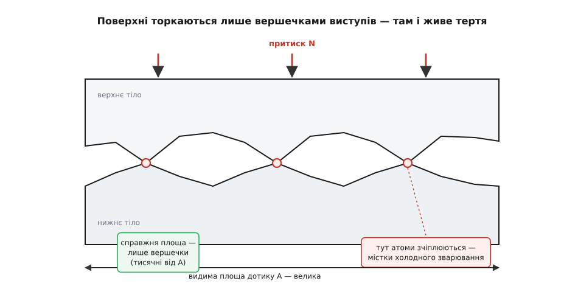
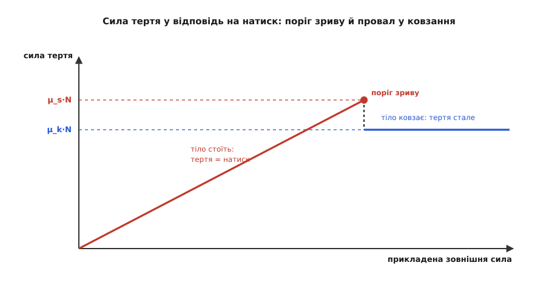
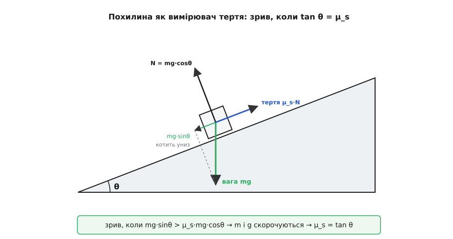
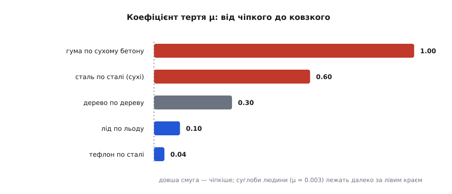

# Тертя: сила, що опирається ковзанню

<preknowlist>
- [Сила](root:ph-mechanics/force) — штовхання чи тягнення, що змінює рух; вектор із величиною й напрямком.
- [Нормальна сила](root:ph-mechanics/normal-force) — перпендикулярна сила, якою опора підпирає тіло; саме до неї пропорційне тертя.
- [Вага](root:ph-mechanics/weight) — сила, з якою тіло тисне на опору через тяжіння; на рівній підлозі вона й дає нормальну силу.
- [Другий закон Ньютона](root:ph-mechanics/newtons-second-law) — сила = маса · прискорення; з нього видно, зрушить тіло чи ні і як хутко.
</preknowlist>

Потріть долоні одна об одну — вони теплішають. Штовхніть важку шафу — вона впирається, наче приклеєна до підлоги, а тоді раптом зривається й їде. Ідучи, ви відштовхуєтеся підошвою від землі, і вона вас не зраджує. У всіх трьох випадках працює та сама сила — **тертя**: опір, що виникає там, де одна поверхня намагається ковзнути по іншій. Саме слово каже суть: тертя — від «терти»; наукова назва теж проста, від латинського *frictiō* (від *fricāre* — терти).

Тертя має дивну подвійну славу. З одного боку, це вічний злодій: воно гальмує механізми, стирає деталі, з'їдає пальне, перетворює корисний рух на марне тепло. Інженери століттями воюють із ним мастилом і підшипниками. Але спробуйте на мить його вимкнути — і світ розсиплеться. Без тертя не можна ані ступити (нога ковзне, як на льоду), ані втримати чашку, ані зав'язати вузол, ані спинити авто, ані навіть забити цвях — він виліз би назад. Стос книжок, гвинт у дошці, взуття на сходах — усе це тримається тертям. Тож перш ніж клясти його, варто зрозуміти, звідки воно береться й за якими правилами діє.

## Звідки береться тертя

Проведіть пальцем по відшліфованому склу чи полірованому металі — на дотик гладенько, наче поверхня ідеально рівна. Але це омана масштабу. Під мікроскопом навіть найглянсовіша поверхня — це гірський краєвид: гребені, шпилі, западини. Коли два такі краєвиди кладуть один на одного, вони торкаються не всією видимою площею, а лише вершечками найвищих виступів — наче два перевернуті гірські пасма зчепилися кількома піками.

Виступи (їх звуть **шорсткостями**) — крихітні, тож і справжня площа дотику виходить мізерна: часто це тисячні частки видимої. Уся вага тіла давить саме на ці кілька цяточок, тому тиск у них колосальний — метал там плющиться, і на вершечках атоми двох поверхонь підходять так близько, що **зчіплюються**: виникають дрібнесенькі містки холодного зварювання. Щоб зрушити тіло, ці містки треба розірвати чи зрізати. Оцей безперервний розрив і відновлення молекулярних зчеплень на дотичних вершечках — і є тертя. До цього розуміння через реальну площу контакту людство йшло довго, від нотатників Леонардо да Вінчі до середини XX століття, — [ця історія варта окремої розповіді](root:ph-mechanics/friction/hist-friction-laws.md).


*Звідки береться тертя. Гладенькі на око поверхні насправді шорсткі, і торкаються вони лише кількома вершечками виступів. Уся вага давить на ці цяточки, атоми там зчіплюються в містки холодного зварювання — і тертя є ціна їх безнастанного розривання. Видима площа велика, справжня площа дотику — крихітна.*

Звідси одразу випливає головна властивість тертя — і то геть не очевидна.

## Дві прикмети тертя

Придавіть тіло дужче — виступи вминаються глибше, площа справжнього дотику росте, зчеплень стає більше, і тертя зростає. Причому росте воно **рівно пропорційно** тому, наскільки сильно поверхні притиснуті одна до одної. Цю притискальну силу звуть [нормальною силою](root:ph-mechanics/normal-force) N (від лат. *normalis* — перпендикулярний): опора підпирає тіло перпендикулярно до поверхні, і саме ця сила визначає, наскільки щільно зчеплені виступи. Сила тертя ковзання прямо пропорційна N:

```
F = μ · N
```

Множник μ (грецька «мю») — **коефіцієнт тертя**, безрозмірне число, що вбирає все про конкретну пару поверхонь: наскільки вони чіпкі, тверді, шорсткі. Сталь по сталі — одне μ, гума по асфальту — інше, лід по льоду — третє. Саме μ, а не якісь складні деталі, — те єдине, що треба знати про поверхні, щоб порахувати тертя.

А тепер найдивніше. Тертя **не залежить від видимої площі дотику**. Покладіть цеглину плазом чи поставте на вузький торець — вона ковзатиме однаково важко, хоча площі різняться втричі. Здоровий глузд кричить, що на більшій площі й чіпляння має бути більше, — а виходить, що ні. Розгадка вже в наших руках: важить не видима площа, а **справжня**, по вершечках виступів. Поставте цеглину на малий торець — на кожен виступ припаде втричі більший тиск, виступи вмнуться втричі глибше, і справжня площа дотику вийде рівно та сама. Видима площа зменшилась, тиск зріс, а їхній добуток — справжній дотик — не змінився. Тому й тертя однакове. [Той самий доказ, доведений до формули, показує, звідки взагалі береться F = μ·N](root:ph-mechanics/friction/math-real-contact-area.md).

## Спокій, що опирається

Шафа, яку ви штовхаєте, стоїть, поки ви не наляжете як слід. Це означає, що тертя не має одного сталого значення — воно **підлаштовується**. Штовхаєте легенько — тертя відповідає рівно такою ж силою назустріч, і шафа стоїть. Тиснете дужче — і тертя дужчає рівно настільки, щоб урівноважити вас. Так триває, поки ви не дійдете межі: сильнішого за μ_s·N опору поверхні спокою дати не можуть. Це **статичне тертя** (тертя спокою), і його максимум:

```
F_s(макс) = μ_s · N
```

Поки ваша сила менша за цей поріг, тіло стоїть як укопане, а тертя точно гасить ваш натиск. Перевищили поріг — рівновага ламається, і тіло зривається з місця.

## Зрушив — і поїхало легше

Щойно тіло поїхало, характер тертя міняється. Тепер діє **кінетичне тертя** (тертя ковзання), і воно, як правило, помітно **менше** за найбільше статичне:

```
F_k = μ_k · N,   причому  μ_k < μ_s
```

Ось звідки те знайоме відчуття: шафа спершу впирається щосили, а зірвавшись — раптом «полегшала» й посунула майже сама. Поки вона стояла, зчеплення на вершечках виступів мали час міцно зростися; коли ж пішла ковзати, виступи проскакують один повз одного, не встигаючи зчепитися як слід, — і опір падає. Різниця між μ_s та μ_k — це різниця між «зрушити з місця» і «тягти далі», і вона щодня дошкуляє кожному, хто пересував важкі меблі.


*Як тертя відповідає на натиск. Поки тіло стоїть, тертя спокою рівно дзеркалить прикладену силу — росте разом із нею вздовж діагоналі. На порозі μ_s·N зчеплення зривається; тіло рушає, і тертя стрибком падає на нижчий сталий рівень ковзання μ_k·N. Саме цей провал і відчувається як раптове «полегшання», коли меблі нарешті зрушили.*

**Задача. Зрушити й розігнати ящик.** Ящик масою 25 кг стоїть на підлозі; μ_s = 0.5, μ_k = 0.4 (g = 9.8 м/с²). Що буде, якщо штовхати його горизонтально спершу з силою 100 Н, а тоді 150 Н?

```
Нормальна сила дорівнює вазі ящика:
N = m·g = 25 · 9.8 = 245 Н

Поріг рушання (найбільше статичне тертя):
F_s(макс) = μ_s · N = 0.5 · 245 = 122.5 Н

Штовхаємо зі 100 Н:  100 < 122.5  →  ящик стоїть,
    тертя спокою відповідає рівно 100 Н — рівновага.

Штовхаємо зі 150 Н:  150 > 122.5  →  ящик зривається й їде.
    Тепер діє кінетичне тертя:
    F_k = μ_k · N = 0.4 · 245 = 98 Н
    Рівнодійна = 150 − 98 = 52 Н
    a = F / m = 52 / 25 ≈ 2.08 м/с²
```

До порога тертя мовчки з'їдало весь наш натиск, і ящик не рушав ні на міліметр. За порогом воно відразу «подешевшало» зі 122.5 до 98 Н — і вивільнений надлишок сили пішов у прискорення.

> 🔧 **Навіщо це.** На різниці μ_s і μ_k стоїть уся техніка гальмування. Колесо, що котиться без проковзування, торкається дороги точкою, яка в цю мить нерухома, — тут працює **статичне** тертя, чіпке й сильне. Та щойно колесо заблокувалося й пішло юзом, вмикається слабше **кінетичне** тертя: гальмівний шлях подовжується, а кероване авто ще й перестає слухати кермо. Саме тому придумали ABS — система десятки разів на секунду відпускає й притискає гальмо, не даючи колесам зірватися в юз, щоб шина лишалася в чіпкому статичному режимі. Гонщики з тієї ж причини бояться «спалити» зчеплення коліс у занос.

## Похилина, що міряє тертя

Є напрочуд простий спосіб виміряти μ_s, для якого не треба ні динамометра, ні знати масу тіла. Покладіть тіло на дошку й поволі піднімайте один її край. Спершу тіло лежить: складова ваги вздовж схилу ще мала, і тертя спокою її врівноважує. Але що крутіший нахил, то дужче вага тягне тіло вниз по схилу — і в якусь мить воно зривається й сповзає. Кут, за якого це стається, звуть **кутом тертя** (або кутом природного укосу), і він прямо дає нам μ_s.

Розгляньмо сили на схилі під кутом θ. Вага mg розкладається на дві складові: вздовж схилу (тягне вниз) — mg·sin θ, і впоперек (притискає до дошки) — mg·cos θ. Нормальна сила дорівнює саме притискальній складовій, N = mg·cos θ, тож найбільше тертя спокою — μ_s·mg·cos θ. Тіло зрушить, коли скочувальна складова переважить це тертя:

```
mg·sin θ  >  μ_s · mg·cos θ
```

Маса m і прискорення g стоять в обох частинах — і скорочуються дощенту. Лишається чистий зв'язок кута й коефіцієнта:

```
tan θ  >  μ_s        →  тіло сповзає
μ_s = tan θ_зриву
```


*Похилина як вимірювач тертя. Вагу бруска розкладено на дві складові: одна котить його вниз по схилу (mg·sinθ), друга притискає до дошки (mg·cosθ) і задає нормальну силу. Тертя спокою тримає, доки скочувальна складова менша за μ_s·mg·cosθ. На кутові зриву вони зрівнюються — і, оскільки маса й g скорочуються, лишається чистий зв'язок μ_s = tan θ.*

**Задача.** Брусок починає сповзати з дошки, коли її край піднято настільки, що нахил сягає 22°. Який коефіцієнт тертя спокою?

```
μ_s = tan 22° ≈ 0.40
```

І все — ні ваги, ні площі, ні матеріалу знати не треба: сам кут зриву вже дав відповідь. Ось чому пісок, зерно чи щебінь завжди насипаються купою з тим самим характерним кутом укосу — його прямо задає тертя між зернятами.

## Наскільки чіпкі різні поверхні

Коефіцієнт тертя дуже різний для різних пар — і саме він вирішує, слизько чи чіпко:

```
гума по сухому бетону      μ ≈ 1.0
сталь по сталі (сухі)      μ ≈ 0.6
дерево по дереву           μ ≈ 0.3
лід по льоду               μ ≈ 0.1
тефлон по сталі            μ ≈ 0.04
```


*Коефіцієнт тертя для різних пар поверхонь. Гума чіпляється за бетон так, що тертя майже дорівнює притиску (μ ≈ 1); тефлон ковзкий у двадцять із гаком разів слабше. Поза цією шкалою лежать змащені суглоби людини — там μ ≈ 0.003, у сотні разів слизькіше за лід.*

Гума чіпляється за бетон майже так, що тертя дорівнює притискальній силі (μ ≈ 1); тефлон (PTFE) ковзкий настільки, що за нього ніщо не хоче триматися, — тому ним і криють пательні. А є пари з іще меншим тертям: у наших суглобах кістки труться в мастильній рідині з μ ≈ 0.003 — у сотні разів слизькіше за лід; жоден рукотворний підшипник поки що не такий гладкий.

> 🔧 **Навіщо це.** Уся боротьба з тертям у техніці — це боротьба за реальну площу контакту й за те, щоб виступи не зчіплювалися. Мастило й підшипники роблять саме це: тонка плівка оливи розсуває поверхні, і замість «сталь по сталі» тертя стає «сталь по олії», у рази менше. Кулькові та роликові підшипники йдуть іншим шляхом — підміняють ковзання коченням, у якому дотик безперервно оновлюється й зчеплення не встигають наростати, а [тертя кочення](root:ph-mechanics/rolling-resistance) у рази менше за тертя ковзання. Від цього прямо залежить, скільки живе двигун і скільки пального він змарнує дорогою.

## Куди дівається енергія

Розірвати молекулярні містки на вершечках виступів — це витратити енергію, і вона нікуди не зникає, а йде в тепло. Тому тертя завжди **гальмує й гріє** водночас. Штовхаючи ящик по підлозі, ви виконуєте [роботу](root:ph-mechanics/work), а тертя перетворює її не на рух, а на теплоту в дотичних поверхнях. Потерті долоні теплішають, гальмівні диски авта розжарюються до червоного, сірник спалахує від чиркання — усе це та сама **дисипація** (лат. *dissipāre* — розсіювати): упорядкований рух тіла розмінюється на безладний тепловий рух атомів.

Через це тертя й ламає такий зручний закон, як [збереження механічної енергії](root:ph-mechanics/energy-conservation): маятник із тертям поволі згасає, бо його [кінетична енергія](root:ph-mechanics/kinetic-energy) крапля за краплею йде в [тепло](root:ph-thermodynamics/heat-transfer). Енергія в цілому не пропадає — вона просто переходить у форму, з якої назад корисний рух уже не збереш.

## Де проста картина хитається

Закон F = μ·N — робочий кінь механіки, простий і на диво влучний. Але μ — не свята стала, і його межі варто знати.

По-перше, μ не зовсім постійне. Воно трохи залежить від швидкості ковзання, від температури, а надто — від чистоти поверхонь: волога, пил, окалина, найтонша плівка бруду міняють тертя разюче. Тому таблиці μ дають лише приблизні числа, надійні хіба до першої значущої цифри.

По-друге, коли ковзання йде ривками, тертя саме породжує коливання. Тіло то прилипає (тертя спокою тримає), то зривається (кінетичне пускає), то знову прилипає — виникає **stick-slip**, «прилип-ковзнув». Саме він змушує двері рипіти, крейду вищати по дошці, а смичок — співати на струні; у велетенському масштабі той самий механізм — це раптові зриви земної кори, тобто землетруси. [Як стрибок μ_s → μ_k породжує пилчасті коливання stick-slip, показано робочою моделлю](root:ph-mechanics/friction/proj-stick-slip.md).

По-третє, «тертя» об рідину чи газ — то зовсім інша фізика. Коли тіло рухається у воді чи повітрі, немає ні виступів, ні порога зриву; опір там росте зі швидкістю і зникає в спокої. Це [аеродинамічний опір](root:ph-mechanics/aerodynamic-drag) і внутрішнє тертя рідини — [в'язкість](root:ph-mechanics/viscosity), і живуть вони за іншими законами, ніж сухе тертя ковзання.

І нарешті, тертя — не окрема фундаментальна сила. На дні це той самий електромагнетизм: зчеплення й відштовхування електронних хмар на дотичних атомах. Тому «сили тертя» серед основних сил природи немає — є лише її прояв там, де дві поверхні труться одна об одну. Але для інженера, що рахує гальмо, зчеплення шини чи знос підшипника, проста F = μ·N лишається саме тим, що треба: одне число μ — і поведінка поверхонь стає передбачуваною.
