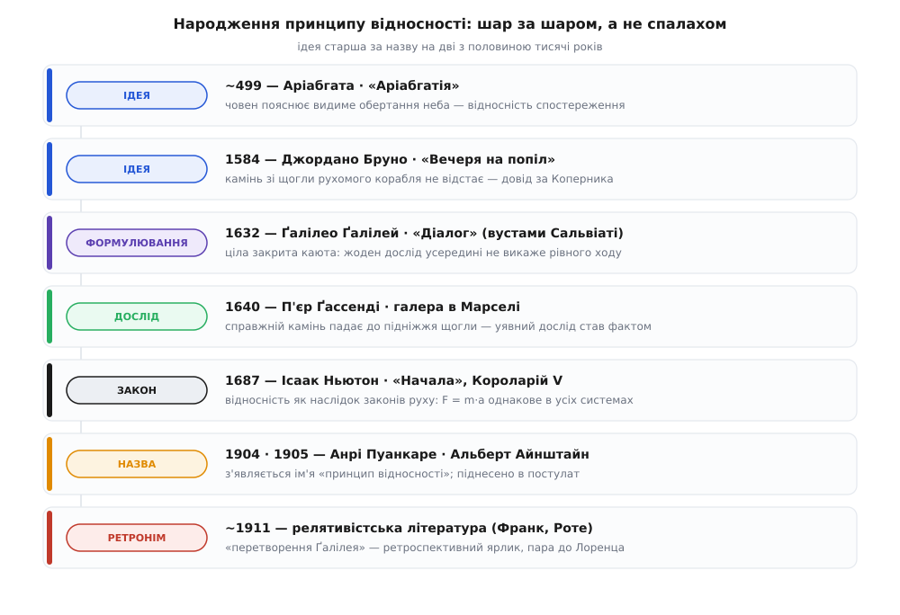

# 📜 Народження принципу відносності: від човна Аріабгати до Короларію Ньютона

Принцип такої ваги не падає з неба готовим. Думка, що рівномірного руху не можна виявити зсередини, збиралася понад дві тисячі років — у різних культурах, різними людьми й майже завжди не заради самої фізики, а щоб виграти суперечку про будову світу. Тому й слово «перший» тут майже завжди хибне: те, що ми звемо принципом відносності, склалося шарами. Окремо — сира ідея. Окремо — її загальне формулювання. Окремо — перевірка справжнім дослідом. Окремо — піднесення до наслідку законів руху. І аж наприкінці — сама назва. Кожен шар додав хтось свій, і звичне «це вигадав Ґалілей» радше ховає цю історію, ніж розповідає її.

Розкладімо ці шари по черзі — і водночас чесно позначмо, що в кожному з них усталений факт, що спірне тлумачення, а що вже пізніший ярлик.


*Сім віх однієї думки. Ліворуч у кожному рядку — який саме шар додано: сира ідея, загальне формулювання, перевірка дослідом, кодифікація в закон, назва. Видно головне: ідея старша за назву на дві з половиною тисячі років, а сам «принцип відносності» дістав це ім'я аж у XX столітті.*

## Заперечення, яке треба було розбити

Щоб зрозуміти, навіщо принцип узагалі знадобився, треба стати на бік його ворогів. Проти рухомої Землі стояв аргумент простий, наочний і на позір нищівний — його повторювали від Арістотеля й Птолемея до єзуїтських підручників XVII століття.

Якби Земля летіла й крутилася, міркували вони, ми б це неминуче помічали. Підкиньте камінь прямо вгору: поки він у повітрі, земля під ним утече на схід, і камінь має впасти помітно на захід від місця кидка. Птах, знявшись із гілки, лишився б позаду свого дерева. Хмари, повітря, усе незакріплене відставало б, і з заходу дув би вічний ураган від «швидкості планети». Нічого цього немає — камінь падає до ніг, птах вертається на гілку, вітру немає. Отже, укладали, Земля стоїть нерухомо.

Логіка бездоганна — за одного мовчазного припущення: що відпущене тіло **губить** рух опори, з якою щойно було зв'язане. Увесь спір про будову світу впирався саме в це припущення. Розбити його означало відкрити дорогу Копернику. І народження принципу відносності — це, по суті, історія того, як його розбивали: спершу натяком, потім образом, потім строгим законом.

## Човен, що пояснює нерухоме небо: Аріабгата, близько 499 року

Найдавніший датований слід цієї думки веде не в Європу, а в Індію. Астроном і математик Аріабгата (Āryabhaṭa, 476 — бл. 550) близько 499 року, за власним свідченням у віці двадцяти трьох років, склав «Аріабгатію» (Āryabhaṭīya) — стислий трактат із математики й астрономії. У розділі про небесну сферу (Golapāda) він робить сміливий крок: пояснює видиме добове обертання неба тим, що обертається **Земля**, із заходу на схід, а зорі стоять.

І щоб зробити це відчутним, дає образ човна. У класичному перекладі Волтера Юджина Кларка (W. E. Clark, 1930) вірш звучить приблизно так:

> Як людина в човні, що пливе вперед, бачить нерухомий предмет на березі рухомим назад, так спостерігач на Ланці бачить нерухомі зорі, що рівно йдуть на захід.

«Ланка» тут — умовна точка на екваторі, нульовий орієнтир індійської астрономії. Думка Аріабгати чиста: якщо взяти лише **видимий** рух, то з нього самого не можна сказати, берег утікає назад чи човен пливе вперед; так само не можна з голого вигляду неба сказати, небо крутиться на захід чи Земля — на схід. Обидва пояснення дають ту саму картину, тож простіше й природніше приписати рух Землі.

Тут потрібна точність, бо навколо цього вірша легко наростає міф. **Що засвідчено твердо:** текст вірша й це тлумачення видимого обертання через рух спостерігача — добре задокументовані, це усталений факт. **Що варто розрізняти:** Аріабгата говорить про відносність **видимого руху** — про те, чого не розрізнити оком, дивлячись на зорі. Це не той дужчий, дуже конкретний здогад, який прийде згодом: що жоден **механічний** дослід у закритій кімнаті — падіння краплі, політ метелика — не викаже руху основи. Аріабгата не ставить питання «чи відстане підкинутий камінь» і не відповідає на нього; він розв'язує задачу астронома, не механіка. Це відносність спостереження, а не відносність динаміки — вагома, рання, справжня, але інша.

**І що теж чесно сказати:** здогад Аріабгати не став усталеною системою навіть удома. Уже Брагмаґупта (Brahmagupta) у 628 році в «Брагмаспгутасіддганті» рух Землі відкинув, повторивши старе заперечення про відставання тіл, — і саме його, нерухомоземна, лінія переважила в індійській традиції на століття. Тобто перед нами **ідея**, яскраво висловлена й датована, але не **кодифікований** висновок, прийнятий і доведений. Тримати цю різницю — означає віддати Аріабгаті належне, не приписавши йому зайвого.

Ще одне пояснює, чому «хто перший» — узагалі невдале запитання. Образ човна, з якого берег здається рухомим, настільки природний, що спливає в багатьох культурах незалежно, просто з досвіду веслування. Він не чийсь патент. Вагоме в Аріабгаті — не сам човен, а те, куди він його спрямував: на пояснення обертання неба рухом Землі. Це його справжній, іменний внесок.

## Камінь зі щогли: ходячий аргумент і Джордано Бруно, 1584

Перенесімося на тисячу років уперед, у Європу доби Коперника. Тут суперечка загострилася до одного конкретного досліду-образу, який передавали з рук у руки обидві сторони: **камінь, кинутий із вершини щогли**. Антикоперниканці казали: на рухомому кораблі камінь із щогли впаде позаду її підніжжя, бо корабель за час падіння втече вперед; на Землі ж він падає прямо вниз — отже, Земля не рухається. Цей мастовий приклад був не чиїмось винаходом, а спільним місцем дискусії — ходячим аргументом, який кожен переінакшував на свій лад.

Одним із тих, хто обернув його **проти** антикоперниканців, був Джордано Бруно (Giordano Bruno). У діалозі «Вечеря на попіл» (La Cena de le Ceneri, 1584) він доводить: камінь, відпущений із щогли рухомого корабля, впаде **до підніжжя** щогли, а не позаду, бо він поділяє рух корабля й несе його з собою донизу. А отже, з падіння каменя на Землі так само не можна виснувати, що Земля стоїть. Це вже майже готова відповідь у дусі відносності — і вона на пів століття випереджає знамениту каюту.

**Статус цього факту:** сам текст Бруно й ця його теза добре засвідчені — це усталено. Але не варто робити з Бруно ані «справжнього автора принципу», ані мученика за нього. Його міркування лишилося якісним натяком усередині палкого філософського діалогу, без тієї повноти, яку дасть Ґалілей. А спалили Бруно 1600 року в Римі передусім за богословські єресі, а не за цей аргумент чи навіть за самий коперниканізм — поширене уявлення, ніби він загинув суто за рухому Землю, історики давно вважають спрощенням. Внесок Бруно точніший і скромніший: він **записав** мастовий аргумент як довід за Коперника раніше за Ґалілея. Ідея вже носилася в європейському повітрі.

## Каюта Сальвіаті: Ґалілей, 1632

Тепер — сцена, яку справедливо пам'ятають, тільки треба точно назвати, що саме в ній нове. У лютому 1632 року у Флоренції вийшов «Діалог про дві головні системи світу» (Dialogo sopra i due massimi sistemi del mondo) Ґалілео Ґалілея (Galileo Galilei). Книга збудована як бесіда трьох: Сальвіаті, що говорить голосом самого Ґалілея й обстоює Коперника; Сагредо, розумного й неупередженого; та Сімпліціо, що вперто тримається Арістотеля. Знаменитий уявний дослід звучить у **Другому дні** (Giornata seconda) — вустами Сальвіаті.

І ось у чому стрибок. Бруно й уся попередня традиція сперечалися про **одну** річ — камінь із щогли, одну прямовисну лінію. Ґалілей замикає в трюмі під палубою цілий маленький світ і садовить вас туди спостерігачем. Довкола вас — метелики й мухи, що літають у повітрі; риби, що плавають у мисці; пляшка, з якої по краплі капає вода у вузьку посудину внизу; ви самі, що підстрибуєте й перекидаєте одне одному речі. Спершу корабель стоїть — ви все це уважно роздивляєтеся. А тоді хай він піде рівно, без ривків, скільки завгодно швидко. І Сальвіаті наполягає: ви **не помітите ані найменшої зміни** в жодному з цих явищ. Краплі так само падатимуть прямо в посудину, а не до корми; риби однаково легко плаватимуть на всі боки; метелики не збиватимуться до задньої стінки; підстрибнувши, ви приземлитеся на те саме місце. І хоч як напружуйтеся, з поведінки цих речей ви **нізащо не вгадаєте**, стоїте ви чи пливете.

Оце «жодне з усіх мислимих явищ» і є справжнє відкриття. Один камінь можна списати на випадок; але коли **весь** набір незалежних дослідів — рідина, тварини, стрибки, кидки — дає в русі те саме, що й у спокої, стає ясно, що йдеться про загальний закон природи, а не про хитрість одного прикладу. Ґалілей підняв мастовий аргумент до універсального твердження про **все, що діється всередині** рівномірно рухомої системи. Це вже не натяк — це **формулювання принципу**.

Але й тут — межа, яку варто назвати, щоб не приписати зайвого. Ґалілеїв доказ лишається **якісним і словесним**. Він не пише жодного рівняння, не вводить координат, не виводить формули переходу між кораблем і берегом. Його «дослід» — уявний, не проведений (справжній камінь із щогли впаде трохи згодом). І сам принцип у нього — ще **зброя в суперечці**, спосіб зняти заперечення проти Коперника, а не самостійна підвалина механіки. За цю книгу Ґалілея наступного, 1633 року викличуть до Рима, змусять зректися й доживати під домашнім арештом. Формулювання є — кодифікації в закон ще немає.

## Камінь, що впав по-справжньому: П'єр Ґассенді, 1640

Уявний дослід лишався уявним рівно доти, доки хтось не наважився кинути справжній камінь із справжньої щогли. Це зробив французький філософ і астроном П'єр Ґассенді (Pierre Gassendi). У 1640 році в Марсельській гавані він поставив дослід на веслованій галері: на повному ходу з вершини щогли впустили вагу — і вона впала **до підніжжя** щогли, а не позаду, точно поділивши поступальний рух судна.

Значення цієї миті легко недооцінити. Століттями камінь із щогли був **аргументом** — тим, що кожен уявляв по-своєму, як йому зручніше для його боку суперечки. Ґассенді обернув його на **спостереження**: не «так має бути за моєю теорією», а «так є, дивіться самі». Заперечення антикоперниканців, яке трималося на впевненості, що камінь відстане, розсипалося перед фактом, що він не відстає. І Ґассенді зробив із цього чистий інерційний висновок: без зовнішньої дії тіло саме собою зберігає свій рух. Це той шар, якого бракувало між словесним образом і законом, — **емпіричне підтвердження**. (Тут теж без міфів: «першим у світі сформулював інерцію» Ґассенді не був — цю думку в різних формах висловлювали й Ґалілей, і Декарт, і інші; іменна заслуга Ґассенді — що він **перевірив мастовий дослід ділом** і чесно оприлюднив результат.)

## Принцип стає наслідком закону: Короларій V Ньютона, 1687

Аж тепер, у «Математичних началах натуральної філософії» (Philosophiæ Naturalis Principia Mathematica, 1687) Ісаака Ньютона (Isaac Newton), відносність із доказу в суперечці стає тим, чим і має бути в зрілій науці, — **наслідком, що випливає із загальних законів руху**. Одразу після трьох законів Ньютон виводить із них низку короларіїв (лат. corollarium — «наслідок, дарунок на додачу»), і п'ятий із них — це вже не риба з метеликом, а строге твердження:

> Рухи тіл, замкнених у даному просторі, однакові між собою, хоч би той простір спочивав, хоч би рухався рівномірно прямою вперед без обертання.

В оригіналі, латиною:

```
Corporum dato spatio inclusorum iidem sunt motus inter se,
sive spatium illud quiescat,
sive moveatur idem uniformiter in directum sine motu circulari.
```

І Ньютон, як і його попередники, тут-таки згадує корабель: ясний доказ цього, пише він, дає дослід із судном, де всі рухи відбуваються однаково, стоїть воно чи рівно йде прямою. Образ той самий, що в Аріабгати й Ґалілея, — але роль його змінилася докорінно.

Бо в Ньютона це вже не самостійна теза, яку треба обстоювати, а **теорема**. Вона випливає з того, що закони руху говорять про **прискорення**, а стала швидкість системи на прискорення не впливає:

```
v′ = v − V        (швидкість системи V — стала)
a′ = a            (при відніманні сталої темп зміни не міняється)
→ F = m·a  читається однаково в обох системах
```

Ось де справжня **кодифікація**. Ґалілей показав, що рівний хід не відчутний; Ньютон показав, **чому** — бо так улаштовані самі закони руху. Відносність перестала бути окремим спостереженням і стала неминучим наслідком динаміки. Тут доречно згадати й тонку іронію: Ньютон особисто вірив в **абсолютний простір** — у те, що існує єдиний істинний спокій. І все ж його власний Короларій V доводить, що цей абсолютний спокій **неможливо виявити** жодним дослідом усередині системи. Принцип виявився дужчим за метафізику свого автора. Ця несуперечність рівнянь при переході між рівномірно рухомими системами тримається на тому самому інерційному фундаменті, який строго формулює [перший закон Ньютона](root:ph-mechanics/newtons-first-law).

## Як принцип дістав ім'я «відносності»: Пуанкаре й Айнштайн

Дивовижно, але **назви** в усього цього ще двісті з гаком років не було. Ґалілей писав про рух корабля, Ньютон — про «рухи тіл у даному просторі»; слова «відносність» як титулу принципу не вживав ніхто. Воно з'явилося аж на межі XIX і XX століть, коли принцип раптом опинився в центрі нової кризи — довкола світла й [рівнянь Максвелла](root:ph-electromagnetism/maxwell-equations).

Ім'я дав француз Анрі Пуанкаре (Henri Poincaré). У лекції на Всесвітній виставці в Сент-Луїсі 1904 року він підніс до рангу загального закону те, що доти було мовчазним припущенням, і назвав його **принципом відносності** (le principe de relativité): закони фізичних явищ мають бути однакові для нерухомого спостерігача й для того, кого несе рівномірний поступальний рух, — так що ми не маємо й не можемо мати жодного способу розрізнити, рухаємося ми так чи ні. (Раніше, близько 1900–1902 років, Пуанкаре обережніше казав «принцип відносного руху»; саме в 1904-му усталився знайомий нам титул.) Це усталений історичний факт.

Наступного, 1905 року, Альберт Айнштайн (Albert Einstein) у праці «До електродинаміки рухомих тіл» зробив вирішальне: він поклав **принцип відносності** (нім. Prinzip der Relativität) в **основу** теорії, як один із двох постулатів, поряд зі сталістю швидкості світла. У Ґалілея й Ньютона принцип був наслідком; в Айнштайна він стає вихідною вимогою, з якої виводять решту. А сама назва **теорія відносності** (Relativtheorie) закріпилася ще трохи згодом — її пустив в обіг Макс Планк 1906 року, і звідти вона розійшлася.

Варто на мить спинитися на цій хронології, бо вона повчальна. **Ідея** відносності спостереження — Аріабгата, ~499. **Формулювання** принципу для механіки — Ґалілей, 1632. **Кодифікація** в наслідок законів — Ньютон, 1687. А **ім'я** «відносність» — Пуанкаре й Айнштайн, 1904–1905. Назва молодша за перше формулювання майже на триста років, а за першу ідею — на дві з половиною тисячі. Ми звикли, що спершу річ називають, а потім вивчають; тут усе було навпаки.

## Чому «перетворення Ґалілея» — назва XX століття

Лишається останній ярлик, який особливо часто вводить в оману, — **«перетворення Ґалілея»**. Так називають прості формули переходу між двома рівномірно рухомими системами: як перерахувати координати й час із берега на корабель.

```
x′ = x − V·t
y′ = y
z′ = z
t′ = t          ← час той самий для всіх систем
```

Тут криється справжня історична неточність. **Ґалілей цих рівнянь не писав.** У ньому немає ані такого запису, ані самої ідеї єдиного, спільного для всіх систем часу `t′ = t` — а саме на цьому мовчазному припущенні про абсолютний час формули й стоять, і воно радше ньютонове, ніж ґалілеєве. Ґалілей дав **словесний принцип**; алгебру переходу приписали його імені набагато пізніше.

І пізніше — це буквально. Термін «перетворення Ґалілея» (нім. Galilei-Transformation) — **ретроспективний**, він народився вже всередині релятивістської фізики початку XX століття, коли знадобилося якось назвати **стару, класичну** заміну координат, щоб протиставити її новому перетворенню Лоренца. Тобто ім'я Ґалілея приліпили до цих формул не сучасники Ґалілея, а фізики епохи Айнштайна — заднім числом, як зручний ярлик для «того, що було до Лоренца». Появу самої назви пов'язують із релятивістською літературою тих років (зокрема з працею Філіпа Франка й Германа Роте, Philipp Frank & Hermann Rothe, близько 1911 року); точне першоавторство титулу — вже деталь історіографії, але **ретроспективність** назви сумніву не викликає. Сучасні історики фізики це проговорюють прямо: Ґалілей запропонував принцип відносності, але не «перетворення Ґалілея» (саме так, наприклад, названо розбір у *American Journal of Physics*, 2020).

Тож коли в підручнику пишуть «перетворення Ґалілея переходить у перетворення Лоренца на малих швидкостях», варто пам'ятати: це охайна фраза XX століття, а не спадок XVII-го. Класична межа дістала ім'я Ґалілея вже після того, як з'явилося те, чиєю межею вона є.

## Хто що зробив

Складімо тепер усе — не заради переліку, а щоб побачити, як справді народжується фундаментальний принцип: не спалахом одного генія, а шарами, які докладають різні люди в різних краях і століттях.

**Ідею** відносності видимого руху — що з голого спостереження не розрізнити, рухається основа чи те, за чим ти стежиш, — датовано висловив Аріабгата близько 499 року, спрямувавши її на обертання неба. Сам образ човна нічий, він природно спливає з досвіду; іменне в Аріабгаті — куди він його прицілив.

**Формулювання** принципу для земної механіки визрівало в Європі як відповідь на мастовий аргумент: спершу натяком у Бруно (1584), а тоді на повну — у Ґалілея (1632), який замінив одну прямовисну лінію цілим закритим світом дослідів і тим підняв окреме спостереження до універсального закону.

**Перевірку ділом** дав Ґассенді (1640), кинувши справжній камінь із справжньої щогли й обернувши вічний уявний дослід на факт.

**Кодифікацію** — у наслідок самих законів руху — здійснив Ньютон у Короларії V (1687), показавши не лише що, а й **чому**: бо динаміка живе прискореннями, а стала швидкість системи для них байдужа.

**Ім'я** «відносність» дали Пуанкаре (1904) й Айнштайн (1905), а сам ярлик «перетворення Ґалілея» причепили до класичних формул уже фізики XX століття, заднім числом, як пару до перетворення Лоренца.

Мораль тут та сама, що й у більшості великих ідей: питання «хто перший» майже завжди дрібніше за питання «хто який шар додав». Принцип відносності не має єдиного батька — і саме тому такий міцний: кожне покоління, що бралося за нього зі свого боку, знаходило його правдивим і лишало наступним трохи повнішим, ніж дістало.
