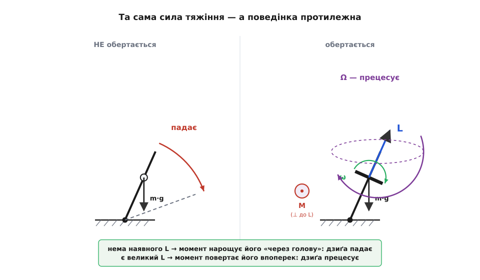
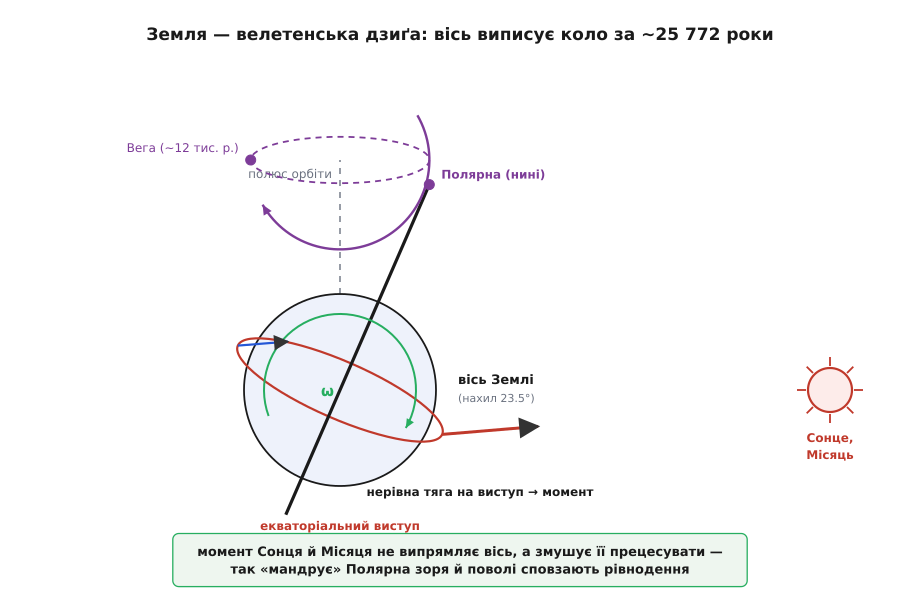

# Гіроскопічна прецесія: чому дзиґа не падає, а тікає вбік

<preknowlist>
- [Момент імпульсу](root:ph-mechanics/angular-momentum) — запас обертання L = J·ω, вектор уздовж осі; його міняє лише зовнішній момент. Уся прецесія — про те, як цей вектор повертається.
- [Момент сили](root:ph-mechanics/torque) — «здатність повертати» r × F; саме він змушує вісь гіроскопа мандрувати колом.
- [Момент інерції](root:ph-mechanics/moment-of-inertia) — наскільки важко тіло розкрутити; входить і в L = J·ω, і в темп прецесії.
- [Кутова швидкість](root:ph-mechanics/angular-velocity) — ω, наскільки швидко наростає кут повороту (рад/с).
- [Векторний добуток](root:math-algebra/cross-product) — r × F дає вектор, перпендикулярний до обох; звідси й це загадкове «вбік».
- [Правило правої руки](root:ph-electromagnetism/right-hand-rule) — куди саме дивляться вектори обертання й моменту.
</preknowlist>

Розкручена дзиґа (укр. вовчок) стоїть на вістрі й не падає — хоча олівець, поставлений на кінчик, валиться тієї ж миті. Мало того: штовхніть вісь дзиґи вбік — і вона не завалюється туди, куди її штовхнули, а починає ліниво обходити коло, виписуючи віссю конус, наче хтось водить її за невидиму мотузку. Те саме витворяє велосипедне колесо, підвішене за один кінець осі: замість упасти, воно поволі пливе по горизонтальному колу. Здоровий глузд обурюється — де ж тяжіння? Чому важка річ не падає, а тікає вбік, ще й перпендикулярно до того, як її штовхнули?

Уся ця дивовижа виростає з єдиного рівняння, до того ж уже знайомого зі звичайного обертання. Розберімо його до кінця — і кожна дивина стане не лише зрозумілою, а й передбачуваною наперед: ми порахуємо, з якою саме швидкістю мандруватиме вісь.

### Один закон за всім цим

Обертальна динаміка тримається на короткому законі — обертальному двійнику другого закону Ньютона. У прямому русі сила є швидкістю зміни імпульсу, F = dp/dt. Перекладімо кожне слово на обертальне: замість сили — [момент сили](root:ph-mechanics/torque) M, замість імпульсу — [момент імпульсу](root:ph-mechanics/angular-momentum) L. Дістаємо

```
M = dL/dt
```

Момент сили — це швидкість зміни моменту імпульсу. Читають це рівняння зазвичай як «прикладеш момент — розкрутиш тіло сильніше». Але в ньому ховається набагато більше, і вся річ у тім, що L і M — **вектори**. Рівняння каже не просто, наскільки зміниться запас обертання, а **в який бік** штовхнеться його вектор. За крихітну мить dt момент додає до вектора L маленький доважок

```
dL = M · dt
```

спрямований точно туди, куди дивиться M. Оце «куди» і є вся розгадка. Бо момент сили, за означенням, — це векторний добуток M = r × F, а він завжди перпендикулярний і до плеча r, і до сили F. Отже, доважок dL прийде до L **збоку**, а не вздовж. І тут усе залежить від того, чи вже є в тіла свій великий L.

### Чому не крутиться — падає, а крутиться — тікає вбік

Візьмімо спершу дзиґу, що **не** обертається, і відпустімо її трохи похиленою. Центр мас зміщений убік від точки опори, тож тяжіння тягне його вниз із плечем — виникає момент сили M = r × (m·g). Момент імпульсу дзиґи спочатку нульовий, тож рівняння M = dL/dt починає нарощувати L рівно в бік цього моменту — а той спрямований так, що описує **завалювання**. Дзиґа набирає обертання «через голову» й падає. Усе за здоровим глуздом.

Тепер розкрутімо дзиґу — сильно. У неї вже є величезний момент імпульсу L, спрямований уздовж осі обертання. Тяжіння створює точно той самий момент M, що й раніше, — горизонтальний, перпендикулярний до площини, у якій лежить похилена вісь. Але цього разу M додає свій доважок dL не до нуля, а до вже наявного великого L, і додає **впоперек** нього. А коли до вектора додати маленький доважок, перпендикулярний до нього, вектор не подовжується й не коротшає — він **повертається**. Кінець вектора L зсувається вбік, за ним повертається вісь обертання, і вся дзиґа поволі обходить конус навколо вертикалі, не падаючи. Оце й є **прецесія** (лат. *praecessio*, від *praecedere* — «іти попереду, передувати»).


*Ліворуч дзиґа не обертається: момент тяжіння нарощує L з нуля в бік завалювання — вона падає. Праворуч дзиґа розкручена, у неї великий L уздовж осі: той самий момент тепер додається впоперек L, тож повертає вектор, а не подовжує його. Вісь не падає, а виписує конус — прецесує. Різниця одна: чи є вже вектор, який моменту повертати.*

Ключ до всієї загадки — саме ця перпендикулярність відповіді до причини. Ми звикли до прямого руху, де тіло рушає **туди**, куди його штовхнули. В обертанні відповідь приходить **збоку** від штовхання, і не тому, що природа примхлива, а тому, що момент міняє не саму вісь напряму, а вектор L, який стоїть уздовж осі, — і міняє його впоперек. Вісь лише слухняно йде за своїм вектором.

### Це те саме, що рух тіла по колу

Цю саму геометрію легко впізнати в русі тіла по колу. Візьмімо тіло, що біжить колом зі сталою швидкістю. Його швидкість v — вектор — увесь час однакова за величиною, але безперервно повертається. Що її повертає? [Центрострімке прискорення](root:ph-mechanics/centripetal-acceleration): доважок до швидкості, спрямований **перпендикулярно** до самої швидкості, до центра кола. Сила, перпендикулярна до руху, не пришвидшує і не гальмує тіло — вона тільки завертає його вбік, і воно біжить колом.

Прецесія — точно та сама геометрія, лише замість швидкості v тут вектор L, а замість сили — момент M:

```
рух по колу:   dv ⊥ v    →  швидкість повертається, тіло біжить колом
прецесія:      dL ⊥ L    →  момент імпульсу повертається, вісь обходить конус
```

Момент сили тут відіграє роль «центрострімкої сили» для кінця вектора L: він увесь час тягне його вбік, ніколи не вздовж, тож кінець L і виписує коло. Аналогія точна до останньої дрібниці — і саме тому вона так допомагає. Ламається вона лише там, де ламається будь-яка аналогія між прямим і обертальним: у колі рухається сама точка тіла, а в прецесії «біжить колом» абстрактний кінець вектора L, за яким уже механічно тягнеться вісь. Але математика та сама.

### Наскільки швидко тікає вісь

Порахуймо темп прецесії — з якою кутовою швидкістю Ω вісь обходить конус. Момент тяжіння має величину M = m·g·r·sinθ, де r — відстань від опори до центра мас, а θ — нахил осі від вертикалі (плече найбільше, коли вісь горизонтальна). Цей момент повертає **горизонтальну** складову вектора L, а вона має довжину L·sinθ. Швидкість, з якою вектор довжини L·sinθ обходить коло під дією поперечного доважка M за секунду, — це просто M, поділене на цю довжину:

```
Ω = M / (L · sinθ) = (m·g·r·sinθ) / (J·ω·sinθ)
```

І тут трапляється маленьке диво: sinθ у чисельнику й знаменнику скорочується.

```
Ω = m·g·r / (J·ω)
```

Темп прецесії **не залежить від нахилу**. Похиліть дзиґу дужче чи менше — вона все одно обходить коло за той самий час. А ще темп обернено пропорційний до швидкості обертання ω: що швидше крутиться дзиґа, то **повільніше** й величніше вона прецесує. Ось звідки враження, ніби добре розкручена дзиґа «застигла»: її вісь мандрує так мляво, що око цього майже не ловить.

**Задача.** Велосипедне колесо (маса m = 4.0 кг, майже вся вона на ободі радіусом R = 0.30 м) розкрутили до ω = 20 рад/с і підвісили за кінець осі; центр мас на відстані r = 0.10 м від опори. Як швидко обертатиметься вісь і за скільки зробить повне коло?

```
Момент інерції обода:   J = m·R² = 4.0 · 0.30² = 0.36 кг·м²
Момент імпульсу:        L = J·ω  = 0.36 · 20   = 7.2 кг·м²/с
Момент тяжіння:         M = m·g·r = 4.0 · 9.8 · 0.10 = 3.9 Н·м
Темп прецесії:          Ω = M / L = 3.9 / 7.2 ≈ 0.54 рад/с
Період оберту осі:      T = 2π / Ω = 6.28 / 0.54 ≈ 12 с
```

Вісь неспішно обходить повне коло приблизно за дванадцять секунд. Розкрутіть колесо вдвічі швидше — і період прецесії теж подвоїться до двадцяти чотирьох секунд: більший запас обертання наполегливіше опирається повертанню. Повне [виведення цієї формули з M = dL/dt і чому нахил θ випадає](root:ph-mechanics/gyroscopic-precession/math-precession-rate.md) варте окремого розбору — там же видно, звідки береться наближення «швидкої дзиґи» й що стається, коли обертання надто повільне.

> 🔧 **Навіщо це.** На цій формулі стоїть **гірокомпас**. Важкий ротор розкручують так сильно, що його L майже незрушний у просторі; хитра підвіска дозволяє осі прецесувати лише в горизонтальній площині. Обертання самої Землі створює для такого ротора крихітний, але сталий момент, і той повертає вісь доти, доки вона не вкаже точно на географічну північ, і там її утримує. Ніякого магніту: гірокомпас показує справжній, а не магнітний полюс, тому ним і досі керуються кораблі та підводні човни, яким байдуже до магнітних аномалій.

### Маленька зрада: вісь усе-таки трохи падає

Чесна фізика мусить визнати незручність. Ми сказали «розкручена дзиґа не падає» — та як вона **починає** прецесувати з нерухомого стану? Якби в першу мить вісь уже пливла горизонтально, вона мусила б узятися нізвідки. Насправді, коли дзиґу відпускають, її вісь на волосину **падає** вниз — і саме це падіння дає їй трохи руху вниз, який тяжіння потім завертає в горизонтальну прецесію. Але, розігнавшись, вісь провалюється нижче, ніж треба для рівномірного обходу, тож підскакує назад угору, знову провалюється — і на плавне коло прецесії накладається дрібне кивання вгору-вниз. Це кивання звуть **нутацією** (лат. *nutatio* — «кивання», від *nutare* — «кивати головою»).

У добре розкрученій дзиґі нутація дрібна й швидка, тертя гасить її за секунди, і лишається чиста прецесія — тому в підручниковій картинці нею й нехтують. Але вона реальна: запустіть важкий гіроскоп обережно, поклавши вісь горизонтально й відпустивши, — і побачите, як край осі тремтить, виписуючи дрібні петлі, поки вгамується. [Числовий дослід, у якому віртуальну дзиґу розкручують і на власні очі бачать і прецесію, і нутацію](root:ph-mechanics/gyroscopic-precession/proj-top-simulation.md), показує це найнаочніше.

### Від дзиґи до Землі й супутника

Тепер, коли механізм прозорий, він раптом виявляється всюди. Найграндіозніша дзиґа — сама **Земля**. Вона обертається, тож має колосальний момент імпульсу вздовж своєї осі, нахиленої на 23.5° до площини орбіти. Земля не ідеальна куля: обертання роздуло її на екваторі в помітний виступ. Сонце й Місяць притягують ближчий край цього екваторіального виступу трохи сильніше, ніж дальший, — а нерівна тяга і є момент сили, що намагається «випрямити» нахилену вісь. Земля-дзиґа відповідає на цей момент так само, як усі дзиґи: не випрямляється, а **прецесує**. Її вісь поволі обходить конус, роблячи повне коло приблизно за 25 772 роки.


*Обертання роздуло Землю на екваторі. Сонце й Місяць тягнуть ближчий край виступу сильніше — виникає момент сили, що прагне випрямити нахилену вісь. Замість випрямитися, вісь прецесує: Північний полюс неба поволі мандрує зорями, і «полярною» по черзі стають різні зорі. Повний оберт — близько 25 772 років.*

Наслідки цього ми бачимо на небі. Зараз земна вісь дивиться майже точно на Полярну зорю — та за кілька тисяч років вона перестане бути «полярною»: вісь відповзе, і роль дороговказу перейде до інших зір, а десь через 12 тисяч років північ на небі вкаже яскрава Вега. Ще давні греки помітили, що точки рівнодення поволі сповзають зодіаком; грецький астроном Гіппарх виміряв цей зсув близько 129 року до н. е., порівнявши свій зоряний каталог із давнішими. Явище назвали **прецесією рівнодень** — і слово «прецесія» пішло саме звідси, бо рівнодення щороку настає трохи **раніше**, «передує». Що це той самий ефект, який хилить дзиґу, показав аж Ньютон, звівши сповзання зір до моменту сил на екваторіальний виступ. [Як поняття народжувалося — від Гіппархового зсуву зір до Фуко, що дав приладу ім'я «гіроскоп»](root:ph-mechanics/gyroscopic-precession/hist-gyroscope.md), — окрема, доволі несподівана історія.

> 🔧 **Навіщо це.** Керовані гіроскопи розвертають космічні апарати без краплі пального. Усередині Міжнародної космічної станції стоять важкі силові гіроскопи (англ. *control moment gyroscopes*): їхні розкручені ротори мають велетенський L, і, змушуючи ротор **прецесувати** в потрібний бік, станція дістає момент, яким повертає себе. Замість палити паливо в двигунах орієнтації, апарат «спирається» на прецесію власних маховиків. Той самий принцип стабілізує телескопи, тримає наведення камер і не дає завалитися однорейковим потягам.

Варто одразу відмежувати один сучасний прилад, щоб не сплутати. Крихітний **MEMS-гіроскоп** у кожному смартфоні звуть гіроскопом, але прецесії в ньому нема — він міряє обертання зовсім інакше, через [ефект Коріоліса](root:ph-mechanics/coriolis-effect) на дрібній вібрувальній масі. Класичний же гіроскоп — це саме важкий розкручений ротор, і живе він за законом прецесії, який ми щойно розібрали.

Одна проста думка проходить крізь усе. Момент сили міняє не вісь напряму, а вектор моменту імпульсу — і міняє його впоперек, коли той вектор уже великий. Тому дзиґа не падає, а обходить коло; тому велосипедне колесо пливе вбік; тому земна вісь тисячоліттями малює на небі повільне кільце. Порахуйте наявний L, знайдіть поперечний момент — і наперед знатимете, куди й з якою швидкістю подасться вісь.
