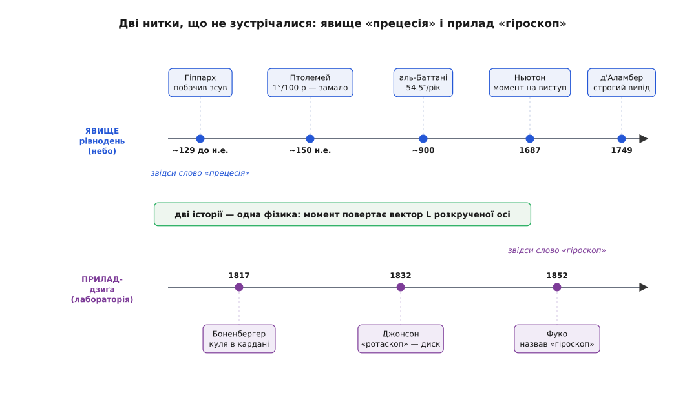
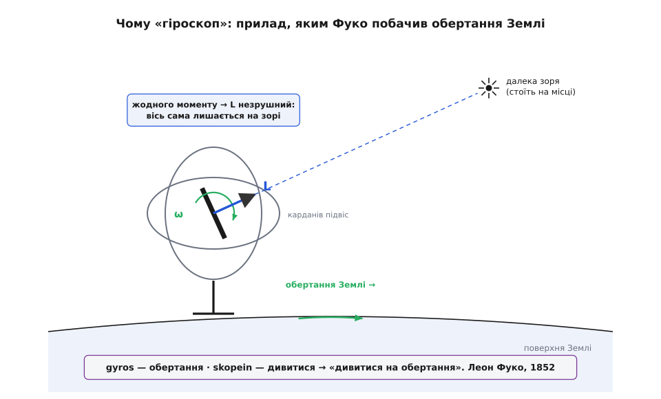

# 📜 Дві нитки одного хитання: як з'явилися «прецесія» і «гіроскоп»

Ми кажемо два ці слова майже в одному подиху, ніби вони — брат і сестра. Насправді їх розділяє близько дев'ятнадцяти століть, і народилися вони в людей, які й гадки не мали, що говорять про одне й те саме. «Прецесія» прийшла з нічного неба й старша за телескоп; «гіроскоп» вилупився з латунної цяцьки на паризькому столі 1852 року. Між ними лежить одне-єдине рівняння. Варто розплутати кожну нитку окремо — бо саме на швах, де вони мали б зійтися, ховається фізика.

Одразу домовмося розрізняти чотири різні речі, які легко змазати в одне героїчне «відкриття»: саме **явище** (щось повзе), **вимірювання** (як швидко повзе), **причину** (чому повзе) і, нарешті, **прилад** та його **назву**. Це різні люди й різні століття.


*Верхня нитка — небо: Гіппарх побачив зсув, Птолемей і аль-Баттані його виміряли, Ньютон із д'Аламбером пояснили. Нижня нитка — лабораторія: Боненбергер і Джонсон збудували дзиґу в підвісі, Фуко дав їй ім'я. Слово «прецесія» родом із верхньої нитки, «гіроскоп» — із нижньої; сходяться вони тільки в одному законі — момент повертає вектор розкрученої осі.*

### Гіппарх ловить зорі на гарячому

Близько 129 року до н. е. на Родосі грецький астроном **Гіппарх Нікейський** (Ἵππαρχος, ~190–120 до н. е.) укладав каталог зір — найдавнішу відому спробу розмітити все небо числами. І, звіряючи свої виміри з давнішими, він помітив прикрість. Зоря Спіка (Колос Діви) стояла не там, де її бачили його попередники **Тимохаріс** і **Арістілл** в Александрії майже за півтора століття до того, близько 283 року до н. е. За цей час Спіка сповзла приблизно на 2° відносно точки осіннього рівнодення.

Одна зоря могла б і збитися — але зсунулися **всі**, злагоджено, в один бік. А коли рухається геть увесь зоряний візерунок, розумніше сказати, що рухається не він, а сама мітка, від якої його відлічують: точка рівнодення поволі повзе зодіаком назустріч річному ходу Сонця. Гіппарх оцінив темп як «не менше за 1° за століття» — обережна нижня межа (справжнє значення ближче до 50″ за рік, тобто 1° приблизно за 72 роки). Його власні книги втрачені; ми знаємо про це відкриття з «Альмагесту» Клавдія Птолемея (~150 н. е.), який чесно приписав його Гіппархові. *(Доказовий статус: надійно засвідчено через Птолемея; поодинокі твердження, ніби явище знали ще вавилоняни, лишаються недоведеними.)* Тут головне ось що: Гіппарх **побачив** явище — але не дав йому імені й гадки не мав, що його спричиняє.

### Слово, що означає «прийти зарано»

Звідки ж «прецесія»? Точка рівнодення повзе на захід, проти річного руху Сонця на схід. Тому щороку Сонце повертається до неї трохи **раніше** — десь на двадцять хвилин швидше, ніж встигло б обійти повне коло відносно зір. Подія ніби забігає наперед; латиною вона *praecedit*, «іде попереду». Звідси *praecessio aequinoctiorum* — прецесія рівнодень. Це вже пізня латина, не Гіппархова грека. Прикметно: назва зафіксувала не причину, а **симптом** — календар, що вперто настає раніше за зорі. Пояснювати нічого ще не пояснювали; просто дали ім'я тому, що впадало в око.

### Півтори тисячі років вимірювань без причини

Далі сталася дивна річ: явище дедалі точніше **міряли**, а пояснити навіть не бралися. Птолемей закріпив у таблицях Гіппархову обережну оцінку — рівно 1° за століття (близько 36″ за рік), і ця занижена цифра поїхала крізь віки. Виправили її астрономи ісламського світу. **Аль-Баттані** (Мухаммад ібн Джабір аль-Баттані, ~858–929, родом із Гаррану, працював у Ракці) виміряв зсув як 54.5″ за рік — 1° за 66 років, разюче близько до істини. А його сучасник **Сабіт ібн Курра** (Thābit ibn Qurra, ~836–901, вчений-сабій із того ж Гаррану) спробував явище **пояснити** — і схибив: він припустив «трепідацію», ніби рівнодення не повзуть рівномірно, а **гойдаються** туди-сюди, для чого дописав до восьми небесних сфер дев'яту. Аль-Баттані цій вигадці не повірив і лишив у своїх таблицях сталий темп — і мав рацію. Трепідація виявилася хибною теорією, яка все ж бентежила астрономів аж до часів Миколи Коперника.

Варто назвати цих людей точно: не «арабська наука взагалі», а конкретні сабії з Гаррану, чия математична школа дала кількох видатних астрономів. І варто вловити суть цих півтори тисячі років: мітка на небі повзла, її ловили дедалі точніше — а сили, що її штовхає, ніхто не бачив. Дрейф без причини.

### Ньютон каже: то момент на пузо Землі

1687 рік, «Математичні начала натуральної філософії», третя книга. **Ісаак Ньютон** дає нарешті відсутню причину — і вона несподівана. Земля не ідеальна куля: власне обертання роздуло її на екваторі в помітний виступ. Сонце й Місяць притягують ближчий край цього виступу трохи сильніше, ніж дальший, і ця нерівна тяга — [момент сили](root:ph-mechanics/torque), «здатність повертати», що намагається випрямити нахилену вісь. Але розкручена планета не випрямляється: у неї колосальний [момент імпульсу](root:ph-mechanics/angular-momentum), запас обертання вздовж осі, і поперечний момент не перекидає цей вектор, а **повертає** його вбік. Вісь обходить конус — це і є прецесія. Та сама [сила тяжіння](root:ph-mechanics/newton-gravitation), що тримає Місяць на орбіті, малює на небі повільний дрейф, який колись помітив Гіппарх.

Ньютонове число вийшло приблизно правильним — але виведення шкутильгало: він погано знав розмір виступу й подекуди підганяв кроки. *(Доказовий статус: правильна ідея, недосконале виведення.)* Строгу версію дав аж **Жан Лерон д'Аламбер** (Jean le Rond d'Alembert, 1717–1783): його праця 1749 року «Recherches sur la précession des équinoxes» уперше коректно трактувала Землю як тверде тіло, що обертається, — це, по суті, народження динаміки твердого тіла, — і врахувала ще й дрібне «кивання» осі, яке щойно виміряв **Джеймс Бредлі** (нутацію). Відтепер небесна нитка мала під собою фізику: момент сили на велетенську дзиґу.

### Дзиґа в кардані — прилад, який ще не має імені

А тим часом снувалася друга нитка, вже не в небі, а на столі. Щоб **показати** цю впертість осі просто в лекційній залі, майстри почали робити розкручені цяцьки. **Йоганн Готтліб Фрідріх фон Боненбергер** (Johann G. F. von Bohnenberger, 1765–1831), професор із Тюбінгена, описав 1817 року свою «машину»: важка куля крутилася всередині набору вкладених кілець — карданового підвісу, що дозволяв осі дивитися куди завгодно, поки рама вільно оберталася довкола. За кілька років, 1832-го, американець **Волтер Р. Джонсон** (Walter R. Johnson, 1794–1852) зробив варіант із диском замість кулі й назвав його «ротаскоп».

Це були демонстратори: ти розкручуєш ротор і дивишся, як вісь відмовляється йти за рамою. І ось що тут головне. Прилад **уже існував** — і не мав усталеного імені (то «машина», то «ротаскоп»). А ще: ніхто поки що не пов'язав цю латунну впертість на столі з дрейфом рівнодень у небі. Прилад (Боненбергер, Джонсон) і явище (Гіппарх) лишалися чужими одне одному — хоча Ньютон уже пів століття як записав той єдиний закон, що керує обома.

### Фуко дає приладу очі — і назву

1852 рік, Париж. **Леон Фуко** (Léon Foucault, 1819–1868), рік по тому, як його славнозвісний довгий маятник наочно довів обертання Землі, шукав другий, незалежний доказ того самого. Він узяв розкручений ротор у кардановому підвісі й міркував так: якщо на вісь не діє жоден момент, її вектор мусить лишатися **незрушним у просторі** — а отже, поки Земля возить лабораторію по колу, вісь має видимо «сповзати» відносно стін кімнати, і крізь це сповзання можна на власні очі **побачити**, як обертається планета.


*Ротор у кардановому підвісі розкручений, момент на нього не діє — тож його вектор L стоїть незрушно й показує на ту саму далеку зорю. Земля (разом зі стендом і всією лабораторією) обертається під ним, і це зміщення видно оком. Прилад, яким дивляться на обертання: gyros (обертання) + skopein (дивитися).*

Фуко розкрутив ротор до приблизно 150–200 обертів за секунду хитрою передачею від ручки; той тримався близько десяти хвилин, поки тертя не брало гору, — саме стільки, щоб уловити дрейф. Для цього приладу-щоб-бачити-обертання він і викував слово з грецьких коренів: *gyros* (γῦρος — обертання, коло) плюс *skopein* (σκοπεῖν — дивитися) = **гіроскоп**, буквально «дивитися на обертання». *(Доказовий статус: авторство слова надійно закріплене за Фуко, «Comptes Rendus» 1852.)* Найтонший поворот думки ось у чому: назва народилася зовсім **не** з прецесії, а з її протилежного боку — з осі, яка **не** рухається, коли її ніщо не штовхає.

### Дві нитки — один вузол

Складімо тепер нитки поряд. **Ідея**, що дрейф існує, — Гіппарх, ~129 до н. е. **Вимірювання**, дедалі точніше, — Птолемей, аль-Баттані, довгі століття. **Причина** — момент сили на розкручене тіло — Ньютон, 1687, а строго — д'Аламбер, 1749. **Прилад**, розкручений ротор у підвісі, — Боненбергер, 1817, Джонсон, 1832. **Назва** для приладу — Фуко, 1852. Чотири різні речі, чотири різні епохи; злити їх в одне героїчне «винайшли гіроскоп» — спокуса, але шви тут значать більше за пафос.

«Прецесія» називає симптом у небі; «гіроскоп» — знаряддя на столі; а та незрушність, яку охрестив Фуко, і той дрейф, який упіймав Гіппарх, — це два обличчя однієї короткої лінії:

```
момент → dL/dt:   штовхни L убік    → вісь прецесує
                  не штовхай зовсім → вісь стоїть незрушно, як зоря
```

Штовхни вектор моменту імпульсу впоперек — вісь обходить коло; не штовхай ніяк — вона стоїть непорушна, наче зоря. Тому, коли ваш телефон повідомляє свій «гіроскоп» (який, за іронією, узагалі не крутиться й ловить обертання зовсім іншим фокусом), ви тримаєтеся за дальній кінець нитки, що тягнеться крізь Фукову ручку, повз Ньютонове екваторіальне пузо, аж до грека на Родосі, який завважив, що одна зоря відкочувала на два пальці за півтори сотні років.
