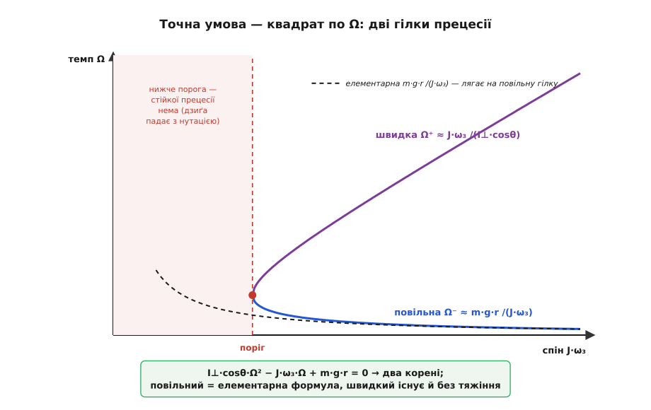
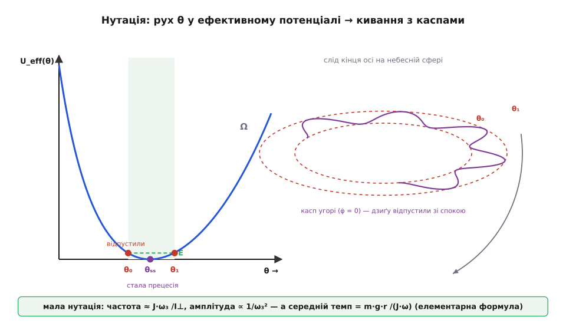

# 🧮 Темп прецесії: як із M = dL/dt випадає нахил, а з нього — дві гілки й нутація

Швидкий висновок про прецесію звучить так: розкручена дзиґа обходить коло з темпом

```
Ω = m·g·r / (J·ω)
```

— темпом, що дивовижно не залежить від нахилу осі. Цю формулу легко «отримати за пів рядка», і саме тому варто зупинитися й запитати, що ми в тому пів рядку тихцем відкинули. Бо коли те відкинуте повернути, з одного рівняння M = dL/dt виростає не одна швидкість прецесії, а **дві** — повільна й швидка; з'являється поріг, нижче якого стійкої прецесії взагалі нема; і на плавне коло сідає дрібне кивання — нутація. Розберімо весь ланцюг від першопричини: спершу чесно виведемо швидку формулу й побачимо, чому скорочується sinθ, а потім знайдемо, де ця формула — лише перший доданок точнішої відповіді.

Уся динаміка тут тримається на одному законі — обертальному двійнику Ньютонового: [момент сили](root:ph-mechanics/torque) є швидкістю зміни [моменту імпульсу](root:ph-mechanics/angular-momentum),

```
M = dL/dt
```

Це рівняння **векторне**: воно каже не лише, наскільки, а й **в який бік** зсувається кінець вектора L. Уся прецесія — це історія про те, як момент повертає цей вектор, не подовжуючи його. Наше завдання — перетворити «повертає» на число.

## Швидкий вивід: чому нахил випадає

Поставмо дзиґу на вістря, нахиливши вісь на кут θ від вертикалі. Розкручена дзиґа має великий момент імпульсу вздовж своєї осі, L = J·ω, де J — [момент інерції](root:ph-mechanics/moment-of-inertia) відносно осі обертання, а ω — швидкість спіну. Тяжіння прикладене до центра мас на відстані r від опори й тягне його вниз; момент цієї сили відносно опори — це [векторний добуток](root:math-algebra/cross-product) M = r × (m·g), і його величина

```
M = m·g·r·sinθ
```

Плече найбільше, коли вісь горизонтальна (θ = 90°), і зникає, коли вісь стоїть сторч. Цей момент горизонтальний і перпендикулярний до вертикальної площини, у якій лежить похилена вісь.

Тепер ключове спостереження. Момент повертає не весь вектор L, а лише його **горизонтальну складову** — бо прецесія крутить вісь навколо вертикалі, а вертикальна складова L при цьому не міняється. Горизонтальна складова має довжину

```
L⊥ = L·sinθ = J·ω·sinθ
```

Уявімо, що дивимося на дзиґу згори. Кінець цього горизонтального вектора довжини L⊥ біжить по колу, а «штовхає» його вбік поперечний доважок M за секунду. Швидкість, з якою вектор довжини L⊥ обертається під дією перпендикулярного доважка M, — це просто відношення одного до одного:

```
Ω = M / L⊥ = (m·g·r·sinθ) / (J·ω·sinθ)
```

І тут стається маленьке диво: **sinθ у чисельнику й знаменнику скорочується**. Момент тяжіння росте з нахилом як sinθ — але рівно так само росте й та горизонтальна складова L, яку цьому моменту треба повертати. Обидва множники ідуть в ногу, тож їхнє відношення нахилу вже не бачить:

```
Ω = m·g·r / (J·ω)
```

Темп прецесії однаковий, чи дзиґа ледь схилена, чи завалена майже до столу. І він **обернено** пропорційний до спіну: що швидше крутиться дзиґа, то повільніше й велебніше вона прецесує — більший запас обертання наполегливіше опирається повертанню.

Формула чудова, і для доброї дзиґи вона напрочуд точна. Але придивімося до кроку «момент повертає горизонтальну складову L». Ми мовчки припустили, що весь L дивиться вздовж осі спіну — тобто **L = J·ω·ê₃**, де ê₃ — орт осі. А це не вся правда: коли вісь сама прецесує, у тіла з'являється ще й обертання навколо вертикалі, і воно теж вносить у L свою частку. Ту частку ми проґавили. Поверньмо її.

## Що ми проґавили: L — це не лише спін

Розкладімо повне обертання дзиґи на очевидні дві частини. По-перше, вона крутиться навколо власної осі зі спіном ω. По-друге, сама вісь повертається навколо вертикалі ẑ з темпом Ω. Повна кутова швидкість тіла — сума цих двох:

```
ω_тіла = Ω·ẑ + ω_сп·ê₃
```

Уведімо орт ê₁ — перпендикуляр до осі ê₃, що лежить у вертикальній площині, натягнутій на ê₃ й ẑ, і спрямований так, щоб

```
ẑ = cosθ·ê₃ + sinθ·ê₁
```

Тоді третій орт ê₂ = ê₃ × ê₁ горизонтальний і дивиться з площини — саме туди, куди й момент тяжіння.

Момент імпульсу тіла — це кутова швидкість, «зважена» моментом інерції, і тут криється тонкість: уздовж осі симетрії момент інерції один (назвімо його J — це осьовий, спіновий момент), а поперек осі — інший (назвімо його I⊥ — поперечний момент відносно **точки опори**). Це різні числа: скажімо, для велосипедного колеса осьовий J = m·R², а поперечний удвічі менший плюс доданок від зсуву опори (докладніше про те, чому в тіла кілька моментів інерції за різними осями — у [тензорі інерції](root:ph-mechanics/moment-of-inertia/math-inertia-tensor.md)). Розкладімо ω_тіла на осьову й поперечну частини.

Осьова складова (проєкція на ê₃):

```
ω₃ = ê₃·ω_тіла = ω_сп + Ω·cosθ
```

Це повний спін навколо осі симетрії — трохи більший за «власний» ω_сп, бо прецесія докручує. Поперечна складова — це те, що лишилося:

```
ω_тіла − ω₃·ê₃ = Ω·ẑ + ω_сп·ê₃ − (ω_сп + Ω·cosθ)·ê₃ = Ω·(ẑ − cosθ·ê₃) = Ω·sinθ·ê₁
```

Отже, повний момент імпульсу має **дві** частини, а не одну:

```
L = J·ω₃·ê₃  +  I⊥·Ω·sinθ·ê₁
     └ спін ┘     └ від самої прецесії ┘
```

Ось вона, проґавлена складова: I⊥·Ω·sinθ·ê₁ — поперечний момент імпульсу, що з'являється **через** прецесію. Швидкий вивід її викинув, бо для доброї дзиґи вона мізерна проти J·ω₃. Але саме вона перетворить лінійне рівняння на квадратне.

## Точний вивід: dL/dt = Ω × L

Тепер — акуратно. При **сталій** прецесії (нахил θ незмінний, темп Ω сталий) увесь вектор L обертається навколо вертикалі ẑ як одне ціле, з тим самим темпом Ω. А похідна вектора, що жорстко обертається з кутовою швидкістю Ω·ẑ, дається класичною формулою обертання:

```
dL/dt = (Ω·ẑ) × L
```

Це і є вся ліва частина закону M = dL/dt для сталої прецесії. Порахуймо векторний добуток, підставивши обидві частини L і розписавши ẑ = cosθ·ê₃ + sinθ·ê₁. Нам знадобляться два прості добутки ортів:

```
ẑ × ê₃ = sinθ·(ê₁ × ê₃) = −sinθ·ê₂
ẑ × ê₁ = cosθ·(ê₃ × ê₁) =  cosθ·ê₂
```

Тоді

```
dL/dt = Ω·[ J·ω₃·(ẑ × ê₃) + I⊥·Ω·sinθ·(ẑ × ê₁) ]
      = Ω·[ J·ω₃·(−sinθ·ê₂) + I⊥·Ω·sinθ·(cosθ·ê₂) ]
      = Ω·sinθ·( I⊥·Ω·cosθ − J·ω₃ )·ê₂
```

Уся швидкість зміни L дивиться вздовж ê₂ — горизонтально, з площини осі, — саме туди, куди й має дивитися момент тяжіння. Порахуймо тепер праву частину. Момент тяжіння відносно опори:

```
M = r·ê₃ × (−m·g·ẑ) = −m·g·r·(ê₃ × ẑ) = −m·g·r·sinθ·(ê₃ × ê₁) = −m·g·r·sinθ·ê₂
```

Прирівнюємо ліву й праву частини закону M = dL/dt. Обидві — вздовж ê₂, тож лишаються самі коефіцієнти, і спільний множник sinθ скорочується (той самий, що й у швидкому виводі):

```
Ω·( I⊥·Ω·cosθ − J·ω₃ ) = −m·g·r
```

Розкриймо — і дістанемо **точну умову сталої прецесії**:

```
I⊥·cosθ·Ω²  −  J·ω₃·Ω  +  m·g·r  =  0
```

Це вже не лінійне рівняння, а **квадратне** відносно Ω. Уся різниця зі швидким виводом — у першому доданку I⊥·cosθ·Ω². Він народився рівно з тієї поперечної складової L, яку ми були викинули. Викиньмо її знову — тобто відкиньмо доданок з I⊥ — і лишиться

```
−J·ω₃·Ω + m·g·r = 0   →   Ω = m·g·r / (J·ω₃)
```

точнісінько елементарна формула. Отже, швидкий вивід — це не «інша фізика», а перший, лінійний наближений корінь точного квадратного рівняння. Тепер погляньмо, що дає другий корінь.

## Дві гілки прецесії

Квадратне рівняння має два розв'язки. Розв'язавши I⊥·cosθ·Ω² − J·ω₃·Ω + m·g·r = 0, дістаємо

```
Ω± = [ J·ω₃ ± √( J²·ω₃² − 4·I⊥·m·g·r·cosθ ) ] / (2·I⊥·cosθ)
```

Дві швидкості, з якими та сама дзиґа при тому самому нахилі може прецесувати рівномірно. Придивімося до них у межі доброї дзиґи, коли спіновий доданок J·ω₃ величезний проти кореневого. Розкладімо корінь: √(J²ω₃² − 4I⊥mgr·cosθ) ≈ J·ω₃·(1 − 2·I⊥·m·g·r·cosθ / (J²ω₃²)).

**Повільна гілка** (знак «−»): у чисельнику велике майже гаситься великим, лишається дрібне:

```
Ω⁻ ≈ m·g·r / (J·ω₃)
```

Це наша елементарна прецесія — та, що обходить коло за секунди й керує гірокомпасом та земною віссю. Тіло майже не «знає» про свій поперечний момент інерції I⊥: у формулі його нема, і тому наївний вивід, який стежив лише за спіном J·ω₃, влучив у ціль, ні разу про I⊥ не згадавши.

**Швидка гілка** (знак «+»): тут два великі складаються, і виходить велике:

```
Ω⁺ ≈ J·ω₃ / (I⊥·cosθ)
```

Це стрімка прецесія, у якій тяжіння майже ні до чого — вона живе й без нього. Це, по суті, вільний поворот тіла навколо власного вектора L: навіть у невагомості несиметрично закручене тіло описує віссю конус саме з таким темпом. Тяжіння лише ледь підправляє цю природну частоту. На практиці дзиґу майже ніколи не запускають на швидкій гілці — для неї треба надати осі стрімкого початкового оберту, — тож бачимо ми зазвичай повільну. Але математично гілки рівноправні.


*Точна умова I⊥·cosθ·Ω² − J·ω₃·Ω + m·g·r = 0 дає дві швидкості прецесії при кожному спіні. Повільна гілка Ω⁻ спадає як 1/ω₃ й лягає точно на пунктирну елементарну формулу m·g·r/(J·ω₃); швидка Ω⁺ росте майже лінійно й існує навіть без тяжіння. Ліворуч від порога підкореневий вираз від'ємний — дійсних розв'язків нема, і рівномірна прецесія неможлива: дзиґа падає.*

## Наближення швидкої дзиґи й де воно ламається

Тепер видно, коли елементарна формула законна. Ми відкинули доданок I⊥·cosθ·Ω² проти J·ω₃·Ω. Підставивши повільний корінь Ω ≈ m·g·r/(J·ω₃), оцінімо їхнє відношення:

```
I⊥·cosθ·Ω² / (J·ω₃·Ω) = I⊥·cosθ·Ω / (J·ω₃) ≈ I⊥·m·g·r·cosθ / (J²·ω₃²)
```

Отже, елементарна формула добра рівно тоді, коли

```
J²·ω₃²  ≫  I⊥·m·g·r·cosθ
```

— коли спіновий момент імпульсу J·ω₃ набагато перевищує «гравітаційний масштаб» √(I⊥·m·g·r). Це і є суворе означення **швидкої дзиґи**. Умова природна: що швидший спін, то менша поправка, і то точніша проста формула.

А що коли спін замалий? Підкореневий вираз J²·ω₃² − 4·I⊥·m·g·r·cosθ стає **від'ємним** — і корені стають уявними. Це не математична дивина, а фізичний вирок: при нахилі θ **рівномірної прецесії просто не існує**, якщо

```
J²·ω₃²  <  4·I⊥·m·g·r·cosθ
```

Дзиґа не може обходити коло сталим темпом — вона завалюється, дико киваючи. Поріг настає, коли підкореневий вираз рівний нулю; там обидві гілки зливаються в одну (на малюнку — точка дотику), і мінімальний спін для сталої прецесії при куті θ дорівнює

```
ω₃(мін) = √( 4·I⊥·m·g·r·cosθ ) / J
```

Найкрасивіший окремий випадок — вертикальна дзиґа (θ → 0, cosθ → 1), так звана **спляча** (англ. *sleeping top*): вона стоїть сторч і, здається, взагалі не рухається. Наша умова каже, що це можливо лише доти, доки

```
J²·ω₃²  >  4·I⊥·m·g·r
```

Поки спіну досить, вертикаль стійка — штовхни дзиґу, і вона повернеться в сторч. Але тертя поволі гасить ω₃, і в мить, коли спін падає нижче цього порога, вертикаль раптом стає нестійкою: дзиґа «прокидається», починає хилитися й виписувати конус, що дедалі ширшає. Кожен, хто пускав дзиґу, бачив цю раптову зраду наприкінці — і ось її точна умова.

## Нутація: точніша поправка й звідки береться прецесія

Лишилося одне незручне питання, яке чесна фізика мусить поставити. Ми весь час припускали **сталу** прецесію — θ незмінне, вісь пливе рівним колом. Але як дзиґа **починає** прецесувати, якщо її просто відпустити зі спокою? У першу мить вісь нерухома; звідки б узятися готовому горизонтальному рухові? Відповідь: спочатку вісь трохи **падає**, і саме це падіння дає їй поперечний рух, який тяжіння завертає в прецесію. А розігнавшись, вісь провалюється нижче, ніж треба для рівного кола, тож підскакує назад — і на прецесію накладається кивання вгору-вниз, **нутація** (лат. *nutatio* — «кивання»).

Щоб її злапати, треба відпустити припущення θ = const і подивитися на рух θ саме по собі. Тут дуже допомагають три збережені величини — їх дає симетрія задачі (найпрозоріше — через функцію Лагранжа в [кутах Ейлера](root:math-geometry/euler-angles), але кожну можна побачити й фізично):

- **Осьовий спін** J·ω₃ сталий: момент тяжіння M = r·ê₃ × F перпендикулярний до осі ê₃, тож уздовж осі не має плеча — обертання навколо осі симетрії ніщо не гальмує.
- **Момент імпульсу вздовж вертикалі** L_z сталий: момент тяжіння горизонтальний, вертикальної складової не має, тож L_z ніщо не міняє.
- **Повна енергія** E стала: тяжіння консервативне.

З перших двох одразу випливає темп прецесії при довільному θ. Момент імпульсу вздовж вертикалі — це L_z = I⊥·φ̇·sin²θ + J·ω₃·cosθ, де φ̇ — миттєвий темп повороту навколо вертикалі. Розв'язавши відносно φ̇:

```
φ̇ = ( L_z − J·ω₃·cosθ ) / ( I⊥·sin²θ )
```

Прецесія більше не мусить бути сталою — φ̇ живе разом із θ. А енергію можна причесати до вигляду «частинка в потенційній ямі». Виокремивши сталий спіновий доданок ½·J·ω₃², решта складається в

```
E = ½·I⊥·θ̇²  +  U_eff(θ)  +  const,   де

U_eff(θ) = ( L_z − J·ω₃·cosθ )² / ( 2·I⊥·sin²θ )  +  m·g·r·cosθ
```

Ось де вся картина стає наочною. Кут θ рухається точно як одновимірна частинка масою I⊥ в потенціалі U_eff(θ): нахиляється туди-сюди між двома точками повороту, де θ̇ = 0. **Дно ями** — це стала прецесія: там θ̇ = 0 **і** θ̈ = 0, вісь пливе рівно (можна перевірити, що мінімум U_eff дає рівно наше квадратне рівняння). А будь-який рух із ненульовою амплітудою в ямі — це нутація: кут θ гойдається між θ₀ і θ₁, і на плавну прецесію сідає кивання.


*Ліворуч: кут θ рухається як частинка масою I⊥ в потенціалі U_eff. Дно ями θₛₛ — стала прецесія. Дзиґа, відпущена зі спокою при θ₀, стартує на стінці ями (там і θ̇ = 0, і φ̇ = 0), скочується вниз, проскакує дно й піднімається до θ₁, потім назад — це й є нутація. Праворуч: слід кінця осі на небі. У точці θ₀ прецесія на мить завмирає (φ̇ = 0), тож вісь малює гострий касп; між каспами вона провисає до θ₁. Вийшла цикоїда з вістрями — класичний підпис нутації.*

Розгляньмо саме випадок «відпустили зі спокою» — найпоширеніший і найпромовистіший. На старті і θ̇ = 0, і φ̇ = 0. Друге означає, що початковий кут θ₀ — це той, де чисельник φ̇ обертається в нуль: L_z = J·ω₃·cosθ₀. Тому θ₀ виявляється **верхньою** точкою повороту ями (найвищим положенням осі), звідки вісь скочується вниз. У цій точці прецесія на мить зупиняється — і слід кінця осі малює гострий **касп** (вістря), як у зупинки коліщатка, що котиться. Між каспами вісь провисає до θ₁ і вертається: виходить цикоїда з вістрями нагорі.

Для доброї (швидкої) дзиґи ця нутація дрібна й швидка. Розклавши U_eff біля дна в параболу, дістаємо гармонічне кивання; його **частота**

```
ω_нут ≈ J·ω₃ / I⊥
```

(жорсткість ями ~ (J·ω₃)²/I⊥, «маса» I⊥ — звідси квадрат частоти (J·ω₃/I⊥)²), а **амплітуда** для дзиґи, відпущеної зі спокою при θ₀,

```
Δθ ≈ 2·I⊥·m·g·r·sinθ₀ / (J²·ω₃²)
```

Обидві формули промовисті. Частота нутації росте зі спіном, а амплітуда падає як 1/ω₃² — тому в добре розкрученій дзиґі кивання майже невидиме: дрібне й таке шпарке, що око зливає його в суцільну лінію, а тертя гасить за секунди. Ось чому підручникова прецесія «чиста»: нутація нікуди не зникла, вона просто дрібна.

**Задача.** Візьмімо те саме велосипедне колесо, що прецесує в основній статті: маса m = 4.0 кг на ободі радіусом R = 0.30 м, спін ω = 20 рад/с, центр мас на r = 0.10 м від опори. Осьовий момент J = m·R² = 0.36 кг·м². Поперечний момент відносно опори (обід по діаметру ½·m·R² плюс зсув m·r² за теоремою Гюйгенса–Штейнера): I⊥ = ½·0.36 + 4.0·0.10² = 0.18 + 0.04 = 0.22 кг·м². Колесо відпустили з горизонтальною віссю (θ₀ = 90°, sinθ₀ = 1). Порахуймо кивання поверх прецесії:

```
Частота нутації:   ω_нут = J·ω / I⊥ = 0.36·20 / 0.22 ≈ 32.7 рад/с
Період нутації:    T_нут = 2π / ω_нут ≈ 0.19 с
Амплітуда:         Δθ = 2·I⊥·m·g·r·sinθ₀ / (J²·ω²)
                      = 2·0.22·(4.0·9.8·0.10) / (0.36²·20²)
                      = 1.72 / 51.8 ≈ 0.033 рад ≈ 1.9°
```

Отже, поки вісь неспішно прецесує з темпом ≈ 0.54 рад/с (повне коло за ~12 с), її кінець ще й дрібно киває на якихось два градуси, роблячи повний кивок за п'яту частину секунди. Швидке ледь помітне тремтіння на повільному величавому обході — ось повна картина, якою нехтує елементарна формула.

І остання, найгарніша ланка. Усередині нутації темп прецесії φ̇ не сталий — він гойдається разом із θ. Але якщо усереднити φ̇ за один період кивання, вийде рівно

```
⟨φ̇⟩ = m·g·r / (J·ω₃)
```

Тобто елементарна формула — це **середній** темп прецесії по нутації. Вона нічого не «спрощує неправильно»: вона дає точну середню швидкість дрейфу осі, а всі дрібні кивання просто зрізає в одну плавну лінію. Саме тому нею можна впевнено рахувати гірокомпас і земну вісь — усереднена вона правдива до останньої цифри.

## Що з усього цього лишити в голові

Одне квадратне рівняння тримає всю історію. Точна умова сталої прецесії

```
I⊥·cosθ·Ω²  −  J·ω₃·Ω  +  m·g·r  =  0
```

каже все відразу. Відкиньте перший доданок — і повільний корінь дасть елементарне Ω = m·g·r/(J·ω), з якого нахил θ випадає, бо однаково входить у момент і в горизонтальну складову L. Лишіть перший доданок — і поряд стане швидка гілка Ω⁺ ≈ J·ω₃/(I⊥·cosθ), жива й без тяжіння. Прирівняйте підкореневий вираз до нуля — дістанете поріг сплячої дзиґи J²ω₃² = 4·I⊥·m·g·r·cosθ, нижче якого прецесія неможлива. А відпустіть припущення θ = const — і побачите нутацію, дрібне кивання з частотою J·ω₃/I⊥ й амплітудою ∝ 1/ω₃², середнє якого й повертає елементарну формулу. Проста відповідь виявилася першим доданком глибшої — а глибша вся вмістилася в один квадрат по Ω.
