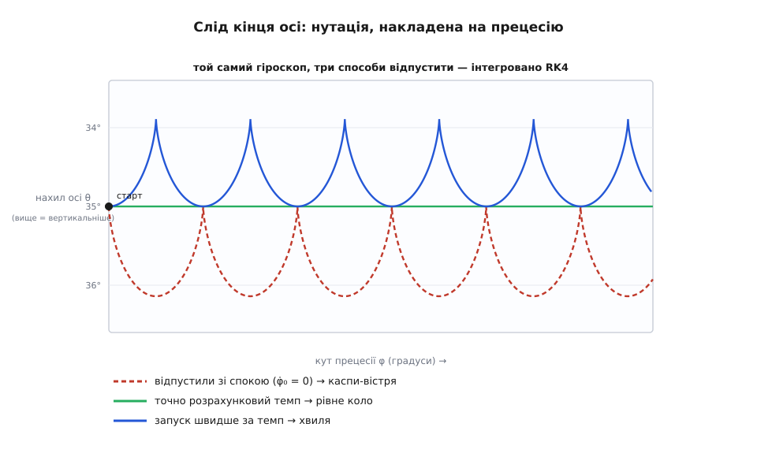
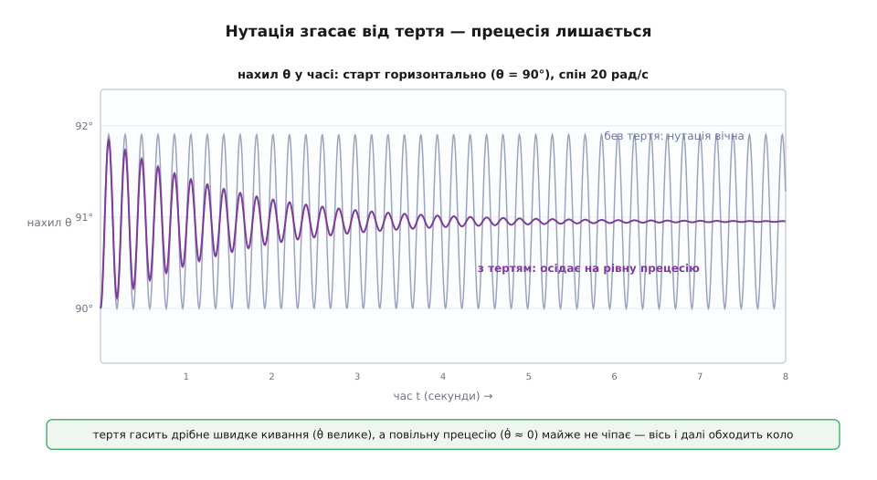
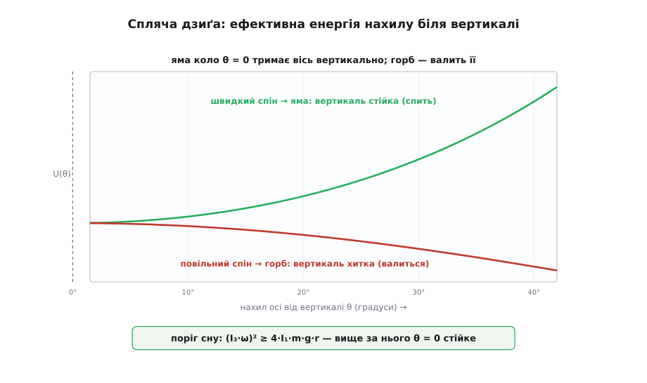

# ⚙️ Віртуальна дзиґа: інтегруємо рух і ловимо нутацію на очах

Формула прецесії Ω = m·g·r/(J·ω) — коротка й точна, але вона мовчить про найцікавіше. Вона видає темп, з яким вісь обходить коло, коли та вже пливе рівно, — і жодного слова про те, що діється в **першу мить** після того, як дзиґу відпустили; чому добре розкручена дзиґа стоїть сторч, а квола валиться; що з нею робить тертя. Формула — це вже усталений, згладжений рух. А реальна дзиґа, поки вгамується, ще й дрібно киває віссю — **нутація**, — і цього кивання формула не бачить у принципі, бо будувалась саме як його середнє.

Щоб побачити все разом, треба перестати **розв'язувати** й почати **рахувати крок за кроком**. Ми не братимемо готової відповіді формулою — ми складемо дзиґу з її власних рівнянь руху й пустимо комп'ютер марширувати крізь час дрібними кроками. На екрані з'явиться слід кінця осі — не гладке коло, а зубчаста доріжка з дрібних петель і вістер; ми виміряємо темп прецесії й звіримо з формулою; тоді додамо тертя й на очах побачимо, як нутація гасне, лишаючи чисту прецесію; і нарешті поставимо дзиґу сторч і з'ясуємо, чому вона там тримається — або падає.

## Дзиґа, зведена до шести чисел

Наша дзиґа — симетрична: важкий ротор на вістрі, вісь якого проходить крізь центр мас. Такий об'єкт у механіці зветься **дзиґою Лагранжа** (за Жозефом-Луї Лагранжем, який розібрав саме цей випадок) — один із трьох випадків, де рух важкої дзиґи інтегрується точно; два інші назвали іменами Ейлера й Софії Ковалевської, що знайшла свій 1888 року. Точна розв'язність нам зараз на руку: буде з чим звіряти числа.

Орієнтацію осі в просторі задають три **кути Ейлера** — три послідовні повороти, що переводять нерухомі осі в осі тіла (докладно — [що таке кути Ейлера і в якому порядку їх беруть](topic:math-geometry/euler-angles)):

```
θ (тета)  — нахил осі від вертикалі         → це й є нутація
φ (фі)    — азимут осі навколо вертикалі     → це прецесія
ψ (псі)   — власне обертання довкола осі      → це спін
```

Уся геометрія — у цих трьох кутах: вісь дзиґи дивиться в бік (sinθ·cosφ, sinθ·sinφ, cosθ), тож щойно ми знатимемо θ(t) і φ(t), матимемо повний слід кінця осі. Моментів інерції в неї теж два, і їх треба чітко розрізняти. Уздовж осі спіну — момент інерції **J = I₃**: саме він у L = J·ω, і його важко розкрутити. А **впоперек**, довкола точки опори, — інший момент **I₁**: він відповідає за нахиляння, тобто за нутацію. Плутати їх — певна дорога до неправильних чисел.

Рівняння руху дзиґи випливають з одного закону M = dL/dt, розписаного в цих кутах (виведення — окрема робота; нам зараз важить сам результат). І тут природа робить нам подарунок: **дві величини зберігаються точно**. Тяжіння тягне вниз центр мас, момент цієї сили горизонтальний і не має складової ні вздовж осі дзиґи, ні вздовж вертикалі, — тож момент імпульсу вздовж кожного з цих напрямів лишається сталим:

```
p_ψ = I₃·(ψ̇ + φ̇·cosθ) = I₃·ω₃      — спін-момент уздовж осі дзиґи   (сталий)
p_φ = I₁·φ̇·sin²θ + p_ψ·cosθ          — момент уздовж вертикалі         (сталий)
```

Це підказує, який набір змінних інтегрувати. Замість швидкостей φ̇ і ψ̇ візьмімо в стан самі збережені моменти p_φ і p_ψ — тоді без тертя вони просто стоять на місці, а інтегратор має стежити лише за θ, за дрейфом φ, ψ і за швидкістю нутації θ̇. Стан дзиґи — шість чисел:

```
y = [ θ, φ, ψ, θ̇, p_φ, p_ψ ]
```

а швидкості прецесії й спіну дістаються з моментів назад, алгебраїчно. Уся динаміка вкладається в одну коротку праву частину:

```python
import numpy as np

# --- дзиґа: те саме велосипедне колесо-гіроскоп, що й у формулі ---
m, r, g = 4.0, 0.10, 9.8            # маса, плече опора→ц.мас, вільне падіння
R = 0.30                            # радіус обода
I3  = m * R**2                      # 0.36  — момент уздовж осі спіну (тонкий обід)
I1  = 0.5 * m * R**2 + m * r**2     # 0.22  — поперечний момент коло опори
Mgr = m * g * r                     # 3.92  — момент тяжіння (плече найбільше при θ = 90°)

def deriv(y, c_th=0.0):
    """Права частина для стану y = [θ, φ, ψ, θ̇, p_φ, p_ψ].
    c_th — коефіцієнт в'язкого гасіння нутації (момент −c_th·θ̇)."""
    th, phi, psi, thd, p_phi, p_psi = y
    s, c = np.sin(th), np.cos(th)
    phid = (p_phi - p_psi * c) / (I1 * s * s)          # темп прецесії просто зараз
    psid = p_psi / I3 - phid * c                       # власний спін
    thdd = s * (phid*phid*c - (p_psi / I1) * phid + Mgr / I1) - c_th * thd / I1
    return np.array([thd, phid, psid, thdd, 0.0, 0.0])  # p_φ, p_ψ — сталі (без тертя)
```

Останній рядок і є вся суть: без тертя p_φ і p_ψ не міняються (їхні похідні — нулі), а нутація θ̈ народжується з трьох доданків, що змагаються, — відцентрового φ̇²·cosθ, гіроскопічного −(p_ψ/I₁)·φ̇ і тяжіння Mgr/I₁. Коефіцієнт `c_th` поки нуль; він знадобиться, коли додаватимемо тертя.

## Один крок: заглянути всередину чотири рази

Права частина каже, як міняється кожне з шести чисел **просто зараз**. Цього досить, щоб зробити крок уперед у часі: знаєш швидкість — знаєш, куди зсунеться кут за коротку мить. Найгрубіший спосіб — ступити прямо вздовж поточної похідної (явний Ейлер), але похідна ж міняється й **усередині** кроку, тож грубий крок швидко брехатиме. Ліки давно відомі — **метод Рунге–Кутти четвертого порядку (RK4)**: він зазирає в праву частину не раз, а чотири рази — на початку кроку, двічі посередині й у кінці — і складає з цих чотирьох нахилів зважене середнє. Похибка одного кроку падає аж як dt⁵, накопичена — як dt⁴, тож здрібнив крок удвічі — похибка менша у шістнадцять разів. Метод придумав Карл Рунге 1895 року саме для задач небесної механіки (а наша дзиґа — рідня орбіті), а класичну четвертого порядку формалізував Мартін Вільгельм Кутта 1901-го. Загальна механіка кроку, порядок точності й межі стійкості — окрема тема ([загальний апарат — чисельне інтегрування рівнянь руху](topic:math-numeric/numerical-integration); робочий інтегратор і різні його породи — у [покроковому інтегруванні F = m·a](topic:ph-mechanics/newtons-second-law/proj-numerical-integration.md)); нам вистачить короткої канонічної форми:

```python
def rk4(y, dt, **kw):
    k1 = deriv(y,               **kw)
    k2 = deriv(y + 0.5*dt*k1,   **kw)
    k3 = deriv(y + 0.5*dt*k2,   **kw)
    k4 = deriv(y + dt*k3,       **kw)
    return y + dt/6.0 * (k1 + 2*k2 + 2*k3 + k4)
```

Мова тут — Python не випадково: задача про читабельність і про те, щоб **побачити** траєкторію, а не про мільйони кроків реального часу; вектор стану й арифметика над ним лягають у numpy майже як математичний запис, і крок RK4 читається з одного погляду. Лишилось задати початок і прокрутити цикл.

## Розкрутити й відпустити

Щоб задати початковий стан, переведімо звичні «нахил, спін, темп прецесії» у наші моменти:

```python
def spin_up(theta0, w3, phid0=0.0):
    """Стан на старті: нахил θ₀, спін w3 (рад/с), заданий темп прецесії φ̇₀."""
    p_psi = I3 * w3
    p_phi = I1 * phid0 * np.sin(theta0)**2 + p_psi * np.cos(theta0)
    return np.array([theta0, 0.0, 0.0, 0.0, p_phi, p_psi])   # θ̇ = 0: без початкового кивка

dt = 1e-3
y  = spin_up(np.radians(90.0), w3=20.0)     # вісь горизонтально, спін 20 рад/с
theta, phi = [], []
for _ in range(15000):                       # 15 секунд по 1 мс
    y = rk4(y, dt)
    theta.append(y[0]); phi.append(y[1])
theta, phi = np.array(theta), np.array(phi)
```

Ми поклали вісь **горизонтально** (θ = 90°) і відпустили зі спокою — рівно той обережний запуск, яким у житті найкраще видно нутацію. Спін — 20 рад/с, як у колеса з формули. Тепер витягнемо слід кінця осі й виміряємо, як швидко вона обходить коло:

```python
tip = np.stack([np.sin(theta)*np.cos(phi),     # кінець осі на одиничній сфері
                np.sin(theta)*np.sin(phi),
                np.cos(theta)], axis=1)
Omega_measured = phi[-1] / (len(phi) * dt)      # середній темп прецесії, рад/с
Omega_formula  = Mgr / (I3 * 20.0)
print(f"виміряно Ω = {Omega_measured:.4f},  формула = {Omega_formula:.4f}")
# виміряно Ω = 0.5431,  формула = 0.5444
```

Числа майже збіглися: виміряний темп 0.5431 рад/с проти формульних 0.5444 — розбіжність близько чверті відсотка. Формула Ω = m·g·r/(J·ω) — це **середній** темп прецесії, точний у границі швидкого спіну; наш спін швидкий, тож збіг чудовий. Але «майже» тут важливіше за «збіглися», бо в тій дрібній різниці й ховається нутація.

Придивімось до самого сліду осі. Вона не пливе рівним колом — вона дрібно киває вгору-вниз, поки прецесує. Нахил θ гуляє в вузенькій смузі від 90° до 91.9°, тобто вісь провалюється майже на два градуси й пружно вертається, і робить це раз на ~0.19 секунди — тоді як повний оберт прецесії триває майже дванадцять. За один повільний обхід кола вісь встигає кивнути десятки разів. Кінець осі виписує через це не коло, а зубчасту доріжку — і форма зубців залежить від того, **як саме** дзиґу відпустили:


*Той самий гіроскоп при θ₀ = 35°, спін 20 рад/с, три різні початкові поштовхи прецесії — усе інтегровано RK4. Відпустили зі спокою (φ̇₀ = 0): вісь на мить застигає в найвищій точці кожного кивка, і слід робить гострі **каспи**-вістря. Штовхнули точно з розрахунковим темпом сталої прецесії: нутація не вмикається зовсім, слід — рівне коло. Штовхнули швидше: вісь не встигає підвестися й слід іде **хвилею**. Гладке коло формули — лише один із трьох випадків, і то не той, що буває, коли дзиґу просто відпускають.*

Ось чому формула самотою оманлива: у житті дзиґу майже завжди саме **відпускають**, а не запускають з ідеально підібраним темпом, — і тоді вісь неодмінно киває, виписуючи каспи. Формула ловить лише середню лінію цих зубців.

## Тертя гасить кивання, прецесію лишає

Реальна дзиґа кивати вічно не буде: тертя в опорі й опір повітря з'їдають енергію кивання. Додати їх — тривіально: в'язкий момент, що опирається нахилянню, −c·θ̇, уже сидить у нашій правій частині (той самий `c_th`). Проженімо два досліди поряд — без тертя й з тертям, — стартуючи однаково:

```python
def run(theta0, w3, T, dt=1e-3, c_th=0.0):
    y = spin_up(np.radians(theta0), w3)
    out = []
    for _ in range(int(T/dt)):
        y = rk4(y, dt, c_th=c_th)
        out.append(y[0])                     # записуємо нахил θ
    return np.degrees(out)

th_free = run(90.0, 20.0, 8.0, c_th=0.0)     # без тертя
th_damp = run(90.0, 20.0, 8.0, c_th=0.30)    # з тертям
```

Різниця разюча. Без тертя вісь киває всі вісім секунд однаково — амплітуда кивка тримається, дзиґа ніяк не заспокоїться. З тертям кивання за дві-три секунди тане до чистої прецесії: слід із зубчастого стає рівним колом.


*Дзиґу відпущено горизонтально (θ = 90°) зі спіном 20 рад/с. Сіра лінія — без тертя: нутація вічна, θ гуляє в смузі ~90°…91.9° без кінця. Фіолетова — те саме з в'язким моментом −0.3·θ̇: за перші секунди кивання згасає, і θ виходить на сталу лінію рівної прецесії. Тонка деталь: тертя тут гасить **лише кивання**, а прецесію майже не чіпає — і темп обходу кола до й після згасання практично однаковий (0.544 рад/с).*

Чому тертя вибірково вбиває саме нутацію, а прецесію милує? Бо гальмо −c·θ̇ живиться **швидкістю** θ̇, а не самим кутом. Під час кивання вісь смикається туди-сюди швидко — θ̇ велике, і гальмо жадібно з'їдає його енергію. Прецесія ж — повільний, майже сталий дрейф, у ньому θ̇ ≈ 0, і гальму нема за що вхопитися. Тож дрібне швидке кивання гине за секунди, а величний повільний обхід кола лишається майже недоторканим. У наших моментах це видно ще прямше: тертя по θ не чіпає ні p_φ, ні p_ψ, — а темп прецесії диктують саме вони, тож він і не міняється.

## Спляча дзиґа: чому сторч тримається

Лишилася найзагадковіша поведінка — **спляча дзиґа**. Розкрутіть дзиґу сильно й поставте майже вертикально: вона стоятиме сторч тихо-тихо, ніби заснула, без видимої прецесії. Ослабне спін — і та сама дзиґа зненацька «прокидається»: починає хилитися, розгойдуватись і врешті валиться. Симуляція показує межу між цими двома долями чітко.

Поставмо дзиґу майже вертикально (θ₀ = 0.1 рад ≈ 5.7°), відпустімо зі спокою й подивімось, чи росте нахил:

```python
for w3 in (20.0, 3.0):
    th = run(np.degrees(0.10), w3, 8.0)      # старт майже сторч
    print(f"спін {w3:4.1f} рад/с  →  макс. нахил {th.max():5.1f}°")
# спін 20.0 рад/с  →  макс. нахил   5.9°   (тримається — СПИТЬ)
# спін  3.0 рад/с  →  макс. нахил 109.0°   (падає — ПРОКИНУЛАСЬ)
```

Швидка дзиґа лишається коло 6° — тобто фактично там, де стартувала: вертикаль стійка. Повільна завалюється аж за горизонт. Межу між ними дає нескладна умова стійкості. Коло вертикалі нахил θ поводиться так, наче котиться в **ефективній ямі** потенціалу; чи буде там яма (стійко), чи горб (падіння), вирішує змагання спіну проти тяжіння:

```
вертикаль стійка  ⟺  (I₃·ω)² ≥ 4·I₁·m·g·r
```

Для нашого колеса це дає критичний спін ω = (2/I₃)·√(I₁·m·g·r) ≈ 5.2 рад/с. Спін 20 — вище за поріг, дзиґа спить; спін 3 — нижче, і вертикаль із ями обертається горбом, з якого вісь скочується.


*Ефективна енергія осі як функція нахилу θ від вертикалі. Зелена (швидкий спін) має мінімум точно при θ = 0: вісь, ледь відхилена, скочується назад до вертикалі — дзиґа спить. Червона (повільний спін) при θ = 0 має максимум: найменше відхилення штовхає вісь геть, униз по схилу — дзиґа валиться. Поріг між ямою й горбом — рівно (I₃·ω)² = 4·I₁·m·g·r.*

І тут криється справжня драма сплячої дзиґи. Тертя об вістря поволі краде спін ω. Доки спін вище порога — дзиґа спить, ніби нічого не діється. Але ω тихо спадає, і в мить, коли він переходить критичне значення, яма обертається горбом просто під віссю: дзиґа «прокидається», починає прецесувати дедалі ширше — адже темп Ω = m·g·r/(I₃·ω) тим більший, чим менший спін, — і врешті лягає. Симуляція відтворює весь цей життєпис, якщо додати до `deriv` ще й повільне гальмо спіну (момент по осі ψ, що з'їдає p_ψ).

## Складність і пастки

Один прогін коштує O(кроків): шість чисел, кілька арифметичних дій на крок, ніякої зайвої пам'яті. Уся тонкість — не в ціні, а в тому, що легко зробити непомітно неправильно.

**Крок мусить ловити нутацію, а не прецесію.** Найпідступніша пастка саме тут. Око бачить повільну прецесію (період ~12 с) і спокушає взяти крок під неї — скажімо, 0.05 с. Але справжній найшвидший рух у системі — нутація, з періодом усього ~0.19 с; її частота ≈ I₃·ω/I₁ ≈ 33 рад/с. Крок 0.05 с укладає в один кивок лише кілька точок — і замість гладкого кивання інтегратор намалює рвану нісенітницю або зовсім «проковтне» нутацію, підмінивши її хибним повільним дрейфом (аліасинг). Правило: **щонайменше 15–20 кроків на найкоротший характерний час**, тобто крок помітно менший за I₁/(I₃·ω). Побачив кутасту, «драбинчасту» криву — крок завеликий, і навіть стійкий розрахунок бреше в деталях.

**RK4 не симплектичний — стеж за збереженнями.** У нашій задачі є три величини, що **мусять** стояти на місці без тертя: енергія E й моменти p_φ, p_ψ. Вони — безкоштовний і безжальний детектор брехні інтегратора:

```python
def invariants(y):
    th, phi, psi, thd, p_phi, p_psi = y
    s, c = np.sin(th), np.cos(th)
    phid = (p_phi - p_psi*c) / (I1*s*s)
    w3 = p_psi / I3
    E = 0.5*I1*(thd**2 + phid**2*s*s) + 0.5*I3*w3**2 + Mgr*c
    return E, p_phi, p_psi
```

За наш п'ятнадцятисекундний прогін енергія тут утрималась із відносною точністю до 10⁻¹⁰, а p_φ, p_ψ — до машинного нуля: RK4 на такому відрізку бездоганний. Але він **не** симплектичний — на дуже довгих консервативних прогонах (мільйони кроків) він поволі зсуває енергію, і дзиґа тихо «здувається» чи «розкручується» без жодної фізичної причини. Де важить не гола точність, а вічне збереження, беруть симплектичні методи ([чому явний крок дрейфує енергією, а один переставлений рядок це лікує](topic:ph-mechanics/newtons-second-law/proj-numerical-integration.md)). Практичне правило одне: **виводь E, p_φ, p_ψ на екран щокроку** — попливли без тертя, значить, крок завеликий або в правій частині помилка.

> 🔧 **Навіщо це.** Стеження за збереженими величинами — не академічна педантичність, а щоденний прийом того, хто пише симуляції. Збережений момент імпульсу чи енергія — це безкоштовний, незалежний від самого коду свідок: він не знає ваших рівнянь, тож коли він раптом «попливе», це вказує на помилку прямо, не питаючи. Так ловлять переплутаний знак у моменті, забуту двійку в мас-матриці, завеликий крок. Системи керування орієнтацією супутника, фізичні рушії ігор, розрахунки молекулярної динаміки — усі тримають такий монітор інваріантів увімкненим постійно; дрейф понад допуск — сигнал зупинитися, поки апарат не «розкрутився» від чисельного привида.

**Кути Ейлера ламаються на вертикалі.** У правій частині ділиться на sin²θ — а він обертається нулем, щойно вісь стає точно вертикально (θ = 0). Це не фізика, а вада координат: кути φ і ψ на вертикалі зливаються в один поворот (замок кардана, gimbal lock), і темп прецесії формально злітає в безмежжя. Саме тому дослід сплячої дзиґи ми починали не з рівних θ = 0, а з маленького θ₀ = 0.1 рад. Хочеш підійти впритул до вертикалі чи крутити дзиґу як завгодно — відмовся від кутів Ейлера на користь матриці повороту або кватерніона плюс рівняння Ейлера з моментом тяжіння: там жодної особливої точки немає ([чому кути Ейлера мають замок, а кватерніони — ні](topic:math-geometry/euler-angles)).

**Не сплутай числовий вибух зі справжнім падінням.** Коли розрахунок біля вертикалі раптом «вибухає», спокуса — повірити, що це дзиґа впала. Часто ж це лише координатна особливість sin²θ роздула похибку. Відрізнити просто, тим самим золотим тестом: **здрібни крок удвічі й проженися знову**. Справжня фізика (дзиґа за порогом справді валиться) від здрібнення не зникне; числовий привид зникне або відсунеться. Плутати їх — значить лагодити не ту хворобу.

**Спін-донизу — окремий, повільний час.** Хочеш відтворити весь життєпис дзиґи від сну до падіння — додай гальмо спіну (момент по осі ψ). Але пам'ятай: воно вводить **дуже повільний** час (спін спадає секундами й хвилинами) поверх швидкої нутації. Це «жорстка» суміш часів; щоб не марнувати мільйони кроків, крок усе одно диктує найшвидший рух — нутація, — і довгий прогін просто довгий. Тут стає в пригоді адаптивний крок, що сам стискається на буйних ділянках і розтягується на тихих.

## Що винести

Формула Ω = m·g·r/(J·ω) — це вже причесаний, усереднений рух; вона каже, як швидко вісь обходить коло, але мовчить про кивання, з якого цей рух складається. Числовий дослід повертає нам усе, що формула згладила. Склади дзиґу з шести чисел, дай праву частину, де без тертя два моменти сталі, а нутація народжується зі змагання відцентрового, гіроскопічного й тяжіння, — і крокуй крізь час методом Рунге–Кутти. Відпустив зі спокою — і на екрані каспи: вісь киває, поки прецесує, а виміряний темп лягає на формулу з точністю до частки відсотка. Додав тертя — швидке кивання гасне за секунди, повільна прецесія лишається майже недоторканою. Поставив сторч — і ефективна яма сама покаже, спатиме дзиґа чи впаде, а поріг між долями — рівно (I₃·ω)² = 4·I₁·m·g·r. Тримай крок меншим за нутацію, а не за прецесію; стеж за збереженою енергією як за детектором брехні; обходь вертикаль, де кути Ейлера ламаються, — і машина покаже тобі всю дзиґу цілком, від першого кивка до останнього падіння.
