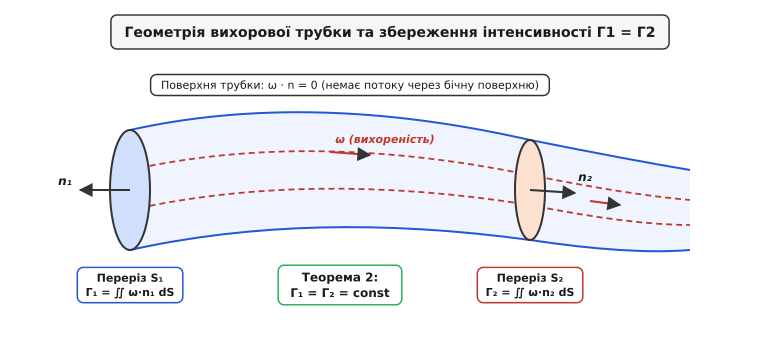
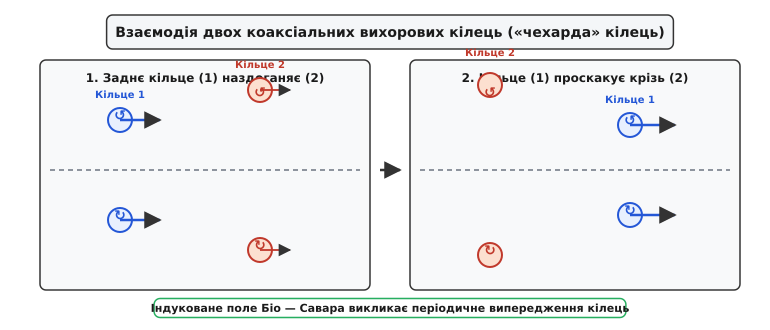
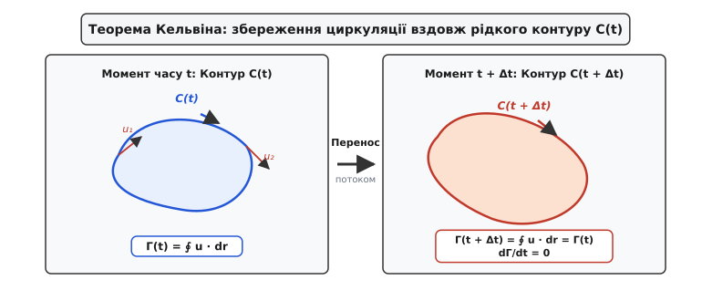
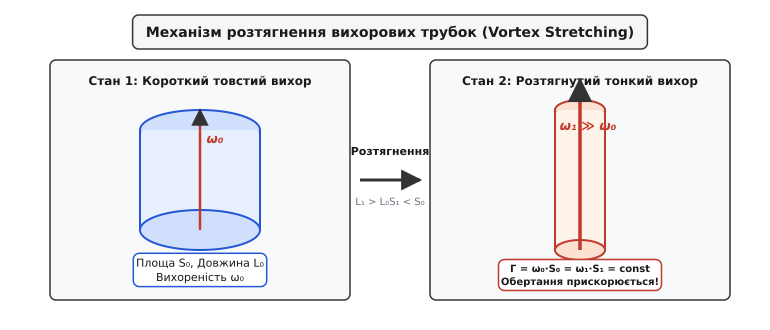

# Теореми Гельмгольца про вихори

<preknowlist>
- [Рівняння Ейлера та Нав'є — Стокса](topic:physics/euler-navier-stokes) — закон збереження імпульсу в суцільному середовищі.
- [Ротор і циркуляція](topic:math/curl-circulation) — математичне визначення вихореності `ω = ∇ × u` та теорема Стокса.
- [Потенціальна течія](topic:ph-mechanics/potential-flow) — безвихоровий потік ідеальної рідини з потенціалом швидкості.
- [Примежовий шар](topic:ph-mechanics/boundary-layer) — тонка пристінна область, де в'язкість ґенерує вихореність.
- [Число Рейнольдса](topic:ph-mechanics/reynolds-number) — безрозмірний критерій співвідношення сил інерції та в'язкості.
- [Турбулентність](topic:ph-mechanics/turbulence) — хаотичний вихоровий режим течії з енергетичним каскадом.
- [Відрив потоку](topic:ph-mechanics/flow-separation) — оторвання примежового шару від поверхні з утворенням вихорів.
</preknowlist>

Коли великий пасажирський авіалайнер масою понад двісті тонн відривається від злітно-посадкової смуги і піднімається у повітря, його крила залишають у небі невидимий, але колосальний за кінетичною енергією слід — два потужні вихорові шнури, які закручуються з кінців крил і простягаються на кілька кілометрів позаду літака. Якщо наступний літак потрапить у цей вихоровий слід протягом двох хвилин після зльоту, індуковане обертання повітря здатне миттєво перевернути повітряне судно, спричинивши важку авіаційну катастрофу. Усі спроби пояснити це явище класичною теорією потенціальних течій XVIII століття зазнавали цілковитого краху: за математичними формулами Лагранжа нев'язкий потік без вихорів взагалі не повинен створювати ані підйомної сили, ані закручених вихорових шнурів.

Фізичну загадку обертального руху рідини розв'язав у 1858 році німецький учений Герман фон Гельмгольц, сформулювавши фундаментальні теореми вихорової динаміки. Гельмгольц довів, що вихори у рідкому середовищі є не випадковим турбулентним шумом, а суворо збережуваними матеріальними структурами, які рухаються разом із потоком, несуть у собі кінетичну енергію та підкоряються глибоким топологічним законам.

## 1. Фізична природа вихореності та локального обертання рідини

Для глибокого та послідовного розуміння руху рідкого середовища необхідно чітко розділяти глобальний поступальний перенос маси та локальну деформацію окремого елемента рідини. Розглянемо малу рідку частинку у формі куба з ребром `dx`, яка рухається у просторі зі швидкістю `u(x, y, z, t)`. Зміна вектора швидкості при переході від однієї точки частинки до сусідньої описується тензором градієнта швидкості `∇u` з компонентами `L_ij = ∂u_i / ∂x_j`.

Згідно з алгебраїчною теоремою Гельмгольца про розкладання векторного поля, будь-який тензор другого порядку можна однозначно подати як суму симетричної та антисиметричної частин:

```
L_ij = E_ij + Ω_ij                    [РОЗКЛАДЕННЯ ГЕЛЬМГОЛЬЦА]
```

Симетричний **тензор швидкостей деформації** `E_ij = (1/2)·( ∂u_i/∂x_j + ∂u_j/∂x_i )` описує чисте розтягнення, стиснення та зсув рідкого елемента вздовж головних осей деформації без його обертання як цілого. Елементи діагоналі цього тензора описують об'ємне розширення чи стиснення частинки, а позадіагональні елементи описують зміну кутів між ребрами куба (кутову деформацію зсуву). Внаслідок деформації кубічна частинка рідини перетворюється на похилий паралелепіпед із тими самими або зміненими ребрами.

Антисиметричний тензор `Ω_ij = (1/2)·( ∂u_i/∂x_j - ∂u_j/∂x_i )` описує **чисте жорстке обертання** елемента рідини навколо власного центру мас. У тривимірному евклідовому просторі будь-якому антисиметричному тензору другого порядку відповідає єдиний дуальний аксіальний вектор кутової швидкості локального обертання `Ω`.

Вектор **вихореності** (vorticity), позначуваний грецькою літерою `ω`, визначається як ротор векторного поля швидкостей суцільного середовища:

```
ω = ∇ × u                            [ВИЗНАЧЕННЯ ВЕКТОРА ВИХОРЕНОСТІ]
```

Зіставляючи компоненти ротора з компонентами антисиметричного тензора обертання `Ω_ij`, отримуємо фундаментальний зв'язок між вихореністю та кутовою швидкістю обертання елемента рідини:

```
ω = 2 · Ω                            [ЗВ'ЯЗОК ВИХОРЕНОСТІ ТА КУТОВОЇ ШВИДКОСТІ]
```

Фізичний зміст цього співвідношення полягає в тому, що вектор вихореності у кожній точці потоку за напрямком збігається з миттєвою віссю обертання частинки рідини, а за модулем дорівнює подвоєній кутовій швидкості її обертання навколо власної осі.

Для наочної фізичної інтерпретації вихореності можна уявити уявну мікроскопічну лопатеву вертушку з невагомими крильцями, поміщену у дану точку течії. Якщо центр вертушки рухається разом із потоком, то кутова швидкість обертання її крильлець буде строго дорівнювати `Ω = ω / 2`. У безвихоровому потіку вертушка переміщатиметься поступально без жодного обертання крильлець.

Математичний зв'язок між полем вихореності `ω` та полем швидкостей `u` у нестисливій рідині має пряму аналогію з електродинамікою Максвелла. Якщо уявити вектор вихореності як «густину електричного струму» `j`, то поле швидкості `u` відіграє роль «магнітного поля» `B`. Швидкість відновлюється через вектор вихореності за допомогою тривимірного інтеграла Біо — Савара — Лапласа: `u(r) = (1 / 4π) ∭ (ω(r') × (r - r')) / |r - r'|³ dV'`. Це означає, що кожен локалізований вихор створює поле індукованих швидкостей у всьому навколишньому об'ємі рідини.

Важливо чітко розрізняти рух частинки по криволінійній траєкторії від наявності локальної вихореності. Розглянемо два класичні приклади течій, які наочно демонструють фундаментальну відмінність між траєкторією потоку та вихореністю:

1. **Твердотільне обертання (потенціальна вихоровість):** Потік обертається як єдине ціле з постійною кутовою швидкістю `u_θ = Ω₀ · r`. Обчислюючи ротор швидкості у циліндричних координатах, отримуємо `ω = ∇ × u = 2 · Ω₀ ≠ 0`. У цьому випадку частинки рідини не лише рухаються по колу, а й обертаються навколо власних осей із кутовою швидкістю `Ω₀`. Якщо кинути у такий потік плаваючу стрілку, вона обертатиметься разом із потоком, роблячи один повний оберт за період.
2. **Потенціальний вихор (потенціальний потік):** Швидкість колового руху зменшується з відстанню від центру за законом `u_θ = C / r`. Обчислення ротора дає `ω = ∇ × u = 0` у всіх точках, крім самого центру `r = 0`. У такій течії частинки рідини рухаються по колових траєкторіях, але орієнтація їхніх власних осей у просторі залишається паралельною сама собі (відсутнє локальне обертання частинок). Якщо кинути плаваючу стрілку у потенціальний вихор, вона переміщатиметься по колу, але її вісь завжди буде вказувати у той самий бік (наприклад, на північ).

Більшість реальних потоків у природознавстві та інженерії є вихоровими (`ω ≠ 0`). Вихореність первинно генерується у вузьких пристінкових межевих шарах через дію в'язкого тертя та умову прилипання рідини до твердої поверхні, після чого зноситься потоком у вільний об'єм. Без урахування вихореності неможливо розрахувати ані підйомну силу авіаційного крила, ані роботу парових та газових турбін, ані атмосферну циркуляцію.

Детальний аналіз історії створення теорії вихорового руху та атомарної концепції вихорів Лорда Кельвіна описано в [історичному екскурсі про відкриття вихорових теорем](topic:ph-mechanics/helmholtz-vortex-theorems/hist-helmholtz-vortex.md).

## 2. Динамічне рівняння переносу вихореності (Vorticity Transport Equation)

Для того щоб зрозуміти, як вектор вихореності `ω` змінюється у просторі та часі під час руху рідини, виведемо рівняння еволюції вихореності з перших принципів ньютонівської механіки.

Закон збереження імпульсу для нев'язкої нестисливої рідини постійної густини `ρ = const` описується рівнянням руху Ейлера під дією консервативних масових сил із потенціалом `V` (`f = -∇V`):

```
∂u/∂t + (u · ∇)u = -(1/ρ)·∇p - ∇V   [РІВНЯННЯ ЕЙЛЕРА]
```

Скористаємося векторною тотожністю для конвективного прискорення `(u · ∇)u = ∇(u²/2) - u × (∇ × u)` і перепишемо рівняння Ейлера у формі Громеки — Лемба:

```
∂u/∂t - u × ω = -∇( p/ρ + V + u²/2 )   [ФОРМА ГРОМЕКИ — ЛЕМБА]
```

Застосуємо оператор ротора (`∇ ×`) до обох частин цього рівняння. Оскільки ротор градієнта будь-якої скалярної функції тотожно дорівнює нулю (`∇ × ∇Φ = 0`), уся права частина зі скалярним тиском, гравітаційним потенціалом та кінетичною енергією повністю зникає:

```
∇ × ( ∂u/∂t ) - ∇ × ( u × ω ) = 0
∂ω/∂t - ∇ × ( u × ω ) = 0            [РІВНЯННЯ ЕВОЛЮЦІЇ РОТОРА]
```

Розкриємо ротор векторного добутку `∇ × (u × ω)` за допомогою стандартної тотожності векторного аналізу:

```
∇ × (u × ω) = u·(∇ · ω) - ω·(∇ · u) + (ω · ∇)u - (u · ∇)ω
```

Проаналізуємо кожен із чотирьох доданків правій частині:
- `∇ · ω = ∇ · (∇ × u) = 0` — дивергенція ротора тотожно дорівнює нулю за фундаментальною геометричною тотожністю.
- `∇ · u = 0` — дивергенція поля швидкостей дорівнює нулю внаслідок умови нестисливості рідини.

Після спрощення отримуємо фундаментальне **диференціальне рівняння переносу вихореності**:

```
∂ω/∂t + (u · ∇)ω = (ω · ∇)u          [РІВНЯННЯ ПЕРЕНОСУ ВИХОРЕНОСТІ]
```

Використовуючи оператор повної (матеріальної) похідної `D/Dt = ∂/∂t + (u · ∇)`, що описує зміну величини під час руху разом із конкретною частинкою рідини, запишемо рівняння переносу у компактній матеріальній формі:

```
Dω/Dt = (ω · ∇)u                     [МАТЕРІАЛЬНЕ РІВНЯННЯ ВИХОРЕНОСТІ]
```

Фізичний зміст цього рівняння є глибинним і розкриває принципову відмінність між тривимірними та двовимірними потоками:

1. Ліва частина `Dω/Dt` описує швидкість зміни вектора вихореності рідкої частинки під час її переміщення потоком зі швидкістю `u` (адвекція вихореності).
2. Права частина `(ω · ∇)u` описує **механізм розтягнення та повертання вихорових трубок (Vortex Stretching and Tilting)**. Градієнт швидкості вздовж напрямку вектора вихореності здатний розтягувати вихоровий елемент, збільшуючи модуль `|ω|`, або повертати вісь обертання у просторі.

Якщо потік рідини розтягується вздовж вихорової лінії (тобто складова градієнта швидкості вздовж `ω` є додатною), вектор вихореності подовжується, а модуль вихореності `|ω|` зростає. Якщо потік стискається вздовж вихорової лінії, модуль вихореності зменшується. Якщо у потоці присутній зсув швидкостей, перпендикулярний до вектора вихореності, напрямок осі обертання повертається у просторі.

У двовимірному потоці (`u = (u_x(x,y), u_y(x,y), 0)`) вектор вихореності має лише однакову напрямлену компоненту `ω = (0, 0, ω_z)`. Оскільки швидкість не змінюється вздовж осі `z` (`∂u/∂z = 0`), оператор `(ω · ∇) = ω_z · (∂/∂z)` при дії на `u` дає тотожний нуль.

Отже, у 2D гідродинаміці член розтягнення зникає, і рівняння переносу набуває вигляду:

```
Dω_z/Dt = 0                          [ЗБЕРЕЖЕННЯ ВИХОРЕНОСТІ У 2D]
```

Це означає, що у плоском потоці ідеальної рідини вихореність кожної рідкої частинки є строго постійною величиною під час всього її руху. У двовимірних течіях вихорі не можуть розтягуватися чи посилюватися за рахунок деформації потоку, що створює принципово іншу динаміку турбулентності.

Математичні доведення та розширені виведення тотожностей наведено у [детальному математичному довіднику із доведеннями теорем](topic:ph-mechanics/helmholtz-vortex-theorems/math-helmholtz-proofs.md).

## 3. Перша теорема Гельмгольца: Вмороженість вихорових ліній

Перш ніж сформулювати першу теорему Гельмгольца, уведемо основні геометричні поняття вихорового поля.

**Вихорова лінія (vortex line)** — це крива у просторі заповненому рідиною, дотична до якої у кожній точці збігається за напрямком із вектором вихореності `ω(x, y, z, t)`. Математично вихорова лінія описується системою звичайних диференціальних рівнянь:

```
dx / ω_x = dy / ω_y = dz / ω_z       [РІВНЯННЯ ВИХОРОВОЇ ЛІНІЇ]
```

**Вихорова трубка (vortex tube)** — це трубоподібна поверхня, утворена сукупністю всіх вихорових ліній, що проходять через довільний замкнений контур `C`, який не лежить уздовж вихорової лінії.

> **Перша теорема Гельмгольца (про вмороженість вихорів):**
> Елементи рідини, які у певний початковий момент часу утворюють вихорову лінію (або вихорову трубку), залишаються на цій самій вихоровій лінії (трубці) під час усього подальшого руху нев'язкої баротропної рідини під дією консервативних масових сил.

Смисл першої теореми полягає у тому, що вихорові лінії є **«вмороженими» (frozen-in)** у речовину рідини. Потік переносить вихорові лінії так само, як він переносить самі рідкі частинки. Вихорова лінія не може «ковзати» відносно рідини або відриватися від частинок, з яких вона сформована. Якщо у початковий момент часу потік маркувати кольоровими фарбованими частинками вздовж вихорової лінії, то при будь-яких найскладніших тривимірних деформаціях потоку ця лінії фарби завжди залишатиметься вихоровою лінією.

Математично вмороженість доводиться через формулу Коші (1815), яка пов'язує вектор вихореності `ω(t)` у поточний момент часу з початковою вихореністю `ω₀` та тензором деформації лагранжевого переміщення частинок `∂x / ∂x₀`:

```
ω_i(x, t) = (ω₀_j(x₀) · ∂x_i / ∂x₀_j) [ФОРМУЛА КОШІ ДЛЯ ВИХОРЕНОСТІ]
```

Оскільки вектор матеріального зміщення між двома нескінченно близькими частинками `dx` трансформується за цим самим законом `dx_i = dx₀_j · (∂x_i / ∂x₀_j)`, вектор вихореності `ω` та рідкий вектор `dx` деформуються абсолютно однаково. Це гарантує, що паралельність векторів `dx` та `ω` зберігається у часі.

Принципово важливим наслідком вмороженості є те, що у нев'язкій рідині вихорові лінії деформуються разом із середовищем: вони можуть вигинатися, розтягуватися, закручуватися у вузли, але ніколи не можуть розриватися або перетинати одна одну.

У геофізичній гідродинаміці та физиці плазми прямим аналогом першої теореми Гельмгольца є **теорема Альвена про вмороженість магнітного поля**: у середовищі з нескінченною провідністю магнітні силові лінії вморожені у плазму і рухаються разом із нею, що пояснює динаміку сонячних спалахів та корональних петель.

> 🔧 **Навіщо це.**
> Завдяки першій теоремі Гельмгольца інженери розраховують динаміку зносних вихорових джгутів авіалайнерів та вертолітних гвинтів, трасуючи траєкторії вихорових ліній як матеріальних струменів, що суттєво спрощує математичне моделювання.

## 4. Друга теорема Гельмгольца: Збереження інтенсивності вихорової трубки

Для опису кількісної сили вихорового утворення використовується поняття інтенсивності вихорової трубки.

**Інтенсивність (сила) вихорової трубки `Г`** визначається як потік вектора вихореності через довільний поперечний переріз `S` цієї трубки:

```
Г = ∬_S (ω · n) dS                   [ІНТЕНСИВНІСТЬ ВИХОРОВОЇ ТРУБКИ]
```

За теоремою Стокса, потік ротора через поверхню `S` дорівнює циркуляції швидкості `u` вздовж замкненого контуру `C`, що обмежує цей переріз:

```
Г = ∬_S (∇ × u) · n dS = ∮_C (u · dr) [СВ'ЯЗОК З ЦИРКУЛЯЦІЄЮ ШВИДКОСТІ]
```

> **Друга теорема Гельмгольца (про збереження інтенсивності):**
> Інтенсивність вихорової трубки `Г` є однаковою вздовж усіх її поперечних перерізів у даний момент часу і не змінюється з часом під час руху трубки разом із нев'язкою баротропною рідиною.


*Геометрія вихорової трубки у тривимірному потоці: інтенсивність Г однакова у кожному перерізі S1 та S2 і зберігається у часі.*

Доведення рівності інтенсивностей у різних перерізах спирається на тотожність `∇ · ω = ∇ · (∇ × u) = 0`. Застосувавши теорему Остроградського — Гаусса до об'єму вихорової трубки між перерізами `S₁` та `S₂`, отримуємо, що потік через бічну поверхню дорівнює нулю (бо вектор `ω` дотичний до бічної поверхні), звідки випливає строго `Г₁ = Г₂`.

Константність інтенсивності у часі (`dГ/dt = 0`) означає, що якщо вихорова трубка під дією течії звужується (площа перерізу `S` зменшується), то середня вихореність `ω` у цьому перерізі повинна пропорційно зростати, щоб добуток `Г ≈ ω · S` залишався незмінним. Це явище дає фізичне пояснення стрімкому посиленню обертання повітря в центрі смерчу або атмосферного торнадо при звуженні вихорового стовпа.

Збереження інтенсивності вихорових трубок також описує утворення колосальних шорстких вихорів при зливі води через вузький отвір раковини чи ванни: розтягнення вихорової нитки при наближенні до отвору прискорює обертання до колосальних колових швидкостей, утворюючи повітряну лійку в центрі.

Для замкненого вихорового кільця або тонкої вихорової нитки друга теорема гарантує, що циркуляція не залежить від вибору контуру обходу `C`, що дозволяє замінити тривимірну структуру вихору однією математичною кривою із заданою інтенсивністю `Г`.

## 5. Третя теорема Гельмгольца: Топологічна нерозривність та закритість вихорів

Оскільки векторне поле вихореності є соленоїдальним (`∇ · ω = 0`), воно не має ні джерел, ні стоків усередині середовища. З цього математичного факту безпосередньо випливає третя теорема Гельмгольца.

> **Третя теорема Гельмгольца (про нерозривність вихорів):**
> Вихорова трубка не може починатися або закінчуватися усередині суцільного об'єму рідини. Вона мусить або утворювати замкнене кільце (вихорове кільце), або виходити своїми кінцями на зовнішні межі середовища (тверді стінки або вільну поверхню), або простягатися до нескінченності.

З цієї теореми випливають три можливі топологічні конфігурації вихорових утворень у природі:

1. **Замкнені вихорові кільця (Vortex Rings):** Вихорова трубка замикається сама на себе, утворюючи тороїдальне кільце. Яскравими прикладами є кільця з тютюнового диму, кільця бульбашок, що випускають дельфіни під водою, та вихорові кільця, утворені при підводному вибуху чи імпульсному випорскуванні пального з форсунки.
2. **Виходи на тверді стінки або вільну поверхню:** Смерчі та торнадо в атмосфері простягаються від поверхні землі до хмарного шару. Водоверть у раковині або вихор біля водоскиду греблі починається на вільній поверхні води і закінчується на дні або зливному отворі.
3. **Нескінченні вихорові нитки:** У теоретичних моделях безмежного середовища вихорові лінії можуть прямувати до нескінченності.

Надзвичайно цікавим наслідком теорем Гельмгольца є взаємодія двох коаксіальних вихорових кілець одинакової орієнтації, відома як **«чехарда» вихорових кілець (leapfrogging vortex rings)**.


*Ефект «чехарди» вихорових кілець: індуковане поле швидкостей Біо — Савара змушує заднє кільце стискатися та проходить крізь переднє.*

Механізм «чехарди» пояснюється так:
- Заднє кільце (1) потрапляє в індуковане поле швидкостей переднього кільця (2). Це індуковане поле змушує заднє кільце зменшувати свій радіус (стискатися).
- Згідно з другою теоремою Гельмгольца та законом збереження енергії, стиснуте вихорове кільце починає рухатися поступально швидше.
- Заднє кільце прискорюється, проскакує крізь центр розширеного переднього кільця і стає переднім. Після цього процес повторюється циклічно.

## 6. Теорема Кельвіна про циркуляцію та її зв'язок із теоремами Гельмгольца

У 1869 році шотландський фізик Вільям Томсон (лорд Кельвін) сформулював інтегральний закон, який об'єднав та узагальнив три теореми Гельмгольца.

> **Теорема Кельвіна про циркуляцію:**
> У нев'язкій баротропній рідині під дією консервативних масових сил циркуляція швидкості `Г` вздовж будь-якого замкненого матеріального рідкого контуру `C(t)` залишається строго постійною в часі:
> `dГ / dt = (d/dt) ∮_C(t) (u · dr) = 0`


*Деформація рідкого контуру C(t) у потоці зі збереженням циркуляції швидкості dГ/dt = 0.*

Теорема Кельвіна виконується при дотриманні трьох суворих умов:
1. **Нев'язкість рідини (`ν = 0`):** Відсутність внутрішнього тертя та в'язкої дифузії вихореності.
2. **Баротропність середовища (`ρ = ρ(p)`):** Густина рідини залежить виключно від тиску. Для нестисливої рідини (`ρ = const`) ця умова виконується автоматично.
3. **Консервативність масових сил (`f = -∇V`):** Зовнішні сили (наприклад, сила тяжіння) мають скалярний потенціал.

Якщо хоча б одна з цих умов порушується, циркуляція перестає зберігатися, і у потоці відбувається **зародження або дифузія вихореності**.

Завдяки теоремі Кельвіна пояснюється теорема Жуковського про підйомну силу крила: при старті літака із гострої задньої кромки крила зривається початковий вихор (starting vortex) із циркуляцією `-Г`. Оскільки сумарна циркуляція навколо великого рідкого контуру повинна зберігатися тотожно нулем (`Г_total = 0`), навколо самого крила виникає зв'язаний вихор (bound vortex) з протилежною циркуляцією `+Г`, який і створює підйомну силу.

## 7. Механізм розтягнення вихорів (Vortex Stretching) та тривимірна турбулентність

Одним із найважливіших фізичних явищ у тривимірній гідродинаміці є **розтягнення вихорових трубок (vortex stretching)**. Це явище описується членом `(ω · ∇)u` у диференціальному рівнянні переносу вихореності.

Розглянемо вихоровий елемент нестисливої рідини довжиною `L₀` та площею поперечного перерізу `S₀` з початковою вихореністю `ω₀`.


*Розтягнення вихорової трубки вздовж осі обертання призводить до зменшення площі перерізу та драматичного прискорення кутового обертання.*

З закону збереження маси нестисливої рідини випливає, що об'єм елемента є постійним: `V = S · L = const`.
З другої теореми Гельмгольца випливає, що інтенсивність вихорової трубки є постійною: `Г = ω · S = const`.

Якщо градієнт зовнішньої швидкості розтягує елемент вздовж його осі, збільшуючи довжину від `L₀` до `L₁ > L₀`:
1. Площа перерізу повинна зменшитися: `S₁ = S₀ · (L₀ / L₁)`.
2. Щоб циркуляція `Г = ω · S` залишилася постійною, вихореність повинна зрости у стільки ж разів:

```
ω₁ = ω₀ · (L₁ / L₀)                  [ПРИСКОРЕННЯ ОБЕРТАННЯ ПРИ РОЗТЯГНЕННІ]
```

Це явище є прямо аналогічним закону збереження моменту імпульсу в класичній механіці твердого тіла: коли фігурист під час обертання притискає руки до тулуба (зменшує момент інерції `I`), кутова швидкість його обертання `Ω` стрімко зростає.

### Роль розтягнення вихорів у каскаді турбулентності Колмогорова
Розтягнення вихорів є головним «двигуном» тривимірної турбулентності:
- Великі турбулентні вихори розтягуються градієнтами швидкостей сусідніх течій.
- Їхній діаметр зменшується, а кутова швидкість та вихореність зростають.
- Великі вихорові структури розпадаються на все дрібніші й дрібніші вихорові нитки, передаючи кінетичну енергію від макромасштабів до дрібних масштабів без дисипації (енергетичний каскад Колмогорова). У спектральному просторі цей каскад описується знаменитим закону Колмогорова — Обухова «мінус п'ять третіх»: `E(k) = C_K · ε^(2/3) · k^(-5/3)`.
- Процес подрібнення триває доти, доки розмір вихорів не досягне **колективного масштабу Колмогорова** `η = (ν³ / ε)^1/4`, де в'язке тертя остаточно перетворює кінетичну енергію вихорів на теплоту.

У двовимірній турбулентності (через відсутність члена розтягнення `(ω · ∇)u = 0`) відбувається протилежний процес — **зворотний каскад енергії (inverse energy cascade)**, коли дрібні вихори зливаються у великі довговічні структури (наприклад, Велика Червона Пляма на Юпітері або циклони в атмосфері Землі).

## 8. Межі застосовності та руйнування теорем у реальних середовищах

У реальних фізичних середовищах теореми Гельмгольца та Кельвіна є наближеними і виконуються лише за високих чисел Рейнольдса `Re = U·L / ν ≫ 1` поза межевими шарами. Розглянемо три головні фізичні ефекти, що викликають порушення теорем та зародження нових вихорів:

### 1. В'язка дифузія вихореності (В'язкість)
Для реальної рідини з кінематичною в'язкістю `ν ≠ 0` рівняння переносу вихореності Нав'є — Стокса містить дифузійний доданок:

```
Dω/Dt = (ω · ∇)u + ν · ∇²ω           [РІВНЯННЯ ВИХОРЕНОСТІ НАВ'Є — СТОКСА]
```

Член `ν · ∇²ω` описує молекулярну дифузію вихореності крізь стінки вихорових трубок. Швидкість дисипації турбулентної кінетичної енергії за рахунок в'язкого тертя визначається виразом `ε_visc = 2 ν ∬ S_ij S_ij dV`. В'язкість приводить до розмивання гострих вихорових ниток, зменшення інтенсивності `Г(t)` з часом та стирання вихорів.

### 2. Генерація вихореності на твердих стінках
На твердій стінці виконується умова прилипання рідини (`u = 0`). Через наявність високого градієнта швидкості `∂u_x / ∂y` у настінному пограничному шарі тверда стінка працює як постійний **генератор вихореності**. При відриві пограничного шару ця вихореність зноситься у потік, утворюючи відривні вихорові шнури та доріжки Кармана. Людвиг Прандтль у 1904 році увів поняття пограничного шару саме для того, щоб відокремити тонку в'язку область біля стінки, де генерується вихореність, від зовнішнього потенціального потоку, де діють теореми Гельмгольца.

### 3. Бароклінний ефект (Baroclinic Vorticity Generation)
Якщо рідина є небаротропною (бароклінною), тобто густина залежить не лише від тиску, а й від температури або солоності `ρ = ρ(p, T)`, у рівнянні Кельвіна виникає **бароклінний джерельний член**:

```
Dω/Dt = (ω · ∇)u + (1/ρ²) · (∇ρ × ∇p) [БАРОКЛІННЕ РІВНЯННЯ ВИХОРЕНОСТІ]
```

Векторний добуток `(∇ρ × ∇p)` відмінний від нуля, якщо ізобари (лінії постійного тиску) та ізопікни (лінії постійної густини) перетинаються під кутом.
Саме бароклінний ефект відповідає за зародження морських бризів, атмосферних фронтів, ураганів та термічних вихорів при пожежах.

У метеорології та океанографії розширенням теорем Гельмгольца є **теорема Ертеля про потенціальну вихореність**: у стратифікованій обертальній атмосфері інваріантом руху кожної повітряної маси є величина `q = (ω + 2Ω) · ∇θ / ρ`, де `θ` — потенціальна температура. Збереження `q` описує утворення планетарних хвиль Россбі та атмосферних циклонів. Великі океанічні вихори Гольфстріму та Кросіо зберігають свою потенціальну вихореність місяцями, переносячи тепло та солі на тисячі кілометрів.

У фізиці плазми аналогом теореми Гельмгольца про вмороженість вихорових ліній є **теорема Альвена про вмороженість магнітних силових ліній** у високопровідне плазмове середовище.

## 9. Практичне застосування та обчислювальні методи

Теореми Гельмгольца створили основу для сучасних безсіткових лагранжевих методів обчислювальної гідродинаміки:

1. **Метод точкових вихорів (Discrete Vortex Method, DVM):** Потік моделюється як дискретна сукупність вихорових точок чи блібів, що рухаються зі швидкістю, обчисленою за законом Біо — Савара.
2. **Метод вихорових ниток (Vortex Filament Method, VFM):** Використовується для розрахунку аеродинаміки вертолітних гвинтів, вітрогенераторів та зносних вихорів за крилами літаків.

Зрив вихорів з обтіканих інженерних споруд (мостів, димових труб, морських нафтових платформ) викликає небезпечні вихорово-індуковані коливання (Vortex-Induced Vibrations, VIV). Для їх пригнічення на труби встановлюють спіральні накладки (strakes), які руйнують двовимірне когерентне розтягнення вихорів.

У цивільному будівництві знання законів вихорової нерозривності дозволяє запобігати руйнуванню висотних веж та мостових прольотів від аеродинамічного автоколивального резонансу Такома-Нароуз.

Сучасні CFD-пакети (OpenFOAM, ANSYS Fluent, STAR-CCM+) реалізують спеціальні класичні критерії ідентифікації вихорів (`Q`-критерій Гарднера, `λ₂`-критерій Чонга — Перрі), які спираються безпосередньо на алгебраїчне розкладання Гельмгольца для надійного виділення когерентних вихорових ядер із тривимірного локального поля швидкостей течії.

Використання C/C++ алгоритмів для чисельного розрахунку траєкторій точкових вихорів подано у [проектному коді розрахунку динаміки вихорових ниток та точкових вихорів](topic:ph-mechanics/helmholtz-vortex-theorems/proj-vortex-simulation.md).

Специфікацію виробничої C/C++ бібліотеки для інтеграції вихорових розв'язувачів у CFD-пакети наведено у [специфікації C/C++ бібліотеки розв'язувача вихорових систем](topic:ph-mechanics/helmholtz-vortex-theorems/api-vortex-solver.md).
