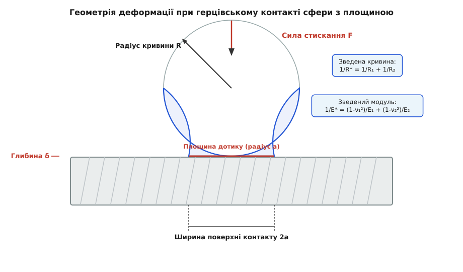
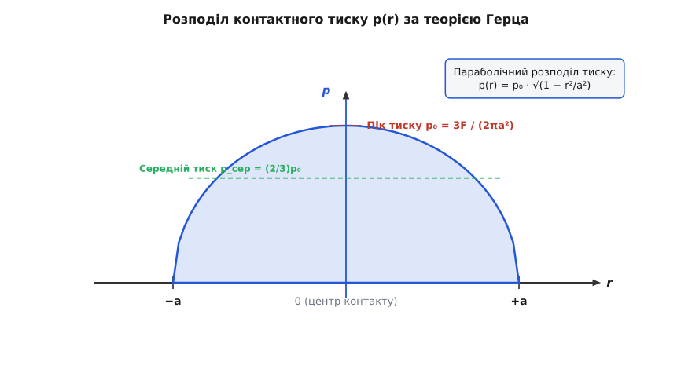
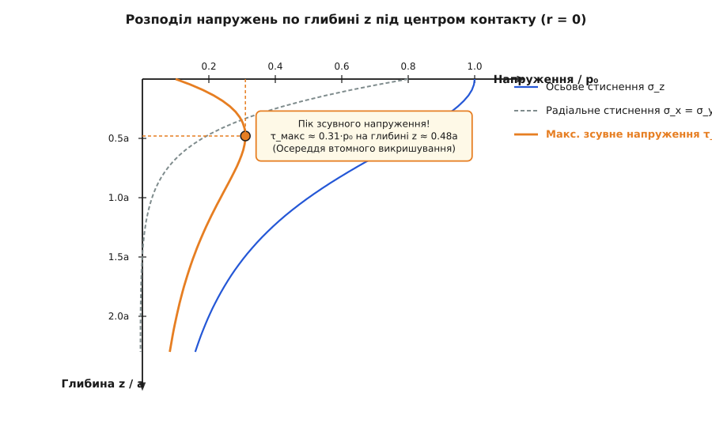
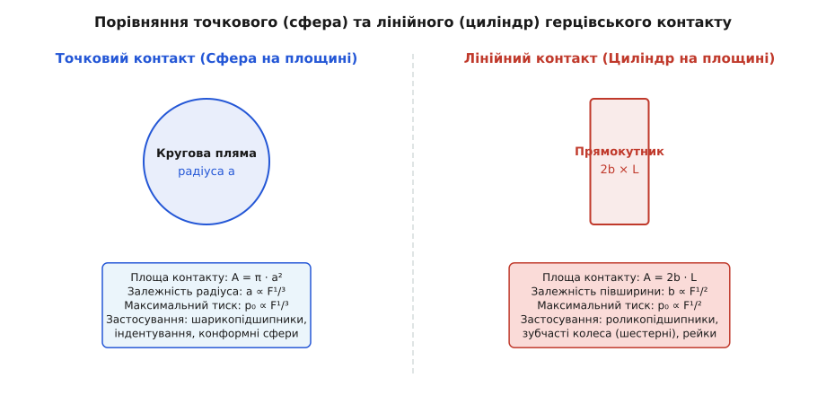

# Контакт Герца: деформація та тиск під час притискання пружних тіл

<preknowlist>
- [Закон Гука](root:ph-mechanics/hookes-law) — пропорційність деформації та напруження в пружному середовищі.
- [Сила](root:ph-mechanics/force) — векторна дія, що спричиняє деформацію або зміну руху.
- [Тиск](root:ph-mechanics/pressure) — сила, розподілена по площі поверхні.
- [Третій закон Ньютона](root:ph-mechanics/newtons-third-law) — рівність сил протидії під час контакту тіл.
- [Втомне руйнування матеріалів](root:ph-mechanics/material-fatigue) — накопичення мікропошкоджень від циклічних напружень.
</preknowlist>

Залізничне колесо масою в десятки тонн котиться по сталевій рейці. Ідеальна математична модель класичної статичної механіки стверджує, що циліндричне колесо торкається площини рейки по одній нескінченно вузькій лінії, площа якої строго дорівнює нулю. Якби сила тяжіння важкого потяга тиснула на нульову площу, контактний тиск `p = F / A` став би нескінченно великим. За нескінченного тиску будь-яка сталева рейка під колесом мала б миттєво сплющитися або розпатися на порох. Проте важкі вантажні потяги щодня долають тисячі кілометрів, а сталеві рейки та колісні пари служать роками без катастрофічних деформацій.

Аналогічна картина спостерігається усередині кулькового підшипника качення: загартована сталева кулька притискається до доріжки кочення з силою у кілька кілоньютонів. Геометрично точка дотирання сфери до кільця має нульову площу, проте підшипник витримує мільйони обертів під колосальним навантаженням.

Розгадка цього фундаментального інженерного парадоксу полягає в тому, що абсолютно твердих непорушних тіл у реальній природі не існує. Будь-який реальний конструкційний матеріал є еластичним (від грец. *elastos* — піддатливий, той що розтягується). Під дією притискальної сили тіла у зоні дотику деформуються (від лат. *deformatio* — зміна форми, спотворення): геометрична точка або лінія дотику сплющується у скінченний майданчик контакту. Тіла зближуються на мікроскопічну глибину, а нескінченність поступається місцем плавному півкульовому розподілу напружень. Класичну теорію цієї взаємодії у 1881 році створив 24-річний німецький фізик Генріх Герц, тому у механіці суцільних середовищ цей режим локального пружного зминання називають **контактом Герца**.

## Звідки береться контактна деформація

Коли дві гладкі непогоджені поверхні (наприклад, дві сфери, сфера з площиною або два циліндри) приводяться у первинний дотик, вони торкаються лише в одній геометричній точці. За відсутності зовнішнього навантаження зазор між поверхнями поблизу цієї точки збільшується за квадратичним законом — як відстань між двома параболічними кривими.

Щойно до тіл прикладається зовнішня нормальна стискальна сила `F`, у зоні дотику виникає локальне стиснення матеріалу. Атоми кристалічної ґратки зближуються на відстані, менші за рівноважні, викликаючи потужні пружні сили відштовхування. Поверхні обох тіл плющаться, перетворюючи початкову геометричну точку дотику на плоский диск (для двох сфер) або прямокутний майданчик (для двох циліндрів).

Розмір та геометрія цього майданчика контакту визначаються трьома основними чинниками:
1. **Величиною стискальної сили `F`**: що більша сила, то глибше поверхні втискаються одна в одну і то більшою стає площа плями дотику.
2. **Кривиною поверхонь `R₁` та `R₂`**: що більший радіус сфери (що менша її кривина), то легше поверхням утворити широку пляму контакту за помірного тиску.
3. **Пружними властивостями матеріалів (`E₁`, `E₂`, `ν₁`, `ν₂`)**: м'які матеріали з низьким модулем Юнга сплющуються дужче, ніж жорстка загартована сталь або кераміка.

Герц 1881 року відкрив цей механізм, досліджуючи оптичну інтерференцію світла між скляними лінзами, — [ця історія про те, як кільця Ньютона дали початок контактній механіці, описана окремо](root:ph-mechanics/hertz-contact/hist-hertz-contact.md).


*Геометрія контакту Герца для сфери на плоскій опорі. Під дією притискальної сили F недеформоване коло сфери сплющується у кругову пляму контакту радіуса a, а центри тіл зближуються на глибину втискання δ.*

## Базові припущення та зведені параметри Герца

Щоб розв'язати фундаментальні диференціальні рівняння теорії пружності для двох контактуючих тіл, Герц сформулював п'ять чітких фізичних припущень:

1. **Малі деформації у межах закону Гука**: деформації в зоні контакту є суворо пружними, а виникаючі напруження не перевищують межу плинності та текучості матеріалу.
2. **Безтертєвий дотик (сухий ковзкий контакт)**: поверхні є ідеально гладкими, тому між ними діють лише нормальні сили тиску, а дотичні сили тертя та зсуву відсутні.
3. **Модель напівпростору**: радіус плями контакту `a` є набагато меншим за загальні фізичні розміри тіл та їхні радіуси кривини (`a << R`). Це дає змогу розцінювати кожне тіло як пружний напівпростір.
4. **Параболічна геометрія**: профілі поверхонь поблизу точки дотику з високою точністю апроксимуються параболоїдами второго порядку.
5. **Відсутність адгезії**: прилипання між поверхнями за рахунок міжмолекулярних чи ван-дер-ваальсових сил відсутнє.

Щоб не розраховувати пружні деформації кожного тіла окремо, Герц увів два зведених параметри, які об'єднують геометрію та матеріали обох тіл в єдину еквівалентну систему.

Перший параметр — **зведений радіус кривини `R*`**:

```
1 / R* = 1 / R₁ + 1 / R₂            [означення зведеного радіуса кривини]
R* = (R₁ · R₂) / (R₁ + R₂)
```

Якщо сфера радіуса `R₁` торкається пласкої плити (`R₂ = ∞`), зведений радіус дорівнює радіусу самої сфери: `R* = R₁`. Якщо ж сфера торкається увігнутої сферичної чашки (як у підшипнику чи суглобі), радіус увігнутої поверхні береться зі знаком мінус (`-R₂`).

Другий параметр — **зведений модуль пружності `E*`**:

```
1 / E* = (1 - ν₁²) / E₁ + (1 - ν₂²) / E₂    [означення зведеного модуля пружності]
```

тут `E₁`, `E₂` означають модулі пружності першого роду (модулі Юнга) двох матеріалів, а `ν₁`, `ν₂` — їхні коефіцієнти Пуассона (відношення поперечного розширення до поздовжнього стиснення). Якщо обидва тіла виготовлені з одинакової сталі (`E₁ = E₂ = E`, `ν₁ = ν₂ = ν`), вираз спрощується до `E* = E / (2 · (1 - ν²))`.

## Сферичний контакт: радіус плями, глибина та тиск

Розглянемо випадок точкового контакту двох сфер або сфери з площиною. Під дією стискальної сили `F` утворюється круговий майданчик контакту радіуса `a`.

Герц розв'язав інтегральне рівняння Буссінеска для пружного напівпростору і довів, що радіус плями контакту `a` росте пропорційно кубічному кореню з сили:

```
a = [ (3 · F · R*) / (4 · E*) ]^(1/3)        [радіус кругової плями контакту Герца]
```

Геометричне зближення центрів двох тіл (глибина втискання або депресія контакту) `δ` пов'язане з радіусом плями контакту чисто геометричним співвідношенням `δ = a² / R*`:

```
δ = [ (9 · F²) / (16 · R* · (E*)²) ]^(1/3)    [глибина втискання поверхонь]
```

Особливо цікавим є розподіл нормального тиску `p(r)` по поверхні контакту. На відміну від рівномірного тиску під жорстким циліндричним штампом, тиск Герца у зоні `r ≤ a` розподілений за півкульовим (параболічним) законом:

```
p(r) = p₀ · √(1 - (r/a)²)          [півкульовий розподіл тиску Герца]
```

де `p₀` означає **максимальний контактний тиск** у центрі плями (`r = 0`).


*Напівкульовий розподіл тиску Герца. Тиск досягає свого абсолютного максимуму p₀ у центрі контакту (r = 0) і плавно спадає до нуля на краях плями (r = ±a). Середній тиск становить рівно 2/3 від пікового.*

Інтегрування цього тиску по всій площі круга `A = π · a²` дає повну силу стискання `F = (2/3) · π · a² · p₀`. Звідси випливає фундаментальне співвідношення між максимальним тиском `p₀` та середнім тиском `p_сер = F / (π·a²)`:

```
p₀ = 1.5 · p_сер = [ (6 · F · (E*)²) / (π³ · (R*)²) ]^(1/3)   [піковий контактний тиск]
```

[Покрокове математичне виведення потенціалів Буссінеска та розв'язання інтегральних рівнянь наведено у математичній вставці](root:ph-mechanics/hertz-contact/math-hertz-derivation.md).

**Задача 1. Розрахунок сталевого кулькового підшипника.** Сталева кулька підшипника радіусом `R₁ = 5 мм` притискається до плоского сталевого кільця силю `F = 1000 Н`. Модуль Юнга сталі `E = 210 ГПа`, коефіцієнт Пуассона `ν = 0.30`. Знайти радіус плями контакту `a`, глибину втискання `δ` та піковий тиск `p₀`.

```
Зведений радіус для сфери на площині (R₂ = ∞):
R* = R₁ = 0.005 м

Зведений модуль пружності сталі:
E* = E / (2 · (1 - ν²)) = 210e9 / (2 · (1 - 0.09)) = 210e9 / 1.82 ≈ 115.38 ГПа

Радіус плями контакту a:
a = [ (3 · 1000 · 0.005) / (4 · 115.38e9) ]^(1/3)
= [ 15 / 461.52e9 ]^(1/3) = [ 3.25e-11 ]^(1/3) ≈ 0.000319 м = 0.319 мм

Глибина втискання δ:
δ = a² / R* = (0.000319)² / 0.005 ≈ 2.03e-5 м = 20.3 мкм

Площа плями контакту A:
A = π · a² = π · (0.000319)² ≈ 3.20e-7 м² = 0.320 мм²

Піковий тиск p₀:
p₀ = 1.5 · (F / A) = 1.5 · (1000 / 3.20e-7) ≈ 4.69e9 Па = 4.69 ГПа
```

Зверніть увагу на результат: площа контакту становить всього третину квадратного міліметра, а піковий тиск у центрі досягає колосальних 4.69 ГПа (майже 47 000 атмосфер!). Проте сталь не плющиться незворотно, оскільки цей тиск є локальним і тривісним.

> 🔧 **Навіщо це.** Рівняння Герца є головним розрахунковим інструментом інженерів-конструкторів при підборі підшипників качення та оцінці їхнього статичного та динамічного вантажопідйому. Нормативи ISO 76 встановлюють гранично допустимий герцівський тиск для кулькових підшипників на рівні 4.2 ГПа. Перевищення цього порогу викликає пластичні вм'ятини (бринелювання) на бігових доріжках, через що підшипник починає гудіти і швидко виходить з ладу.

## Внутрішній стан напружень: підповерхневий зсувний пік та усталість

Чому кулькові підшипники та зубчасті колеса після тривалої роботи руйнуються не з поверхні, а викришуються зсередини?

Відповідь дає аналіз внутрішнього поля напружень під центром контакту Герца. Контактний тиск `p₀` діє на поверхні, створюючи тривісний стискальний стан напруження в товщі матеріалу. На самій поверхні у центрі плями (`r = 0, z = 0`) вертикальне стискальне напруження `σ_z` дорівнює `-p₀`, а горизонтальні радіальні напруження `σ_x = σ_y` дорівнюють `-p₀ · (1 + 2ν) / 2`. Для сталі (`ν = 0.3`) це дає `σ_x = σ_y = -0.8 · p₀`.

Зі збільшенням глибини `z` вздовж центральної осі вертикальне стиснення `σ_z` спадає повільніше, ніж радіальні напруження `σ_x` та `σ_y`. Через цю різницю швидкостей спадання виникає **максимальне зсувне напруження** (напруження зсуву за критерієм Треска):

```
τ_макс(z) = 0.5 · | σ_z(z) - σ_x(z) |        [максимальне зсувне напруження]
```


*Розподіл напружень у товщі матеріалу по глибині z. Осьове стиснення σ_z та радіальне стиснення σ_x спадають з різною швидкістю, унаслідок чого максимальне зсувне напруження τ_макс досягає свого абсолютного піку 0.31 p₀ під поверхнею на глибині z ≈ 0.48 a.*

Графік показує вражаючий результат:
- На поверхні (`z = 0`): `τ_макс = 0.1 · p₀`.
- Зі заглибленням зсувне напруження зростає, досягаючи абсолютного максимуму на глибині `z_пік ≈ 0.481 · a` (для `ν = 0.3`):

```
z_пік ≈ 0.48 · a                            [глибина піку зсувного напруження]
τ_макс(пік) ≈ 0.31 · p₀                     [значення найбільшого зсувного напруження]
```

Ось де ховається головна небезпека контакту Герца! За циклічного перекочування кульки по біговій доріжці підшипника кожна мікроскопічна ділянка металу на глибині `z ≈ 0.48 a` зазнає мільйонів циклів змінно-значного зсуву.

Фізичний механізм втомного руйнування розгортається у чотири стадії:
1. **Дислокаційна мікропластичність**: під дією циклічного зсуву `τ_макс` у точці `z_пік ≈ 0.48 a` починають ковзати дислокації кристалічної ґратки сталі.
2. **Концентрація навколо включень**: мікродеформації накопичуються навколо неметалевих мікровключень (оксидів алюмінію, сульфідів), які діють як локальні концентратори напружень.
3. **Зародження та зростання підповерхневої тріщини**: виникає мікроскопічна втомна тріщина, яка поширюється паралельно до поверхні під дією ортогональних зсувних напружень `τ_45°`.
4. **Викришування (пітинг)**: досягнувши критичного розміру, тріщина повертає під кутом 45° до поверхні. Виникає скол, і шматок металу викришується, залишаючи каверну (пітинг).

На зовнішній межі плями контакту (`r = a`) на поверхні виникають розтягувальні радіальні напруження `σ_r = (1 - 2ν)/3 · p₀`. Для крихких матеріалів (скло, кераміка) саме ці розтягувальні напруження викликають кільцеві конусні тріщини Герца (англ. *Hertzian cone cracks*).

## Лінійний контакт: циліндр на площині

Коли контактують два паралельні циліндри (або циліндричний ролик на плоскій рейці) довжиною `L`, контакт відбувається не в точці, а по лінії. Під дією сили `F` лінія розплющується у прямокутний майданчик шириною `2b` та довжиною `L`.


*Порівняння сферичного та циліндричного контакту Герца. Точковий контакт сфери утворює кругову пляму радіуса a (кубічна залежність від сили F^(1/3)), тоді як лінійний контакт циліндра утворює прямокутну пляму півшириною b (квадратна залежність F^(1/2)).*

Для циліндричного контакту півширина плями `b` та піковий тиск `p₀` обчислюються за формулами:

```
b = [ (4 · F · R*) / (π · L · E*) ]^(1/2)    [півширина лінійного контакту]
p₀ = [ (F · E*) / (π · L · R*) ]^(1/2)       [піковий тиск лінійного контакту]
```

Зверніть увагу на фундаментальну відмінність: у лінійному контакті піковий тиск `p₀` росте пропорційно квадратному кореню з сили `F^(1/2)`, тоді як у точковому контакту — пропорційно кубічному кореню `F^(1/3)`. Це пояснює, чому роликопідшипники мають значно вищу вантажопідйомність, ніж кулькові підшипники аналогічних габаритів.

**Задача 2. Розрахунок циліндричного роликопідшипника.** Сталевий циліндричний ролик радіусом `R₁ = 6 мм` та довжиною `L = 14 мм` притискається до плоского кільця силю `F = 4000 Н`. Знайти півширину контакту `b` та піковий контактний тиск `p₀`.

```
Зведений радіус: R* = R₁ = 0.006 м
Зведений модуль: E* = 115.38 ГПа

Півширина контакту b:
b = [ (4 · 4000 · 0.006) / (π · 0.014 · 115.38e9) ]^(1/2)
= [ 96 / 5.074e9 ]^(1/2) = [ 1.89e-8 ]^(1/2) ≈ 0.000137 м = 0.137 мм

Ширина контакту 2b = 0.274 мм

Піковий тиск p₀:
p₀ = [ (4000 · 115.38e9) / (π · 0.014 · 0.006) ]^(1/2)
= [ 4.615e14 / 0.00026388 ]^(1/2) ≈ 1.322e9 Па = 1.322 ГПа
```

Порівняно з кулькою, ролик довжиною 14 мм знизив піковий тиск з 4.69 ГПа до 1.32 ГПа за більшого навантаження 4000 Н, що демонструє перевагу лінійного контакту для важких машин.

[Алгоритм чисельного розрахунку сферичних та циліндричних контактів мовами C та C++ подано у практичній вставці](root:ph-mechanics/hertz-contact/proj-hertz-solver.md).

[Повний довідник функцій, параметрів та типів даних описує API вставка](root:ph-mechanics/hertz-contact/api-hertz-solver.md).

## Еліптичний контакт у загальному випадку

Коли торкаються дві поверхні подвійної кривини (наприклад, сфера з циліндром або дві викривлені шестерні, осі яких повернуті під кутом), пляма контакту утворює еліпс із півосями `a` (велика піввісь) та `b` (мала піввісь).

У цьому випадку початковий зазор описується двома зведеними радіусами кривини `R_x*` та `R_y*` у двох головних перетинах:

```
1 / R_x* = 1 / R₁x + 1 / R₂x                [зведений радіус по осі x]
1 / R_y* = 1 / R₁y + 1 / R₂y                [зведений радіус по осі y]
```

Герц довів, що півнеобхідні осі еліпса контакту `a` та `b` обчислюються через коефіцієнти `m_a` та `m_b`, які залежать від співвідношення кривин `R_x* / R_y*` і виражаються через повні еліптичні інтеграли першого та другого роду:

```
a = m_a · [ (3 · F · R_еф*) / (4 · E*) ]^(1/3) [велика піввісь еліпса]
b = m_b · [ (3 · F · R_еф*) / (4 · E*) ]^(1/3) [мала піввісь еліпса]
```

Піковий тиск у центрі еліптичної плями розраховується через її площу `A = π · a · b`:

```
p₀ = 1.5 · (F / (π · a · b))               [піковий тиск еліптичного контакту]
```

Еліптичний контакт є найзагальнішим випадком теорії Герца і застосовується при проектуванні гіпоїдних та спірально-конічних зубчастих передач у трансмісіях автомобілів.

## Порівняння матеріальних пар у герцівському контакті

Поведінка контакту Герца істотно залежить від поєднання фізичних властивостей обох матеріалів. Розглянемо три ключові інженерні пари:

1. **Сталь по сталі (класичний інженерний варіант)**:
   - Модуль Юнга `E = 210 ГПа`, коефіцієнт Пуассона `ν = 0.30`.
   - Зведений модуль `E* = 115.4 ГПа`.
   - Характеризується високим тиском `p₀` (до 4.5 ГПа) та малим радіусом плями `a`. Забезпечує високу жорсткість вузла, але вимагає термообробки (загартування та цементації) для запобігання підповерхневому викришуванню.
2. **Кераміка (нітрид кремнію Si₃N₄) по сталі (гібридні підшипники)**:
   - Кераміка має модуль Юнга `E = 320 ГПа`, `ν = 0.26`.
   - Зведений модуль зростає до `E* = 145 ГПа`.
   - Оскільки модуль `E*` вищий, керамічна кулька утворює меншу пляму контакту `a`, унаслідок чого контактний тиск `p₀` зростає на 10–15%. Проте кераміка на 40% легша за сталь, що різко знижує відцентрові сили на високих обертах, а її твердість повністю усуває явище холодного зварювання та схвачування.
3. **Полімер (поліефірефіркетон PEEK або капролон) по сталі**:
   - Модуль Юнга полімеру `E = 3.5 ГПа`, `ν = 0.40`.
   - Зведений модуль падає до `E* = 2.1 ГПа` (у 55 разів менше за сталь).
   - Пляма контакту `a` збільшується у 3.8 разів, а піковий тиск `p₀` падає до безпечних 30–80 МПа. Це дозволяє полімерним підшипникам та шестерням працювати без змащування у харчовій та медичній промисловості.

## Профілювання роликів: боротьба з торцевими концентраторами тиску

У теоретичних рівняннях циліндричного контакту припускається, що ролик є нескінченно довгим або тиск по його довжині `L` є строго рівномірним. Проте у реальному циліндричному ролику з прямими торцями на краях виникає математична та фізична особливість.

На гострих краях ролика опора раптово обривається, що викликає потужну концентрацію напружень. Контактний тиск на торцях ролика зростає у 2–3 рази порівняно з центральною ділянкою `p₀`. Це викликає передчасне викришування металу саме на краях роликів.

Для усунення цього дефекту інженери застосовують **профілювання або бомбування роликів** (англ. *roller crowning*):
- **Просте опукле бомбування**: твірна ролика виконується у формі дуги кола великого радіуса.
- **Логарифмічний профіль (профіль Лундберга-Пальмгрена)**: твірна ролика описується логарифмічною функцією, яка компенсує крайове зминання і забезпечує ідеально рівномірний тиск по всій довжині `L` за розрахункового навантаження.

## Вплив мастила: еластогідродинамічне змащування (ЕГД)

У реальних підшипниках та зубчастих редукторах поверхні контакту майже ніколи не працюють у стані сухого дотику. Вони змащуються рідкими мінеральними чи синтетичними оливами або пластичними мастилами.

Коли дві поверхні котяться або проковзують одна відносно одної з високою швидкістю `v`, рідке мастило затягується у зону звуження контакту під дією в'язкого всмоктування. Завдяки герцівському тиску в кілька ГПа в'язкість оливи зростає у десятки тисяч разів (явище п'єзов'язкості), перетворюючи рідке мастило на майже твердоподібний прошарок.

Цей режим називають **еластогідродинамічним змащуванням (ЕГД / EHD)**.

В ЕГД-контакті поверхні металу розділені тонким масляним плівковим зазором товщиною `h₀ ≈ 0.1–1.0 мкм`. Розподіл тиску в ЕГД-контакті є близьким до герцівського півкульового тиску `p₀`, але на виході із зони контакту виникає характерний гідродинамічний пік тиску (спліт-в сплеск Петрусевича) та звуження масляної плівки.

Завдяки еластогідродинамічному мастилу деталі підшипника фактично пливтимуть одна над одною без прямого металевого дотику, що знижує тертя у сотні разів і запобігає абразивному зносу.

## Практична інженерія: підшипники, шестерні та рейки

У сучасній техніці герцівський контакт виникає у тисячах вузлів. Розглянемо три найголовніші сфери його застосування:

1. **Підшипники качення**:
   У шарикопідшипниках бігові доріжки кілець роблять увігнутими з радіусом, трохи більшим за радіус кульки (жолобчасті підшипники). Це створює желобчастий конформний контакт, що збільшує площу контакту `A` і знижує піковий тиск `p₀` до безпечних 1.5–2.5 ГПа.
2. **Зубчасті передачі (шестерні)**:
   Профіль зубів більшості шестерень виконують за евольвентним профілем. У кожній точці зачеплення два евольвентних зуби торкаються по лінії як два циліндри зі змінними радіусами кривини. Інженери розраховують контактну міцність зубів за стандартом ISO 6336, щоб відвернути пітинг на нітридованих та цементованих поверхнях сталі.
3. **Рейковий транспорт**:
   Контакт колісної пари потяга з рейкою є еліптичним. Вага вагону створює тиск `p₀ ≈ 1.2–1.5 ГПа`. При розгоні та гальмуванні до нормального тиску додаються сили тертя зсуву `F_тертя = μ · F`, що викликає поверхневий хвилеподібний знос рейок.

## Експериментальні методи дослідження контактних напружень

Для експериментальної перевірки герцівських напружень застосовують три основні фізичні методи:
- **Метод фотопружності (оптична поляриметрія)**: прозорі моделі з оптично активних полімерів (епоксидна смола) піддаються контактному тиску. При просвічуванні поляризованим світлом у товщі полімеру виникає картина інтерференційних смуг (ізохром), яка точно візуалізує лінії одинакових зсувних напружень `τ_макс` і підтверджує наявність підповерхневого піку на глибині `0.48 a`.
- **Оптична інтерферометрія високого розділення**: вимірювання товщини масляної плівки та геометрії відхилень поверхонь за кільцями інтерференції.
- **Тонкоплівкові п'єзорезистивні датчики**: на напилені на поверхню мікроскопічні масиви манганінових чи хромових смужок тиск чинить безпосередній вплив, змінюючи їхній електричний опір.

## Межі застосовності та розширення теорії

Незважаючи на універсальність теорії Герца, у багатьох сучасних застосуваннях її припущення порушуються, що вимагає використання розширених моделей:

1. **Моделі адгезійного контакту (JKR та DMT)**:
   При контакті м'яких високоеластичних матеріалів (гума, біологічні тканини, гелі) або мікроскопічних частинок у нанотехнологіях міжмолекулярні сили притягання (сил Ван-дер-Ваальса) створюють адгезійне «прилипання». Модель Джонсона-Кендалла-Робертса (JKR, 1971) та модель Дерягіна-Мюллера-Топорова (DMT, 1975) враховують поверхневу енергію і показують, що площа контакту залишається більшою за нуль навіть при нульовій або негативній (витягувальній) силі `F`.
2. **Урахування пластичної деформації та текучості**:
   Коли герцівський тиск `p₀` досягає значення `1.6 · σ_y` (де `σ_y` — межа текучості матеріалу при одноаксіальному розтягуванні), у точці підповерхневого піку `z ≈ 0.48 a` виникає перша пластична деформація. При подальшому зростанні сили пластична зона розширюється до поверхні, і герцівський півкульовий розподіл тиску перетворюється на пласке плато текучості з тиском `p ≈ 3 · σ_y`.
3. **Вплив поверхневого тертя та зсувного навантаження**:
   При передачі крутного моменту у зубчастих колесах або колесах потягів на поверхні контакту діють не лише нормальні, а й дотичні сили тертя `F_тертя = μ · F`. Дотичний тиск зсуває підповерхневий пік `τ_макс` ближче до поверхні, що прискорює поверхневий знос та виникнення мікротріщин.

Теорія контакту Герца залишається однією з найвеличніших естетичних та практичних перемог класичної математичної фізики XIX століття, яка і сьогодні щодня забезпечує надійність мільйонів машин та механізмів по всьому світу.
