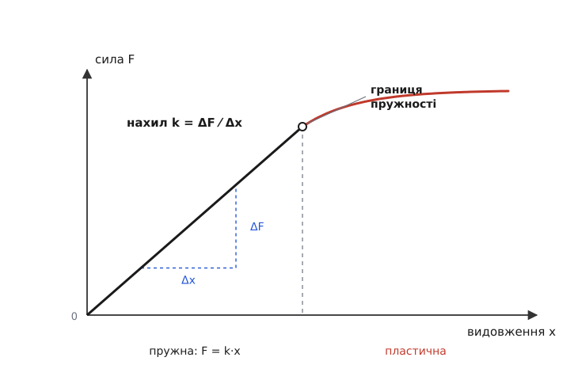
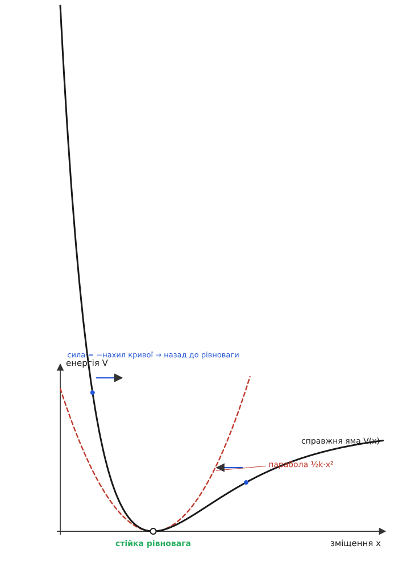

# Закон Гука

<preknowlist>
- [Сила](root:ph-mechanics/force) — штовхання чи тяга, що змінює рух тіла; вимірюється в ньютонах (Н).
- [Потенціальна енергія](root:ph-mechanics/potential-energy) — запас енергії, який залежить від положення тіла; її «долини» — це стійкі стани.
</preknowlist>

Натисніть пальцем на пружину — вона відштовхує назад. Натисніть удвічі глибше — відштовхує вдвічі сильніше. Відпустіть — вона точно повертається у вихідну форму. За цією буденною поведінкою ховається напрочуд проста закономірність, і цікаве питання не «що пружина робить», а «чому сила рівно пропорційна відхиленню — і чому одного дня ця пропорційність ламається».

Візьмімо величину, яку легко зміряти: наскільки далеко ми відвели тіло від його вільної, ненавантаженої форми. Назвімо це зміщення x. Дослід каже: сила, якою пружне тіло опирається, зростає рівно в стільки ж разів, у скільки зростає x. Подвоїли розтяг — подвоїли силу; утроїли — утроїли. Ця пряма пропорційність і є закон Гука:

```
F = −k·x
```

У формулі сховано два сенси. Множник k — це жорсткість, міра того, наскільки тіло «туге»: скільки ньютонів треба, щоб розтягнути його на один метр. Тому вимірюється вона в ньютонах на метр (Н/м): м'яка канцелярська гумка має k у кілька Н/м, а сталева ресора авта — сотні тисяч. Мінус попереду каже про напрям: сила завжди дивиться назустріч зміщенню. Відвели тіло праворуч — воно тягне ліворуч; стиснули ліворуч — штовхає праворуч. Саме тому цю силу звуть відновлювальною (від лат. *restituere* — відновлювати): вона щоразу націлена повернути тіло в положення рівноваги.

**Скільки розтягнеться пружина під вантажем.** Пружина з жорсткістю k = 200 Н/м; підвішуємо тіло масою m = 0.5 кг, і його вага тягне пружину вниз.

```
вага тіла:   F = m·g   = 0.5 · 9.8       = 4.9 Н
рівновага:   k·x = F    (пружина врівноважує вагу)
розтяг:      x = F / k  = 4.9 / 200       = 0.0245 м ≈ 2.45 см
енергія:     E = ½·k·x² = 0.5 · 200 · 0.0245² ≈ 0.060 Дж
```

Подвоїмо вантаж — удвічі більший розтяг: саме тому шкала пружинних терезів рівномірна.

Щоб розтягнути тіло, треба виконати роботу, і ця робота нікуди не зникає — вона запасається в тілі як пружна потенціальна енергія, готова виштовхнути його назад. Оскільки сила наростає лінійно від нуля до k·x, у середньому на шляху x діє половина кінцевої сили, тож запасена енергія виходить `E = ½·k·x²` — знову парабола: удвічі більший розтяг коштує вчетверо більшої енергії.


*Поки тіло пружне, сила й видовження ростуть пліч-о-пліч однією прямою, нахил якої і є жорсткість k; за границею пружності лінія загинається — тіло вже не повертається у вихідну форму.*

Тепер найважливіше — чому цьому закону кориться не лише пружина, а й натягнута струна, зігнута балка, стовп бетону, ба навіть двоє сусідніх атомів у кристалі. Причина не в пружинах, а у формі енергії.

Будь-яке тіло в стійкому стані сидить на дні [енергетичної долини](root:ph-mechanics/potential-energy): відвести його в будь-який бік означає піднятися схилом угору, а схил штовхає назад до дна. Придивімося ж до самого дна. Хоч якою химерною була б долина загалом, поблизу найнижчої точки вона гладка — а всяка гладка западина на дні виглядає як парабола. Сила — це нахил схилу (що крутіший схил, то дужче тягне вниз), а нахил параболи ½k·x² росте рівно пропорційно до x. Ось звідки береться −k·x: не з якоїсь особливості пружин, а з того, що дно кожної стійкої долини — парабола. Жорсткість k — це просто крутість цієї параболи: вузьке, круте дно — тверде тіло, пологе — м'яке. Строго це видно з [розкладу енергії біля мінімуму](root:ph-mechanics/hookes-law/math-parabolic-minimum.md), де k виявляється кривиною дна ями.


*Біля стійкої рівноваги справжня крива енергії й парабола ½k·x² невідрізненні, тож сила там лінійна; далі від дна вони розходяться — і закон Гука перестає бути точним.*

> 🔧 **Навіщо це.** Через це наближення пружиною можна замінити майже все — контакт коліс із дорогою, кріплення плати, зв'язок між атомами в симуляції. Поки зміщення малі, будь-яку складну взаємодію заступає єдине число k, і замість справжньої важкої фізики інженер рахує просту лінійну модель — вона точна саме там, де тіло працює у штатному режимі.

Це саме пояснює, чому закон Гука водночас всюдисущий і лише наближений. Відійдіть від дна задалеко — і парабола перестає збігатися зі справжньою долиною. У матеріалі це видно як кінець прямої ділянки на графіку: до певної межі сила й видовження йдуть разом, а тоді лінія загинається. Ця точка — границя пружності. За нею тіло вже не вертається у вихідну форму: пружина «сідає», дріт лишається зігнутим — починається [пластична течія](root:ph-condensed/plastic-deformation). У самій же пружній ділянці для суцільного матеріалу той самий закон зручніше писати не через силу й видовження, а через [напруження й відносну деформацію](root:ph-condensed/elastic-deformation) (σ = E·ε), де жорсткість на одиницю площі грає модуль Юнга E.

І остання ланка, найплідніша. Відновлювальна сила −k·x, прикладена до тіла масою m, [за другим законом руху](root:ph-mechanics/newtons-second-law) дає прискорення, спрямоване назад до рівноваги й тим більше, чим далі тіло відійшло. Таке тіло не може ні застигнути, ні втекти: воно проскакує рівновагу за інерцією й вертається знову і знову — коливається з частотою ω = √(k/m). Ось чому годинниковий баланс, автомобільна підвіска, кварцовий резонатор і атоми в ґратці — усе це різні втілення одного [гармонічного осцилятора](root:ph-waves/harmonic-oscillator), і всі вони живуть із закону Гука.

Цей прямий зв'язок сили з видовженням підмітив англійський природознавець Роберт Гук і 1678 року оприлюднив його стислим гаслом [«Ut tensio, sic vis»](root:ph-mechanics/hookes-law/hist-hooke-anagram.md) — «яке видовження, така й сила».
