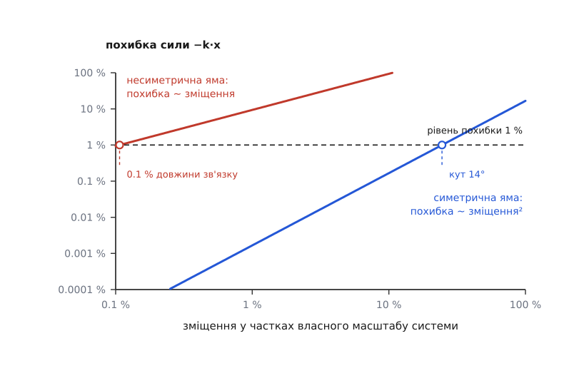
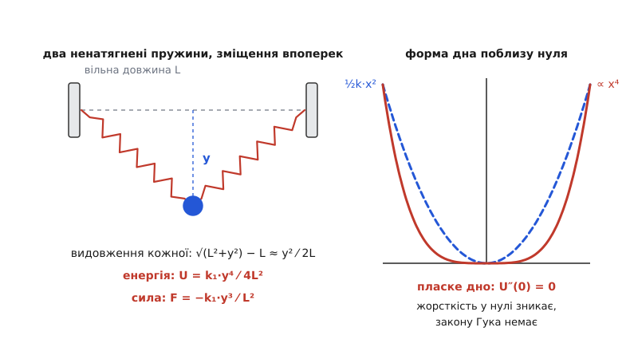

# 🧮 Розклад енергії біля мінімуму: k — це друга похідна

Тут виведено рівно одне твердження і полічено ціну його вжитку: поблизу будь-якої стійкої рівноваги сила лінійна за зміщенням, жорсткість k дорівнює другій похідній енергії в точці рівноваги — тобто кривині дна ями, — а похибка цього наближення росте за законом, який можна порахувати наперед і сказати, з якого зміщення лінійність уже неправда.

## Що дано

Нехай тіло рухається вздовж однієї координати x, а вся взаємодія з рештою світу описана [потенціальною енергією](root:ph-mechanics/potential-energy) U(x). Сила — мінус нахил цієї кривої:

```
F(x) = −dU/dx
```

Мінус тут не домовленість, а бухгалтерія: робота сили на шляху dx дорівнює F·dx, і саме на стільки меншає запас U, тож dU = −F·dx.

Точка рівноваги x₀ — та, де сила зникає, отже де крива U має горизонтальну дотичну:

```
F(x₀) = 0   ⟺   U′(x₀) = 0
```

Довести треба таке: для малого зміщення s = x − x₀ виконується F ≈ −k·s з k = U″(x₀). І окремо — з'ясувати, наскільки «малого».

## Звідки береться коефіцієнт ½

Спитаймо не про ряд, а про річ простішу: яка парабола найкраще заступає криву U біля точки x₀? Візьмімо загальну параболу від зміщення s:

```
P(s) = a₀ + a₁·s + a₂·s²
```

і вимагаймо, щоб у точці s = 0 вона мала те саме значення, той самий нахил і ту саму другу похідну, що й U. Похідні параболи рахуються за секунду:

```
P(0)  = a₀            →  a₀ = U(x₀)
P′(0) = a₁            →  a₁ = U′(x₀)
P″(0) = 2·a₂          →  a₂ = ½·U″(x₀)
```

Двійка в останньому рядку взялася з того, що s² при подвійному диференціюванні дає 2, а не 1. Ось і все походження горезвісної ½: вона не оздоба формули енергії, а плата за те, що похідну беруть двічі. Продовжте те саме міркування на кубічний член — s³ дасть 3·2 = 6, четвертий степінь — 4·3·2 = 24. Загальний коефіцієнт при sⁿ виходить U⁽ⁿ⁾(x₀)/n!, і ці коефіцієнти складають [ряд Тейлора](root:math-analysis/taylor-series):

```
U(x₀+s) = U(x₀) + U′(x₀)·s + ½·U″(x₀)·s² + (1/6)·U‴(x₀)·s³ + …
```

Ця рівність — не здогад про «схожість» кривих. Вона просто перелічує, який у кривої нахил в одній-єдиній точці, як швидко той нахил там міняється, як швидко міняється сама ця зміна, — і збирає з цих чисел многочлен.

## Рівновага вбиває лінійний член

Тепер підставмо те єдине, що ми знаємо про x₀. За означенням рівноваги U′(x₀) = 0 — лінійний член зникає геть. Значення U(x₀) — стала; енергію завжди відлічують від чогось, тож приймімо U(x₀) = 0. Лишається:

```
U(s) = ½·U″(x₀)·s² + (1/6)·U‴(x₀)·s³ + …
```

Продиференціюймо й візьмімо мінус:

```
F(s) = −U″(x₀)·s − ½·U‴(x₀)·s² − …
```

Перший доданок — це і є закон Гука, якщо назвати

```
k ≡ U″(x₀)
```

Зверніть увагу на логіку: квадратичний член очолив розклад не тому, що він великий, а тому, що все, що стояло перед ним, дорівнює нулю. Стала не дає сили взагалі (сталий доданок енергії нічого не штовхає), лінійний член енергії дав би сталу силу — але його вбила рівновага. Квадратичний член — перший, який виживає, і саме він дає силу, пропорційну зміщенню.

Знак k зчитується звідти ж. Якщо U″(x₀) > 0, крива в цій точці загинається вгору, точка є строгим локальним мінімумом (це і є [ознака екстремуму за другою похідною](root:math-analysis/extrema)), а сила −k·s дивиться назустріч зміщенню — тіло вертається. Якщо U″(x₀) < 0, точка є максимумом, і та сама алгебра дає силу +|k|·s, спрямовану геть від рівноваги: олівець, поставлений на вістря, теж стоїть у точці з U′ = 0, тільки тікає з неї тим швидше, чим далі відхилився.

## Кривина — не метафора

Слово «кривина» тут вжите буквально, і це варто перевірити. Геометрична кривина плоскої кривої y = U(x) — величина, обернена до радіуса кола, що найщільніше прилягає до кривої в даній точці:

```
κ = |U″| ⁄ (1 + U′²)^(3/2)
```

У довільній точці знаменник псує просту рівність: на крутому схилі та сама друга похідна дає меншу геометричну кривину. Але в точці рівноваги U′ = 0, знаменник дорівнює одиниці, і лишається

```
κ(x₀) = |U″(x₀)| = k
```

Отже жорсткість — це точнісінько кривина дна ями, а радіус стичного кола на дні дорівнює 1/k: тверде тіло має вузьке дно з малим радіусом, м'яке — широке й пласке. Одне застереження про чесність цієї геометрії: кривина намальованої кривої залежить від того, в яких масштабах відкладено осі (джоулі проти метрів), тож числове значення κ прив'язане до вибраних одиниць — рівність κ = U″ справджується в тих самих одиницях, у яких графік накреслено.

І ще одне: парабола, що збігається з кривою в значенні, нахилі й другій похідній, — єдина. Трьох умов рівно стільки, скільки в параболи коефіцієнтів, тож ніякої іншої «кращої параболи» на дні немає — та, що з k = U″(x₀), і є вона.

> 🔧 **Навіщо це.** Коли U відома не формулою, а таблицею (вимірювання, розрахунок енергії ґратки, крива навантаження), k беруть тією ж другою похідною через центральну різницю: `k ≈ [U(x₀−h) − 2·U(x₀) + U(x₀+h)] ⁄ h²`. Похибка цієї формули росте як h², і на ямі Леннард-Джонса крок h = 0.01·σ дає k з точністю 0.25 %, а h = 0.05·σ — уже 6.3 %. Занадто дрібний крок теж шкодить: чисельник стає різницею майже однакових чисел, і його з'їдає похибка заокруглення.

## Доки лінійність тримається

Ряд Тейлора не обривається сам — його обриваємо ми, і треба знати ціну. Строга форма із залишковим членом (її дав Жозеф-Луї Лагранж у «Théorie des fonctions analytiques», 1797; сам ряд Брук Тейлор оприлюднив у «Methodus incrementorum directa et inversa», Лондон, 1715) каже: відкинутий хвіст дорівнює наступному членові, обчисленому в якійсь проміжній точці ξ між x₀ і x₀+s. Для сили це означає

```
F(s) = −U″(x₀)·s − ½·U‴(ξ)·s²
```

Поділімо похибку на те, що лишили:

```
відносна похибка ≈ ½·|U‴ ⁄ U″|·s = s ⁄ ℓ,     де   ℓ ≡ 2·U″ ⁄ |U‴|
```

Ось справжня причина, чому лінійний закон виграє поблизу дна. Річ не в тім, що кубічний член малий — при малому s малі всі члени, і квадратичний теж. Річ у тім, що їхнє **відношення** спадає лінійно з s: удвічі ближче до дна — удвічі менша частка похибки. Довжина ℓ — власний масштаб ями, поза яким лінійності вже не можна вірити.

Окремий випадок вартий уваги: якщо яма симетрична, U‴(x₀) = 0 разом з усіма непарними похідними, першою поправкою стає четвертий степінь, і відносна похибка спадає вже як s², тобто набагато швидше. Через це дві системи з однаково «глибокими» ямами можуть мати вікна лінійності, що різняться на два порядки.

## Приклад: маятник — симетрична яма

Тіло масою m на невагомому стрижні довжини L. Виміряймо зміщення дугою x = L·θ; висота підйому — L(1 − cos θ), тож

```
U(x) = m·g·L·(1 − cos(x/L))
U′(x) = m·g·sin(x/L)
U″(x) = (m·g/L)·cos(x/L)
k = U″(0) = m·g ⁄ L
```

**Числа.** m = 0.2 кг, L = 1.00 м, g = 9.81 м/с².

```
k = m·g/L      = 0.2 · 9.81 / 1.00      = 1.962 Н/м
ω = √(k/m)     = √(g/L) = √9.81         = 3.132 рад/с
T = 2π/ω                                 = 2.006 с
```

Маса тут скорочується двічі: вона сидить у самій жорсткості k = m·g/L і вона ж стоїть під коренем у формулі частоти [гармонічного осцилятора](root:ph-waves/harmonic-oscillator) ω = √(k/m). Звідси й давнє спостереження, що період маятника від ваги вантажу не залежить.

Тепер ціна наближення. Косинус — функція парна, тож U‴(0) = 0, і розклад одразу дає четвертий степінь:

```
U(θ) = m·g·L·(θ²/2 − θ⁴/24 + …)
момент сили: M = −m·g·L·sin θ = −m·g·L·(θ − θ³/6 + …)
відносна похибка лінійного члена = θ² ⁄ 6
```

```
θ = 5°  = 0.0873 рад  →  похибка сили 0.13 %,  період +0.05 %
θ = 10° = 0.1745 рад  →  похибка сили 0.51 %,  період +0.19 %
θ = 30° = 0.5236 рад  →  похибка сили 4.57 %,  період +1.71 %
```

Поправку до періоду тут дає окремий ряд, T ≈ T₀·(1 + θ₀²/16 + …); точне значення через еліптичний інтеграл для 10° становить +0.1907 %, ряд дає +0.1904 % — збіг до четвертої цифри. Отже симетрична яма терпить відхилення на десяток градусів, майже не відступаючи від лінійності.

## Приклад: два атоми — несиметрична яма

Пара нейтральних атомів притягується на великій відстані й різко відштовхується на малій; найуживаніша модельна крива такої взаємодії — [потенціал Леннард-Джонса](root:ph-condensed/lennard-jones-potential):

```
U(r) = 4·ε·[(σ/r)¹² − (σ/r)⁶]
```

Знайдімо дно й кривину чесним диференціюванням:

```
U′(r) = 4ε·[−12·σ¹²/r¹³ + 6·σ⁶/r⁷]
U′ = 0  →  (σ/r)⁶ = ½  →  r₀ = 2^(1/6)·σ ≈ 1.1225·σ,  U(r₀) = −ε

U″(r)  = 4ε·[156·σ¹²/r¹⁴ − 42·σ⁶/r⁸]
U″(r₀) = 4ε·(156·2^(−7/3) − 42·2^(−4/3))/σ² = 36·2^(2/3)·ε/σ² ≈ 57.146·ε/σ²

U‴(r₀) = 4ε·(−2184·2^(−5/2) + 336·2^(−3/2))/σ³ = −756·√2·ε/σ³ ≈ −1069.15·ε/σ³
```

Отже жорсткість зв'язку k = 36·2^(2/3)·ε/σ². Її варто переписати через величини, які видно з досліду, — глибину ями D = ε і рівноважну відстань r₀. Підставивши σ = r₀/2^(1/6), тобто σ² = r₀²/2^(1/3), дістаємо напрочуд охайну формулу:

```
k = 72·D ⁄ r₀²
```

Тепер вікно лінійності. Відношення похідних не залежить від ε:

```
|U‴/U″| = 756·√2 ⁄ (36·2^(2/3)) · (1/σ) = 18.709 ⁄ σ
ℓ = 2·U″/|U‴| = 0.1069·σ
відносна похибка ≈ 9.354 · (s/σ)
```

Перевіримо передбачення прямим обчисленням сили з тієї самої формули (ε = 1, σ = 1):

```
s = 0.001·σ  →  передбачено 0.94 %,  насправді 0.93 %
s = 0.010·σ  →  передбачено 9.35 %,  насправді 8.88 %
s = 0.020·σ  →  передбачено 18.7 %,  насправді 16.9 %
```

Сама оцінка похибки теж лінійна, тож вона хибить там, де похибка вже велика, — і хибить у безпечний бік, завищуючи. Головне число інше: щоб триматися в межах 1 %, зміщення мусить не перевищувати приблизно 0.1 % міжатомної відстані — для аргону це якихось 0.4 пікометра. Порівняйте з маятником, який на тій самій точності витримує 14°.


*Одна й та сама точність у 1 % настає за зміщення 0.1 % довжини зв'язку в несиметричній ямі — і аж за 14° у симетричній: у першої похибка росте як s, у другої як s².*

**Числа для справжнього аргону.** Спектроскопія димера Ar₂ дає рівноважну відстань r₀ = 3.758 Å і глибину ями D ≈ 99.4 см⁻¹ (енергію тут за звичаєм спектроскопістів міряють хвильовими числами; 1 см⁻¹ = h·c = 1.9864·10⁻²³ Дж).

```
D = 99.4 · 1.9864·10⁻²³                        = 1.9745·10⁻²¹ Дж
k = 72·D / r₀² = 72 · 1.9745·10⁻²¹ / (3.758·10⁻¹⁰)²   = 1.007 Н/м
μ = m(Ar)/2 = 39.948 · 1.6605·10⁻²⁷ / 2        = 3.317·10⁻²⁶ кг
ω = √(k/μ) = √(1.007 / 3.317·10⁻²⁶)            = 5.51·10¹² рад/с
ν = ω/2π                                       = 0.877 ТГц  (29.2 см⁻¹)
```

Тут μ — [зведена маса](root:ph-mechanics/reduced-mass) пари: коливаються обидва атоми, а не один об нерухому стінку. Виміряна гармонічна стала того самого димера — близько 30 см⁻¹ (дані NIST за спостереженнями Колберна й Дугласа, 1976), тобто кривина дна вгадала частоту з точністю кількох відсотків. А от справжній спостережений перехід між двома найнижчими коливними рівнями лежить на 26 см⁻¹ — на 13 % нижче. Ця розбіжність і є кубічний член, виражений числом: рівні розсуваються нерівномірно саме тому, що яма несиметрична.

Жорсткість одного атомного зв'язку виходить близько ньютона на метр — м'якше за канцелярську гумку. Модуль пружності суцільного тіла складається з таких зв'язків: на квадратний метр перерізу їх припадає 1/r₀² ≈ 7·10¹⁸, і кожен працює на довжині r₀, звідки груба оцінка E ≈ k/r₀ = 1.007 / 3.758·10⁻¹⁰ ≈ 2.7 ГПа. Оцінка справді груба — справжній кристал тривимірний, і сусідів у кожного атома дванадцять, — але порядок вона дає правильний: виміряний модуль усебічного стиску твердого аргону за T → 0 становить 2.88 ГПа. Щоб дійти до 200 ГПа сталі, окремий зв'язок мусить бути жорсткішим разів у півсотні.

Знак третьої похідної теж не дрібниця. U‴(r₀) < 0 означає, що на розтяг яма пологіша, ніж парабола, а на стиск — крутіша: зв'язок легше видовжити, ніж укоротити. Тому з ростом енергії коливань середня відстань між атомами зсувається назовні — і це, а не «розширення самих атомів», і є [теплове розширення](root:ph-thermodynamics/thermal-expansion). У чисто параболічній ямі його не було б зовсім.

## Коли параболи немає

Усе доведене спиралося на одну умову: U″(x₀) ≠ 0. Вона справджується не завжди, і тоді закону Гука просто немає. Найпростіший пристрій із таким дном збирається з двох звичайних пружин.

Закріпімо кінці двох однакових пружин власної жорсткості k₁ і вільної довжини L так, щоб між затисками була рівно відстань 2L: пружини не натягнені. Тіло посередині зміщуємо **впоперек** на y:

```
видовження кожної: e = √(L² + y²) − L = L·(√(1 + y²/L²) − 1) ≈ y² ⁄ 2L
енергія двох:      U(y) = 2 · ½·k₁·e² = k₁·y⁴ ⁄ 4L²
сила:              F = −dU/dy = −k₁·y³ ⁄ L²
кривина:           U″(y) = 3·k₁·y² ⁄ L²   →   U″(0) = 0
```

Корінь тут розкладено тим самим рядом: √(1+u) ≈ 1 + u/2, і саме ця половинка квадрата робить із поздовжнього видовження величину другого порядку за поперечним зміщенням. Пряма перевірка на числах k₁ = 100 Н/м, L = 0.5 м: за y = 0.01 м точна енергія двох пружин дорівнює 9.998·10⁻⁷ Дж, четвертий степінь дає 1.000·10⁻⁶ Дж.


*Поперечне зміщення розтягує пружини лише на величину порядку y², тож енергія росте як y⁴: дно виходить пласким, друга похідна в нулі зникає, і сила пропорційна кубу зміщення.*

Сила тут росте як куб — біля нуля система нескінченно м'яка, а далі різко твердне. Жорсткість, обчислена як U″, залежить від того, наскільки тіло вже відхилене, а частота коливань — від амплітуди, тобто це вже не [гармонічний осцилятор](root:ph-waves/harmonic-oscillator).

Правило в загальному вигляді таке: якщо в мінімумі занулилися всі похідні до (n−1)-ї включно, а n-та ні, то

```
U(s) ≈ U⁽ⁿ⁾(x₀)·sⁿ ⁄ n!        F(s) ≈ −U⁽ⁿ⁾(x₀)·s^(n−1) ⁄ (n−1)!
```

причому n мусить бути парним і U⁽ⁿ⁾ > 0 — інакше з одного боку від точки енергія падає, і рівновага не стійка. Закон Гука — випадок n = 2, і панує він не тому, що чимось особливий, а тому, що в довільної гладкої ями друга похідна на дні просто не дорівнює нулю. Занулити її може лише окрема причина; тут такою причиною була геометрія, яка перетворила поздовжнє видовження на квадрат поперечного зміщення.

## Кілька вимірів

Якщо стан описують кілька координат, розклад той самий, тільки коефіцієнт другого порядку стає матрицею:

```
U(x₀+s) = U(x₀) + ½·sᵀ·H·s + …,      H_ij = ∂²U ⁄ ∂x_i ∂x_j
F = −H·s
```

Матриця H — [матриця Гессе](root:math-analysis/hessian-matrix), симетрична за рівністю мішаних похідних. Жорсткість тепер залежить від напрямку зміщення, а сама сила вже не мусить бути співнапрямлена зі зміщенням: штовхніть таку систему навскіс — і вона відповість убік. Винятком є [власні напрямки](root:math-algebra/eigenvalues) матриці H: уздовж них сила знову дивиться точно назустріч зміщенню, а власні значення — це жорсткості вздовж цих напрямків, кожна зі своїм коливанням, не переплутаним з рештою. Стійкість рівноваги означає, що всі власні значення додатні. Одновимірне k — це все, що лишається від матриці Гессе, коли координата одна.
