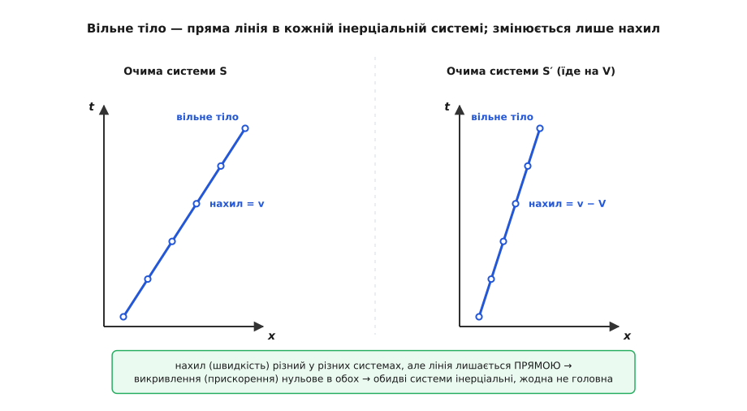
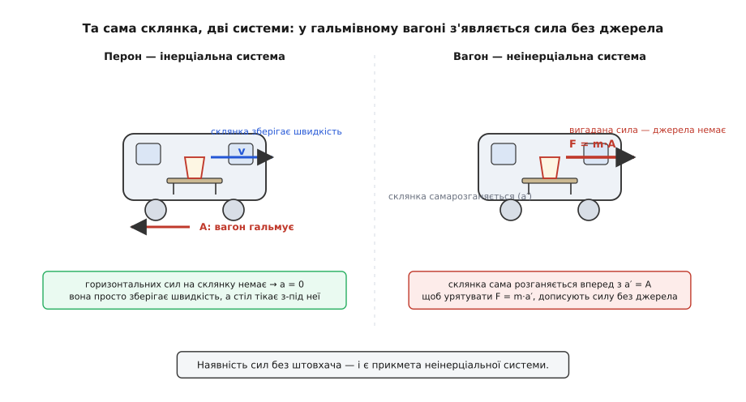
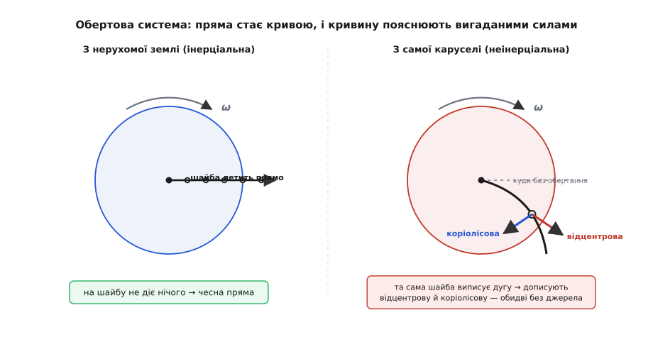

# Інерціальна система відліку: де закони Ньютона справджуються без вигаданих сил

<preknowlist>
- [Швидкість](root:ph-mechanics/velocity) — як швидко й куди змінюється положення; «рівномірний рух» означає сталу швидкість.
- [Прискорення](root:ph-mechanics/acceleration) — як швидко змінюється сама швидкість; прискорена система — це система, що розганяється, гальмує чи повертає.
- [Сила](root:ph-mechanics/force) — міра дії на тіло; «вільне тіло» — це тіло, на яке немає сумарної сили.
- [Другий закон Ньютона](root:ph-mechanics/newtons-second-law) — F = m·a; саме форма цього закону вирізняє інерціальні системи з-поміж усіх.
</preknowlist>

Запитайте себе, з якою швидкістю ви зараз рухаєтесь, — і чесної відповіді без уточнення немає. Відносно крісла — нуль. Відносно центру Землі — сотні метрів за секунду, бо планета крутиться. Відносно Сонця — тридцять кілометрів за секунду. Усі три відповіді правильні водночас, бо швидкість сама собою не існує: вона завжди **відносно чогось**. Це «щось» — тіло чи набір тіл із прив'язаними до них осями координат і годинником — і зветься **системою відліку**.

І тут вигулькує халепа, з якої й виростає вся тема. Перший закон механіки, закон інерції, каже: вільне тіло, на яке не діють сили, зберігає свою швидкість. Але «зберігає швидкість» — **у якій системі відліку**? Виявляється, не в будь-якій. Є системи, де цей закон справджується бездоганно, і є системи, де вільне тіло раптом саме собою зривається з місця, хоч ніхто його не торкався. Ось цей поділ систем на два сорти — і є серцевина класичної механіки, а системи першого сорту звуться **інерціальними** (від лат. *inertia* — «бездіяльність», бо саме в них тіло, полишене на себе, нічого не робить зі своїм рухом).

### Закон інерції як пробний камінь

Візьмімо тіло, на яке справді не діє жодна сумарна сила: шайбу на нескінченно гладкому льоду, камінь у порожнечі далеко від усіх мас. [Закон інерції](root:ph-mechanics/newtons-first-law) обіцяє, що воно летітиме прямо й рівномірно. Зробімо з цієї обіцянки **пробу для самої системи відліку**. Опишімо рух вільного тіла з якоїсь системи й погляньмо на нього: воно й справді йде по прямій зі сталою швидкістю? Якщо так — систему звемо інерціальною. Якщо ні — якщо вільне тіло чомусь викривлює шлях чи розганяється без видимої причини, — система **неінерціальна**.

Зверніть увагу, що це не порожнє означення, яке кружляє саме навколо себе. Воно **операційне**: дає рецепт, як практично перевірити систему, не питаючи в природи дозволу. Кинь вільну частинку — простеж траєкторію — зроби висновок. Саме таке означення дав 1885 року німецький фізик Людвіг Ланге (Ludwig Lange), увівши сам термін «інерціальна система» (нім. *Inertialsystem*) замість туманного Ньютонового «абсолютного простору»; він підхопив думку, кинуту раніше Карлом Нойманом. До того двісті років фізики користувалися законом інерції, до пуття не проговоривши, **відносно чого** він виконується. Довгий і покручений шлях цієї ідеї — від Арістотеля, який вимагав штовхача для будь-якого руху, через корабель Ґалілея й пряму інерцію Декарта до Ньютона й аж до Ланге з його терміном — зібрано в [окремій історії](root:ph-mechanics/inertial-frame/hist-inertial-frame.md).

Чому ж цей закон править за пробний камінь? Бо він — найпростіше, що взагалі можна сказати про рух: облиш тіло — і нічого не станеться. Якщо в якійсь системі навіть це найпростіше не справджується, якщо облишене тіло само собою кудись їде, — виходить, річ не в тілі, а в системі: вона сама рухається так, що підмінює нам картину.

### Ціла родина рівноправних систем

Знайшовши одну інерціальну систему, ми задарма дістаємо нескінченну їх кількість. Візьміть будь-яку іншу систему, що рухається відносно першої **рівномірно й прямолінійно** — зі сталою швидкістю V, без розгону й поворотів. Вона теж буде інерціальною, і ось чому.

Нехай у першій системі S тіло має швидкість v. У другій системі S′, що біжить зі сталою V, те саме тіло має швидкість `v′ = v − V` — просто віднімаємо швидкість спостерігача. Це **перетворення Ґалілея**. А тепер найважливіше: подивімося на прискорення. Прискорення — це швидкість зміни швидкості. Якщо від v щоразу віднімати **одне й те саме стале** V, то швидкість зміни не зачепиться зовсім:

```
v′ = v − V           (V стала)
a′ = Δv′/Δt = Δv/Δt = a
```

Прискорення однакове в обох системах. А оскільки маса тіла та сама й реальні сили ті самі, то другий закон `F = m·a` у S′ виглядає буквально так само, як у S. Обидва спостерігачі пишуть однакові рівняння руху, ставлять однакові досліди й дістають однакові числа. Вони фізично **нерозрізненні**.

Ось чому інерціальних систем — ціла родина, і в ній немає головної. Не існує способу вказати ту єдину, що «справді стоїть»: рівномірний рух не має жодної внутрішньої прикмети. Цю цілковиту рівноправність усіх інерціальних систем звуть [принципом відносності](root:ph-mechanics/galilean-relativity), і першим його ясно висловив Ґалілео Ґалілей ще 1632 року. Він змалював корабель, що рівно пливе, і замкнену каюту під палубою: краплі капають прямовисно, риби в мисці плавають на всі боки однаково, метелики літають байдуже до курсу — і ніхто в каюті, не визирнувши назовні, не скаже, стоїть корабель чи мчить. Усі домашні досліди дають той самий результат, бо каюта, поки корабель іде рівно, — інерціальна система, рівноправна з причалом.


*Час — угору, простір — управо; рух тіла — це лінія на такій діаграмі. Спостерігач S стоїть (прямовисна лінія), спостерігач S′ рівномірно їде (нахилена). Вільна частинка — пряма: у S вона має одну швидкість (нахил), у S′ — іншу, але лінія в обох лишається прямою. Нахил лінії (швидкість) залежить від системи, а от викривлення лінії (прискорення) — ні: у всіх рівномірно рухомих системах воно однакове. Тому кожна така система інерціальна й жодна не привілейована.*

**Приклад (потяг, пасажир і перон).** Потяг іде рівномірно на V = 30 м/с. Пасажир крокує проходом уперед на 1.5 м/с відносно вагона, а тоді за 2 с прискорюється до 2.5 м/с. Порівняймо, що бачать двоє спостерігачів.

```
Швидкість пасажира:
  у вагоні (S′):  1.5 м/с
  на пероні (S):  1.5 + 30 = 31.5 м/с      ← різні числа: швидкість залежить від системи

Пасажир прискорюється (за 2 с):
  у вагоні:  (2.5 − 1.5) / 2 = 0.5 м/с²
  на пероні: швидкість 31.5 → 32.5 м/с,  (32.5 − 31.5) / 2 = 0.5 м/с²
  a′ = a = 0.5 м/с²                        ← прискорення ОДНАКОВЕ
```

Швидкість у двох системах різна, а прискорення — те саме. Саме тому обидва спостерігачі, помноживши це прискорення на масу пасажира, дістануть однакову силу, яку розвивають його ноги. Ключове тут — слово «рівномірно»: доки вагон їде зі сталою швидкістю, перон і вагон рівноправні. А що станеться, коли вагон почне гальмувати, — ось де народжується найцікавіше.

### Прискорена система бреше: народження вигаданих сил

Поставте на гладкий столик у вагоні склянку — так, щоб тертя було мізерне, — і хай машиніст ударить по гальмах. Склянка з'їде вперед і, коли пощастить, злетить зі столика. А тепер спитаймо строго: **яка сила** штовхнула склянку вперед?

Погляньмо з перону, який (на короткий час) можна вважати інерціальним. На склянку по горизонталі не діє нічого: тертя знехтуване, ніхто її не торкається. За першим законом вона й **не змінює** своєї швидкості — просто їде далі рівно, як їхала. Це вагон під нею сповільнюється й ніби втікає назад, а склянка лишається на місці в просторі. Жодної загадки: нема сили — нема зміни руху.

Тепер погляньмо зсередини вагона, який гальмує, тобто **з неінерціальної системи**. Тут склянка сама собою розганяється вперед. Щоб урятувати звичний `F = m·a`, спостерігач у вагоні змушений вписати в рівняння силу, якої насправді немає, — **вигадану** (її ще звуть інерційною чи псевдосилою). Її величина дорівнює масі склянки, помноженій на прискорення самого вагона, і спрямована вона протилежно цьому прискоренню.

**Приклад (гальмування).** Вагон сповільнюється зі сталим A = 3 м/с². На гладкому столику стоїть склянка m = 0.3 кг.

```
Погляд із перону (інерціальна система):
  горизонтальних сил на склянку немає  →  a = 0
  склянка їде далі рівномірно; це стіл «тікає» з-під неї
  (перший закон Ньютона: вільне тіло зберігає швидкість)

Погляд із вагона (неінерціальна система):
  склянка сама розганяється вперед з a′ = A = 3 м/с²
  щоб урятувати F = m·a′, впишемо силу:
  F_вигадана = m·A = 0.3 × 3 = 0.9 Н,  спрямовану вперед
  джерела в неї немає — ніщо склянку не штовхає
```

Ті самі 0.9 Н, що на пероні дорівнюють нулю. Ось прикмета неінерціальної системи: у ній доводиться **дописувати сили без джерела**, аби закони Ньютона зійшлися. Те саме відчуття ви ловите всім тілом, коли автобус різко рушає й вас притискає до спинки, або коли ліфт починає підйом і ноги на мить важчають: ніхто вас не штовхає ззаду, просто ваша система відліку розганяється, і тіло за інерцією відстає.

Найбагатший урожай вигаданих сил дає система, що **обертається** — а обертається майже все, від каруселі до планети. Пустіть шайбу прямо через центр каруселі, що крутиться. З боку, з нерухомої землі, шайба летить чесною прямою — на неї нічого не діє. Але для того, хто крутиться разом із каруселлю, та сама шайба виписує дугу, наче її щось відхиляє. Щоб пояснити цю кривину, мешканець каруселі мусить вигадати одразу дві сили: [відцентрову](root:ph-mechanics/centrifugal-force), що ніби відкидає все назовні від осі, і [коріолісову](root:ph-mechanics/coriolis-effect), що збиває вбік усе рухоме. Обидві — того самого штибу, що й поштовх у гальмівному вагоні: вони існують лише тому, що система відліку сама прискорена (обертання — це теж прискорення, бо напрямок швидкості весь час міняється). Величина цих сил залежить від [кутової швидкості](root:ph-mechanics/angular-velocity) ω обертання системи. Повне виведення всіх додаткових доданків — поступального −m·A, відцентрового, коріолісового й ейлерового, — що вигулькують, коли переходиш у прискорену чи обертову систему, зібрано в [математичній вставці](root:ph-mechanics/inertial-frame/math-fictitious-forces.md).


*Одна й та сама подія у двох системах. Ліворуч, з перону (інерціальна система): на склянку немає горизонтальних сил, тож вона зберігає швидкість — це стіл вагона гальмує з-під неї. Праворуч, із вагона (неінерціальна система): склянка сама розганяється вперед, і щоб урятувати F = m·a, доводиться вписати вигадану силу −m·A, у якої немає жодного джерела. Наявність таких сил без штовхача — і є прикмета неінерціальної системи.*

### Справжня сила чи вигадана

Якщо вигадану силу можна відчути всім тілом (притиск до спинки цілком реальний!), то як узагалі відрізнити її від справжньої? Різниця — чітка, і тримається вона на кількох ознаках.

Справжня сила завжди має **джерело** — інше конкретне тіло, що штовхає, тягне чи притягує. Вона підкоряється третьому закону Ньютона: є партнер, рівна протидія (притягнула Земля камінь — камінь притягнув Землю). І вона однакова в усіх системах відліку: натяг мотузки чи сила тяжіння не зникнуть від того, що ви пересіли в інший поїзд.

Вигадана сила не має нічого з цього. У неї **немає джерела** — жодне тіло її не прикладає, тож і партнера-протидії немає. Вона діє на **всі** тіла заразом і завжди пропорційна масі тіла та прискоренню самої системи (`F = m·A`), — тому в ній і почуваєшся, як у власній вазі: що масивніший, то дужче тисне. І головне: її можна **прибрати одним рухом** — просто перейти в інерціальну систему. Пересядьте з гальмівного вагона на перон, зійдіть з каруселі на землю — і сила зникає без сліду, бо її ніколи й не було, крім як у вашому виборі системи.

> 🔧 **Навіщо це.** Саме на цьому стоїть інерціальна навігація дронів, ракет і телефонів. Акселерометр не знає, у якій системі він летить, тож чесно міряє тільки [власне прискорення](root:ph-mechanics/proper-acceleration) — відхилення від вільного руху, а не «швидкість відносно землі». Щоб перетворити його покази на переміщення, алгоритм мусить сам утримувати в голові інерціальну (точніше — незмінно орієнтовану, неприскорену) опорну систему й у ній інтегрувати рух, вручну додаючи ті самі вигадані доданки — відцентровий і коріолісів — від обертання Землі та від власного маневру. Забудеш це врахувати — і фізика підсуне тобі коріолісове відхилення як «справжній» знос убік, а машина полетить не туди.

Є ще одна перевірка, найтонша: **прилад**. Акселерометр, покладений вільно (у польоті, у падінні), показує нуль — бо вільний рух і є природний стан в інерціальній системі, від нього нема відхилення. Той самий прилад на столі показує вгору `1 g`: стіл штовхає його, збиваючи з вільного падіння. Отже, справжню силу прилад **чує**, а вигадану — ні: коли карусель крутить вас, акселерометр у кишені реєструє реальний притиск сидіння, а не «відцентрову» — бо відцентрової як фізичної дії просто немає.

### Чи існує ідеальна інерціальна система

Тепер найнеприємніше питання: а де взагалі знайти хоч одну **справжню** інерціальну систему? Земля під ногами здається взірцем непорушності, та це оманливо. Вона обертається навколо осі — а отже, неінерціальна, і в ній живуть відцентрова сила (через неї вага на екваторі трохи менша) і коріолісова (через неї циклони закручуються, а ріки підмивають один берег дужче). Вона ще й летить навколо Сонця, змінюючи напрямок швидкості. Для впущеної склянки чи навіть для гри в теніс усі ці ефекти мізерні, тож поверхню Землі сміливо беруть за інерціальну «на коротко». Але для міжконтинентальної ракети чи для маятника, що гойдається годинами, поправку вже не сховаєш.

Найближче до ідеалу підходить не нерухомість, а **вільне падіння**. Кабіна ліфта з обірваним тросом, станція на орбіті, стрибун у польоті — усередині них тяжіння наче вимикається: усе падає разом, тож одне відносно одного нічого не важить і вільне тіло справді пливе по прямій. Це наслідок [принципу еквівалентності](root:ph-mechanics/equivalence-principle): місцево, у малій вільно падній скриньці, поле тяжіння зникає, і скринька стає чудовою інерціальною системою — кращою за твердий ґрунт, який навпаки **виштовхує** нас угору з вільного падіння й тим є неінерціальним.

Слово «місцево» тут вирішальне, і воно ставить межу всій картині. Справжнє тяжіння планети скрізь спрямоване до центру, тож у **великій** вільно падній скриньці дві кульки на різних краях падають не зовсім паралельно — вони поволі сходяться. Ця залишкова, припливна частина тяжіння не зникає в жодній системі, і через неї збудувати **одну глобальну** інерціальну систему на весь простір, охоплений тяжінням, неможливо. Лишаються тільки маленькі, місцеві інерціальні клаптики — рівно та думка, з якої виросла [загальна теорія відносності](root:ph-quantum/general-relativity), де тяжіння взагалі перестає бути силою й стає геометрією простору-часу.

А чи є в порожньому просторі, далеко від усіх мас, той остаточний абсолютний каркас, відносно якого рахувати обертання? Ньютон вірив, що є, — його «абсолютний простір». Австрійський фізик Ернст Мах (Ernst Mach) наприкінці XIX століття різко заперечив: вода у відрі, що крутиться, вигинається не відносно порожнього простору, а відносно **всієї далекої речовини всесвіту** — зір і галактик. За Махом, сама інерція народжується від сукупності далеких мас, і немає абсолютного простору окремо від них. Це чудово збігається з практикою: коли інженерам потрібна найкраща інерціальна опора, вони орієнтують її по далеких зорях і галактиках — по тому, що в масштабах усього неба практично не обертається.

### Що з цього лишається

Інерціальна система — це не місце, а **стан руху**: рух разом із вільним тілом, без власного розгону й обертання. У такій системі природа найпростіша — вільне тіло йде прямо, закони Ньютона стоять у чистій формі `F = m·a`, і кожна сила має чесне джерело. Щойно ви сходите з цього стану — гальмуєте, повертаєте, кружляєте, — доводиться платити: у рівняннях з'являються вигадані сили без джерела, пропорційні масі й вашому власному прискоренню, які зникнуть тієї ж миті, коли ви повернетесь на інерціальну доріжку. Ідеальної, глобальної інерціальної системи в світі з тяжінням не існує — лишаються тільки місцеві, найкращі з яких дає вільне падіння. Тож інерціальна система — це не даність, а **межа**, до якої природа дає підійти скільки завгодно близько, ніколи не даючи торкнутися. І весь фокус механіки — знати, наскільки близько ви стоїте, і які саме вигадані сили дописати, коли доводиться відступити.

Побачити цю залежність картини від вибору системи в коді — як той самий прямий політ шайби стає викривленою дугою, щойно дивишся на нього з обертової системи, і як «сила», що ту дугу гне, зникає при поверненні на землю, — можна на [маленькій симуляції](root:ph-mechanics/inertial-frame/proj-rotating-frame.md).


*Шайбу пущено прямо через центр каруселі. Ліворуч, із нерухомої землі (інерціальна система): траєкторія — чесна пряма, бо на шайбу не діє нічого. Праворуч, із самої каруселі (неінерціальна система): та сама шайба виписує дугу, і щоб її пояснити, доводиться вигадати відцентрову силу (назовні від осі) й коріолісову (вбік від напрямку руху). Обидві сили — не фізична дія, а наслідок самого обертання системи: на землі їх немає.*
