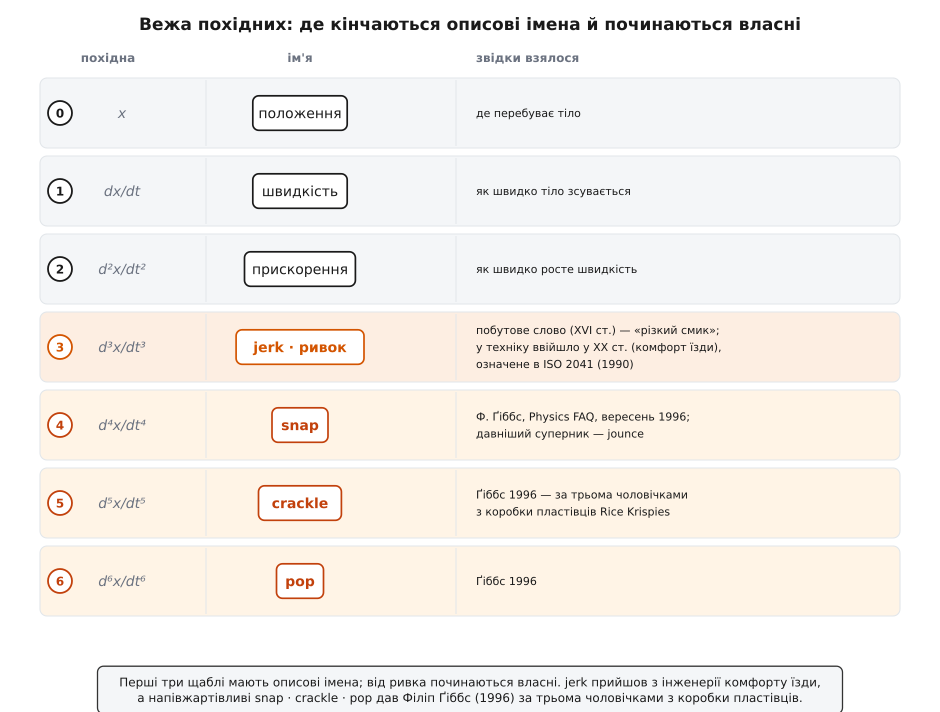

# 📜 Слово, старіше за фізику: звідки взявся «ривок» і хто охрестив snap, crackle, pop

> Величину зазвичай хрестять ученою латиною чи грекою — «інерція», «момент», «потенціал» прийшли саме звідти, від книжників, а не з вулиці. Ривок — виняток, та ще й подвійний. Його ім'я взялося не з математики, а з простого слова, яким тіло споконвіку називало різкий смик; а імена його старших родичів узагалі позичені в трьох чоловічків із коробки пластівців до сніданку. Це розповідь про те, як безіменна складка геометрії дістала спершу побутове слівце, тоді штамп міжнародного стандарту, а насамкінець — жартівливий кашкет із реклами. І про те, що річ майже завжди живе раніше за своє ім'я.

Найдивніше в історії ривка те, що сама величина нікого не бентежила, поки не знадобилася. Її не «відкривали» в муках, як прискорення, за яким людство гналося три століття. Третя [похідна](topic:math-analysis/derivative) положення тихо лежала в підручниках геометрії, і ніхто не бачив у ній потреби — аж поки інженери не почали ставити дуже людське питання: чому одна їзда приємна, а друга смикає? Ім'я народилося з цієї потреби, а не з математики. Тож почнімо з того, що річ була раніше за слово.

## Річ жила в геометрії задовго до імені

Третя похідна з'явилася на світ не як величина руху, а як властивість кривої лінії — і за добрих півстоліття до того, як хтось назвав її ривком. Французький геометр Абель Трансон (Abel Transon, 1805–1876) у 1845 році вивчав те, що назвав *déviation de courbure* — «відхилення кривини»; згодом цю величину стали звати аберантністю кривої. Ідея така: у кожній точці гладенької кривої можна прикласти коло, що якнайщільніше до неї тулиться, — коло кривини. Крива від нього потроху відхиляється, і те, наскільки несиметрично вона це робить, ховається саме в **третій** похідній. Трансон рахував це відхилення суто геометрично, без жодної думки про рух, час чи ліфти. Для нього це була краса кривих ліній, а не смик у спині.

Що це той самий звір, який згодом дістане ім'я «ривок», показав уже у ХХ столітті американський математик Стівен Шот (Steven H. Schot). У статті «Jerk: the time rate of change of acceleration» (*American Journal of Physics*, 1978, т. 46, с. 1090–1094) — донині чи не найповнішій розвідці про цю величину — він розклав вектор ривка на складові й побачив, що його нормальна складова виражається рівно через ту саму афінну інваріанту, яку Трансон звав аберантністю. Тобто складка, яку геометр вивчав на нерухомих кривих 1845 року, і різкість, з якою смикає ліфт, — одне й те саме третьопохідне єство, лиш побачене з різних боків.

Тут варто чесно розставити статус доказовості. Що Трансон вивчав відхилення кривини 1845 року — задокументований факт. А от ототожнення цієї геометричної величини з «ривком руху» — це вже пізніше прочитання, і зробив його Шот аж 1978-го. Сам Трансон слова «jerk» не знав і знати не міг: він рахував геометрію, а не приємність їзди. Урок простий і повчальний: **річ — третя похідна положення — була доступна людству задовго до того, як їй знадобилося ім'я чи застосунок.** Хрещення чекало на потребу.

## Слово, яким тіло давно називало різкий смик

Слово «jerk» куди старіше за будь-яку фізику. Англійська вживає його з середини XVI століття, і спершу воно пахло батогом, а не кінематикою. Іменник *jerk* десь від 1550-х означав «удар батога», «хльост»; дієслово ще раніше, від 1540-х, — «шмагати, шарпати, як батогом». Уже до 1570–1580-х додалося значення «різко смикнути, крутнути», а до 1805 року — «мимовільний судомний посмик руки чи обличчя». Корені сягають середньоанглійського *yerk* — «раптовий рух». Походження непевне, можливо, звуконаслідувальне: слово ніби саме імітує різкий ляск хльосту.

Ось у чому сіль. Коли інженерам знадобилося назвати «раптовість поштовху», вони **нічого не вигадали**. Вони простягли руку по слово, яким тіло вже чотири сотні років називало рівно це відчуття: сіпання віжок, ляск батога, мимовільний судомний посмик. Слово так добре лягло на цю фізичну величину саме тому, що воно й народилося, описуючи саме таке відчуття — різкий, несподіваний ривок живого тіла. Через це «jerk» звучить доречно в розмові про ліфт, а «третя похідна положення за часом» — ні. Одне промовляє мовою тіла, друге — мовою формул.

І це не випадковість, а характерна риса всієї історії ривка: величину описали через відчуття, а не навпаки. Прискорення можна відчути як силу, що давить; ривок відчувається як *раптовість* цієї сили — і саме її давнє тілесне слово вхопило без залишку.

## Навіщо величині взагалі знадобилося ім'я: інженерія приємної їзди

Безіменна третя похідна стала вартою імені тієї миті, коли інженери перестали питати «як швидко?» і «як сильно?» й запитали «чому неприємно?». Два вагони набирають ту саму швидкість із тим самим прискоренням — а один пливе, другий смикає. Різниця не в тому, *яка* сила давить на пасажира, а в тому, *як прудко вона приходить*. Ця «прудкість приходу» і є ривок — і доти, доки не знадобилося пояснити комфорт, вона нікому не муляла.

За звичною розповіддю, слово прижилося в техніці через дослідження плавності ходу: спершу на залізниці (початок ХХ століття), а найтриваліше — у ліфтобудуванні, де вже до середини століття проєктувальники свідомо закладали окрему **стелю ривка** поряд зі стелею прискорення. Тут теж чесно позначмо статус: це загальновживана версія походження, але жодного єдиного «автора терміна» історія не зберегла. Ім'я не викарбували — воно **просочилося** з цехової говірки у формули без урочистого хрещення. Це інженерний фольклор: слово, що з майстерні перекочувало в рівняння.

Що дало цьому слову роботу — то це конкретні числа комфорту. За опублікованими даними з ліфтової практики, вертикальний ривок близько **2 м/с³** пасажири оцінюють як прийнятний, а близько **6 м/с³** — як нестерпний; для лікарень рекомендують лагідніше, десь до **0.7 м/с³**. Норми для швидкісних залізниць лежать приблизно між **0.2 і 0.6 м/с³**. Саме ці цифри й перетворили побутове слівце на інженерний термін: щоб пообіцяти комфорт, самої стелі прискорення замало.

```
стеля прискорення  →  береже від завеликої сили (перевантаження)
стеля ривка        →  береже від різкого приходу сили (поштовх, нудота)

ліфт:      ~2 м/с³ прийнятно  ·  ~6 м/с³ нестерпно  ·  лікарні ~0.7 м/с³
швидк. потяг:  ~0.2 … 0.6 м/с³
```

> 🔧 **Навіщо це.** Саме потреба назвати «приємність ходу» окремим числом і породила термін. Поки величину не міряли, вона не мала імені; щойно з'явилася вимога до комфорту, яку не покривала стеля прискорення, — знадобилося слово, яким можна виписати в технічному завданні окремий рядок «ривок не більший за стільки-то». Ім'я — це не прикраса, а інструмент: без нього немає рядка в стандарті, а без рядка в стандарті немає плавного ліфта.

## Коли слово стало офіційним: стандарт і наукова стаття

Слівце з майстерні стає **терміном** тоді, коли його записує поважний орган. Міжнародний словник вібрації та удару — стандарт ISO 2041, у редакції 1990 року — фіксує ривок без манівців: це «вектор, що задає похідну прискорення за часом» (ISO 2041, 1990). Коротко, сухо, однозначно — саме те, чого нема в живому слові «смик». Цікава дрібниця: стандарт закріплює зміст, але навіть не літеру — символ *j* для ривка в ньому не унормований, тож по книжках гуляють різні позначки.

Паралельно слово здобувало наукову респектабельність. Згадана вже стаття Стівена Шота 1978 року дала ривкові перший ретельний фізичний розбір — від тангенційно-нормальних складових до тієї самої аберантності Трансона — і принагідно зібрала його історію. Між засіданням комітету ISO та статтею в *American Journal of Physics* фольклорне слівце й перетворилося на повноправну величину: у стандарті — означення, у журналі — теорія. Побутовий смик отримав паспорт.

## jolt, surge, shock — зграя суперників, що програли

Ривок переміг не тому, що суперників не було. Британці й досі тримають рівноцінне *jolt* — «поштовх» (той самий третій рівень драбини, лише інше слово). А з роками для тієї ж величини пробували ще й *pulse*, *impulse*, *bounce*, *surge*, *shock* і навіть незграбне «super acceleration».

Чому вони відпали? Здебільшого через те, що зіткнулися зі словами, вже зайнятими іншим змістом. *Impulse* (імпульс) у механіці давно означає **інтеграл** сили за часом (∫F dt) — рух драбиною похідних у протилежний бік, донизу, а не вгору; називати ним третю похідну — сіяти плутанину. *Shock* (удар) має власне життя і в механіці (різкий перехідний процес), і в тому самому вібраційному словнику ISO. *Surge* закріпилося за електрикою й течіями. А мова терпить лиш одне слово на поняття — той самий принцип, за яким пишуть і цю книгу: один термін на одну річ. Тож переміг *jerk* — яскравий, ще нічим не зайнятий, а головне, від народження означав саме «раптовий смик»; *jolt* уцілів британським відлунням, а решта відсіялися, бо кожне вже комусь належало.

## snap, crackle, pop: жарт із коробки пластівців, що прижився

Якщо хрещення ривка було фольклором без автора, то імена вищих щаблів мають і точного винуватця, і точну дату. У вересні 1996 року фізик Філіп Ґіббс (Philip Gibbs) написав для мережевого «Physics FAQ» (його тримали при математичному факультеті Каліфорнійського університету в Ріверсайді) статтю-відповідь «Як зветься третя похідна положення?». Поряд із серйозною відповіддю він докинув, за власним зізнанням, менш серйозну пропозицію: назвати четверту, п'яту й шосту похідні **snap**, **crackle** і **pop**, із символами *s*, *c*, *p*. Пізніше запис доповнювали інші дописувачі — «PEG» у січні 1998-го та Стефані Ґреґерт (Stephanie Gragert) у листопаді 1998-го, — але сам жарт належить Ґіббсові й датований 1996 роком.

А жарт ось у чому. Snap, Crackle і Pop — це три мультяшні чоловічки-талісмани американських рисових пластівців Rice Krispies від «Келлоґ». Їх намалював ілюстратор Вернон Ґрант (Vernon Grant) на початку 1930-х; перший з'явився на коробці 1933 року. Імена — чисте звуконаслідування: залиті молоком підсмажені рисові зернятка тихо потріскують, і цей звук — «снеп-крекл-поп» — реклама 1932 року (агенції N. W. Ayer) поставила в самісіньке осердя бренду. Ґіббс просто взяв трьох чоловічків із пакета пластівців і посадив їх на вершечок драбини похідних. Статус доказовості тут твердий: авторство й дату (Ґіббс, 1996) задокументовано в самому Physics FAQ, а походження маскотів (Ґрант, 1930-ті) — річ загальновідома.


*Уся сходинка імен на одному погляді. Нижні три щаблі — прості описові назви. Від ривка починаються власні імена: jerk (і британський jolt) прийшли з побутового слова та інженерії комфорту, а snap · crackle · pop докинув жартома Ґіббс за трьома чоловічками з коробки пластівців. Річ на кожному щаблі справжня — забавні лиш імена верхніх.*

Тонка іронія: у четвертої похідної є й «серйозний» суперник — *jounce* («трус»), але він починається на ту саму літеру, що й *jerk*, тож на позначках *j* вони плутаються, — і саме несерйозний *snap* цієї плутанини уникає. Для crackle й pop поважних суперників не знайшлося взагалі: п'ята й шоста похідні мулять так рідко, що ніхто й не завдав собі клопоту вигадати їм статечніші назви.

І ще одне, щоб імена не здавалися суцільним пустуванням: щаблі за ними цілком справжні й подеколи роблять чесну роботу. Плануючи гранично плавний рух — скажімо, траєкторію квадрокоптера чи хід верстата, — інженери часом мінімізують саме **snap**, четверту похідну, бо від неї залежить, наскільки м'яко наростає тяга. Тож слово з коробки пластівців час від часу трапляється й у поважній статті з керування рухом — уже без усмішки.

## Що лишилося в мові

Історія назви ривка — це три шари, накладені один на один. Найглибший — слово, яке тіло вже мало: *jerk* і британський *jolt* живуть у мові з XVI століття й означають різкий смик, ще коли жодної фізики поряд не було. Середній — штамп офіційності: стандарт ISO 2041 (1990) і стаття Шота (1978), що перетворили цехове слівце на величину з означенням і теорією. І найлегший, найновіший — підморгування з рекламного плаката: snap, crackle, pop, що їх Ґіббс 1996 року позичив у пластівцевих чоловічків.

Величина, яка вперше знадобилася, щоб вирішити, приємно чи ні їхати в ліфті, стоїть тепер на вершечку маленької вежі імен: унизу три описові назви, вгорі — позичені з коробки до сніданку. А сама третя похідна лежала напоготові весь цей час — ще від Трансонової аберантності 1845 року. Їй лишалося тільки дочекатися, поки хтось її потребуватиме, відчує на власній спині — і врешті над нею посміється.
