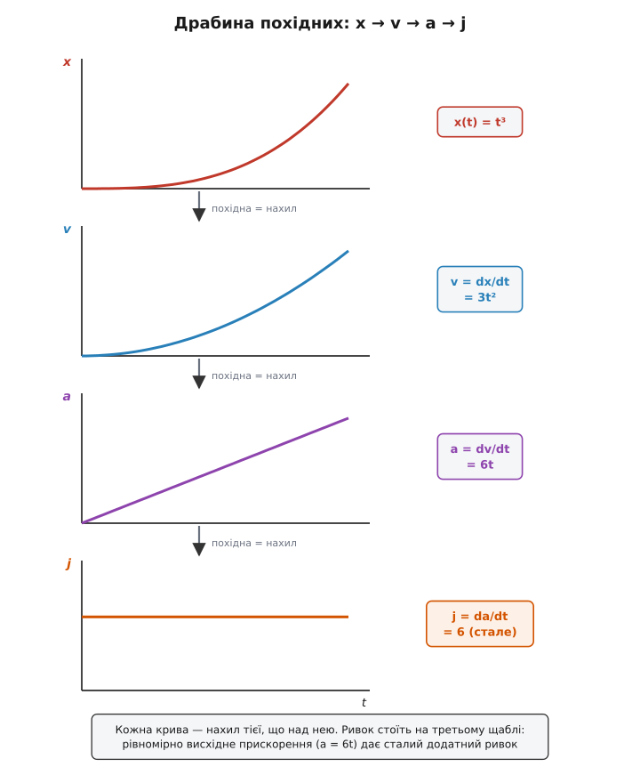
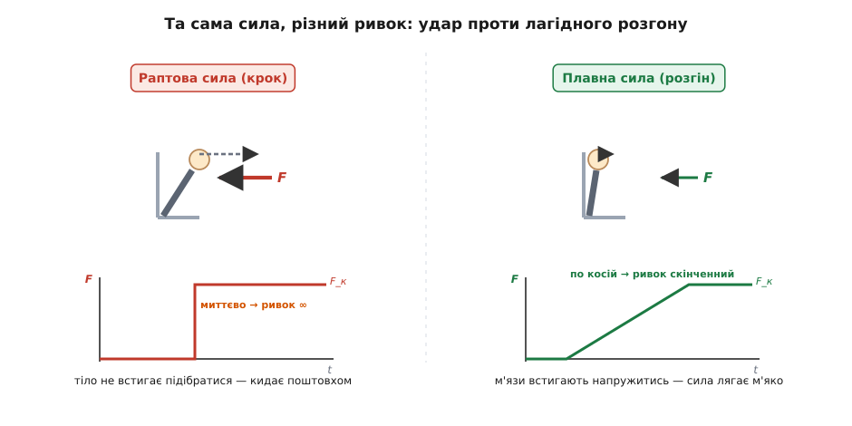
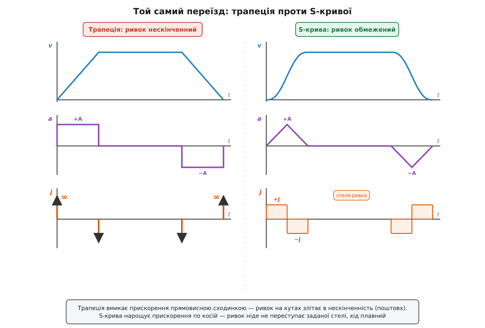

# Ривок: не прискорення, а його зміна

<preknowlist>
- [Прискорення](topic:ph-mechanics/acceleration) — темп зміни швидкості (a = Δv/Δt, м/с²); ривок означують уже як темп зміни самого прискорення.
- [Похідна](topic:math-analysis/derivative) — миттєва швидкість зміни величини; ривок — це похідна прискорення за часом.
- [Другий закон Ньютона](topic:ph-mechanics/newtons-second-law) — прискорення дає сила (a = F/m); через це ривок обертається темпом, з яким на тіло наростає сила.
</preknowlist>

Два ліфти піднімають тебе на той самий поверх. Обидва набирають однакову швидкість, обидва на розгоні тиснуть на ступні з однаковою силою — прискорення в них до цяточки те саме. Але перший рушає так плавно, що рух ти помічаєш хіба по табло з номерами поверхів, а другий смикає під колінами тієї ж миті, коли зрушує: короткий поштовх, від якого всередині все підбирається. Прискорення однакове. Різне — щось інше.

Різне тут не те, *яке* прискорення, а те, *як швидко воно з'явилося*. Плавний ліфт нарощує свій тиск на тебе поступово, за пів секунди; різкий навалює той самий тиск умить. Ось цю величину — наскільки прудко міняється саме прискорення — і звуть **ривком** (англ. *jerk* — «різкий смик, шарпок»; у Британії кажуть ще *jolt* — «поштовх»). Прискорення каже, *яка* зараз сила гне твій рух; ривок каже, *чи вдарила* вона раптом, чи підкралася лагідно.

### Похідна від похідної від похідної

Означення бери буквально — воно повторює те, як прискорення народжується зі швидкості. Візьми прискорення на початку короткого проміжку й наприкінці, відніми одне від одного — дістанеш зміну прискорення Δa. Поділи на час Δt, за який вона сталася:

```
j = Δa / Δt
```

Стягни проміжок у точку — і матимеш **миттєвий ривок**, тобто [похідну](topic:math-analysis/derivative) прискорення за часом. Складається чиста драбина. Положення міняється — швидкістю. Швидкість міняється — прискоренням. А прискорення теж міняється, і темп цієї зміни — ривок:

```
x  →  v = dx/dt  →  a = dv/dt  →  j = da/dt
```

Отже, ривок — це **третя похідна** положення за часом: наскільки швидко міняється те, що показує, наскільки швидко міняється те, що показує, наскільки швидко міняється місце. Одиниця випливає сама. Прискорення міряють у м/с², час — у секундах, тож ривок — це (м/с²) на секунду, тобто **метр за секунду в кубі**, м/с³.


*Кожна крива — нахил тієї, що над нею. Ривок стоїть на третьому щаблі: він показує, як круто піднімається чи спадає прискорення. Там, де графік прискорення злітає стрімкою сходинкою, ривок вистрілює вгору; там, де прискорення лежить рівною поличкою, ривок дорівнює нулю — хай саме прискорення й велике.*

Останнє варто затримати в голові: **стале прискорення дає нульовий ривок**. Літак у рівному віражі давить на пілота потроєною вагою, але поки перевантаження тримається незмінним, ривка немає — бо прискорення не міняється. Ривок оживає лише на *краях*: коли прискорення вмикається, вимикається чи перескакує з одного рівня на інший.

**Приклад (старт ліфта).** Ліфт плавно нарощує прискорення від нуля до a = 1.0 м/с² за Δt = 0.5 с. Який у нього ривок на старті?

```
j = Δa / Δt = (1.0 − 0) / 0.5 = 2.0 м/с³
```

Десь коло цієї межі й тримають ліфти проєктувальники. А якби та сама одиниця прискорення навалилася за 0.1 с?

```
j = 1.0 / 0.1 = 10 м/с³
```

Уп'ятеро різкіше — і саме це відчувається як окремий поштовх під ногами, хоча кінцеве прискорення — а отже, і сила, з якою давить підлога, — не змінилося ні на крихту.

### Чому поштовх відчуваєш, а рівну силу — ні

Щоб зрозуміти, чому тіло так гостро ловить ривок, погляньмо, звідки взагалі береться прискорення. Його дає сила: [другий закон Ньютона](topic:ph-mechanics/newtons-second-law) каже a = F/m. Переверни це — F = m·a — і продиференціюй за часом. Маса стала, тож

```
dF/dt = m · j
```

Ось воно: ривок (помножений на масу) — це **темп, з яким на тіло наростає сила**. І тепер видно, чому рівне прискорення терпиться легко, а ривок б'є. Коли сила приходить поволі, твої м'язи встигають напружитися їй назустріч, тканини — рівномірно перерозподілити навантаження, кров — не хлюпнути. Тіло зустрічає силу підготовленим. Коли ж та сама сила падає раптом, ніхто не встигає підібратися: вона проходить крізь тіло ударною хвилею, смикаючи одні його частини поперед інших. Боляче й незатишно не від сили — від її *раптовості*.

**Приклад (сила на пасажирі).** Пасажир масою 70 кг у тому самому ліфті. Додатковий тиск підлоги на розгоні однаковий в обох випадках — його задає прискорення, не ривок:

```
F_дод = m · a = 70 · 1.0 = 70 Н        (≈ 7 кгс, однаково в обох ліфтах)
```

А от швидкість, із якою цей тиск наростає, задає вже ривок:

```
dF/dt = m · j = 70 · 2  = 140 Н/с      (плавний ліфт: тиск набігає за 0.5 с)
dF/dt = m · j = 70 · 10 = 700 Н/с      (різкий ліфт: той самий тиск за 0.1 с)
```

Кінцевий тиск той самий; різна лише крутість, із якою він приходить. Строго кажучи, тіло чує не «прискорення крізь простір», а [питому силу](topic:ph-mechanics/specific-force) — поштовх опори на одиницю маси; ривок — це темп її зміни. Тому давач руху, орган рівноваги чи акселерометр однаково байдужі до рівного ходу й однаково збуджуються від кожного смику.


*Кінцева сила в обох випадках однакова — різниться лише те, як швидко вона приходить. Крок (ліворуч) навалює її вмить: нескінченний ривок, поштовх, тіло не встигає підібратися. Коса (праворуч) підводить ту саму силу поступово: ривок скінченний, м'язи встигають напружитись, і сила лягає без смику.*

> 🔧 **Навіщо це.** Через це розрізнення інженер, що проєктує ліфт, потяг чи американські гірки, задає в керуванні не лише стелю прискорення, а й **окрему стелю ривка**. Дотримати перше — щоб сила не була завеликою; дотримати друге — щоб вона не приходила ударом. Дві різні межі бережуть дві різні речі: величина прискорення береже від перевантаження, обмеження ривка — від поштовху, нудоти й розхлюпаної кави.

### Чому машини згладжують ривок

Найчистіше ривок вилазить там, де рух планують наперед — у ліфтах, потягах, верстатах з числовим керуванням, роботах-маніпуляторах. Найпростіший спосіб проїхати задану відстань — розігнатися зі сталим прискоренням, якусь мить котитися рівно, тоді з тим самим сталим гальмуванням спинитися. Графік швидкості виходить трапецією: коса вгору, поличка, коса вниз. Гарно на папері — та згубно на ділі.

Придивися до прискорення в такому русі. На розгоні воно стале й додатне, на розкаті — нуль, на гальмуванні — стале й від'ємне. Тобто прискорення стрибає прямовисними сходинками: з нуля на повну, з повної на нуль, з нуля вниз. А прямовисна сходинка прискорення — це **нескінченний ривок** у ту мить: сила навалюється миттєво. Саме ці стрибки й відчуваються як ривки на початку та в кінці ходу, саме вони б'ють по механізму й вантажу.

Ліки прості: не давати прискоренню скакати сходинкою, а піднімати його теж поступово — по косій. Тоді графік швидкості з ламаної трапеції стає плавною **S-подібною кривою**, у якої заокруглені всі кути, а прискорення ніде не має вертикальних зривів. За таку плавність платять дещицею часу, зате ривок скрізь лишається скінченним і не перевищує наперед заданої межі. Як саме порахувати такий згладжений профіль руху — з фазами наростання, тримання й спаду прискорення — розібрано в [окремому проєкті з робочим кодом](topic:ph-mechanics/jerk/proj-scurve-profile.md).


*Той самий переїзд двома способами. Трапеція (ліворуч) вмикає прискорення сходинкою — і ривок на кутах злітає в нескінченність: це поштовх на старті й на зупинці. S-крива (праворуч) нарощує прискорення поступово — ривок ніде не переступає заданої стелі. Хід довший на якусь частку секунди, зате без ривків.*

Цікаво, що згладжувати ривок навчилися не інженери, а сама природа. Коли ти простягаєш руку по чашку, кисть не смикається — вона рушає й спиняється м'яко, а її швидкість малює дзвоноподібний горб. Дослідники моторики Тамар Флеш і Невілл Гоґан показали 1985 року, що людський мозок веде руку так, ніби навмисне робить **сумарний ривок якнайменшим** за весь рух; із цієї єдиної вимоги плавності виходить рівно та дзвоноподібна крива швидкості, яку й бачать у дослідах. Роботам цю природну плавність тепер задають штучно — тим самим обмеженням ривка. Математику найплавнішого руху зібрано в [окремій вставці](topic:ph-mechanics/jerk/math-higher-derivatives.md).

### Удар, вібрація і втома

Чому машині так шкодить високий ривок — видно з тієї самої рівності dF/dt = m·j. Різкий старт означає, що сила наскакує на деталі майже миттєво; це **ударне навантаження**, а удар — найгірший спосіб прикласти силу. По-перше, різкий фронт сили багатий на високі частоти, і серед них неодмінно знайдеться така, що збудить власне тремтіння конструкції: гострий ривок розхитує [механічний резонанс](topic:ph-waves/mechanical-resonance), і машина ще довго дзвенить після поштовху, хоч сам поштовх давно минув. По-друге, кожен такий удар — це різкий скачок напруження в металі, а мільйони повторних скачків підточують деталь зсередини й ведуть до [втоми матеріалу](topic:ph-mechanics/material-fatigue) — тріщини, що росте від циклу до циклу, аж поки деталь не лусне за навантаження, яке поодинці витримала б залюбки. Тому портальний робот, що мусить різко стартувати й спинятися тисячі разів на зміну, проєктують з обмеженням ривка не заради комфорту (вантажу байдуже до нудоти), а щоб уберегти й корисний вантаж, і власні підшипники, паси та рами від передчасної руйнації.

### Звідки взялося слово — і що там далі за ривком

Саме ім'я «ривок» прийшло не з чистої математики, а з інженерної практики: величину, якої бракувало, щоб пояснити, від чого залежить *приємність* їзди, назвали простим побутовим словом за те, що вона робить, — смикає. Пізніше її закріпили в стандартах (ISO 2041 означує ривок як похідну прискорення за часом), а любителі математичних жартів дали власні імена й дальшим похідним: четверту (темп зміни ривка) охрестили *snap* — «клац», п'яту *crackle* — «трісь», шосту *pop* — «пук», за трьома чоловічками з коробки пластівців. Ці назви напівжартівливі, та щаблі за ними цілком справжні й подеколи потрібні. Як народжувалося поняття й звідки взялися ці кумедні імена — у [короткій розповіді](topic:ph-mechanics/jerk/hist-jerk-naming.md).

І ще один поворот, від якого ривок несподівано виростає з дрібної кінематичної деталі до цілого світу. Виявляється, найпростіші рівняння, здатні породити **хаос** — рух, назавжди непередбачуваний за всієї своєї строгої визначеності, — це саме рівняння на ривок: одне-єдине співвідношення, що пов'язує третю похідну координати з нею самою та її нижчими похідними. Простіше за третій порядок хаос у неперервній системі не заводиться. Так величина, що почалася зі смику ліфта, лежить в основі й теорії дивних атракторів — але це вже тема для [окремої статті](topic:math-analysis/jerk-equation-chaos).
