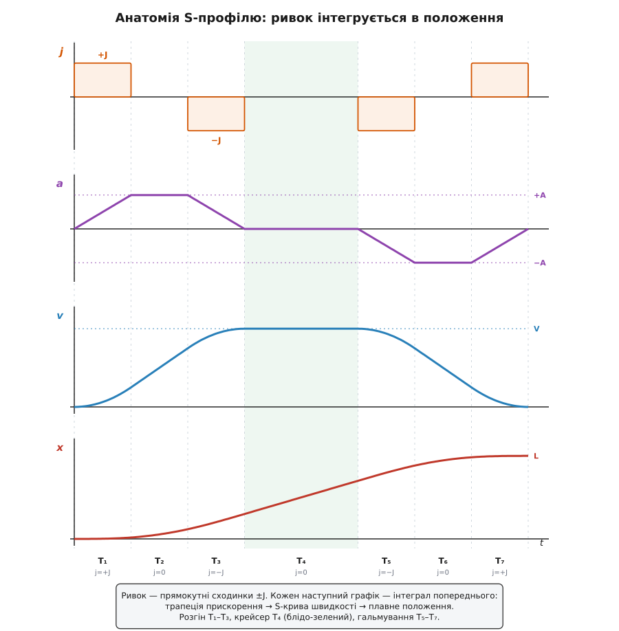
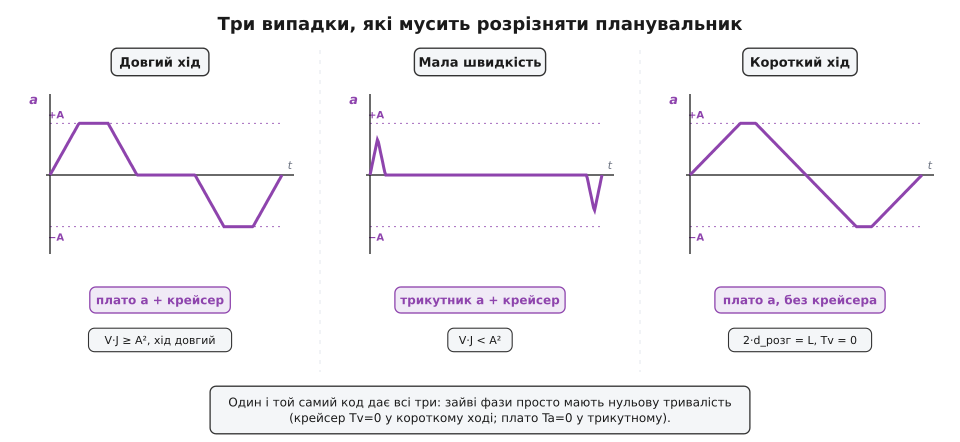

# ⚙️ Генератор S-подібного профілю руху

**Задача.** У контролері руху — верстаті з числовим керуванням, роботі-маніпуляторі, драйвері крокового двигуна — сидить цикл керування, що цокає з частотою від одного до десяти кілогерц. На кожен тик він мусить видати вісі одну команду: де їй бути зараз (положення x), як швидко туди йти (швидкість v) і з яким прискоренням (a). Нам дають відстань L, яку треба проїхати від спокою до спокою, і три стелі, яких не вільно переступати: гранична швидкість V, граничне прискорення A і — окремо — гранична **швидкість зміни прискорення**, тобто стеля ривка J. Треба написати дві функції. Перша, `plan`, один раз перед рухом рахує форму профілю. Друга, `at`, на кожен тик віддає трійку (a, v, x) — і мусить робити це за передбачуваний час, бо крутиться в перериванні реального часу, де запізнення на кілька мікросекунд зриває крок двигуна.

Наївний профіль — розігнатися зі сталим A, покотитися на V, спинитися зі сталим −A — цього не вміє: на його кутах прискорення скаче прямовисною сходинкою, а прямовисна сходинка прискорення означає нескінченний ривок у ту мить. Механізм відповідає на такий стрибок дзвоном, зношенням і розхлюпаною по столу емульсією. Тож стелю J треба дотримати нарівні зі стелями A і V — а для цього прискорення можна лише **вводити поступово**, скісно. Профіль, у якого й прискорення наростає плавно, звуть S-подібним.

**Ідея.** Найпростіший спосіб не дати прискоренню скакати — перемикати не саме прискорення, а ривок, і то лише між трьома рівнями: +J (прискорення росте), 0 (тримається) і −J (спадає). Виходить рівно **сім фаз**, які й дали профілю друге ім'я — «подвійна S» (англ. *double-S*), бо крива швидкості малює S на розгоні й дзеркальну S на гальмуванні:

```
фаза:   T₁    T₂    T₃    T₄     T₅    T₆    T₇
ривок:  +J    0     −J    0      −J    0     +J
         └─ розгін ─┘  крейсер  └─ гальмування ─┘
```

На T₁ ривок додатний — прискорення лінійно росте від нуля до якогось піка. На T₂ ривок вимкнено — прискорення тримається на піку, швидкість набігає найшвидше. На T₃ ривок від'ємний — прискорення спадає назад до нуля рівно тоді, коли швидкість дістає крейсерської. T₄ — вільний хід зі сталою швидкістю. Далі все дзеркально: T₅, T₆, T₇ гасять швидкість такою самою трійкою, лишень тепер прискорення від'ємне. Уся крива — це один прямокутник ривка, [проінтегрований](root:math-analysis/integral) тричі: ривок дає прискорення, прискорення дає швидкість, швидкість дає положення.


*Ривок — прямокутні сходинки ±J; кожен наступний графік є його інтегралом. Прямокутники ривка інтегруються у трапецію прискорення, трапеція — в S-криву швидкості, S-крива — у плавне положення. Гострих кутів нема ніде, окрім самого ривка, а він скрізь скінченний і не переступає ±J.*

> 🔧 **Навіщо це.** Обмеживши ривок, ти купуєш дві речі одразу. Перша — цілість машини й вантажу: сила на деталі наростає скісно, а не ударом, тож нема ні збудженого резонансу, ні мікротріщин від повторних поштовхів. Друга, менш очевидна, — **швидкодія**. Коли ривок нічим не тримати, доводиться занижувати саме прискорення A, щоб поштовхи на кутах не рвали механізм; а з окремою стелею ривка можна сміливо піднімати A аж під фізичну межу двигуна, бо кути тепер згладжені. Тому машина з обмеженням ривка нерідко проходить той самий шлях **швидше**, а не повільніше, ніж машина з грубим трапецієподібним профілем.

## Скільки триває кожна фаза

Уся робота `plan` — знайти сім тривалостей. За симетрії (спокій→спокій, однакові стелі на розгін і гальмування) незалежних тільки три: **Tj** — тривалість фази наростання ривком, **Ta** — тривалість утримання прискорення на піку, **Tv** — тривалість крейсера. Решта повторюють їх дзеркально: профіль тривалостей — це (Tj, Ta, Tj, Tv, Tj, Ta, Tj).

Спершу з'ясуймо, чи прискорення взагалі встигає дорости до своєї стелі A. За фазу T₁ ривок +J піднімає прискорення від 0 до J·Tj. Щоб воно точно вперлося в A, треба Tj = A/J. Але дорости до A встигне лише тоді, коли крейсерська швидкість V достатньо велика: сама лише симетрична пара фаз наростання й спаду прискорення (T₁ і T₃) набирає швидкість J·Tj² = A²/J навіть без жодного утримання посередині. Якщо цього вже більше за V, то плато прискорення (T₂) просто нема куди втиснути — прискорення не встигає доповзти до A, бо швидкість вичерпано раніше. Звідси проста розвилка:

```
якщо  V·J ≥ A²   →  плато є:      Tj = A/J,        Ta = V/A − A/J   (≥ 0)
інакше           →  трикутник a:  Tj = √(V/J),     Ta = 0
```

У другому випадку прискорення малює не трапецію, а трикутник із піком √(V·J), меншим за A: стеля прискорення так і лишається недосяжною, бо швидкість надто мала, щоб її вичерпати.

Тепер відстань. Здавалося б, тут чекає незугарний потрійний інтеграл кубічної кривої. Але є коротший шлях, і він тримається на одній симетрії. Профіль прискорення на розгоні (наростання, плато, спад) **симетричний відносно своєї середини** — ліва половина дзеркалить праву. А коли прискорення симетричне відносно середини, його інтеграл — швидкість — виходить **точково-симетричним** відносно тієї ж середини: скільки крива швидкості недобрала ліворуч від центру, стільки ж перебрала праворуч. Отже, середня швидкість за весь розгін дорівнює рівно половині пікової, і відстань — це просто середня швидкість на час:

```
d_розг = v_пік · T_розг / 2,     де T_розг = 2·Tj + Ta
```

Жодного інтегрування. Розгін і гальмування дзеркальні, тож обидва долають однакову відстань d_розг. Що лишилося на крейсер — те й ділимо на швидкість, і маємо його тривалість:

```
d_крейс = L − 2·d_розг
Tv       = d_крейс / v_пік
```

Якщо d_крейс виходить від'ємним — це сигнал, що хід **закороткий**, аби встигнути розігнатися до V і ще й покотитися. Крейсера тоді нема (Tv = 0), а пікову швидкість доводиться урізати так, щоб два розгінно-гальмівні сегменти впритул склали весь L. Тут знову дві можливості. Якщо навіть з урізаним піком прискорення ще дістає стелі A, шукаємо пік із квадратного рівняння; якщо ні — прискорення стає чистим трикутником, і пік дається кубічним коренем:

```
пробуємо «плато лишилося»:   v_пік² + (A²/J)·v_пік − A·L = 0
                              v_пік = (−A²/J + √((A²/J)² + 4·A·L)) / 2
якщо v_пік < A²/J  →  «трикутник»:  v_пік = ∛(L²·J / 4)
```

Ось увесь планувальник. Зверни увагу, як усі виродження зводяться до однієї думки: **зайва фаза просто дістає нульову тривалість**. Нема крейсера — Tv = 0. Нема плато прискорення — Ta = 0. Не треба ніяких окремих гілок у семплері: він однаково пройде фазу завдовжки нуль секунд, нічого до неї не додавши.

```cpp
#include <math.h>
#include <stdio.h>

// Стелі руху та повністю спланований профіль.
typedef struct {
    double j[7];                 // ривок у кожній із 7 фаз: +J,0,−J,0,−J,0,+J
    double t[8];                 // t[k] — момент КІНЦЯ фази k (t[0]=0)
    double a0[7], v0[7], x0[7];  // стан (a,v,x) на ПОЧАТКУ кожної фази
    double total;                // повна тривалість руху, с
    double reach;                // фактично досягнута пікова швидкість, м/с
} SCurve;

// Спланувати симетричний профіль спокій→спокій на відстань dist за стелями V,A,J.
// Заповнює *s. Повертає 1, якщо крейсерську V досягнуто, інакше 0 (хід закороткий).
int scurve_plan(SCurve *s, double dist, double V, double A, double J) {
    double Tj, Ta, Tv, vpk;
    int reached = 1;

    // (1) Чи встигає прискорення дорости до стелі A на шляху до крейсерської V?
    if (V * J >= A * A) {          // A²/J ≤ V — є плато прискорення
        Tj  = A / J;               // час наростання ривком від 0 до A
        Ta  = V / A - A / J;       // час утримання a = A (≥ 0)
        vpk = V;
    } else {                       // трикутне прискорення: пік < A
        Tj  = sqrt(V / J);
        Ta  = 0.0;
        vpk = V;
    }

    // (2) Відстань ОДНОГО розгінного сегмента. Профіль a(t) на розгоні симетричний
    //     відносно середини, тож крива v(t) точково-симетрична — її середнє рівно
    //     vpk/2, а отже d_розг = vpk·T_розг/2, де T_розг = 2·Tj + Ta.
    double d_acc    = vpk * (2.0 * Tj + Ta) / 2.0;
    double d_cruise = dist - 2.0 * d_acc;

    if (d_cruise >= 0.0) {
        Tv = d_cruise / vpk;       // крейсер триває, поки добираємо решту шляху
    } else {
        // (3) КОРОТКИЙ ХІД: до V не встигаємо. Крейсера нема (Tv=0), урізаємо пік.
        reached = 0;
        Tv = 0.0;
        double p = A * A / J;
        // Спроба A: прискорення все ще дістає A ⇒ vpk² + (A²/J)·vpk − A·dist = 0.
        vpk = (-p + sqrt(p * p + 4.0 * A * dist)) / 2.0;
        if (vpk >= p) {
            Tj = A / J;
            Ta = vpk / A - A / J;
        } else {
            // Спроба B: навіть без плато прискорення не дістає A — чистий трикутник:
            //   dist = 2·vpk^{3/2}/√J  ⇒  vpk = ∛(dist²·J / 4).
            vpk = cbrt(dist * dist * J / 4.0);
            Tj  = sqrt(vpk / J);
            Ta  = 0.0;
        }
    }

    // (4) Розкласти у таблицю 7 фаз і проінтегрувати сталим ривком крізь межі.
    const double dur[7] = { Tj, Ta, Tj, Tv, Tj, Ta, Tj };
    const double js[7]  = { +J, 0.0, -J, 0.0, -J, 0.0, +J };
    double a = 0.0, v = 0.0, x = 0.0;
    s->t[0] = 0.0;
    for (int k = 0; k < 7; k++) {
        double T = dur[k], jk = js[k];
        s->j[k]  = jk;
        s->a0[k] = a;  s->v0[k] = v;  s->x0[k] = x;   // стан на початку фази k
        // замкнені формули сталого ривка — точний стан у кінці фази:
        x += v * T + 0.5 * a * T * T + jk * T * T * T / 6.0;
        v += a * T + 0.5 * jk * T * T;
        a += jk * T;
        s->t[k + 1] = s->t[k] + T;
    }
    s->total = s->t[7];
    s->reach = vpk;
    return reached;
}
```

Порядок трьох рядків усередині циклу не випадковий: спершу оновлюємо x (йому потрібні *старі* v і a), тоді v (потрібне старе a), і аж тоді саме a. Переставиш — і кожна фаза почне свій розрахунок зі стану наступної, а профіль розповзеться.

## Семплювання: від фази до трійки (a, v, x)

Планувальник лишив нам таблицю: для кожної з семи фаз — її ривок, момент початку й стан (a₀, v₀, x₀) на цьому початку. Тепер `at` на будь-який момент t знаходить активну фазу, бере від її початку відлік τ і застосовує ті самі замкнені формули сталого ривка — але вже не до кінця фази, а до точки τ усередині неї:

```
a(τ) = a₀ + j·τ
v(τ) = v₀ + a₀·τ + ½·j·τ²
x(τ) = x₀ + v₀·τ + ½·a₀·τ² + ⅙·j·τ³
```

Головне тут — що стан рахується **від початку фази**, а не накопичується від тику до тику. Це і є те, чому семплер точний і не пливе: скільки б тиків не минуло, x у момент t завжди відновлюється з фіксованого x₀ плюс кубічний доданок, без жодного нагромадження похибки.

```cpp
// Стан (прискорення, швидкість, положення) у момент t, 0 ≤ t ≤ total.
void scurve_at(const SCurve *s, double t, double *a, double *v, double *x) {
    if (t < 0.0)         t = 0.0;
    if (t > s->total)    t = s->total;         // після кінця — стоїмо на місці

    int k = 0;
    while (k < 6 && t >= s->t[k + 1]) k++;      // знайти активну фазу (щонайбільше 6 порівнянь)

    double tau = t - s->t[k], jk = s->j[k];
    double a0 = s->a0[k], v0 = s->v0[k], x0 = s->x0[k];
    *a = a0 + jk * tau;
    *v = v0 + a0 * tau + 0.5 * jk * tau * tau;
    *x = x0 + v0 * tau + 0.5 * a0 * tau * tau + jk * tau * tau * tau / 6.0;
}

int main(void) {
    SCurve s;
    int ok = scurve_plan(&s, 10.0, 2.0, 1.0, 1.0);   // dist=10 м, V=2, A=1, J=1
    printf("крейсер: %s   T=%.3f с   v_пік=%.3f м/с\n",
           ok ? "досягнуто" : "УРІЗАНО", s.total, s.reach);

    // самоперевірка: кінцеве положення мусить точно збігтися із замовленим ходом
    double a, v, x;
    scurve_at(&s, s.total, &a, &v, &x);
    printf("кінець: x=%.6f  v=%.6f  a=%.6f\n", x, v, a);

    for (double t = 0.0; t <= s.total + 1e-9; t += 1.0) {   // друк раз на секунду
        scurve_at(&s, t, &a, &v, &x);
        printf("t=%.1f  a=%+.3f  v=%.3f  x=%.4f\n", t, a, v, x);
    }
    return 0;
}
```

Для замовлення L=10, V=2, A=1, J=1 планувальник дає Tj=1, Ta=1, Tv=2, тобто тривалості (1, 1, 1, 2, 1, 1, 1) і повний час 8 с. Ось стан на кожній межі фаз — саме ці точки й малює графік вище:

```
крейсер: досягнуто   T=8.000 с   v_пік=2.000 м/с
кінець: x=10.000000  v=0.000000  a=0.000000     ← самоперевірка збіглася

  t     a        v       x       фаза
 0.0  +0.000   0.000   0.0000    ┐ T₁  ривок +J
 1.0  +1.000   0.500   0.1667    ┘     a дійшло до +A
 2.0  +1.000   1.500   1.1667    · T₂  плато a
 3.0  +0.000   2.000   3.0000    · T₃  a спало до 0, v = V
 5.0  +0.000   2.000   7.0000    · T₄  крейсер, x росте лінійно
 6.0  −1.000   1.500   8.8333    · T₅  ривок −J
 7.0  −1.000   0.500   9.8333    · T₆  плато −a
 8.0  +0.000   0.000  10.0000    ┘ T₇  спокій, точно на L
```

Прискорення ніде не перевищило ±1, швидкість — 2, а кінцеве x сіло рівно на 10.000000: рух завершився в точці замовлення, зі швидкістю й прискоренням, поверненими до нуля. Це і є найдешевша страховка — після `plan` варто перевіряти, що `at(total)` дає x ≈ L з точністю до похибки float; розбіжність одразу викаже помилку у виведенні тривалостей.

## Складність і пастки

Обчислювальна вартість тут смішна, і це принципово. `plan` — це жменя арифметики, один корінь, зрідка кубічний корінь: строго O(1), кілька десятків операцій із рухомою комою, без жодного циклу, що залежав би від даних. `at` — щонайбільше шість порівнянь, щоб намацати фазу, і один кубічний многочлен: теж O(1) з жорсткою верхньою межею. Ні виділення пам'яті, ні рекурсії, ні циклу з непередбачуваною довжиною. Саме тому це C, а не мова з прибиральником сміття: код мусить відпрацьовувати за сталий, наперед відомий час просто в перериванні генератора кроків, де на весь тик відпущено кількасот тактів. Тепер — куди така реалізація зривається, якщо писати її наспіх.


*Три форми прискорення, які планувальник мусить розрізняти. Ліворуч — довгий хід: плато прискорення є, посередині крейсер. Всередині — мала крейсерська швидкість: прискорення так і не дістає A (трикутник), але крейсер ще є. Праворуч — короткий хід: плато є, а крейсера вже нема, розгін впритул переходить у гальмування. Всі три дає один код: зайві фази просто мають нульову тривалість.*

**Пастка перша: короткий хід, що не встигає на крейсер.** Найпоширеніша помилка — сліпо порахувати Tv = (L − 2·d_розг)/v_пік і покласти профіль. Для короткого L цей вираз виходить **від'ємним**, а фаза з від'ємною тривалістю — це нісенітниця: семплер проскочить її «назад у часі», і крива зламається. Тому d_крейс < 0 треба ловити окремо й перепланувати з урізаним піком, як у гілці (3). Числом: замов L=10 за V=2, A=1, J=1 — вийде повний профіль із крейсером, а замов L=0.05 тими самими стелями — і v_пік урізується аж до 0.086 м/с, увесь рух триває 1.17 с, а прискорення й близько не підходить до своєї стелі.

**Пастка друга: трикутне проти трапецієподібного прискорення.** Навіть довгий хід може не дати прискоренню дорости до A — якщо мала сама крейсерська швидкість. Поріг простий: V* = A²/J. Просиш крейсер нижчий за V* — і плато прискорення нема куди вставити, бо швидкість вичерпується раніше, ніж прискорення доповзе до стелі. Небезпека в тому, що якщо жорстко зашити Tj = A/J і Ta = V/A − A/J, то для малого V друга формула дає Ta **від'ємне** (для V=0.5, A=1, J=1 виходить Ta = 0.5 − 1 = −0.5). Це той самий клас лиха, що й перша пастка: тривалість фази поривається стати від'ємною. І ліки ті самі — розпізнати випадок наперед (умовою V·J ≥ A²) і схлопнути винну фазу в нуль. Помічай узагальнення: **кожне виродження профілю проявляється як фаза, що хоче від'ємну тривалість**; правильний планувальник передбачає всі такі місця й обнуляє винуватця, а не чекає, поки семплер захлинеться.

**Пастка третя: асиметричні межі.** Реальні верстати рідко симетричні. Вертикальна вісь під дією земного тяжіння гальмує легше, ніж розганяється, тож стеля прискорення вниз і вгору різна. А в режимі перегляду наперед (коли контролер зшиває низку відрізків, не спиняючись на стиках) рух починається й закінчується не в спокої, а на якійсь ненульовій швидкості. Тоді профіль перестає бути дзеркальним: розгін T₁–T₃ веде швидкість від v_поч до піка своїми J та A, гальмування T₅–T₇ — від піка до v_кін іншими J та A, і d_розг ≠ d_гальм. Кістяк із семи фаз лишається той самий, але тривалості кожної половини рахуються нарізно, а урізання піка в короткому ході стає рівнянням d_розг(v) + d_гальм(v) = L, яке інколи доводиться дорозв'язувати парою кроків [чисельно](root:math-numeric/numerical-integration) замість готової формули. Головне — таблиця фаз, семплер і сама ідея не міняються ні на йоту; ускладнюється лише арифметика тривалостей.

**Пастка четверта: спокуса чисельного інтегрування.** Може здатися, що вся ця машинерія із замкненими формулами — зайва, і досить щотику робити a += j·dt; v += a·dt; x += v·dt. Це метод Ейлера, і він **пливе**. Похибка накопичується щокроку, тож за кілька тисяч тиків вісь недобирає чи перебирає хід, швидкість не повертається точно в нуль (лишається повзучий залишок), а кінцеве положення розходиться з L. Замкнена формула на фазу вільна від цього коренево: поки ривок сталий, кубічний многочлен — це **точний** інтеграл, байдуже до величини dt, а стан, відновлюваний від початку фази, не має де накопичувати дрейф навіть за довгий крейсер. Ось чому справжні контролери зберігають межі фаз і рахують від них, а не котять суму від тику до тику.

**Пастка п'ята: робастність на краях.** Замовлення L=0 (нема руху) має віддати самі нулі — перевір, що корені й ділення цього не зламають. Дрібний від'ємний доданок під коренем від похибки float (коли L майже точно на межі випадку) варто підрізати до нуля, перш ніж брати √. І навпаки, велике J робить Tj мізерним — це нормально, фаза просто коротка. Уся ця делікатність не коштує майже нічого саме тому, що логіка O(1) і вкладається в один тик; складнішого планувальника в перериванні реального часу не потягнеш.

Цей семифазний профіль — не саморобка, а класика керування рухом: у літературі його розбирають під іменем «double-S trajectory» (докладний виклад — у Biagiotti та Melchiorri, *Trajectory Planning for Automatic Machines and Robots*, Springer, 2008). Класичний GRBL для верстатів досі кладе прості трапеції; Marlin згодом додав окремий режим `S_CURVE_ACCELERATION` — споріднений згладжувач, тільки на многочлені п'ятого степеня замість прямокутного ривка; а промислові контролери верстатів і роботів рахують саме таку сталоривкову форму. За всієї поважності назви вся суть уміщається в одне речення: візьми прямокутник ривка, проінтегруй його тричі — і ніколи не дай жодній фазі стати від'ємною.
