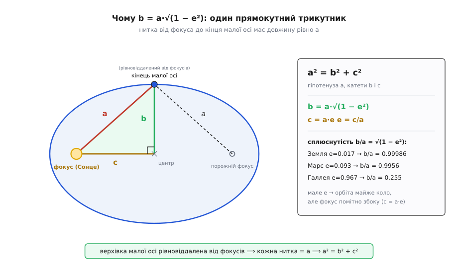
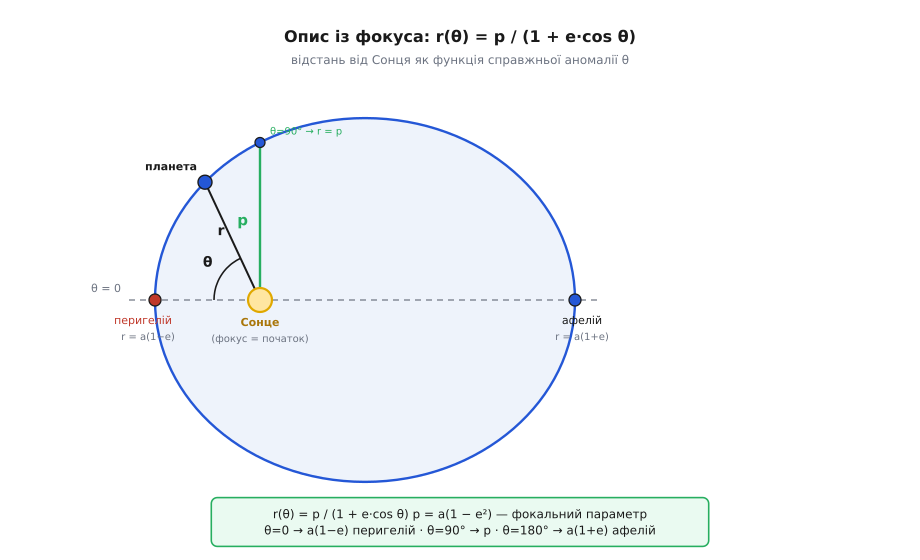
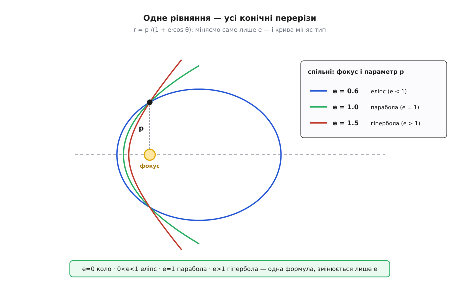

# 🧮 Геометрія орбітального еліпса: a, b, c, e і фокальне рівняння r(θ)

Орбіта — еліпс, і Сонце сидить в одному з його фокусів. Це форма. Але формою нічого не порахуєш — ні де буде планета, ні як далеко вона від Сонця в кожну мить; для цього форму треба перевести в числа. Виявляється, весь еліпс тримається на **чотирьох числах**, туго зв'язаних одним прямокутним трикутником, і на одному глибшому описі — не з центра еліпса, а **з фокуса**, де стоїть Сонце. Саме той, фокальний, опис фізика й видає на руки. Виростимо все це з єдиної властивості, якою еліпс узагалі означений.

## Одна властивість: натягнута нитка

Устромімо в дошку дві шпильки, накиньмо на них петлю нитки й натягнім її олівцем. Ведучи олівцем так, щоб нитка лишалася натягнутою, дістанемо замкнену криву — **еліпс**. Дві шпильки — **фокуси** (лат. *focus* — «вогнище, кострище»; Кеплер узяв це слово з оптики, де фокус — точка, у якій дзеркало збирає промені й підпалює трут). Уся крива підкоряється одному-єдиному правилу: **сума відстаней від будь-якої її точки до двох фокусів стала**. Ця сума — довжина натягнутої нитки; позначмо її `2a`.

Оце «`r₁ + r₂ = 2a` для кожної точки» — не одна з властивостей еліпса, а **його означення**. З нього випливе все інше, тож тримаймо його в руках і не відпускаймо.

Одразу назвемо, що бачимо. Найдовший поперечник еліпса — **велика вісь**; її половина — `a`, **велика піввісь**. Точку посередині між фокусами звемо **центром**. Фокуси лежать симетрично обабіч центра, кожен на відстані `c` від нього, тож відстань між ними — `2c`. І одне число, що каже, наскільки еліпс витягнутий, — **ексцентриситет** (лат. *ex-* «поза» + *centrum* «центр») `e = c/a`: частка, яку зсув фокуса становить від великої півосі.

## Чотири числа й один трикутник

Ми маємо `a`, `c` та `e = c/a` — і ще не з'явилася `b`, **мала піввісь** (половина короткого поперечника). Звідки вона береться й чому зв'язана з рештою? Тут ховається найгарніший крок усієї геометрії еліпса.

Погляньмо на точку на **кінці малої осі** — верхівку еліпса просто над центром. Вона рівновіддалена від обох фокусів (симетрія лівого й правого боку), тож `r₁ = r₂`. Але сума їх — завжди `2a`, отже кожна з цих двох відстаней дорівнює рівно `a`. Ось воно: **нитка від фокуса до кінця малої осі має довжину точно `a`**.

Тепер маленький трикутник: центр — фокус — кінець малої осі. Його катети — `c` (від центра до фокуса) і `b` (від центра до верхівки малої осі), і вони перпендикулярні. А гіпотенуза — та сама нитка від фокуса до верхівки, довжиною `a`. Прямокутний трикутник із гіпотенузою `a` й катетами `b` та `c` дає теорему Піфагора:

```
a² = b² + c²
```

Оце — головне співвідношення всього еліпса; решта формул просто випливають із нього. Підставмо `c = a·e`:

```
b² = a² − c² = a² − a²·e² = a²·(1 − e²)
```
```
b = a·√(1 − e²)        c = a·e        e = c/a = √(1 − (b/a)²)
```


*Звідки береться `b`. Кінець малої осі рівновіддалений від обох фокусів, а що сума відстаней завжди `2a`, кожна нитка до нього дорівнює рівно `a`. Разом із катетами `b` (до центра вгору) і `c` (до фокуса вбік) ця нитка складає прямокутний трикутник — і `a² = b² + c²` дає весь зв'язок півосей із витягнутістю.*

Три числа — `a`, `b`, `c` — сидять на одному трикутнику, а `e` лише перейменовує `c` у частку від `a`. Задайте будь-які два — і решта визначені.

І тут ховається несподіванка, що ламає шкільну картинку «планети літають витягнутими овалами». Розкладімо `b/a` для малого `e`:

```
b/a = √(1 − e²) ≈ 1 − e²/2      (для малих e)
```

Мала піввісь коротша за велику лише на `e²/2` — **другого порядку** за `e`. А зсув фокуса від центра `c = a·e` — **першого порядку**. Для крихітного `e` квадрат `e²` мізерний проти самого `e`, тож еліпс майже незбагненно «недосплюснутий», зате Сонце помітно збоку.

**Приклад (розміри земної орбіти).** Земля: `a = 1.000` а.о. (астрономічна одиниця — середня відстань Земля–Сонце, ≈ 149.6 млн км), `e = 0.0167`.

```
c = a·e         = 0.0167 а.о. ≈ 2.5 млн км      (зсув Сонця від центра)
b = a·√(1−e²)   = √(1 − 0.000279) = 0.99986 а.о.
a − b ≈ a·e²/2  = 0.000139 а.о. ≈ 21 тис. км    (наскільки орбіта «вужча» за коло)
```

Сонце зсунуте від центра на 2.5 мільйона кілометрів, а сама орбіта «схудла» проти кола радіуса `a` лише на 21 тисячу — зсув майже в **сто двадцять разів** більший за сплюснутість. Ось чому переворот був не в «овалі» (його на око немає), а в тому, що Сонце **не в центрі**.

Для комети все навпаки. Комета Галлея має `e = 0.967`, і тоді `b/a = √(1 − 0.935) ≈ 0.255` — мала піввісь у чотири рази коротша за велику, справжня довга голка. Той самий трикутник, тільки `e` близьке до одиниці, і `c` майже дожене `a`.

## Кінці великої осі: перигелій і афелій

Сонце — в одному фокусі. Дві найпримітніші точки орбіти лежать на великій осі: найближча до Сонця й найдальша. Їхні відстані дістаємо миттєво. Фокус відстоїть від центра на `c`, а вершини великої осі — на `a` по обидва боки центра. Тож від фокуса до ближчої вершини `a − c`, а до дальшої `a + c`:

```
перигелій (найближче):   r_min = a − c = a·(1 − e)
афелій   (найдальше):    r_max = a + c = a·(1 + e)
```

(перигелій, афелій — гр. *perí* «біля», *apó* «від», *hḗlios* «Сонце».) Складімо й відніміть ці дві відстані — вийде дещо корисне:

```
r_max + r_min = 2a           (сума дає велику вісь)
r_max − r_min = 2c = 2a·e    (різниця дає подвійний зсув фокуса)
```

А тепер прочитаймо це навпаки. У небі ніхто не бачить ні `a`, ні `e` прямо — видно лише, як близько планета підходить і як далеко відходить. Із цих двох спостережних чисел обидва параметри витягуються одразу:

```
a = (r_max + r_min) / 2
e = (r_max − r_min) / (r_max + r_min)
```

Ексцентриситет — це просто «контраст» між дальнім і ближнім, поділений на їхню суму. Нуль (`r_max = r_min`) — коло; що більший розрив, то витягнутіший еліпс. Формула не потребує знати заздалегідь ні `a`, ні центра еліпса — лише дві крайні відстані.

**Приклад (орбіта Марса з двох відстаней).** Спостереження дають перигелій `r_min = 1.3814` а.о. й афелій `r_max = 1.6660` а.о. Більше нічого не треба:

```
a = (1.6660 + 1.3814) / 2                = 1.5237 а.о.
e = (1.6660 − 1.3814) / (1.6660 + 1.3814) = 0.2846 / 3.0474 ≈ 0.0934
```

Дві виміряні відстані — і повна орбіта Марса в руках: розмір `a` й витягнутість `e`.

## Опис із фокуса, а не з центра

Якщо поставити центр еліпса в початок координат, крива задається симетричним рівнянням `x²/a² + y²/b² = 1`. Гарно, та фізично **порожньо**: у центрі еліпса не сидить нічого. Сонце — у **фокусі**, тяжіння напрямлене до фокуса, планета «знає» лише відстань до фокуса й напрямок на нього. Природний опис орбіти — це відстань від **фокуса** як функція кута, а не пари `x, y` від центра.

Заведімо такий опис. Початок — у фокусі, де Сонце. Кут `θ` відлічуймо від напрямку на перигелій (найближчу точку); цей кут в астрономії звуть **справжньою аномалією** (гр. *anōmalía* — «нерівномірність»: планета проходить кути нерівномірно, і саме цей кут — «неправильність» руху). Шукаємо `r(θ)` — відстань від Сонця до планети під кутом `θ`.

Уся потрібна геометрія — те саме означення `r₁ + r₂ = 2a` плюс теорема косинусів. Нехай `r = r₁` — відстань від нашого фокуса (Сонця) до точки, а `r₂` — до другого, порожнього фокуса; тоді `r₂ = 2a − r`. Другий фокус лежить на відстані `2c` від Сонця, у бік, протилежний перигелію, тобто під кутом `180°` до відліку `θ`. Тому кут при Сонці між напрямком на планету й напрямком на другий фокус — `(180° − θ)`. Теорема косинусів для сторони `r₂` у трикутнику «Сонце — планета — порожній фокус»:

```
r₂² = r² + (2c)² − 2·r·(2c)·cos(180° − θ)
```

Оскільки `cos(180° − θ) = −cos θ`, середній мінус стає плюсом:

```
r₂² = r² + 4c² + 4·r·c·cos θ
```

Підставмо `r₂ = 2a − r` і розкриймо квадрат:

```
(2a − r)²        = r² + 4c² + 4·r·c·cos θ
4a² − 4a·r + r²  = r² + 4c² + 4·r·c·cos θ
4a² − 4a·r       = 4c² + 4·r·c·cos θ          | ділимо на 4
a² − a·r         = c² + r·c·cos θ
a² − c²          = a·r + r·c·cos θ = r·(a + c·cos θ)
```

Звідси `r`, і лишається поділити чисельник та знаменник на `a` (пам'ятаючи `c/a = e` й `(a² − c²)/a = a(1 − e²)`):

```
        a² − c²          a·(1 − e²)
r(θ) = ─────────── = ─────────────────
       a + c·cos θ      1 + e·cos θ
```

Ось воно — **полярне рівняння орбіти з фокуса**:

```
        a·(1 − e²)
r(θ) = ────────────
       1 + e·cos θ
```

Перевірмо на кінцях осі. При `θ = 0` (перигелій) `cos θ = 1`: `r = a(1−e²)/(1+e) = a(1−e)` — рівно `r_min`. При `θ = 180°` (афелій) `cos θ = −1`: `r = a(1−e²)/(1−e) = a(1+e)` — рівно `r_max`. Рівняння сходиться з тим, що ми вже знали про кінці осі, а тепер укриває **всі** проміжні кути — повну орбіту однією формулою.


*Фокальний опис. Початок координат — у Сонці (фокусі), а не в центрі еліпса. Кут `θ` міряють від перигелію; `r(θ)` — відстань до планети під цим кутом. Прямо вгору з фокуса (`θ = 90°`) радіус дорівнює фокальному параметру `p` — піврозхилу орбіти біля Сонця.*

## Фокальний параметр p

У чисельнику стоїть комбінація `a(1 − e²)`, що не залежить від кута. Дамо їй ім'я — **фокальний параметр** `p` (він же семілатус-ректум):

```
p = a·(1 − e²)
```

і рівняння орбіти згортається до найчистішого вигляду:

```
        p
r(θ) = ─────────
       1 + e·cos θ
```

Що таке `p` наочно? Візьмімо `θ = 90°`: `cos θ = 0`, і `r = p`. Тобто `p` — це відстань від фокуса до кривої, відміряна **впоперек** великої осі, прямо вгору з фокуса; половина хорди, що проходить крізь фокус перпендикулярно осі. Латиною ця повна хорда — *latus rectum* (*latus* «бік» + *rectum* «пряме», тобто «пряма сторона»), а її половина, наша `p`, — семілатус-ректум, або фокальний параметр. Через півосі його можна записати ще й так (підставивши `b² = a²(1 − e²)`):

```
p = a·(1 − e²) = b²/a
```

Тепер найважливіше про сенс. У фокальному описі орбіту повністю задають **два** числа — `p` і `e`, і кожне відповідає за своє. `p` — це **масштаб**: розтягніть `p`, і вся орбіта пропорційно збільшиться, форма та сама. `e` — це **форма**: він каже, наскільки крива відхиляється від кола, а розміру не чіпає. Розподіл обов'язків чистий: `p` — розмір, `e` — витягнутість.

І це не просто зручний поділ. У русі під тяжінням ці два геометричні числа виявляються двома **фізичними сталими** орбіти: `p` несе [момент імпульсу](root:ph-mechanics/angular-momentum) (`p = L²/(G·M·m²)` — залежить лише від того, як швидко замітається площа), а `e` — повну енергію (мішанину кінетичної й потенційної). Форма орбіти — прямий підпис двох законів збереження; звідки саме береться таке рівняння з обернено-квадратної сили, розписано в [орбітах із 1/r²](root:ph-mechanics/newton-gravitation/math-orbits-kepler.md).

**Приклад (Галлея — голка з широким «горлом»).** Комета Галлея: `a = 17.83` а.о., `e = 0.967`.

```
r_min = a·(1 − e)   = 17.83·0.033  ≈ 0.588 а.о.   (ближче за Венеру)
r_max = a·(1 + e)   = 17.83·1.967  ≈ 35.1 а.о.    (аж за Нептун)
b     = a·√(1−e²)   = 17.83·0.2548 ≈ 4.54 а.о.
p     = a·(1 − e²)  = 17.83·0.0649 ≈ 1.16 а.о.
```

Комета сягає 35 а.о. углиб — а фокальний параметр `p`, її піврозхил біля Сонця, лише 1.16 а.о. Орбіта — довжелезна голка, що біля Сонця має тонке «горло» завширшки з земну орбіту, а тоді витягується на десятки астрономічних одиниць. Ті самі чотири числа, той самий трикутник — лише `e` майже дотиснуте до одиниці.

## Одне рівняння — усі конічні перерізи

Придивімося до знаменника `1 + e·cos θ`. Поки `e < 1`, він **ніколи не обертається на нуль**: добуток `e·cos θ` не менший за `−e`, а `−e > −1`, тож `r` скінченне на всіх кутах — і крива замикається, це еліпс. Але щойно `e = 1`, знаменник торкається нуля при `θ = 180°`: `r → ∞`, крива **не замикається**, а йде в нескінченність — це **парабола**. А при `e > 1` знаменник занулюється ще раніше, при `cos θ = −1/e`, і за цим кутом `r` уже від'ємне (безглузде) — крива розкривається **гіперболою** з двома променями-асимптотами.

```
e = 0        коло         (фокуси злилися в центр)
0 < e < 1    еліпс        (замкнена, зв'язана орбіта)
e = 1        парабола     (розімкнена, поріг утечі)
e > 1        гіпербола    (розімкнена, тіло тікає назавжди)
```

Одна формула `r = p/(1 + e·cos θ)` — і, крутячи саме лише `e`, вона малює **всі** конічні перерізи: криві, що виходять при перетині конуса площиною під різними нахилами. Тому вони й «конічні» — усі мають фокус, усі підкоряються тому самому фокальному опису й різняться єдиним числом `e`.


*Одне рівняння, усі коніки. Усі три криві виходять з `r = p/(1 + e·cos θ)` при однакових фокусі й `p` (вони проходять через ту саму точку `p` над фокусом) — різниться лише `e`. Менше за одиницю замикає орбіту в еліпс, рівно одиниця розтягує її в параболу, більше — розкриває в гіперболу, і тіло тікає.*

Це та сама формула, що креслить майже-коло Землі (`e = 0.017`), голку Галлея (`e = 0.967`) і гіперболічний проліт міжзоряного гостя, який влетів у Сонячну систему й більше не вернеться (`e > 1`). Змінюється лише `e`; апарат геометрії — один. А *чому* тяжіння `1/r²` жене тіло саме конічним перерізом, а не якоюсь іншою кривою, — окрема, суто динамічна історія: [виведення орбіти із сили](root:ph-mechanics/newton-gravitation/math-orbits-kepler.md) показує, що будь-яка інша залежність сили від відстані зіпсувала б цю досконалу коніку.

> 🔧 **Навіщо це.** Пара чисел `(a, e)` або `(p, e)` — це вся орбіта в кишені. Маючи їх, рахуєш `r(θ)` під будь-яким кутом: будуєш траєкторію, знаходиш відстань планети в заданій точці, годуєш цим навігаційний код. Саме фокальні параметри — велика піввісь та ексцентриситет — і зберігають у наборах орбітальних елементів супутників, планет і зондів замість купи координат. Перигелій-афелій із `a(1∓e)`, розмах орбіти з `p`, витягнутість із `e` — три рядки, а не таблиця вимірів.

## Що тримати в голові

Уся геометрія орбіти виростає з одного речення — `r₁ + r₂ = 2a` — і одного прямокутного трикутника `a² = b² + c²`. Із них: `b = a√(1−e²)`, `c = a·e`, перигелій та афелій `a(1∓e)`, а ексцентриситет читається з самих лише дальньої й ближньої відстаней, `e = (r_max − r_min)/(r_max + r_min)`. Перенесіть початок із центра у фокус, де стоїть Сонце, — і форма згортається в одне полярне рівняння `r = p/(1 + e·cos θ)`, де `p` задає розмір, а `e` — форму. І варто відпустити `e` за одиницю, як той самий вираз перестає замикати орбіту й випускає тіло в параболу, а тоді в гіперболу. Чотири числа, один трикутник, одне рівняння — і в них уся геометрія від майже-кола до втечі назавжди.
