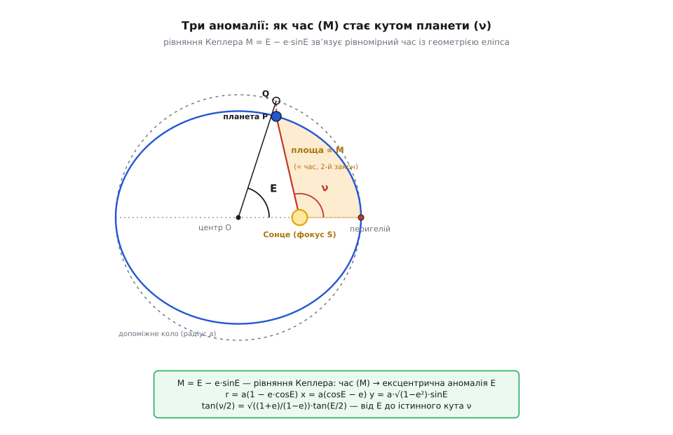

# ⚙️ Рівняння Кеплера: де планета в заданий момент

Три закони кажуть, якою є орбіта й наскільки нерівномірно планета нею біжить, але мовчать про найбуденніше питання практика: **де саме буде планета через рік і три місяці?** Закон площ дає час у залежності від положення — заметена площа росте рівномірно, тож, знаючи, куди дійшла планета, легко сказати, скільки на це пішло часу. А нам треба навпаки: **із часу дістати положення**. Ця обернена задача не має розв'язку у скінченних формулах — і саме вона стоїть усередині кожного планетарію, кожного астрономічного альманаху й кожного розрахунку міжпланетного перельоту. Розберімо, як її розв'язують кількома рядками коду.

## Задача

Орбіту задано трьома числами: велика піввісь `a` (розмір), ексцентриситет `e` (витягнутість) і період `T` (час одного обороту). Відомий також момент, коли планета була в перигелії, — назвімо його `t₀`. Питання: для довільного часу `t` знайти положення планети — її координати `(x, y)` у площині орбіти (а з них уже відстань до Сонця `r` і кут).

Чому це не тривіально? Якби планета летіла рівномірно, відповідь була б миттєвою: кут дорівнював би просто `2π·(t−t₀)/T`, і по колу ми б знайшли точку за секунду. Але планета **не** рухається рівномірно — за другим законом вона розганяється біля Сонця й гальмує вдалині. Тому справжній кут — нелінійна, скручена функція часу: за перші місяці після перигелію планета проходить куди більший кут, ніж за такі самі місяці біля афелію. Розплутати цю нерівномірність — і є вся суть задачі.

## Ідея: три аномалії

Пряму дорогу «час → кут» перекрито, тож рухаймося в обхід, через проміжну величину. Астрономи ще від Кеплера користуються **трьома** кутами, кожен зі своїм історичним ім'ям «аномалія» (гр. *anōmalía* — «нерівність, відхилення»: так називали кутове відхилення планети від рівномірного руху).

**Середня аномалія `M`** — це уявний рівномірний кут. Заведімо фіктивну точку, що біжить по колу зі сталою кутовою швидкістю `n = 2π/T` (її звуть **середнім рухом**), стартувавши з перигелію разом із планетою. Кут цієї точки й є `M`:

```
M = n·(t − t₀) = 2π·(t − t₀)/T
```

`M` — це просто перефарбований час: росте рівно, лінійно, і обчислюється поділом. Головне ж — `M` напряму пов'язана з другим законом: заметена від перигелію площа завжди становить частку `M/2π` повної площі еліпса. Тобто `M` — це і є та сама «рівномірно затемрена площа», тільки виражена кутом. Ось чому знайти положення в часі означає **обернути закон площ**: легку `M` ми маємо, а треба з неї дістати справжній кут.

**Ексцентрична аномалія `E`** — геометричний місток. Опишімо навколо еліпса **допоміжне коло** радіусом `a` (з центром у центрі еліпса). Планета сидить у точці `P` на еліпсі; піднімімося від неї вертикально, перпендикулярно до великої осі, до перетину з колом — у точку `Q`. Кут, під яким видно `Q` **з центра** еліпса (від напряму на перигелій), і є ексцентрична аномалія `E`. Це штучна, але напрочуд зручна змінна: вона випрямляє геометрію еліпса в геометрію кола.

**Істинна аномалія `ν`** — власне те, що нам треба: справжній кут планети, як його видно **із Сонця** (з фокуса), відлічений від перигелію. Разом з відстанню `r` вона задає точку в полярних координатах від Сонця.


*Три аномалії на одній картинці. `M` — рівномірний «годинниковий» кут, пропорційний зафарбованій площі (а отже, часу від перигелію). `E` — кут до точки `Q` на допоміжному колі (проєкція планети вгору). `ν` — справжній кут планети з Сонця. Рівняння Кеплера зшиває легку `M` з геометричною `E`, а проста тригонометрія веде далі — від `E` до `ν` і до координат.*

Тепер — ключовий зв'язок. Порахуймо площу, яку радіус-вектор замів від перигелію, через `E`. Тут допомагає одне спостереження: якщо стиснути допоміжне коло по вертикалі в `b/a` разів, воно перетвориться **точно** на еліпс, а будь-яка площа зменшиться в ті самі `b/a` разів (`b` — мала піввісь). На колі шукана площа — це круговий сектор `½a²·E`, з якого віднято трикутник зі зсунутим у фокус вершиною, площею `½·(a·e)·(a·sinE)`. Отже на еліпсі заметена площа дорівнює:

```
S = (b/a) · ½a²·(E − e·sinE) = ½·a·b·(E − e·sinE)
```

А за другим законом та сама площа — це частка `M/2π` від повної площі еліпса `π·a·b`, тобто `½·a·b·M`. Прирівнявши обидва вирази й скоротивши спільне `½ab`, дістаємо **рівняння Кеплера**:

```
M = E − e·sinE
```

Оце воно — місток через прірву. Зліва легка `M` (з часу), справа шукана `E`, сплутана з власним синусом. Знайшовши `E`, решту добуваємо простими формулами — вони випливають прямо з координат точки `P = (a·cosE, b·sinE)`, зсунутих у фокус `(a·e, 0)`:

```
r = a·(1 − e·cosE)                          відстань до Сонця
x = a·(cosE − e)                            уздовж великої осі (+x на перигелій)
y = a·√(1 − e²)·sinE                        упоперек
ν = atan2( √(1−e²)·sinE , cosE − e )        істинна аномалія
```

Перевірити легко на межах: при `E = 0` (перигелій) виходить `r = a(1−e)`, при `E = π` (афелій) — `r = a(1+e)`, як і має бути. Уся заковика лишилась одна: **як із `M` дістати `E`**, коли `E` не виражається через `M` у скінченному вигляді.

## Розв'язання: ітерація Ньютона — Рафсона

Рівняння `M = E − e·sinE` **трансцендентне**: `E` тут і всередині синуса, і зовні, тож алгеброю його не розчепити. Але це не завада — його чудово розв'язує чисельний пошук кореня. Перепишімо рівняння як «знайти нуль функції»:

```
f(E) = E − e·sinE − M = 0
```

Метод Ньютона — Рафсона робить очевидне: бере поточне наближення `E`, проводить у цій точці дотичну до `f` і бере за нове наближення той `E`, де дотична перетинає нуль. Нахил дотичної — це [похідна](root:math-analysis/derivative) функції, а вона тут навдивовижу проста:

```
f′(E) = 1 − e·cosE
```

Звідси крок ітерації:

```
E_new = E − f(E)/f′(E) = E − (E − e·sinE − M) / (1 − e·cosE)
```

Чому цей метод тут майже ідеальний? Бо для будь-якого еліпса (`e < 1`) похідна `f′(E) = 1 − e·cosE` **завжди додатна** (адже `e·cosE` не перевищує `e < 1`). Функція `f` строго зростає — отже, корінь рівно один, без розгалужень і хибних гілок. А ще Ньютон збігається **квадратично**: біля кореня кількість правильних цифр щокроку подвоюється, тож кількох кроків досить до машинної точності. Для планет за початкове наближення беруть просто `E₀ = M` — воно вже дуже близьке, бо `e·sinE` малий.

Проженімо це вручну на Марсі.

**Приклад (де Марс у момент, коли `M = 60°`).** Дано `a = 1.524` а.о., `e = 0.0934`, і час такий, що `M = 60° = 1.047198` рад. Стартуємо з `E₀ = M`:

```
E₀ = 1.047198
крок 1:  f = −0.080887,  f′ = 0.953300,  ΔE = −0.084851  →  E₁ = 1.132049
крок 2:  f = +0.000296,  f′ = 0.960323,  ΔE = +0.000308  →  E₂ = 1.131739
крок 3:  f = +4·10⁻⁹,    f′ = 0.960309,  ΔE = +4·10⁻⁹    →  E₃ = 1.131739   (збіглося)
```

Три кроки — і `E = 1.131739` рад `= 64.844°`. Тепер координати:

```
cosE = 0.42509,  sinE = 0.90515,  √(1−e²) = 0.99563
r = 1.524·(1 − 0.0934·0.42509) = 1.524·0.96031 = 1.4635 а.о.
x = 1.524·(0.42509 − 0.0934)   = 1.524·0.33169 = 0.5055 а.о.
y = 1.524·0.99563·0.90515      = 1.3734 а.о.
ν = atan2(1.3734, 0.5055) = 69.79°
перевірка:  √(x² + y²) = 1.4635 = r  ✓
```

Прочитаймо результат. Середня аномалія була `60°`, ексцентрична вийшла `64.8°`, а істинна — аж `69.8°`. Планета кутом **випереджає** рівномірний годинник (`ν > M`), і це фізично правильно: за `M = 60°` минуло рівно 60/360 = шоста частина періоду після перигелію, а Марс тоді ще біля Сонця й летить швидко, тож устигає накрутити більший кут, ніж накрутила б рівномірна точка. Три аномалії завжди йдуть у порядку `M ≤ E ≤ ν` на шляху від перигелію до афелію — і сходяться в одне на самих кінцях.

## Робочий код

Зберемо все в готову функцію: із часу рахуємо `M`, ітерацією Ньютона добуваємо `E`, з `E` — координати. Мова цієї задачі — **науково-числова**: тут важать плавна робота з дробовими числами, тригонометрія й швидкий внутрішній цикл (у пропагаторі орбіт це рівняння розв'язують мільйони разів для тисяч тіл, тож поруч із наочним Python доречний і швидкий C++ — той самий алгоритм у гарячій петлі). Обидві версії — повні й робочі, з робастним стартом, про який ідеться нижче:

:::tabs
```py
import math

def solve_kepler(M, e, tol=1e-12, max_iter=100):
    """M = E − e·sinE  →  E.  Робастний старт E₀ = π для великих e (комети)."""
    M %= 2 * math.pi                        # звести M у [0, 2π)
    flip = M > math.pi
    if flip:                                # симетрія E(2π−M) = 2π − E(M): рахуємо на [0, π]
        M = 2 * math.pi - M
    E = math.pi if e > 0.8 else M + e * math.sin(M)     # початкове наближення
    for _ in range(max_iter):
        dE = (E - e * math.sin(E) - M) / (1 - e * math.cos(E))
        E -= dE
        if abs(dE) < tol:                   # квадратична збіжність: зазвичай 3–6 кроків
            break
    return 2 * math.pi - E if flip else E

def orbit_xy(a, e, T, t, t0=0.0):
    """Координати (x, y) відносно Сонця; +x — на перигелій, +y — за рухом планети."""
    M = 2 * math.pi * (t - t0) / T          # середня аномалія: росте лінійно з часом
    E = solve_kepler(M, e)
    x = a * (math.cos(E) - e)
    y = a * math.sqrt(1 - e * e) * math.sin(E)
    return x, y

# Приклад: Марс через 100 діб після перигелію
a, e, T = 1.524, 0.0934, 686.98             # а.о., —, діб
x, y = orbit_xy(a, e, T, t=100.0)
r  = math.hypot(x, y)
nu = math.degrees(math.atan2(y, x))         # істинна аномалія; правильна чверть — саме через atan2
print(f"x={x:.4f}  y={y:.4f}  r={r:.4f} а.о.  ν={nu:.2f}°")
# → x=0.6902  y=1.2709  r=1.4462 а.о.  ν=61.49°
```
```cpp
#include <cmath>
#include <cstdio>
constexpr double PI = 3.14159265358979323846;

// M = E − e·sinE  →  E.  Робастний старт E₀ = π для великих e (комети).
double solve_kepler(double M, double e, double tol = 1e-12, int max_iter = 100) {
    M = std::fmod(M, 2 * PI);
    if (M < 0) M += 2 * PI;                        // fmod може дати відʼємне — вирівнюємо
    bool flip = M > PI;
    if (flip) M = 2 * PI - M;                      // симетрія: рахуємо на [0, π]
    double E = (e > 0.8) ? PI : M + e * std::sin(M);   // початкове наближення
    for (int i = 0; i < max_iter; ++i) {
        double dE = (E - e * std::sin(E) - M) / (1 - e * std::cos(E));
        E -= dE;
        if (std::fabs(dE) < tol) break;            // квадратична збіжність
    }
    return flip ? 2 * PI - E : E;
}

struct Vec2 { double x, y; };

// (x, y) відносно Сонця; +x — на перигелій.
Vec2 orbit_xy(double a, double e, double T, double t, double t0 = 0.0) {
    double M = 2 * PI * (t - t0) / T;              // середня аномалія
    double E = solve_kepler(M, e);
    return { a * (std::cos(E) - e), a * std::sqrt(1 - e * e) * std::sin(E) };
}

int main() {
    Vec2 p = orbit_xy(1.524, 0.0934, 686.98, 100.0);   // Марс, +100 діб
    double r  = std::hypot(p.x, p.y);
    double nu = std::atan2(p.y, p.x) * 180 / PI;
    std::printf("x=%.4f  y=%.4f  r=%.4f а.о.  nu=%.2f\n", p.x, p.y, r, nu);
    // → x=0.6902  y=1.2709  r=1.4462 а.о.  nu=61.49
    return 0;
}
```
:::

Кут `ν` беремо через `atan2` (двоаргументний [арктангенс](root:math-geometry/atan2)), а не через звичайний `atan(y/x)`: лише `atan2` знає знаки обох координат і кладе кут у правильну чверть, тож планета в лівій половині орбіти не «телепортується» у праву. Це та дрібниця, на якій регулярно спотикаються саморобні пропагатори.

> 🔧 **Навіщо це.** Найближчий приклад цього коду — у тебе в кишені. Кожен приймач GNSS (GPS, Galileo, ГЛОНАСС) отримує з супутника **бортовий ефемерис** — набір кеплерових елементів орбіти, серед них середню аномалію й ексцентриситет, — і, щоб дізнатися, **де зараз супутник**, розв'язує рівняння Кеплера `Eₖ = Mₖ + e·sinEₖ` тими самими ітераціями (це прописано в специфікації IS-GPS-200). Орбіти GPS майже кругові (`e ≈ 0.001`), тож там вистачає навіть простішого за Ньютона **методу простої підстановки** — двічі підставити `E ← M + e·sinE`, і збіжність готова (це, до речі, буквально той ітеративний спосіб, що його Кеплер запропонував ще 1621 року). Без цього кроку супутник «попливе» вздовж орбіти, а з ним і твоя позиція на мапі.

## Складність і пастки

**Вартість — жменя тригонометрії на виклик.** Кожен крок Ньютона — це один `sin`, один `cos` і кілька множень; кроків зазвичай 3–6. Тобто знайти положення в будь-який момент коштує сталого, мізерного часу — байдуже, рахуємо ми на секунду вперед чи на тисячу років. Саме тому альманахи й планетарії такі меткі. Але дешевизна оманлива: варто зайти в область великого ексцентриситету — і охайний метод починає бешкетувати.

**Головна пастка — комети.** Уся біда ховається в похідній `f′(E) = 1 − e·cosE`. Біля перигелію (`E → 0`) вона дорівнює `1 − e`. Для планет це майже одиниця (у Землі `0.983`), і Ньютон летить до кореня, як по маслу. А для комети Галлея з `e = 0.967` тут виходить `1 − 0.967 = 0.033` — майже нуль. Ділити на майже-нуль означає робити **величезні** кроки: рівняння біля перигелію стає майже пласким, а обернена до нього задача — гостро чутливою.


*Чому великий `e` небезпечний. У планети `M(E)` майже пряма, тож обернення легке. У комети крива біля перигелію майже пласка (нахил `1−e ≈ 0.03`): маленький шматочок часу `M` «розтягується» у широчезний діапазон `E`. Той самий `M = 10°` дає в планети `E ≈ 11°`, а в комети — аж `E ≈ 56°`; наївний старт `E₀ = M` тут падає далеко від кореня, і перший же крок Ньютона перестрибує його.*

Подивімося на це в цифрах. Візьмімо комету Галлея, `M = 10°`, і наївний старт `E₀ = M`:

```
крок 1:  E → 211.7°     (стрибок аж за 180° — далеко за межу!)
крок 2:  E → 85.0°
крок 3:  E → 63.4°
...
крок 8:  E → 55.85°      (нарешті збіглося)
```

Замість трьох кроків — вісім, і з диким перельотом за `180°` на першому. А тепер по-справжньому витягнута орбіта, `e = 0.999` (майже парабола, як у довгоперіодичних комет), `M = 20°`, той самий наївний старт:

```
E → 339.6°  →  −5013°  →  +39576°  →  …
```

Метод кидає `E` на **тисячі градусів** туди-сюди; до кореня він урешті дошкандибає аж за ~78 кроків, а при трохи іншому `M` може зациклитися чи впасти на сусідній оберт — тобто на практиці **не збігтися** за розумний ліміт ітерацій. Причина одна: біля перигелію `f′ ≈ 0.001`, і `ΔE = f/f′` роздувається в тисячу разів.

**Ліки — розумний старт.** Порятунок дивовижно простий: не починати з пласкої зони. На проміжку `[0, π]` функція `f` **опукла** (її друга похідна `e·sinE ≥ 0`), а на правому кінці `f(π) = π − M ≥ 0`. Для опуклої зростальної функції Ньютон, стартувавши з точки, де `f ≥ 0` і яка лежить **правіше** кореня, гарантовано сповзає до нього **монотонно**, без перельотів. Такою точкою є `E₀ = π` — там похідна `1 + e` найбільша, а не найменша. Тому надійний код для великих `e` стартує саме з `E₀ = π`, а симетрію `E(2π−M) = 2π − E(M)` використовує, щоб звести будь-яке `M` на зручний проміжок `[0, π]` — саме це й роблять обидві версії коду вище. Для тієї самої комети Галлея старт `E₀ = π` дає рівний монотонний спуск за 5–7 кроків без жодного перельоту, а для `e = 0.999` — так само надійно там, де наївний старт бився в конвульсіях.

Кілька дрібніших граблів, на яких ловляться реальні реалізації:

- **Зведення `M` за модулем `2π`.** Час `t` може бути на багато обертів уперед, тож `M` виросте до сотень радіанів. Спершу звести `M` у `[0, 2π)` (чи `[−π, π]`) — інакше і збіжність гірша, і чверть кута попливе. У коді це перший рядок.
- **Скрізь радіани.** `sin`/`cos` у стандартних бібліотеках беруть радіани, а не градуси. Змішати одиниці — класична причина «майже правильної» орбіти, зсунутої на сталий множник.
- **Критерій зупинки — по `ΔE`, не по числу кроків.** Зупиняйся, коли поправка `ΔE` менша за потрібну точність, а фіксований ліміт `max_iter` тримай лише як запобіжник від зациклення (він і рятує, коли старт таки поганий).
- **`e ≥ 1` — це вже інша задача.** Рівняння `M = E − e·sinE` живе тільки для еліпса (`e < 1`). Параболічну траєкторію (`e = 1`) рахують окремим **рівнянням Баркера** (воно, на щастя, має точний розв'язок через корені кубічного рівняння), а гіперболічний проліт (`e > 1`) — **гіперболічним рівнянням Кеплера** `M = e·sinh H − H` з гіперболічними функціями. Той самий Ньютон працює і там, лише синус міняється на гіперболічний.

> 📜 Кеплер виписав це рівняння в 60-му розділі «Нової астрономії» (*Astronomia Nova*, 1609), а спосіб розв'язувати його підстановкою дав у «Скороченні коперниканської астрономії» (1621). Сам він не вірив, що `E` можна виразити через `M` формулою: рівняння, писав він, годі розв'язати наперед «через різну природу дуги та синуса», і обіцяв славу тому, хто знайде спосіб. Строго кажучи, Кеплерова інтуїція справдилася — скінченної формули немає, — та є нескінченний ряд: `E = M + Σ (2/m)·Jₘ(m·e)·sin(mM)`. Ряд для цієї задачі знайшов Лагранж (1770), а його коефіцієнти `Jₘ` — це **функції Бесселя**: Фрідріх Бессель систематично дослідив їх у 1810–1820-х саме на планетних збуреннях, і з тієї орбітальної задачі виросла ціла гілка математичної фізики. (За деякими джерелами, схожа рівність зринала ще в астрономії IX ст. в задачі про паралакс, але для небесної механіки її вивів незалежно саме Кеплер.)

Отже, увесь фокус — обійти закритий вхід через проміжну змінну. Час стає середньою аномалією `M` простим діленням; рівняння Кеплера `M = E − e·sinE` перекидає місток до ексцентричної аномалії `E`, який Ньютонова ітерація переходить за кілька кроків; а з `E` тригонометрія веде до відстані, координат та істинного кута. Уся хитрість — у виборі старту: наївний `E₀ = M` бездоганний для майже кругових планет і зривається на витягнутих кометних орбітах, де рятує монотонний `E₀ = π`. Кілька рядків коду — і закон площ, який дає час із положення, обернено назад: тепер ми питаємо в нього положення з часу й дістаємо точну відповідь для будь-якої миті, хоч на тисячу років уперед.
