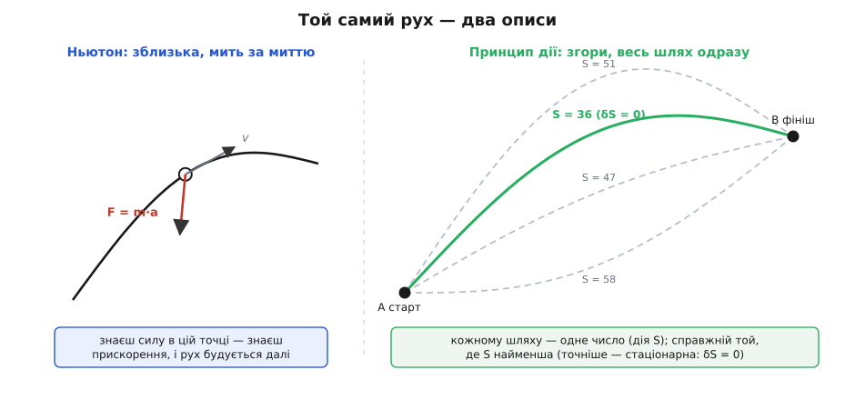
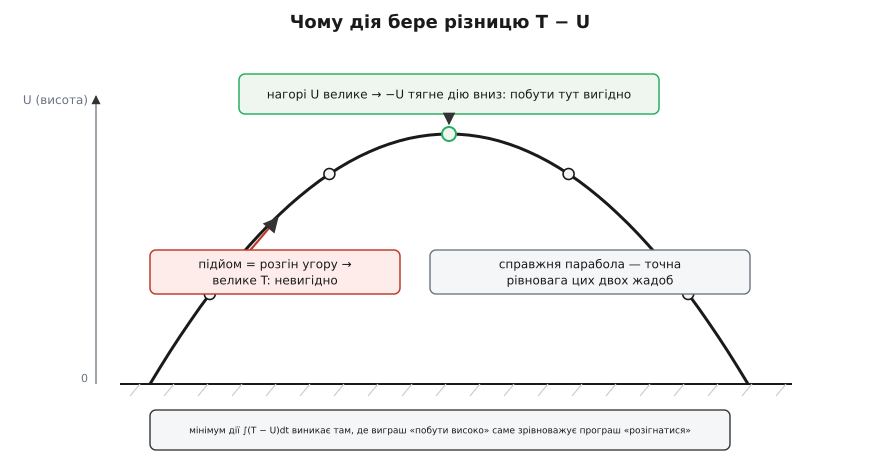
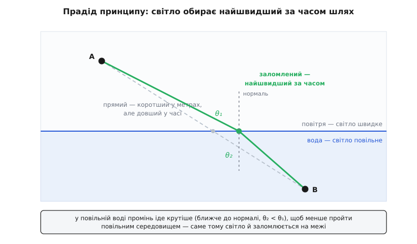

# Принцип найменшої дії

<preknowlist>
- [Кінетична енергія](topic:ph-mechanics/kinetic-energy) — енергія руху, T = ½·m·v²; росте з квадратом швидкості.
- [Потенціальна енергія](topic:ph-mechanics/potential-energy) — запас енергії за положенням у полі сил (висота над землею, стиснута пружина), U; сила — це стрімкість її спаду.
- [Другий закон Ньютона](topic:ph-mechanics/newtons-second-law) — локальний опис руху: сила в кожну мить задає прискорення, F = m·a.
- [Похідна](topic:math-analysis/derivative) — миттєва швидкість зміни величини; «стаціонарно» означає рівно те, що похідна дорівнює нулю.
- [Інтеграл](topic:math-analysis/integral) — неперервне підсумовування величини вздовж проміжку; дія — саме такий інтеграл уздовж усього руху.
- [Екстремум](topic:math-analysis/extrema) — точка, де величина стаціонарна (похідна нульова): мінімум, максимум або сідло.
</preknowlist>

Ньютон навчив нас дивитися на рух зблизька, мить за миттю. У кожну секунду на тіло діє сила, сила задає прискорення, прискорення трохи підправляє швидкість — і так, крок за кроком, крихітними причинними поштовхами, вибудовується вся траєкторія. Це погляд бухгалтера: зведи баланс сил тут і зараз, і майбутнє саме собою випливе з теперішнього. Він працює бездоганно й здається єдино можливим — бо як інакше?

А тепер — зовсім інша розповідь про той самий політ каменя. Забудьте про поштовхи. Назвіть лише три речі: звідки камінь вилетів, куди прилетів і за який час. Між цими двома точками пролягає незліченно багато уявних шляхів — прямий, петлястий, повільний спершу й рвучкий потім, який завгодно. Кожному такому шляху припишемо одне-єдине число й назвемо його **дією** (лат. actio — чин, здійснення). І тоді виявляється дивовижне: справжній шлях, той, яким камінь полетить насправді, — це той, на якому дія найменша. Природа наче переглядає всі можливості разом і зупиняється на найощадливішій.

Звучить майже містично. Звідки камінь «знає» кінцеву точку заздалегідь, ще на старті? Як він порівнює шляхи, якими не летить? Уся ця стаття — про те, що ніякої містики немає: два описи, локальний ньютонів і глобальний, — це та сама фізика, побачена з двох боків, і другий бік виявився глибшим за перший.

## Що таке дія

Щоб приписати шляху число, нам потрібні дві знайомі енергії в кожній його точці. Перша — [кінетична](topic:ph-mechanics/kinetic-energy), T = ½·m·v², енергія самого руху; що швидше тіло, то вона більша. Друга — [потенціальна](topic:ph-mechanics/potential-energy), U, запас, схований у положенні: камінь високо над землею, стиснута пружина, заряд у полі. Ньютон складав би їх (повна енергія T + U — це те, що [зберігається](topic:ph-mechanics/energy-conservation)). Дія робить дещо інше й на позір дивне: бере їхню **різницю**.

Величину L = T − U називають **функцією Лагранжа**, або лагранжіаном (на честь Жозефа-Луї Лагранжа, який у XVIII столітті звів усю механіку до дій із нею). У кожну мить руху вона має якесь значення: тіло рухається швидко й низько — L велике й додатне; повзе високо вгорі — L мале, а то й від'ємне. Дія ж — це підсумок L за весь час польоту, [інтеграл](topic:math-analysis/integral):

```
S = ∫ L dt = ∫ (T − U) dt     від старту до фінішу
```

Наголосімо на головному, бо тут корінь усієї незвичності. Дія — це число не точки й не миті, а **цілого шляху загалом**. Одна траєкторія — одне число S. Інша траєкторія між тими самими кінцями — інше число. Ми дістали спосіб порівнювати шляхи між собою: цей «дорожчий», той «дешевший».

## Сам принцип

Тепер — саме твердження, навколо якого стоїть уся класична фізика. **З усіх мислимих шляхів між заданими початком і кінцем тіло рухається тим, на якому дія стаціонарна** — тобто при будь-якому крихітному підправленні шляху вона в першому наближенні не змінюється.



*Два описи того самого руху. Ньютон рахує сили мить за миттю; принцип дії порівнює цілі шляхи й обирає той, де S стаціонарна.*

Слово «стаціонарна» варте прискіпливості, і саме тут ховається невеличкий обман у назві. «Найменша дія» — красива й історична, але не зовсім точна. Правильно казати: дія на справжньому шляху — [стаціонарна](topic:math-analysis/extrema), як вершина пагорба чи дно ями стаціонарні для висоти. Зсунься трохи в будь-який бік від дна — і висота спершу майже не зміниться; так само зсунь трохи справжню траєкторію — і дія спершу майже не зміниться. Записують це як

```
δS = 0
```

де δ («варіація») — це та сама крихітна зміна шляху. У переважній більшості земних задач стаціонарна точка виявляється саме мінімумом, тож ім'я «найменша» прижилося й здебільшого не бреше. Але буває, що це сідло, а не низина, — тому фізики, коли хочуть бути чесними, кажуть «принцип стаціонарної дії».

## Чому різниця, а не сума

Найприродніше запитання: чому T − U, чому мінус? Повна енергія — це T + U, вона стала й зрозуміла. Різниця ж на перший погляд не значить нічого. Розкриймо її на найпростішому випадку, де все — чиста арифметика.

Візьмімо тіло, на яке не діють жодні сили: U = 0 усюди, отже L = T = ½·m·v². Дія стає просто підсумком квадрата швидкості. Поставмо тілу задачу: подолати задану відстань за заданий час — а спосіб хай обирає саме.

**Умова: подолати 12 м за 4 с; сил немає (U = 0), тож дія пропорційна ∫v²dt.**
```
Рівномірний рух:  v = 12 / 4 = 3 м/с сталу
   ∫v² dt = 3²·4 = 9·4 = 36            (в одиницях ½·m)

Нерівномірний:    2 с зі швидкістю 1 м/с  (пройде 2 м),
                  тоді 2 с зі швидкістю 5 м/с (пройде 10 м) — разом 12 м
   ∫v² dt = 1²·2 + 5²·2 = 2 + 50 = 52

   36 < 52  →  менша дія в рівномірного руху.
```

Порівняння показове. Обидва способи долають ті самі 12 метрів за ті самі 4 секунди — але рівномірний обходиться дією 36, а рвучкий аж 52. Причина — у квадраті: розгін до 5 додає до підсумку 25 за секунду, тоді як економія на повільній ділянці віднімає лише крихти. Квадрат жорстоко карає будь-яку нерівномірність. Тому найдешевший шлях — той, де швидкість розмазана якнайрівніше.

А рівномірний прямолінійний рух за відсутності сил — це дослівно [перший закон Ньютона](topic:ph-mechanics/newtons-second-law): тіло, яке ніхто не штовхає, летить сталою швидкістю по прямій. Отже, принцип дії вже в цьому голому випадку сам, без жодних сил, відтворив інерцію. Він не суперечить Ньютонові — він його породжує.

Тепер увімкнімо тяжіння, тобто ненульове U (що вище тіло, то більше U). Дія знову стає різницею T − U, і в неї з'являється другий важіль. Зменшити S можна не лише рівномірністю руху (малим T), а й тим, щоб **побути там, де U велике** — адже велике U, взяте з мінусом, тягне підсумок униз. Тіло наче має дві жадоби водночас: не розганятися надто (це коштує через T) і затриматися якомога вище (це вигідно через −U). Ці жадоби суперечать одна одній: щоб побути високо, треба спершу туди піднятися, а підйом — це саме розгін угору, тобто велике T. Компроміс між ними й вигинає рівну лінію рівно в **параболу** підкинутого каменя — той самий шлях, який Ньютон дістає з F = m·g.



*Різниця T − U перетворює рух на торг: побути високо (велике U) вигідно, розганятися (велике T) — ні. Параболічна траєкторія — це і є точна рівновага цього торгу.*

Мінус — не примха запису. Він і є той механізм, що зшиває інерцію тіла з формою поля, у якому воно рухається, і дає на виході точну траєкторію.

## Як звідси випливає Ньютон

Досі ми лише порівнювали окремі шляхи. Але як із вимоги δS = 0 дістати робоче рівняння руху — таке, щоб підставив початкові дані й отримав траєкторію? Відповідь дає **рівняння Ейлера–Лагранжа**. Для руху з координатою x і швидкістю v = ẋ умова стаціонарності дії набуває вигляду:

```
d/dt (∂L/∂ẋ) − ∂L/∂x = 0
```

Це не окремий новий закон, а прямий алгебричний наслідок того, що δS = 0 на справжньому шляху; повне [виведення через варіаційне числення](topic:ph-mechanics/least-action-principle/math-euler-lagrange.md) вміщується на пів сторінки. Перевірмо, що воно повертає знайоме. Візьмімо L = ½·m·ẋ² − U(x) і порахуймо дві потрібні похідні:

```
∂L/∂ẋ = m·ẋ        ← це просто імпульс, p = m·v
∂L/∂x = −dU/dx     ← а це, зі знаком мінус, сила: F = −dU/dx

Підставляємо в рівняння Ейлера–Лагранжа:
   d/dt(m·ẋ) − (−dU/dx) = 0
   m·ẍ = −dU/dx = F
```

Останній рядок — це m·a = F, [другий закон Ньютона](topic:ph-mechanics/newtons-second-law), відтворений слово в слово. Ба більше: у процесі сама собою випливла величина ∂L/∂ẋ = m·v — імпульс. У формалізмі дії імпульс не постулюють, він народжується як «чутливість дії до швидкості». Ось чому обидва описи еквівалентні: те саме рівняння руху виводиться і зблизька (Ньютон: підсумуй сили), і згори (принцип: зроби дію стаціонарною).

> 🔧 **Навіщо це.** Якщо обидва підходи дають те саме, навіщо складніший? Бо його страшенно легше застосовувати там, де Ньютонів захлинається у зв'язках. Уявіть подвійний маятник, руку робота з шістьма шарнірами чи бусину на скрученому дроті. За Ньютоном довелося б виписувати всі невідомі сили реакції в опорах і зчленуваннях — марудно й до помилок. За принципом дії ви обираєте зручні власні координати (кути в шарнірах), пишете для них одну функцію L = T − U — і механічно прокручуєте рівняння Ейлера–Лагранжа. Сили реакції зникають самі, бо вони не виконують роботи. Саме так фізичні рушії ігор, симулятори космічних апаратів і планувальники руху роботів насправді й виводять рівняння руху.

## Давній предок: світло, що поспішає

Ідея «природа щось мінімізує» старша за механіку — вона прийшла з оптики. Ще Герон Александрійський помітив, що промінь, відбиваючись від дзеркала, іде найкоротшим шляхом. А в XVII столітті П'єр де Ферма висунув сміливіше: світло між двома точками обирає шлях **найшвидший за часом**. Коли промінь переходить із повітря у воду, де він повільніший, йому вигідно скоротити подорож у «повільному» середовищі коштом трохи довшої в «швидкому» — тому він і заломлюється на межі під точним кутом, а не йде прямо.



*Заломлення як мінімізація часу: у повільнішому середовищі промінь «економить» відстань, тому ламається на межі. Це оптичний прадід принципу найменшої дії.*

[Принцип Ферма про найменший час](topic:ph-waves/fermat-principle) виявився не курйозом оптики, а першим щаблем. У XVIII столітті П'єр-Луї де Мопертюї спробував перенести ту саму думку на рух тіл і 1744 року проголосив «принцип найменшої дії» для механіки — щоправда, в обгортці богословських міркувань про ощадливість Творця, а математичну строгість йому того ж року дав Леонгард Ейлер. Остаточної, чистої форми — δ∫(T − U)dt = 0 — принцип набув аж у 1834–35 роках у Вільяма Роуена Гамільтона, який теж ішов до нього від оптики. [Історія цього народження](topic:ph-mechanics/least-action-principle/hist-least-action.md), з гучним скандалом про першість і сатирою Вольтера, — окрема й дуже людська пригода.

## Чому це виявилося глибше за Ньютона

Можна було б вважати принцип дії просто елегантним перевзуттям тих самих законів — гарним, але необов'язковим. Насправді ж він переріс механіку й став несучою конструкцією всієї фізики. Причин кілька, і кожна варта уваги.

Перша — **байдужість до координат**. Рівняння Ньютона треба переписувати щоразу, як міняєш опис (декартові осі, полярні кути, кути шарнірів). Дія — просто число шляху; воно те саме, хоч якими координатами ти його рахуєш. Тому принцип легко переносити на найхимерніші системи, де «сила» й «прискорення» стають незручними.

Друга — **міст до законів збереження**. Емілі Нетер 1918 року довела, що за кожним законом збереження стоїть симетрія дії: однорідність часу дає збереження енергії, однорідність простору — імпульсу, ізотропність — моменту імпульсу. Цей результат ([теорема Нетер](topic:ph-mechanics/noether-theorem)) просто не має де вкоренитися без поняття дії — він говорить саме про симетрії функції Лагранжа.

Третя, найглибша, — **відповідь на «чому саме мінімум»**. Класично це лишалося майже дивом: звідки тілу знати про всі шляхи? Квантова механіка зняла загадку. За Річардом Фейнманом, частинка в певному сенсі й справді «пробує всі шляхи» одразу, і кожному відповідає крихітна хвиля, чия фаза — це дія S, поділена на сталу Планка. На випадкових шляхах ці хвилі мають різнобій фаз і гасять одна одну. А поблизу того шляху, де дія стаціонарна, сусідні шляхи мають майже однакову фазу — і хвилі складаються, підсилюючись. Ось де ховається класична траєкторія: це не «обраний» шлях, а той єдиний, довкола якого внески не самознищуються. «Найменша дія» перестала бути постулатом і стала наслідком того, як додаються квантові амплітуди.

Отже, два описи руху, з яких ми починали, — не суперники. Локальний ньютонів каже, що робити в кожну мить; глобальний принцип каже, який цілий шлях із цього вийде, — і додає те, чого в Ньютона немає: єдину мову для всієї фізики, від маятника до полів, місток до симетрій і збережень та, зрештою, квантове пояснення, чому природа взагалі мінімізує. Камінь не «знає» кінця наперед. Просто серед усіх його можливих історій одна — стаціонарна, і саме її ми й бачимо. Переконатися, що справжня траєкторія й справді сидить у мінімумі дії, найпростіше [власноруч, чисельно](topic:ph-mechanics/least-action-principle/proj-least-action.md): узяти ламану з кількох точок, порахувати її дію й дати комп'ютерові підправляти точки, доки дія не осяде, — на екрані проступить знайома парабола.
