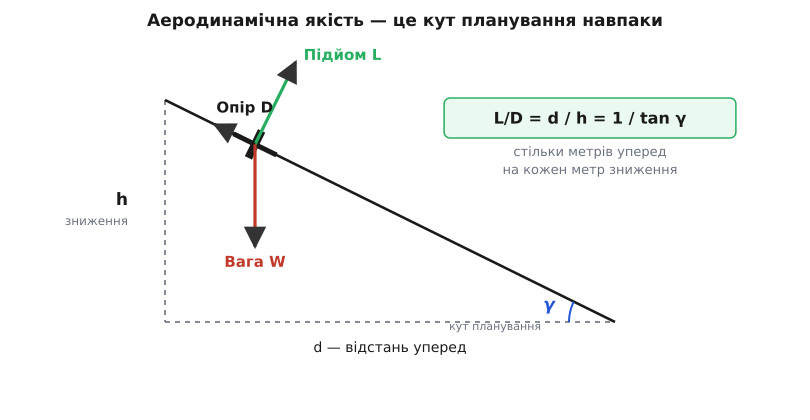
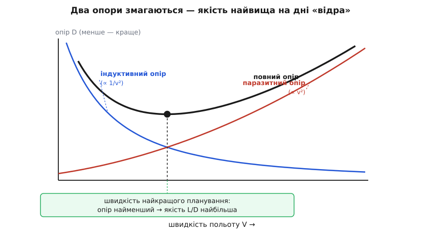
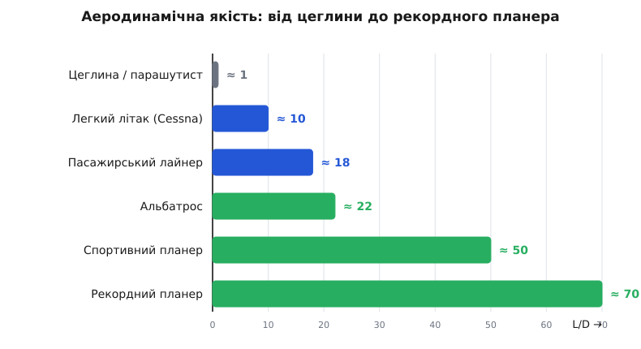

# Аеродинамічна якість (L/D)

<preknowlist>
- [Літак](root:ph-mechanics/fixed-wing-lift) — крило створює підіймальну силу L і платить за неї опором D; у горизонтальному польоті підйом дорівнює вазі.
- [Динамічний тиск і число Бернуллі](root:ph-mechanics/dynamic-pressure) — напір потоку q = ½·ρ·v², через який виражають і підйом, і опір.
- [Тяга проти ваги](root:ph-mechanics/thrust-vs-weight) — що таке тяга і чому в усталеному польоті вона врівноважує опір.
- [Синус і косинус](root:math-geometry/sine-cosine) — відношення сторін прямокутного трикутника до кута; тангенс як їхня частка й дає зв'язок кута з відношенням катетів.
</preknowlist>

Уяви планер на висоті кілометра. Двигуна в нього нема — тільки крила й тиша. Пілот відпускає керування, апарат опускає ніс і починає плавно сунути вниз, тримаючи сталу швидкість. Питання просте: **як далеко він долетить, поки торкнеться землі?** Відповідь — одне-єдине число, і воно ж виявляється головною мірою досконалості будь-чого, що літає: від паперового літачка до трансатлантичного лайнера. Це число — аеродинамічна якість, відношення підіймальної сили до опору, яке коротко пишуть L/D (англ. *lift-to-drag ratio*).

Розберімо, чому саме воно, а не потужність двигуна чи форма крила окремо, каже правду про те, наскільки апарат «чистий».

## L/D — це в скільки разів політ довший за зниження

Планер знижується рівно, з незмінною швидкістю — отже, сили на ньому врівноважені. Їх три. Вага W тягне вниз. [Крило дає підіймальну силу L](root:ph-mechanics/fixed-wing-lift), спрямовану впоперек траєкторії польоту. І опір D — гальмівна сила повітря — тягне назад, точно проти руху, уздовж траєкторії. Двигуна нема, тож уперед апарат нічого не штовхає: униз по похилій його жене сама вага, точніше та її частка, що дивиться вздовж спуску.

Розкладімо вагу на дві складові — уздовж траєкторії і впоперек неї. Якщо апарат знижується під кутом γ до горизонту, то вздовж спуску діє W·sin γ, а впоперек — W·cos γ. Перша складова тягне вперед-униз і врівноважується опором; друга притискає вниз і врівноважується підйомом:

```
L = W · cos γ        (підйом тримає поперечну складову ваги)
D = W · sin γ        (опір тримає складову вздовж спуску)
```

Поділімо одне рівняння на друге — вага скорочується, лишається чиста геометрія:

```
D / L = tan γ        отже        L / D = 1 / tan γ
```

А тепер поглянь на трикутник самого польоту. Апарат проходить уперед відстань *d* і водночас втрачає висоту *h*; кут спуску γ той самий, тож tan γ = h/d. Підставмо — і дістанемо разюче просту рівність:

```
L / D  =  d / h
```

**Аеродинамічна якість дорівнює відношенню пройденого шляху до втраченої висоти.** Апарат з якістю 30 пролітає тридцять метрів уперед на кожен метр зниження. Кут γ, під яким він спускається, звуть кутом планування, і що вища якість — то він менший: у доброго планера кут планування близько одного градуса, спуск майже непомітний.


*Кут планування і є аеродинамічна якість навпаки: відношення шляху до зниження d/h дорівнює L/D. Чим менший кут спуску, тим вища якість і тим далі летить апарат із тієї самої висоти.*

Важлива дрібниця: L/D — число без розмірності. І підйом, і опір — сили в ньютонах, тож їхнє відношення — чисте число, однакове в будь-яких одиницях. Саме тому воно так добре годиться на роль універсальної оцінки: воно каже не «скільки сили», а «наскільки вигідно» дається підйом. Українською цю величину так і звуть — **аеродинамічна якість**, і позначають літерою K.

**Приклад: доки дотягне планер.** Спортивний планер з якістю L/D = 45 ширяє на висоті h = 1500 м, і висхідних потоків більше нема.

```
d = (L/D) · h = 45 · 1500 м = 67 500 м ≈ 68 км
```

Майже сімдесят кілометрів з півтора кілометра висоти — і жодної краплі пального. Той самий розрахунок для легкого літака з якістю 10 дав би лише 15 км: різниця в якості напряму стає різницею в дальності.

На практиці до цього додається вітер. Зустрічний вітер зменшує пройдений над землею шлях, бо забирає частину часу планування, а попутний — навпаки. Порахуймо чесно, з поправкою:

**Приклад: чи дотягне до смуги проти вітру.** Двигун легкого літака заглух на висоті h = 1800 м, аеродинамічна якість L/D = 12, швидкість найкращого планування v = 30 м/с, зустрічний вітер 8 м/с. Смуга — за 14 км.

:::tabs
```py
def glide_reach(h, LD, v_bg, headwind=0.0):
    # h — висота (м); LD — аеродинамічна якість;
    # v_bg — швидкість найкращого планування (м/с);
    # headwind — зустрічний вітер (м/с, проти руху)
    still_air = LD * h                        # дальність у нерухомому повітрі
    return still_air * (1.0 - headwind / v_bg)  # поправка на вітер

# glide_reach(1800, 12, 30, 8)  ->  ≈ 15 800 м
```
```cpp
// h — висота (м); LD — аеродинамічна якість;
// v_bg — швидкість найкращого планування (м/с); headwind — зустрічний вітер
float glide_reach(float h, float LD, float v_bg, float headwind) {
    float still_air = LD * h;                 // дальність у нерухомому повітрі
    return still_air * (1.0f - headwind / v_bg); // поправка на вітер
}
// glide_reach(1800, 12, 30, 8)  ->  ≈ 15800 м
```
:::

```
дальність у спокійному повітрі = 12 · 1800   = 21 600 м
поправка на вітер              = 1 − 8/30    = 0.733
досяжна дальність над землею   = 21 600 · 0.733 ≈ 15 800 м ≈ 16 км
```

Смуга за 14 км — дотягне, але запас невеликий: ще кілька метрів на секунду зустрічного вітру, і його вже нема. Ось чому планування проти вітру — окрема наука.

> 🔧 **Навіщо це.** Для пілота L/D — це радіус порятунку. Коли двигун глухне, аеродинамічна якість каже, доки апарат здатний дотягти: помнож її на висоту — і матимеш коло досяжних майданчиків. Тому в кабіні на видноті тримають «швидкість найкращого планування» — саме на ній L/D максимальна й коло досяжності найбільше. Летіти помітно швидше чи повільніше за неї означає падати крутіше й не дотягти туди, куди дотягнув би на правильній швидкості.

## Чому це головне число ефективності

У планера двигуна нема, але висновок ширший — він стосується будь-якого польоту. Візьмімо звичайний літак, що рівно й горизонтально летить крейсером. Тепер підйом точно тримає вагу (L = W), а [тягу двигуна врівноважує опір](root:ph-mechanics/thrust-vs-weight) (T = D). Поділімо одне на одне:

```
T = D = W / (L/D)
```

Ось де L/D показує своє справжнє обличчя. **Тяга, потрібна, щоб нести вагу W, дорівнює цій вазі, поділеній на аеродинамічну якість.** Літак із якістю 20 утримує в повітрі двадцять тонн, платячи тягою лише за одну «умовну тонну» опору. Що вища якість, то менше двигуна треба на той самий політ, а менше тяги означає менше пального щосекунди.

**Приклад: скільки тяги тримає лайнер.** Широкофюзеляжний літак масою m = 250 т летить із якістю L/D = 18.

```
W = m · g       = 250 000 · 9.81    ≈ 2.45·10⁶ Н
T = W / (L/D)   = 2.45·10⁶ / 18      ≈ 1.36·10⁵ Н ≈ 136 кН
```

Двигуни, здатні відірвати чверть тисячі тонн від землі, у крейсері віддають лише десяту частку тієї сили — решту роботи робить аеродинамічна якість крила. Саме тому L/D стоїть прямим множником у [рівнянні дальності: скільки апарат пролетить, пропорційно до його аеродинамічної якості](root:ph-mechanics/breguet-range-endurance). Подвоїш якість — і за тим самим баком залетиш удвічі далі. Жоден інший важіль не дає дальності так дешево.

## Що задає якість: два опори змагаються

Звідки береться конкретне значення L/D? Тут ховається краса. І підйом, і опір ростуть з одного напору — [динамічного тиску q = ½·ρ·v²](root:ph-mechanics/dynamic-pressure), помноженого на площу крила S:

```
L = q · S · CL          D = q · S · CD
```

Коефіцієнти CL і CD вбирають усю геометрію та кут атаки. Поділивши підйом на опір, бачимо, що напір і площа скорочуються геть:

```
L / D  =  CL / CD
```

Отже, аеродинамічна якість **не залежить ні від розміру апарата, ні від густини повітря, ні від швидкості безпосередньо** — лише від форми крила та кута, під яким воно зустрічає потік. Це властивість самого профілю й постави крила, а не режиму польоту. Ось чому вона така зручна міра «чистоти».

Тепер придивімося до опору, бо саме він у знаменнику вирішує все. Опір крила має дві різні природи, і зі швидкістю вони тягнуть у протилежні боки.

Перший — **паразитний опір** (англ. *parasitic drag*, від гр. *parásitos* — «нахлібник, дармоїд»: він нічого не несе, лише гальмує). Це тертя повітря об обшивку й тиск на лобову площину. Він росте з квадратом швидкості: летиш удвічі швидше — цей опір учетверо більший.

Другий — **індуктивний опір** (англ. *induced drag* — «наведений»): неминуча плата за сам підйом. [Відхиляючи повітря вниз, крило закручує на кінцях вихори, що забирають енергію](root:ph-mechanics/fixed-wing-lift); що більший потрібен підйом, то сильніші ці вихори. На малій швидкості крило мусить працювати з великим кутом атаки (велика CL), щоб зібрати вагу, — і індуктивний опір злітає. А на великій швидкості напору вистачає й за малого кута, тож індуктивний опір падає, обернено до квадрата швидкості.

Складімо їх докупи. Один опір росте зі швидкістю, другий спадає — їхня сума має форму відра з дном:

```
D(v)  =  (паразитний ∝ v²)  +  (індуктивний ∝ 1/v²)
```

На якійсь одній швидкості ця сума найменша — і оскільки підйом там сталий (L = W), найменший опір означає **найбільшу якість L/D**. Ця особлива швидкість і є «швидкість найкращого планування». Летиш повільніше — розбухає індуктивний опір; швидше — паразитний. Максимум якості припадає рівно туди, де два опори зрівнялися.


*Повний опір — сума двох, що спадає і що росте; його дно припадає рівно туди, де індуктивний опір дорівнює паразитному. Саме на цій швидкості якість L/D сягає максимуму.*

А оскільки швидкість однозначно пов'язана з кутом атаки, це означає, що існує **єдина постава крила**, за якої якість найбільша: один певний кут атаки, одне значення CL. [Точне виведення з поляри опору — звідки береться максимум CL/CD і чому він тим вищий, чим довше й тонше крило](root:ph-mechanics/lift-to-drag-ratio/math-drag-polar.md) — показує головний важіль: видовження крила. Довге вузьке крило майже не має кінців, де народжуються вихори, тож його індуктивний опір мізерний — звідси й фантастична якість планера.

> 🔧 **Навіщо це.** Уся боротьба конструктора за L/D — це боротьба з двома опорами нарізно. Проти паразитного — гладенькі поверхні, заклепки врівень, прибране шасі, тонкий фюзеляж. Проти індуктивного — довгі тонкі крила великого видовження й вертикальні законцівки на кінцях, що приборкують вихори. Планер із якістю 60 — це апарат, у якому обидва опори загнані в кут одночасно. [Готовий розрахунок поляри, що знаходить максимум L/D, найкращу швидкість планування й досяжну дальність](root:ph-mechanics/lift-to-drag-ratio/proj-speed-to-fly.md), добре показує, як кожен важіль зсуває це число.

## Скільки це буває — і від чого залежить

Числа аеродинамічної якості добре показують, наскільки різні бувають літаючі речі:

- **цеглина чи парашутист** — близько 1: падає майже так само круто, як просувається вперед;
- **легкий літак** (типу Cessna) — близько 10;
- **пасажирський лайнер** — 17–19 (Boeing 747 у крейсері дає ≈ 17.7);
- **альбатрос** — близько 20–22: птах б'є за цим числом більшість літаків;
- **спортивний планер** — 45–55;
- **рекордний планер** великого розмаху — до 70.


*Розкид величезний: рекордний планер летить у сімдесят разів «економніше» за цеглину. Головний важіль, що розсуває ці стовпчики, — видовження крила.*

Один параметр пояснює майже весь цей розкид — **видовження крила** (aspect ratio), відношення квадрата розмаху до площі, Λ = b²/S. Довге вузьке крило має мало кінців на свою площу, тож майже не породжує вихорів, і його індуктивний опір крихітний. У спортивного планера видовження сягає тридцяти й більше, тому й якість у нього 50–70; у легкого літака воно менше десяти, і якість ледве переступає дванадцять. Це та сама причина, чому в альбатроса крила такі неправдоподібно довгі й вузькі, а в горобця короткі: горобцеві потрібна спритність, а не далеке ширяння.

Але якість залежить не лише від форми — вона змінюється зі **швидкісним режимом** і з **масштабом**:

- На навколозвукових і надзвукових швидкостях народжується новий, хвильовий опір, і якість падає — тому надзвуковий Concorde у крейсері мав L/D лише близько 7.
- Маленька модель того самого крила летить у «густішому» для неї повітрі: [за малого числа Рейнольдса тертя стає відносно важчим](root:ph-mechanics/reynolds-number), тож [зменшена копія завжди має гіршу якість, ніж повнорозмірний оригінал](root:ph-mechanics/similarity-scaling). Комаха ніколи не досягне планерного L/D, хоч би яке ідеальне було її крило.

Сама думка, що політ треба міряти відношенням підйому до опору, старша за перший літак майже на сторіччя. [Ще 1799 року англієць Джордж Кейлі розділив чотири сили польоту й сформулював завдання так: дати якнайбільший підйом за якнайменшого опору](root:ph-mechanics/lift-to-drag-ratio/hist-cayley.md) — тобто максимізувати саме L/D. Аеродинамічна якість була метою конструкторів ще тоді, коли ніхто не вмів утримати людину в повітрі бодай хвилину.

## Що з усього цього винести

Аеродинамічна якість — одне число, що в'яже докупи все, що варто знати про політ. Це кут планування навпаки: скільки метрів уперед на метр зниження. Це відношення коефіцієнтів CL/CD — чиста властивість форми й кута, не залежна від розміру чи швидкості. Це обернена ціна тяги: скільки ваги апарат несе на одиницю опору, який мусить долати двигун. І це прямий множник дальності. За всім стоїть одна-єдина боротьба — витиснути якнайбільший підйом за якнайменший опір, приборкавши і тертя об повітря, і вихори на кінцях крил. Планер із якістю 60 і цеглина з якістю 1 підкоряються тій самій фізиці; різниця лише в тому, наскільки чесно кожне з них платить повітрю за право летіти.
