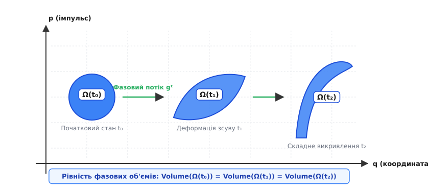
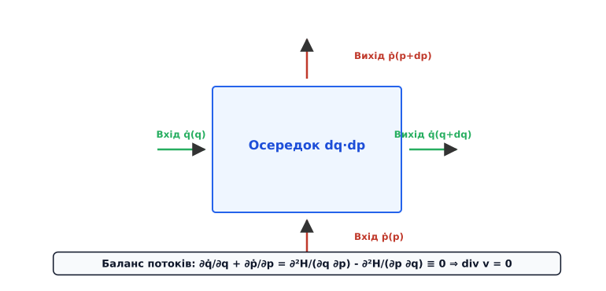
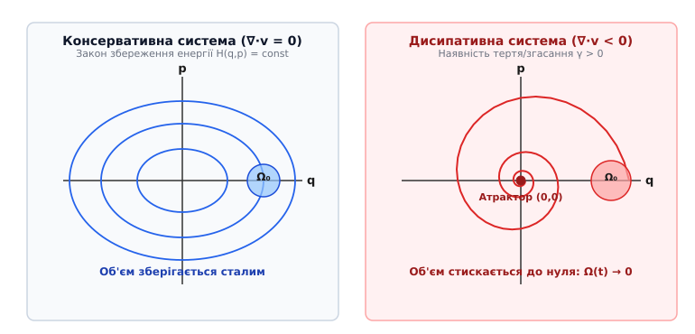
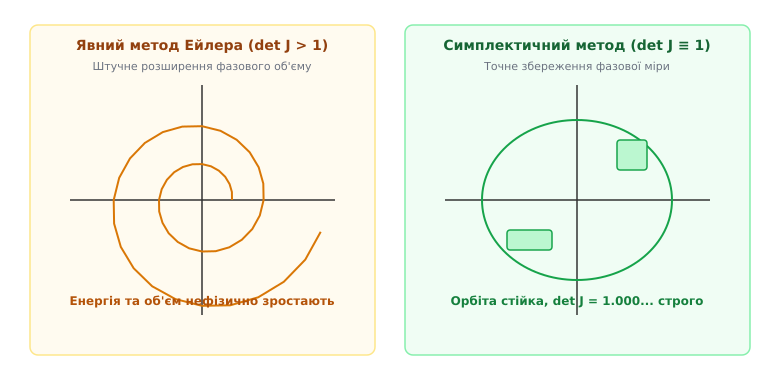

# Теорема Ліувілля

<preknowlist>
- [Фазовий портрет](topic:math-analysis/phase-portrait) — координати (q, p) та поняття фазового простору системи.
- [Свобода та ступені вільності](topic:ph-mechanics/degrees-of-freedom) — узагальнені координати та імпульси гамільтонової механіки.
- [Принцип найменшої дії](topic:ph-mechanics/least-action-principle) — фундаментальне канонічне виведення рівнянь руху.
- [Похідна](topic:math-analysis/derivative) — частинні похідні, градієнт та повна похідна за часом.
</preknowlist>

Уявіть собі величезний статистичний ансамбль, що складається з мільйона одинакових, але абсолютно незалежних між собою механічних систем. Це може бути сфокусований електронний пучок у кільці сучасного прискорювача елементарних частинок, балон із розрідженим ідеальним газом чи сукупність дрібних астероїдів, які рухаються навколо центральної зірки під дією сил тяжіння. Якщо ми спостерігаємо за цими частинками у звичайному тривимірному фізичному просторі конфігурацій, їхня геометрична поведінка здається вкрай мінливою й нестабільною. Повітря з розкритого балона негайно розширюється й заповнює весь наданий об'єм кімнати; електронний пучок без зовнішнього магнітного утримання розлітається убік через власне теплове розсіювання швидкостей; галактична хмара пилу в космосі витягується й змінює свої макроскопічні контури.

Проте якщо перенести опис цієї самої сукупності систем у абстрактний багатовимірний **фазовий простір** (лат. *spatium* — простір), де кожна точка визначає одночасно і повний набір узагальнених координат `q`, і відповідний набір узагальнених імпульсів `p`, перед нами постає фундаментальне геометричне явище дивовижної строгій класичної фізики.

Якою б складною й химерною не ставала форма цієї фазової хмари з часом — як би вона не викручувалася під дією зовнішніх та внутрішніх полів, як би вона не розтягувалася у нескінченно тонкі спіральні ниті й не пронизувала увесь доступний простір, — її загальний гіпероб'єм у фазовому просторі залишається **строго незмінним**. Фазова рідина поводиться як абсолютна несжимаєма рідина: її місцева густина вздовж будь-якої індивідуальної траєкторії руху не змінюється ні на дрібку.

Це фундаментальне твердження класичної механіки довів французький математик Жозеф Ліувілль (фр. Joseph Liouville, 1838). Теорема Ліувілля слугує непорушним містком між мікроскопічними детерміністичними рівняннями Ньютона-Гамільтона та макроскопічним імовірнісним світом термодинаміки й статистичної фізики.



*Еволюція області фазового простору під дією гамільтонового потоку: початковий круглий об'єм Ω(t₀) із часом зазнає зсуву та складного викривлення, але його точна фазова площа Volume(Ω) залишається суворо незмінною.*

## Конфігураційний та фазовий простори: Перехід до мікростанів

У класичній ньютонівській механіці стан однієї частинки описується її радіус-вектором у звичайному тривимірному просторі. Для системи з `N` частинок нам потрібно `3N` координат, які утворюють так званий **конфігураційний простір**. Проте знання лише координат не дозволяє передбачити майбутній рух системи — для цього необхідно знати ще й `3N` швидкостей або імпульсів.

Вирішальний крок робить гамільтонова механіка. Вона об'єднує `N` узагальнених координат `q = (q₁, q₂, ..., q_N)` та `N` узагальнених імпульсів `p = (p₁, p₂, ..., p_N)` у єдиний **`2N`-вимірний фазовий простір**. 

У цьому просторі кожна точка `z = (q, p)` репрезентує один цілісний **мікростан** усього макроскопічного об'єкта. Якщо наша система містить моль газу (`N ≈ 6·10²³` частинок), то точка у `6N`-вимірному фазовому просторі містить вичерпну інформацію про координати й імпульси абсолютно кожної молекули.

Коли газ розширюється у звичайній кімнаті, його координати `q` займають більший об'єм у тривимірному просторі. Проте згідно з законами механіки, це розширення координатного простору обов'язково супроводжується відповідним звуженням або перерозподілом в імпульсному просторі `p`. 

Канонічні перетворення координат (включаючи перехід до змінних «дія-кут») можуть змінювати зовнішній вигляд та сітку фазового простору, проте за теоремою Ліувілля елементарний фазовий гіпероб'єм `dΩ = dq₁ ... dq_N dp₁ ... dp_N` залишається інваріантним відносно будь-яких канонічних трансформацій.

## Механізм фазового потоку: Чому фазовий простір не стискається

Щоб наочно осягнути джерело цієї геометричної непорушності, необхідно детально простежити, як будується математичний апарат фазового простору. Для консервативної механічної системи з `N` ступенями вільності зміна стану у часі описується канонічними рівняннями Гамільтона:

```
q̇ᵢ =  ∂H / ∂pᵢ
ṗᵢ = −∂H / ∂qᵢ
```

де `H(q, p, t)` — функція Гамільтона, що виражає повну енергію системи через її узагальнені координати й імпульси.

Ці рівняння задають у кожній точці `2N`-вимірного фазового простору вектор швидкості зміни стану `v = (q̇₁, ..., q̇_N, ṗ₁, ..., ṗ_N)`. Сукупність усіх цих векторів створює неперервне векторне поле швидкостей — **фазовий потік** `gᵗ`.

Запитаємо: яка дивергенція (розбіжність) цього фазового поля швидкостей? У звичайній гідродінаміці реальних рідин дивергенція поля швидкостей `∇ · v` описує зміну об'єму рідкого елемента. Якщо `∇ · v > 0`, рідина розширюється (у точці є джерело); якщо `∇ · v < 0`, вона стискається (у точці є сток); якщо ж `∇ · v = 0`, рідина є абсолютно несжимаємою.

Проведемо пряме розрахункове обчислення дивергенції фазової рідини у `2N`-вимірному просторі станів за математичним означенням:

```
∇ · v = ∑ᵢ₌₁ⁿ ( ∂q̇ᵢ / ∂qᵢ + ∂ṗᵢ / ∂pᵢ )
```

Підставимо у цю суму канонічні рівняння Гамільтона замість `q̇ᵢ` та `ṗᵢ`:

```
∂q̇ᵢ / ∂qᵢ + ∂ṗᵢ / ∂pᵢ
= ∂/∂qᵢ ( ∂H / ∂pᵢ ) + ∂/∂pᵢ ( −∂H / ∂qᵢ )       [підстановка рівнянь Гамільтона]
= ∂²H / (∂qᵢ ∂pᵢ) − ∂²H / (∂pᵢ ∂qᵢ)              [розкриття частинних похідних]
= 0                                              [симетрія мішаних похідних за Леммою Шварца]
```

Оскільки для будь-якої двічі диференційовної функції Гамільтона `H` порядок узяття частинних похідних за узагальненою координатою `qᵢ` та узагальненим імпульсом `pᵢ` можна міняти місцями (теорема Шварца про рівність мішаних похідних), доданок `∂²H / (∂qᵢ ∂pᵢ)` та доданок `-∂²H / (∂pᵢ ∂qᵢ)` у кожній парі координат строго нищать один одного.

У результаті сума по всіх `N` ступенях вільності дає тотожний нуль у кожній точці фазового простору:

```
∇ · v ≡ 0
```



*Баланс вхідних та вихідних потоків у фазовому осередку dq·dp: прискорення вздовж координати q компенсується відповідним сповільненням вздовж імпульсу p, забезпечуючи нульову дивергенцію div v = 0.*

Цей розрахунок висвітлює фундаментальний фізичний механізм. Всякий раз, коли система під дією внутрішніх чи зовнішніх сил прискорюється вздовж координати `q` (тобто розтягується у координатному просторі), вона неминуче сповільнюється або звужується вздовж імпульсу `p` точно на таку саму величину. Вхідний потік фазових точок у будь-який елементарний об'єм `dq dp` строго дорівнює вихідному потоку. Фазовий потік будь-якої гамільтонової системи є **соленоїдальним** (нестискуваним).

З точки зору вищої математики та симплектичної геометрії (гр. *symplektikos* — сплетений разом), гамільтонів потік зберігає не лише загальний елемент об'єму, а й канонічну симплектичну 2-форму `ω = ∑ dqᵢ ∧ dpᵢ`. По похідній Лі `L_v ω = d(i_v ω) + i_v (dω) = 0` (згідно з формулою Картана), симплектична форма є строго замкненою й інваріантною відносно потоку. Згідно з теоремою Дарбу (фр. Jean-Gaston Darboux), локальна структура фазового простору завжди може бути зведена до канонічних пар `(q_i, p_i)`. Збереження фазового об'єму є безпосереднім наслідком того, що `2N`-й зовнішній ступінь цієї форми `ωⁿ = dq₁ ∧ dp₁ ∧ ... ∧ dq_N ∧ dp_N` є строго інваріантним відносно гамільтонового потоку.

## Дві грани Теореми Ліувілля: Об'єм та Густина ансамблю

Математично теорему Ліувілля формулюють у двох еквівалентних формах — геометричній (через інваріантність об'єму області) та статистичній (через перенос густини ймовірності ансамблю).

### 1. Геометрична форма (Інваріантність фазового об'єму)

Нехай у початковий момент часу `t = 0` якась сукупність початкових станів займає область `Ω(0)` у фазовому просторі з гіпероб'ємом:

```
Ω(0) = ∫...∫ dq₁ ... dq_N dp₁ ... dp_N
```

З плином часу кожна точка цієї області еволюціонує за рівняннями Гамільтона, і область переходить у нове положення `Ω(t)`. Зміна елементарного об'єму описується визначником матриці Якобі (якобіаном) трансформації координат `J(t) = det(∂z(t)/∂z(0))`.

Оскільки дивергенція поля швидкостей дорівнює нулю (`∇ · v = 0`), визначник Якобі задовольняє диференціальне рівняння `d(det J)/dt = (det J) · (∇ · v) = 0`. Враховуючи початкову умову `det J(0) = 1.0`, отримуємо:

```
det J(t) ≡ 1.0
```

Звідси випливає рівність фазових об'ємів області у будь-які моменти часу `t`:

```
Ω(t) = ∫_Ω(t) dq dp = ∫_Ω(0) |det J(t)| dq₀ dp₀ = Ω(0)
```

Це означає, що як би не змінювалася форма області, її точний гіпероб'єм залишається незмінним протягом всієї еволюції системи.

### 2. Статистична форма (Рівняння переносу густини ансамблю)

У статистичній фізиці ми описуємо стан не однієї конкретної системи, а ансамблю з безлічі однакових систем за допомогою **функції розподілу (густини ймовірності)** `ρ(q, p, t)`. Величина `ρ(q, p, t) dq dp` виражає ймовірність знайти систему у елементарному фазовому об'ємі біля точки `(q, p)`.

Оскільки системи у складі ансамблю не виникають і не зникають, густина `ρ` задовольняє закон збереження ймовірності — диференціальне рівняння неперервності у фазовому просторі:

```
∂ρ / ∂t + ∇ · (ρ v) = 0
```

Розкривши дивергенцію добутку скаляра на вектор `∇ · (ρ v) = ρ (∇ · v) + v · ∇ρ` та використавши нульову дивергенцію `∇ · v = 0`, отримуємо спрощене рівняння переносу:

```
∂ρ / ∂t + v · ∇ρ = 0
```

Розпишемо скалярний добуток `v · ∇ρ` у фазових координатах `(q, p)`:

```
∂ρ / ∂t + ∑ᵢ₌₁ⁿ ( q̇ᵢ · ∂ρ/∂qᵢ + ṗᵢ · ∂ρ/∂pᵢ ) = 0
```

Повна (субстанціальна) похідна функції `ρ(q(t), p(t), t)` за часом уздовж траєкторії руху системи дорівнює:

```
dρ / dt = ∂ρ / ∂t + ∑ᵢ₌₁ⁿ ( dqᵢ/dt · ∂ρ/∂qᵢ + dpᵢ/dt · ∂ρ/∂pᵢ ) = 0
```

Це означає: **спостерігач, який переміщується разом із фазовою рідиною вздовж траєкторії руху системи (погляд Лагранжа), вимірює незмінну локальну густину `ρ = const`**. Для непорушного спостерігача (погляд Ейлера) локальна зміна густини описується рівнянням `∂ρ/∂t = -v · ∇ρ`.

Застосувавши канонічні рівняння Гамільтона `q̇ᵢ = ∂H/∂pᵢ` та `ṗᵢ = -∂H/∂qᵢ`, перепишемо суму через класичні **дужки Пуассона** `{ρ, H}`:

```
∂ρ / ∂t + {ρ, H} = 0
```

де дужки Пуассона двох функцій `A` та `B` задаються формулою:

```
{A, B} = ∑ᵢ₌₁ⁿ ( ∂A/∂qᵢ · ∂B/∂pᵢ − ∂A/∂pᵢ · ∂B/∂qᵢ )
```

Алгебра Пуассона володіє важливими властивостями антисиметричності `{A, B} = -{B, A}`, білінійності та виконує тотожність Якобі. Рівняння `∂ρ/∂t + {ρ, H} = 0` є фундаментальним рівнянням Ліувілля. Воно визначає часову еволюцію будь-яких класичних статистичних ансамблів. Строгі математичні доведення для всіх трьох методів та розруб якобіана зібрані у вставці: [Виведення теореми Ліувілля](topic:ph-mechanics/liouville-theorem/math-liouville-proof.md).

## Інваріанти Пуанкаре-Картана та канонічна структура

Окрім збереження повного фазового об'єму `Ω`, гамільтонова механіка дає цілу ієрархію інтегральних інваріантів, відкритих Анрі Пуанкаре та Елі Картаном (фр. Élie Cartan).

Найвідомішим із них є **перший інтегральний інваріант Пуанкаре**: циркуляція векторного потенціалу у фазовому просторі вздовж будь-якого замкненого контуру `C`, який переміщується разом із фазовим потоком, залишається незмінною у часі:

```
I₁ = ∮_C ∑ᵢ pᵢ dqᵢ = const
```

Це геодезичне твердження означає, що орієнтована площа проекції замкненого фазового контуру на канонічні площини `(q_i, p_i)` зберігається при еволюції. Збереження повного `2N`-вимірного фазового об'єму `Ω` є найвищим `N`-м інваріантом у цій послідовності. Якщо ми позначимо інтеграл по `2k`-вимірних замкнених многовидах як `I_k`, то теорема Ліувілля є підсумком збереження всіх нижчих симплектичних інваріантів:

```
I₁ ──> I₂ ──> ... ──> I_N = Volume(Ω) = const
```

Цей канонічний зв'язок гарантує, що гамільтонова механіка не просто зберігає випадкове число, а поважає внутрішню геометрію простору станів на всіх вимірних рівнях.

## Оптичний аналог: Етендю та фотометричний інваріант

Глибоким і практичним підтвердженням універсальності теореми Ліувілля є її аналог у геометричній та хвильовій оптиці. За принципом Ферма, шлях світлового променя в оптичному середовищі описується формалізмом, аналогічним гамільтоновій механіці, де роль функції Гамільтона відіграє показник заломлення `n(r)`.

У геометричній оптиці сукупність променів світла описується у фазовому просторі координат `(x, y)` та кутових напрямків (поперечних імпульсів `p_x = n · sin θ_x`, `p_y = n · sin θ_y`). Фазовий об'єм світлового пучка у цій теорії називається **етендю** (фр. *étendue* — протяжність, охоплення).

Теорема Ліувілля в оптиці стверджує: **жодна пасивна оптична система (лінзи, дзеркала, призми, світловоди) не здатна зменшити етендю світлового пучка**.

```
G = n² · A · Ω = const
```

де `A` — площа поперечного перерізу пучка, `Ω` — тілесний кут його розбіжності, а `n` — показник заломлення середовища.

Звідси випливає фундаментальний фотометричний закон: **жодною оптичною системою лінз неможливо зробити зображення джерела світла яскравішим за сам оригінальний джерело**. Якщо лінза збирає світло у меншу пляму `A`, кут розбіжності `Ω` вимушено зростає точно на таку саму пропорцію, зберігаючи фазовий об'єм світлового пучка `G` строго незмінним.

## Беззіткновна плазма: Рівняння Власова

У фізиці плазми та астрофізиці ми часто маємо справу із середовищами, де зіткнення між окремими частинками відбуваються вкрай рідко, а рух визначається самоузгодженим електромагнітним чи гравітаційним полем. Прикладами є гаряча плазма у термоядерному реакторі, сонячний вітер чи зоряні скупчення у галактиці.

Для таких середовищ функція розподілу `f(r, v, t)` описує густину частинок у 6-вимірному фазовому просторі координат `r` та швидкостей `v`. Оскільки парні зіткнення відсутні, еволюція `f` описується беззіткновним рівнянням Больцмана, яке також називається **рівнянням Власова** (на честь радянського фізика Анатолія Власова, 1938):

```
∂f / ∂t + v · ∇_r f + ( F_self / m ) · ∇_v f = 0
```

де `F_self` — самоузгоджена сила, обчислена з рівнянь Максвелла або Пуассона через інтегральний розподіл заряду та маси.

Рівняння Власова є прямою неперервною формою теореми Ліувілля для полів. Воно стверджує, що навіть у самоузгодженому колективному полі фазова густина беззіткновної плазми зберігається вздовж будь-якої траєкторії. 

Відоме явище **беззіткновного згасання Ландау** (англ. *Landau damping*), за яке Лев Ландау отримав Нобелівську премію з фізики 1962 року, розкриває природу фазового перемішування: хвиля у плазмі згасає не через дисипативне тертя, а через складне витягування фазової області на безліч дрібних нитей без зміни точного фазового об'єму.

## Релятивістська кінетика та загальна теорія відносності

У релятивістській фізиці та астрофізиці сильних гравітаційних полів (поблизу чорних дір та у розширюваному Всесвіті) теорема Ліувілля приймає коваріантну форму.

У 4-вимірному просторі-часі Мінковського чи викривленому просторі-часі Ейнштейна стан частинки задається 4-координатою `x^μ` та 4-імпульсом `p^μ`. Оскільки 4-імпульс частинки маси `m` задовольняє умову на масовій поверхні `p_μ p^μ = -m² c²`, інваріантний елемент фазового об'єму формується з урахуванням цієї масової оболонки:

```
dΩ_rel = d⁴x · d⁴p · δ( p_μ p^μ + m² c² )
```

Узагальнене релятивістське рівняння Ліувілля виражається через оператор Лі-похідної вздовж геодезичних ліній простору-часу:

```
p^μ · ( ∂f / ∂x^μ ) − Γ^μ_αβ · p^α · p^β · ( ∂f / ∂p^μ ) = 0
```

де `Γ^μ_αβ` — символи Крістоффеля, що описують викривлення простору-часу.

Цей релятивістський інваріант Ліувілля пояснює, чому спектральна яскравість реліктового випромінювання Всесвіту `I_ν / ν³` залишається суворо незмінною при розширенні космосу: розширення простору збільшує довжину хвилі фотонів (червоний зсув), але зменшує їхню просторову густину точно у пропорції, що зберігає фазовий об'єм фотонного газу.

## Консервативні проти дисипативних систем: Чому тертя стискає фазовий простір

Слід чітко підкреслити: теорема Ліувілля є справедливою **виключно** для консервативних гамільтонових систем. Вона вимагає відсутності неконсервативних сил — тертя, в'язкого опору середовища, джоульових втрат або випромінювання.

Щойно у фізичну систему додаються дисипативні сили, дивергенція фазового поля швидкостей перестає дорівнювати нулю, і закон збереження фазового об'єму порушується.

Перевіримо це на класичному прикладі гармонічного осцилятора із лінійним згасанням (маятник у в'язкій рідині):

```
q̈ + γ q̇ + ω₀² q = 0
```

Перепишемо це рівняння второго порядку у вигляді системи двох рівнянь першого порядку для координати `q` та імпульсу (швидкості) `p = q̇`:

```
q̇ = p
ṗ = −ω₀² q − γ p
```

Обчислимо дивергенцію фазового поля швидкостей для цієї системи з тертям:

```
∇ · v = ∂q̇/∂q + ∂ṗ/∂p                            [означення дивергенції]
      = ∂(p)/∂q + ∂(−ω₀² q − γ p)/∂p            [підстановка рівнянь руху осцилятора]
      = 0 + (−γ)                                [обчислення частинних похідних]
      = −γ < 0                                  [підсумок: від'ємна дивергенція]
```

Оскільки коефіцієнт в'язкого тертя `γ > 0`, дивергенція `∇ · v = -γ` є строго від'ємною величиною!

Зміна елементарного фазового об'єму з часом описується диференціальним рівнянням `dΩ/dt = -γ Ω`. Інтегрування дає експоненційне стискання фазового об'єму у часі:

```
Ω(t) = Ω(0) · e⁻ᵍᵗ
```



*Фазові портрети консервативної та дисипативної систем: у гамільтоновій системі (ліворуч) орбіти замкнені й фазовий об'єм Ω₀ зберігається; у дисипативній системі з тертям (праворуч) траєкторії спірально сходять до точки спокою (атрактора), стискаючи фазовий об'єм до нуля.*

У дисипативних системах фазовий об'єм експоненційно згасає до нуля (`Ω(t) → 0`), а всі фазові траєкторії необоротно притягуються до геометричних підпросторів меншої розмірності — **атракторів** (англ. *attractors*: точок спокою, граничних циклів у генераторах Ван дер Поля або дивних фрактальних атракторів у системі Лоренца).

У консервативних гамільтонових системах існування атракторів **строго заборонено теоремою Ліувілля**: оскільки фазовий об'єм не може стискатися, траєкторії не можуть збігатися до підпросторів меншої розмірності. Вони назавжди залишаються замкненими або квазіперіодичними на інваріантних торах (теорема Колмогорова-Арнольда-Мозера, KAM-теорема) на поверхнях постійної енергії `H(q, p) = E`.

## Парадокс деформації: Капля чорнила й фазове перемішування

Із теоремою Ліувілля пов'язаний глибокий парадокс, який бентежив фізиків протягом багатьох десятиліть. Якщо фазовий об'єм `Ω(t)` консервативної системи строго зберігається, як тоді система релаксує до стану теплової рівноваги й чому спостерігається зростання макроскопічної ентропії?

Ця суперечність проявилася у двох знаменитих історичних дискусіях XIX століття:
1. **Парадокс оборотності Лошмідта (1876):** Якщо рівняння Гамільтона інваріантні відносно інверсії часу `t → -t`, а фазовий об'єм зберігається, звідки виникає незворотний Другий закон термодинаміки?
2. **Парадокс повернення Цермело-Пуанкаре (1896):** За теоремою Пуанкаре про повернення (яка випливає зі збереження фазового об'єму в обмеженій області), будь-який початковий стан через скінченний час повернуться як завгодно близько до свого вихідного положення.

Розгадка полягає у принциповій відмінності між **значенням об'єму** та **геометричною формою** фазової області, а також у концепції грубозернистого опису. Теорема Ліувілля стверджує збереження величини гіпероб'єму, але не накладає жодних обмежень на складність його геометричної межі.

Для наочності розглянемо класичну аналогію з каплею синього чорнила, яку додали у склянку з водою. Якщо знехтувати молекулярною дифузією й розглядати лише механічний рух рідини, точний фізичний об'єм самої речовини чорнила не змінюється. Проте під дією механічного перемішування початкова компактна крапля витягується у нескінченно довгі, тонкі спіральні стрічки, які пронизують увесь об'єм склянки. Якщо подивитися на склянку здалеку (із некорисним макроскопічним розділенням глаза), вода здасться однорідно блакитною.

```
+--------------------------------------------------------------------------+
|                     ПАРАДОКС ФАЗОВОГО ПЕРЕМІШУВАННЯ                      |
+--------------------------------------------------------------------------+
| Початковий стан:              Фазова еволюція:        Грубозерниста     |
| Компактний об'єм Ω₀           Витягування в ниті      рівновага         |
|                                                                          |
|   ┌───────┐                      /\  /\  /\           ░░░░░░░░░░░░░░░░  |
|   │  Ω₀   │        ───>         /  \/  \/  \   ───>   ░░░░░░░░░░░░░░░░  |
|   └───────┘                    /            \         ░░░░░░░░░░░░░░░░  |
|                                                                          |
| Точний об'єм: Ω(t) ≡ Ω₀       Точний об'єм: Ω(t) ≡ Ω₀  Усереднений об'єм |
| Ентропія: S_exact = const     Ентропія: S_exact = const S_coarse > S₀    |
+--------------------------------------------------------------------------+
```

Точно такий самий процес розгортається у багатовимірному фазовому просторі:

1. **Точна (дрібнозерниста) густина** `ρ(q, p, t)` виконує `dρ/dt = 0`, її точний фазовий об'єм зберігається строго, а точна мікроскопічна ентропія Ґіббса `S = -k_B ∫ ρ ln(ρ) dq dp` є **абсолютно сталою у часі** (`dS_exact/dt = 0`).
2. **Грубозерниста (макроскопічна) густина** `ρ̄`, яка вимірюється фізичними приладами через усреднення по макроскопічних осередках скінченного розміру `Δq Δp`, розмазується по всьому доступному енергетичному шару. Внаслідок цього усреднена макроскопічна ентропія `S_coarse = -k_B ∫ ρ̄ ln(ρ̄) dq dp` зростає до свого термодинамічного максимуму (`dS_coarse/dt ≥ 0`).

З огляду на єдиність розв'язків канонічних рівнянь Гамільтона, фазові траєкторії **ніколи не перетинаються між собою**. Тому топологічно початкова область лишь безперервно деформується й складним чином заплутується, ніде не розриваючись і не накладаючись сама на себе.

## Фундамент статистичної физики: Ансамблі Ґіббса та рівновага

Чому теорема Ліувілля слугує наріжним каменем усієї статистичної термодинаміки? Без неї було б неможливо теоретично обґрунтувати концепцію статистичних ансамблів.

Макроскопічна статистична рівновага означає, що розподіл ймовірностей станів не змінюється з часом. Для функції розподілу `ρ(q, p)` це вимагає умови явного незалежності від часу:

```
∂ρ / ∂t = 0
```

Підставивши цю вимогу у фундаментальне рівняння Ліувілля `∂ρ/∂t + {ρ, H} = 0`, ми отримуємо необхідну умову статистичної рівноваги:

```
{ρ, H} = 0
```

Математично дужки Пуассона `{ρ, H}` дорівнюють нулю тоді й тільки тоді, коли функція розподілу `ρ` залежить від координат `q` та імпульсів `p` **виключно через збережувані інтеграли руху**, найпершим із яких є гамільтоніан `H(q, p)`:

```
ρ(q, p) = f( H(q, p) )
```

Якщо система є ергодичною (її траєкторія з часом щільно заповнює всю доступну поверхню постійної енергії `H(q, p) = E`), то енергія `H` є єдиним гладким збережуваним інваріантом.

Саме з цієї фундаментальної умови Ґіббс строго вивів три класичні рівноважні ансамблі:

- **Мікроканонічний ансамбль** (для ізольованої системи з фіксованою енергією `E`):
  `ρ(q, p) = C · δ( H(q, p) − E )`
  Густина постійна на поверхні постійної енергії й дорівнює нулю поза нею. Постулат про однакову апріорну ймовірність усіх мікростанів спирається саме на збереження фазового об'єму.
- **Канонічний ансамбль** (для системи у термостаті з температурою `T`):
  `ρ(q, p) = (1 / Z) · exp( −H(q, p) / (k_B T) )`
- **Великий канонічний ансамбль** (для системи з обміном енергією й частинками):
  `ρ(q, p, N) = (1 / Ξ) · exp( −(H(q, p) − μ N) / (k_B T) )`

Завдяки теоремі Ліувілля рівномірний розподіл станів у фазовому просторі залишається рівномірним під дією часу, що робить термодинамічну рівновагу стійким і самоузгодженим станом природи. Деталі розгортання цієї теорії та її історичні суперечки описано у вставці: [Історія теореми Ліувілля](topic:ph-mechanics/liouville-theorem/hist-liouville-mechanics.md).

## Приклад: Перевірка на 1D гармонічному осциляторі

Здійснімо точну розрахункову перевірку теореми Ліувілля для одновимірного гармонічного осцилятора з масою `m = 1` та частотою `ω`.

Гамільтоніан системи:

```
H(q, p) = p² / (2m) + ½ m ω² q²
```

Канонічні рівняння руху: `q̇ = p / m`, `ṗ = -m ω² q`. Точний аналітичний розв'язок для фазових координат у момент часу `t` через початкові значення `(q₀, p₀)`:

```
q(t) =  q₀ · cos(ωt) + (p₀ / (m ω)) · sin(ωt)
p(t) = −q₀ · m ω · sin(ωt) + p₀ · cos(ωt)
```

Знайдемо елементи матриці Якобі `J` переходів від початкових координат `(q₀, p₀)` до поточних `(q(t), p(t))`:

```
J = ┌                                         ┐
    │  ∂q(t)/∂q₀            ∂q(t)/∂p₀         │
    │                                         │
    │  ∂p(t)/∂q₀            ∂p(t)/∂p₀         │
    └                                         ┘
  = ┌                                         ┐
    │  cos(ωt)              sin(ωt) / (m ω)   │
    │                                         │
    │ −m ω sin(ωt)          cos(ωt)           │
    └                                         ┘
```

Обчислимо визначник цієї матриці Якобі `det J`:

```
det J = (cos(ωt)) · (cos(ωt)) − (sin(ωt) / (m ω)) · (−m ω sin(ωt))  [визначник 2x2: a·d - b·c]
      = cos²(ωt) + sin²(ωt)                                                [скорочення m·ω та добуток]
      = 1.0                                                                [тригонометрична тотожність: cos²α + sin²α = 1]
```

Визначник `det J ≡ 1.0` залишається строго рівним одиниці для будь-якого моменту часу `t`. Якщо у початковий момент `t = 0` область станів була кругом радіуса `R` (площа `S = π R²`), то з часом цей круг повертається й деформується в нахилений еліпс, але його фазова площа залишається строго рівною `π R²`.

> 🔧 **Навіщо це.**
> Збереження фазового об'єму має вирішальне практичне значення у двох сучасних галузях високих технологій:
>
> 1. **Фізика прискорювачів частинок:** Пучок протонів чи електронів у кільці синхротрона (наприклад, у Великому адронному колайдері CERN) розглядається як фазова хмаринка в 6-вимірному просторі `(x, p_x, y, p_y, z, p_z)`. Гіпероб'єм цієї хмаринки називається **емітансом пучка** (англ. *beam emittance*). За теоремою Ліувілля, жодні магнітні лінзи чи фокусуючі магніти не здатні зменшити фазовий емітанс пучка — вони можуть лише стиснути пучок у просторі координат `x`, збільшивши його розкид за імпульсами `p_x`. Щоб по-справжньому піджати (охолодити) пучок для підвищення світимості колайдера, фізикам доводиться використовувати неконсервативні методи — електронне охолодження (розробка Гірша Будкера) або стохастичне охолодження Саймона ван дер Меєра (Нобелівська премія з фізики 1984 року).
> 2. **Чисельне інтегрування орбіт:** При довготривалому розрахунку орбіт планет чи молекулярної динаміки на мільйони кроків уперед звичайні методи (Ейлера чи Рунге-Кутти) накопичують числову помилку й штучно роздувають або стискають фазовий об'єм. Фізики застосовують спеціальні **симплектичні інтегратори** (Verlet, Leapfrog, Ruth), математична схема яких побудована так, щоб строго зберігати `det J ≡ 1.0` на кожному кроці сітки.



*Чисельна еволюція фазової орбіти: явний метод Ейлера (ліворуч) штучно роздуває фазовий об'єм (det J > 1), тоді як симплектичний інтегратор (праворуч) зберігає фазову міру й тримає орбіту стійкою.*

Перевірити роботу чисельних алгоритмів та ознайомитися з реалізацією коду можна у вставках: [Чисельне моделювання фазового об'єму](topic:ph-mechanics/liouville-theorem/proj-phase-volume.md) та [Інтерфейс фазового простору](topic:ph-mechanics/liouville-theorem/api-phase-space.md).

## Квантовий аналог: Рівняння фон Неймана

У квантовій механіці концепція класичного фазового простору стикається з принципом невизначеності Гейзенберга `Δq Δp ≥ ħ/2`, який забороняє одночасно точно вимірювати координату й імпульс.

Проте аналог теореми Ліувілля зберігається і в квантовому світі. Класична функція густини `ρ(q, p, t)` замінюється на квантовий **оператор матриці густини** `ρ̂(t)`, а класичні дужки Пуассона `{ρ, H}` замінюються на квантовий комутатор:

```
{A, B}  ──>  ( 1 / (i ħ) ) · [Â, B̂]
```

При цьому класичне рівняння Ліувілля перетворюється на квантове **рівняння фон Неймана** (рівняння Ліувілля — фон Неймана):

```
i ħ · ( ∂ρ̂ / ∂t ) = [Ĥ, ρ̂]
```

або у формі квантової похідної:

```
∂ρ̂ / ∂t = − ( 1 / (i ħ) ) · [ρ̂, Ĥ]
```

Еволюція квантової матриці густини описується унітарним оператором `U(t) = exp(-i Ĥ t / ħ)`:

```
ρ̂(t) = U(t) · ρ̂(0) · U⁺(t)
```

Оскільки унітарні оператори зберігають норму й слід матриці (`Tr(ρ̂²) = const`), чистий квантовий стан під дією квантового гамільтоніана ніколи не перетворюється на змішаний стан. Квантовий "об'єм" стану зберігається так само строго, як і класичний фазовий об'єм.

## Розмах і значення теореми

Теорема Ліувілля — це не просто аналітична властивість канонічних рівнянь Гамільтона. Це глибинне геодезичне твердження про те, як природа зберігає інформацію та фазову міру у консервативних процесах.

Збереження фазового об'єму стверджує: **інформація у консервативних фізичних системах не виникає з нічого й не зникає безвісти**. Дві різні початкові мікроскопічні конфігурації у фазовому просторі під дією гамільтонового потоку ніколи не злиються в один стан і ніколи не перетнуться. Навіть при складному витягуванні фазової області у нескінченно тонкі ниті, точний фазовий об'єм залишається непорушним інваріантом.

Усе розмаїття статистичної фізики — від розрахунку тиску й теплоємності ідеального газу до теорії плазми, астрофізичних скупчень галактик та квантової теорії поля — спирається на цей єдиний непорушний факт: **як би не вирував рух частинок, фазова рідина природи не стискається**. Теорема Ліувілля встановлює фундаментальну межу того, як системи еволюціонують у часі, зберігаючи канонічний порядок у самому серці фізичного хаосу.
