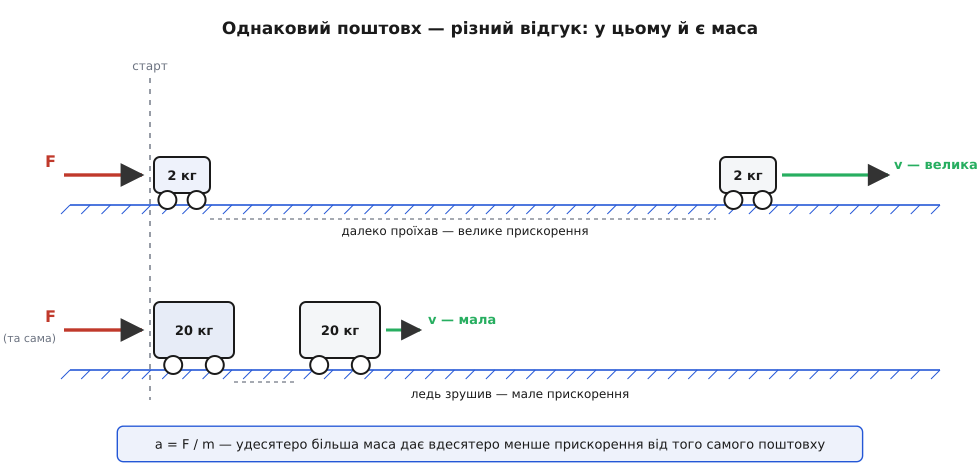
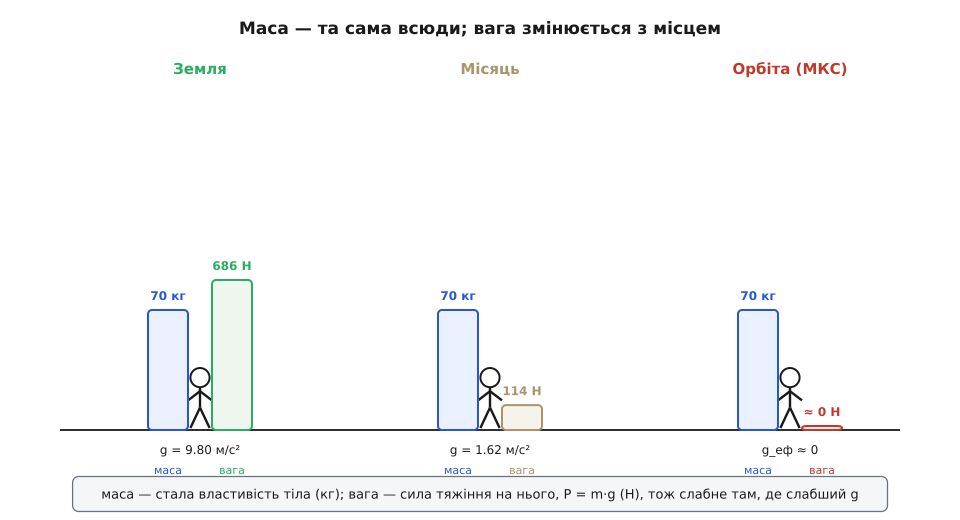
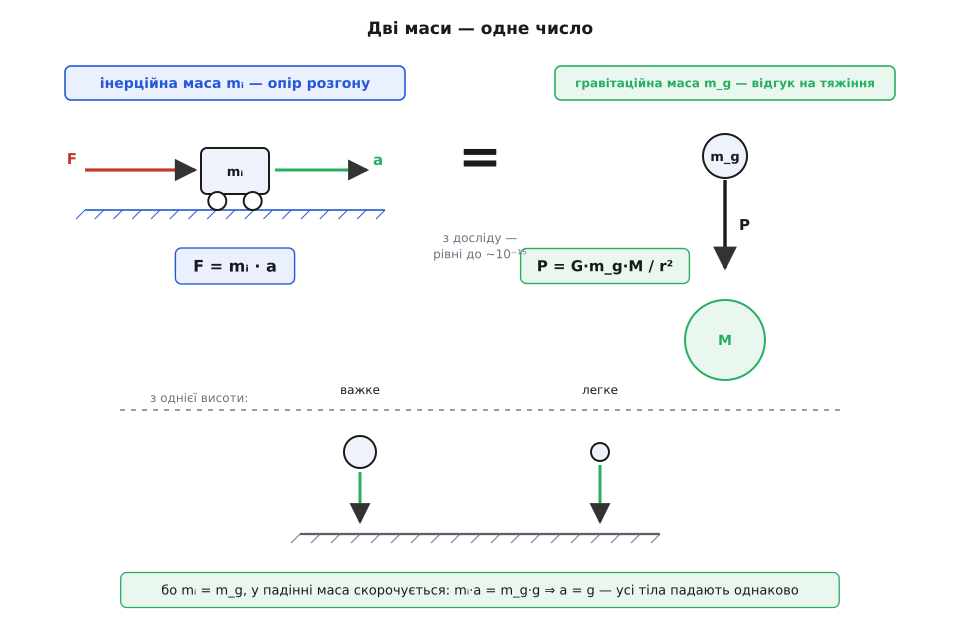
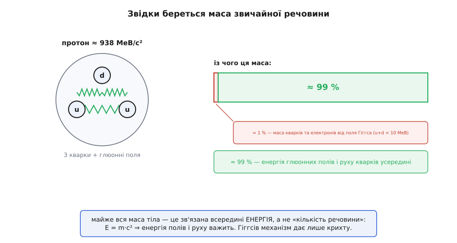

# Маса: міра впертості тіла, а не його вага

<preknowlist>
- [Сила](topic:ph-mechanics/force) — штовхання чи тяжіння, що змінює рух тіла; маса — це те, що зв'язує прикладену силу з відгуком на неї.
- [Прискорення](topic:ph-mechanics/acceleration) — швидкість зміни швидкості; масу означують саме через те, наскільки мляво тіло прискорюється під силою.
</preknowlist>

Уявіть дві однакові з вигляду коробки. Одна порожня, друга по вінця напхана піском. Поставмо обидві на гладенький лід — щоб ані тертя, ані потреба їх піднімати не заважали, — і штовхнімо кожну **однаково сильно**. Порожня зривається з місця й летить; повна ледь-ледь зрушує. Поштовх той самий, а відгук — небо і земля. Оте небажання коробки міняти свій рух, її опір поштовху, і є **маса**. Що більше в тілі маси, то важче його розігнати, і то важче потім спинити.

Слово оманливе своєю буденністю. «Маса» пішла від латинського *massa* — «грудка, вим'ята купа», а те, своєю чергою, від грецького *mâza* (μᾶζα), «замішаний корж» (від *mássō* — «місити»). Тобто спершу це означало просто «шмат речовини». І справді, у побуті маса зливається з двома іншими речами — «скільки тут матерії» і «як воно важко». Та фізична маса — не про це. Вона про **впертість**: наскільки тіло опирається зміні руху. Цю впертість фізики звуть **інертністю** (лат. *inertia* — «млявість, бездіяльність»; сам термін у механіку ввів Кеплер на початку XVII століття), а маса — її точна міра, число.

### Маса як міра інертності

Щоб із «впертості» зробити число, треба її на чомусь спіймати. Спосіб підказує сам дослід із коробками: **прикладімо однакову силу й подивімось на прискорення**. Що більша маса, то менше прискорення від тієї самої сили. Ця залежність не приблизна, а точна й обернена — удвічі більша маса дає рівно вдвічі менше прискорення. Записана рівнянням, вона і є [другий закон Ньютона](topic:ph-mechanics/newtons-second-law):

```
a = F / m        або, що те саме,        F = m · a
```

Звідси маса дістає точне означення: це відношення прикладеної сили до набутого прискорення, m = F / a. Причому — і це головне — у цьому означенні **немає ані слова про тяжіння**. Масу міряють не зважуванням, а розгоном: пхнули відомою силою, поміряли прискорення, поділили. Таку масу звуть **інерційною** — вона каже, як тіло опирається розгону.


*Той самий поштовх F, прикладений до легкого й до важкого візка на гладкому льоду. Легкий набирає велику швидкість, важкий ледь зрушує — бо a = F / m, і більша маса дає менше прискорення. Саме цей опір розгону, а не вага, і є маса.*

**Задача.** До двох тіл на льоду — масою 2 кг і 20 кг — прикладають однакову силу 10 Н. Які прискорення?

```
Легке тіло:  a₁ = F / m₁ = 10 / 2  = 5 м/с²
Важке тіло:  a₂ = F / m₂ = 10 / 20 = 0.5 м/с²

Відношення прискорень:  a₁ / a₂ = 5 / 0.5 = 10,
рівно стільки, у скільки разів друге тіло масивніше.
```

Одна й та сама сила — а прискорення розійшлися вдесятеро, точно за відношенням мас. Це не лише формула для задач: це робочий спосіб **виміряти** масу без жодних терезів. Порівняти дві маси означає прикласти до них однакову силу й глянути, чиє прискорення менше. Як довести, що таке порівняння дає несуперечливе, однозначне число маси — навіть у невагомості, де зважувати нічим, — показано [окремо](topic:ph-mechanics/mass/math-inertial-mass.md).

> 🔧 **Навіщо це.** Саме інерційна, а не «вагова» маса важить, коли тіло треба розігнати чи спинити. Ракеті, щоб змінити швидкість, потрібен імпульс двигуна тим більший, чим більша її маса, — і в невагомості космосу ваги немає, а інертність нікуди не поділася. На Міжнародній станції космонавтів «зважують» саме так: садять у крісло на пружині, розгойдують і за періодом коливань обчислюють масу — бо звичайні терези в невагомості показали б нуль, а тіло від того легшати не стало.

### Маса — це не вага

Тут криється плутанина, яку варто розчистити раз і назавжди, бо в щоденній мові маса й вага — одне й те саме, а у фізиці — різні речі.

**Вага** — це **сила**, з якою тяжіння притягує тіло (точніше — з якою тіло тисне на опору чи натягує підвіс). Як усяка сила, вона міряється в ньютонах і дається добутком

```
P = m · g
```

де g — прискорення вільного падіння в цьому місці. **Маса** ж — стала властивість самого тіла, скільки в ньому впертості; вона в кілограмах і не залежить від того, де тіло опинилося. Різниця стає відчутною, щойно g міняється. Понесіть тіло на Місяць — маса лишиться тією самою, а вага впаде десь вшестеро, бо місячне тяжіння слабше. Виведіть його на орбіту — вага впаде майже до нуля (тіло вільно падає разом зі станцією), а маса й там не зміниться ані на грам: розігнати його буде так само важко, як на Землі.


*Одне тіло в трьох місцях. Синій брусок — маса — скрізь однаковий (70 кг). Зелений/бурий брусок — вага, сила тяжіння P = m·g — високий на Землі, куций на Місяці, майже нульовий на орбіті. Маса належить тілу, вага — місцю.*

**Задача.** Людина масою 70 кг. Скільки вона важить на Землі, на Місяці й на орбіті?

```
Земля  (g = 9.8 м/с²):   P = 70 · 9.8  ≈ 686 Н
Місяць (g = 1.62 м/с²):  P = 70 · 1.62 ≈ 114 Н
Орбіта (вільне падіння): g_еф ≈ 0  →  P ≈ 0 Н

Маса при цьому всюди та сама: 70 кг.
```

Вага змінилася від 686 Н до нуля, маса не зрушила. Тому «схуднути» в невагомості — оманливе відчуття: зникає вага, а маси (і всієї речовини тіла) рівно стільки ж. Щоденне побутове зважування плутає ці дві речі тому, що на Землі g майже стале, і вага виходить просто пропорційна масі — от терези й градуюють одразу в кілограмах, хоч насправді міряють силу. Це зручний обман, який ламається, щойно ви полишаєте земну поверхню. Що таке вага докладніше — коли вона «уявно» більшає в ліфті, що розганяється, і чому на орбіті вона зникає, — [окрема тема](topic:ph-mechanics/weight).

### Дві маси — і диво, що вони рівні

Ми означили масу як опір розгону. Але маса лізе у фізику ще й з іншого, зовсім не спорідненого боку — через **тяжіння**. У [законі всесвітнього тяжіння](topic:ph-mechanics/newton-gravitation) сила притягання пропорційна масам тіл: що масивніше тіло, то дужче воно і притягує, і притягується. Ось тільки це вже інша роль маси. Тут вона не «опір розгону», а радше **гравітаційний заряд** — міра того, наскільки тіло відгукується на тяжіння, як електричний заряд є мірою відгуку на електричне поле.

І от питання, від якого свого часу похитнулася фізика: чому ці дві маси — **інерційна** (опір розгону, з F = m·a) і **гравітаційна** (гравітаційний заряд, із закону тяжіння) — виходять **однаковим числом**? Наперед жодної причини для цього немає. Це наче виявити, що впертість людини завжди точно дорівнює її балакучості: величини різні за суттю, а збігаються до останнього знака. А вони справді збігаються — досліди підтвердили рівність інерційної й гравітаційної маси з приголомшливою точністю, до кількох частин на 10¹⁵.

Наслідок цієї рівності ви бачили тисячу разів, навіть не помітивши. Візьмімо тіло, що вільно падає. Тяжіння тягне його з силою P = m_g · g (тут маса — гравітаційна), а розганяється воно за F = m_i · a (тут маса — інерційна). Прирівняймо:

```
m_i · a = m_g · g

Оскільки з досліду  m_i = m_g,  вони скорочуються:

a = g
```

Прискорення падіння **не залежить від маси взагалі**. Пір'їна й гиря (якщо прибрати повітря) падають пліч-о-пліч, бо важче тіло тяжіння тягне дужче рівно настільки, наскільки дужче воно опирається розгону, — і два ефекти гасяться дощенту. Ще Ґалілео завважив цю дивовижу, а Айнштайн поклав її в самісіньку основу загальної теорії відносності, назвавши [принципом еквівалентності](topic:ph-mechanics/equivalence-principle). Те, що [всі тіла падають однаково](topic:ph-mechanics/free-fall), — не випадковий збіг, а відлуння глибокої рівності двох облич маси.


*Маса входить у фізику двічі: як опір розгону (F = mᵢ·a, ліворуч) і як відгук на тяжіння (P = G·m_g·M/r², праворуч). Досвід показує, що ці два числа рівні. Тому у вільному падінні маса скорочується (a = g) і важке з легким падають разом.*

### Звідки взагалі береться маса

Найпростіша відповідь тягнеться від Ньютона: маса — це **кількість речовини**. Він так і означив її у своїх «Началах» (1687): quantitas materiae, кількість матерії, що дорівнює **густині, помноженій на об'єм**. Ця картина чудово працює на щодень: більший чи щільніший шмат — більша маса. Знаючи [густину](topic:ph-mechanics/density) матеріалу, масу тіла рахують просто з його розмірів.

**Задача.** Сталевий брусок 20 × 10 × 5 см. Густина сталі ≈ 7800 кг/м³. Яка маса?

```
Об'єм:  V = 0.20 · 0.10 · 0.05 = 0.001 м³
Маса:   m = ρ · V = 7800 · 0.001 = 7.8 кг
```

Та щойно ми питаємо «а що таке ця кількість матерії насправді?», ґрунт хитається. Ньютонове означення трохи кружляє на місці: густину він означує через масу, а масу — через густину. Цю кружлявість пізніше загострив Ернст Мах — маса, доводив він, радше зручний спосіб вести облік взаємодій, ніж окрема «річ» у світі. Як народжувалося саме поняття маси — від Ньютонової «кількості матерії» через вікову плутанину з вагою до Махової критики — [окрема історія](topic:ph-mechanics/mass/hist-mass-concept.md).

А коли фізики докопалися до дна речовини, відповідь виявилася приголомшливою. Тіло складається з [атомів](root:basic-chemistry/atoms-molecules), майже вся маса атома — в його ядрі, ядро — з протонів і нейтронів, а ті — з кварків, зшитих полями сильної взаємодії. І от несподіванка: якщо скласти маси самих кварків усередині протона, вийде менш ніж **1 %** маси протона. Решта — близько 99 % — це **енергія**: енергія кварків, що шалено рухаються, і полів (глюонних), що їх зв'язують. За знаменитим E = m·c² ця зв'язана всередині енергія **важить**, і саме вона дає протону, а отже й вам, майже всю масу.


*Маса протона (≈ 938 МеВ/с²) майже вся — не «речовина», а зв'язана всередині енергія: рух кварків і глюонні поля дають ≈ 99 %, а власна маса кварків (від поля Гіггса) — лише ≈ 1 %. Через E = m·c² енергія має масу.*

Тобто «кількість речовини» на дні виявляється переважно **зв'язаною енергією**. Поле Гіггса, про яке стільки говорять, дає власну масу елементарним частинкам (кваркам, електронові) — але для звичайної речовини це лише той крихітний відсоток; левову частку вашої маси становить бурхлива енергія всередині ядер. Що маса й енергія — це взагалі одне й те саме в різних одежах, розкриває [еквівалентність маси та енергії](topic:ph-quantum/mass-energy-equivalence).

> 🔧 **Навіщо це.** Ця енергетична природа маси — не філософія, а робота атомних станцій і Сонця. Коли ядра зливаються чи діляться, енергія їхнього зв'язку міняється, а разом із нею — за E = m·c² — і маса: продукти важать трохи менше, ніж вихідні ядра, і ця «зникла» маса виходить колосальною енергією. У хімічних і механічних процесах ця зміна маси є теж, але настільки мізерна (енергії на багато порядків менші), що маса вважається строго сталою.

### Маса складається й зберігається

У буденному світі — без ядерних перетворень — маса поводиться зразково просто, і на цій простоті стоїть уся механіка й хімія.

По-перше, маса **додається**. Склали два тіла — маси склалися; ця властивість дає змогу говорити про [центр мас](topic:ph-mechanics/center-of-mass) системи й трактувати складне тіло як одну точку з сумарною масою. По-друге, маса **зберігається**: у замкненій системі, хоч би що там відбувалося — тіла зіштовхуються, речовини реагують, — повна маса лишається сталою. Саме це наприкінці XVIII століття встановив дослідами Антуан Лавуазьє: спалив речовину в запаяній посудині — і маса до й після реакції збіглася до крихти; те, що здавалося «зникненням» при горінні, виявилося газами, що відлетіли. (Схожу думку на загальніших, філософських засадах ще раніше висловлював Міхаіл Ломоносов, хоч і без Лавуазьєвої дослідної строгості.) На законі збереження маси виросла вся кількісна хімія.

Ці дві властивості й роблять масу такою зручною міткою тіла. Вона входить у [кількість руху](topic:ph-mechanics/momentum) p = m·v, у [кінетичну енергію](topic:ph-mechanics/kinetic-energy) ½·m·v² — усюди як стала, незнищенна характеристика, за якою тіло можна впізнати й простежити.

### Один кілограм на всіх

Щоб масу міряти, потрібна одиниця — **кілограм** (гр. *chílioi* — «тисяча», тобто тисяча грамів). Понад століття ним був цілком конкретний предмет: платино-іридієвий циліндр під ковпаками в сейфі під Парижем, «Великий К». Чия маса — той і кілограм. Але еталон-річ підступний: його не звірити ні з чим (він і є визначенням), а сам він поволі міняється. Тому 2019 року кілограм відв'язали від предмета й прив'язали до незмінної **сталої Планка** — числа з квантової фізики, яке однакове скрізь і завжди. Тепер кілограм відтворює будь-яка лабораторія приладом, а не звіркою з циліндром. Як це влаштовано й чому саме стала Планка ловить масу — у темі про [базові одиниці СІ](topic:hw-sensing/si-base-units).

Отак одне слово «маса» стягує докупи кілька, здавалося б, різних речей. Це впертість — опір розгону, який відчуваєш, штовхаючи важке. Це гравітаційний заряд — те, чим тіло відгукується на тяжіння, і, як не дивно, точно те саме число. Це — на дні — переважно зв'язана всередині енергія, за E = m·c². І це стала, незнищенна мітка тіла, яку не змінить ані Місяць, ані орбіта. Не вага, що приходить і зникає з тяжінням, а щось глибше й власне тілові: міра того, скільки в ньому всесвіту.
