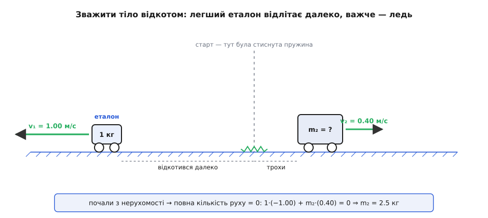
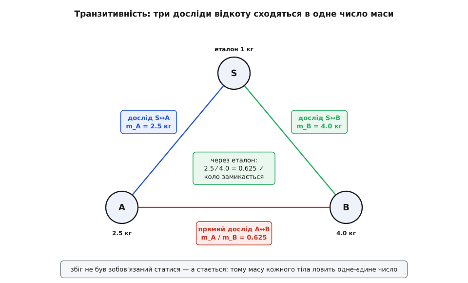
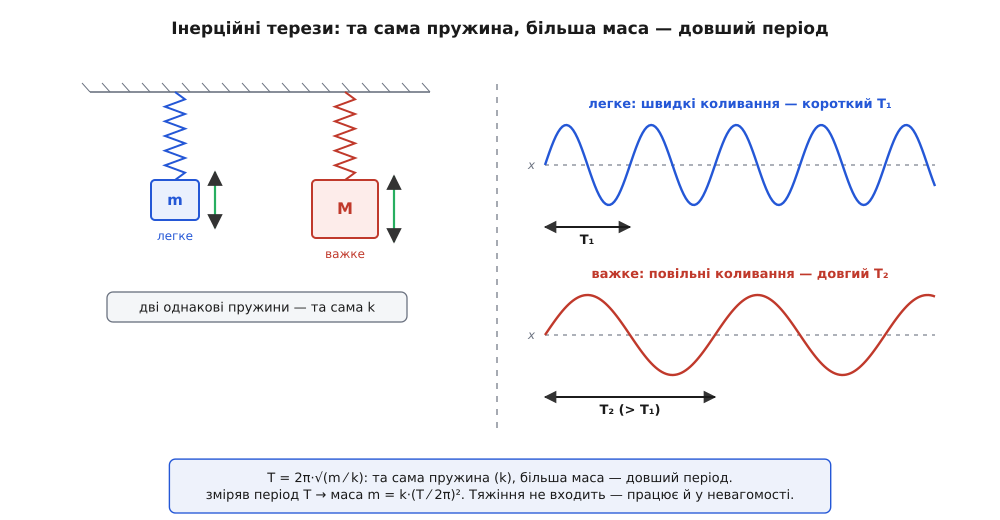

# 🧮 Маса без тяжіння: інерційна маса з відношення прискорень

F = m·a виглядає як готовий рецепт, щоб зміряти масу: пхни тіло силою F, поглянь, з яким [прискоренням](topic:ph-mechanics/acceleration) a воно рушить, поділи — ось і m. Але придивімося, звідки взяти саме F. Найчастіше силу міряють пружинним динамометром, а його поділки колись відкалібрували... знову ж через F = m·a, тобто через відомі маси й прискорення. Виходить коло: масу означуємо через [силу](topic:ph-mechanics/force), а силу — через масу. Ньютонове «кількість матерії дорівнює густині на об'єм» кружляє так само безпорадно, бо густину означують як масу на об'єм. Замкнене коло, з якого саме поняття маси наче не має виходу — а надто там, де ані динамометра, ані ваги під рукою немає.

Вихід знайшов австрійський фізик і філософ Ернст Мах (Ernst Mach, 1838–1916; народився в Моравії, тодішня Австрійська імперія). Його думка була проста й зухвала: означмо масу так, щоб у означенні **не було ані сили, ані пружини, ані тяжіння** — самі лише виміряні прискорення. Бо прискорення можна дістати з голої кінематики: зняти, де тіло було в кожну мить, і двічі продиференціювати. Ніяких приладів сили. І тоді маса перестає кружляти й стає незалежно вимірною величиною.

*(Статус: усталено. Мах оприлюднив це означення у статті «Über die Definition der Masse» (1868, у часописі Carl's Repertorium der Experimentalphysik) і майже незмінним переніс у першу редакцію «Die Mechanik in ihrer Entwicklung» (1883). Молодий Айнштайн, тоді під сильним впливом Маха, читав курс елементарної механіки в Цюрихському університеті в зимовому семестрі 1909–1910.)*

### Означення: відношення прискорень

Візьмімо два тіла, що взаємодіють **лише одне з одним** і ні з чим більше: два візки на гладкому льоду зі стиснутою пружиною між ними, два магніти, дві людини, що відштовхуються в невагомості, або просто два тіла в зіткненні. Спостерігаймо їхні прискорення — і тільки їх (усе меряємо в [інерціальній системі відліку](topic:ph-mechanics/inertial-frame), щоб уявні сили нічого не спотворили).

Три речі впадають в око щоразу. Прискорення напрямлені **протилежно**: одне тіло жене вперед, друге відскакує назад. Їхнє **відношення стале** протягом усієї взаємодії. І — головне — це відношення **залежить лише від самих двох тіл**, а не від того, наскільки тугою була пружина чи сильним магніт. Оце стале число Мах і бере за означення. Позначмо прискорення тіл a₁ і a₂; тоді

```
m₁ / m₂ = − a₂ / a₁
```

Мінус — бо прискорення протилежні, і без нього відношення мас вийшло б від'ємним. Це **означення**, а не виведений закон: відношення мас за домовленістю дорівнює оберненому відношенню прискорень. Масивнішому тілу — менше прискорення.

Часто зручніше дивитися не на миттєві прискорення, а на **зміну швидкостей** за всю взаємодію (для короткого удару прискорення й не поміряти, а відскок — легко). Прискорення — це темп зміни швидкості, тож проінтегрувавши рівність m₁·a₁ = −m₂·a₂ по часу зіткнення, дістанемо те саме через накопичені зміни Δv:

```
m₁ · Δv₁ = − m₂ · Δv₂        ⇒        m₁ / m₂ = − Δv₂ / Δv₁
```

Зверніть увагу, чого тут немає. Немає сили — ми її ні разу не назвали. Немає динамометра — міряли самі швидкості. Немає тяжіння — ані g, ані ваги. Маса випала з чистого руху.

### Інтуїція: хто піддається — той легший

Чому саме **обернене** відношення, а не пряме? Бо маса — це впертість, опір зміні руху. У взаємній штовханині те тіло, що впертіше, поступиться менше: його швидкість зміниться ледь-ледь, тоді як поступливий партнер відлетить далеко. Мала зміна швидкості — велика маса; велика зміна — мала маса. Обернено, точно як велить формула.

Саме число з'являється, щойно ми оберемо **еталон**. Домовмося: ось це тіло має масу рівно 1 кілограм. Тепер будь-яке інше тіло зіштовхуємо з еталоном, міряємо два відскоки — і дістаємо його масу в кілограмах, бо m = 1 кг × (відкат еталона ⁄ відкат тіла). Жодних терезів: тіло «зважене» самим лише спостереженням за тим, як воно й еталон розлітаються.


*Стиснута пружина розкидає еталон (1 кг) і невідоме тіло в різні боки. Легший еталон відлітає швидко, масивніше тіло ледь зрушує. Оскільки почали з нерухомості, повна кількість руху лишається нулем: 1·(−1.0) + m₂·(0.4) = 0. Звідси m₂ = 2.5 кг — маса, знайдена без жодних терезів.*

**Задача. Зважити тіло відкотом.** Еталон 1.000 кг і тіло невідомої маси стоять на льоду, між ними стиснута пружина. Відпускаємо. Еталон відкочується ліворуч зі швидкістю 1.00 м/с, невідоме тіло — праворуч зі швидкістю 0.40 м/с. Яка його маса?

```
Почали з нерухомості, тож повна кількість руху = 0 і до, і після:
   1.000·(−1.00) + m₂·(+0.40) = 0
   m₂ = 1.000 · 1.00 / 0.40 = 2.5 кг
```

Тіло масивніше за еталон у два з половиною рази — і ми дізналися це, ані разу його не піднявши й не зваживши, самим спостереженням за відкотом.

### Три тихі дива, без яких число не мало б сенсу

Означення красиве, але воно лише тоді чогось варте, коли числа, які воно родить, **несуперечливі**. А несуперечливість тут спирається на три дослідні факти. Жоден із них не випливає з логіки — усі троє могли б і не справдитися; те, що вони справджуються, і є справжній фізичний зміст маси.

**Перше: відношення не залежить від способу дії.** Ті самі два тіла можна штовхнути пружиною, магнітом, електричним відштовхуванням, зіткненням — і відношення прискорень щоразу виходить **однакове**. Якби пружина давала 2.5, а магніт — 3.0, то «маса» була б властивістю не тіла, а способу штовхання, і числа на боці коробки просто не існувало б.

**Друге: відношення стале протягом усієї взаємодії**, а не лише в середньому. У кожну мить m₁·a₁ = −m₂·a₂; це рівносильно тому, що [кількість руху](topic:ph-mechanics/momentum) (її ще звуть імпульсом) зберігається щомиті, а не тільки від початку до кінця.

**Третє, найглибше: транзитивність** (лат. *transitivus* — «перехідний»). Зміряймо тіло A об еталон S — дістанемо m_A. Зміряймо B об той самий S — дістанемо m_B. А тепер зіштовхнімо A з B **напряму**, без еталона. Відношення, яке при цьому вийде, **мусить** дорівнювати m_A ⁄ m_B, порахованому з двох перших вимірів. Коло замикається.


*Кожне ребро трикутника — окремий дослід із відкоту. Виміри S↔A і S↔B дають маси A і B через еталон. Прямий вимір A↔B міг би дати будь-що — а дає рівно 2.5⁄4.0 = 0.625, як велить ланцюг через еталон. Цей збіг — не логіка, а властивість нашого світу; саме він дозволяє повісити на кожне тіло одне-єдине число маси.*

**Задача. Перевірка транзитивності.** Еталон S = 1 кг і два тіла A, B. Три досліди «відпусти стиснуту пружину з нерухомості», щоразу міряємо лише швидкості відкату (у м/с, протилежні напрями).

```
Дослід S↔A:  S відкотився на 1.00,  A — на 0.400
             m_A / m_S = 1.00 / 0.400 = 2.5   →   m_A = 2.5 кг
Дослід S↔B:  S відкотився на 1.20,  B — на 0.300
             m_B / m_S = 1.20 / 0.300 = 4.0   →   m_B = 4.0 кг
Дослід A↔B:  A відкотився на 0.800, B — на 0.500
             m_A / m_B = 0.500 / 0.800 = 0.625

Перевірка:
   через еталон:  m_A / m_B = 2.5 / 4.0 = 0.625
   прямий вимір:  m_A / m_B         = 0.625      ✓
```

Третій дослід **не був зобов'язаний** узгодитися з першими двома — а узгодився. Щоб відчути, наскільки це не гарантовано, уявімо світ, де коло не замикалося б: перемноживши три виміряні відношення по колу A→B→S→A, ми діставали б не одиницю, а, скажімо, 1.2. Тоді жодного тіла не можна було б позначити однією масою — маса була б відношенням між парами, як спорідненість, а не власним числом тіла. Наш світ, на щастя, інакший: відношення не залежить від способу дії, а коло замикається точно в одиницю.

Ось де прихована глибока думка Маха. Маса — не таємнича «кількість речовини», захована десь усередині тіла. Маса — це той набір чисел (по одному на тіло), з якими бухгалтерія взаємодій **сходиться**: у кожній парі відкати обернені до цих чисел, і всі пари між собою узгоджені. Існування такого несуперечливого набору — і є все, що означає слово «маса».

### Назад до F = m·a і третього закону

Маючи маси, здобуті з самого руху, можна пройти коло у зворотний бік — і тепер уже **означити силу** як F = m·a. І тут стається приємне. Наш дослідний факт m₁·a₁ = −m₂·a₂ миттю обертається на

```
F₁ = − F₂
```

— сили рівні за величиною, протилежні за напрямом. Це [третій закон Ньютона](topic:ph-mechanics/newtons-third-law), «дія дорівнює протидії», і він випав **сам**, як наслідок означення маси, а не як окремий постулат, що його треба десь роздобути.

Так аналіз Маха розтинає Ньютонову механіку на дві різні за природою частини. Що тут **домовленість** (означення маси й сили), а що — **справжній закон природи**: незалежність відношення від способу дії, транзитивність, а в системах багатьох тіл ще й те, що сили додаються векторно. Плутати ці дві речі — означає не бачити, де у фізиці людська умовність, а де відкриття про світ. [Другий закон](topic:ph-mechanics/newtons-second-law) F = m·a у цьому світлі — почасти означення сили, а почасти твердження, що та сама маса, зважена відкотом, керує тілом і під будь-якою іншою силою.

Є й коротший спосіб побачити те саме. Проінтегруймо m₁·a₁ = −m₂·a₂ по часу — дістанемо m₁·Δv₁ + m₂·Δv₂ = 0, тобто повна кількість руху m₁·v₁ + m₂·v₂ не міняється. Це можна прочитати навпаки: **маси — це саме ті коефіцієнти, з якими комбінація Σ m·v зберігається** в будь-якій замкненій системі, хоч би як тіла взаємодіяли. Маса означена так, щоб кількість руху зберігалася; збереження кількості руху й існування несуперечливої шкали мас — два обличчя одного факту.

Насамкінець, операційне означення чесно віддає й **додавання** маси: жорстко склей два тіла, зміряй відкат склейки об еталон — вийде рівно m₁ + m₂. Тому складне тіло можна трактувати як одну точку із сумарною масою в його [центрі мас](topic:ph-mechanics/center-of-mass). Але й це — дослідний факт, а не тавтологія: у світі з іншою фізикою маса могла б і не бути простою сумою.

> 🔧 **Навіщо це.** Операційна, «кінематична» маса — не філософія, а щоденний інструмент там, де ваги безсилі. Масу супутника на орбіті (скажімо, скільки лишилося палива в баках) міряють, увімкнувши двигун відомої тяги й дивлячись на набуте прискорення: m = F ⁄ a — те саме Махове означення, тільки еталоном тут слугує калібрований двигун. Так само перевіряють інерцію станції перед маневром і «зважують» космонавтів кріслом на пружині. Скрізь, де немає ані опори, ані тяжіння, лишається інертність — і саме її ловить це означення.

### Маса без ваги: крісло на пружині

Тепер — де все це працює найяскравіше. На орбіті звичайні терези показують нуль: тіло разом зі станцією вільно падає, вага P = m·g зникла. Але **інертність нікуди не поділася** — розігнати космонавта в невагомості так само важко, як на Землі. А означення Маха тим і сильне, що ваги йому й не треба; йому досить руху. Лишається спіймати інертність якимось рухом, який можна виміряти голим годинником. Такий рух є — коливання на пружині.

Посадімо тіло на пружину. Пружина повертає його до рівноваги силою, пропорційною зсуву (закон Гука): F = −k·x, де k — жорсткість пружини. Підставмо це в F = m·a:

```
m · a = − k · x
a = − (k/m) · x
```

Прискорення завжди дивиться до рівноваги й тим більше, чим далі відхилення, — а це і є [гармонічне коливання](topic:ph-waves/harmonic-oscillator) з кутовою частотою ω = √(k ⁄ m). Період — час одного повного хитання туди-назад — виходить

```
T = 2π / ω = 2π · √(m / k)
```

Ось де сховалася маса: **у темпі**. Легке тіло пружина сіпає туди-сюди швидко, важке — мляво; більша інертність дає довший період. І тяжіння в цій формулі немає жодного — тільки маса, жорсткість і час. Зміряй період, знай жорсткість — і маса випадає:

```
m = k · (T / 2π)²
```


*Дві однакові пружини (та сама k) з різними тілами. Легше гойдається з коротким періодом, важче — з довгим; запис коливань у часі прямо показує різницю. Період T = 2π√(m⁄k) залежить від маси, а не від тяжіння, тому такі «інерційні терези» однаково працюють на Землі й у невагомості.*

**Задача. Зважити космонавта в невагомості.** Інерційні терези станції Skylab — це крісло на пружині жорсткістю k = 606 Н/м. Порожнє крісло гойдається з періодом T₀ = 0.815 с. Космонавт сідає — період став T = 2.29 с. Яка його маса?

```
Ефективна маса самого крісла (з калібрування порожнім ходом):
   m₀ = k·(T₀/2π)² = 606·(0.815/6.283)² = 606·0.01683 ≈ 10.2 кг

Маса «крісло + космонавт»:
   m_заг = k·(T/2π)²  = 606·(2.29/6.283)²  = 606·0.13283 ≈ 80.5 кг

Маса космонавта:
   m = m_заг − m₀ = 80.5 − 10.2 ≈ 70.3 кг
```

Сімдесят кілограмів — і жодного тяжіння в розрахунку, лише пружина й секундомір. На Землі ця людина «важила» б близько 690 Н, на Місяці — 114 Н, а тут не важить нічого; та її інерційна маса як була 70 кг, так і лишилась, і крісло чесно її показало.

*(Статус: усталено. Параметри — реальні характеристики приладу Body Mass Measurement Device зі Skylab: k = 606 Н/м, період порожнього крісла 0.815 с, формула T = 2π√(m⁄k) за експонатом Смітсонівського музею авіації й космонавтики.)*

### Що з усього цього виходить

Маса, якщо копнути до дна, — не «скільки тут речовини» і поготів не вага. Це число, яке тіло несе на собі так, що всі його зіткнення сходяться в один рахунок: у кожній взаємній штовханині відкати обернені до цих чисел, а самі числа між собою узгоджені й додаються при склеюванні. Таке число можна дістати з голого руху — відношенням прискорень об еталон, — не питаючи ані про силу, ані про тяжіння. Тому його однаково чесно міряє льодова доріжка на Землі й крісло на пружині на орбіті. Уся впертість тіла, весь його опір розгону стиснуто в цей єдиний коефіцієнт — і саме він, а не вага, входить далі в кількість руху, у другий закон, у центр мас. Мах лише показав, як його спіймати, не замкнувшись у колі.
